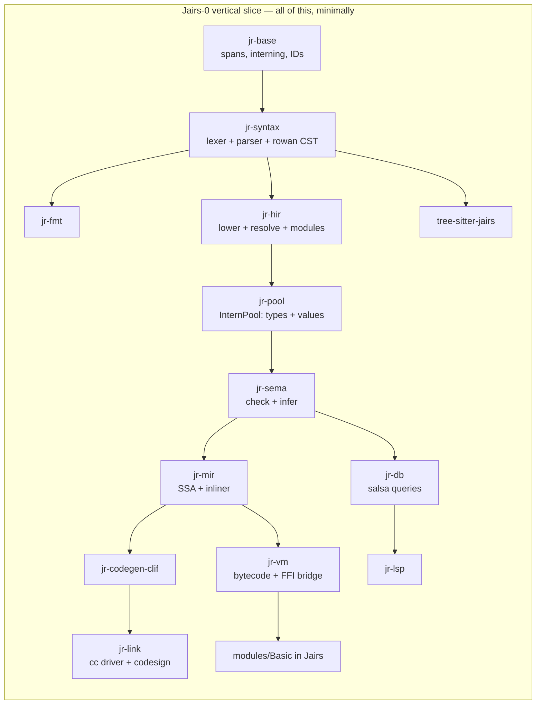
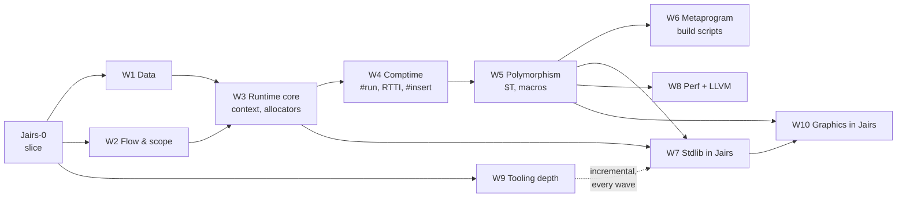
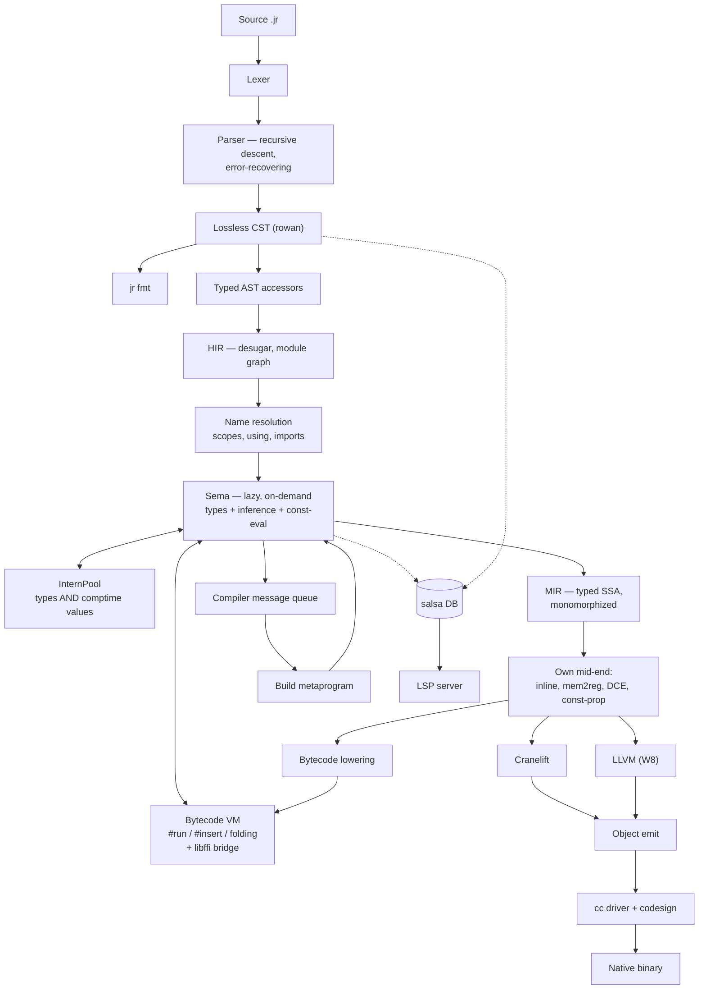

# Jairs — a Jai-like systems language in Rust

**Working name:** Jairs · **Source extension:** `.jr` · **Host language:** Rust (2024 edition)

> [!NOTE]
> **Strategy: tracer bullet, then thickening waves.**
> We do *not* build the compiler layer by layer. We first drive one absurdly small language subset all the
> way through **every** component — lexer, parser, CST, HIR, Sema, MIR, VM, Cranelift, linker, FFI, stdlib
> module, LSP, tree-sitter, formatter — until `hello.jr` is a native macOS binary and the LSP gives hover on
> it. Everything works, badly. *Then* we thicken it one feature-slice at a time.

---

## 0. Locked decisions

| # | Decision | Choice |
|---|---|---|
| 1 | Fidelity | **Jai-inspired, own language.** You own the spec. |
| 2 | Backend | **Cranelift first, LLVM later** behind a `Backend` trait. |
| 3 | Compile-time execution | **Bytecode VM over our own MIR.** Host-independent, trappable. |
| 4 | Parser | **One hand-written error-recovering parser** (rowan lossless CST), shared by compiler + LSP. tree-sitter is a *separate* editor grammar, CI-gated against drift. |
| 5 | Stdlib | **Written in Jairs itself**, like Jai. Core + OS + tooling first, graphics stack later. |
| 6 | Scope | **Solo, long-term serious, macOS arm64 first.** Linux x86-64 green in CI from the first native binary. |
| 7 | Build order | **Vertical slice first, then feature waves.** No component is "phase 2". |

### 0.1 Design questions — now resolved

| Question | Decision | Consequence |
|---|---|---|
| `context` ABI | **Hidden trailing parameter**; `#c_call` procedures opt out | Encoded in MIR's calling convention from day one. Function *types* carry a context flag. |
| Integer overflow | **Always trap** | Needs explicit wrapping operators (`+%`, `-%`, `*%`) or hash functions, PRNGs, and checksums become unwritable. **Added to Tier A.** Trap = a real runtime panic with a source location, and a *compile error* when detectable at comptime. |
| Bounds checks | **Like Jai: a build setting**, visible in the IR | MIR carries explicit `bounds_check` ops that a build-config pass strips. `#no_abc` opts out locally. |
| String representation | `{data: *u8, count: s64}`, **not** NUL-terminated | `to_c_string()` bridges to `#foreign` via temporary storage. |
| Polymorph identity | **Structural, on interned comptime arguments** — *my call* | An instantiation is keyed by the tuple of resolved comptime arg IDs in the InternPool, so `sort(Entity)` from two files dedupes to one function. Errors *display* nominally (`sort($T = Entity)`) so users see intent, not a key. Structural is required anyway once `Type` is a first-class comptime value. |
| Comptime FFI | **Yes**, gated behind `#foreign_at_comptime` | VM needs libffi-style dynamic calls. Non-negotiable given build scripts must read files. |
| Error handling | **Start exactly like Jai** — multiple returns + `#must` | But: reserve an **effect row slot in the function type representation** now, so an effects system can be added later without re-typing every signature. Costs nothing today; saves a rewrite. |

---

## 1. The vertical slice — "Jairs-0"

> [!IMPORTANT]
> **Definition of done for the slice:** `jr build examples/hello.jr` produces a signed native arm64 binary
> that prints when run; `jr run` executes the same file in the VM; opening it in a real editor gives
> diagnostics, hover and goto-definition; Neovim highlights it via tree-sitter; `jr fmt` round-trips it; and the
> printing itself comes from a stdlib module **written in Jairs** that calls libc via `#foreign`.

### 1.1 The Jairs-0 language subset

Deliberately tiny. Everything else is a later wave.

```jr
#import "Basic";                       // module system: one module, one file

Point :: struct { x: s64; y: s64; }    // structs, one level

add :: (a: s64, b: s64) -> s64 {       // procs, single return
    return a + b;
}

MESSAGE :: "hello from Jairs\n";       // constants
COMPUTED :: #run add(2, 3);            // one trivial comptime call

main :: () {
    p: Point;                          // decls: typed, and inferred below
    p.x = 4;
    sum := add(p.x, COMPUTED);         // := inference
    if sum > 5  print(MESSAGE);        // if
    i := 0;
    while i < 3 { i = i + 1; }         // while
    ptr := *sum;                       // pointer take + deref
    print(MESSAGE);
}
```

Included: `s64`, `u8`, `bool`, `string`, `*T`, `struct`, procs, `:=` / `: T` / `::`, `if`, `while`, `return`,
arithmetic (**trapping**), comparison, assignment, field access, pointer take/deref, `#import`, `#foreign`,
one `#run`.

> [!NOTE]
> `u8` is in the slice, not deferred to W1, because the string representation
> (`{data: *u8, count: s64}`, ADR-0004) and the libc `write` signature are both spelled in `*u8`. Choosing
> "stdlib in Jairs" forced this: you cannot express the bottom of the standard library without it. `u8`
> arithmetic and the rest of the numeric tower still wait for W1.

Excluded from the slice: arrays, `for`, `defer`, `using`, enums, unions, polymorphs, macros, `#insert`,
overloading, multiple returns, `context`, RTTI, floats, and the remaining numeric types. Each arrives as a
wave.

### 1.2 The slice's stdlib — `modules/Basic/`, in Jairs

This is the proof that decision #5 works. Roughly 40 lines of Jairs:

```jr
// modules/Basic/module.jr
libc :: #system_library "c";

write :: (fd: s64, buf: *u8, count: s64) -> s64 #foreign libc "write";

print :: (s: string) {
    write(1, s.data, s.count);
}
```

> [!CAUTION]
> **Correction found while building this: `print_int` is NOT implementable in Jairs-0.**
> Turning a digit into a byte for `write` needs an `s64` → `u8` conversion, and `cast` is reserved
> until W1. Every alternative needs something the slice also lacks — a `[N]u8` buffer (W1), pointer
> arithmetic (not in the subset, and no type checker yet to stop it being written by accident), or
> libc `printf` (variadic, and the arm64 variadic ABI passes variadic arguments on the stack, so a
> non-variadic `#foreign` declaration would silently produce garbage). Integer printing therefore
> lands with `cast` in **W1**, and the slice's exit criterion prints strings only.
>
> This is exactly the kind of constraint the tracer-bullet ordering exists to expose, and it cost
> minutes instead of being discovered during W7's stdlib push.

> [!WARNING]
> This forces `#foreign`, the string ABI, and the module loader into the **first** slice. That is the
> intended consequence of "stdlib in Jairs" — you cannot defer FFI to a later milestone if the bottom of
> your standard library is a syscall.

### 1.3 Slice work breakdown

Every crate gets created and does real work. Nothing is stubbed out with `todo!()` at the architectural level.



| Component | Slice scope | Why it can't wait |
|---|---|---|
| `jr-base` | Spans, `FileId`, `lasso` interner, `slotmap` arenas, newtype IDs | Everything depends on it |
| `jr-diag` | Diagnostic model + `annotate-snippets` rendering | Error quality is a design constraint, not a polish task |
| `jr-syntax` | Hand lexer (all tokens, trivia preserved), recursive-descent parser for the subset, **error recovery**, rowan CST, typed AST accessors | Recovery shape is hard to retrofit; LSP depends on it |
| `jr-fmt` | Formatter over the CST | Cheapest proof the CST is genuinely lossless |
| `jr-hir` | Lowering, module graph, `#import` resolution, scopes | Establishes the resolution model |
| `jr-pool` | InternPool for types **and** comptime values | Retrofitting interning is a rewrite. Steal Zig's design. |
| `jr-sema` | Lazy, on-demand checking; `:=` inference; one `#run` | Lazy-from-day-one is the whole reason M6-class comptime is possible later |
| `jr-mir` | Typed SSA, mem2reg, DCE, **a real inliner** | Cranelift has no inlining — it must exist before any backend |
| `jr-vm` | Register bytecode + interpreter + libffi bridge | It *is* the comptime engine; also gives `jr run` before any backend works |
| `jr-codegen` | `Backend` trait | Defining it now keeps LLVM from becoming a fork |
| `jr-codegen-clif` | Cranelift lowering, AArch64 AAPCS, Mach-O | The native path |
| `jr-link` | `.o` via `cranelift-object`, then shell out to `cc`; ad-hoc codesign | macOS binaries don't launch unsigned |
| `jr-db` | salsa 0.28 queries: file → tokens → CST → HIR → types | **The** reason the LSP won't be a fork of the compiler |
| `jr-lsp` | `lsp-server` loop: diagnostics, hover, goto-def | Proves the salsa boundary is real |
| `tree-sitter-jairs` | `grammar.js` + `highlights.scm` + corpus | Establishes the drift gate |
| `modules/Basic` | `print` / `print_line` via `#foreign` to libc `write` | Proves stdlib-in-Jairs |
| `tests/corpus` | ~20 `.jr` files: spec examples = parser tests = tree-sitter tests | One corpus, two parsers, CI-enforced |

### 1.4 Slice exit criteria

- [x] `jr fmt` byte-identically round-trips every corpus file — enforced by the
      `jairs-fmt` CI gate over `valid/`, `imports/valid/`, `tests/corpus/modules/`
      and `modules/`. `invalid/` is excluded on purpose: those files do not parse,
      and `jr fmt` correctly refuses to format input it could not parse.
- [x] `jr check broken.jr` recovers and reports multiple errors with rustc-grade
      rendering — `invalid/009-multiple-independent-errors.jr` asserts at least
      four independent errors from one file.
- [x] `jr run hello.jr` executes in the VM — `jr run tests/corpus/valid/024-hello.jr`
      prints both lines and exits 0. Asserted by `jr-cli`'s
      `run_executes_the_slice_exit_criterion`.
- [x] `jr build hello.jr && ./hello` — native arm64, launches, correct output.
      `jr build tests/corpus/valid/024-hello.jr` links through `cc` and the binary
      prints both lines and exits 0, byte-identically to the VM. Asserted by
      `jr-cli`'s `the_slice_exit_criterion_produces_output_in_both_engines`.
- [x] `COMPUTED :: #run add(2,3)` folds at compile time — folded by `jr-db`'s
      `file_consts` query (ADR-0018 §3) and interned, so it is indistinguishable
      from a literal: the MIR snapshot for `020-run-directive.jr` now reads
      `5_s64 + 1_s64`. VM and native now agree, by the differential harness below.
- [x] `print` comes from `modules/Basic` written in Jairs, via `#foreign` to libc
      `write` — executes, through libffi (ADR-0018 §4). ADR-0004's `{data, count}`
      is handed to `write` with no copy.
- [x] Integer overflow traps, in both the VM and native, with a source location —
      both engines trap and both name the line, byte-identically: `error: addition
      overflowed` then `  --> path:line:col`, exit status 4. ADR-0020 put the one
      formatter in `jr-base` so that a message chosen at *compile* time by the back
      end and one built at *run* time by the VM cannot drift, and
      `a_trap_names_its_source_location_identically_in_both_engines` compares the
      finished bytes. A trap on a compiler-invented value still reports without a
      location, which is `MirSpan::Synthetic` being honest rather than a gap.
- [x] An editor gives diagnostics, hover and goto-def over the real protocol — **by
      Neovim, and there will be no VS Code extension** (ADR-0036). This criterion named
      VS Code as its example and the example was wrong for this project: the decider does
      not use it, so a packaging target there is unverifiable in practice and would rot the
      way this box's Neovim half rotted before ADR-0025. The *intent* — a real editor, over
      LSP 3.17, against the real binary — is met twelve capabilities over, and
      `crates/jr-cli/tests/lsp_stdio.rs` asserts the protocol independently of any client.
      Closed rather than abandoned: five consecutive handoffs listed "a VS Code extension"
      as owed work nobody intended to do, which makes the whole list less trustworthy.
- [x] Neovim: tree-sitter highlighting — and diagnostics, hover and goto-definition
      besides. `editors/nvim/` is a runtimepath directory needing no plugin manager
      (ADR-0025); two lines in `init.lua` and one build script. Verified by
      `nvim --headless -u NONE -l editors/nvim/verify.lua`, 67 checks against the real
      editor and the real server. Verified rather than gated: Neovim is not a build
      dependency of this workspace.
- [ ] CI green on macOS arm64 **and** Linux x86-64 — the matrix is configured for
      both; only macOS arm64 has been verified locally.
- [x] CI drift gate: every corpus file parses cleanly in *both* the compiler and
      tree-sitter
- [x] Differential test harness exists: every corpus program's output must match
      under VM and native — `crates/jr-cli/tests/differential.rs`, which runs both
      engines as subprocesses and compares stdout, **stderr** and exit status. It
      enumerates the corpus itself rather than listing cases, so a new program is
      covered the day it is added. Because only two corpus programs print anything,
      it also carries cases that make a computation observable through `exit`, which
      is what gives it teeth: arithmetic, precedence, division truncation, loops,
      block parameters, `break`, pointers, short-circuit `&&`, struct field offsets,
      and both traps.

**Estimated: 10–14 weeks solo.** This is the milestone that decides whether the project is real.

### 1.5 Where the slice actually is

Status of each slice component, so this is answerable without reading the tree.
"Done" means implemented, tested, and green under every CI gate — not polished.

| Component | Status | Notes |
|---|---|---|
| `jr-base` | **Done** | Spans, `FileId`, `lasso` interning, `newtype_index!`, source map, the one trap-message formatter (ADR-0020 §2) |
| `jr-diag` | **Done** | Diagnostic model + `annotate-snippets` renderer |
| `jr-syntax` | **Done** | Lexer, error-recovering parser, rowan CST, typed AST. `OPERATOR_KW` and `OPERATOR_DECL` for `operator + :: (…)`, with its own `parse_item` arm because that dispatch is on `IDENT`; E0126 covers a malformed declaration, and *which* operators may be overloaded is deliberately sema's question (ADR-0048). `AUTOCAST_EXPR` and `MEMBER_EXPR` for `xx expr` and `.RED`, with `XX_KW` and `DOT` added to `EXPR_START` — the token-set predicate trap, now checked in advance (ADR-0046). `UNION_TYPE` sharing `FIELD_LIST` with `STRUCT_TYPE`, and `union` **out** of the reserved-keyword refusal — the third keyword to make that trip after `cast` and `enum`. `TYPE_START` gained `UNION_KW`, `ENUM_KW` and `FLAGS_KW`, which were all missing (ADR-0045). `VIEW_TYPE` and `SLICE_EXPR` for `[]T` and `buf[]`, each a *separate kind* rather than a bracket form with an absent child, so a view cannot be confused with a malformed array; **E0124 keeps only its `[..]T` clause** (ADR-0044). `FLAGS_KW` — the first keyword added since the slice, and deliberately *outside* `is_reserved_keyword`'s range (ADR-0043). Bitwise operators with **non-C precedence** — bitwise above comparison, shifts between `+` and `*` — plus `~` and five compound assignments, and **E0122 is retired** (ADR-0042). `ENUM_TYPE`/`MEMBER_LIST`/`MEMBER` for `enum { … }` (ADR-0041); a float literal parses rather than being refused, and **E0120 is retired** (ADR-0040). `ARRAY_TYPE` and `INDEX_EXPR` for `[N]T` and `a[i]`, with `[]T` and `[..]T` refused by name (ADR-0039); `CAST_EXPR` is a real node, not a reserved-keyword refusal (ADR-0037 §3). `///` and `//!` are distinct trivia kinds (ADR-0027) |
| `jr-fmt` | **Done** | Formatter; corpus is canonical under it, CI-enforced. `format_operator_decl` is its own function, because `format_const_decl` reads a `NAME` child an operator declaration does not have — sharing would have emitted `` :: `` with an empty name (ADR-0048). `AUTOCAST_EXPR` and `MEMBER_EXPR` each got an emitter arm *and* an `is_expr_kind` entry; without the latter every `xx` was deleted, leaving `small: u8 = ;` — verified by reverting (ADR-0046). `format_struct_type` reads its keyword from the *node kind*, because emitting a literal `"struct {"` rewrote `union` to `struct` — verified by reverting it (ADR-0045). `VIEW_TYPE` and `SLICE_EXPR` each got their own arm *and* an entry in the kind predicates — the fourth wave running where a missing predicate entry would have deleted a construct (ADR-0044). The enum keyword is read from the *token*, because emitting a literal `"enum"` rewrote `enum_flags` and changed the program's meaning (ADR-0043). `ENUM_TYPE` needed adding to the kind predicate **and** to the const-declaration dispatch — one alone left `Colour :: ;` (ADR-0041). `ARRAY_TYPE` and `INDEX_EXPR` are in both for the same reason (ADR-0039). Comments inside a struct body used to be deleted outright — fixed in the doc-comment wave |
| `jr-hir` | **Done** | Lowering, name resolution, flat import merge (ADR-0014). `ConstValue::Operator(ProcId, BinOp)`, whose name interns as the synthetic `operator+` so it lands in the ordinary name map — and the duplicate-name scan **exempts** overloads, because one operator legitimately has many and they all share that name (ADR-0048 §1). `bin_op_of_token` is now shared by the declaration and `lower_bin_op`, so the two cannot disagree. `Expr::Autocast` and `Expr::Member`, both carrying **no type**: `xx` has no syntax for one and a bare member names no scope, so sema supplies both from the context (ADR-0046). `ConstValue::Union` and `TypeRef::Union` index the **same arena** a struct does, with `Struct::is_union` carrying the kind: a separate arena would give a struct and a union at the same index one `DeclId`, and they share `Pool::struct_fields` (ADR-0045 §4). `TypeRef::View` and `Expr::Slice`, both distinct variants because `TypeRef::Array`'s `len: None` already means "not a usable literal" (ADR-0044 §1). `ConstValue::Enum` beside `Struct`, because ADR-0012 makes both instances of one `name :: value` form. `TypeRef::Array` and `Expr::Index`; the array length is *read* here and judged by `jr-sema` (ADR-0039 §3a). A leading `-` on a literal is folded in during lowering, so `Literal::Int` carries a signed `i128` rather than a magnitude (ADR-0038) |
| `jr-pool` | **Done** | `Item::UnionType` — nominal like a struct, sharing its field side table, with **every field at offset 0** and a size that is the largest field's; the two lines that make a union a union, both here because a layout disagreement between the engines would be *invisible* rather than a crash (ADR-0045 §3). `Item::ViewType`, structural and nesting like `PointerType`, whose layout is a **shared** `{data, count}` pair that `string` now computes through as well — one arithmetic, two identities (ADR-0044 §1). `Pool::find` looks a type up without interning, for the back ends that hold `&Pool` and need a view's `*T`. `Item::EnumType` carries `flags`, and `IntKind::of` answers `s64` for an enum so both evaluators treat a combination as the integer operation it is (ADR-0043). `IntOp` covers `& | ^ << >>` and `int_not`, with `IntTrap::ShiftOutOfRange` for a count outside the width (ADR-0042). `Item::EnumType` with members in a side table, nominal and keyed on `DeclId` like a struct (ADR-0041 §4). `FloatKind` beside `IntKind`, with IEEE-754 arithmetic that has no error path at all — the visible shape of ADR-0040 §1. `IntKind::from_name`/`NAMES` is the one list of integer type names (ADR-0037 §1) — Types + comptime values in one pool (ADR-0015, ADR-0016 §3); layout (ADR-0018 §2), now including `ArrayType`'s stride-times-length (ADR-0039 §3); ADR-0002's integer arithmetic, shared by both evaluators (ADR-0022 §2) |
| `jr-sema` | **Done** | Signatures + checking (ADR-0016). Operator overloading: resolution is an **exact** match on `(operator, lhs, rhs)` looked up *before* `unify_operands` so a mixed-type overload is reachable, with ADR-0014 §3's order — local shadows imported, two imports are E0211. E0246 covers all four refusals (wrong arity, a reserved operator, the orphan rule, a genuine duplicate), each with its own note. `has_operators` is the early exit that makes builtin arithmetic pay nothing (ADR-0048). `xx` and bare `.RED` — one idea, both reading `expected` and both refusing rather than inventing a fallback: E0242/E0243 for `xx` with no context or on a literal, E0244 for a bare member with no context or a non-enum one, and E0238 shared with the qualified form so the two spellings cannot disagree about which members exist (ADR-0046). `xx` delegates to ADR-0037 §2's conversion rule unchanged, so it is legal exactly where `cast` is. `union` as a nominal type whose field access, `no_such_field` diagnostic and near-name suggestion are all a struct's unchanged — `SigKind::Union` exists only so a diagnostic does not call a union a struct (ADR-0045 §5). `[]T` views with **no implicit conversion** from an array: `buf[]` is an explicit operator, and E0240 is a *specific* diagnostic whose help names it rather than the generic mismatch. E0239 refuses slicing a non-array, a view, or an expression with no storage; E0241 refuses `==` on a view, because "same storage" and "same contents" are both plausible (ADR-0044). `enum_flags` numbers by powers of two, with `& | ^ ~` yielding the flags type and shifts refused (ADR-0043); three refusal messages that each name the right remedy. Bitwise operators are integers or `enum_flags`, and a shift's operands deliberately need not share a type (ADR-0042 §2, §5). `enum` with Jai's numbering rules — auto from 0, and an explicit value makes *later* members continue from it — plus E0237/E0238 and a member suggestion (ADR-0041). `float32`/`float64` with context-typed literals and **no** fit check — an out-of-range float saturates, where an out-of-range integer is E0204 (ADR-0040 §5); `%` and the wrapping operators are refused on floats with the reason (§7). `[N]T` and `a[i]`, with E0233 for a non-literal length, E0234 for indexing a non-array, E0235 for a non-integer index and E0236 for a literal index proven out of range (ADR-0039). The full integer tower and `cast(T, x)`, a fit check against each type's *range* rather than its maximum magnitude (ADR-0038), whose literal fit check *is* ADR-0016 §1's (E0232 for a non-integer). E0212 and E0218 suggest a near name (ADR-0031 §1), and `FileSignatures` records which import each *type* name came from — `ResolveMap` cannot see a `TypeRef::Name` (§2). No const-eval: that is `jr-vm` |
| `jr-db` | **Done** | salsa queries: module loader, sema, MIR built *and* optimized, const-eval, run, doc comments, workspace discovery, unused imports (ADR-0007, ADR-0014, ADR-0018 §3, ADR-0021 §1, ADR-0027 §2, ADR-0029, ADR-0031 §3). E0231 is the project's first *warning*; **E0245 is its second and the first to report a compiler gap** rather than a program error — a refused body warns, and `run_main` fails hard when it is `main`, which replaced an ICE reaching the user (ADR-0047 §2) |
| `jr-cli` | **Done** | `jr check` (with `--module-path`), `jr fmt`, `jr parse`, `jr run`, `jr build`, `jr lsp`, `jr bench` (ADR-0033 — reports latency, never judges; not a gate). Two of its rows are not client requests but the parse/resolve split that decided ADR-0034 |
| `tree-sitter-jairs` | **Done** | Grammar + queries; drift gate green, and every query file is now compiled against the grammar (ADR-0025 §4) |
| `tests/corpus` | **Done** | 116 files, incl. `type-errors/` and `cfg-errors/` — one file per diagnostic. `imports/valid/008` is the first to use an enum across a module boundary; `valid/038` exercises a mixed-type overload in **both** operand orders, which is the only way ADR-0048 §4's no-ranking rule is visible |
| `modules/Basic` | **Done** | Written, resolving, type-checking and **executing**; MIR snapshotted. **`print_int` now exists** (ADR-0037 §4) — recursive, because `[N]u8` is still owed |
| `jr-mir` | **Done** | Typed SSA, Braun construction, CFG diagnostics (ADR-0017); an operator overload lowers to an **ordinary direct call** — no new node, no new callee kind, and inlinable on the same terms as any small procedure — reading `jr-sema`'s resolution rather than repeating it, and the dump names one `operator + #3` so four overloads of one operator stay distinguishable in a snapshot (ADR-0048 §5). An enum member is found through the expression's **type**, so an *imported* enum works and `enum_member_of` is deleted — and a name denoting a *type* no longer needs a runtime value to pass `scan` (ADR-0047 §1). **No new node for `xx` or `.RED`** — the first lowers through the existing `cast` path and the second through the enum-member constant fold, which is the payoff for ADR-0037 §2 having put the conversion in `Rvalue::Convert` (ADR-0046). Store-to-load forwarding now tracks the receiver *type* along a projection path, because two different fields of a **union** share storage and the "first difference means disjoint" rule was a live wrong answer — a narrow write read back through the wide field gave 0 where 7 was written (ADR-0045). `Projection::ViewData`/`ViewCount` — separate from `StringData`/`StringCount` because the *result types* differ, and both engines type a place from the projection alone — and `Projection::Index` now accepts a pointer place, so a view element and an array element share one stride computation. The bounds check gained its first **runtime** length, which is what ADR-0039 §1's operand-shaped `len` was built for (ADR-0044). `escape.rs` treats `Expr::Slice` as an escape, which is defence in depth rather than a live fix — an array was never register-representable — and a test pins it at the escape set rather than at promotability. A shift is the one binary form whose operands may differ in type, which the verifier now allows for exactly those two operators (ADR-0042 §2); `Rvalue::Convert` carries a `NumKind`, so one field still determines which of `cast`'s four directions applies and the verifier's source check keeps working (ADR-0040 §3); `Projection::Index`, `Statement::BoundsCheck` — the explicit op ADR-0003 asked for in the slice and never got — and `Statement::Zero`, whose absence was a live miscompile (ADR-0039 §1, §4a); `Rvalue::Convert` for `cast`, with the verifier checking its recorded source kind against the operand's (ADR-0037); a mid-end of four passes — inliner, store-to-load forwarding, const-prop, DCE — behind `optimize` (ADR-0021, ADR-0022, ADR-0023). Forwarding is block-local, refuses two unequal indices as possibly-aliasing; no SROA |
| `jr-vm` | **Done** | Register bytecode, interpreter, libffi bridge (ADR-0018); a view's two words reach the same offsets `string`'s do, through the same `jr-pool` helpers, so the two engines cannot drift about its layout (ADR-0044); floats need **no new `Value` variant** — a float is its bits and the interpretation comes from the type — but they *are* dispatched before the bit-compare fallback, which would answer `NaN == NaN` and `-0.0 == 0.0` backwards (ADR-0040); `PlaceStep::ScaledIndex`, `Instr::Zero` and `Instr::BoundsCheck` with an unsigned compare, so one test covers both ends of a range (ADR-0039); `Instr::Convert` wraps via the same `IntKind::wrap` const-prop uses, so folding and running cannot disagree; per-instruction spans, so a trap names its line (ADR-0020 §4); arithmetic via `jr-pool` (ADR-0022 §2). No JIT tier |
| `jr-codegen` | **Done** | Three-phase `Backend` trait, no `cranelift-*` type in it (ADR-0009, ADR-0019 §1) |
| `jr-codegen-clif` | **Done** | MIR → Cranelift IR, layout via `jr-pool`, traps through a generated helper (ADR-0019); a view is an aggregate in `Repr`, and its element place is a load of the `data` word followed by the *same* stride arithmetic an array's index uses — one helper replaced the array-only one rather than sitting beside it (ADR-0044); `fadd`/`fcmp`/`fneg` and the **saturating** `fcvt_to_sint_sat`, because the trapping form would put a trap back on a path ADR-0040 §1 made trap-free and disagree with the VM; `emit_small_memset` for a zeroed aggregate and an unsigned `icmp` into the existing cold trap block for a bounds check (ADR-0039); `ireduce`/`sextend`/`uextend` for a cast, with equal widths a pass-through because Cranelift rejects both. Aggregate params only; aggregate returns and indirect calls refused |
| `jr-link` | **Done** | `cranelift-object` bytes, then `cc`; ad-hoc codesign is a fallback because `ld64` already signs |
| `jr-codegen-llvm` | **Not started** | Wave W8 owns it (ADR-0019 §5) |
| `jr-lsp` | **Done** | Twelve capabilities over `jr-db` queries: diagnostics, hover, goto-definition, completion + resolve, references, documentHighlight, prepareRename + rename, documentSymbol, workspaceSymbol, **code actions**, **signatureHelp**, **inlay hints** (ADR-0024, ADR-0028, ADR-0030, ADR-0031). Rename is workspace-wide and refuses rather than half-renaming. No semantic tokens. The notification loop dispatches a job only after every write (ADR-0032): the old order let the no-watcher re-walk cancel `didOpen`'s diagnostics, publishing nothing |
| `jr-driver` | **Not started** | Still a one-line stub, but the workspace notion it was owed now exists in `jr-db::workspace` (ADR-0029) and it should consume that rather than invent a second |
| `editors/nvim` | **Done** | Runtimepath directory: LSP, tree-sitter parser + symlinked queries, filetype, ftplugin (ADR-0025). Neovim 0.11+. **Verified, not gated** — `editors/nvim/verify.lua`, 103 checks, needs an editor CI does not have. Thirty of them assert tree-sitter's *node kinds* — and, for bitwise, its *nesting* — because ADR-0010's drift gate counts errors and cannot see a wrong tree. The view checks assert that `[]T` and `[N]T` produce *different* kinds, which a shared rule would have hidden |
| VS Code extension | **Will not be built** | ADR-0036. `jr lsp` is editor-agnostic and any LSP client can use it; the repository packages for Neovim only. The facts a reversal would need — no builtin LSP host, no tree-sitter API, `vscode-languageclient` is plain CommonJS — are recorded in the ADR |

Accepted ADRs: 0001–0048. See [`docs/adr/README.md`](docs/adr/README.md).
Spec chapters written: 00 (overview), 01 (lexical), 02 (declarations),
03 (scoping and resolution). A type-system chapter is owed: ADR-0015 and ADR-0016
plus `jr-sema`'s crate docs are the only record of the typing rules today.

`jr-mir`'s mid-end is **four passes** behind `jr_mir::optimize` (ADR-0022 §3): the
inliner (ADR-0021), store-to-load forwarding (ADR-0023), constant propagation, and
dead-code elimination, run to a bounded fixed point because they feed each other.
`jr run` and `jr build` both consume the result through `optimized_file_mir`. There
will never be a `mem2reg` (ADR-0017 §2 makes it unnecessary rather than deferred).

**`024-hello.jr` now optimises.** Forwarding is what unlocked it: the `Point` slot
disappears entirely, `4 + 5` folds to `9`, `9 > 5` folds to `true`, the `if`
collapses, and DCE removes the arm that cannot run. The `ptr.* == 9` branch survives,
correctly — it reads through a real pointer, which forwarding refuses.

What is still missing is **cross-block forwarding** and **SROA**. Forwarding is one
walk per block, so a value written before a loop and read inside it stays in memory;
and a whole-slot store never feeds a field load, because MIR cannot extract a field
from a value — which is why `modules/Basic`'s `print` keeps its slot. The SSA value
arena is also never compacted, so a dead definition keeps its register (ADR-0022's
follow-on work).

No pass touches a body compile-time evaluation can reach (ADR-0021 §2), and the
check is the query's rather than each pass's. That is what keeps §3.1's invariant
true rather than merely likely: comptime runs MIR lowered inside `file_consts`,
which is upstream of the optimized query, so freezing the `#run` closure makes the
two engines run bit-identical MIR for every body either of them could disagree
about.

ADR-0002's integer arithmetic now has **two** implementations rather than three:
`jr-pool` owns the one both *evaluators* use, and `jr-codegen-clif` keeps its own
because it emits code rather than evaluating. The remaining pair is held equal by
`differential.rs` and nothing else, which ADR-0022 §2 states rather than implies.

Layout exists once, in `jr-pool` (ADR-0018 §2), and `jr-codegen-clif` calls it
rather than computing its own — the obligation ADR-0018 §2 exists to create, which
no verifier can enforce. What now guards it is
`crates/jr-cli/tests/differential.rs`: a struct field at a different offset in the
two engines changes an observable answer, and that test compares observable answers.

The toolchain floor is **rustc 1.94**, because `cranelift-codegen 0.134.2`'s
dependency chain requires it. `rust-toolchain.toml` still floats on stable.

---

## 2. Thickening waves

> [!IMPORTANT]
> **The rule that makes this work: a wave is not done until it has been pushed through every layer.**
> Every wave's checklist is the same eight items. If a feature parses but the LSP doesn't understand it, or
> tree-sitter can't highlight it, or the VM and native backend disagree about it, the wave is not done.

### 2.0 Per-wave definition of done

- [ ] **Spec** chapter written in `docs/spec/`
- [ ] **Corpus** files added (they *are* the spec examples)
- [ ] **Parser** + error recovery + `fmt`
- [ ] **Sema** + diagnostics with good spans
- [ ] **MIR** lowering + **VM** + **Cranelift**, verified equal by differential test
- [ ] **LSP** understands it (hover, completion, goto where applicable)
- [ ] **tree-sitter** grammar + highlight queries updated; drift gate green
- [ ] **Stdlib** uses it where it should (dogfooding is the acceptance test)

### 2.1 Wave order

| Wave | Content | Notes | Est. |
|---|---|---|---|
| **W1 — Data** | Full numeric tower (`s8..s64`, `u8..u64`, `float32/64`), wrapping ops `+% -% *%`, `enum`, `enum_flags`, `union`, `[N]T`, `[]T` views, `[..]T` dynamic arrays, `cast()`, `xx` autocast, operator overloading | Dynamic arrays need allocators → pulls `context` forward | 8–10 wks |
| **W2 — Flow & scope** | `for` with `it`/`it_index`, `for <`, labeled `break`/`continue`, `defer`, `using` (namespace + field promotion), multiple return values, named/default args, `#scope_*` visibility | `using` is the first genuinely hard resolution problem | 6–8 wks |
| **W3 — Runtime core** | `context` (hidden param, `#c_call` opt-out), allocators, temporary storage, bounds-check build config, panics/traps with backtraces | Unlocks a real stdlib | 6–8 wks |
| **W4 — Comptime** | Full `#run` (arbitrary code), aggressive const folding, RTTI (`Type` values, `type_info()`, `Any`), `#insert`, `#code`, the `Code` type | **Hardest wave.** Sema ↔ VM become mutually recursive; cycle detection with readable errors is the deliverable | 10–14 wks |
| **W5 — Polymorphism** | `$T`, `$$T`, `#modify`, `#bake_arguments`, `#expand` macros + hygiene, instantiation caching, **instantiation backtraces** in diagnostics | Depends on W4's InternPool value identity | 8–12 wks |
| **W6 — Metaprogram** | Workspaces, compiler message loop, `#run build()` build scripts replacing makefiles, plugin hooks, `@note` attributes | The Jai superpower. Build scripts become the build system. | 6–8 wks |
| **W7 — Stdlib** | In Jairs: `Basic`, `String`, dynamic array / hash table / bucket array, `Sort`, `Math` (vec/mat/quat), `Random`, `File`, `File_Utilities`, `Process`, `Thread` + atomics, `Time`, `Socket`, `JSON`, `Compiler` | Runs partly in parallel with W5/W6; each module is a wave-acceptance test | 14–18 wks |
| **W8 — Performance** | LLVM backend via `inkwell` (`--release`), inliner maturity, `#soa`, SIMD vectors, `#align`/`#place`, parallel Sema + parallel codegen, published compile-throughput number | Three-way differential testing: VM ≡ Cranelift ≡ LLVM | 10–14 wks |
| **W9 — Tooling depth** | Full LSP surface (completion, refs, rename, signature help, semantic tokens, **inlay type hints**, code actions), richer DWARF (locals, struct layouts) for lldb, Neovim packaging (VS Code descoped by ADR-0036; any LSP client works unpackaged) | Incremental all along; this is the "make it excellent" pass | 8–10 wks |
| **W10 — Graphics, in Jairs** | `Window_Creation` (Cocoa via `#foreign`), GPU layer (Metal, then Vulkan), immediate-mode 2D renderer, image decode, immediate-mode UI, audio (CoreAudio/ALSA) | All *library* work, written in Jairs — no compiler changes. Gated on W5+W7. | 6+ months |

### 2.2 Wave dependency graph



---

## 3. Architecture

### 3.1 Pipeline



> [!IMPORTANT]
> **The load-bearing invariant:** comptime and runtime execute *the same* MIR. The VM consumes bytecode
> lowered from the identical MIR that Cranelift consumes. Any other arrangement guarantees `#run` and
> runtime silently disagree. This is Zig's model (ZIR → Sema → AIR) and it is correct.

### 3.2 Crate layout

```
jairs/
├── Cargo.toml                  # workspace
├── crates/
│   ├── jr-base/                # spans, FileId, interning, arenas, newtype IDs
│   ├── jr-diag/                # diagnostic model + annotate-snippets rendering
│   ├── jr-syntax/              # lexer, parser, SyntaxKind, rowan CST, typed AST
│   ├── jr-fmt/                 # formatter over the CST
│   ├── jr-hir/                 # desugared tree, module graph, scopes, resolution
│   ├── jr-pool/                # InternPool: types + comptime values
│   ├── jr-sema/                # checking, inference, polymorph instantiation
│   ├── jr-mir/                 # typed SSA IR + mid-end (incl. inliner)
│   ├── jr-vm/                  # bytecode, interpreter, comptime FFI bridge
│   ├── jr-codegen/             # Backend trait + shared lowering
│   ├── jr-codegen-clif/        # Cranelift
│   ├── jr-codegen-llvm/        # LLVM (feature = "llvm")
│   ├── jr-link/                # object emit + linker driver + codesign
│   ├── jr-db/                  # salsa database — shared by driver and LSP
│   ├── jr-driver/              # workspaces, message loop, build metaprograms
│   ├── jr-lsp/                 # language server
│   └── jr-cli/                 # the `jr` binary
├── modules/                    # standard library, written in Jairs
├── examples/
├── tests/corpus/               # shared syntax corpus (compiler + tree-sitter)
├── tree-sitter-jairs/          # separate editor grammar
└── docs/{spec,adr}/
```

### 3.3 Infrastructure choices

Versions verified 2026-07-25. **Pin exact versions for `cranelift-*` and `salsa`.**

| Concern | Choice | Version | Why |
|---|---|---|---|
| CST | `rowan` | 0.16.1 | rust-analyzer's red/green tree. `cstree` 0.14 only if `Send` trees are needed later. |
| Lexer | hand-written | — | `logos` is regex-per-token; nested comments + `#`-directive context are awkward. ~400 lines you own. |
| Parser | hand-written | — | Error-recovery quality *is* LSP quality. No generator delivers this. |
| Diagnostics | `annotate-snippets` | 0.12.16 | Literally rustc's renderer → rustc-identical output. |
| Incrementality | `salsa` | 0.28.1 | From the slice, not later. RA-proven. API churns — pin exactly. |
| Backend | `cranelift-*` | 0.134.2 | x86-64 + aarch64 with Apple Silicon CC. **APIs are not semver-stable.** |
| Objects / DWARF | `object`, `gimli` | 0.39.1 / 0.34.0 | Emit `.o`, shell out to `cc`. Never hand-roll Mach-O linking. |
| LSP transport | `lsp-server` | 0.10.0 | Sync, you own threading — correct pairing with salsa. `tower-lsp` is stale (2023). |
| LSP types | `lsp-types` | 0.97.0 | Stale but standard; LSP 3.17. |
| Golden tests | `insta` | 1.48.0 | Snapshot CST/HIR/MIR/diagnostics. |
| Fuzzing | `cargo-fuzz` + `arbitrary` | 0.13.2 / 1.4.2 | Parser fuzzing from the slice. |
| Interning | `lasso`, `slotmap`, `bumpalo` | 0.7.3 / 1.1.1 / 3.20 | rustc style: intern everything, index by `u32` newtypes. |
| tree-sitter | `tree-sitter` + CLI | 0.26.11 | Editor grammar only. |
| Comptime FFI | `libffi` (Rust bindings) | — | Required by `#foreign_at_comptime`. |

> [!WARNING]
> **Cranelift has no function inlining**, and only limited loop optimization (LICM/GVN/const-fold via its
> egraph mid-end). Codegen is ~14% slower than LLVM, but it compiles ~10× faster. The inliner must live in
> *your* MIR mid-end — which you need anyway for `#expand` macros and comptime.

---

## 4. Timeline

| Phase | Cumulative (solo, serious) |
|---|---|
| **Jairs-0 vertical slice** — everything works, badly | **~3 months** |
| W1–W3 — a real, usable procedural language | ~8–10 months |
| W4–W5 — comptime + polymorphism (the Jai soul) | **~16–20 months** |
| W6–W7 — build metaprograms + stdlib in Jairs | ~24–30 months |
| W8–W9 — performance parity + excellent tooling | ~32–40 months |
| W10 — graphics stack, game-dev viable | **~42–48 months** |

> [!NOTE]
> These are honest numbers. Zig took ~8 years with a funded team; Odin has had a decade. The slice-first
> structure exists precisely so you have **a real, native, LSP-supported language in ~3 months** rather than
> a half-built type checker in 12.

---

## 5. Top risks

| Risk | Why it bites | Mitigation |
|---|---|---|
| **Sema ↔ comptime recursion** | `#run` yields types; types need Sema; Sema may need `#run`. Pass-ordered checkers can't express this. | Lazy on-demand Sema over salsa **in the slice**. Explicit dependency graph + cycle diagnostics. Copy Zig's Sema/InternPool. |
| **No inlining in Cranelift** | Macro- and comptime-heavy code is slow; `#expand` assumes inlining. | Inliner in MIR during the slice, before any backend exists. |
| **Always-trap overflow with no wrapping ops** | Hash functions, PRNGs, checksums become unwritable — discovered while writing the stdlib. | `+% -% *%` promoted into **W1**. |
| **Stdlib-in-Jairs pulls FFI early** | The bottom of the stdlib is a syscall. | `#foreign` is in the **slice**, by design. |
| **Errors inside polymorph instantiations** | #1 reason generics feel bad. | Instantiation backtraces designed into `jr-diag` in the slice, not retrofitted in W5. |
| **LSP as a fork of the compiler** | Batch compilers assume "parse all then check"; IDEs need incremental + error-tolerant. | salsa in the slice; the LSP is a *consumer* of the same queries. Never two frontends. |
| **tree-sitter drift** | Two grammars always diverge. | Shared `tests/corpus/`; CI gates both parsers; grammar changes require a corpus file. |
| **Cranelift API churn** | Explicitly not semver-stable. | Pin exactly; confine all contact to `jr-codegen-clif` behind `Backend`. |
| **macOS arm64 specifics** | Codesigning, `ld-prime`, DWARF quirks. | Always link through `cc`; ad-hoc codesign in `jr-link`; keep Linux green as a sanity oracle. |
| **Scope creep into graphics** | Most tempting, most destabilizing. | Hard gate: W10 starts only after W7. It requires *zero* compiler changes — that's the test of readiness. |
| **Solo burnout** | The real killer of language projects. | Every wave ends in a runnable demo. `fmt` and LSP ship in month 3. |

---

## 6. Prior art to mine before W4

| Project | Impl | Backend | Comptime | Steal |
|---|---|---|---|---|
| **Zig** | Zig | LLVM + own x64/aarch64/wasm | **Sema interprets ZIR → AIR, global InternPool** | *The* reference. InternPool, lazy Sema, "interpret the same IR you compile". Read `Sema.zig` + `InternPool.zig`. |
| **roc** | **Rust** | Cranelift (dev) + LLVM (release) | — | Dual-backend split behind one trait; Rust codegen patterns; monomorphization. |
| **rust-analyzer** | Rust | — | — | rowan CST, salsa design, `lsp-server` loop, error-recovering parser structure. |
| **Odin** | C | LLVM | Limited | Clean multi-pass checker; package/scope model. |
| **starlark-rust** | Rust | Bytecode interp | — | Fast bytecode eval + freezing, for `jr-vm`. |
| **rune / koto** | Rust | Register/stack VM | — | VM value model + instruction encoding. |
| **gleam** | Rust | Erlang/JS | — | Best-in-class CLI ergonomics and diagnostics polish. |

> [!NOTE]
> No production-grade open-source Jai reimplementation exists — only toys. **Zig is the reference for
> comptime; roc is the reference for a Rust-hosted dual-backend compiler.**

---

## 7. Immediate next actions

**W1 is complete.** Operator overloading (ADR-0048) was its last feature. Before it: the integer
tower, `cast` and `print_int` (ADR-0037), negative literals (ADR-0038), `[N]T` fixed arrays with
ADR-0003's explicit bounds check (ADR-0039), `float32`/`float64` (ADR-0040), `enum` (ADR-0041), the
bitwise operators (ADR-0042), `enum_flags` (ADR-0043), `[]T` views (ADR-0044), `union` (ADR-0045),
`xx` plus bare `.RED` (ADR-0046) and imported enum members (ADR-0047). See §1.5 for component
status. **896 workspace tests**, all six gates green, plus 103 Neovim checks that are verified
rather than gated.

**§1.4's editor box is closed** (ADR-0036). The slice's one remaining criterion is a verified
Linux x86-64 CI run, which needs a push and is therefore a decision rather than a technical gap.

### What the operator wave landed

- [x] **ADR-0048**: `operator + :: (a: Vec2, b: Vec2) -> s64` — ADR-0012's `name :: value` form
      with an operator where the name goes, interning as the synthetic symbol `operator+`. That one
      decision is what made imports, shadowing and ADR-0014 §3's ambiguity reporting free.
- [x] **An overload lowers to an ordinary direct call.** No new MIR node, no new callee kind, no
      change to either back end — and therefore inlinable by ADR-0021's inliner with no special
      case. The third wave running where the lowering needed nothing new.
- [x] **The orphan rule and the permitted set**, each refusal with its own note: the wrapping forms
      are about a machine representation, the bitwise ones belong to `enum_flags`, and `&&`/`||` are
      control flow that could not short-circuit through a call.

Four things worth carrying forward.

- **The flat name map gives imports and shadowing but *not* duplicate detection**, and only
  implementation revealed it. One operator legitimately has many overloads, so
  `operator * :: (Vec2, s64)` and `operator * :: (s64, Vec2)` both intern to `operator*` and
  `jr-hir`'s duplicate-name scan called the second a redefinition. The scan now exempts overloads
  and `jr-sema` checks the *real* key `(operator, lhs, rhs)` — both halves together, because the
  exemption alone was verified to produce a silent last-write-wins.
- **The natural first example of an overload does not compile natively.** `Vec2 + Vec2 -> Vec2`
  gives 37 under `jr run` and fails `jr build`: the Cranelift back end cannot return an aggregate at
  all. Every overload in the corpus therefore returns a scalar — forced, not chosen — and the next
  reader will try the aggregate version first.
- **A dump that cannot name a procedure defeats its snapshot.** Four overloads of `+` and `*` all
  share the interned name, so `proc_name` now prints `operator + #3`. The index disambiguates
  without printing a `FileId`, which `AGENTS.md` forbids because load order renumbers it.
- **§7 claimed E0245 was free after ADR-0047 had taken it.** Caught by grepping the code rather
  than trusting the line — the handoff rot `AGENTS.md` names, in the one section that exists to
  prevent it. **E0247 is the first free code** now, and this line was written by counting.

Diagnostic codes: **E0247 is the first free code**, **E0127 the first free *parser* code**. This
wave added E0126 (a malformed `operator` declaration) and E0246 (a declaration that cannot be one).

### Open, and honest about it

- [ ] **W2 is next**, and it is the largest wave since the slice: `for` with `it`/`it_index`,
      labelled `break`/`continue`, `defer`, and `using` (namespace plus field promotion). Two
      deferred decisions come due there — a bare `.RED` in a `switch` (ADR-0041 §2 step 5) and a
      **tagged** variant type as a new declaration form beside `union` (ADR-0045 §1) — and both
      need pattern matching, which no ADR has designed yet.
- [ ] **An imported *constant* still cannot be read.** `jr-mir` refuses it and E0245 says so out
      loud; six `imports/valid/` files carry that warning as an honest record. ADR-0018 §5's
      cross-file *callee* resolution is the shape to copy, and doing so would also let an overload
      be used in a `#run` — which const-eval currently cannot see at all, because it runs upstream
      of checking (ADR-0048's Consequences).
- [ ] **A verified Linux x86-64 CI run.** Configured, never run. Needs a push, which is an
      outward-facing action and has not been authorised.
- [ ] **`#no_abc` and the build setting that strips a bounds check** (ADR-0039 §7).
- [ ] **Aggregate returns in `jr-codegen-clif`.** Named here rather than in the smaller list
      because it now blocks a *language* feature rather than an inconvenience: the obvious
      `operator +` returning a struct cannot be compiled natively.

#### Also open, and smaller

- **No unary operator overloading** (ADR-0048 §6): `operator -` with one parameter collides with
  the binary form's name, and that ambiguity deserves its own decision.
- **No `[]` or `()` overloading**, and **no compound-assignment overloading**. `v += w` could
  desugar to `v = v + w` and reuse the `+` overload, which is probably right — recorded as owed
  because it interacts with whether an overload may take its left operand by pointer.
- **An overload cannot be used in a `#run` or a `::` constant**, because const-eval runs before the
  check phase that resolves one. A refusal rather than a wrong answer.
- **`xx` cannot convert a pointer**, matching `cast` (ADR-0046 §2).
- **A union is untagged** (ADR-0045 §1), so reading a field other than the one last written
  reinterprets bits. Stated in three places a reader will meet.
- **No `using` on a union** and **no anonymous unions inside structs** (ADR-0045 §6).
- **No sub-slicing** (`buf[1..3]`), **no `==` on a view** — though ADR-0048 now lets a *user* type
  define one — and **no `.data` on a view or an array**.
- **No way to build a flags value from a computed integer** (ADR-0043 §5), and **no `has`
  operator** — `(f & X) == X` is the idiom and it composes.
- **No explicit enum backing type** (`enum u8 { … }`).
- **`%` on floats, `is_nan`, and math intrinsics**, all W7's `Math` module.
- **`print_digits` still recurses**, with no missing language feature behind it any more.
- **No array literals** (ADR-0039 §6), and **no float printing**.
- **`AstIdMap` is not the bottleneck** (ADR-0013's trigger fired without firing).
- **`jr_hir::TypeRef` has no span**, so hover and rename cannot work on a type annotation.
- **Semantic tokens**, the last capability of W9's list that is not here.
- **Block-accurate completion scope**; **renaming a module**; **a `#foreign` quick fix**.
- **Cross-block store-to-load forwarding, or SROA**; **compact the SSA value arena**; **a finer
  optimized-MIR key**; **an inline stack per span**; **a cross-file `#run`**.
- **`jr doc`**, or the decision that Jairs has no documentation generator.

#### Traps

- **A synthetic name buys the name map's machinery but not all of it.** Imports and shadowing come
  free; duplicate detection does not, because the synthetic name is shared on purpose (ADR-0048).
  When exempting a check, verify the hole *before* writing what closes it.
- **A new declaration form needs its own `jr-fmt` function if it lacks a `NAME` child.** Sharing
  `format_const_decl` would have emitted `` :: `` with an empty name — sixth consecutive wave for
  the formatter trap, and the first where the *fallback* hid it: raw-text output round-trips but
  stops normalising, so `operator   +   ::` survived unchanged.
- **A new prefix form must lose every ambiguity with its postfix cousin.** `member_expr` at
  precedence 10 split `dots[1].x` into two expressions; it belongs at 1 (ADR-0046).
- **`compare_paths`'s default is the unsafe direction.** Two different projection steps are assumed
  disjoint, which is a claim about *structs*. A union falsified it (ADR-0045); an unequal index pair
  falsified it before (ADR-0044).
- **A test that passes without the code it tests is worse than no test.** The view-escape assertion
  had to move from promotability to the escape set (ADR-0044 §2).
- **An emitter that writes a literal keyword will eventually rewrite one form as another.**
  `enum_flags`→`enum` (ADR-0043), `union`→`struct` (ADR-0045). Read the keyword from the node.
- **A new syntax form needs adding to the token-set predicate**, and check the neighbours while
  there: `TYPE_START` was missing three keywords when one was being added (ADR-0045).
- **A keyword becoming real must leave the tree-sitter *reserved* match.** `cast`, `enum`, `union`,
  `xx` — four for four. `operator` and `enum_flags` were never reserved, which is why both sit
  outside `is_reserved_keyword`'s range.
- **Two projections with the same offset still need separate variants** when their *result types*
  differ, because both engines type a place from the projection alone (ADR-0044).
- **A `DeclId` does not say which *kind* of declaration it is** (ADR-0041 §4a), so two declaration
  kinds sharing a pool side table must share an *arena* too (ADR-0045 §4).
- **`op_token` filters by *kind*, and a missing kind is a silent miscompile.** ADR-0048 added a
  fifth such matcher and made it share one token→`BinOp` function with `lower_bin_op`, so the two
  cannot drift.
- **Teach the *shared* layer, not each consumer.** An enum's backing kind belongs in `IntKind::of`
  (ADR-0022 §2); a `{data, count}` layout in one `jr-pool` helper (ADR-0044 §1); a union's offsets
  in `field_offset` (ADR-0045 §3); a conversion's rule in one predicate both `cast` and `xx` call
  (ADR-0046 §2).
- **A context-consuming expression must answer `false` to `is_untyped_literal`** (ADR-0046 §1).
- **A shift's operands need not share a type** — the one exception to ADR-0015's no-coercion rule.
- **Cranelift masks a shift count**, so the out-of-range check must be explicit.
- **A pseudo-field that is a constant needs a fold on the *value* path.** `.count` (ADR-0039 §5),
  `Colour.RED` (ADR-0041 §5), and a view's `.count` to a *load* (ADR-0044 §4).
- **An aggregate-producing expression needs a slot, not an rvalue.**
- **When a body is refused, instrument `give_up` rather than guessing.**
- **Do not let a float reach a raw bit compare** (ADR-0040).
- **A `_ =>` or `ref other =>` arm is how a new variant goes missing at run time.**
- **`f64` is not `Eq` and not `Hash`.** Store bits in anything derived or interned.
- **ADR-0002 is about integers.** Floats saturate; a shift's *count* is checked and its *result*
  is not.
- **A projection can name a body-local value** (`Projection::Index`).
