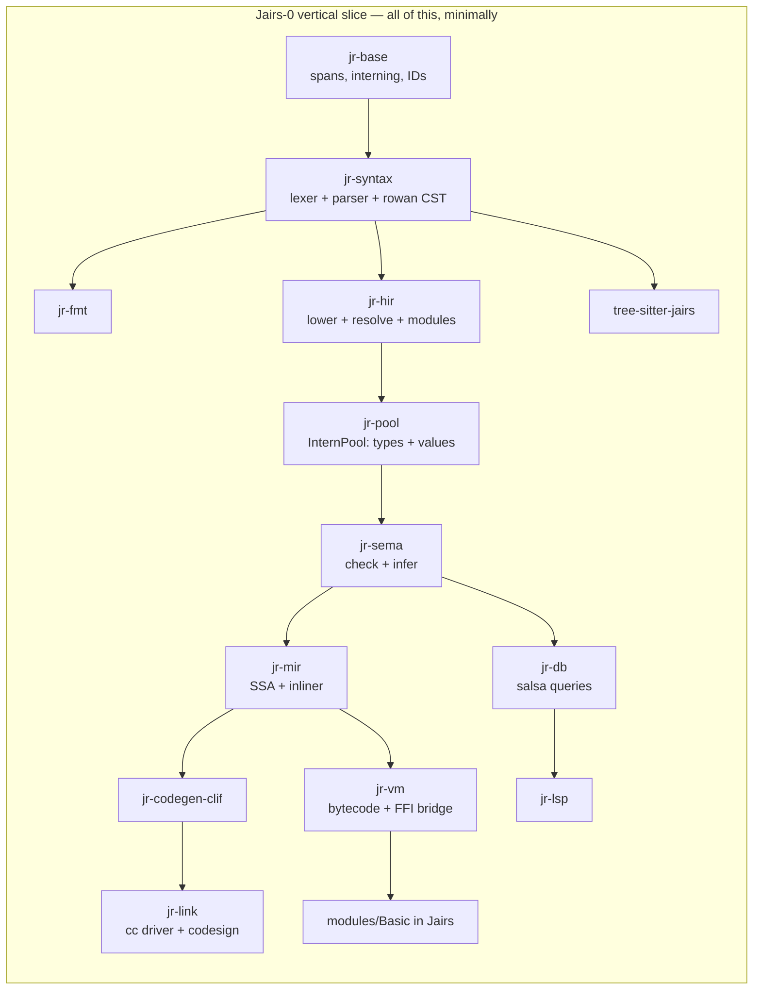
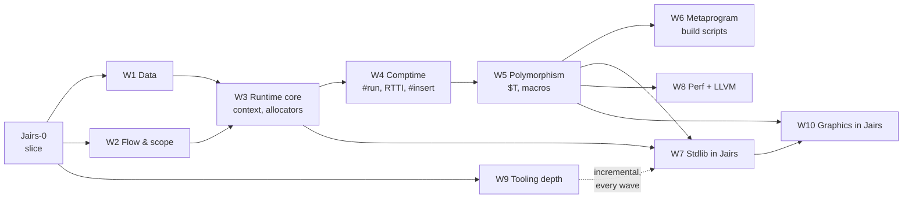
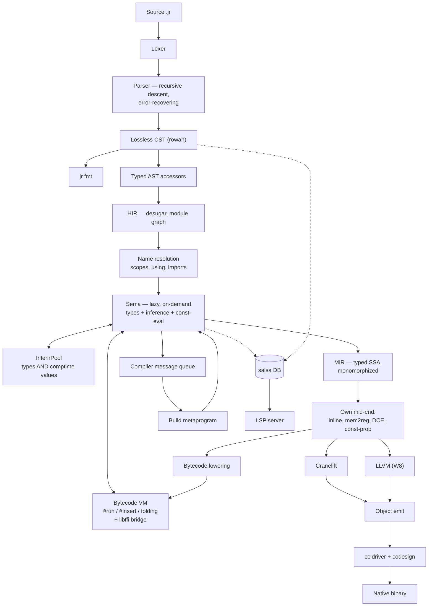

# Jairs — a Jai-like systems language in Rust

**Working name:** Jairs · **Source extension:** `.jr` · **Host language:** Rust (2024 edition)

> [!NOTE]
> **Strategy: tracer bullet, then thickening waves.**
> We do *not* build the compiler layer by layer. We first drive one absurdly small language subset all the
> way through **every** component — lexer, parser, CST, HIR, Sema, MIR, VM, Cranelift, linker, FFI, stdlib
> module, LSP, tree-sitter, formatter — until `hello.jr` is a native macOS binary and the LSP gives hover on
> it. Everything works, badly. *Then* we thicken it one feature-slice at a time.

---

## 0. Locked decisions

| # | Decision | Choice |
|---|---|---|
| 1 | Fidelity | **Jai-inspired, own language.** You own the spec. |
| 2 | Backend | **Cranelift first, LLVM later** behind a `Backend` trait. |
| 3 | Compile-time execution | **Bytecode VM over our own MIR.** Host-independent, trappable. |
| 4 | Parser | **One hand-written error-recovering parser** (rowan lossless CST), shared by compiler + LSP. tree-sitter is a *separate* editor grammar, CI-gated against drift. |
| 5 | Stdlib | **Written in Jairs itself**, like Jai. Core + OS + tooling first, graphics stack later. |
| 6 | Scope | **Solo, long-term serious, macOS arm64 first.** Linux x86-64 green in CI from the first native binary. |
| 7 | Build order | **Vertical slice first, then feature waves.** No component is "phase 2". |

### 0.1 Design questions — now resolved

| Question | Decision | Consequence |
|---|---|---|
| `context` ABI | **Hidden trailing parameter**; `#c_call` procedures opt out | Encoded in MIR's calling convention from day one. Function *types* carry a context flag. |
| Integer overflow | **Always trap** | Needs explicit wrapping operators (`+%`, `-%`, `*%`) or hash functions, PRNGs, and checksums become unwritable. **Added to Tier A.** Trap = a real runtime panic with a source location, and a *compile error* when detectable at comptime. |
| Bounds checks | **Like Jai: a build setting**, visible in the IR | MIR carries explicit `bounds_check` ops that a build-config pass strips. `#no_abc` opts out locally. |
| String representation | `{data: *u8, count: s64}`, **not** NUL-terminated | `to_c_string()` bridges to `#foreign` via temporary storage. |
| Polymorph identity | **Structural, on interned comptime arguments** — *my call* | An instantiation is keyed by the tuple of resolved comptime arg IDs in the InternPool, so `sort(Entity)` from two files dedupes to one function. Errors *display* nominally (`sort($T = Entity)`) so users see intent, not a key. Structural is required anyway once `Type` is a first-class comptime value. |
| Comptime FFI | **Yes**, gated behind `#foreign_at_comptime` | VM needs libffi-style dynamic calls. Non-negotiable given build scripts must read files. |
| Error handling | **Start exactly like Jai** — multiple returns + `#must` | But: reserve an **effect row slot in the function type representation** now, so an effects system can be added later without re-typing every signature. Costs nothing today; saves a rewrite. |

---

## 1. The vertical slice — "Jairs-0"

> [!IMPORTANT]
> **Definition of done for the slice:** `jr build examples/hello.jr` produces a signed native arm64 binary
> that prints when run; `jr run` executes the same file in the VM; opening it in VS Code gives diagnostics,
> hover types, and goto-definition; Neovim highlights it via tree-sitter; `jr fmt` round-trips it; and the
> printing itself comes from a stdlib module **written in Jairs** that calls libc via `#foreign`.

### 1.1 The Jairs-0 language subset

Deliberately tiny. Everything else is a later wave.

```jr
#import "Basic";                       // module system: one module, one file

Point :: struct { x: s64; y: s64; }    // structs, one level

add :: (a: s64, b: s64) -> s64 {       // procs, single return
    return a + b;
}

MESSAGE :: "hello from Jairs\n";       // constants
COMPUTED :: #run add(2, 3);            // one trivial comptime call

main :: () {
    p: Point;                          // decls: typed, and inferred below
    p.x = 4;
    sum := add(p.x, COMPUTED);         // := inference
    if sum > 5  print(MESSAGE);        // if
    i := 0;
    while i < 3 { i = i + 1; }         // while
    ptr := *sum;                       // pointer take + deref
    print(MESSAGE);
}
```

Included: `s64`, `u8`, `bool`, `string`, `*T`, `struct`, procs, `:=` / `: T` / `::`, `if`, `while`, `return`,
arithmetic (**trapping**), comparison, assignment, field access, pointer take/deref, `#import`, `#foreign`,
one `#run`.

> [!NOTE]
> `u8` is in the slice, not deferred to W1, because the string representation
> (`{data: *u8, count: s64}`, ADR-0004) and the libc `write` signature are both spelled in `*u8`. Choosing
> "stdlib in Jairs" forced this: you cannot express the bottom of the standard library without it. `u8`
> arithmetic and the rest of the numeric tower still wait for W1.

Excluded from the slice: arrays, `for`, `defer`, `using`, enums, unions, polymorphs, macros, `#insert`,
overloading, multiple returns, `context`, RTTI, floats, and the remaining numeric types. Each arrives as a
wave.

### 1.2 The slice's stdlib — `modules/Basic/`, in Jairs

This is the proof that decision #5 works. Roughly 40 lines of Jairs:

```jr
// modules/Basic/module.jr
libc :: #system_library "c";

write :: (fd: s64, buf: *u8, count: s64) -> s64 #foreign libc "write";

print :: (s: string) {
    write(1, s.data, s.count);
}
```

> [!CAUTION]
> **Correction found while building this: `print_int` is NOT implementable in Jairs-0.**
> Turning a digit into a byte for `write` needs an `s64` → `u8` conversion, and `cast` is reserved
> until W1. Every alternative needs something the slice also lacks — a `[N]u8` buffer (W1), pointer
> arithmetic (not in the subset, and no type checker yet to stop it being written by accident), or
> libc `printf` (variadic, and the arm64 variadic ABI passes variadic arguments on the stack, so a
> non-variadic `#foreign` declaration would silently produce garbage). Integer printing therefore
> lands with `cast` in **W1**, and the slice's exit criterion prints strings only.
>
> This is exactly the kind of constraint the tracer-bullet ordering exists to expose, and it cost
> minutes instead of being discovered during W7's stdlib push.

> [!WARNING]
> This forces `#foreign`, the string ABI, and the module loader into the **first** slice. That is the
> intended consequence of "stdlib in Jairs" — you cannot defer FFI to a later milestone if the bottom of
> your standard library is a syscall.

### 1.3 Slice work breakdown

Every crate gets created and does real work. Nothing is stubbed out with `todo!()` at the architectural level.



| Component | Slice scope | Why it can't wait |
|---|---|---|
| `jr-base` | Spans, `FileId`, `lasso` interner, `slotmap` arenas, newtype IDs | Everything depends on it |
| `jr-diag` | Diagnostic model + `annotate-snippets` rendering | Error quality is a design constraint, not a polish task |
| `jr-syntax` | Hand lexer (all tokens, trivia preserved), recursive-descent parser for the subset, **error recovery**, rowan CST, typed AST accessors | Recovery shape is hard to retrofit; LSP depends on it |
| `jr-fmt` | Formatter over the CST | Cheapest proof the CST is genuinely lossless |
| `jr-hir` | Lowering, module graph, `#import` resolution, scopes | Establishes the resolution model |
| `jr-pool` | InternPool for types **and** comptime values | Retrofitting interning is a rewrite. Steal Zig's design. |
| `jr-sema` | Lazy, on-demand checking; `:=` inference; one `#run` | Lazy-from-day-one is the whole reason M6-class comptime is possible later |
| `jr-mir` | Typed SSA, mem2reg, DCE, **a real inliner** | Cranelift has no inlining — it must exist before any backend |
| `jr-vm` | Register bytecode + interpreter + libffi bridge | It *is* the comptime engine; also gives `jr run` before any backend works |
| `jr-codegen` | `Backend` trait | Defining it now keeps LLVM from becoming a fork |
| `jr-codegen-clif` | Cranelift lowering, AArch64 AAPCS, Mach-O | The native path |
| `jr-link` | `.o` via `cranelift-object`, then shell out to `cc`; ad-hoc codesign | macOS binaries don't launch unsigned |
| `jr-db` | salsa 0.28 queries: file → tokens → CST → HIR → types | **The** reason the LSP won't be a fork of the compiler |
| `jr-lsp` | `lsp-server` loop: diagnostics, hover, goto-def | Proves the salsa boundary is real |
| `tree-sitter-jairs` | `grammar.js` + `highlights.scm` + corpus | Establishes the drift gate |
| `modules/Basic` | `print` / `print_line` via `#foreign` to libc `write` | Proves stdlib-in-Jairs |
| `tests/corpus` | ~20 `.jr` files: spec examples = parser tests = tree-sitter tests | One corpus, two parsers, CI-enforced |

### 1.4 Slice exit criteria

- [x] `jr fmt` byte-identically round-trips every corpus file — enforced by the
      `jairs-fmt` CI gate over `valid/`, `imports/valid/`, `tests/corpus/modules/`
      and `modules/`. `invalid/` is excluded on purpose: those files do not parse,
      and `jr fmt` correctly refuses to format input it could not parse.
- [x] `jr check broken.jr` recovers and reports multiple errors with rustc-grade
      rendering — `invalid/009-multiple-independent-errors.jr` asserts at least
      four independent errors from one file.
- [x] `jr run hello.jr` executes in the VM — `jr run tests/corpus/valid/024-hello.jr`
      prints both lines and exits 0. Asserted by `jr-cli`'s
      `run_executes_the_slice_exit_criterion`.
- [x] `jr build hello.jr && ./hello` — native arm64, launches, correct output.
      `jr build tests/corpus/valid/024-hello.jr` links through `cc` and the binary
      prints both lines and exits 0, byte-identically to the VM. Asserted by
      `jr-cli`'s `the_slice_exit_criterion_produces_output_in_both_engines`.
- [x] `COMPUTED :: #run add(2,3)` folds at compile time — folded by `jr-db`'s
      `file_consts` query (ADR-0018 §3) and interned, so it is indistinguishable
      from a literal: the MIR snapshot for `020-run-directive.jr` now reads
      `5_s64 + 1_s64`. VM and native now agree, by the differential harness below.
- [x] `print` comes from `modules/Basic` written in Jairs, via `#foreign` to libc
      `write` — executes, through libffi (ADR-0018 §4). ADR-0004's `{data, count}`
      is handed to `write` with no copy.
- [ ] Integer overflow traps, in both the VM and native, with a source location —
      both engines now trap, and they trap *identically*: same wording, same
      byte-for-byte stderr, same exit status 4, asserted by
      `both_engines_trap_on_overflow_rather_than_wrapping`. **The source location is
      still missing**, in both. Resolution is not what is missing — `jr-mir`'s
      `resolve_span` turns a `MirSpan` into a `Span` and is now public — the trap
      path simply does not call it, and the native trap message is a per-operation
      constant chosen at compile time rather than a rendered location. ADR-0019 §3
      corrects an earlier claim that `AstIdMap` was the blocker; ADR-0013 stores
      spans on HIR nodes directly, so it never was.
- [ ] VS Code: diagnostics + hover + goto-def
- [ ] Neovim: tree-sitter highlighting — `grammar.js` and `queries/*.scm` exist
      and the drift gate is green; editor packaging is not done.
- [ ] CI green on macOS arm64 **and** Linux x86-64 — the matrix is configured for
      both; only macOS arm64 has been verified locally.
- [x] CI drift gate: every corpus file parses cleanly in *both* the compiler and
      tree-sitter
- [x] Differential test harness exists: every corpus program's output must match
      under VM and native — `crates/jr-cli/tests/differential.rs`, which runs both
      engines as subprocesses and compares stdout, **stderr** and exit status. It
      enumerates the corpus itself rather than listing cases, so a new program is
      covered the day it is added. Because only two corpus programs print anything,
      it also carries cases that make a computation observable through `exit`, which
      is what gives it teeth: arithmetic, precedence, division truncation, loops,
      block parameters, `break`, pointers, short-circuit `&&`, struct field offsets,
      and both traps.

**Estimated: 10–14 weeks solo.** This is the milestone that decides whether the project is real.

### 1.5 Where the slice actually is

Status of each slice component, so this is answerable without reading the tree.
"Done" means implemented, tested, and green under every CI gate — not polished.

| Component | Status | Notes |
|---|---|---|
| `jr-base` | **Done** | Spans, `FileId`, `lasso` interning, `newtype_index!`, source map |
| `jr-diag` | **Done** | Diagnostic model + `annotate-snippets` renderer |
| `jr-syntax` | **Done** | Lexer, error-recovering parser, rowan CST, typed AST |
| `jr-fmt` | **Done** | Formatter; corpus is canonical under it, CI-enforced |
| `jr-hir` | **Done** | Lowering, name resolution, flat import merge (ADR-0014) |
| `jr-pool` | **Done** | Types + comptime values in one pool (ADR-0015, ADR-0016 §3) |
| `jr-sema` | **Done** | Signatures + checking (ADR-0016). No const-eval: that is `jr-vm` |
| `jr-db` | **Done** | salsa queries: module loader, sema, MIR, const-eval, run (ADR-0007, ADR-0014, ADR-0018 §3) |
| `jr-cli` | **Done** | `jr check` (with `--module-path`), `jr fmt`, `jr parse`, `jr run`, `jr build` |
| `tree-sitter-jairs` | **Done** | Grammar + queries; drift gate green |
| `tests/corpus` | **Done** | 69 files, incl. `type-errors/` and `cfg-errors/` — one file per diagnostic |
| `modules/Basic` | **Done** | Written, resolving, type-checking and **executing**; MIR snapshotted |
| `jr-mir` | **Done** | Typed SSA, Braun construction, CFG diagnostics (ADR-0017). No mid-end |
| `jr-vm` | **Done** | Register bytecode, interpreter, libffi bridge (ADR-0018). No JIT tier |
| `jr-codegen` | **Done** | Three-phase `Backend` trait, no `cranelift-*` type in it (ADR-0009, ADR-0019 §1) |
| `jr-codegen-clif` | **Done** | MIR → Cranelift IR, layout via `jr-pool`, traps through a generated helper (ADR-0019). Aggregate params only; aggregate returns and indirect calls refused |
| `jr-link` | **Done** | `cranelift-object` bytes, then `cc`; ad-hoc codesign is a fallback because `ld64` already signs |
| `jr-codegen-llvm` | **Not started** | Wave W8 owns it (ADR-0019 §5) |
| `jr-driver`, `jr-lsp` | **Not started** | |

Accepted ADRs: 0001–0019. See [`docs/adr/README.md`](docs/adr/README.md).
Spec chapters written: 00 (overview), 01 (lexical), 02 (declarations),
03 (scoping and resolution). A type-system chapter is owed: ADR-0015 and ADR-0016
plus `jr-sema`'s crate docs are the only record of the typing rules today.

`jr-mir` has **no mid-end**: no inliner, no DCE, no const-prop, and no `mem2reg`
(ADR-0017 §2 makes the last one unnecessary rather than deferred). The wave that
adds one is §2.1's, and §5 puts the inliner in MIR deliberately. Its absence is
visible in a MIR dump: unreachable blocks survive, and `print_line` in
`modules/Basic` keeps a spill slot it never reads.

Layout exists once, in `jr-pool` (ADR-0018 §2), and `jr-codegen-clif` calls it
rather than computing its own — the obligation ADR-0018 §2 exists to create, which
no verifier can enforce. What now guards it is
`crates/jr-cli/tests/differential.rs`: a struct field at a different offset in the
two engines changes an observable answer, and that test compares observable answers.

The toolchain floor is **rustc 1.94**, because `cranelift-codegen 0.134.2`'s
dependency chain requires it. `rust-toolchain.toml` still floats on stable.

---

## 2. Thickening waves

> [!IMPORTANT]
> **The rule that makes this work: a wave is not done until it has been pushed through every layer.**
> Every wave's checklist is the same eight items. If a feature parses but the LSP doesn't understand it, or
> tree-sitter can't highlight it, or the VM and native backend disagree about it, the wave is not done.

### 2.0 Per-wave definition of done

- [ ] **Spec** chapter written in `docs/spec/`
- [ ] **Corpus** files added (they *are* the spec examples)
- [ ] **Parser** + error recovery + `fmt`
- [ ] **Sema** + diagnostics with good spans
- [ ] **MIR** lowering + **VM** + **Cranelift**, verified equal by differential test
- [ ] **LSP** understands it (hover, completion, goto where applicable)
- [ ] **tree-sitter** grammar + highlight queries updated; drift gate green
- [ ] **Stdlib** uses it where it should (dogfooding is the acceptance test)

### 2.1 Wave order

| Wave | Content | Notes | Est. |
|---|---|---|---|
| **W1 — Data** | Full numeric tower (`s8..s64`, `u8..u64`, `float32/64`), wrapping ops `+% -% *%`, `enum`, `enum_flags`, `union`, `[N]T`, `[]T` views, `[..]T` dynamic arrays, `cast()`, `xx` autocast, operator overloading | Dynamic arrays need allocators → pulls `context` forward | 8–10 wks |
| **W2 — Flow & scope** | `for` with `it`/`it_index`, `for <`, labeled `break`/`continue`, `defer`, `using` (namespace + field promotion), multiple return values, named/default args, `#scope_*` visibility | `using` is the first genuinely hard resolution problem | 6–8 wks |
| **W3 — Runtime core** | `context` (hidden param, `#c_call` opt-out), allocators, temporary storage, bounds-check build config, panics/traps with backtraces | Unlocks a real stdlib | 6–8 wks |
| **W4 — Comptime** | Full `#run` (arbitrary code), aggressive const folding, RTTI (`Type` values, `type_info()`, `Any`), `#insert`, `#code`, the `Code` type | **Hardest wave.** Sema ↔ VM become mutually recursive; cycle detection with readable errors is the deliverable | 10–14 wks |
| **W5 — Polymorphism** | `$T`, `$$T`, `#modify`, `#bake_arguments`, `#expand` macros + hygiene, instantiation caching, **instantiation backtraces** in diagnostics | Depends on W4's InternPool value identity | 8–12 wks |
| **W6 — Metaprogram** | Workspaces, compiler message loop, `#run build()` build scripts replacing makefiles, plugin hooks, `@note` attributes | The Jai superpower. Build scripts become the build system. | 6–8 wks |
| **W7 — Stdlib** | In Jairs: `Basic`, `String`, dynamic array / hash table / bucket array, `Sort`, `Math` (vec/mat/quat), `Random`, `File`, `File_Utilities`, `Process`, `Thread` + atomics, `Time`, `Socket`, `JSON`, `Compiler` | Runs partly in parallel with W5/W6; each module is a wave-acceptance test | 14–18 wks |
| **W8 — Performance** | LLVM backend via `inkwell` (`--release`), inliner maturity, `#soa`, SIMD vectors, `#align`/`#place`, parallel Sema + parallel codegen, published compile-throughput number | Three-way differential testing: VM ≡ Cranelift ≡ LLVM | 10–14 wks |
| **W9 — Tooling depth** | Full LSP surface (completion, refs, rename, signature help, semantic tokens, **inlay type hints**, code actions), richer DWARF (locals, struct layouts) for lldb, VS Code + Neovim + Zed packaging | Incremental all along; this is the "make it excellent" pass | 8–10 wks |
| **W10 — Graphics, in Jairs** | `Window_Creation` (Cocoa via `#foreign`), GPU layer (Metal, then Vulkan), immediate-mode 2D renderer, image decode, immediate-mode UI, audio (CoreAudio/ALSA) | All *library* work, written in Jairs — no compiler changes. Gated on W5+W7. | 6+ months |

### 2.2 Wave dependency graph



---

## 3. Architecture

### 3.1 Pipeline



> [!IMPORTANT]
> **The load-bearing invariant:** comptime and runtime execute *the same* MIR. The VM consumes bytecode
> lowered from the identical MIR that Cranelift consumes. Any other arrangement guarantees `#run` and
> runtime silently disagree. This is Zig's model (ZIR → Sema → AIR) and it is correct.

### 3.2 Crate layout

```
jairs/
├── Cargo.toml                  # workspace
├── crates/
│   ├── jr-base/                # spans, FileId, interning, arenas, newtype IDs
│   ├── jr-diag/                # diagnostic model + annotate-snippets rendering
│   ├── jr-syntax/              # lexer, parser, SyntaxKind, rowan CST, typed AST
│   ├── jr-fmt/                 # formatter over the CST
│   ├── jr-hir/                 # desugared tree, module graph, scopes, resolution
│   ├── jr-pool/                # InternPool: types + comptime values
│   ├── jr-sema/                # checking, inference, polymorph instantiation
│   ├── jr-mir/                 # typed SSA IR + mid-end (incl. inliner)
│   ├── jr-vm/                  # bytecode, interpreter, comptime FFI bridge
│   ├── jr-codegen/             # Backend trait + shared lowering
│   ├── jr-codegen-clif/        # Cranelift
│   ├── jr-codegen-llvm/        # LLVM (feature = "llvm")
│   ├── jr-link/                # object emit + linker driver + codesign
│   ├── jr-db/                  # salsa database — shared by driver and LSP
│   ├── jr-driver/              # workspaces, message loop, build metaprograms
│   ├── jr-lsp/                 # language server
│   └── jr-cli/                 # the `jr` binary
├── modules/                    # standard library, written in Jairs
├── examples/
├── tests/corpus/               # shared syntax corpus (compiler + tree-sitter)
├── tree-sitter-jairs/          # separate editor grammar
└── docs/{spec,adr}/
```

### 3.3 Infrastructure choices

Versions verified 2026-07-25. **Pin exact versions for `cranelift-*` and `salsa`.**

| Concern | Choice | Version | Why |
|---|---|---|---|
| CST | `rowan` | 0.16.1 | rust-analyzer's red/green tree. `cstree` 0.14 only if `Send` trees are needed later. |
| Lexer | hand-written | — | `logos` is regex-per-token; nested comments + `#`-directive context are awkward. ~400 lines you own. |
| Parser | hand-written | — | Error-recovery quality *is* LSP quality. No generator delivers this. |
| Diagnostics | `annotate-snippets` | 0.12.16 | Literally rustc's renderer → rustc-identical output. |
| Incrementality | `salsa` | 0.28.1 | From the slice, not later. RA-proven. API churns — pin exactly. |
| Backend | `cranelift-*` | 0.134.2 | x86-64 + aarch64 with Apple Silicon CC. **APIs are not semver-stable.** |
| Objects / DWARF | `object`, `gimli` | 0.39.1 / 0.34.0 | Emit `.o`, shell out to `cc`. Never hand-roll Mach-O linking. |
| LSP transport | `lsp-server` | 0.10.0 | Sync, you own threading — correct pairing with salsa. `tower-lsp` is stale (2023). |
| LSP types | `lsp-types` | 0.97.0 | Stale but standard; LSP 3.17. |
| Golden tests | `insta` | 1.48.0 | Snapshot CST/HIR/MIR/diagnostics. |
| Fuzzing | `cargo-fuzz` + `arbitrary` | 0.13.2 / 1.4.2 | Parser fuzzing from the slice. |
| Interning | `lasso`, `slotmap`, `bumpalo` | 0.7.3 / 1.1.1 / 3.20 | rustc style: intern everything, index by `u32` newtypes. |
| tree-sitter | `tree-sitter` + CLI | 0.26.11 | Editor grammar only. |
| Comptime FFI | `libffi` (Rust bindings) | — | Required by `#foreign_at_comptime`. |

> [!WARNING]
> **Cranelift has no function inlining**, and only limited loop optimization (LICM/GVN/const-fold via its
> egraph mid-end). Codegen is ~14% slower than LLVM, but it compiles ~10× faster. The inliner must live in
> *your* MIR mid-end — which you need anyway for `#expand` macros and comptime.

---

## 4. Timeline

| Phase | Cumulative (solo, serious) |
|---|---|
| **Jairs-0 vertical slice** — everything works, badly | **~3 months** |
| W1–W3 — a real, usable procedural language | ~8–10 months |
| W4–W5 — comptime + polymorphism (the Jai soul) | **~16–20 months** |
| W6–W7 — build metaprograms + stdlib in Jairs | ~24–30 months |
| W8–W9 — performance parity + excellent tooling | ~32–40 months |
| W10 — graphics stack, game-dev viable | **~42–48 months** |

> [!NOTE]
> These are honest numbers. Zig took ~8 years with a funded team; Odin has had a decade. The slice-first
> structure exists precisely so you have **a real, native, LSP-supported language in ~3 months** rather than
> a half-built type checker in 12.

---

## 5. Top risks

| Risk | Why it bites | Mitigation |
|---|---|---|
| **Sema ↔ comptime recursion** | `#run` yields types; types need Sema; Sema may need `#run`. Pass-ordered checkers can't express this. | Lazy on-demand Sema over salsa **in the slice**. Explicit dependency graph + cycle diagnostics. Copy Zig's Sema/InternPool. |
| **No inlining in Cranelift** | Macro- and comptime-heavy code is slow; `#expand` assumes inlining. | Inliner in MIR during the slice, before any backend exists. |
| **Always-trap overflow with no wrapping ops** | Hash functions, PRNGs, checksums become unwritable — discovered while writing the stdlib. | `+% -% *%` promoted into **W1**. |
| **Stdlib-in-Jairs pulls FFI early** | The bottom of the stdlib is a syscall. | `#foreign` is in the **slice**, by design. |
| **Errors inside polymorph instantiations** | #1 reason generics feel bad. | Instantiation backtraces designed into `jr-diag` in the slice, not retrofitted in W5. |
| **LSP as a fork of the compiler** | Batch compilers assume "parse all then check"; IDEs need incremental + error-tolerant. | salsa in the slice; the LSP is a *consumer* of the same queries. Never two frontends. |
| **tree-sitter drift** | Two grammars always diverge. | Shared `tests/corpus/`; CI gates both parsers; grammar changes require a corpus file. |
| **Cranelift API churn** | Explicitly not semver-stable. | Pin exactly; confine all contact to `jr-codegen-clif` behind `Backend`. |
| **macOS arm64 specifics** | Codesigning, `ld-prime`, DWARF quirks. | Always link through `cc`; ad-hoc codesign in `jr-link`; keep Linux green as a sanity oracle. |
| **Scope creep into graphics** | Most tempting, most destabilizing. | Hard gate: W10 starts only after W7. It requires *zero* compiler changes — that's the test of readiness. |
| **Solo burnout** | The real killer of language projects. | Every wave ends in a runnable demo. `fmt` and LSP ship in month 3. |

---

## 6. Prior art to mine before W4

| Project | Impl | Backend | Comptime | Steal |
|---|---|---|---|---|
| **Zig** | Zig | LLVM + own x64/aarch64/wasm | **Sema interprets ZIR → AIR, global InternPool** | *The* reference. InternPool, lazy Sema, "interpret the same IR you compile". Read `Sema.zig` + `InternPool.zig`. |
| **roc** | **Rust** | Cranelift (dev) + LLVM (release) | — | Dual-backend split behind one trait; Rust codegen patterns; monomorphization. |
| **rust-analyzer** | Rust | — | — | rowan CST, salsa design, `lsp-server` loop, error-recovering parser structure. |
| **Odin** | C | LLVM | Limited | Clean multi-pass checker; package/scope model. |
| **starlark-rust** | Rust | Bytecode interp | — | Fast bytecode eval + freezing, for `jr-vm`. |
| **rune / koto** | Rust | Register/stack VM | — | VM value model + instruction encoding. |
| **gleam** | Rust | Erlang/JS | — | Best-in-class CLI ergonomics and diagnostics polish. |

> [!NOTE]
> No production-grade open-source Jai reimplementation exists — only toys. **Zig is the reference for
> comptime; roc is the reference for a Rust-hosted dual-backend compiler.**

---

## 7. Immediate next actions

Everything through the **native back end** is done: workspace scaffolding, the ADRs,
spec chapters 00–03, the corpus plus the drift gate, the lexer→parser→CST→`jr fmt`
inch, HIR and name resolution, the module loader, the InternPool, `jr-sema`, `jr-mir`,
`jr-vm`, `jr-codegen`, `jr-codegen-clif` and `jr-link`. See §1.5 for component status.

**`jr run` and `jr build` agree.** `tests/corpus/valid/024-hello.jr` prints its two
lines and exits 0 in the bytecode VM *and* as a linked arm64 binary, and a trapping
program produces byte-identical stderr and the same exit status from both. §1.4's
exit criterion is met, and ten of its twelve boxes are ticked.

### What the `jr-codegen` wave landed

- [x] **ADR-0019**, six decisions: a three-phase `Backend`, traps through a runtime
      helper, the existing span resolution reused instead of `AstIdMap`, the
      `#foreign` library interned in the pool, `jr-codegen-llvm` left for W8, and
      ADR-0009's "inliner before any backend" deliberately deferred with a named
      expiry.
- [x] **`jr-codegen`** — the `Backend` trait, with no `cranelift-*` type in it.
- [x] **`jr-codegen-clif`** — MIR → Cranelift IR. Block parameters onto
      `append_block_param`, slots onto Cranelift stack slots, `reverse_postorder()` as
      the block order: ADR-0017's return, collected.
- [x] **`jr-link`** and `jr build`, with no runtime object because the trap helper is
      generated into the program's own object.
- [x] **The differential harness**, which compares stdout, stderr and exit status.
- [x] **One resolution of a `#foreign` library**, interned in the pool and read by
      sema, the VM and the linker.

Three things about this wave are worth carrying forward.

- **A blocker that was not where it looked.** `cranelift-codegen 0.134.2` needs rustc
  1.94 through `wasmtime-internal-core`, and the machine was on 1.93.1 — so the pinned
  codegen could not compile at all. Moving to stable 1.97 cost nothing directly, but
  raising `rust-version` to 1.94 turned on an MSRV-gated clippy lint at thirteen sites
  across eight crates. An MSRV bump is a lint change.
- **A false blocker, believed for a whole wave.** The previous handoff said a trap had
  no source location because `AstIdMap` was deferred. `jr-mir` had been resolving
  `MirSpan`s to `Span`s since the MIR wave; the function was private. ADR-0019 §3
  keeps the mistake on the record. **Check a claimed blocker against the code before
  turning it into a design fork.**
- **The exit status caught what output could not.** The first native run of
  `024-hello.jr` printed both its lines perfectly and exited **1**, because a
  `void`-returning Jairs `main` named `main` leaves the C runtime whatever was in the
  return register. Output alone said the back end worked. This is why the differential
  compares status and stderr too — and why the first version of it, which compared
  only stdout, reported two engines as agreeing while their trap messages differed.

Diagnostic codes: **E0231 is the first free code.** E0230 is `jr-db`'s const-eval
failure; E0227–E0229 are `jr-mir`'s. `jr-codegen` deliberately defines none: every
`CodegenError` is a compiler fault, and a program fault was reported upstream. Beware
that `jr-syntax`' parser still illegally emits E0200/E0201/E0202 for "arrives in wave
Wn" errors, colliding with `jr-hir` — do not filter tests by those.

### Next: a source location on a trap, then the mid-end

The native half of §1.4 is done. `jr build tests/corpus/valid/024-hello.jr` links a
binary that prints the same bytes as `jr run`, exits with the same status, and — when
it traps — writes byte-identical stderr. What guards that is
`crates/jr-cli/tests/differential.rs`, and it is the most valuable test in the
repository: it is the only thing that checks §3.1's load-bearing invariant rather
than arguing for it.

#### Read first, in this order

1. This section, then §1.5 for status and §3.1 for the same-MIR invariant.
2. **ADR-0019**, which specifies the back end, and **ADR-0018 §2**, which is why
   `jr-pool` owns layout and you must not compute your own.
3. `crates/jr-cli/tests/differential.rs`. It defines what "the two engines agree"
   means operationally. Anything you add to either engine has to keep it green.
4. `crates/jr-codegen-clif/src/repr.rs` — the whole representation decision in one
   file: what is a register, what is a pointer to bytes, and where every size
   comes from.

#### What is already done for you

- **`jr_mir::resolve_span` is public** and resolves every non-synthetic `MirSpan` to
  a `Span`. This is the thing the last handoff wrongly claimed was missing.
- **The trap path already carries a message to the user.** Native traps call a
  generated `jr_trap(pointer, length)` that writes to fd 2 and exits 4; the
  signature already accommodates a longer, located message.
- `TrapKind` has one variant per operation, so `addition overflowed` and
  `multiplication overflowed` are distinct — matching `jr-vm`'s wording was required
  to make the differential compare stderr at all.
- `jr-link` shells out to `cc` and needs no runtime object: the trap helper is
  generated into the program's own object.

#### Work items, in dependency order

- [ ] **A source location on a trap**, in *both* engines, which is the one §1.4
      criterion this wave left open. The native side needs one data object per trap
      *site* rather than per `TrapKind`, with its text rendered at compile time from
      `resolve_span` plus the file path and a line. The VM side needs the same span
      threaded into `VmError::Trap`, and `jr-cli`'s `report::error` needs to accept an
      optional `Span`. **They must render identically or `differential.rs` fails**,
      which is the point of doing them together rather than one at a time.
- [ ] **The mid-end**: the inliner, DCE and const-prop. ADR-0019 §6 deferred the
      inliner deliberately and named what ends the deferral — the first `#expand`, or
      the first performance number this plan proposes to publish. Until then no such
      number should be quoted, because it would measure the missing mid-end and not
      the back end.
- [ ] **Aggregate returns and indirect calls**, both currently
      `CodegenError::Unsupported`. An aggregate return needs a caller-allocated result
      slot; an indirect call needs something that maps a procedure *value* to a
      `ProcRef`, which nothing does yet in either engine.
- [ ] **Linux x86-64**, which §1.4 lists and which nobody has run. The back end asks
      `cranelift_native` for the host and `jr-pool` for layout, so there is no
      hardcoded target — but "should work" and "has been run" are different claims.

#### Traps

- **Do not compute layout.** Still the one mistake that produces a *silent*
  comptime/runtime divergence. `repr.rs` is the only place layout enters the back
  end; keep it that way.
- **`Rvalue::Undef` is not poison**, and the native back end models it as a tracked
  property of a `ValueId` rather than as a value, precisely so that a `Move` of an
  undefined value stays legal while a *read* traps. Trapping at the definition would
  disagree with the VM about a valid program — a local that is declared and never
  read.
- **A `void` value occupies no register**, so a `void` block parameter takes no
  block argument and a `void` store writes nothing. Zipping the two lists instead of
  filtering both is how that goes wrong.
- **`PlaceBase::Deref` reads its pointer from a register; `Projection::Deref` reads
  one from memory.** They look interchangeable and are not.
- **The differential can be fooled by silence.** Only two corpus programs print
  anything, so a test that merely runs the corpus compares "no output, exit 0" with
  "no output, exit 0". That is why `differential.rs` also makes computations
  observable through `exit`. Any new case should make its answer observable.
- **A trap's exit status is 4 in both engines**, and `jr build`'s own failure status
  is 2. Changing either silently breaks the comparison.

#### Gates — all six must pass

`cargo fmt --all --check`; `cargo clippy --workspace --all-targets -- -D warnings`;
`cargo test --workspace` (611 tests as of this handoff); `RUSTDOCFLAGS="-D warnings"
cargo doc --workspace --no-deps`; `cargo run -q -p jr-cli -- fmt --check
tests/corpus/valid tests/corpus/imports/valid tests/corpus/type-errors
tests/corpus/cfg-errors tests/corpus/modules modules`; corpus-drift via
`npx --yes tree-sitter-cli@0.26.11` (tree-sitter is not installed locally).

House style is enforced by the first four: `[lints] workspace = true` and no
crate-level `#![warn]`, `missing_docs` is a warning workspace-wide so every public
item including enum variants and struct fields needs a `///`, private `mod` plus a
curated `pub use` in `lib.rs`, module `//!` docs that argue *why* and name the
rejected alternative, and exhaustive matches rather than `matches!` or guards so
that a new variant is a compile error.

One process note, repeated because it cost real time on two waves running:
**subagents were unreliable.** Write the modules that define an API yourself;
delegate only single-file work with the consumed signatures stated verbatim.

### Known latent issues, none blocking

- The parser's E0200/E0201/E0202 collision described above.
- `Stmt::Item` and `FieldId` are declared but never constructed. Both are matched
  exhaustively anyway, so the day one is constructed the arm is the thing to change.
- An imported module's signatures are recomputed once per importer inside the
  signature phase. ADR-0016 §5 forbids the obvious fix, and interning is idempotent,
  so the cost is time rather than correctness. `file_consts` compounds it: it lowers
  the file once per fixpoint round, which is one or two in practice.
- A name that an *imported* module itself imported is invisible to the importer's
  signature phase and resolves to poison.
- The most negative value of a signed type cannot be written as a literal: the HIR
  stores a magnitude and `-1` is negation applied to `1`.
- `Pool` never shrinks; `jr-pool`'s docs record the remap-pass escape hatch.
- A default-initialised local of *pointer* type is treated as uninitialised rather
  than null, because the pool interns no null pointer. `Memory` reserves address 0 for
  it, so interning one is all that is missing.
- A `#run` producing a struct is refused: ADR-0015's `Item` has no aggregate-value
  variant. A `#run` producing a *string* works, by copying the bytes out of VM memory
  before the VM is dropped.
- Calling through a procedure pointer is refused: the pool interns a procedure as an
  `Item::ProcValue { decl }`, a `DeclId`, and nothing maps a `DeclId` to a `ProcRef`.
- The VM's memory is 1 MiB and never grows, because growing would move the base and
  dangle a host pointer held across a foreign call. Frame size is `value_count()`
  rather than a live range, so a body with many short-lived values over-allocates.
- `jr-mir` has no mid-end, so nothing folds constants or removes dead blocks.

### After the native back end

§1.4's remaining criteria: the LSP (diagnostics, hover, goto-def), editor packaging,
and CI verified on Linux x86-64 as well as macOS arm64.
