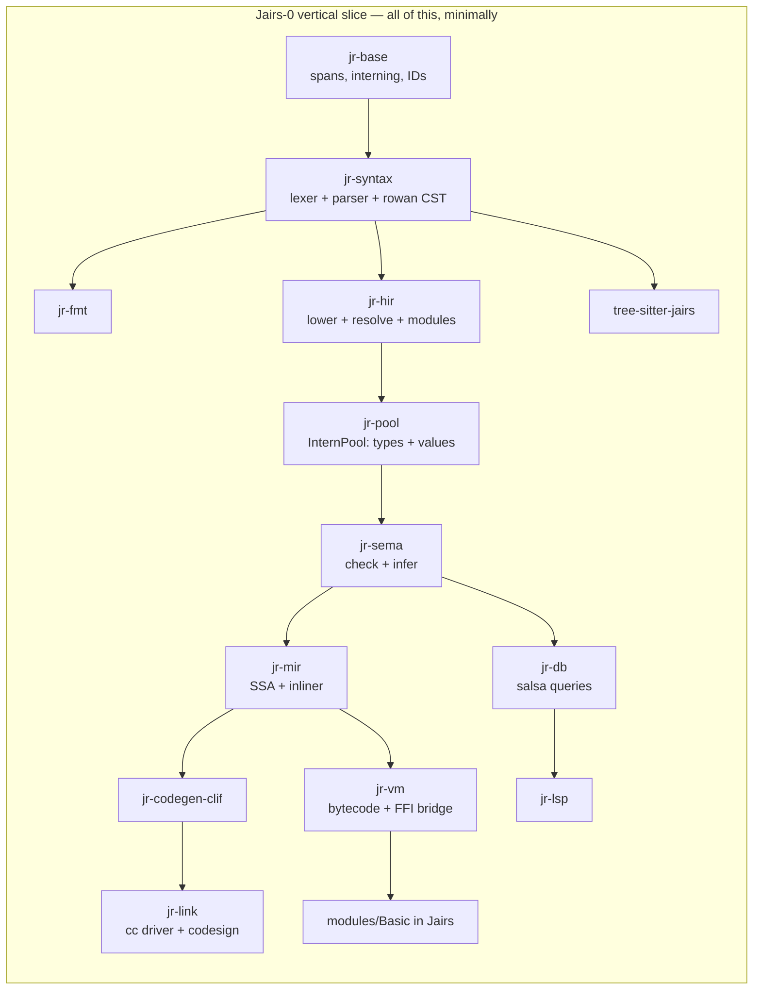
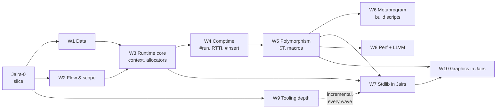
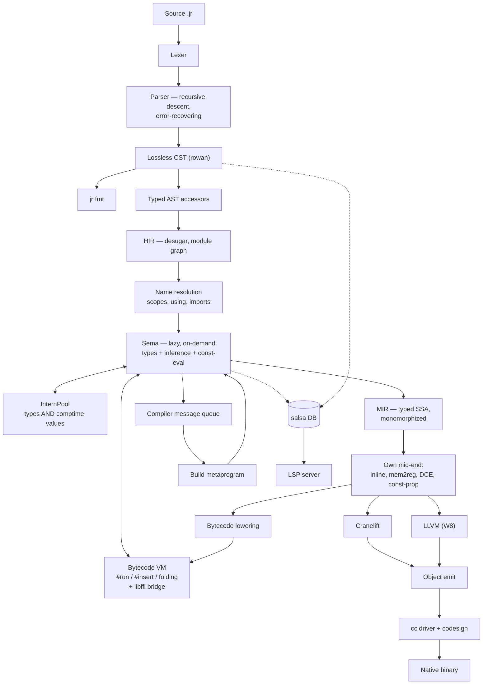

# Jairs — a Jai-like systems language in Rust

**Working name:** Jairs · **Source extension:** `.jr` · **Host language:** Rust (2024 edition)

> [!NOTE]
> **Strategy: tracer bullet, then thickening waves.**
> We do *not* build the compiler layer by layer. We first drive one absurdly small language subset all the
> way through **every** component — lexer, parser, CST, HIR, Sema, MIR, VM, Cranelift, linker, FFI, stdlib
> module, LSP, tree-sitter, formatter — until `hello.jr` is a native macOS binary and the LSP gives hover on
> it. Everything works, badly. *Then* we thicken it one feature-slice at a time.

---

## 0. Locked decisions

| # | Decision | Choice |
|---|---|---|
| 1 | Fidelity | **Jai-inspired, own language.** You own the spec. |
| 2 | Backend | **Cranelift first, LLVM later** behind a `Backend` trait. |
| 3 | Compile-time execution | **Bytecode VM over our own MIR.** Host-independent, trappable. |
| 4 | Parser | **One hand-written error-recovering parser** (rowan lossless CST), shared by compiler + LSP. tree-sitter is a *separate* editor grammar, CI-gated against drift. |
| 5 | Stdlib | **Written in Jairs itself**, like Jai. Core + OS + tooling first, graphics stack later. |
| 6 | Scope | **Solo, long-term serious, macOS arm64 first.** Linux x86-64 green in CI from the first native binary. |
| 7 | Build order | **Vertical slice first, then feature waves.** No component is "phase 2". |

### 0.1 Design questions — now resolved

| Question | Decision | Consequence |
|---|---|---|
| `context` ABI | **Hidden trailing parameter**; `#c_call` procedures opt out | Encoded in MIR's calling convention from day one. Function *types* carry a context flag. |
| Integer overflow | **Always trap** | Needs explicit wrapping operators (`+%`, `-%`, `*%`) or hash functions, PRNGs, and checksums become unwritable. **Added to Tier A.** Trap = a real runtime panic with a source location, and a *compile error* when detectable at comptime. |
| Bounds checks | **Like Jai: a build setting**, visible in the IR | MIR carries explicit `bounds_check` ops that a build-config pass strips. `#no_abc` opts out locally. |
| String representation | `{data: *u8, count: s64}`, **not** NUL-terminated | `to_c_string()` bridges to `#foreign` via temporary storage. |
| Polymorph identity | **Structural, on interned comptime arguments** — *my call* | An instantiation is keyed by the tuple of resolved comptime arg IDs in the InternPool, so `sort(Entity)` from two files dedupes to one function. Errors *display* nominally (`sort($T = Entity)`) so users see intent, not a key. Structural is required anyway once `Type` is a first-class comptime value. |
| Comptime FFI | **Yes**, gated behind `#foreign_at_comptime` | VM needs libffi-style dynamic calls. Non-negotiable given build scripts must read files. |
| Error handling | **Start exactly like Jai** — multiple returns + `#must` | But: reserve an **effect row slot in the function type representation** now, so an effects system can be added later without re-typing every signature. Costs nothing today; saves a rewrite. |

---

## 1. The vertical slice — "Jairs-0"

> [!IMPORTANT]
> **Definition of done for the slice:** `jr build examples/hello.jr` produces a signed native arm64 binary
> that prints when run; `jr run` executes the same file in the VM; opening it in a real editor gives
> diagnostics, hover and goto-definition; Neovim highlights it via tree-sitter; `jr fmt` round-trips it; and the
> printing itself comes from a stdlib module **written in Jairs** that calls libc via `#foreign`.

### 1.1 The Jairs-0 language subset

Deliberately tiny. Everything else is a later wave.

```jr
#import "Basic";                       // module system: one module, one file

Point :: struct { x: s64; y: s64; }    // structs, one level

add :: (a: s64, b: s64) -> s64 {       // procs, single return
    return a + b;
}

MESSAGE :: "hello from Jairs\n";       // constants
COMPUTED :: #run add(2, 3);            // one trivial comptime call

main :: () {
    p: Point;                          // decls: typed, and inferred below
    p.x = 4;
    sum := add(p.x, COMPUTED);         // := inference
    if sum > 5  print(MESSAGE);        // if
    i := 0;
    while i < 3 { i = i + 1; }         // while
    ptr := *sum;                       // pointer take + deref
    print(MESSAGE);
}
```

Included: `s64`, `u8`, `bool`, `string`, `*T`, `struct`, procs, `:=` / `: T` / `::`, `if`, `while`, `return`,
arithmetic (**trapping**), comparison, assignment, field access, pointer take/deref, `#import`, `#foreign`,
one `#run`.

> [!NOTE]
> `u8` is in the slice, not deferred to W1, because the string representation
> (`{data: *u8, count: s64}`, ADR-0004) and the libc `write` signature are both spelled in `*u8`. Choosing
> "stdlib in Jairs" forced this: you cannot express the bottom of the standard library without it. `u8`
> arithmetic and the rest of the numeric tower still wait for W1.

Excluded from the slice: arrays, `for`, `defer`, `using`, enums, unions, polymorphs, macros, `#insert`,
overloading, multiple returns, `context`, RTTI, floats, and the remaining numeric types. Each arrives as a
wave.

### 1.2 The slice's stdlib — `modules/Basic/`, in Jairs

This is the proof that decision #5 works. Roughly 40 lines of Jairs:

```jr
// modules/Basic/module.jr
libc :: #system_library "c";

write :: (fd: s64, buf: *u8, count: s64) -> s64 #foreign libc "write";

print :: (s: string) {
    write(1, s.data, s.count);
}
```

> [!CAUTION]
> **Correction found while building this: `print_int` is NOT implementable in Jairs-0.**
> Turning a digit into a byte for `write` needs an `s64` → `u8` conversion, and `cast` is reserved
> until W1. Every alternative needs something the slice also lacks — a `[N]u8` buffer (W1), pointer
> arithmetic (not in the subset, and no type checker yet to stop it being written by accident), or
> libc `printf` (variadic, and the arm64 variadic ABI passes variadic arguments on the stack, so a
> non-variadic `#foreign` declaration would silently produce garbage). Integer printing therefore
> lands with `cast` in **W1**, and the slice's exit criterion prints strings only.
>
> This is exactly the kind of constraint the tracer-bullet ordering exists to expose, and it cost
> minutes instead of being discovered during W7's stdlib push.

> [!WARNING]
> This forces `#foreign`, the string ABI, and the module loader into the **first** slice. That is the
> intended consequence of "stdlib in Jairs" — you cannot defer FFI to a later milestone if the bottom of
> your standard library is a syscall.

### 1.3 Slice work breakdown

Every crate gets created and does real work. Nothing is stubbed out with `todo!()` at the architectural level.



| Component | Slice scope | Why it can't wait |
|---|---|---|
| `jr-base` | Spans, `FileId`, `lasso` interner, `slotmap` arenas, newtype IDs | Everything depends on it |
| `jr-diag` | Diagnostic model + `annotate-snippets` rendering | Error quality is a design constraint, not a polish task |
| `jr-syntax` | Hand lexer (all tokens, trivia preserved), recursive-descent parser for the subset, **error recovery**, rowan CST, typed AST accessors | Recovery shape is hard to retrofit; LSP depends on it |
| `jr-fmt` | Formatter over the CST | Cheapest proof the CST is genuinely lossless |
| `jr-hir` | Lowering, module graph, `#import` resolution, scopes | Establishes the resolution model |
| `jr-pool` | InternPool for types **and** comptime values | Retrofitting interning is a rewrite. Steal Zig's design. |
| `jr-sema` | Lazy, on-demand checking; `:=` inference; one `#run` | Lazy-from-day-one is the whole reason M6-class comptime is possible later |
| `jr-mir` | Typed SSA, mem2reg, DCE, **a real inliner** | Cranelift has no inlining — it must exist before any backend |
| `jr-vm` | Register bytecode + interpreter + libffi bridge | It *is* the comptime engine; also gives `jr run` before any backend works |
| `jr-codegen` | `Backend` trait | Defining it now keeps LLVM from becoming a fork |
| `jr-codegen-clif` | Cranelift lowering, AArch64 AAPCS, Mach-O | The native path |
| `jr-link` | `.o` via `cranelift-object`, then shell out to `cc`; ad-hoc codesign | macOS binaries don't launch unsigned |
| `jr-db` | salsa 0.28 queries: file → tokens → CST → HIR → types | **The** reason the LSP won't be a fork of the compiler |
| `jr-lsp` | `lsp-server` loop: diagnostics, hover, goto-def | Proves the salsa boundary is real |
| `tree-sitter-jairs` | `grammar.js` + `highlights.scm` + corpus | Establishes the drift gate |
| `modules/Basic` | `print` / `print_line` via `#foreign` to libc `write` | Proves stdlib-in-Jairs |
| `tests/corpus` | ~20 `.jr` files: spec examples = parser tests = tree-sitter tests | One corpus, two parsers, CI-enforced |

### 1.4 Slice exit criteria

- [x] `jr fmt` byte-identically round-trips every corpus file — enforced by the
      `jairs-fmt` CI gate over `valid/`, `imports/valid/`, `tests/corpus/modules/`
      and `modules/`. `invalid/` is excluded on purpose: those files do not parse,
      and `jr fmt` correctly refuses to format input it could not parse.
- [x] `jr check broken.jr` recovers and reports multiple errors with rustc-grade
      rendering — `invalid/009-multiple-independent-errors.jr` asserts at least
      four independent errors from one file.
- [x] `jr run hello.jr` executes in the VM — `jr run tests/corpus/valid/024-hello.jr`
      prints both lines and exits 0. Asserted by `jr-cli`'s
      `run_executes_the_slice_exit_criterion`.
- [x] `jr build hello.jr && ./hello` — native arm64, launches, correct output.
      `jr build tests/corpus/valid/024-hello.jr` links through `cc` and the binary
      prints both lines and exits 0, byte-identically to the VM. Asserted by
      `jr-cli`'s `the_slice_exit_criterion_produces_output_in_both_engines`.
- [x] `COMPUTED :: #run add(2,3)` folds at compile time — folded by `jr-db`'s
      `file_consts` query (ADR-0018 §3) and interned, so it is indistinguishable
      from a literal: the MIR snapshot for `020-run-directive.jr` now reads
      `5_s64 + 1_s64`. VM and native now agree, by the differential harness below.
- [x] `print` comes from `modules/Basic` written in Jairs, via `#foreign` to libc
      `write` — executes, through libffi (ADR-0018 §4). ADR-0004's `{data, count}`
      is handed to `write` with no copy.
- [x] Integer overflow traps, in both the VM and native, with a source location —
      both engines trap and both name the line, byte-identically: `error: addition
      overflowed` then `  --> path:line:col`, exit status 4. ADR-0020 put the one
      formatter in `jr-base` so that a message chosen at *compile* time by the back
      end and one built at *run* time by the VM cannot drift, and
      `a_trap_names_its_source_location_identically_in_both_engines` compares the
      finished bytes. A trap on a compiler-invented value still reports without a
      location, which is `MirSpan::Synthetic` being honest rather than a gap.
- [x] An editor gives diagnostics, hover and goto-def over the real protocol — **by
      Neovim, and there will be no VS Code extension** (ADR-0036). This criterion named
      VS Code as its example and the example was wrong for this project: the decider does
      not use it, so a packaging target there is unverifiable in practice and would rot the
      way this box's Neovim half rotted before ADR-0025. The *intent* — a real editor, over
      LSP 3.17, against the real binary — is met twelve capabilities over, and
      `crates/jr-cli/tests/lsp_stdio.rs` asserts the protocol independently of any client.
      Closed rather than abandoned: five consecutive handoffs listed "a VS Code extension"
      as owed work nobody intended to do, which makes the whole list less trustworthy.
- [x] Neovim: tree-sitter highlighting — and diagnostics, hover and goto-definition
      besides. `editors/nvim/` is a runtimepath directory needing no plugin manager
      (ADR-0025); two lines in `init.lua` and one build script. Verified by
      `nvim --headless -u NONE -l editors/nvim/verify.lua`, 67 checks against the real
      editor and the real server. Verified rather than gated: Neovim is not a build
      dependency of this workspace.
- [ ] CI green on macOS arm64 **and** Linux x86-64 — the matrix is configured for
      both; only macOS arm64 has been verified locally.
- [x] CI drift gate: every corpus file parses cleanly in *both* the compiler and
      tree-sitter
- [x] Differential test harness exists: every corpus program's output must match
      under VM and native — `crates/jr-cli/tests/differential.rs`, which runs both
      engines as subprocesses and compares stdout, **stderr** and exit status. It
      enumerates the corpus itself rather than listing cases, so a new program is
      covered the day it is added. Because only two corpus programs print anything,
      it also carries cases that make a computation observable through `exit`, which
      is what gives it teeth: arithmetic, precedence, division truncation, loops,
      block parameters, `break`, pointers, short-circuit `&&`, struct field offsets,
      and both traps.

**Estimated: 10–14 weeks solo.** This is the milestone that decides whether the project is real.

### 1.5 Where the slice actually is

Status of each slice component, so this is answerable without reading the tree.
"Done" means implemented, tested, and green under every CI gate — not polished.

| Component | Status | Notes |
|---|---|---|
| `jr-base` | **Done** | Spans, `FileId`, `lasso` interning, `newtype_index!`, source map, the one trap-message formatter (ADR-0020 §2) |
| `jr-diag` | **Done** | Diagnostic model + `annotate-snippets` renderer |
| `jr-syntax` | **Done** | Lexer, error-recovering parser, rowan CST, typed AST. `///` and `//!` are distinct trivia kinds (ADR-0027) |
| `jr-fmt` | **Done** | Formatter; corpus is canonical under it, CI-enforced. Comments inside a struct body used to be deleted outright — fixed in the doc-comment wave |
| `jr-hir` | **Done** | Lowering, name resolution, flat import merge (ADR-0014) |
| `jr-pool` | **Done** | Types + comptime values in one pool (ADR-0015, ADR-0016 §3); layout (ADR-0018 §2); ADR-0002's integer arithmetic, shared by both evaluators (ADR-0022 §2) |
| `jr-sema` | **Done** | Signatures + checking (ADR-0016). E0212 and E0218 suggest a near name (ADR-0031 §1), and `FileSignatures` records which import each *type* name came from — `ResolveMap` cannot see a `TypeRef::Name` (§2). No const-eval: that is `jr-vm` |
| `jr-db` | **Done** | salsa queries: module loader, sema, MIR built *and* optimized, const-eval, run, doc comments, workspace discovery, unused imports (ADR-0007, ADR-0014, ADR-0018 §3, ADR-0021 §1, ADR-0027 §2, ADR-0029, ADR-0031 §3). E0231 is the project's first *warning* |
| `jr-cli` | **Done** | `jr check` (with `--module-path`), `jr fmt`, `jr parse`, `jr run`, `jr build`, `jr lsp`, `jr bench` (ADR-0033 — reports latency, never judges; not a gate). Two of its rows are not client requests but the parse/resolve split that decided ADR-0034 |
| `tree-sitter-jairs` | **Done** | Grammar + queries; drift gate green, and every query file is now compiled against the grammar (ADR-0025 §4) |
| `tests/corpus` | **Done** | 72 files, incl. `type-errors/` and `cfg-errors/` — one file per diagnostic |
| `modules/Basic` | **Done** | Written, resolving, type-checking and **executing**; MIR snapshotted |
| `jr-mir` | **Done** | Typed SSA, Braun construction, CFG diagnostics (ADR-0017); a mid-end of four passes — inliner, store-to-load forwarding, const-prop, DCE — behind `optimize` (ADR-0021, ADR-0022, ADR-0023). Forwarding is block-local; no SROA |
| `jr-vm` | **Done** | Register bytecode, interpreter, libffi bridge (ADR-0018); per-instruction spans, so a trap names its line (ADR-0020 §4); arithmetic via `jr-pool` (ADR-0022 §2). No JIT tier |
| `jr-codegen` | **Done** | Three-phase `Backend` trait, no `cranelift-*` type in it (ADR-0009, ADR-0019 §1) |
| `jr-codegen-clif` | **Done** | MIR → Cranelift IR, layout via `jr-pool`, traps through a generated helper (ADR-0019). Aggregate params only; aggregate returns and indirect calls refused |
| `jr-link` | **Done** | `cranelift-object` bytes, then `cc`; ad-hoc codesign is a fallback because `ld64` already signs |
| `jr-codegen-llvm` | **Not started** | Wave W8 owns it (ADR-0019 §5) |
| `jr-lsp` | **Done** | Twelve capabilities over `jr-db` queries: diagnostics, hover, goto-definition, completion + resolve, references, documentHighlight, prepareRename + rename, documentSymbol, workspaceSymbol, **code actions**, **signatureHelp**, **inlay hints** (ADR-0024, ADR-0028, ADR-0030, ADR-0031). Rename is workspace-wide and refuses rather than half-renaming. No semantic tokens. The notification loop dispatches a job only after every write (ADR-0032): the old order let the no-watcher re-walk cancel `didOpen`'s diagnostics, publishing nothing |
| `jr-driver` | **Not started** | Still a one-line stub, but the workspace notion it was owed now exists in `jr-db::workspace` (ADR-0029) and it should consume that rather than invent a second |
| `editors/nvim` | **Done** | Runtimepath directory: LSP, tree-sitter parser + symlinked queries, filetype, ftplugin (ADR-0025). Neovim 0.11+. **Verified, not gated** — `editors/nvim/verify.lua`, 67 checks, needs an editor CI does not have |
| VS Code extension | **Will not be built** | ADR-0036. `jr lsp` is editor-agnostic and any LSP client can use it; the repository packages for Neovim only. The facts a reversal would need — no builtin LSP host, no tree-sitter API, `vscode-languageclient` is plain CommonJS — are recorded in the ADR |

Accepted ADRs: 0001–0035. See [`docs/adr/README.md`](docs/adr/README.md).
Spec chapters written: 00 (overview), 01 (lexical), 02 (declarations),
03 (scoping and resolution). A type-system chapter is owed: ADR-0015 and ADR-0016
plus `jr-sema`'s crate docs are the only record of the typing rules today.

`jr-mir`'s mid-end is **four passes** behind `jr_mir::optimize` (ADR-0022 §3): the
inliner (ADR-0021), store-to-load forwarding (ADR-0023), constant propagation, and
dead-code elimination, run to a bounded fixed point because they feed each other.
`jr run` and `jr build` both consume the result through `optimized_file_mir`. There
will never be a `mem2reg` (ADR-0017 §2 makes it unnecessary rather than deferred).

**`024-hello.jr` now optimises.** Forwarding is what unlocked it: the `Point` slot
disappears entirely, `4 + 5` folds to `9`, `9 > 5` folds to `true`, the `if`
collapses, and DCE removes the arm that cannot run. The `ptr.* == 9` branch survives,
correctly — it reads through a real pointer, which forwarding refuses.

What is still missing is **cross-block forwarding** and **SROA**. Forwarding is one
walk per block, so a value written before a loop and read inside it stays in memory;
and a whole-slot store never feeds a field load, because MIR cannot extract a field
from a value — which is why `modules/Basic`'s `print` keeps its slot. The SSA value
arena is also never compacted, so a dead definition keeps its register (ADR-0022's
follow-on work).

No pass touches a body compile-time evaluation can reach (ADR-0021 §2), and the
check is the query's rather than each pass's. That is what keeps §3.1's invariant
true rather than merely likely: comptime runs MIR lowered inside `file_consts`,
which is upstream of the optimized query, so freezing the `#run` closure makes the
two engines run bit-identical MIR for every body either of them could disagree
about.

ADR-0002's integer arithmetic now has **two** implementations rather than three:
`jr-pool` owns the one both *evaluators* use, and `jr-codegen-clif` keeps its own
because it emits code rather than evaluating. The remaining pair is held equal by
`differential.rs` and nothing else, which ADR-0022 §2 states rather than implies.

Layout exists once, in `jr-pool` (ADR-0018 §2), and `jr-codegen-clif` calls it
rather than computing its own — the obligation ADR-0018 §2 exists to create, which
no verifier can enforce. What now guards it is
`crates/jr-cli/tests/differential.rs`: a struct field at a different offset in the
two engines changes an observable answer, and that test compares observable answers.

The toolchain floor is **rustc 1.94**, because `cranelift-codegen 0.134.2`'s
dependency chain requires it. `rust-toolchain.toml` still floats on stable.

---

## 2. Thickening waves

> [!IMPORTANT]
> **The rule that makes this work: a wave is not done until it has been pushed through every layer.**
> Every wave's checklist is the same eight items. If a feature parses but the LSP doesn't understand it, or
> tree-sitter can't highlight it, or the VM and native backend disagree about it, the wave is not done.

### 2.0 Per-wave definition of done

- [ ] **Spec** chapter written in `docs/spec/`
- [ ] **Corpus** files added (they *are* the spec examples)
- [ ] **Parser** + error recovery + `fmt`
- [ ] **Sema** + diagnostics with good spans
- [ ] **MIR** lowering + **VM** + **Cranelift**, verified equal by differential test
- [ ] **LSP** understands it (hover, completion, goto where applicable)
- [ ] **tree-sitter** grammar + highlight queries updated; drift gate green
- [ ] **Stdlib** uses it where it should (dogfooding is the acceptance test)

### 2.1 Wave order

| Wave | Content | Notes | Est. |
|---|---|---|---|
| **W1 — Data** | Full numeric tower (`s8..s64`, `u8..u64`, `float32/64`), wrapping ops `+% -% *%`, `enum`, `enum_flags`, `union`, `[N]T`, `[]T` views, `[..]T` dynamic arrays, `cast()`, `xx` autocast, operator overloading | Dynamic arrays need allocators → pulls `context` forward | 8–10 wks |
| **W2 — Flow & scope** | `for` with `it`/`it_index`, `for <`, labeled `break`/`continue`, `defer`, `using` (namespace + field promotion), multiple return values, named/default args, `#scope_*` visibility | `using` is the first genuinely hard resolution problem | 6–8 wks |
| **W3 — Runtime core** | `context` (hidden param, `#c_call` opt-out), allocators, temporary storage, bounds-check build config, panics/traps with backtraces | Unlocks a real stdlib | 6–8 wks |
| **W4 — Comptime** | Full `#run` (arbitrary code), aggressive const folding, RTTI (`Type` values, `type_info()`, `Any`), `#insert`, `#code`, the `Code` type | **Hardest wave.** Sema ↔ VM become mutually recursive; cycle detection with readable errors is the deliverable | 10–14 wks |
| **W5 — Polymorphism** | `$T`, `$$T`, `#modify`, `#bake_arguments`, `#expand` macros + hygiene, instantiation caching, **instantiation backtraces** in diagnostics | Depends on W4's InternPool value identity | 8–12 wks |
| **W6 — Metaprogram** | Workspaces, compiler message loop, `#run build()` build scripts replacing makefiles, plugin hooks, `@note` attributes | The Jai superpower. Build scripts become the build system. | 6–8 wks |
| **W7 — Stdlib** | In Jairs: `Basic`, `String`, dynamic array / hash table / bucket array, `Sort`, `Math` (vec/mat/quat), `Random`, `File`, `File_Utilities`, `Process`, `Thread` + atomics, `Time`, `Socket`, `JSON`, `Compiler` | Runs partly in parallel with W5/W6; each module is a wave-acceptance test | 14–18 wks |
| **W8 — Performance** | LLVM backend via `inkwell` (`--release`), inliner maturity, `#soa`, SIMD vectors, `#align`/`#place`, parallel Sema + parallel codegen, published compile-throughput number | Three-way differential testing: VM ≡ Cranelift ≡ LLVM | 10–14 wks |
| **W9 — Tooling depth** | Full LSP surface (completion, refs, rename, signature help, semantic tokens, **inlay type hints**, code actions), richer DWARF (locals, struct layouts) for lldb, Neovim packaging (VS Code descoped by ADR-0036; any LSP client works unpackaged) | Incremental all along; this is the "make it excellent" pass | 8–10 wks |
| **W10 — Graphics, in Jairs** | `Window_Creation` (Cocoa via `#foreign`), GPU layer (Metal, then Vulkan), immediate-mode 2D renderer, image decode, immediate-mode UI, audio (CoreAudio/ALSA) | All *library* work, written in Jairs — no compiler changes. Gated on W5+W7. | 6+ months |

### 2.2 Wave dependency graph



---

## 3. Architecture

### 3.1 Pipeline



> [!IMPORTANT]
> **The load-bearing invariant:** comptime and runtime execute *the same* MIR. The VM consumes bytecode
> lowered from the identical MIR that Cranelift consumes. Any other arrangement guarantees `#run` and
> runtime silently disagree. This is Zig's model (ZIR → Sema → AIR) and it is correct.

### 3.2 Crate layout

```
jairs/
├── Cargo.toml                  # workspace
├── crates/
│   ├── jr-base/                # spans, FileId, interning, arenas, newtype IDs
│   ├── jr-diag/                # diagnostic model + annotate-snippets rendering
│   ├── jr-syntax/              # lexer, parser, SyntaxKind, rowan CST, typed AST
│   ├── jr-fmt/                 # formatter over the CST
│   ├── jr-hir/                 # desugared tree, module graph, scopes, resolution
│   ├── jr-pool/                # InternPool: types + comptime values
│   ├── jr-sema/                # checking, inference, polymorph instantiation
│   ├── jr-mir/                 # typed SSA IR + mid-end (incl. inliner)
│   ├── jr-vm/                  # bytecode, interpreter, comptime FFI bridge
│   ├── jr-codegen/             # Backend trait + shared lowering
│   ├── jr-codegen-clif/        # Cranelift
│   ├── jr-codegen-llvm/        # LLVM (feature = "llvm")
│   ├── jr-link/                # object emit + linker driver + codesign
│   ├── jr-db/                  # salsa database — shared by driver and LSP
│   ├── jr-driver/              # workspaces, message loop, build metaprograms
│   ├── jr-lsp/                 # language server
│   └── jr-cli/                 # the `jr` binary
├── modules/                    # standard library, written in Jairs
├── examples/
├── tests/corpus/               # shared syntax corpus (compiler + tree-sitter)
├── tree-sitter-jairs/          # separate editor grammar
└── docs/{spec,adr}/
```

### 3.3 Infrastructure choices

Versions verified 2026-07-25. **Pin exact versions for `cranelift-*` and `salsa`.**

| Concern | Choice | Version | Why |
|---|---|---|---|
| CST | `rowan` | 0.16.1 | rust-analyzer's red/green tree. `cstree` 0.14 only if `Send` trees are needed later. |
| Lexer | hand-written | — | `logos` is regex-per-token; nested comments + `#`-directive context are awkward. ~400 lines you own. |
| Parser | hand-written | — | Error-recovery quality *is* LSP quality. No generator delivers this. |
| Diagnostics | `annotate-snippets` | 0.12.16 | Literally rustc's renderer → rustc-identical output. |
| Incrementality | `salsa` | 0.28.1 | From the slice, not later. RA-proven. API churns — pin exactly. |
| Backend | `cranelift-*` | 0.134.2 | x86-64 + aarch64 with Apple Silicon CC. **APIs are not semver-stable.** |
| Objects / DWARF | `object`, `gimli` | 0.39.1 / 0.34.0 | Emit `.o`, shell out to `cc`. Never hand-roll Mach-O linking. |
| LSP transport | `lsp-server` | 0.10.0 | Sync, you own threading — correct pairing with salsa. `tower-lsp` is stale (2023). |
| LSP types | `lsp-types` | 0.97.0 | Stale but standard; LSP 3.17. |
| Golden tests | `insta` | 1.48.0 | Snapshot CST/HIR/MIR/diagnostics. |
| Fuzzing | `cargo-fuzz` + `arbitrary` | 0.13.2 / 1.4.2 | Parser fuzzing from the slice. |
| Interning | `lasso`, `slotmap`, `bumpalo` | 0.7.3 / 1.1.1 / 3.20 | rustc style: intern everything, index by `u32` newtypes. |
| tree-sitter | `tree-sitter` + CLI | 0.26.11 | Editor grammar only. |
| Comptime FFI | `libffi` (Rust bindings) | — | Required by `#foreign_at_comptime`. |

> [!WARNING]
> **Cranelift has no function inlining**, and only limited loop optimization (LICM/GVN/const-fold via its
> egraph mid-end). Codegen is ~14% slower than LLVM, but it compiles ~10× faster. The inliner must live in
> *your* MIR mid-end — which you need anyway for `#expand` macros and comptime.

---

## 4. Timeline

| Phase | Cumulative (solo, serious) |
|---|---|
| **Jairs-0 vertical slice** — everything works, badly | **~3 months** |
| W1–W3 — a real, usable procedural language | ~8–10 months |
| W4–W5 — comptime + polymorphism (the Jai soul) | **~16–20 months** |
| W6–W7 — build metaprograms + stdlib in Jairs | ~24–30 months |
| W8–W9 — performance parity + excellent tooling | ~32–40 months |
| W10 — graphics stack, game-dev viable | **~42–48 months** |

> [!NOTE]
> These are honest numbers. Zig took ~8 years with a funded team; Odin has had a decade. The slice-first
> structure exists precisely so you have **a real, native, LSP-supported language in ~3 months** rather than
> a half-built type checker in 12.

---

## 5. Top risks

| Risk | Why it bites | Mitigation |
|---|---|---|
| **Sema ↔ comptime recursion** | `#run` yields types; types need Sema; Sema may need `#run`. Pass-ordered checkers can't express this. | Lazy on-demand Sema over salsa **in the slice**. Explicit dependency graph + cycle diagnostics. Copy Zig's Sema/InternPool. |
| **No inlining in Cranelift** | Macro- and comptime-heavy code is slow; `#expand` assumes inlining. | Inliner in MIR during the slice, before any backend exists. |
| **Always-trap overflow with no wrapping ops** | Hash functions, PRNGs, checksums become unwritable — discovered while writing the stdlib. | `+% -% *%` promoted into **W1**. |
| **Stdlib-in-Jairs pulls FFI early** | The bottom of the stdlib is a syscall. | `#foreign` is in the **slice**, by design. |
| **Errors inside polymorph instantiations** | #1 reason generics feel bad. | Instantiation backtraces designed into `jr-diag` in the slice, not retrofitted in W5. |
| **LSP as a fork of the compiler** | Batch compilers assume "parse all then check"; IDEs need incremental + error-tolerant. | salsa in the slice; the LSP is a *consumer* of the same queries. Never two frontends. |
| **tree-sitter drift** | Two grammars always diverge. | Shared `tests/corpus/`; CI gates both parsers; grammar changes require a corpus file. |
| **Cranelift API churn** | Explicitly not semver-stable. | Pin exactly; confine all contact to `jr-codegen-clif` behind `Backend`. |
| **macOS arm64 specifics** | Codesigning, `ld-prime`, DWARF quirks. | Always link through `cc`; ad-hoc codesign in `jr-link`; keep Linux green as a sanity oracle. |
| **Scope creep into graphics** | Most tempting, most destabilizing. | Hard gate: W10 starts only after W7. It requires *zero* compiler changes — that's the test of readiness. |
| **Solo burnout** | The real killer of language projects. | Every wave ends in a runnable demo. `fmt` and LSP ship in month 3. |

---

## 6. Prior art to mine before W4

| Project | Impl | Backend | Comptime | Steal |
|---|---|---|---|---|
| **Zig** | Zig | LLVM + own x64/aarch64/wasm | **Sema interprets ZIR → AIR, global InternPool** | *The* reference. InternPool, lazy Sema, "interpret the same IR you compile". Read `Sema.zig` + `InternPool.zig`. |
| **roc** | **Rust** | Cranelift (dev) + LLVM (release) | — | Dual-backend split behind one trait; Rust codegen patterns; monomorphization. |
| **rust-analyzer** | Rust | — | — | rowan CST, salsa design, `lsp-server` loop, error-recovering parser structure. |
| **Odin** | C | LLVM | Limited | Clean multi-pass checker; package/scope model. |
| **starlark-rust** | Rust | Bytecode interp | — | Fast bytecode eval + freezing, for `jr-vm`. |
| **rune / koto** | Rust | Register/stack VM | — | VM value model + instruction encoding. |
| **gleam** | Rust | Erlang/JS | — | Best-in-class CLI ergonomics and diagnostics polish. |

> [!NOTE]
> No production-grade open-source Jai reimplementation exists — only toys. **Zig is the reference for
> comptime; roc is the reference for a Rust-hosted dual-backend compiler.**

---

## 7. Immediate next actions

Everything through **`#import` navigation** is done: the code-actions wave, the language
server's write-ordering bug (ADR-0032), `jr bench` (ADR-0033), the reverse index it *closed*
rather than justified (ADR-0034), and goto-definition on an import line (ADR-0035). See §1.5 for
component status. **837 workspace tests**, all six gates green, plus 67 Neovim checks that
are verified rather than gated.

**§1.4's editor box is closed** (ADR-0036): Neovim has twelve capabilities, and VS Code is
descoped rather than owed. The slice's one remaining criterion is a verified Linux x86-64 CI
run, which needs a push and is therefore a decision rather than a technical gap.

### What the code-actions wave landed

- [x] **ADR-0031**: seven code actions, `signatureHelp`, and two kinds of inlay hint. The
      rule that shaped all of it: an action is offered from a **diagnostic the user can
      already see**, and the *decision* that something is wrong stays in the compiler. The
      one action with no diagnostic — `//` → `///` — is a `refactor` rather than a
      `quickfix`, because nothing is wrong with an ordinary comment.
- [x] **A "did you mean" that `jr check` gets too.** E0218 and E0212 carry a `help:` line
      naming the nearest field or type, computed in `jr-sema` where the candidate set lives.
      The code action *reads* that line rather than guessing again — so there is one
      implementation of the guess, not one per front end.
- [x] **E0231, the project's first warning**: an `#import` nothing in the file uses. A
      language-design position taken knowingly, and Jai does not take it: ADR-0014's flat
      merge means an unused import silently enlarges the name space every identifier
      resolves against, and can turn a later declaration into an E0211 ambiguity from a
      module the file does not use. That is a correctness hazard, not untidiness.
- [x] **Inlay hints that show what the text cannot.** `n := add(1, 2)` gets `: s64`; and
      `COMPUTED :: #run add(2, 3)` gets `= 5` — the value the **bytecode VM** computed at
      compile time. Nothing outside this project can offer that hint, and until now §1.4
      could only assert the fold through a MIR snapshot.

Four things worth carrying forward.

- **`ResolveMap` cannot see a type annotation, and an unused-import check that forgot it
  would have told users to delete imports their programs need.** `resolutions` covers
  `Expr::Name` and *only* `Expr::Name`; a `TypeRef::Name` is resolved separately inside
  `jr-sema` and recorded nowhere. `tests/corpus/imports/valid/001-import-directory-module.jr`
  uses `Shapes` **solely** for `r: Rect`, so the naive query called it unused — with a
  one-click quick fix beside it that breaks the build. `FileSignatures` now records which
  import each type name came from, because re-deriving it outside `jr-sema` would be a
  second copy of ADR-0014 §3's shadowing order.
- **The check phase's records were being thrown away.** A *local*'s annotation is resolved
  during `check_file`, not `file_signatures`, and `CheckOutput` discarded `ctx.sigs` — so
  the fix above worked for a file-level annotation and silently failed for the exact case
  that motivated it. Found by reasoning about the arena, before the test existed. That is
  the same shape as this project's named failure mode: a legitimate-looking value (an empty
  record set) where a missing one belongs.
- **Two bugs in the suggester, caught by its own unit tests.** Plain Levenshtein charges
  **2** for a transposition, so `cuont` did not suggest `count` — the commonest typo there
  is, missed by the feature built to catch it; the metric is now optimal string alignment.
  And a threshold of 1 makes every one-character name a match for every other, so a typo'd
  field on a struct with an `x` and a `w` would have suggested one with total confidence
  and no information. Names under three characters now get **no** suggestion.
- **`signatureHelp` needed a *widening* scan, where every other capability narrows.**
  `locate` returns the innermost expression, which inside `add(2, |)` is the argument — or
  nothing at all on the whitespace before `)`. `enclosing_call` finds the call instead, and
  counts the argument spans that end before the cursor rather than counting commas, which a
  nested call would fool.

Diagnostic codes: **E0232 is the first free code**, E0123 the first free *parser* code.
This wave added E0231 and no other.

- [x] **ADR-0032**: every write for a notification happens before the snapshot that answers
      it, and a cancelled read may publish nothing only when a *re-queueing* writer cancelled
      it. This amends ADR-0024 §2, which stated salsa's obligation on the reader and left the
      matching one on the writer unwritten — and that gap was a live defect, not a
      documentation hole.

### Open, and honest about it

- [x] **The flaky hang is solved, and it was a real user-facing bug.** Not a test artifact:
      the main thread queued the diagnostics job and *then* called `set_workspace_roots` —
      the no-watcher freshness re-walk. That write cancels the reader, and
      `Job::Diagnostics` answers a cancellation by publishing nothing, on a comment that
      claimed "the write that cancelled it will queue another one". True of `set_file_text`;
      **false of `set_workspace_roots`**, which changes the file list, so nothing re-queued.
      A client with no file watcher — every plain `nvim`, and every stdio test here — lost
      its diagnostics on open. **ADR-0032** fixes the ordering and states the rule ADR-0024
      §2 left out. Measured: **11 hangs in 16** loaded without the fix, **0 in 16** with it;
      idle it never reproduced at all, which is why it read as flakiness for several waves.

- [x] **ADR-0033 and `jr bench`.** The measurement three ADRs deferred a decision on now
      exists, and it moved one of them. Written as a *subcommand* rather than a `criterion`
      benchmark for a reason worth keeping: under salsa the second call to a query does no
      work, so a harness that runs a closure N times measures the **memo table** — tight
      variance, authoritative-looking, meaningless. Worse, it hides exactly the invalidation
      cost ADR-0013 is about. `jr bench` therefore controls the cache per iteration and
      reports three regimes, with `warm` kept as the *control*: it is the number a benchmark
      harness would have handed over as the answer.

- [x] **The reverse index is closed, not built — and the handoff that said "build it" was
      wrong.** ADR-0033's 55 ms figure for `references` was real; the inference that the gap
      was the *search* was never checked. Two probe operations settle it on the same 302-file
      tree: `parse_all_files` **31 ms**, `resolve_all_files` **55 ms**, `references` **55 ms**.
      So the budget is 56% parsing, 43% lowering and resolving, and **~1% doing the thing an
      index would replace** — the 1% is directly visible as the warm row, 0.53 ms with the
      inputs already computed. **ADR-0034** records the decision and closes ADR-0030's
      reservation for good.
      Worth naming plainly: §7 had already been rewritten to say *build it*, so building it
      would have felt like following the plan. That is this project's second named failure
      mode — a plan is not evidence — and the only thing that caught it was measuring one
      level deeper than the previous wave did.
      **The live lead if this ever matters:** parallel parsing. 302 independent parses is
      embarrassingly parallel; the obstacle is the pool `Mutex`, and ADR-0034 §2 says so.

- [x] **`#import` navigates, from anywhere on the line (ADR-0035).** Requested directly, and
      the probe confirmed it before any code was written: goto-definition *and* hover both
      answered nothing at every column of an import line, including on the module name.
      The cause was one field. `jr-hir` lowers an import with `name: None` — correct, since
      ADR-0014's flat merge means an import declares nothing in the file's scope — and
      `locate_declaration` skips nameless items so a top-level `#run` cannot match whatever
      item sits at its index. An import was caught by a guard aimed at something else.
      The quieter half: `render.rs` has carried an `ItemKind::Import` arm commented *"hovering
      the path of an `#import` is a reasonable thing to do"* since the hover wave. It was
      **unreachable** — `signature()` does `item.name?` three lines above it. Code, comment and
      behaviour had disagreed for waves because no test asked.
      Hover now shows the declaration, the **resolved absolute path** — `#import "Basic"` does
      not say *which* `Basic`, and the search-path order decides — and the module's `//!`
      block, which `file_docs` has collected since ADR-0027 and nothing had ever displayed.

- [x] **VS Code is descoped, and §1.4's editor box is closed (ADR-0036).** It sat on this
      list for five waves as work nobody intended to do. The decider does not use VS Code; the
      criterion named it as an example and the example was wrong. The intent — a real editor
      giving diagnostics, hover and goto-definition over LSP 3.17 — is met by Neovim, twelve
      capabilities over.
      The facts were established before descoping, so a reversal starts from evidence: a bare
      extension activates from a directory with no packaging step; `vscode-languageclient@10`
      is unavoidable because VS Code has no builtin LSP host; no bundler or TypeScript is
      needed (plain CommonJS, 9 packages); and `vscode.d.ts` mentions tree-sitter **zero**
      times in 21 235 lines while `DocumentSemanticTokensProvider` appears 11 — so
      highlighting there would be semantic tokens, never a third grammar.

- [ ] **A verified Linux x86-64 CI run.** Configured, never run. Needs a push, which is an
      outward-facing action and has not been authorised.
- [ ] **Then wave W8's compile-throughput number.**

#### Also open, and smaller

- **`AstIdMap` is not the bottleneck, and ADR-0013's trigger has now fired without firing.**
  ADR-0013 deferred it until whitespace-edit invalidation was *measured*. Measured:
  `after-edit` is **cheaper than cold** across the board (`hover` 0.10 ms vs 0.46 ms,
  `diagnostics` 0.44 ms vs 0.55 ms) and within 2–4× of a warm memo hit. Read carefully —
  this does **not** say span-based HIR is free; it says an edit invalidates *one file* while
  cold rebuilds 302, so at this scale the invalidation ADR-0013 worried about is dominated by
  everything else. The honest conclusion is that `AstIdMap` should stay deferred and the
  reverse index should come first. Re-measure with a single file of tens of thousands of
  lines before concluding anything stronger.
- **`jr_hir::TypeRef` has no span**, so hover, goto-definition and rename can never work on
  a type annotation — and it is why E0212's quick fix replaces the *diagnostic's* range
  rather than one found from the cursor. Pinned by
  `hovering_a_type_annotation_returns_nothing_today`.
- **Semantic tokens**, the last capability of W9's list that is not here.
- **Block-accurate completion scope**; today it is "declared earlier in this body", where
  rename resolves properly.
- **Renaming a module** — its file and every `#import` naming it.
- **A `#foreign` quick fix for E0203**, which needs a library name no action can invent.
- **Cross-block store-to-load forwarding, or SROA**; **compact the SSA value arena**; **a
  finer optimized-MIR key**; **an inline stack per span**; **a cross-file `#run`**;
  **aggregate returns and calls through a procedure pointer**.
- **`jr doc`**, or the decision that Jairs has no documentation generator.

#### Traps

- **`ResolveMap` is not "every name in the file".** It is every `Expr::Name`. A type
  annotation is invisible to it, and an analysis that forgets this produces a confident
  wrong answer rather than an error (ADR-0031 §2).
- **A phase's output is what survives it.** `CheckOutput`, not `Ctx::sigs`, is what a
  consumer sees — a record made on the context during a check is discarded when it drops.
- **Do not compute a diagnostic's suggestion in `jr-lsp`.** The candidate set is semantic,
  and a second implementation makes `jr check` permanently worse than an editor at
  explaining its own error.
- **A path in this database is identity.** Do not canonicalise one on the way in.
- **Discovery yields paths, not files.** Call `load_workspace_files` before anything that
  must see the whole workspace — which now includes `textDocument/codeAction`.
- **Do not hold the pool lock across a query call.** A self-deadlock, presenting as a test
  run that produces nothing.
- **Do not hold a database snapshot across requests.** ADR-0024 §2.
- **Do not put a diagnostic code in a `&str` literal at its emission site.**
- **Do not add a `SyntaxKind` without auditing every `_ => {}` that matches kinds.**
- **Do not render a declaration anywhere but `jr-lsp`'s `render.rs`.** ADR-0028 §1. That now
  includes a signature-help label and a constant's value in an inlay hint.
- **Do not let a code action reformat.** `jr-fmt` owns that; an action that formatted would
  be a second formatter.
- **Do not print to stdout from `jr lsp`.**
- **`root_markers` order is priority, not proximity.** ADR-0026.
- **A marker list can match nothing.** A `.jr` file in a directory with no `.git` and no
  `modules/` left `root_dir` nil, which means an empty workspace — `references` reported only
  the declaration and `rename` would have edited only the open buffer. Three capabilities
  answering confidently and wrongly. `lsp/jairs.lua` now falls back to the file's own
  directory, the same choice the server's `adopt_root` already makes, and `verify.lua` pins
  it.
- **Rebuild the tree-sitter parser after a `grammar.js` change.**
- **The editor launches whichever of `target/{release,debug}/jr` is *newer*.** It used to
  prefer `release` unconditionally, so a stale release build silently served the editor while
  you tested a debug build you had just made — the session looked like the change had no
  effect, and nothing said which binary answered. `verify.lua` now asserts the launched path
  is the newest of the two. A `jr` on PATH still wins over both, deliberately.
- **Do not compute a value outside `jr-pool`**; **do not compute layout**; **do not optimise
  a frozen body**; **do not delete a statement without proving its rvalue pure**; **do not
  format a trap message anywhere but `jr_base::trap_message`**.
- **Do not add a corpus file without checking it is executed**, and do not trust a formatter
  gate over a corpus that lacks the construct.
- **A nameless HIR item is not necessarily an unnamed thing.** `locate_declaration`'s
  `name.is_some()` guard exists for `#run`, and it silently swallowed `#import` for waves
  (ADR-0035 §4). Match on `ItemKind` when the question is "which kind of item is this".
- **A dead match arm can carry a confident comment.** `render.rs`'s `Import` arm described a
  behaviour that had never once run, because an early `?` above it returned first. An arm that
  cannot be reached is not documentation, it is a claim nothing checks.
- **A gap is not a diagnosis.** `references` costing 100× everything else did *not* mean the
  search was slow — it was 99% parsing the workspace, and the index the previous handoff had
  promoted to "build it" would have optimised the remaining 1% (ADR-0034). Measure one level
  down before designing against a number.
- **Do not measure a salsa query with a benchmark harness.** The second iteration reads a
  memo, so the harness reports a hash lookup. ADR-0033 §1.
- **Check where a benchmark's cursor lands before believing a fast row.** `jr bench`'s first
  draft measured a position inside a `return` keyword, so `references` and `rename` took their
  early return and reported 0.002 ms — a workspace scan that never ran, presented as a fast
  one. Pinned by `bench_measures_at_a_declaration_and_not_inside_a_keyword`.
- **A test with no timeout cannot fail, only wait.** That property hid a real user-facing
  bug behind the word "flaky" for several waves (ADR-0032). The watchdog is what found it.
- **Dispatch a job only when no write is left to cancel it.** ADR-0032 §1. A snapshot is
  bound to its revision, so a job queued before a write races that write.
- **A cancelled read may publish nothing only if a re-queueing writer cancelled it.**
  `set_file_text` re-queues; `set_workspace_roots` does not. ADR-0032 §2.
- **A race regression test must be shown to fail without the fix.** Three drafts of
  ADR-0032's test detected the defect 0, 0 and 2 times out of 6, 6 and 8. A single-attempt
  version passes on broken code, which is worse than no test.
- **Do not believe a handoff about what is left.** Open the file.

### After the slice

Wave W1 (§2.1): the numeric tower, `cast`, arrays, `enum`. That is where a benchmark
becomes writable and where `print_int` finally exists.
