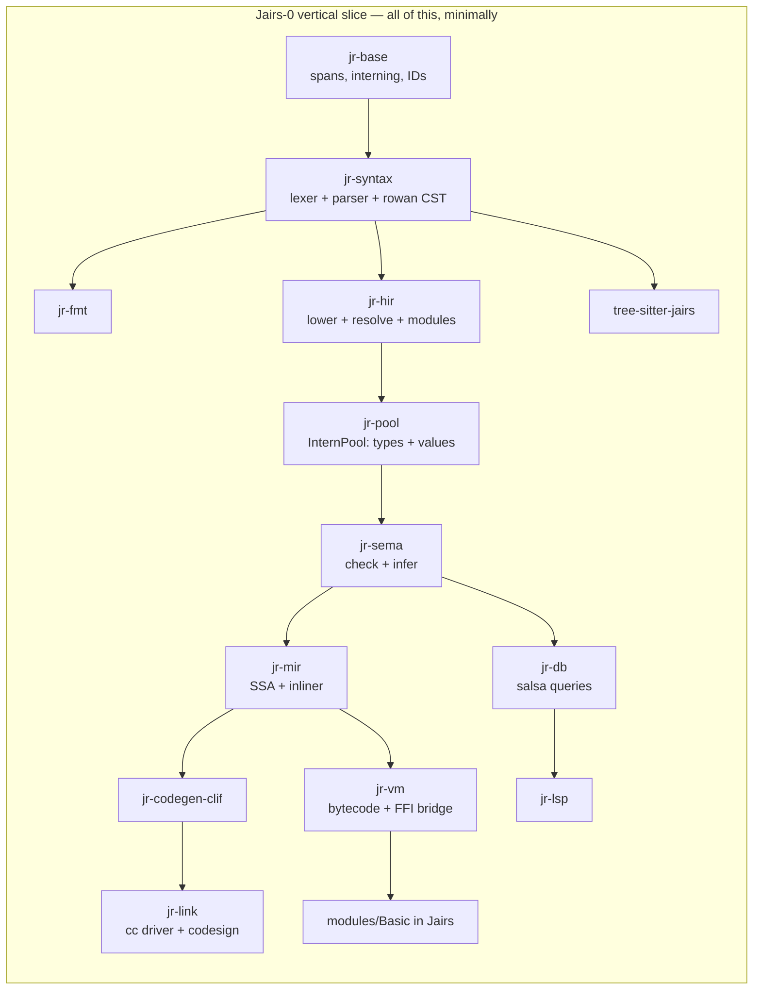
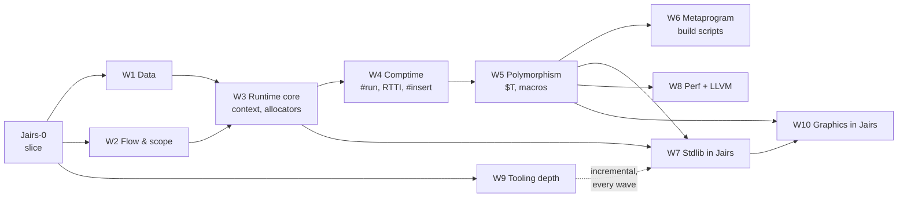
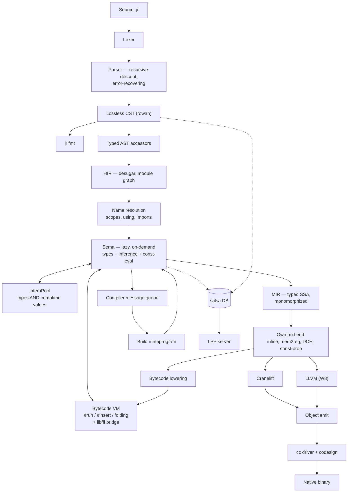

# Jairs — a Jai-like systems language in Rust

**Working name:** Jairs · **Source extension:** `.jr` · **Host language:** Rust (2024 edition)

> [!NOTE]
> **Strategy: tracer bullet, then thickening waves.**
> We do *not* build the compiler layer by layer. We first drive one absurdly small language subset all the
> way through **every** component — lexer, parser, CST, HIR, Sema, MIR, VM, Cranelift, linker, FFI, stdlib
> module, LSP, tree-sitter, formatter — until `hello.jr` is a native macOS binary and the LSP gives hover on
> it. Everything works, badly. *Then* we thicken it one feature-slice at a time.

---

## 0. Locked decisions

| # | Decision | Choice |
|---|---|---|
| 1 | Fidelity | **Jai-inspired, own language.** You own the spec. |
| 2 | Backend | **Cranelift first, LLVM later** behind a `Backend` trait. |
| 3 | Compile-time execution | **Bytecode VM over our own MIR.** Host-independent, trappable. |
| 4 | Parser | **One hand-written error-recovering parser** (rowan lossless CST), shared by compiler + LSP. tree-sitter is a *separate* editor grammar, CI-gated against drift. |
| 5 | Stdlib | **Written in Jairs itself**, like Jai. Core + OS + tooling first, graphics stack later. |
| 6 | Scope | **Solo, long-term serious, macOS arm64 first.** Linux x86-64 green in CI from the first native binary. |
| 7 | Build order | **Vertical slice first, then feature waves.** No component is "phase 2". |

### 0.1 Design questions — now resolved

| Question | Decision | Consequence |
|---|---|---|
| `context` ABI | **Hidden trailing parameter**; `#c_call` procedures opt out | Encoded in MIR's calling convention from day one. Function *types* carry a context flag. |
| Integer overflow | **Always trap** | Needs explicit wrapping operators (`+%`, `-%`, `*%`) or hash functions, PRNGs, and checksums become unwritable. **Added to Tier A.** Trap = a real runtime panic with a source location, and a *compile error* when detectable at comptime. |
| Bounds checks | **Like Jai: a build setting**, visible in the IR | MIR carries explicit `bounds_check` ops that a build-config pass strips. `#no_abc` opts out locally. |
| String representation | `{data: *u8, count: s64}`, **not** NUL-terminated | `to_c_string()` bridges to `#foreign` via temporary storage. |
| Polymorph identity | **Structural, on interned comptime arguments** — *my call* | An instantiation is keyed by the tuple of resolved comptime arg IDs in the InternPool, so `sort(Entity)` from two files dedupes to one function. Errors *display* nominally (`sort($T = Entity)`) so users see intent, not a key. Structural is required anyway once `Type` is a first-class comptime value. |
| Comptime FFI | **Yes**, gated behind `#foreign_at_comptime` | VM needs libffi-style dynamic calls. Non-negotiable given build scripts must read files. |
| Error handling | **Start exactly like Jai** — multiple returns + `#must` | But: reserve an **effect row slot in the function type representation** now, so an effects system can be added later without re-typing every signature. Costs nothing today; saves a rewrite. |

---

## 1. The vertical slice — "Jairs-0"

> [!IMPORTANT]
> **Definition of done for the slice:** `jr build examples/hello.jr` produces a signed native arm64 binary
> that prints when run; `jr run` executes the same file in the VM; opening it in VS Code gives diagnostics,
> hover types, and goto-definition; Neovim highlights it via tree-sitter; `jr fmt` round-trips it; and the
> printing itself comes from a stdlib module **written in Jairs** that calls libc via `#foreign`.

### 1.1 The Jairs-0 language subset

Deliberately tiny. Everything else is a later wave.

```jr
#import "Basic";                       // module system: one module, one file

Point :: struct { x: s64; y: s64; }    // structs, one level

add :: (a: s64, b: s64) -> s64 {       // procs, single return
    return a + b;
}

MESSAGE :: "hello from Jairs\n";       // constants
COMPUTED :: #run add(2, 3);            // one trivial comptime call

main :: () {
    p: Point;                          // decls: typed, and inferred below
    p.x = 4;
    sum := add(p.x, COMPUTED);         // := inference
    if sum > 5  print(MESSAGE);        // if
    i := 0;
    while i < 3 { i = i + 1; }         // while
    ptr := *sum;                       // pointer take + deref
    print(MESSAGE);
}
```

Included: `s64`, `u8`, `bool`, `string`, `*T`, `struct`, procs, `:=` / `: T` / `::`, `if`, `while`, `return`,
arithmetic (**trapping**), comparison, assignment, field access, pointer take/deref, `#import`, `#foreign`,
one `#run`.

> [!NOTE]
> `u8` is in the slice, not deferred to W1, because the string representation
> (`{data: *u8, count: s64}`, ADR-0004) and the libc `write` signature are both spelled in `*u8`. Choosing
> "stdlib in Jairs" forced this: you cannot express the bottom of the standard library without it. `u8`
> arithmetic and the rest of the numeric tower still wait for W1.

Excluded from the slice: arrays, `for`, `defer`, `using`, enums, unions, polymorphs, macros, `#insert`,
overloading, multiple returns, `context`, RTTI, floats, and the remaining numeric types. Each arrives as a
wave.

### 1.2 The slice's stdlib — `modules/Basic/`, in Jairs

This is the proof that decision #5 works. Roughly 40 lines of Jairs:

```jr
// modules/Basic/module.jr
libc :: #system_library "c";

write :: (fd: s64, buf: *u8, count: s64) -> s64 #foreign libc "write";

print :: (s: string) {
    write(1, s.data, s.count);
}
```

> [!CAUTION]
> **Correction found while building this: `print_int` is NOT implementable in Jairs-0.**
> Turning a digit into a byte for `write` needs an `s64` → `u8` conversion, and `cast` is reserved
> until W1. Every alternative needs something the slice also lacks — a `[N]u8` buffer (W1), pointer
> arithmetic (not in the subset, and no type checker yet to stop it being written by accident), or
> libc `printf` (variadic, and the arm64 variadic ABI passes variadic arguments on the stack, so a
> non-variadic `#foreign` declaration would silently produce garbage). Integer printing therefore
> lands with `cast` in **W1**, and the slice's exit criterion prints strings only.
>
> This is exactly the kind of constraint the tracer-bullet ordering exists to expose, and it cost
> minutes instead of being discovered during W7's stdlib push.

> [!WARNING]
> This forces `#foreign`, the string ABI, and the module loader into the **first** slice. That is the
> intended consequence of "stdlib in Jairs" — you cannot defer FFI to a later milestone if the bottom of
> your standard library is a syscall.

### 1.3 Slice work breakdown

Every crate gets created and does real work. Nothing is stubbed out with `todo!()` at the architectural level.



| Component | Slice scope | Why it can't wait |
|---|---|---|
| `jr-base` | Spans, `FileId`, `lasso` interner, `slotmap` arenas, newtype IDs | Everything depends on it |
| `jr-diag` | Diagnostic model + `annotate-snippets` rendering | Error quality is a design constraint, not a polish task |
| `jr-syntax` | Hand lexer (all tokens, trivia preserved), recursive-descent parser for the subset, **error recovery**, rowan CST, typed AST accessors | Recovery shape is hard to retrofit; LSP depends on it |
| `jr-fmt` | Formatter over the CST | Cheapest proof the CST is genuinely lossless |
| `jr-hir` | Lowering, module graph, `#import` resolution, scopes | Establishes the resolution model |
| `jr-pool` | InternPool for types **and** comptime values | Retrofitting interning is a rewrite. Steal Zig's design. |
| `jr-sema` | Lazy, on-demand checking; `:=` inference; one `#run` | Lazy-from-day-one is the whole reason M6-class comptime is possible later |
| `jr-mir` | Typed SSA, mem2reg, DCE, **a real inliner** | Cranelift has no inlining — it must exist before any backend |
| `jr-vm` | Register bytecode + interpreter + libffi bridge | It *is* the comptime engine; also gives `jr run` before any backend works |
| `jr-codegen` | `Backend` trait | Defining it now keeps LLVM from becoming a fork |
| `jr-codegen-clif` | Cranelift lowering, AArch64 AAPCS, Mach-O | The native path |
| `jr-link` | `.o` via `cranelift-object`, then shell out to `cc`; ad-hoc codesign | macOS binaries don't launch unsigned |
| `jr-db` | salsa 0.28 queries: file → tokens → CST → HIR → types | **The** reason the LSP won't be a fork of the compiler |
| `jr-lsp` | `lsp-server` loop: diagnostics, hover, goto-def | Proves the salsa boundary is real |
| `tree-sitter-jairs` | `grammar.js` + `highlights.scm` + corpus | Establishes the drift gate |
| `modules/Basic` | `print` / `print_line` via `#foreign` to libc `write` | Proves stdlib-in-Jairs |
| `tests/corpus` | ~20 `.jr` files: spec examples = parser tests = tree-sitter tests | One corpus, two parsers, CI-enforced |

### 1.4 Slice exit criteria

- [x] `jr fmt` byte-identically round-trips every corpus file — enforced by the
      `jairs-fmt` CI gate over `valid/`, `imports/valid/`, `tests/corpus/modules/`
      and `modules/`. `invalid/` is excluded on purpose: those files do not parse,
      and `jr fmt` correctly refuses to format input it could not parse.
- [x] `jr check broken.jr` recovers and reports multiple errors with rustc-grade
      rendering — `invalid/009-multiple-independent-errors.jr` asserts at least
      four independent errors from one file.
- [x] `jr run hello.jr` executes in the VM — `jr run tests/corpus/valid/024-hello.jr`
      prints both lines and exits 0. Asserted by `jr-cli`'s
      `run_executes_the_slice_exit_criterion`.
- [x] `jr build hello.jr && ./hello` — native arm64, launches, correct output.
      `jr build tests/corpus/valid/024-hello.jr` links through `cc` and the binary
      prints both lines and exits 0, byte-identically to the VM. Asserted by
      `jr-cli`'s `the_slice_exit_criterion_produces_output_in_both_engines`.
- [x] `COMPUTED :: #run add(2,3)` folds at compile time — folded by `jr-db`'s
      `file_consts` query (ADR-0018 §3) and interned, so it is indistinguishable
      from a literal: the MIR snapshot for `020-run-directive.jr` now reads
      `5_s64 + 1_s64`. VM and native now agree, by the differential harness below.
- [x] `print` comes from `modules/Basic` written in Jairs, via `#foreign` to libc
      `write` — executes, through libffi (ADR-0018 §4). ADR-0004's `{data, count}`
      is handed to `write` with no copy.
- [x] Integer overflow traps, in both the VM and native, with a source location —
      both engines trap and both name the line, byte-identically: `error: addition
      overflowed` then `  --> path:line:col`, exit status 4. ADR-0020 put the one
      formatter in `jr-base` so that a message chosen at *compile* time by the back
      end and one built at *run* time by the VM cannot drift, and
      `a_trap_names_its_source_location_identically_in_both_engines` compares the
      finished bytes. A trap on a compiler-invented value still reports without a
      location, which is `MirSpan::Synthetic` being honest rather than a gap.
- [ ] VS Code: diagnostics + hover + goto-def — **the server exists** (`jr lsp`,
      ADR-0024) and answers all three over LSP 3.17, asserted by
      `crates/jr-cli/tests/lsp_stdio.rs` speaking the real protocol to the real binary.
      What is missing is the VS Code *extension* that launches it, which is genuinely
      packaging. Until this wave §7 called the whole box packaging, which was wrong: it
      needed a crate that did not exist.
- [x] Neovim: tree-sitter highlighting — and diagnostics, hover and goto-definition
      besides. `editors/nvim/` is a runtimepath directory needing no plugin manager
      (ADR-0025); two lines in `init.lua` and one build script. Verified by
      `nvim --headless -u NONE -l editors/nvim/verify.lua`, 22 checks against the real
      editor and the real server. Verified rather than gated: Neovim is not a build
      dependency of this workspace.
- [ ] CI green on macOS arm64 **and** Linux x86-64 — the matrix is configured for
      both; only macOS arm64 has been verified locally.
- [x] CI drift gate: every corpus file parses cleanly in *both* the compiler and
      tree-sitter
- [x] Differential test harness exists: every corpus program's output must match
      under VM and native — `crates/jr-cli/tests/differential.rs`, which runs both
      engines as subprocesses and compares stdout, **stderr** and exit status. It
      enumerates the corpus itself rather than listing cases, so a new program is
      covered the day it is added. Because only two corpus programs print anything,
      it also carries cases that make a computation observable through `exit`, which
      is what gives it teeth: arithmetic, precedence, division truncation, loops,
      block parameters, `break`, pointers, short-circuit `&&`, struct field offsets,
      and both traps.

**Estimated: 10–14 weeks solo.** This is the milestone that decides whether the project is real.

### 1.5 Where the slice actually is

Status of each slice component, so this is answerable without reading the tree.
"Done" means implemented, tested, and green under every CI gate — not polished.

| Component | Status | Notes |
|---|---|---|
| `jr-base` | **Done** | Spans, `FileId`, `lasso` interning, `newtype_index!`, source map, the one trap-message formatter (ADR-0020 §2) |
| `jr-diag` | **Done** | Diagnostic model + `annotate-snippets` renderer |
| `jr-syntax` | **Done** | Lexer, error-recovering parser, rowan CST, typed AST |
| `jr-fmt` | **Done** | Formatter; corpus is canonical under it, CI-enforced |
| `jr-hir` | **Done** | Lowering, name resolution, flat import merge (ADR-0014) |
| `jr-pool` | **Done** | Types + comptime values in one pool (ADR-0015, ADR-0016 §3); layout (ADR-0018 §2); ADR-0002's integer arithmetic, shared by both evaluators (ADR-0022 §2) |
| `jr-sema` | **Done** | Signatures + checking (ADR-0016). No const-eval: that is `jr-vm` |
| `jr-db` | **Done** | salsa queries: module loader, sema, MIR built *and* optimized, const-eval, run (ADR-0007, ADR-0014, ADR-0018 §3, ADR-0021 §1) |
| `jr-cli` | **Done** | `jr check` (with `--module-path`), `jr fmt`, `jr parse`, `jr run`, `jr build`, `jr lsp` |
| `tree-sitter-jairs` | **Done** | Grammar + queries; drift gate green, and every query file is now compiled against the grammar (ADR-0025 §4) |
| `tests/corpus` | **Done** | 69 files, incl. `type-errors/` and `cfg-errors/` — one file per diagnostic |
| `modules/Basic` | **Done** | Written, resolving, type-checking and **executing**; MIR snapshotted |
| `jr-mir` | **Done** | Typed SSA, Braun construction, CFG diagnostics (ADR-0017); a mid-end of four passes — inliner, store-to-load forwarding, const-prop, DCE — behind `optimize` (ADR-0021, ADR-0022, ADR-0023). Forwarding is block-local; no SROA |
| `jr-vm` | **Done** | Register bytecode, interpreter, libffi bridge (ADR-0018); per-instruction spans, so a trap names its line (ADR-0020 §4); arithmetic via `jr-pool` (ADR-0022 §2). No JIT tier |
| `jr-codegen` | **Done** | Three-phase `Backend` trait, no `cranelift-*` type in it (ADR-0009, ADR-0019 §1) |
| `jr-codegen-clif` | **Done** | MIR → Cranelift IR, layout via `jr-pool`, traps through a generated helper (ADR-0019). Aggregate params only; aggregate returns and indirect calls refused |
| `jr-link` | **Done** | `cranelift-object` bytes, then `cc`; ad-hoc codesign is a fallback because `ld64` already signs |
| `jr-codegen-llvm` | **Not started** | Wave W8 owns it (ADR-0019 §5) |
| `jr-lsp` | **Done** | `lsp-server` loop over `jr-db` queries: diagnostics, hover, goto-definition, run as `jr lsp` (ADR-0024). No completion, rename or inlay hints — W9 owns those |
| `jr-driver` | **Not started** | |
| `editors/nvim` | **Done** | Runtimepath directory: LSP, tree-sitter parser + symlinked queries, filetype, ftplugin (ADR-0025). Neovim 0.11+. **Verified, not gated** — `editors/nvim/verify.lua`, 22 checks, needs an editor CI does not have |
| VS Code extension | **Not started** | The remaining half of §1.4's first box |

Accepted ADRs: 0001–0025. See [`docs/adr/README.md`](docs/adr/README.md).
Spec chapters written: 00 (overview), 01 (lexical), 02 (declarations),
03 (scoping and resolution). A type-system chapter is owed: ADR-0015 and ADR-0016
plus `jr-sema`'s crate docs are the only record of the typing rules today.

`jr-mir`'s mid-end is **four passes** behind `jr_mir::optimize` (ADR-0022 §3): the
inliner (ADR-0021), store-to-load forwarding (ADR-0023), constant propagation, and
dead-code elimination, run to a bounded fixed point because they feed each other.
`jr run` and `jr build` both consume the result through `optimized_file_mir`. There
will never be a `mem2reg` (ADR-0017 §2 makes it unnecessary rather than deferred).

**`024-hello.jr` now optimises.** Forwarding is what unlocked it: the `Point` slot
disappears entirely, `4 + 5` folds to `9`, `9 > 5` folds to `true`, the `if`
collapses, and DCE removes the arm that cannot run. The `ptr.* == 9` branch survives,
correctly — it reads through a real pointer, which forwarding refuses.

What is still missing is **cross-block forwarding** and **SROA**. Forwarding is one
walk per block, so a value written before a loop and read inside it stays in memory;
and a whole-slot store never feeds a field load, because MIR cannot extract a field
from a value — which is why `modules/Basic`'s `print` keeps its slot. The SSA value
arena is also never compacted, so a dead definition keeps its register (ADR-0022's
follow-on work).

No pass touches a body compile-time evaluation can reach (ADR-0021 §2), and the
check is the query's rather than each pass's. That is what keeps §3.1's invariant
true rather than merely likely: comptime runs MIR lowered inside `file_consts`,
which is upstream of the optimized query, so freezing the `#run` closure makes the
two engines run bit-identical MIR for every body either of them could disagree
about.

ADR-0002's integer arithmetic now has **two** implementations rather than three:
`jr-pool` owns the one both *evaluators* use, and `jr-codegen-clif` keeps its own
because it emits code rather than evaluating. The remaining pair is held equal by
`differential.rs` and nothing else, which ADR-0022 §2 states rather than implies.

Layout exists once, in `jr-pool` (ADR-0018 §2), and `jr-codegen-clif` calls it
rather than computing its own — the obligation ADR-0018 §2 exists to create, which
no verifier can enforce. What now guards it is
`crates/jr-cli/tests/differential.rs`: a struct field at a different offset in the
two engines changes an observable answer, and that test compares observable answers.

The toolchain floor is **rustc 1.94**, because `cranelift-codegen 0.134.2`'s
dependency chain requires it. `rust-toolchain.toml` still floats on stable.

---

## 2. Thickening waves

> [!IMPORTANT]
> **The rule that makes this work: a wave is not done until it has been pushed through every layer.**
> Every wave's checklist is the same eight items. If a feature parses but the LSP doesn't understand it, or
> tree-sitter can't highlight it, or the VM and native backend disagree about it, the wave is not done.

### 2.0 Per-wave definition of done

- [ ] **Spec** chapter written in `docs/spec/`
- [ ] **Corpus** files added (they *are* the spec examples)
- [ ] **Parser** + error recovery + `fmt`
- [ ] **Sema** + diagnostics with good spans
- [ ] **MIR** lowering + **VM** + **Cranelift**, verified equal by differential test
- [ ] **LSP** understands it (hover, completion, goto where applicable)
- [ ] **tree-sitter** grammar + highlight queries updated; drift gate green
- [ ] **Stdlib** uses it where it should (dogfooding is the acceptance test)

### 2.1 Wave order

| Wave | Content | Notes | Est. |
|---|---|---|---|
| **W1 — Data** | Full numeric tower (`s8..s64`, `u8..u64`, `float32/64`), wrapping ops `+% -% *%`, `enum`, `enum_flags`, `union`, `[N]T`, `[]T` views, `[..]T` dynamic arrays, `cast()`, `xx` autocast, operator overloading | Dynamic arrays need allocators → pulls `context` forward | 8–10 wks |
| **W2 — Flow & scope** | `for` with `it`/`it_index`, `for <`, labeled `break`/`continue`, `defer`, `using` (namespace + field promotion), multiple return values, named/default args, `#scope_*` visibility | `using` is the first genuinely hard resolution problem | 6–8 wks |
| **W3 — Runtime core** | `context` (hidden param, `#c_call` opt-out), allocators, temporary storage, bounds-check build config, panics/traps with backtraces | Unlocks a real stdlib | 6–8 wks |
| **W4 — Comptime** | Full `#run` (arbitrary code), aggressive const folding, RTTI (`Type` values, `type_info()`, `Any`), `#insert`, `#code`, the `Code` type | **Hardest wave.** Sema ↔ VM become mutually recursive; cycle detection with readable errors is the deliverable | 10–14 wks |
| **W5 — Polymorphism** | `$T`, `$$T`, `#modify`, `#bake_arguments`, `#expand` macros + hygiene, instantiation caching, **instantiation backtraces** in diagnostics | Depends on W4's InternPool value identity | 8–12 wks |
| **W6 — Metaprogram** | Workspaces, compiler message loop, `#run build()` build scripts replacing makefiles, plugin hooks, `@note` attributes | The Jai superpower. Build scripts become the build system. | 6–8 wks |
| **W7 — Stdlib** | In Jairs: `Basic`, `String`, dynamic array / hash table / bucket array, `Sort`, `Math` (vec/mat/quat), `Random`, `File`, `File_Utilities`, `Process`, `Thread` + atomics, `Time`, `Socket`, `JSON`, `Compiler` | Runs partly in parallel with W5/W6; each module is a wave-acceptance test | 14–18 wks |
| **W8 — Performance** | LLVM backend via `inkwell` (`--release`), inliner maturity, `#soa`, SIMD vectors, `#align`/`#place`, parallel Sema + parallel codegen, published compile-throughput number | Three-way differential testing: VM ≡ Cranelift ≡ LLVM | 10–14 wks |
| **W9 — Tooling depth** | Full LSP surface (completion, refs, rename, signature help, semantic tokens, **inlay type hints**, code actions), richer DWARF (locals, struct layouts) for lldb, VS Code + Neovim + Zed packaging | Incremental all along; this is the "make it excellent" pass | 8–10 wks |
| **W10 — Graphics, in Jairs** | `Window_Creation` (Cocoa via `#foreign`), GPU layer (Metal, then Vulkan), immediate-mode 2D renderer, image decode, immediate-mode UI, audio (CoreAudio/ALSA) | All *library* work, written in Jairs — no compiler changes. Gated on W5+W7. | 6+ months |

### 2.2 Wave dependency graph



---

## 3. Architecture

### 3.1 Pipeline



> [!IMPORTANT]
> **The load-bearing invariant:** comptime and runtime execute *the same* MIR. The VM consumes bytecode
> lowered from the identical MIR that Cranelift consumes. Any other arrangement guarantees `#run` and
> runtime silently disagree. This is Zig's model (ZIR → Sema → AIR) and it is correct.

### 3.2 Crate layout

```
jairs/
├── Cargo.toml                  # workspace
├── crates/
│   ├── jr-base/                # spans, FileId, interning, arenas, newtype IDs
│   ├── jr-diag/                # diagnostic model + annotate-snippets rendering
│   ├── jr-syntax/              # lexer, parser, SyntaxKind, rowan CST, typed AST
│   ├── jr-fmt/                 # formatter over the CST
│   ├── jr-hir/                 # desugared tree, module graph, scopes, resolution
│   ├── jr-pool/                # InternPool: types + comptime values
│   ├── jr-sema/                # checking, inference, polymorph instantiation
│   ├── jr-mir/                 # typed SSA IR + mid-end (incl. inliner)
│   ├── jr-vm/                  # bytecode, interpreter, comptime FFI bridge
│   ├── jr-codegen/             # Backend trait + shared lowering
│   ├── jr-codegen-clif/        # Cranelift
│   ├── jr-codegen-llvm/        # LLVM (feature = "llvm")
│   ├── jr-link/                # object emit + linker driver + codesign
│   ├── jr-db/                  # salsa database — shared by driver and LSP
│   ├── jr-driver/              # workspaces, message loop, build metaprograms
│   ├── jr-lsp/                 # language server
│   └── jr-cli/                 # the `jr` binary
├── modules/                    # standard library, written in Jairs
├── examples/
├── tests/corpus/               # shared syntax corpus (compiler + tree-sitter)
├── tree-sitter-jairs/          # separate editor grammar
└── docs/{spec,adr}/
```

### 3.3 Infrastructure choices

Versions verified 2026-07-25. **Pin exact versions for `cranelift-*` and `salsa`.**

| Concern | Choice | Version | Why |
|---|---|---|---|
| CST | `rowan` | 0.16.1 | rust-analyzer's red/green tree. `cstree` 0.14 only if `Send` trees are needed later. |
| Lexer | hand-written | — | `logos` is regex-per-token; nested comments + `#`-directive context are awkward. ~400 lines you own. |
| Parser | hand-written | — | Error-recovery quality *is* LSP quality. No generator delivers this. |
| Diagnostics | `annotate-snippets` | 0.12.16 | Literally rustc's renderer → rustc-identical output. |
| Incrementality | `salsa` | 0.28.1 | From the slice, not later. RA-proven. API churns — pin exactly. |
| Backend | `cranelift-*` | 0.134.2 | x86-64 + aarch64 with Apple Silicon CC. **APIs are not semver-stable.** |
| Objects / DWARF | `object`, `gimli` | 0.39.1 / 0.34.0 | Emit `.o`, shell out to `cc`. Never hand-roll Mach-O linking. |
| LSP transport | `lsp-server` | 0.10.0 | Sync, you own threading — correct pairing with salsa. `tower-lsp` is stale (2023). |
| LSP types | `lsp-types` | 0.97.0 | Stale but standard; LSP 3.17. |
| Golden tests | `insta` | 1.48.0 | Snapshot CST/HIR/MIR/diagnostics. |
| Fuzzing | `cargo-fuzz` + `arbitrary` | 0.13.2 / 1.4.2 | Parser fuzzing from the slice. |
| Interning | `lasso`, `slotmap`, `bumpalo` | 0.7.3 / 1.1.1 / 3.20 | rustc style: intern everything, index by `u32` newtypes. |
| tree-sitter | `tree-sitter` + CLI | 0.26.11 | Editor grammar only. |
| Comptime FFI | `libffi` (Rust bindings) | — | Required by `#foreign_at_comptime`. |

> [!WARNING]
> **Cranelift has no function inlining**, and only limited loop optimization (LICM/GVN/const-fold via its
> egraph mid-end). Codegen is ~14% slower than LLVM, but it compiles ~10× faster. The inliner must live in
> *your* MIR mid-end — which you need anyway for `#expand` macros and comptime.

---

## 4. Timeline

| Phase | Cumulative (solo, serious) |
|---|---|
| **Jairs-0 vertical slice** — everything works, badly | **~3 months** |
| W1–W3 — a real, usable procedural language | ~8–10 months |
| W4–W5 — comptime + polymorphism (the Jai soul) | **~16–20 months** |
| W6–W7 — build metaprograms + stdlib in Jairs | ~24–30 months |
| W8–W9 — performance parity + excellent tooling | ~32–40 months |
| W10 — graphics stack, game-dev viable | **~42–48 months** |

> [!NOTE]
> These are honest numbers. Zig took ~8 years with a funded team; Odin has had a decade. The slice-first
> structure exists precisely so you have **a real, native, LSP-supported language in ~3 months** rather than
> a half-built type checker in 12.

---

## 5. Top risks

| Risk | Why it bites | Mitigation |
|---|---|---|
| **Sema ↔ comptime recursion** | `#run` yields types; types need Sema; Sema may need `#run`. Pass-ordered checkers can't express this. | Lazy on-demand Sema over salsa **in the slice**. Explicit dependency graph + cycle diagnostics. Copy Zig's Sema/InternPool. |
| **No inlining in Cranelift** | Macro- and comptime-heavy code is slow; `#expand` assumes inlining. | Inliner in MIR during the slice, before any backend exists. |
| **Always-trap overflow with no wrapping ops** | Hash functions, PRNGs, checksums become unwritable — discovered while writing the stdlib. | `+% -% *%` promoted into **W1**. |
| **Stdlib-in-Jairs pulls FFI early** | The bottom of the stdlib is a syscall. | `#foreign` is in the **slice**, by design. |
| **Errors inside polymorph instantiations** | #1 reason generics feel bad. | Instantiation backtraces designed into `jr-diag` in the slice, not retrofitted in W5. |
| **LSP as a fork of the compiler** | Batch compilers assume "parse all then check"; IDEs need incremental + error-tolerant. | salsa in the slice; the LSP is a *consumer* of the same queries. Never two frontends. |
| **tree-sitter drift** | Two grammars always diverge. | Shared `tests/corpus/`; CI gates both parsers; grammar changes require a corpus file. |
| **Cranelift API churn** | Explicitly not semver-stable. | Pin exactly; confine all contact to `jr-codegen-clif` behind `Backend`. |
| **macOS arm64 specifics** | Codesigning, `ld-prime`, DWARF quirks. | Always link through `cc`; ad-hoc codesign in `jr-link`; keep Linux green as a sanity oracle. |
| **Scope creep into graphics** | Most tempting, most destabilizing. | Hard gate: W10 starts only after W7. It requires *zero* compiler changes — that's the test of readiness. |
| **Solo burnout** | The real killer of language projects. | Every wave ends in a runnable demo. `fmt` and LSP ship in month 3. |

---

## 6. Prior art to mine before W4

| Project | Impl | Backend | Comptime | Steal |
|---|---|---|---|---|
| **Zig** | Zig | LLVM + own x64/aarch64/wasm | **Sema interprets ZIR → AIR, global InternPool** | *The* reference. InternPool, lazy Sema, "interpret the same IR you compile". Read `Sema.zig` + `InternPool.zig`. |
| **roc** | **Rust** | Cranelift (dev) + LLVM (release) | — | Dual-backend split behind one trait; Rust codegen patterns; monomorphization. |
| **rust-analyzer** | Rust | — | — | rowan CST, salsa design, `lsp-server` loop, error-recovering parser structure. |
| **Odin** | C | LLVM | Limited | Clean multi-pass checker; package/scope model. |
| **starlark-rust** | Rust | Bytecode interp | — | Fast bytecode eval + freezing, for `jr-vm`. |
| **rune / koto** | Rust | Register/stack VM | — | VM value model + instruction encoding. |
| **gleam** | Rust | Erlang/JS | — | Best-in-class CLI ergonomics and diagnostics polish. |

> [!NOTE]
> No production-grade open-source Jai reimplementation exists — only toys. **Zig is the reference for
> comptime; roc is the reference for a Rust-hosted dual-backend compiler.**

---

## 7. Immediate next actions

Everything through the **language server** is done: workspace scaffolding, the ADRs,
spec chapters 00–03, the corpus plus the drift gate, the lexer→parser→CST→`jr fmt` inch,
HIR and name resolution, the module loader, the InternPool, `jr-sema`, `jr-mir`,
`jr-vm`, `jr-codegen`, `jr-codegen-clif`, `jr-link`, a four-pass mid-end, and `jr-lsp`.
See §1.5 for component status. **695 workspace tests**, all six gates green.

**ADR-0007's central claim is no longer an assertion.** The LSP is a consumer of the
same salsa queries as the batch compiler: `diagnostics` is `file_diagnostics` reshaped,
`hover` is `checked`'s `TypeMap` looked up, `goto_definition` is `resolved`'s
`ResolveMap` followed. The only thing in `jr-lsp` that is not a query is the offset-to-
node scan, and that is because ADR-0013 deferred `AstIdMap`.

### Two corrections this wave had to make first

Both were claims **this document** made, and both were wrong.

- **§7 said the slice's remaining boxes were "editor packaging and a Linux CI run,
  neither of which is compiler work", for three waves.** §1.4's first open box is *"VS
  Code: diagnostics + hover + goto-def"*, which needed a crate that was one line of doc
  comment with no dependencies — while §1.3 scoped `jr-lsp` into the slice in as many
  words, justified as "proves the salsa boundary is real", and `lsp-server` and
  `lsp-types` sat pinned and unused in §5's table from the beginning. The box is now
  rewritten to separate the server (done) from the extension (packaging).
- **§7 and ADR-0022 §1 said "§1.3's estimate has been waiting for" a performance
  number.** §1.3 contains no performance estimate; its only figure is §1.4's "Estimated:
  10–14 weeks solo", which is a schedule. §2.1 assigns the published compile-throughput
  number to **wave W8**, and ADR-0019 §6's wording is a *trigger* — the inliner must
  exist before any number is published — not a debt. The inliner exists, so nothing is
  owed. ADR-0022 stays as written, because an ADR is immutable; ADR-0024's Context is
  the record that one of its sentences was false.

The lesson is the one this project keeps relearning: **a claim in a plan is not evidence.**
Three waves of handoff repeated "the rest is packaging" without anyone opening
`crates/jr-lsp/src/lib.rs`.

### What the language-server wave landed

- [x] **ADR-0024**, five decisions: a span scan rather than `AstIdMap`; a worker thread
      reading a snapshot with salsa's own cancellation; negotiated position encoding with
      a UTF-16 fallback; pure handlers plus one stdio smoke test; and `jr lsp` rather
      than a second binary.
- [x] **`JairsDatabase::snapshot`** — a field-wise clone, because `Interner` was already
      an `Arc<ThreadedRodeo>` and every other field was already behind a mutex.
- [x] **`jr-lsp`**: `position` (encoding conversion), `uri` (`file:` paths, hand-written
      because `lsp-types` 0.97 dropped `Url`), `locate` (offset → HIR node), `handlers`
      (the three capabilities), `server` (the stdio loop).
- [x] **`jr lsp`**, and no new workspace dependency: `lsp-server`, `lsp-types`, `salsa`,
      `serde_json` and `crossbeam-channel` were all already pinned.
- [x] **27 new tests**, of which three speak the real protocol to the real binary.

Four things about this wave are worth carrying forward.

- **The stdio test earned its place on the first run.** `io.join()` waits for the writer
  thread, which runs until every `Sender` into it is dropped — and `connection.sender` is
  one of them. Joining while `connection` was still in scope deadlocked: every request
  was answered correctly and the process simply never exited. No handler test could see
  that, which is exactly why ADR-0024 §4 required a transport test and why the
  `jr-codegen` lesson (both lines printed, exit status 1) was the argument for it.
- **The worker held its snapshot between jobs, and that is a stall by construction.**
  salsa blocks a writer until the snapshot count returns to one, so a cached snapshot
  makes every edit wait for the last request. Each job now *owns* its snapshot, so the
  borrow ends when the job does — including when it unwinds. ADR-0024 §2 predicted this
  footgun in prose and the first implementation walked into it anyway.
- **`jr_db::LineIndex::line_col` is 1-based and LSP is 0-based.** Converted once, in
  `position.rs`, because the same off-by-one applied at four call sites is how a server
  ends up highlighting the line below the error.
- **`lsp-types` 0.97 replaced `Url` with a newtype over `fluent_uri::Uri`**, which knows
  nothing about filesystem paths. Rather than add the `url` crate, `jr-lsp` owns ~40
  lines of path↔URI conversion — and refuses Windows paths with a `compile_error!`
  instead of half-handling them.

Diagnostic codes: **E0231 is still the first free code.** `jr-lsp` defines none: it
reports what the queries produced and adds no analysis. E0230 is `jr-db`'s const-eval
failure; E0227–E0229 are `jr-mir`'s. Beware that `jr-syntax`' parser still illegally
emits E0200/E0201/E0202 for "arrives in wave Wn" errors, colliding with `jr-hir` — do
not filter tests by those.

### Next: close the slice, for real this time

What remains of §1.4 is now genuinely packaging and platform work, and it is worth
saying that only because the previous claim to that effect was checked and found false.

#### Work items, in dependency order

- [ ] **A VS Code extension** that launches `jr lsp`, contributes the `jairs` language id
      and the `.jr` extension, and ships the tree-sitter grammar for highlighting. Small,
      and it is what makes §1.4's first box tickable.
- [ ] **Neovim packaging** — an `lspconfig` entry and the tree-sitter parser registration.
      The grammar and queries already exist and the drift gate is green.
- [ ] **A verified Linux x86-64 CI run.** The matrix is configured and has never run.
      Expect real work rather than a green tick: `cranelift_native` asks the host,
      `jr-pool` supplies layout, `cc` is invoked differently, and there is no codesigning
      step — so "should work" and "has been run" are different claims and only the second
      belongs in a status table.
- [ ] **Then wave W8's compile-throughput number**, where §2.1 puts it. ADR-0023's
      follow-on records why a *runtime* number waits for W1: Jairs-0 has no arrays, no
      `for`, no floats and no way to print an integer, so the only expressible workload
      is arithmetic in a `while` loop.

#### Also open, and smaller

- **Keystroke-to-diagnostic latency**, which ADR-0013 named as its own trigger for
  deciding whether `AstIdMap` earns its keep. This wave is what makes it measurable: the
  offset-to-node scan is O(nodes) per request.
- **Cross-block store-to-load forwarding, or SROA.** ADR-0023 §1's rejected alternatives.
- **Compact the SSA value arena**, so a dead definition stops costing a register.
- **A finer optimized-MIR key.** ADR-0021 §1's rejected alternative.
- **An inline stack per span.** ADR-0021 §3's, which `#expand` makes a semantic
  requirement.
- **A cross-file `#run`.** ADR-0021 §2's soundness depends on its absence;
  `a_cross_file_run_is_still_refused` is the tripwire.
- **Aggregate returns and calls through a procedure pointer**, `Unsupported` in both
  engines.

#### Traps

- **Do not hold a database snapshot across requests.** ADR-0024 §2. salsa blocks a writer
  until the count returns to one, so a cached snapshot stalls the next keystroke — and
  this wave's first implementation did exactly that.
- **Do not print to stdout from `jr lsp`.** It is the protocol channel; one stray byte
  desynchronises the framing for the whole session.
- **Do not compute a value outside `jr-pool`.** ADR-0022 §2. A second evaluator produces
  agreement on a wrong answer, not a visible disagreement.
- **Do not compute layout.** ADR-0017 §5, and ADR-0023 §3's disjointness comes from
  projection indices for the same reason.
- **Do not optimise a frozen body.** ADR-0021 §2.
- **Do not delete a statement without proving its rvalue pure**, and do not forward a
  load whose place is not *identical* to the store's.
- **Do not format a trap message anywhere but `jr_base::trap_message`.**
- **Do not add a corpus file without checking it is executed.**
- **Do not believe a handoff about what is left.** Open the file.

### After the slice

Wave W1 (§2.1): the numeric tower, `cast`, arrays, `enum`. That is where a benchmark
becomes writable and where `print_int` finally exists.
