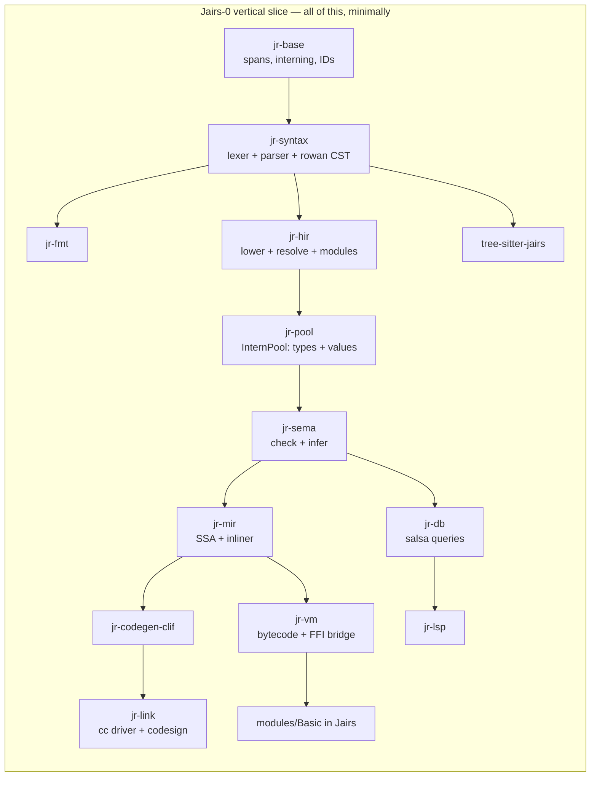
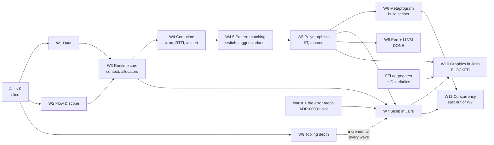
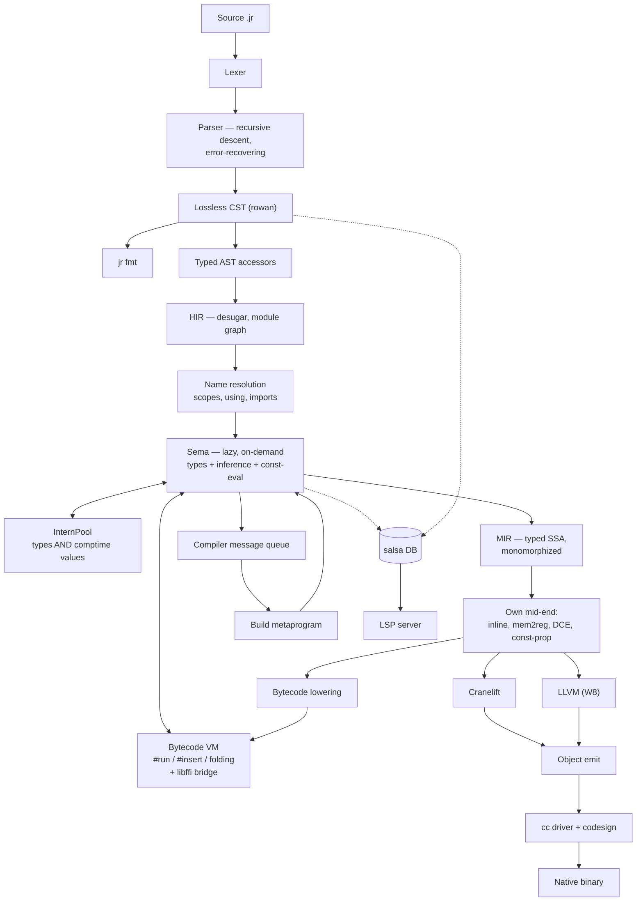

# Jairs — a Jai-like systems language in Rust

**Working name:** Jairs · **Source extension:** `.jr` · **Host language:** Rust (2024 edition)

> [!NOTE]
> **Strategy: tracer bullet, then thickening waves.**
> We do *not* build the compiler layer by layer. We first drive one absurdly small language subset all the
> way through **every** component — lexer, parser, CST, HIR, Sema, MIR, VM, Cranelift, linker, FFI, stdlib
> module, LSP, tree-sitter, formatter — until `hello.jr` is a native macOS binary and the LSP gives hover on
> it. Everything works, badly. *Then* we thicken it one feature-slice at a time.

---

## 0. Locked decisions

| # | Decision | Choice |
|---|---|---|
| 1 | Fidelity | **Jai-inspired, own language.** You own the spec. |
| 2 | Backend | **Cranelift first, LLVM later** behind a `Backend` trait. |
| 3 | Compile-time execution | **Bytecode VM over our own MIR.** Host-independent, trappable. |
| 4 | Parser | **One hand-written error-recovering parser** (rowan lossless CST), shared by compiler + LSP. tree-sitter is a *separate* editor grammar, CI-gated against drift. |
| 5 | Stdlib | **Written in Jairs itself**, like Jai. Core + OS + tooling first, graphics stack later. |
| 6 | Scope | **Solo, long-term serious, macOS arm64 first.** Linux x86-64 green in CI from the first native binary. |
| 7 | Build order | **Vertical slice first, then feature waves.** No component is "phase 2". |

### 0.1 Design questions — now resolved

| Question | Decision | Consequence |
|---|---|---|
| `context` ABI | **Hidden trailing parameter**; `#c_call` procedures opt out | Encoded in MIR's calling convention from day one. Function *types* carry a context flag. |
| Integer overflow | **Always trap** | Needs explicit wrapping operators (`+%`, `-%`, `*%`) or hash functions, PRNGs, and checksums become unwritable. **Added to Tier A.** Trap = a real runtime panic with a source location, and a *compile error* when detectable at comptime. |
| Bounds checks | **Like Jai: a build setting**, visible in the IR | MIR carries explicit `bounds_check` ops that a build-config pass strips. `#no_abc` opts out locally. |
| String representation | `{data: *u8, count: s64}`, **not** NUL-terminated | `to_c_string()` bridges to `#foreign` via temporary storage. |
| Polymorph identity | **Structural, on interned comptime arguments** — *my call* | An instantiation is keyed by the tuple of resolved comptime arg IDs in the InternPool, so `sort(Entity)` from two files dedupes to one function. Errors *display* nominally (`sort($T = Entity)`) so users see intent, not a key. Structural is required anyway once `Type` is a first-class comptime value. |
| Comptime FFI | **Yes**, gated behind `#foreign_at_comptime` | VM needs libffi-style dynamic calls. Non-negotiable given build scripts must read files. |
| Error handling | **Start exactly like Jai** — multiple returns + `#must` | But: reserve an **effect row slot in the function type representation** now, so an effects system can be added later without re-typing every signature. Costs nothing today; saves a rewrite. |

---

## 1. The vertical slice — "Jairs-0"

> [!IMPORTANT]
> **Definition of done for the slice:** `jr build examples/hello.jr` produces a signed native arm64 binary
> that prints when run; `jr run` executes the same file in the VM; opening it in a real editor gives
> diagnostics, hover and goto-definition; Neovim highlights it via tree-sitter; `jr fmt` round-trips it; and the
> printing itself comes from a stdlib module **written in Jairs** that calls libc via `#foreign`.

### 1.1 The Jairs-0 language subset

Deliberately tiny. Everything else is a later wave.

```jr
#import "Basic";                       // module system: one module, one file

Point :: struct { x: s64; y: s64; }    // structs, one level

add :: (a: s64, b: s64) -> s64 {       // procs, single return
    return a + b;
}

MESSAGE :: "hello from Jairs\n";       // constants
COMPUTED :: #run add(2, 3);            // one trivial comptime call

main :: () {
    p: Point;                          // decls: typed, and inferred below
    p.x = 4;
    sum := add(p.x, COMPUTED);         // := inference
    if sum > 5  print(MESSAGE);        // if
    i := 0;
    while i < 3 { i = i + 1; }         // while
    ptr := *sum;                       // pointer take + deref
    print(MESSAGE);
}
```

Included: `s64`, `u8`, `bool`, `string`, `*T`, `struct`, procs, `:=` / `: T` / `::`, `if`, `while`, `return`,
arithmetic (**trapping**), comparison, assignment, field access, pointer take/deref, `#import`, `#foreign`,
one `#run`.

> [!NOTE]
> `u8` is in the slice, not deferred to W1, because the string representation
> (`{data: *u8, count: s64}`, ADR-0004) and the libc `write` signature are both spelled in `*u8`. Choosing
> "stdlib in Jairs" forced this: you cannot express the bottom of the standard library without it. `u8`
> arithmetic and the rest of the numeric tower still wait for W1.

Excluded from the slice: arrays, `for`, `defer`, `using`, enums, unions, polymorphs, macros, `#insert`,
overloading, multiple returns, `context`, RTTI, floats, and the remaining numeric types. Each arrives as a
wave.

### 1.2 The slice's stdlib — `modules/Basic/`, in Jairs

This is the proof that decision #5 works. Roughly 40 lines of Jairs:

```jr
// modules/Basic/module.jr
libc :: #system_library "c";

write :: (fd: s64, buf: *u8, count: s64) -> s64 #foreign libc "write";

print :: (s: string) {
    write(1, s.data, s.count);
}
```

> [!CAUTION]
> **Correction found while building this: `print_int` is NOT implementable in Jairs-0.**
> Turning a digit into a byte for `write` needs an `s64` → `u8` conversion, and `cast` is reserved
> until W1. Every alternative needs something the slice also lacks — a `[N]u8` buffer (W1), pointer
> arithmetic (not in the subset, and no type checker yet to stop it being written by accident), or
> libc `printf` (variadic, and the arm64 variadic ABI passes variadic arguments on the stack, so a
> non-variadic `#foreign` declaration would silently produce garbage). Integer printing therefore
> lands with `cast` in **W1**, and the slice's exit criterion prints strings only.
>
> This is exactly the kind of constraint the tracer-bullet ordering exists to expose, and it cost
> minutes instead of being discovered during W7's stdlib push.

> [!WARNING]
> This forces `#foreign`, the string ABI, and the module loader into the **first** slice. That is the
> intended consequence of "stdlib in Jairs" — you cannot defer FFI to a later milestone if the bottom of
> your standard library is a syscall.

### 1.3 Slice work breakdown

Every crate gets created and does real work. Nothing is stubbed out with `todo!()` at the architectural level.



| Component | Slice scope | Why it can't wait |
|---|---|---|
| `jr-base` | Spans, `FileId`, `lasso` interner, `slotmap` arenas, newtype IDs | Everything depends on it |
| `jr-diag` | Diagnostic model + `annotate-snippets` rendering | Error quality is a design constraint, not a polish task |
| `jr-syntax` | Hand lexer (all tokens, trivia preserved), recursive-descent parser for the subset, **error recovery**, rowan CST, typed AST accessors | Recovery shape is hard to retrofit; LSP depends on it |
| `jr-fmt` | Formatter over the CST | Cheapest proof the CST is genuinely lossless |
| `jr-hir` | Lowering, module graph, `#import` resolution, scopes | Establishes the resolution model |
| `jr-pool` | InternPool for types **and** comptime values | Retrofitting interning is a rewrite. Steal Zig's design. |
| `jr-sema` | Lazy, on-demand checking; `:=` inference; one `#run` | Lazy-from-day-one is the whole reason M6-class comptime is possible later |
| `jr-mir` | Typed SSA, mem2reg, DCE, **a real inliner** | Cranelift has no inlining — it must exist before any backend |
| `jr-vm` | Register bytecode + interpreter + libffi bridge | It *is* the comptime engine; also gives `jr run` before any backend works |
| `jr-codegen` | `Backend` trait | Defining it now keeps LLVM from becoming a fork || **Done** | **`TrapKind` and `TRAP_HELPER` live here** (ADR-0143 §6), moved out of `jr-codegen-clif`: they are the *words* a trapping program prints, paired with `jr_base::trap_message`, and a second copy in the LLVM back end would be a second chance to drift from the bytes the differential compares. `Backend` gained **`libraries()`** for the same reason the move happened — the link line was an inherent method on `ClifBackend`, so a driver naming a concrete back end could only ever drive one. 
| `jr-codegen-clif` | Cranelift lowering, AArch64 AAPCS, Mach-O | The native path |
| `jr-link` | `.o` via `cranelift-object`, then shell out to `cc`; ad-hoc codesign | macOS binaries don't launch unsigned |
| `jr-db` | salsa 0.28 queries: file → tokens → CST → HIR → types | **The** reason the LSP won't be a fork of the compiler |
| `jr-lsp` | `lsp-server` loop: diagnostics, hover, goto-def | Proves the salsa boundary is real |
| `tree-sitter-jairs` | `grammar.js` + `highlights.scm` + corpus | Establishes the drift gate |
| `modules/Basic` | `print` / `print_line` via `#foreign` to libc `write` | Proves stdlib-in-Jairs |
| `tests/corpus` | ~20 `.jr` files: spec examples = parser tests = tree-sitter tests | One corpus, two parsers, CI-enforced |

### 1.4 Slice exit criteria

- [x] `jr fmt` byte-identically round-trips every corpus file — enforced by the
      `jairs-fmt` CI gate over `valid/`, `imports/valid/`, `tests/corpus/modules/`
      and `modules/`. `invalid/` is excluded on purpose: those files do not parse,
      and `jr fmt` correctly refuses to format input it could not parse.
- [x] `jr check broken.jr` recovers and reports multiple errors with rustc-grade
      rendering — `invalid/009-multiple-independent-errors.jr` asserts at least
      four independent errors from one file.
- [x] `jr run hello.jr` executes in the VM — `jr run tests/corpus/valid/024-hello.jr`
      prints both lines and exits 0. Asserted by `jr-cli`'s
      `run_executes_the_slice_exit_criterion`.
- [x] `jr build hello.jr && ./hello` — native arm64, launches, correct output.
      `jr build tests/corpus/valid/024-hello.jr` links through `cc` and the binary
      prints both lines and exits 0, byte-identically to the VM. Asserted by
      `jr-cli`'s `the_slice_exit_criterion_produces_output_in_both_engines`.
- [x] `COMPUTED :: #run add(2,3)` folds at compile time — folded by `jr-db`'s
      `file_consts` query (ADR-0018 §3) and interned, so it is indistinguishable
      from a literal: the MIR snapshot for `020-run-directive.jr` now reads
      `5_s64 + 1_s64`. VM and native now agree, by the differential harness below.
- [x] `print` comes from `modules/Basic` written in Jairs, via `#foreign` to libc
      `write` — executes, through libffi (ADR-0018 §4). ADR-0004's `{data, count}`
      is handed to `write` with no copy.
- [x] Integer overflow traps, in both the VM and native, with a source location —
      both engines trap and both name the line, byte-identically: `error: addition
      overflowed` then `  --> path:line:col`, exit status 4. ADR-0020 put the one
      formatter in `jr-base` so that a message chosen at *compile* time by the back
      end and one built at *run* time by the VM cannot drift, and
      `a_trap_names_its_source_location_identically_in_both_engines` compares the
      finished bytes. A trap on a compiler-invented value still reports without a
      location, which is `MirSpan::Synthetic` being honest rather than a gap.
- [x] An editor gives diagnostics, hover and goto-def over the real protocol — **by
      Neovim, and there will be no VS Code extension** (ADR-0036). This criterion named
      VS Code as its example and the example was wrong for this project: the decider does
      not use it, so a packaging target there is unverifiable in practice and would rot the
      way this box's Neovim half rotted before ADR-0025. The *intent* — a real editor, over
      LSP 3.17, against the real binary — is met twelve capabilities over, and
      `crates/jr-cli/tests/lsp_stdio.rs` asserts the protocol independently of any client.
      Closed rather than abandoned: five consecutive handoffs listed "a VS Code extension"
      as owed work nobody intended to do, which makes the whole list less trustworthy.
- [x] Neovim: tree-sitter highlighting — and diagnostics, hover and goto-definition
      besides. `editors/nvim/` is a runtimepath directory needing no plugin manager
      (ADR-0025); two lines in `init.lua` and one build script. Verified by
      `nvim --headless -u NONE -l editors/nvim/verify.lua`, 166 checks against the real
      editor and the real server. Verified rather than gated: Neovim is not a build
      dependency of this workspace.
- [ ] CI green on macOS arm64 **and** Linux x86-64 — the matrix is configured for
      both, and **no CI run has ever happened**: `main` has never been pushed, so every
      gate has only ever been green locally, on macOS arm64. That also means the
      tree-sitter corpus job — the only check that can see a *wrong parse tree* rather
      than an error count — has never run.
- [x] CI drift gate: every corpus file parses cleanly in *both* the compiler and
      tree-sitter
- [x] Differential test harness exists: every corpus program's output must match
      under VM and native — `crates/jr-cli/tests/differential.rs`, which runs both
      engines as subprocesses and compares stdout, **stderr** and exit status. It
      enumerates the corpus itself rather than listing cases, so a new program is
      covered the day it is added. Because only two corpus programs print anything,
      it also carries cases that make a computation observable through `exit`, which
      is what gives it teeth: arithmetic, precedence, division truncation, loops,
      block parameters, `break`, pointers, short-circuit `&&`, struct field offsets,
      and both traps.

**Estimated: 10–14 weeks solo.** This is the milestone that decides whether the project is real.

### 1.5 Where the slice actually is

Status of each slice component, so this is answerable without reading the tree.
"Done" means implemented, tested, and green under every CI gate — not polished.

| Component | Status | Notes |
|---|---|---|
| `jr-base` | **Done** | `trap_message` takes a `frames: &[&str]` and emits one `  in <name>` line per frame, innermost first (ADR-0066 §2). It stays the **one** place that decides what a trap says, which is what keeps two engines rendering at different *times* — native at compile time, the VM at run time — from drifting in punctuation or order (ADR-0020 §2's argument, now applied to a chain). Spans, `FileId`, `lasso` interning, `newtype_index!`, source map, the one trap-message formatter (ADR-0020 §2) |
| `jr-diag` | **Done** | Diagnostic model + `annotate-snippets` renderer |
| `jr-syntax` | **Done** | **`VECTOR_TYPE`** is `#simd [N]T` — *one* node rather than an attribute node wrapping an `ARRAY_TYPE`, because unlike `#align`/`#place` the attribute and the array are inseparable: neither means anything without the other (ADR-0148 §1). Taken in **type** position rather than the declaration attribute loop, so it survives a parameter list and a return type. `DIRECTIVE` joined `TYPE_START`, the fourth recorded instance of that token-set trap — without it `v: #simd [4]s32` reported "expected a type after `:`" at the `#`. E0133 is a `#simd` with no array type, and the first parser code added in three waves. **`@note`** is `NOTE`, taken in the same attribute loop as the directives but its own kind, since a note is *data for a metaprogram* while a directive is an *instruction to the compiler* (ADR-0098 §1); `parse_note()` takes `@name` or `@name "payload"`, and `looks_like_proc_signature` took `AT` — the token-set trap for the **seventh** time. **`#modify { … }`** is `MODIFY_ATTR`, the one procedure attribute that carries a **block** (ADR-0093 §1); `looks_like_proc_signature` took it too — the token-set trap for the *sixth* time. **`looks_like_proc_signature` takes `#expand`** (ADR-0091 §4) — the token-set trap for the fifth time: a *void* macro `f :: (x: s64) #expand { … }` reaches neither `ARROW` nor `L_BRACE`, so it was read as a parenthesised-expression constant and produced fourteen cascading errors. **`#expand`** joins the procedure attribute loop as `EXPAND_ATTR` (ADR-0090 §1), so the three attributes take any order — its own kind beside `C_CALL_ATTR`/`NO_ABC_ATTR` so a consumer that forgets it is a missing arm, not a silent fall-through. **`$N: s64` — a comptime-value parameter** (ADR-0087 §1): `parse_param` accepts an optional leading `$` before the name (a `DOLLAR` child of `PARAM`, distinct from a `$T` `POLY_TYPE` in *type* position), the param-list continuation gate widens for it (the recurring token-set trap), and `Param::is_comptime` reads it. **`struct($T) { … }` and `Box(s64)`** (ADR-0085 §3): `STRUCT_TYPE_PARAMS` (a `($T)` list before the brace, `parse_struct_type_params`) and `TYPE_ARGUMENTS` (a `(s64)` list after a name in type position, `parse_type_arguments`), both optional so an ordinary struct and a bare name are unchanged; the `(` binds to the name in `parse_type_inner`, and a proc-pointer type's `(` is a different arm, so no ambiguity. AST accessors `StructType::params`, `NameType::arguments`, `TypeArguments::args`, `StructTypeParams::vars`. `$` lexes as `DOLLAR` and `$T` parses as a `POLY_TYPE` in type position, with `DOLLAR` in `TYPE_START` (ADR-0081). `CODE_STMT` and `parse_code_stmt` for `#code { … }` (ADR-0080 §1), checked **before** the `EXPR_START` arm because a `{` is neither a string nor an operand expression; braces required, E0131 reported at the directive rather than the token after it. `parse_stmts` parses a bare **statement list** rooted in a `BLOCK`, for `#insert` (ADR-0072 §1). `parse` cannot serve: it parses a *source file*, where `n := 1;` is a file-level `VAR_DECL` rather than a `DECL_STMT`. Wrapping the text in synthesized braces to reuse `parse` was rejected because every offset would shift by one, and §3 reports a fault's position *as an offset into the inserted text* — an offset one past the truth is worse than none, because the reader trusts it. Raises the parser's existing **E0114** for a token where a statement belongs, reused rather than duplicated because the fault is identical and only the indexed text differs; `jr-hir` re-words it as E0263 before a reader sees it. **No grammar, lexer or `SyntaxKind` change** — the lexer is already permissive about `#anything`, so `#insert "…"` was already a `DIRECTIVE_EXPR` with a `string_arg`. `switch e { case v; … else; … }` is a `SWITCH_STMT` of `SWITCH_ARM`s (ADR-0067 §1). An arm's body is "statements until the next `case`, `else` or `}`", which reuses the statement-list parsing every block has — so no new body shape enters the grammar, and braces per arm would be noise on the common one-statement arm. The `else` arm is the *same node with no value*: an absent value is the catch-all, so nothing needs a second kind — but `is_else` reads the **keyword**, because a malformed `case ;` also has no value and treating it as a catch-all would make a syntax error silently exhaustive. `push_context { … }` is a `PUSH_CONTEXT_STMT` wrapping a braced `BLOCK` (ADR-0063): the body must have braces — a braceless context swap that lasts one statement reads as a mistake — so unlike `defer` it takes a `Block`, not the two-shape `ControlBody`. `push_context` is a keyword from this wave, placed after `NULL_KW` like `context` and `operator` so it stays outside `is_reserved_keyword`'s range (it was never reserved). The `-> T` of a procedure-pointer type is **optional** (ADR-0062 §1), so `(*u8)` is a void-returning proc pointer — which was *unspellable* before: `-> void` is E0212 because `void` has no type name (ADR-0015 §3), `(*u8)` alone demanded an arrow, and `-> ` with nothing after it is a parse error. That blocked an allocator's `free` half. A present arrow with nothing usable after it is still an error, so `(s64) ->` and `(s64)` are not two spellings of one type. `null` is the **last reserved keyword to become real** (ADR-0060 §1): its refusal arm, which still read "arrives in wave W1", is gone and it parses as a `LITERAL_EXPR` beside `true`. `NULL_KW` joined the literal filter in `LiteralExpr::token` *and* `EXPR_START` — the token-set trap for the fifth keyword-shaped feature: without the first it lowered to `Bool(false)` ("found bool"), without the second `q := null` reported a parser error before sema's E0257. `is_reserved_keyword`'s range now holds no unimplemented keyword; kept as the mechanism for the next one. `PROC_TYPE`/`PROC_TYPE_PARAMS` for `(T, T) -> T` (ADR-0059 §3), with `L_PAREN` added to `TYPE_START` — the token-set trap for the fifth time, without which `fn: (s64) -> s64` reported "expected a type" at the `(`. In *return* position a proc-pointer type and a results list both begin `(`; `arrow_follows_matching_paren` scans to the matching `)` and checks for `->`, the same by-hand look-ahead `looks_like_proc_signature` uses, because only that token tells them apart (ADR-0059 §3). `NO_ABC_ATTR` for `#no_abc` (ADR-0058 §3), and the attribute position became a **loop** rather than one `if` per directive — two `if`s in a fixed order would have made `#no_abc #c_call` parse and `#c_call #no_abc` not, an ordering rule no reader could guess. The token gate that decides what a construct *is* needed the new directive too, the fourth time that list has had to widen (ADR-0045's `TYPE_START`, then `EXPR_START`, then `#c_call`). Also **restored `MEMBER`'s doc comment**, which ADR-0057's insertion of `C_CALL_ATTR` had stranded onto the new variant — harmless to the compiler and exactly the kind of thing that makes a registry stop being readable. `CONTEXT_KW` and `CONTEXT_EXPR` for the implicit context, and `C_CALL_ATTR` for the opt-out — `context` is its **own expression kind** rather than a `NAME_EXPR`, because a consumer reading names must not find it or `context.allocator` would look like a field access on a variable somebody declared. `CONTEXT_KW` sits outside `is_reserved_keyword`'s range, so nothing had to be removed from that refusal — the same position `enum_flags` and `operator` were in. The **token gate that decides what a construct is** needed `#c_call` beside `#foreign`: without it `raw :: () #c_call { }` was read as a parenthesised-expression constant and collapsed into four cascading errors starting at `()` — the `TYPE_START` shape of ADR-0045 for the third time (ADR-0057). Lexer, error-recovering parser, rowan CST, typed AST. `SCOPE_DECL` for `#scope_module`/`#scope_export` — a bare directive with no argument and no `;`, because it marks a *position* rather than declaring anything. `#scope_file` is deliberately absent: a Jairs module is one file (ADR-0014 §1), so it would be indistinguishable (ADR-0054 §1). `using` as a **prefix on a binding** in three positions — a field, a parameter and a *typed* local — with `USING_KW` out of the reserved-keyword refusal, the seventh and last keyword to make that trip. Only the typed local form takes it, because promotion needs the type's field list and `using q := f()` cannot mean anything (E0128). Three hand-written token gates had to widen — the struct field list, the union field list and the parameter list all tested `IDENT` alone — and `parse_field`'s unconditional `bump` became a **compiler crash on truncated input** until it was guarded, caught by the every-prefix robustness test (ADR-0050). `FOR_STMT`, `DEFER_STMT`, `LOOP_LABEL` and `RANGE_EXPR`, with `FOR_KW` and `DEFER_KW` **out** of the reserved-keyword refusal — the fifth and sixth keywords to make that trip. A range is reachable *only* as a `for`'s iterable, which is what keeps `0..n` from colliding with `[..]T`; `break`/`continue` take an optional label, and E0127 covers a malformed `for`. `parse_labelled_loop` builds a `NAME` node rather than bumping the token, because `LoopLabel::name()` looks for one and bumping left nothing to find — every labelled `break` then reported "outside a loop" (ADR-0049). `OPERATOR_KW` and `OPERATOR_DECL` for `operator + :: (…)`, with its own `parse_item` arm because that dispatch is on `IDENT`; E0126 covers a malformed declaration, and *which* operators may be overloaded is deliberately sema's question (ADR-0048). `AUTOCAST_EXPR` and `MEMBER_EXPR` for `xx expr` and `.RED`, with `XX_KW` and `DOT` added to `EXPR_START` — the token-set predicate trap, now checked in advance (ADR-0046). `UNION_TYPE` sharing `FIELD_LIST` with `STRUCT_TYPE`, and `union` **out** of the reserved-keyword refusal — the third keyword to make that trip after `cast` and `enum`. `TYPE_START` gained `UNION_KW`, `ENUM_KW` and `FLAGS_KW`, which were all missing (ADR-0045). `VIEW_TYPE` and `SLICE_EXPR` for `[]T` and `buf[]`, each a *separate kind* rather than a bracket form with an absent child, so a view cannot be confused with a malformed array; **E0124 keeps only its `[..]T` clause** (ADR-0044). `FLAGS_KW` — the first keyword added since the slice, and deliberately *outside* `is_reserved_keyword`'s range (ADR-0043). Bitwise operators with **non-C precedence** — bitwise above comparison, shifts between `+` and `*` — plus `~` and five compound assignments, and **E0122 is retired** (ADR-0042). `ENUM_TYPE`/`MEMBER_LIST`/`MEMBER` for `enum { … }` (ADR-0041); a float literal parses rather than being refused, and **E0120 is retired** (ADR-0040). `ARRAY_TYPE` and `INDEX_EXPR` for `[N]T` and `a[i]`, with `[]T` and `[..]T` refused by name (ADR-0039); `CAST_EXPR` is a real node, not a reserved-keyword refusal (ADR-0037 §3). `///` and `//!` are distinct trivia kinds (ADR-0027) |
| `jr-fmt` | **Done** | **`#simd` and `#soa` both survive and are canonicalised** (ADR-0147, ADR-0148). `VECTOR_TYPE` also had to join `is_type_kind`, and the symptom of forgetting was that list's own comment one type over: `v: #simd [4]s32;` formatted to `v: ;`. Dropping either attribute changes the program's *layout* or its *type* rather than its formatting, so both tests assert survival **and** spacing — a formatter echoing `node.text()` passes round-trip and idempotence while silently losing them. Emits `@note` **with its payload** — it dropped every note on the first run (ADR-0098's consequences), and a build script collecting `@X` would then have silently found nothing. **`#modify`** is emitted **with its block** (ADR-0093 §1) — dropping it would delete a compile-time guard, so the program would accept instantiations the author rejected: the *unsound* direction, like `#c_call` and `#expand`. **`#expand`** is emitted in source order beside the other attributes (ADR-0090 §1) — it was **dropped on the first run**, turning every macro into an ordinary procedure, caught by gate 5 on this wave's own corpus file. **`$N: s64`** (ADR-0087 §1): `format_param` emits the leading `$` on a comptime parameter — dropping it would silently make a comptime parameter ordinary, the lossy-CST failure this file guards against, pinned by a round-trip corpus file. **`struct($T)` and `Box(s64)`** (ADR-0085 §3): `format_struct_type` emits the `STRUCT_TYPE_PARAMS` list between the keyword and the brace, and the `NAME_TYPE` arm emits a `TYPE_ARGUMENTS` list after the name — dropping either was silent data loss (a parameterised struct formatted to an ordinary one), caught by the round-trip gate, the recurring lossy-CST failure this file guards against. `$T` (`POLY_TYPE`) formats as `$` plus the name (ADR-0081). `CODE_STMT` formats as `#code` plus a block (ADR-0080); handled explicitly because a dropped body would silently delete spliced code — the lossy-CST failure ADR-0073 actually hit. `DIRECTIVE_EXPR` formats an operand **expression**, not only a bare string token — without which a computed `#insert CODE;` formatted to `#insert;`, silently dropping the operand (ADR-0073, the CST-preservation failure ADR-0072 §1 warned of). `format_struct_type`'s two-way `if` became a **match on the kind** (ADR-0068): the `else` branch meant "struct", so every `variant` was formatted into a `struct` — source destroyed, and exactly the mistake that function's own docs already warned about for `enum_flags`, made again one form later. Thirteenth wave in fifteen. `SWITCH_STMT` emits `switch <value> {`, one `case v;`/`else;` per arm and its statements indented under it. **The first attempt deleted the whole statement** — `SWITCH_STMT` was absent from `is_stmt_kind`, which silently drops a kind — so a formatted `054` lost its four switches entirely. Caught by formatting the file and reading it, which ADR-0067's consequences predicted. Twelfth wave in fourteen. `PUSH_CONTEXT_STMT` emits `push_context ` then `format_block` (ADR-0063). Added to `is_stmt_kind` as well: a kind absent from that predicate is *silently dropped*, and the first attempt did drop the whole block — the formatter-loses-a-statement failure the last waves keep hitting, caught here by `fmt --check` before it reached the corpus. The proc-type emitter wrote `") -> "` unconditionally, so a void-returning proc pointer came out as `(*u8) -> ` with nothing after it — **the formatter turning a legal program into an illegal one**, which `assert_parses` caught and a survival assertion alone would not have. Tenth wave in twelve it has damaged source (ADR-0062 §1). `null` joined the literal filter, and the formatter **deleted it** first — `p: *u8 = ;` — the ninth wave in eleven it has lost a construct, caught by a unit test that asserts survival (ADR-0060). **Eighth consecutive wave losing source**: `#no_abc` vanished with the procedure's attribute. This one is the *safe* direction to lose — dropping it restores a bounds check, so the program gets slower rather than unsound — which is why it needed a test more than the others, not less: nothing about the program's behaviour would have said it happened. The emitter walks the attribute children **in source order** rather than emitting the two kinds in a fixed order, because the fixed version silently rewrote `#no_abc #c_call` into `#c_call #no_abc` — not lost source, but `jr fmt` not idempotent on input it did not write. Both assertions verified by reverting (ADR-0058). **Seventh consecutive wave losing source**: `CONTEXT_EXPR` was not an expression kind, so every `context` was deleted, and `#c_call` vanished with the procedure's attribute. Both fixed with an emitter arm *and* a kind-predicate entry, pinned by a test asserting survival and canonicalisation, verified by reverting (ADR-0057). Formatter; corpus is canonical under it, CI-enforced. **Sixth consecutive wave losing source**, and again in two ways: every parameter default vanished, turning a callable `f(1)` into an arity error; and every named argument vanished, because `NAMED_ARG` is not an expression kind and the argument-list walk filtered on `is_expr_kind` (ADR-0053). Two tests pin it. `emit_using` is shared by the field, parameter and local emitters, because the formatter **deleted every `using`** — the fourth consecutive wave to lose source that way, and the worst of the four: dropping the keyword does not lose formatting, it changes what the program *means*, since every promoted bare name in the body stops resolving. Two tests pin it, one for survival and one for canonicalisation (ADR-0050). `FOR_STMT`, `DEFER_STMT`, `LOOP_LABEL` and `RANGE_EXPR` each needed an emitter arm **and** a kind-predicate entry — without the latter the formatter *deleted* every `for` and every `defer` outright, the third consecutive wave to lose source that way after `cast` and `xx`, and four tests now pin it (verified by reverting). `emit_jump_label` is shared by the block and braceless paths, because a dropped label silently retargets the jump to the innermost loop — a *behaviour* change from formatting (ADR-0049). `format_operator_decl` is its own function, because `format_const_decl` reads a `NAME` child an operator declaration does not have — sharing would have emitted `` :: `` with an empty name (ADR-0048). `AUTOCAST_EXPR` and `MEMBER_EXPR` each got an emitter arm *and* an `is_expr_kind` entry; without the latter every `xx` was deleted, leaving `small: u8 = ;` — verified by reverting (ADR-0046). `format_struct_type` reads its keyword from the *node kind*, because emitting a literal `"struct {"` rewrote `union` to `struct` — verified by reverting it (ADR-0045). `VIEW_TYPE` and `SLICE_EXPR` each got their own arm *and* an entry in the kind predicates — the fourth wave running where a missing predicate entry would have deleted a construct (ADR-0044). The enum keyword is read from the *token*, because emitting a literal `"enum"` rewrote `enum_flags` and changed the program's meaning (ADR-0043). `ENUM_TYPE` needed adding to the kind predicate **and** to the const-declaration dispatch — one alone left `Colour :: ;` (ADR-0041). `ARRAY_TYPE` and `INDEX_EXPR` are in both for the same reason (ADR-0039). Comments inside a struct body used to be deleted outright — fixed in the doc-comment wave |
| `jr-hir` | **Done** | **`TypeRef::Vector`** carries the same four fields `TypeRef::Array` does and shares its length helpers, which now take the length *expression* rather than the array node so a lane count reuses them instead of copying them (ADR-0148 §1). Its own variant rather than an `Array` with a flag, because resolution must intern one of two pool items from the shape it is looking at. A `using` on a vector promotes nothing: lanes are indexed, not named. **`Proc::notes: Vec<(Symbol, Option<String>)>`** carries `@note` metadata with the payload's quotes stripped at lowering (ADR-0098); a clone of a noted procedure keeps its notes, a synthetic `#modify` predicate carries none. **`#bake_arguments` specialisation** (ADR-0097 §1): `lower_bake_arguments` + `clone_with_baked` turn `add_five :: #bake_arguments add(a = 5)` into a real `ConstValue::Proc` — a clone with the baked parameters dropped, their literals substituted for each `Res::Param` use, and the kept ones remapped (ADR-0088 §3's three steps, during *lowering*, since a baked procedure is a declaration). Arguments read from the arg list's **children**, since a `NAMED_ARG` is not an `Expr` (ADR-0053 §1's trap). A baked value must be a **literal**: const-eval runs *after* lowering, so the value is not available where the clone is built — E0276, the narrowing ADR-0039 §3a took for an array length. **`Proc::modify`** carries a `#modify` predicate's *source text* (ADR-0093 §1), for the reason a macro body is text: it is evaluated per instantiation, and lowering it once against the template would resolve `T` where nothing binds it. **The `#expand` splice** (ADR-0091): `collect_macro_bodies` pre-scans every macro's `(params, body text, returns)` and threads it to each `BodyLowerCtx` like `InsertOperands`; `try_splice_expression_macro` and the statement-position arm generate a `name := arg;` prelude plus the rewritten body and hand it to `expand_insert_text`, so each argument is evaluated **once** and the body lands in the caller's scope. `rewrite_macro_returns` turns a tail `return <e>;` into an assignment to a generated result local; `macro_returns_early` refuses anything else (**E0273**, this crate's, since lowering builds the splice). A macro's own body is **not lowered** — doing so resolved its names against the macro's empty scope, so a macro reading the caller's locals reported them unresolved. **`Proc::expand`** marks a macro (ADR-0090 §1), lowered from the attribute and carried through the instantiation clone. **`FileHir::param_values`** carries each instantiation's baked `$N` values by `(ProcId, name, PoolId)` (ADR-0089 §1) — the value-side counterpart of `proc_bindings`, so sema can size a `[N]T` by reading an interned value rather than evaluating one. **`Instantiation::comptime_values`** for `$N` instantiation (ADR-0088 §3): a `Some(value)` per template parameter to bake or `None` to keep runtime; `expand_instantiations` takes a `&Pool` to decode each `PoolId` via `literal_from_value`, drops the `Some` params from the clone's parameter list, and rewrites the body's `Res::Param` name-uses either into an `Expr::Literal` (for a dropped comptime param) or a remapped `Res::Param` (for a kept runtime one). **`Param::comptime`** for `$N: s64` (ADR-0087 §1), lowered from the leading `$` and carried through the instantiation clone. **`TypeRef::Apply { name, args }`** for `Box(s64)` and **`Struct::poly_vars`** for `struct($T)` (ADR-0085 §3); both lowering paths turn a `NameType` with arguments into an `Apply` and a struct's parameter list into `poly_vars`, empty for an ordinary struct so nothing else changes. The dump prints an `Apply` by name and arity (`Box(1 args)`), like `Proc`/`Results`, because its argument ids index an arena the dump may not hold. `TypeRef::Poly` for `$T`; `instantiate.rs` appends a substituted procedure clone per instantiation to an expanded HIR, with a synthetic `$instN` name and a `proc_bindings` entry per type variable (ADR-0082, ADR-0083). `jr-hir` gained a `jr-pool` dependency for the `PoolId` a binding carries. `lower_code` splices a `#code` body's **inner** source text through `expand_insert_text` to the same `Stmt::Insert` a literal insert produces (ADR-0080 §2) — braces excluded, since a block is a nested name scope and an insert's statements must not be. E0201 is **withheld for `any_of`/`any_as`** as it is for `type_info` (ADR-0076), and for a builtin type name in an intrinsic's argument — the recogniser is one shared `is_intrinsic_name`. E0201 is **withheld for `type_info` and for its argument** (ADR-0075 §2): the intrinsic has no declaration to find, and a *builtin* type name resolves to nothing at all because the builtin names are ordinary identifiers rather than keywords — so `type_info(s64)` reported an unresolved name. Scoped to the argument via `in_type_info_argument`, so `x := s64;` elsewhere keeps its error; this pass has no pool to intern a type in, so sema decides. **A computed `#insert` operand** is held as `Stmt::Insert { operand: Option<ExprId> }` and lowered as an ordinary expression, so it resolves and type-checks — `#insert undefined;` is E0201, a non-`string` operand E0214 (ADR-0073). `lower_file_with_inserts` expands a pending insert from operand text keyed by directive **span**; an expanded insert clears `operand` to `None`, distinguishing an evaluated-empty insert from an unevaluated one. A depth bound, **E0264**, refuses expansion past 16 levels — the guard a literal insert did not need, since a generated string can be a quine. **`Stmt::Insert` — `#insert "…"`'s statements, lowered into the *enclosing* scope** (ADR-0072 §1). Deliberately not a `Stmt::Block`, and a block would have been wrong twice over: `jr-mir` treats a block as a **defer scope**, so a `defer` in inserted code would run at the insert's end rather than the enclosing body's; and lowering pushes a **name scope** for a block, so a local the insert declared would be invisible on the next line — the exact thing the feature promises works. Lowering calls `jr_syntax::parse_stmts` on the operand, so it is no longer a pure function of *one* parse tree (though still of its inputs). Every synthesized node takes the **directive's** span via a `span_override` on the two span helpers, rather than a fix-up afterwards: a `Span` lives in sixteen `Expr` fields, nineteen `Stmt` variants, `Local::name_span` and `Param::name_span`, and the first attempt rewrote the `expr_spans` arena and **missed `Expr::Name`'s own `span`** — the one the resolver reads — so an unresolved name in inserted code reported against lines 1–2 of the file. Found by running. Nesting needed no code: the recursion falls out of `lower_stmt` calling itself, and escaping *doubles* the text per level, so a literal insert is bounded by the file it is written in. `TypeRef::Array` gained `len_name`, the length's bare name when it was one (ADR-0070 §1), so sema has something to resolve. Lowering still only *reads* — whether the name denotes a usable constant is a semantic judgement, which is the same split ADR-0039 §3a drew for the literal. `Struct::is_union: bool` became `Struct::kind: AggregateKind` (ADR-0068 §2): three forms do not fit a bool, two bools would admit "union and variant", and a third *arena* is unrepresentable — a `DeclId` names an index but not an arena, so a separate one would collide with structs while both share `Pool::struct_fields`. Every reader became an exhaustive match, which is the point. `Stmt::PushContext(StmtId, Span)` holds the block; lowering, resolution and the dump treat it exactly like a block (ADR-0063) — the copy that isolates it is a `jr-mir` concern, invisible here. A separate variant rather than a flag on `Stmt::Block`, so every exhaustive match decides what a context scope means. `Literal::Null`, carrying no value — a null pointer is the bit pattern 0 and its type comes from context (ADR-0060 §1), so it lowers like an integer literal rather than as a keyword expression of its own. `TypeRef::Proc { params, ret }`, with `ret` an `Option` because `void` has no spelling — a missing return resolves to `PoolId::VOID` in sema, not to a `Name("void")` sema would reject (ADR-0059 §3). The dump prints it by *arity* (`(N params) -> _`), like `Results`, because its element ids index an arena the dump may not hold. `Proc::no_abc`, which is the **whole** representation of ADR-0058 §3's opt-out: no `Projection`, `Expr` or `Statement` carries it, because a per-index flag would have to reach `Projection::Index` through the eleven passes and back ends that match on a projection, and a flag some of them ignored is the first named failure mode. `Expr::Context` and `Proc::c_call`, the parsed shape of ADR-0057. `c_call` is a flag on the procedure rather than a derived question, and `#foreign` does *not* set it — sema derives the `ContextKind` from `foreign` independently, so writing both is redundant rather than contradictory. Lowering, name resolution, flat import merge (ADR-0014). `Item::exported`, computed by walking file-level children in source order — as *children*, because a `SCOPE_DECL` is not an `Item` kind and `source_file.items()` would skip every marker. `ItemScope` carries a `hidden` set so a use of a filtered name is E0253 "not exported" rather than E0201 "unresolved", and `FileHir::export_scope` **owns the filter** rather than returning the raw scope with a doc comment calling it a temporary over-share — two answers to "what does this module export" would let whichever a consumer called decide whether it saw encapsulation (ADR-0054). `Expr::Call` gained `arg_names`, a parallel `Vec<Option<Symbol>>` so every existing consumer walking `args` keeps working; `Param::default` holds a default's expression. `lower_args` exists **twice**, once per expression arena, because the file's and a body's both start at index 0 — and it walks the `ARG_LIST`'s children rather than `ArgList::args()`, since a `NAMED_ARG` is not an expression kind and that accessor would have dropped every named argument silently (ADR-0053 §1). `Stmt::LocalTuple`, `Stmt::AssignTuple` and `Stmt::ReturnTuple`, plus `TypeRef::Results` — separate variants rather than generalised existing ones, so every exhaustive match is forced to decide what several values mean. A `_` discard lowers to `None`: a **hole** recognised positionally, never a local and never in the resolve map, which is why `Res` needed no new variant (ADR-0052 §3). **`Res::Promoted { base, field }`** — a promoted name resolves to a *path*, which is the fact that made `using` hard, and adding the variant cost `Res` its `Copy` impl while making every exhaustive match over it a compile error. That is how the ten consumers needing to learn about it were *found* rather than remembered (ADR-0050 §2). Promotion sits between parameters and file items in ADR-0014 §3's order, so a real binding wins **silently**; two promotions of one name is E0250 at the *use* site, which is that ADR's ambiguity rule reused verbatim. A `using` local promotes only from its declaration onward and only within its block — a flat per-body set was simpler and rejected, because it would make a promoted name visible above the `using` introducing it. `using_fields` and `using_fields_in_body` are separate entry points because a local's annotation lives in the *body's* type arena and a parameter's in the file's, and both start at index 0 (ADR-0050). `Stmt::For`, `Stmt::Defer`, an optional label on `Stmt::Break`/`Continue`, and `ForIterable::{Sequence, Range}` — a label is deliberately **not** in the `ResolveMap`, because it names a loop rather than a value and putting it there would make `break outer` look like a name reference to anything reading that map (ADR-0049). `ConstValue::Operator(ProcId, BinOp)`, whose name interns as the synthetic `operator+` so it lands in the ordinary name map — and the duplicate-name scan **exempts** overloads, because one operator legitimately has many and they all share that name (ADR-0048 §1). `bin_op_of_token` is now shared by the declaration and `lower_bin_op`, so the two cannot disagree. `Expr::Autocast` and `Expr::Member`, both carrying **no type**: `xx` has no syntax for one and a bare member names no scope, so sema supplies both from the context (ADR-0046). `ConstValue::Union` and `TypeRef::Union` index the **same arena** a struct does, with `Struct::is_union` carrying the kind: a separate arena would give a struct and a union at the same index one `DeclId`, and they share `Pool::struct_fields` (ADR-0045 §4). `TypeRef::View` and `Expr::Slice`, both distinct variants because `TypeRef::Array`'s `len: None` already means "not a usable literal" (ADR-0044 §1). `ConstValue::Enum` beside `Struct`, because ADR-0012 makes both instances of one `name :: value` form. `TypeRef::Array` and `Expr::Index`; the array length is *read* here and judged by `jr-sema` (ADR-0039 §3a). A leading `-` on a literal is folded in during lowering, so `Literal::Int` carries a signed `i128` rather than a magnitude (ADR-0038) |
| `jr-pool` | **Done** | **`Item::VectorType { elem, lanes }`** — `#simd [N]T`, whose layout is *identical* to `[N]T`'s and whose everything else differs (ADR-0148 §1). The one new `Item` in three waves, and it earns its five crates' matches by the test ADR-0147 §1 set: a new variant is warranted exactly when the arms differ, and here representation, operators and count-is-chosen all do. **`Field` carries `#align` and `#place`** (ADR-0144), and the layout fold applies them: a field goes at `max(natural, requested)` alignment or at exactly its placed offset, and the cursor advances to the **maximum end reached so far** — so placing one field cannot move another. A struct's size is the maximum of every field's `offset + size` rounded to its alignment, which with no attributes anywhere is byte-for-byte the fold it replaced. `#align` is a *minimum*, so a lower value is already satisfied rather than refused (§3, decided while building); a placed field may be unaligned. **This is the whole feature** — no engine changed — which is ADR-0018 §2's claim tested by a layout feature rather than a layout fix. **`Item::StructType`/`UnionType`/`VariantType` gained `args: Vec<PoolId>`** (ADR-0085 §1) — empty for an ordinary declaration, so no existing key moves and every snapshot stayed byte-identical when it landed; `Box(s64)` and `Box(bool)` share a `decl` and are two `Item`s the way `[2]s64` and `[3]s64` are. `Pool::struct_instance(decl, args)` interns one, and a second side table `instance_fields: PoolId → fields` holds a parameterised instance's substituted fields, dispatched by `Pool::fields_of(ty)` — an ordinary struct keeps its `DeclId`-keyed map untouched. `layout_of`/`field_offset` key the field read on the instance, which is the whole back-end change (ADR-0085 §2, §4). **`Item::AggregateValue { ty, elements }`** — a struct or array compile-time value as its **element values**, not a byte image (ADR-0074 §1). The pool is target-independent (`layout_of` takes a `TargetLayout`, the pool holds none), so bytes would put one target's padding and pointer width into a shared table and a cross-compile would read plausible wrong values rather than fail. The first **recursive** value variant, which is how all fourteen exhaustive-match sites were found. The `ty` is part of the key because `type_of` is total and two struct types with identically-typed fields have the same element list — an elements-only key would intern them to one id. `Item::VariantType`, and a variant's layout is the existing sequential rule over `[tag, union-of-cases]` — a leading `u8` tag (offset 0 regardless of what follows, ADR-0057 §4's argument) then the cases, so `field_offset` gains **the one line that makes a variant a variant**: every case sits at `variant_payload_offset`, not at 0. Two tests pin the arithmetic, and the second is the one an 8-aligned-only test would hide: two `u8` cases give size 2 with the cases at offset **1**. `Context` grows to **five** fields (ADR-0065): `temp_data` (`*u8`) and `temp_mark` (`s64`) join the allocator's three. Both are *already* well-known pool ids (`PTR_U8`, `S64`), so unlike the allocator's proc-pointer types they need no pre-interning — `WELL_KNOWN_COUNT` stays 14 and `Pool::new`'s `debug_assert` chain is unchanged. `temp_mark` is a byte count, so a reset is one integer store. `PoolId::ALLOC_FN` and `FREE_FN` join the well-known prefix (`WELL_KNOWN_COUNT` 12 → 14), pre-interned for the reason `PTR_U8` is: `CONTEXT_FIELD_TYPES` is a `const &[PoolId]`, so a context field's type must be a well-known id. `Context` is now **three** fields — `allocator`, `allocator_free`, `allocator_data` — flattened rather than nested in an `Allocator` struct, because a nested struct type needs a `DeclId` a compiler-declared type has not got (ADR-0062 §2). `Item::ProcValue { ty, decl }` finally has a *producer*: `jr-mir` interns one for a procedure name used as a value (ADR-0059 §1). The `decl` is a `DeclId` whose `index` is the `ProcId`'s, which is the whole `DeclId → ProcRef` bridge both engines named as the blocker — and both decode it the same way, packed `(file << 32) | proc` in the VM and rebuilt as a `ProcRef` natively. `Item::ContextType` — the **first compiler-declared type**, so it has no `DeclId` from any file and is keyed structurally, the answer ADR-0052 §1 already gave for a results aggregate. `CONTEXT_FIELD_TYPES`/`CONTEXT_FIELD_NAMES` are the single place the one field `allocator` is declared, and `context_field` is the single place a name becomes an index, so both engines read the same offsets. `find_context` and `context_type_id` take `&self` rather than locking, because the pool mutex is **not reentrant** and a fresh lock inside a caller already holding one hung the program rather than failing (ADR-0057). `Item::ResultsType { elems }` — **structural**, keyed on the element list because an anonymous type has no `DeclId` to key on, and normalised so `-> (T)` is `-> T` and `-> ()` is `void`. `sequential_layout` and `sequential_field_offset` are shared with a struct's rather than duplicated: **omitting the second returned `NotAType` for every result after the first**, which surfaced as a destructuring statement binding wrong values rather than as an error (ADR-0052 §1). `Field::using`, carried on the *layout* type purely so field **lookup** can follow an embedded base — it affects no offset, and `field_offset` never reads it, which is what lets `using` be a resolution feature and leaves ADR-0018 §2's one-layout rule untouched (ADR-0050 §4). `Item::UnionType` — nominal like a struct, sharing its field side table, with **every field at offset 0** and a size that is the largest field's; the two lines that make a union a union, both here because a layout disagreement between the engines would be *invisible* rather than a crash (ADR-0045 §3). `Item::ViewType`, structural and nesting like `PointerType`, whose layout is a **shared** `{data, count}` pair that `string` now computes through as well — one arithmetic, two identities (ADR-0044 §1). `Pool::find` looks a type up without interning, for the back ends that hold `&Pool` and need a view's `*T`. `Item::EnumType` carries `flags`, and `IntKind::of` answers `s64` for an enum so both evaluators treat a combination as the integer operation it is (ADR-0043). `IntOp` covers `& | ^ << >>` and `int_not`, with `IntTrap::ShiftOutOfRange` for a count outside the width (ADR-0042). `Item::EnumType` with members in a side table, nominal and keyed on `DeclId` like a struct (ADR-0041 §4). `FloatKind` beside `IntKind`, with IEEE-754 arithmetic that has no error path at all — the visible shape of ADR-0040 §1. `IntKind::from_name`/`NAMES` is the one list of integer type names (ADR-0037 §1) — Types + comptime values in one pool (ADR-0015, ADR-0016 §3); layout (ADR-0018 §2), now including `ArrayType`'s stride-times-length (ADR-0039 §3); ADR-0002's integer arithmetic, shared by both evaluators (ADR-0022 §2) |
| `jr-sema` | **Done** | **`#simd` is refused here or nowhere** (ADR-0148 §2, §3, §6): `check_vector_shape` enforces the exactly-16-byte width and the numeric element, and `check_vector_operator` enforces that an integer vector takes `+% -% *%` while a float one takes `+ - * /` — one code, E0285, because each is "this is not how a vector works". The width refusal names the six legal shapes rather than stating the rule, since the rule is the *reason* and the shapes are the answer. `vector_parts` is deliberately **not** folded into `array_parts`: callers asking "can I index this" want both, and the arithmetic callers must not see a vector. **`#soa(N)` wraps every field's type in `[N]T`** while resolving the body (ADR-0147 §1), *before* layout runs — so nothing downstream of resolution sees anything but an ordinary struct of arrays, which is why the feature needed no engine change. The count is read through `named_constant_int`, its fourth caller. `check_soa_field` types `e[i].x` as the field's element type and records the field position for `jr-mir`, keyed on the **index** expression (the field access does not receive its own id); the index expression is recorded with the *receiver's* type, because `scan` refuses an `ERROR`-typed reachable expression. E0284 refuses an unusable count, a `using` field, and an index that is not a field receiver. **`noted_insert` folds a template once per noted declaration** (ADR-0101) — the metaprogram loop, living *inside* the fold, which is the right place for generation since a run-time loop could not declare anything. **`noted_count` / `noted_name` query the file's noted declarations** (ADR-0100), in **declaration order** — the one order a reader can predict, since a name sort renumbers unrolled indices and a hash order is nondeterministic. Both fold like the reader, so both arguments must be literals: ADR-0100 §2 states the limit that follows — a `for` variable exists only at run time, so loop-driven iteration needs a compiler-emitted table rather than a better spelling. **`has_note` / `note_value` fold here** (ADR-0099 §2), unlike `type_info` which folds in `jr-db`: a note's answer is in the HIR's `Proc::notes`, which this checker is already holding, so no layout, no VM and no query are involved — the value is interned during checking and reaches `jr-mir` through the existing `set_run` channel. **E0278 refuses `==` on an aggregate** (ADR-0099 §4), a `string` included, by a *structural* predicate rather than a layout one: `Layout` records only size and alignment, so an `s64` and a two-field struct of `s32`s are indistinguishable by it and only one is comparable. That refusal was a leaked ICE (`expected a scalar, found an aggregate`) until W6 sub-wave 2 probed it. **A call to a `#modify` procedure is refused E0274** (ADR-0093 §3), *before* the instantiation is recorded — instantiating would mean the predicate was parsed and silently ignored, so a guard that should reject a call would accept it. **`type_info(T)` describes a bound type variable** (ADR-0092 §1): `described_type` consults `type_bindings` first (as `resolve_type_name` does), `check_file`'s body loop seeds them **per body** from `proc_bindings` and clears after — two instantiations share the name `T` with different bindings, so a leftover would describe the wrong type — and `Ctx::poly_var_names` withholds E0261 for a *template*'s own call, since a template has no binding. **A *cross-file* `#expand` macro call is refused E0272** (ADR-0091 §3) via `callee_is_imported_macro` — a same-file call never reaches sema, since lowering splices it away; a cross-file one was reaching the VM as "no routine for file 1 proc 0", the fifth leaked ICE. `FileSignatures::is_macro` carries the fact across the boundary, because an importer has signatures and not HIR. **An array length may name a `$N` comptime parameter** (ADR-0089): `constant_array_length` consults `Ctx::value_bindings` first — seeded from `FileHir::param_values` by the signature phase and re-seeded per body by `check_file` (so two instantiations sharing the name `N` cannot cross values). A *template*'s `[N]T` resolves to a placeholder `[0]T` recorded in `Ctx::placeholder_arrays`, and E0236's literal-index check withholds on it, because a template has no value for `N` and is never lowered. **`$N` comptime-value calls run** (ADR-0088): `check_comptime_call` (replacing 6a's E0271 refusal) records `(proc, [arg ExprId per comptime param])` in `comptime_calls`, for `jr-db`'s pre-pass to evaluate. `callee_comptime_template` and `callee_poly` now each require a **pure** template (no mixed `$T`+`$N`), so a mixed template falls through to the ordinary path with an honest mismatch. **`$N` comptime-value parameters** (ADR-0087): `ProcSig::comptime_params` (parallel to `params`) marks which parameters are `$N`, and `ProcSig::is_template` covers both the `$T` and `$N` template marks. Unlike a `$T` template, a `$N` procedure's **body is type-checked** — its parameter type is fully known (`s64`), only the value varies, so `N + true` is E0214 at template time. A **call is refused E0271** (`callee_comptime_template`) *before* the ordinary call path, which would otherwise succeed and lower a call with no value for `N` — a placeholder miscompile the by-design refusal prevents (teeth-checked). **Polymorphic structs** (ADR-0085): `resolve_type`'s `TypeRef::Apply` arm resolves `Box(s64)` — looks the constructor up to a `struct($T)` in this file (`parameterised_struct`), resolves the arguments, binds the variables, interns the instance via `Pool::struct_instance`, and resolves its fields *under the bindings* into the instance-keyed map (`resolve_instance_fields`), guarding recursion by reserving the field slot first. `Box(s64).value` is `s64` and `Box(bool).value` is `bool` from one declaration. The `struct($T)` template binds its variables to `PoolId::ERROR` (quiet, no diagnostic) so a bare `T` in the template body does not report E0212, and that template entry's fields are never read. **E0269** refuses a `Name(args)` that is not a parameterised struct (or is cross-file); **E0270** a wrong argument count. Deferred with no-op arms, not gaps: inferring through `Box($T)` (`infer_var_in`/`collect_poly_in_type` leave `Apply` unbound) and `using` on one (ADR-0085 §5). `$T` polymorphism (ADR-0081–0084): `Ctx::type_bindings` resolves a variable and a bound bare `T`; `ProcSig::poly_vars` marks a template (body unchecked, no MIR); `check_polymorphic_call` infers every variable — directly or through `*$T`/`[]$T` via `infer_var_in` (ADR-0084) — forms the structural key (tuple of bindings, ADR-0083), and records the instantiation; per-instantiation body checking rejects a body wrong for the bound type. E0268 refuses a call that cannot be instantiated. `Type_Info` gained `count` and `element` (ADR-0078), validated by `TYPE_INFO_FIELDS` like every field. **`any_of`/`any_as` are intrinsics** (ADR-0076): `any_of`'s pointer erases to `*u8` here and nowhere else, `any_as`'s second argument is a type and its read traps at run time on an `id` mismatch. `Type_Info` gained `id` (ADR-0077), validated by `TYPE_INFO_FIELDS` like every other field. `library_struct` and E0265 now serve `Type_Info` and `Any` both. E0267 refuses `any_of` of a non-pointer. **`type_info(T)` is an intrinsic**, recognised by name and only when the name resolves to nothing, so a program declaring its own `type_info` keeps it (ADR-0075 §2). Its argument is a *type*, so `check_type_info` marks it a type position — the E0261 allowlist gains one entry rather than the refusal gaining an exception. `TYPE_INFO_FIELDS` is the **contract with `modules/Basic`**: the lookup validates field names, types and order, and a mismatch is E0265 naming it, because a wrong offset would be a silent wrong value rather than a crash. Returns the struct **by value**, which the MIR verifier forced — a pointer's pointee has nowhere to live, since the folded value is a constant. `builtin_type_named` matches `s64` by text with **no diagnostic**, and only for a genuinely unresolved name: calling `resolve_type_name` reported E0212 "unknown type name `x`" for a local, which is wrong twice over. Silent when no imported signatures were supplied at all, because `Type_Info` lives in `Basic` and inventing a library error from a missing input is what `jr-sema`'s own module-free corpus test forbids. E0266 refuses a type with no runtime layout rather than reporting zero. **A type is a compile-time value, and using one at run time is E0261** (ADR-0071 §3). Before it, `t := Point;` type-checked cleanly and both engines exited 0, lowering to a `type`-typed slot holding `Rvalue::Undef` — a placeholder that is a *legitimate value*, in a type with no runtime layout at all (`LayoutError::ComptimeOnly`), so neither the verifier nor ADR-0017 §4's poison gate could object. PLAN §5's first named failure mode, found only by dumping the MIR. Refused **here rather than in lowering** for ADR-0039 §3a's reason: rejecting a construct is a semantic judgement, and a lowering refusal reports a compiler-internal message for a program that looks well-formed. Every position *with* an expectation was already caught by an ordinary mismatch — `takes(Point)` is E0214, `if Point` is E0222 — so what got through was the two with **none**: a `:=` binding and a bare expression statement. The two positions that *do* accept a type are an **allowlist** (`type_position`) populated by the code that creates each, not a shape test, because the failure directions are not symmetric: a missed legal position is a false error a reader reports, a missed illegal one is the placeholder above. A **type alias** (`T :: Point;`) carries the aliased type in `SigEntry::type_value`, which is what makes it usable in an annotation — read from the aliased name's own entry rather than re-resolved, and one level only (a chain needs a fixpoint and a cycle check, ADR-0071 §5). **`Type` is deliberately not spellable**: `T : Type : Point;` does not parse — the grammar has no annotated-`::` form — and no annotation can resolve to `PoolId::TYPE`, so the spelling would have had no position that wanted it. An array length may **name a literal-valued constant** (ADR-0070 §1): `constant_array_length` resolves the name against the file scope this crate already consults and reads the literal out of the HIR, so `[N]s64` works with **no evaluation** and therefore no dependency on `jr-db` or `jr-vm` — ADR-0039 §3a's constraint is honoured, not inverted, and this crate's `Cargo.toml` still names neither. A length that needs a *value* — arithmetic, a `#run`, a chain of constants, a cross-file constant — is still E0233, and the message now says **which** side of that line the reader is on rather than "must be an integer literal", which after this would be false. `check_switch` types the scrutinee, checks each arm's value **against that type** — which is what lets a bare `.RED` resolve, since `check_bare_member` wants exactly that expected type (ADR-0046) — then judges the arm set: **E0258** names the *missing* enum members rather than counting them (the name is the fix), **E0259** a duplicate `case` or second `else`, **E0260** an `else` on an already-exhaustive enum switch. E0260 is what makes E0258 worth having: without it every switch could end in `else` and the member check would never fire. Exhaustiveness is enum-only (§3) — an `s64` has no finite member set, so the check would be approximate rather than true. Pointer offset is typed in `check_pointer_arithmetic`, before the numeric path and only for `+`/`-` (ADR-0064): `*T + int`, `int + *T` and `*T - int` are `*T`; each operand is typed with **no** shared expectation, so a pointer is never unified with an integer. Skipped when a concrete numeric type is expected, so `sum: s64 = xx tiny + 1;` still pushes `s64` inward for the autocast (the regression that caught the need for the guard). `p - q`, `n - p`, and a non-integer offset are E0223, each with its own message; `p - q` is deferred (ADR-0064 §5). `push_context` in a `#c_call` procedure is E0254 — the same code as `context` there, reused because it means exactly "this needs a context and there isn't one" (ADR-0063 §4); no new code, so **E0258 is still the first free code**. The block is checked regardless, so a body error inside it is still reported. `is_foreign_proc` now answers for an **imported** procedure too, by asking its interned type for `ContextKind::CCall` rather than chasing the other file's HIR (ADR-0062 §3). Without it `context.allocator = malloc` on an imported `malloc` reported *"expected `(s64) -> *u8`, found `(s64) -> *u8`"* — identical text, because the types differ only in the invisible `ContextKind`. It is E0256 now, the code that says "wrap it". **E0257** for `null` in a non-pointer context or with none (ADR-0060 §1): `check_null_literal` requires a pointer context and has no default, unlike an integer literal — `p: *u8 = null` works, `n: s64 = null` and a bare `q := null` do not. `null` is an *untyped* literal for `is_untyped_literal`, so `p == null` types the `null` as `p`'s pointer type; and a `null` default argument interns to the zero pointer, checked against the parameter type the way every other default is. A `(T, T) -> T` resolves to the **same** `Item::ProcType` a declared procedure has, so passing `add` where a `fn: (s64, s64) -> s64` is expected is an ordinary type match (ADR-0059 §3). **E0256** refuses a `#foreign` procedure taken as a *value* — its `CCall` type reaches through libffi, not a `ProcRef` — while a direct `write(…)` call stays legal: the callee routes through a `call_position` set (the shape `operator_calls` uses) that suppresses the refusal, and the first attempt bypassed `check_expr` and left the callee's type unrecorded, surfacing as MIR's "an expression was never typed" — the silent-placeholder class, caught by the differential harness. **E0255** for `#no_abc` on a `#foreign` declaration — a procedure with no body has no index to leave unchecked, so the directive could only be a word that does nothing, and one silently ignored tells the writer their request was granted (ADR-0058 §3). Raised in `proc_signature` rather than the check phase because it needs no types, no body and no expression context. This wave also **fixed a latent ADR-0057 bug found while reading that function**: `ContextKind` was decided from `foreign.is_some()` alone, which was correct when written — `#c_call` was unparseable then — so an explicit `raw :: () #c_call { }` interned as `ContextKind::Jairs`, its *type* claiming a context its ABI does not take. Invisible because nothing reads the kind for the ABI yet; a wrong answer waiting for the first function-pointer type check. `context` is checked, not typed anew: `ContextKind` was already part of every `Item::ProcType` (ADR-0001) and every `#foreign` declaration already got `CCall`, so **the type side needed no change at all** — ADR-0001's reserved slot paying off as intended. What sema adds is the refusal: **E0254** for `context` in a `#c_call` procedure and for `context` at file scope, two messages under one code because both say "there is no context here" and the note is what differs (ADR-0057). Signatures + checking (ADR-0016). Named arguments: `ProcSig` gained `names` and `defaults` — on the per-**procedure** record rather than `Item::ProcType`, which is per-**type** and would have to lie about one of two procedures sharing a signature. `fill_arguments` resolves an argument list into one slot per parameter and is the only thing that decides argument order; the result goes in `CheckOutput::filled_calls` and `jr-mir` reads it, so MIR never learns what a name is. A default is interned from its **literal** with no const-eval, because a signature cannot depend on a constant whose type depends on signatures (ADR-0018 §3). E0252 covers six refusals, the unknown-name one with a near-name suggestion (ADR-0053). Multiple returns: `destructured_results` is the one place arity is decided, so both statement forms agree; **exact** arity, because letting a caller bind a prefix would make adding or reordering a result silently change every call site. E0251 covers four refusals — a count mismatch, a destructuring statement on a single-result call, binding a results aggregate as one value, and a results type where a value's type belongs. A multi-value `return` is checked **positionally**, so a swapped pair names the position rather than the whole tuple (ADR-0052). `using`: a promoted name types as its base's type then a field of it, recursing so an embedded chain resolves; `embedded_field_type` searches `using` bases breadth-first when a direct field misses, so a struct's own field shadows an embedded one. A promoted name **is a place**, and answering otherwise would have made every `using` parameter silently read-only (ADR-0050). Operator overloading: resolution is an **exact** match on `(operator, lhs, rhs)` looked up *before* `unify_operands` so a mixed-type overload is reachable, with ADR-0014 §3's order — local shadows imported, two imports are E0211. E0246 covers all four refusals (wrong arity, a reserved operator, the orphan rule, a genuine duplicate), each with its own note. `has_operators` is the early exit that makes builtin arithmetic pay nothing (ADR-0048). `xx` and bare `.RED` — one idea, both reading `expected` and both refusing rather than inventing a fallback: E0242/E0243 for `xx` with no context or on a literal, E0244 for a bare member with no context or a non-enum one, and E0238 shared with the qualified form so the two spellings cannot disagree about which members exist (ADR-0046). `xx` delegates to ADR-0037 §2's conversion rule unchanged, so it is legal exactly where `cast` is. `union` as a nominal type whose field access, `no_such_field` diagnostic and near-name suggestion are all a struct's unchanged — `SigKind::Union` exists only so a diagnostic does not call a union a struct (ADR-0045 §5). `[]T` views with **no implicit conversion** from an array: `buf[]` is an explicit operator, and E0240 is a *specific* diagnostic whose help names it rather than the generic mismatch. E0239 refuses slicing a non-array, a view, or an expression with no storage; E0241 refuses `==` on a view, because "same storage" and "same contents" are both plausible (ADR-0044). `enum_flags` numbers by powers of two, with `& | ^ ~` yielding the flags type and shifts refused (ADR-0043); three refusal messages that each name the right remedy. Bitwise operators are integers or `enum_flags`, and a shift's operands deliberately need not share a type (ADR-0042 §2, §5). `enum` with Jai's numbering rules — auto from 0, and an explicit value makes *later* members continue from it — plus E0237/E0238 and a member suggestion (ADR-0041). `float32`/`float64` with context-typed literals and **no** fit check — an out-of-range float saturates, where an out-of-range integer is E0204 (ADR-0040 §5); `%` and the wrapping operators are refused on floats with the reason (§7). `[N]T` and `a[i]`, with E0233 for a non-literal length, E0234 for indexing a non-array, E0235 for a non-integer index and E0236 for a literal index proven out of range (ADR-0039). The full integer tower and `cast(T, x)`, a fit check against each type's *range* rather than its maximum magnitude (ADR-0038), whose literal fit check *is* ADR-0016 §1's (E0232 for a non-integer). E0212 and E0218 suggest a near name (ADR-0031 §1), and `FileSignatures` records which import each *type* name came from — `ResolveMap` cannot see a `TypeRef::Name` (§2). No const-eval: that is `jr-vm` |
| `jr-db` | **Done** | **The pool is an `RwLock`, not a `Mutex`** (ADR-0149 §1): it is append-only and idempotent, so reads need no exclusion, and `lock_pool`/`read_pool` make which sites intern a fact the type carries rather than one the code merely stated with `let` versus `let mut`. It made **nothing** faster — check's pool use is dominated by interning, a write — and is kept because it turned eight hand-rolled `pool().lock().unwrap_or_else(…)` sites in `jr-lsp` into compile errors, now one `Db::read_pool`. The measurement that wave produced is the wave: 571 acquisitions hold the pool for ~30 ms of a 74 ms check, so **40% of a check is serial** and Amdahl caps driver-level parallelism at 2.5x. **`build_object` takes a `BackendChoice`** (ADR-0143 §2) and drives either back end through one `&mut dyn Backend` loop — duplicating the declare/define phases per back end would be two chances to declare a different set of procedures than the one whose bodies are defined. Not a `BuildConfig` field: the choice changes no query result, so an input would invalidate every MIR memo for nothing. The LLVM branch hands the *loop* to `jr_codegen_llvm::build`, which owns the `inkwell::Context` its values borrow — naming one here would put an `inkwell` type in this crate, which ADR-0009's confinement forbids. **`BuildConfig` has a second field, `opt_level`** (ADR-0142): `optimized_file_mir` reads it in one exhaustive match and runs the pipeline or nothing, so `-O0` hands the back end exactly what `file_mir` built — asserted byte-identical, which is what makes the level usable to attribute a miscompile to lowering rather than to a pass. A salsa input for ADR-0058 §2's reason, and an enum rather than a `u8` so a new level is a compile error at every site that must decide. **Expansion iterates to a fixed point, and the two expansions compose** (ADR-0120): redirects are built from the **final** check rather than the base one, so a template calling a template resolves — an instantiation's body is a *clone* with its own `BodyId`, so its call sites are ones no base-tree redirect could name. `instantiated_from` loops to `MAX_INSTANTIATION_ROUNDS`, rebuilding from the starting tree each round with the whole key list so `new_ids[i]` stays paired with `keys[i]` (a snapshot depends on it). Instantiation now runs on the `#insert`-expanded tree instead of being skipped whenever *any* insert expanded — the narrow exclusion that branch's comment always described. `ConstValues::copy_body_scope` carries a template body's `#run`, `typed`/`untyped` and `any_of` values to each clone, a scope substitution because `append_one` clones the body arena whole. **E0280** refuses non-convergence and **E0281** a `$N` call in a file whose `#insert` operand is computed. Also fixed: `expanded_diagnostics` used `or_else`, so with both expansions live one set would have been dropped. **Clears a stale `ExprId`-keyed fold before re-recording from the expanded check** (ADR-0101 §3): a computed `#insert` renumbers every id after its splice, so a value recorded against the unexpanded tree names a different expression in the expanded one — which put a `string` on an arithmetic operand and surfaced as a verifier panic rather than a diagnostic. **A `#modify` predicate runs in `file_mir`** (ADR-0095 §1) — the only host with the expanded tree, its MIR and the VM; a `false` refuses the guarded instantiation with **E0275**, riding out on `expanded_diagnostics` so it needed no new query. A predicate that fails to *run* is not a rejection (§2). It takes the hidden **context** parameter, whose layout is read before the VM borrows the pool (the non-reentrant-mutex order `run_main` uses). **An instantiation's `type_info(T)` folds in `file_mir`** against `inst.check` (ADR-0092 §2), using the *same* `type_info_value` `file_consts` uses — `file_consts` folds the base check, where a template's call was withheld, so without this the instantiation had no value and `scan` refused the body, surfacing as "no routine for file 0 proc 2" (the sixth leaked ICE). `imported_signatures` gives it the module signature set, since `Type_Info` lives in `Basic`. **`Wanted::ComptimeArg` and comptime-value instantiation** (ADR-0088): `wanted()` collects one target per `$N` argument, keyed by the call's `(scope, call ExprId)` and the argument's own `ExprId`; the round-robin evaluates each via the same `file_consts` thunk `#insert`'s operand uses (ADR-0073). `instantiated()` reads back the values, keys a `$N` instantiation on `(template, [value ids])`, appends a clone with the `$N` params dropped and their values baked, and records both a redirect and a per-call `comptime_arg_mask` so MIR passes only the runtime arguments. **E0271** owns the "not a compile-time constant" refusal — defined here beside E0230 for the same stage reason. `instantiated` (in `sema.rs`) builds the expanded HIR for a file's polymorphic calls, recomputes signatures/resolve/check over it — unlike the `#insert` branch, because instantiation adds procedures — and records the call redirects (ADR-0082). `MirResult` carries the expanded HIR and signatures so `add_file`, the native build and the dump pair MIR with the right procedures. `reduce_element` **refuses** a pointer or view element in a compile-time aggregate (ADR-0079) — it interned the evaluator's address as an integer, giving 48 in the VM and a segfault natively with no diagnostic. And a `#run` whose callee reads an imported constant now reports the *refusal* rather than the VM's "no routine" ICE. `type_info_value` fills the fixed-size per-kind facts `count` (a struct/union/variant field count or an array length) and `element` (an array's element or a pointer's pointee, as a type id) from the pool it already reads (ADR-0078); a procedure's parameter count is left 0, being the variable-length list. `type_info_value` builds `Any`'s `type` field's `Type_Info` and its `id` element (the described type's pool id, ADR-0077); `any_of`/`any_as` record an `AnyLowering` on `ConstValues`, a real-code channel beside the constant fold. `kind` is now read by name, since `id` shifted its position. `Raw::Aggregate` holds a **tree of reduced elements** rather than a flat byte image (ADR-0075 §1), so a `string` field is resolved through the VM's `read_string` *while the VM is alive* — its bytes are a `{data, count}` pair into memory that is gone by interning time, which is why the case was refused. `aggregate_placements` is the single answer to "which shapes have readable elements and where", shared by the walk and by interning, because two copies would be two chances to disagree about an offset. `type_info_value` builds the `Type_Info` constant with **no VM at all** — kind from the `Item`, name from the signatures, size and alignment from `layout_of` — keyed as a `run` value so `jr-mir` reads it through the mechanism it has. `file_consts`' early return now accounts for a `type_info`-only file, which was left unfolded and refused as "a name failed to resolve". **The computed-`#insert` operand pre-pass** (ADR-0073): `insert_operands` reuses `file_consts`' evaluator via a `Wanted::InsertOperand` target and keys results by span, and `file_mir` expands **inline** — `lower_file_with_inserts` then `checked_expanded` re-resolves and re-checks the expanded tree — needing no new salsa query because `resolve`/`check_file` take an explicit `&FileHir`. Acyclic: `frontend_diagnostics` is mir-free, so nothing loops back. `MirResult::expanded_diagnostics` carries the expanded tree's errors to `file_diagnostics`, since the unexpanded resolve withholds E0201 in a body holding a pending insert. `file_consts` gained a third target kind, `Wanted::TypeAlias` (ADR-0071 §2) — the one target the **VM never runs**. `T :: Point;` used to report "compile-time evaluation failed: a file-level item has no value yet", a const-eval internal on a correct declaration, because a struct is deliberately not an evaluation target (its "value is a declaration rather than something to compute"). Its value now comes from `SigEntry::type_value`, which the *signature* phase already computed and this query is downstream of (ADR-0018 §3) — so it reads a value that exists rather than inverting a phase, the move ADR-0070 §1 made for an array length. `Item::TypeValue` gets its **first producer** since the pool was written. The round-robin and the cycle detector needed no change: a type alias is a target like any other that simply succeeds in the first round. `file_consts` puts **every reachable file's** bytecode in the comptime program, so a `#run` may call an imported procedure (ADR-0069 §1) — which replaced `internal compiler error: no routine for file 1 proc 11`. The MIR for those files is **lowered here rather than taken from `file_mir`**: the obvious version produced a salsa cycle (`file_consts(A) → file_mir(B) → imported_values(B) → file_consts(A)`, because `file_mir` folds imported constants) and three corpus tests failed at once. It also collects a `#run` inside a **body** as a target (§2), keyed by `(ExprScope::Body, ExprId)` — one query, one round-robin, one cycle detector. `BuildConfig`, a salsa input beside `ModuleSearchPaths` and for the reason that input's own docs give: configuration from outside the source files must be an input, or salsa serves a memo computed under the old value (ADR-0058 §2). `optimized_file_mir` takes it, so every caller changed — and the LSP passes checks-on, because an editor is not a build. `snapshot` **shares** the config `Arc` rather than resetting it, or an LSP snapshot would silently read checks-on while its database had them off. The strip pass runs **once, before** the pipeline: a body never grows a new check, so a second scan could only find nothing, and running it after would deny const-prop and DCE the statements it removed. `main_receives_context` and the entry context: `run_main` allocates a **zeroed** one and passes its address, because `main` has no Jairs caller to have passed one (ADR-0057 §5). Built from the pool guard the function already holds — `lock_pool` a second time **deadlocked**, and the program hung rather than failing, which is the same self-deadlock `jr-lsp` records. `imported_procs` now carries each callee's `receives_context`, because a cross-file `#foreign` callee takes none and handing it one produced "`exit` takes 1 arguments, called with 2". `reduce` asks the result *type* whether a compile-time scalar is a float before interning it — a float **is** a scalar in the VM (ADR-0040 §3), so mapping every scalar to an integer interned a float constant as an `Item::IntValue` carrying a float type, and the native back end emitted `iconst` on an `F64`. The VM read it back correctly, which is why `jr run` was right and `jr build` panicked (ADR-0056). `imported_values` — the parallel of `imported_procs`, reading each imported module's `file_consts` so an imported constant's **value** crosses the boundary. It does not cycle because `file_consts` depends on signatures rather than on `checked` (ADR-0018 §3), so an edge from A's lowering to B's const-eval has no path back (ADR-0055 §3). `file_exports` now *caches* `FileHir::export_scope` rather than cloning the whole scope, so `#scope_module` filtering happens once in one place and the query still depends on `file_hir` alone — the invariant that keeps two modules importing each other from cycling (ADR-0054 §3). salsa queries: module loader, sema, MIR built *and* optimized, const-eval, run, doc comments, workspace discovery, unused imports (ADR-0007, ADR-0014, ADR-0018 §3, ADR-0021 §1, ADR-0027 §2, ADR-0029, ADR-0031 §3). E0231 is the project's first *warning*; **E0245 is its second and the first to report a compiler gap** rather than a program error — a refused body warns, and `run_main` fails hard when it is `main`, which replaced an ICE reaching the user (ADR-0047 §2) |
| `jr-cli` | **Done** | **`--opt-level 0` or `1`, short `-O`, on `jr run` and `jr build`** (ADR-0142), defaulting to 1 = the pipeline, so no existing invocation changes meaning. `OptLevelArg` is the crate's own clap `ValueEnum` with display names `0` and `1`, because `clap::ValueEnum` cannot be implemented for a `jr-db` type from here and `jr-db` must not depend on `clap`; one `From` bridges them. No `-O2` and no `--release`: a level with no pass behind it is a promise, and `--release` would re-couple the safety setting ADR-0058 unbundled. **A declared `BUILD_OUTPUT` is confined** (ADR-0122): `confined_output` refuses an absolute path, any `..`, a leading `-` (which `cc` reads as a flag, since the object path is its first positional argument), an empty or directory-only name, and an interior NUL. A relative subdirectory stays legal. Only a *declared* name is checked — an explicit `-o` is the operator's instruction rather than the artefact's, which is the same asymmetry that makes `-o` win. Before it, `BUILD_OUTPUT :: "../../.git/hooks/pre-commit"` made `jr build` write an executable git runs on the next commit. **`jr build` reads a declared `BUILD_OUTPUT`** (ADR-0102), so a program names its own artefact; `-o` wins, because a script that could silently defeat the flag would make it untrustworthy. `--no-bounds-check` on `jr run` and `jr build` (ADR-0058 §1). Deliberately **not** on `jr check`: checking reports diagnostics from *built* MIR, which the pass never touches, so a flag there would change nothing and be worse than its absence. `jr check` (with `--module-path`), `jr fmt`, `jr parse`, `jr run`, `jr build`, `jr lsp`, `jr bench` (ADR-0033 — reports latency, never judges; not a gate). Two of its rows are not client requests but the parse/resolve split that decided ADR-0034 |
| `tree-sitter-jairs` | **Done** | **`soa_attr` and `vector_type`** (ADR-0147, ADR-0148), each its own rule rather than an optional child of the struct or array rule, for the reason the view has its own: two shapes indistinguishable in a query would let a highlight show a reader the wrong type. Both directives are captured in `highlights.scm`, since a literal token inside its own node is coloured by nothing else. `modify_attr` joins `_proc_attr` with a `predicate` block field (ADR-0093 §1), verified by parsing this wave's corpus file (3 nodes). `expand_attr` joins `_proc_attr` for `#expand` (ADR-0090 §1), verified by parsing this wave's corpus file (4 nodes). `param` gained an optional leading `$` for a comptime-value parameter `$N: s64` (ADR-0087 §1), verified by parsing the corpus clean under gate 6. `struct_type` gained an optional `struct_type_params` (a `($T)` list of `poly_type`s), and `name_type` an optional `type_arguments` (`Box(s64)`) — both ADR-0085 §3, both verified by parsing the whole corpus clean under gate 6. The optional arrow widened the return-position ambiguity into a **genuine** one: `-> (s64)` is both a one-element results list (ADR-0052) and a void-returning proc pointer (ADR-0062 §1), and nothing after them distinguishes the two. Resolved with a declared `[$.result_list, $.proc_type_params]` conflict — a `prec` would silently pick one, the trap `loop_label` and `scope_decl` each walked into. All three shapes verified by parsing. `null` as a `(null)` literal node (ADR-0060 §1), and the dead reserved-identifier `#match?` rule that used to colour `null` as `keyword.reserved` replaced by `(null) @constant.builtin` — it lexes as `NULL_KW` now, not an identifier, so the old rule matched nothing. `proc_type`/`proc_type_params` for `(T, T) -> T` (ADR-0059 §3), the return-position ambiguity with a results list left to GLR (a declared conflict was reported unnecessary). **The grammar was also rebuilt after a `git checkout` reverted `grammar.js` to the W1 commit** — nine waves of rules (`scope_decl`, the proc attributes, `context_expr`, `for`/`defer`/`loop_label`, `using`, `result_list`, `named_arg`, `range_expr`) reconstructed and verified by parsing the whole corpus clean, the exact careless-checkout loss the project has hit before. `no_abc_attr`, and the attribute position became a `repeat` rather than two `optional`s — the fixed-order version made `#no_abc #c_call` an ERROR node while `#c_call #no_abc` parsed, which is the two parsers disagreeing about which of two legal spellings is legal. Caught by gate 6 *and* by three `verify.lua` checks, verified by reverting (ADR-0058). `c_call_attr` and `context_expr`, and the **two failures were of different kinds**: `#c_call` was an ERROR node the drift gate caught, while `context` was not — it is a legal identifier, so the corpus parsed and `context.allocator` was a field access on a name nobody declared. The two parsers disagreed about what the tree *meant* with every gate green, which is precisely what ADR-0025 §4 added the gate for and what it cannot see. Pinned in `verify.lua` on the node type rather than on the absence of an error (ADR-0057). Grammar + queries; drift gate green, and every query file is now compiled against the grammar (ADR-0025 §4) |
| `tests/corpus` | **Done** | `valid/115` exercises **`#align` and `#place`** (ADR-0144) and exits **114**, a checksum of offsets and sizes: an `#align 16` field, three fields overlaid on eight bytes, and an `s64` deliberately placed at byte 3. `type-errors/075` refuses a non-power-of-two alignment (E0282) and `076` a negative offset (E0283). `valid/078` runs **`#bake_arguments`** (ADR-0097): named, positional, and second-parameter bakes plus repeat calls, exiting 131 in both engines — the two `sub` bakes reach the same answer by different routes, so a bad *remap* changes one and not the other; the MIR snapshot shows each baked procedure with **one** parameter and its literal inlined. `imports/invalid/016` refuses a non-literal baked value. `imports/invalid/015` pins a **`#modify` rejection** (E0275, ADR-0095) — a predicate comparing the bound type's identity refuses a `u8` instantiation; filed there because E0275 is `jr-db`'s, raised in `file_mir`. `valid/077` declares three **`#modify`-guarded** templates (ADR-0093) — an identity predicate, a reflected-field-count one, and `#modify` beside `#no_abc` — and `type-errors/068` pins the by-design call refusal (E0274). `valid/076` reflects a **bound type variable** (ADR-0092): `type_info(T).size` at two bound types (8 and 1), an `.id` comparison against `s64`, and a bound struct's field `count` — exiting 42, asserted as a value in `differential.rs`, and the MIR snapshot shows each instantiation storing its *own* folded `Type_Info`. `valid/075` **runs** the `#expand` splice (ADR-0091): a void macro modifying the caller's local, a value macro in expression position, an expression argument bound once, and two calls in one expression — exiting 96, asserted as a *value* in `differential.rs` because a body spliced twice, an argument re-evaluated, or a leaked result local would each give both engines the same wrong number. The MIR snapshot shows **no calls at all**. `imports/invalid/014` refuses an early `return` (E0273), filed there because lowering raises it. `valid/074` declares four **`#expand` macros** (ADR-0090) — including `#expand` beside `#no_abc` in *both* orders, since the attribute loop takes either — and `type-errors/068` pins the by-design call refusal (E0272). `valid/073` sizes a **`[N]s64` by a `$N` comptime parameter** (ADR-0089): two instantiations get genuinely different array types (`[4]s64` and `[3]s64` in the MIR snapshot), each summing 1..N, exiting 16 — asserted as a *value* in `differential.rs`, since a shared or leaked length would change the total. `valid/072` runs **`$N` comptime-value calls** (ADR-0088): `make(5)` twice dedupes to one instantiation, `make(7)` is a distinct one, and `scaled(3, 4)` mixes comptime and runtime parameters — five assertions summing to 31 and `exit(32)`, asserted as a *value* in `differential.rs` because a wrong baking or a missed argument drop would give both engines a consistent wrong number. `imports/invalid/013` refuses a non-constant argument (E0271) — filed there for the same stage reason ADR-0074 §4 gave for E0230, since jr-db's harness cannot see a sema-only file. `valid/071` declares **`$N` comptime-value** procedures (ADR-0087) — bodies type-check, no MIR emitted; `valid/070` covers **polymorphic structs** (ADR-0085): `Box(s64)`, a `Box(bool)` from the same declaration, a two-field `Pair(s64)`, and a nested `Box(Box(s64))` — four assertions summing to 15, asserted as a *value* in `differential.rs` because a wrong field type or offset would give both engines a consistent wrong number. `type-errors/066` refuses type arguments on an ordinary struct (E0269), `067` a wrong argument count (E0270). `valid/066`–`069` cover `$T`: a template declaration, instantiation, multiple type variables, and inference through a pointer/view (ADR-0081–0084). `valid/065` covers `#code` in six shapes (ADR-0080); `imports/invalid/012` pins the cross-file-constant diagnostic. `valid/063` asserts `type_info(Point).count == 2` and a scalar's `count == 0` (ADR-0078). 193 files, `valid/064` round-trips a struct and a builtin through **`Any`** and checks two same-shaped structs have distinct `id`s (ADR-0076); the mismatch trap and the value agreement are in `differential.rs`.  `valid/062` reads **strings inside constant aggregates** — a string beside an integer, two at two offsets, one nested two levels deep and an array of structs holding one — nine assertions summing to 511 (ADR-0075 §1); `valid/063` is **`type_info(T)`** over a struct, a builtin, an enum and a copy, eight assertions summing to 255, and `type-errors/065` refuses `type_info(x)` for a value with E0261. incl. `type-errors/` and `cfg-errors/` — one file per diagnostic. `valid/061` is an **aggregate compile-time value** (ADR-0074): a struct, an array, a nested aggregate and a local copy, exiting 45 in both engines — asserted as a *value*, since a layout disagreement would give both a consistent wrong number. A union constant's refusal is a CLI exit-code test rather than a corpus file, because E0230 is `jr-db`'s code and no corpus directory holds one. `valid/060` runs a **computed** `#insert` (named-constant, `#run`, empty and nested-computed operands) to exit 58, asserted as a value in the differential; `type-errors/064` refuses a non-string operand (E0214) — both ADR-0073. `valid/059` is `#insert` (ADR-0072) and it **exits 64 rather than 63 on purpose**: its `defer exit(n)` is written inside inserted text with an `n = n + 1` after it, so 64 says the inserted `defer` belongs to the *enclosing* body. The corpus differential cannot check that — it asserts the two engines *agree*, and giving an insert its own defer scope makes both exit 63 in perfect agreement with the whole suite green but for one MIR snapshot diff, which is why 64 has its own test. **E0262’s refusal file is in `imports/invalid/`, not `type-errors/`**: that directory’s harness requires its files to lower cleanly *before* checking the code they declare, and E0262 comes out of lowering — the same stage rule that put ADR-0050’s `using` refusals there. `valid/050` installs an allocator in the context, allocates from a callee that never saw the installation, swaps in a second allocator and watches the state word move — the protocol, in both engines. **`valid/046` was rewritten rather than extended**, a corpus first: `context.allocator` used to be an `s64` it set to 5, and that field is a procedure pointer now, so it tests the ABI through `allocator_data` instead. `imports/invalid/010` is E0256 for an *imported* `#foreign` allocator — filed there rather than under `type-errors/` because reaching the case needs the import resolved. `valid/049` allocates with `malloc`, writes a byte through `p.*` and reads it back, tests `null`-ness, and frees — the round-trip an allocator needs, in both engines (the VM from its own region, ADR-0061). `type-errors/056` is E0257, `null` in a non-pointer context. `valid/048` exercises indirect calls: a proc value called directly, one passed as a `(s64, s64) -> s64` parameter, and `pick` returning one of two procedures so the pointer's *identity* is observable — a representation that lost it would call the wrong one. `type-errors/055` is E0256, a `#foreign` procedure taken as a value. `valid/047` is the one corpus file that **cannot observe its own feature** and says so: a stripped bounds check is invisible in any program that stays in range, and every index in a corpus file must. So it proves the observable half — that `#no_abc` parses, formats, checks, lowers and runs, in three shapes including beside `#c_call` — while the direct evidence lives in a MIR snapshot and a four-way differential run (ADR-0058 §5). `type-errors/054` is E0255. `valid/046` observes what a *read-only* context program cannot: a callee reading what its caller **wrote**, which is the entire point of passing by pointer (ADR-0057 §2), plus a `#c_call` procedure running with no context at all and a declared argument landing correctly behind the leading hidden one. `type-errors/052` and `053` are the two E0254 refusals, each with its own note. `valid/043` encodes each argument's position into one number, so a call whose arguments reached the wrong parameters is a *different answer* rather than a plausible one — all-equal arguments would prove nothing. `valid/042` exercises multiple returns at two, three and mixed-alignment widths, with discards in both positions — two results of the *same* type holding different values is the only shape that makes a wrong offset visible. `valid/041` returns aggregates at **two sizes**, because a 16-byte struct's copy unrolls while a 64-byte one calls `memcpy` — and only the second exposed the libcall-naming bug. It also holds the `Vec2 + Vec2 -> Vec2` overload ADR-0048 recorded as impossible. `valid/040` exercises `using` in all three positions plus **two levels** of embedding, and its `shadowed` procedure is the only thing that reveals ADR-0050 §3's silent-shadowing rule — a program whose names differ cannot see it, and getting it backwards is a wrong answer rather than an error. The three `imports/invalid/00{4,5,6}` files hold the E0250 refusals, filed there rather than under `type-errors/` because that directory's contract is that its files resolve cleanly and E0250 is a *resolution* diagnostic. `valid/039` exercises all four `for` forms, labelled and unlabelled `break`/`continue`, and four `defer` behaviours including the **`break` path**, which is ADR-0049 §3's most easily-got-wrong claim: a `defer` that only ran at the closing brace would look correct in any program that never breaks. `imports/valid/008` is the first to use an enum across a module boundary; `valid/038` exercises a mixed-type overload in **both** operand orders, which is the only way ADR-0048 §4's no-ranking rule is visible |
| `modules/Basic` | **Done** | `Type_Info` gained `count` and `element` (ADR-0078) — the fixed-size per-kind facts; the variable-length field list stays deferred. **`Any`** (ADR-0076) joins `Type_Info`, and `Type_Info` gained `id` (ADR-0077) — both compiler-known and validated on lookup, so an edit is E0265 not a wrong offset. **`Type_Info` and `Type_Info_Kind`** (ADR-0075 §2) — the first types the *compiler* depends on but does not own. Declared here rather than inside the compiler because a `Type_Info` must be **spellable**: a program that reflects has to write `info: Type_Info`, and no compiler-declared type can be named at all (`t: Type;` and `c: Context;` both report E0212, since such a type has no `DeclId`). The compiler validates the field names, types and order on lookup, so editing this struct is a diagnostic naming the mismatch rather than a read of whatever now sits at the old offset. `Type_Info_Kind` is an enum rather than an integer so a `switch` over it is exhaustiveness-checked. `talloc(n)` and `reset_temporary_storage()` (ADR-0065), the module's first *stateful* allocator and its first code to **read** the context rather than only take syscalls. A bump arena over a region lazily `malloc`'d on first use (`context.temp_data` is null until then), the cursor advanced with `*u8 + s64` pointer arithmetic (ADR-0064); overflow returns null like `malloc`. This is in Basic, not the language, because it is a *concrete* allocator — the opposite call from ADR-0062 §5, which kept the allocator *protocol* out of Basic. `malloc` and `free` bind libc beside `write`/`exit` (ADR-0060 §2) — the honest bottom of a standard library until W7. A `#foreign` pointer return needed no new ABI (ADR-0051), and their insertion shifted every later procedure's index, which is why the MIR snapshots renumber wholesale — a `procN` churn, not a `FileId` leak. **The first module with a private section**: `put_byte` and `print_digits` are behind `#scope_module`, which is the dogfooding ADR-0054 asked for — giving `print_digits` a buffer later cannot break a caller, because there are none outside the file. Written, resolving, type-checking and **executing**; MIR snapshotted. **`print_int` now exists** (ADR-0037 §4) — recursive, because `[N]u8` is still owed |
| `jr-mir` | **Done** | **`#soa`'s access is a place-*order* rewrite read from sema** (ADR-0147 §2) — `Field(n)` then `Index(i)` for a tree that nests them the other way — because two crates recognising that pattern independently is the "two searches for the same thing" trap, and here a disagreement is a wrong *address*. **A vector needed no lowering at all**: `array_len`/`array_elem` answer for one, and the stride, the bounds check, the `for` bounds and the `.count` fold were already right, because the layouts are identical (ADR-0148 §1). Answering `None` there refused every body that read a lane — through `give_up`, not a placeholder, exactly as ADR-0017 §4 requires. A vector is deliberately **not** register-representable: that predicate gates SSA promotion and an SSA value is a `jr-vm` `Value`, one scalar. **The inliner takes a non-leaf callee** (ADR-0145): the leaf rule is replaced by a cycle check over the available bodies — which refuses recursion for the *backtrace* reason rather than the termination one, since an inlined callee has no frame — plus `MAX_INLINE_ROUNDS` bounding the nesting depth and `MAX_INLINED_STATEMENTS` bounding the caller. Store-to-load forwarding follows a **single-predecessor chain** up to `MAX_FORWARD_HOPS` blocks, which is sound because one predecessor both ran first and dominates the load; a join ends the chain. A `#modify` predicate **clone's** body *is* lowered (ADR-0095 §3) — the VM has to run it, and no MIR means no routine — while only `declarations()` keeps it out of the native back end; a *template's own* predicate stays skipped, since `T` is unbound there. **`$N` comptime calls redirect and drop their comptime arguments** (ADR-0088 §3): `call_rvalue` reads `ConstValues::comptime_arg_mask(scope, call)` and filters the source-order operands so the call's shape matches the instantiation's shorter parameter list — teeth-checked (disabling the mask makes the MIR verifier catch an arity mismatch). A `$N` **template's body produces no MIR** — `lower_file` skips it via `ProcSig::is_template`, the one predicate the call refusal and the native declare-skip also key on, so the three cannot disagree (ADR-0087 §2). **Field access reads through `Pool::fields_of(instance)`** (ADR-0085 §2), so `Box(s64).value` projects to its substituted `s64` field — `field_place`, `variant_switch`, `any_as` and `forward.rs`'s `step_type` all key on the instance type rather than extracting a bare `DeclId`; an ordinary struct is unchanged. `call_rvalue` redirects a polymorphic call to its instantiation via `ConstValues::instantiation`, and a polymorphic template's body produces no MIR (skipped as a `#foreign` body is) — both keyed on `poly_vars` (ADR-0082). The dump's `Type_Info` shape detector matches seven fields after ADR-0078's `count`/`element`. **`lower_any`** emits `any_of` (build `{type, data}`, erase the pointer through a slot) and `any_as` (load `a.type.id`, compare, trap on mismatch, read `a.data` as `*T` through a slot) — ADR-0076. `field_place` spills an aggregate-valued receiver with no place, so `type_info(s64).id` projects (ADR-0075 §2's move, generalised). The dump masks a `Type_Info`'s `id` as `#id`, since a pool index churns a snapshot. A call the const query gave a value **folds whole** (ADR-0075 §2), so `type_info(T)`'s callee — which names no procedure — is not refused: `scan` computes the folded-callee set from `Reach::callee_of`, the same reasoning `denotes_a_type` applies to `Colour.RED`'s receiver. The dump no longer prints an imported enum's `DeclId`: `Type_Info_Kind` lives in `Basic`, so it fell through to a fallback rendering a **`FileId`**, which load order renumbers — exactly the snapshot churn `AGENTS.md` forbids. The const thunk is **scope-parametric** (ADR-0069 §2): `ExprScope::TopLevel` was hardwired in six places, which was right until a `#run` could live in a body — a body's arena starts at index 0 exactly as the file's does, so reading the wrong one finds a *different expression* rather than failing. `callee_receives_context` now asks `ImportedProcs` for a cross-file callee, without which an imported `#run` target got no context and the interpreter said "taking 2 arguments with 1". And a short `#run` call is refused with a *reason* instead of leaking the interpreter's arity error. `Statement::TagCheck` and `Projection::VariantTag` (ADR-0068 §3, §4). The tag is its own projection rather than `Field(n)`, because it is *not a case* — a field index would make `Field(0)` ambiguous between the tag and the first case. A write stores the case index **before** the value, so a trap while evaluating the value cannot leave the tag claiming a case never written; a read checks it. A `switch` over a variant compares the **tag**, loaded once — the same chain ADR-0067 §6 builds, so neither back end learned anything. `switch_stmt` lowers to the branch chain an `if`/`else if` over the same comparisons already produces (ADR-0067 §6) — **no new MIR node, no back-end change**. The scrutinee is evaluated **once**, before the first test: not merely an optimisation, since evaluating per arm would run its side effects per comparison. `valid/054`'s snapshot shows one `call proc3` in `bb0` and both tests reusing its value. Each arm gets a test and a body block and every body jumps to one join; a `next` block exists even for the last arm, because targeting the join directly would make a critical edge `verify` rejects. `pointer_offset` lowers `p + n`/`n + p`/`p - n` (ADR-0064) to the address of a **slot holding the pointer**, indexed by `n` — the same load-then-scale a view's `data` word takes, so both back ends scale by the element stride and **no size appears in `jr-mir`** (ADR-0017 §5). `p - n` negates the offset first. No `BoundsCheck`: a raw pointer has no length (ADR-0064 §3). The pointer is spilled to a fresh slot because `Projection::Index` scales only when the place's type at that step is a pointer, and a raw pointer *value* is not in memory. `push_context` lowers to a **copy plus a compile-time pointer swap** and no new MIR node (ADR-0063 §2): a fresh `Context` slot, the current context aggregate `Load`ed through its pointer and `Store`d into it (the same pair that lowers `b := a`), then `Lower::context` pointed at the slot's address for the block and restored after. Because the restore is *which SSA operand* `context` reads, leaving the block on any path uses the outer pointer with nothing to run — and the block's own `defer`s run against the copy, since `Stmt::Block` emits them before the restore (§3). The snapshot of `valid/051` shows `s0: Context`, `load (v0).*`, `store s0`, `addr s0`. `Literal::Null` folds to `int_value(ty, 0)` — the zero pointer of its context's type — in both `build.rs` and the `thunk.rs` comptime path, which must agree because a `#run` folds through one and runtime through the other (ADR-0060 §1). Both engines already treat a pointer-typed integer as a scalar, so no new representation. `Callee::Indirect` is no longer refused: a call whose callee is a value lowers through `indirect_call`, prepending the context exactly as a direct call does (a proc-pointer type is always Jairs-convention, ADR-0059 §3). A procedure name used as a value interns to `proc_value_of` rather than falling to `Rvalue::Undef` — the placeholder trap — and `scan` learns a proc name *is* a value. The dump prints a `ProcValue` by the `proc{n}`/`extern proc{n}` convention `proc_ref` uses, never the raw `DeclId`, which would leak the load-order `FileId` into a snapshot (ADR-0018). `strip_bounds_checks` — ADR-0003's pass, twelve waves after the decision, and **four lines**, which is the bill for that foresight arriving: keeping the check an explicit statement is what makes stripping it a filter rather than a rewrite of the lowering path. Writes `Statement::Nop`, which finally has a producer after twelve waves of its doc comment saying "nothing produces it yet; the mid-end will" — and via `stmts_mut`, not `blocks_mut`, so the cached CFG survives an edit that cannot change it. `#no_abc` is a `Lower` field read once, guarding **both** emission sites — the array index and the `for` element — because two lookups of one fact is how they come to disagree, and the dangerous direction is an unchecked store. The context is a **leading** entry block parameter, recorded in `MirBody::params` too or `verify` reports "entry parameters disagree". `callee_receives_context` is the one predicate deciding whether a call prepends it, and it must answer for an *imported* callee as well — `ImportedProc` carries the flag for that reason. Operator overloads lower through a **separate path** and needed the same prepend, which surfaced as "edge arity disagrees" inside the inliner rather than at the call site. A `#c_call` procedure calling a Jairs one is **refused** via `give_up` rather than manufacturing a context, because a boundary that silently invented one would hide where it came from (ADR-0057). Typed SSA, Braun construction, CFG diagnostics (ADR-0017). An imported constant is a **constant operand**, read from `ImportedValues` where `scan` used to refuse — and teaching `scan` without teaching `name()` would have been the project's named first failure mode: a body passing the representability check and lowering to `Rvalue::Undef`, a *legitimate value* no verifier catches (ADR-0055 §1). `FilledArgs` is consulted by `call_rvalue` and **wins over the source order when present**: a named argument was written out of order and a default was never written at all, so lowering the source order would pass arguments to the wrong parameters and drop defaults — verified by disabling the lookup, which makes the corpus program exit 101 (ADR-0053 §1). Multiple returns need **no new node**: `return a, b;` stores each value into a slot's field and returns the slot's *value*, and a destructuring statement stores the call's result into a slot and reads fields out — `results_place` is shared by both forms so the call happens exactly once however many targets read it. `Rvalue::Address` was tried for the return and `verify` refused it, "taking an address must produce a pointer" (ADR-0052 §1). `using` lowers to the *place* machinery an ordinary `p.x` uses, with `project_field` shared between the two so no offset is computed twice — and three bugs found only by running: sema accepted `e.x` through its own embedded search while MIR returned `None`, which `give_up` turned into a **trap at run time** rather than a diagnostic; a *pointer* base has to be dereferenced through its register value, not projected out of its slot, which gave "Add on a non-integer operand"; and a `using` parameter of pointer type has no slot at all, so `param_tys` records declared types for it. `escape.rs` marks a promoted base escaped **unconditionally** — load-bearing, not defence in depth, because a register-held local has no place for a projection to reach (ADR-0050). `for` is the `while` shape with an induction variable and **needs no new MIR**: the length is an array's constant or a load of a view's `.count`, which is the operand-shaped `len` ADR-0039 §1 was built for. Four bugs, each found by running rather than reading: the counter must not *be* the element local (an infinite loop); `continue` must target a **step block** rather than the header, or it bypasses the increment (a hang); the step block must be left **unterminated when no path reaches it** — a body that always `break`s gave the header a predecessor reaching nothing, and resolving a phi through it walked into a block with no predecessors and reported a definite-assignment false positive on a variable assigned two lines above; and the loop body's defers must be popped, or a later loop runs an earlier one's. `defer` is the first construct whose statements appear **more than once** in the MIR — once per exit path, which is duplication of statements and not of evaluation (ADR-0049). An operator overload lowers to an **ordinary direct call** — no new node, no new callee kind, and inlinable on the same terms as any small procedure — reading `jr-sema`'s resolution rather than repeating it, and the dump names one `operator + #3` so four overloads of one operator stay distinguishable in a snapshot (ADR-0048 §5). An enum member is found through the expression's **type**, so an *imported* enum works and `enum_member_of` is deleted — and a name denoting a *type* no longer needs a runtime value to pass `scan` (ADR-0047 §1). **No new node for `xx` or `.RED`** — the first lowers through the existing `cast` path and the second through the enum-member constant fold, which is the payoff for ADR-0037 §2 having put the conversion in `Rvalue::Convert` (ADR-0046). Store-to-load forwarding now tracks the receiver *type* along a projection path, because two different fields of a **union** share storage and the "first difference means disjoint" rule was a live wrong answer — a narrow write read back through the wide field gave 0 where 7 was written (ADR-0045). `Projection::ViewData`/`ViewCount` — separate from `StringData`/`StringCount` because the *result types* differ, and both engines type a place from the projection alone — and `Projection::Index` now accepts a pointer place, so a view element and an array element share one stride computation. The bounds check gained its first **runtime** length, which is what ADR-0039 §1's operand-shaped `len` was built for (ADR-0044). `escape.rs` treats `Expr::Slice` as an escape, which is defence in depth rather than a live fix — an array was never register-representable — and a test pins it at the escape set rather than at promotability. A shift is the one binary form whose operands may differ in type, which the verifier now allows for exactly those two operators (ADR-0042 §2); `Rvalue::Convert` carries a `NumKind`, so one field still determines which of `cast`'s four directions applies and the verifier's source check keeps working (ADR-0040 §3); `Projection::Index`, `Statement::BoundsCheck` — the explicit op ADR-0003 asked for in the slice and never got — and `Statement::Zero`, whose absence was a live miscompile (ADR-0039 §1, §4a); `Rvalue::Convert` for `cast`, with the verifier checking its recorded source kind against the operand's (ADR-0037); a mid-end of four passes — inliner, store-to-load forwarding, const-prop, DCE — behind `optimize` (ADR-0021, ADR-0022, ADR-0023). Forwarding is block-local, refuses two unequal indices as possibly-aliasing; no SROA |
| `jr-vm` | **Done** | **A vector is an aggregate here and an elementwise loop** (ADR-0148 §4): the `Value` is one scalar, so sixteen bytes live in memory and `vector_binary` walks the lanes through `jr_pool::int_binary`/`float_binary` — the *same* functions the scalar path uses, which is what makes wrap-around and rounding bit-identical to the one native instruction rather than merely intended. The dispatch is before the float check, because `FloatKind::of` says `None` for a vector of floats. **A foreign call's pointer span is bounded by the VM's own check** (ADR-0126): `marshal` validates a pointer argument for one byte — all a C signature tells it — so the `write` capture path's `slice::from_raw_parts(buf, count)` over that pointer was unbounded. `write(1, s.data, 4_000_000)` on a two-byte string read ~3 MB past the end of the region's `Vec<u8>` and captured it as the program's output, and `2e9` killed the compiler with `SIGBUS`, while the native binary wrote 114,688 bytes — the **third engine divergence**. `capture_write` now runs in `call`, *before* marshalling, because only there does the Jairs address still exist; it reads through `Memory::read`, so the span is bounded by construction and the `unsafe` is **deleted** rather than corrected (nine blocks to eight). An over-long count is `Trap::BadAddress`, reusing the trap a bad index already gets, and refusing before the call keeps the bogus `(pointer, count)` away from the real `write(2)`. The bound is the **region, not the buffer** — `s.count + 100` still reads neighbouring VM bytes, which is the linear-memory model — and `marshal` still validates one byte for every *other* pointer argument, both stated in the module docs rather than implied. **A step budget on compile-time execution** (ADR-0121): `MAX_COMPTIME_STEPS = 10_000_000`, decremented per instruction in `run_instrs` and counted per *VM* rather than per frame, so a loop calling a procedure a billion times is bounded too. Exhaustion reuses `VmError::Exhausted` → E0230. `Mode::Runtime` starts at `u64::MAX` and is effectively unmetered, because there the interpreter runs the user's own program. Before it, a `#run while true {}` hung `jr check` and wedged the `jr lsp` worker on a merely-opened file — salsa's cancellation cannot reach a loop that never reads the database. A parameterised struct needed **no VM change** beyond reading fields through `Pool::fields_of` (ADR-0085): an instance is an ordinary aggregate whose fields came from a substitution, so `field_type` and layout follow the instance the same way an ordinary struct's do. `aggregate_value` turns an interned aggregate constant into bytes **per target** (ADR-0074 §1), writing each element at `field_offset` and copying a nested one in whole — the conversion the pool deliberately does not do. `reduce`'s E0230 refusal is gone for a struct or array and kept, reworded, for a union. A **shadow call stack** beside `depth` (ADR-0066 §1): `Vm::call` pushes the callee's `ProcRef` and pops it, and the innermost frame to see a `Trap` snapshots the whole live stack — because `frames` unwinds as the error propagates, so a caller reading it afterwards would see only its own prefix. `trap_frames()` reverses it, since innermost-first is a *rendering* order while a stack's natural order is outermost-first. Identities, not names: resolving one needs the HIR the VM has not got. **`malloc`/`free` are intercepted as VM builtins** (ADR-0061): a Jairs pointer is an offset into the VM's linear region, so a raw host `malloc` address fails its bounds check — the VM allocates from its own region instead and returns an offset it can dereference, while native calls libc. The bits differ per engine, which nothing observes; the byte round-trip agrees. This **corrects ADR-0060 §4**, which claimed the VM dereferences a host pointer via libffi — running it faulted. The comptime gate (ADR-0006) is upstream, so a `#run malloc` is still refused. Also: a `#foreign` **pointer return** now passes the raw word through (`malloc`'s `-> *u8`), where `IntKind::of` answered `None` and refused before. `resolve_callee` decodes an indirect callee: a proc pointer is a scalar handle encoding its `ProcRef` as `(file << 32) | proc`, the inverse of `constant`'s pack for an `Item::ProcValue` (ADR-0059 §4). The bits differ from the native back end's real code address, and that is allowed — nothing observes a proc pointer's bits, only calling through it, which the differential harness compares. A context is an ordinary aggregate address, so `Instr::Call`'s positional argument vector needed **no new instruction** — `new_context` allocates a zeroed block and returns its address. The crate's own test harness calls procedures directly, so it prepends a context exactly as `run_main` does and by the same `!(c_call || foreign)` predicate: two spellings of that rule is how a caller and a callee come to disagree about whether a hidden parameter exists (ADR-0057). Register bytecode, interpreter, libffi bridge (ADR-0018). A results aggregate classifies as `Shape::Aggregate` and its `field_type` reads the element list directly — the **second of three** field-type walks this wave had to teach, each of which refused a results type separately (ADR-0052); a view's two words reach the same offsets `string`'s do, through the same `jr-pool` helpers, so the two engines cannot drift about its layout (ADR-0044); floats need **no new `Value` variant** — a float is its bits and the interpretation comes from the type — but they *are* dispatched before the bit-compare fallback, which would answer `NaN == NaN` and `-0.0 == 0.0` backwards (ADR-0040); `PlaceStep::ScaledIndex`, `Instr::Zero` and `Instr::BoundsCheck` with an unsigned compare, so one test covers both ends of a range (ADR-0039); `Instr::Convert` wraps via the same `IntKind::wrap` const-prop uses, so folding and running cannot disagree; per-instruction spans, so a trap names its line (ADR-0020 §4); arithmetic via `jr-pool` (ADR-0022 §2). No JIT tier |
| `jr-codegen` | **Done** | **`TrapKind` and `TRAP_HELPER` live here** (ADR-0143 §6), moved out of `jr-codegen-clif`: they are the *words* a trapping program prints, paired with `jr_base::trap_message`, and a second copy in the LLVM back end would be a second chance to drift from the bytes the differential compares. `Backend` gained **`libraries()`** for the same reason the move happened — the link line was an inherent method on `ClifBackend`, so a driver naming a concrete back end could only ever drive one. **A `#expand` macro is not declared** (ADR-0091 §1) — its body is never lowered, so declaring it left the linker an undefined local symbol, caught by the corpus differential on this wave's own file. `ProcDecl` gained a `name: Option<String>` — the **source** name, distinct from the mangled `jr$<file>$<proc>` symbol a linker sees, because a backtrace reader wants `countdown` not `jr$0$3` (ADR-0066 §3). `FileInput` gained a parallel `names: &[Option<String>]` slice rather than a map, matching what `declarations` already iterates; the caller resolves the `Symbol`s because this crate has no database to ask, the same split ADR-0020 §3 uses for a trap's location. Three-phase `Backend` trait, no `cranelift-*` type in it (ADR-0009, ADR-0019 §1) |
| `jr-codegen-clif` | **Done** | **`Repr::Vector { ty, signed }`** — one vector register, deliberately **not** an aggregate, so `returns_via_sret` says no and sixteen bytes travel in `v0` (ADR-0148 §1). `vector_binary` dispatches on the *lane* type: a float vector reaching the integer path emitted `iadd.f64x2` and Cranelift's verifier answered with `unreachable!()`, a panic rather than the hard failure the neighbouring comment promises. Lane access needed only the `index_elem` arm, because the layouts are identical. A parameterised struct needed **no native change** beyond reading fields through `Pool::fields_of` (ADR-0085 §4): `Repr`/`field_type` compute an instance's layout from its substituted fields exactly as for an ordinary aggregate, which is why the differential's exit-15 check passes with both engines computing the layout independently. `aggregate_constant` materialises an aggregate constant into a stack slot and yields its **address**, exactly as a string's `{data, count}` pair (ADR-0074). The native half of the same conversion `jr-vm` does — two materialisations from one shared value, which is ADR-0019's arrangement and what the differential's exit-45 assertion checks. The **first mutable data objects this back end emits** (ADR-0066 §1): a shadow call stack of `(name, len)` pairs and a depth counter, both zero-initialised. A caller writes its callee's entry and bumps the depth around each *direct* call — an indirect one's target is a runtime pointer while the name is a compile-time constant, so that frame is absent, as an inlined one is. The generated trap helper grew a loop walking the stack downward, writing `  in `, the name and a newline per frame — three `write`s rather than one buffer, because a trap handler has no allocator. **The entry shim pushes `main`'s own frame**: every other frame is pushed by its caller, and `main`'s caller is the shim, so without it native printed one frame fewer than the VM. An `Item::ProcValue` lowers to `func_addr` of the target's already-imported `FuncRef`; `Callee::Indirect` emits `call_indirect` against a signature `indirect_signature` builds from the callee's `ProcType` — the same `repr::signature` a direct call uses, so the two cannot disagree about the parameter count (ADR-0059 §4). The `sret` slot, argument reads and result placement are shared with the direct path; only the call instruction branches. The context pointer is a second hidden parameter, **after** `sret` and before the declared ones, so the two cannot be confused and one shared predicate computes the offset — 0, 1 or 2 (ADR-0057 §4). The entry shim allocates a zeroed stack slot and passes its address. `default_libcall_names` now delegates to Cranelift's own namer: `format!("{libcall}")` gave `Memcpy` rather than `memcpy` and every aggregate copy failed to link — latent since the back end was written. MIR → Cranelift IR, layout via `jr-pool`, traps through a generated helper (ADR-0019). Multiple returns cost this crate **two lines**: `Repr::of` answers `Aggregate` for a results type and `field_type` reads its elements, after which ADR-0051's `sret` path carries it unchanged — the payoff for having done the ABI wave first. **Returns an aggregate** through a caller-allocated `sret` pointer in the leading parameter position, uniform for every size — `repr::returns_via_sret` is the single predicate both the signature and the body consult, because deciding it twice would shift every argument by one position (ADR-0051). Uncovered a **latent bug in every libcall**: the namer derived its symbol from `Display`, giving Cranelift's internal `Memcpy` where C exports `memcpy`, so any emitted libcall failed to link — invisible until this wave's first struct copy exceeded `emit_small_memory_copy`'s unrolling threshold. Now delegates to `cranelift_module::default_libcall_names`. Aggregate *parameters* on a `#foreign` procedure and an aggregate *return* from one both stay refused, with distinct messages: that needs each platform's own struct classification and a wrong guess puts garbage in a register with no diagnostic (ADR-0051 §4); a view is an aggregate in `Repr`, and its element place is a load of the `data` word followed by the *same* stride arithmetic an array's index uses — one helper replaced the array-only one rather than sitting beside it (ADR-0044); `fadd`/`fcmp`/`fneg` and the **saturating** `fcvt_to_sint_sat`, because the trapping form would put a trap back on a path ADR-0040 §1 made trap-free and disagree with the VM; `emit_small_memset` for a zeroed aggregate and an unsigned `icmp` into the existing cold trap block for a bounds check (ADR-0039); `ireduce`/`sextend`/`uextend` for a cast, with equal widths a pass-through because Cranelift rejects both. Aggregate params only; aggregate returns and indirect calls refused |
| `jr-link` | **Done** | `not_a_flag` prefixes `./` to any path handed to `cc` or `codesign` that begins with `-` (ADR-0122 §3), so a linker driver cannot be made to read its own arguments wrongly — `./-x` and `-x` name the same file, so it is behaviour-preserving. Deliberately redundant with the driver's confinement for a declared name, and load-bearing for an explicit `-o`, which is left unchecked on purpose. `cranelift-object` bytes, then `cc`; ad-hoc codesign is a fallback because `ld64` already signs |
| `jr-codegen-llvm` | **Done** | **`Repr::Vector { ty, signed }`** is `<N x T>`, and `vector_binary` is the *same* builder call the scalar path makes with a different operand type (ADR-0148 §4). The lane-type dispatch sits **before** the scalar float check for the reason the Cranelift twin gives: `into_int_value()` panics on a `VectorValue`, so a float vector falling through was a panic rather than an error. LLVM would in fact split a wider vector for free — and that is exactly why ADR-0148 §2 refused wider ones, since Cranelift cannot and the differential would compare two different programs. **The LLVM back end** (ADR-0143), behind a default-off `llvm` cargo feature and covered by **gate 7** rather than by the six, because `llvm-sys` needs an LLVM 21 it can find. MIR → LLVM IR with three differences from the Cranelift translation, each forced by LLVM: a block parameter becomes a `phi` filled from the predecessor side (MIR forbids critical edges, so this is bookkeeping rather than an unphi pass); every address is an opaque `ptr` and every offset a byte GEP over `i8`, with **no Jairs aggregate acquiring an LLVM `StructType`** — building one would put LLVM's padding rules in charge of where a field sits, a second layout computation ADR-0018 §2 forbids; and poison must be avoided rather than tolerated, so overflow goes through `llvm.{s,u}{add,sub,mul}.with.overflow`, shifts and divisions are checked before the operation, and float→int uses `llvm.fpto{s,u}i.sat` to match ADR-0040 §4's clamping. A pointer is an *integer* of the target's pointer width, exactly as in Cranelift, so ADR-0064's pointer arithmetic is one code path; `ptr` appears only at a load, a store or a GEP. Every `alloca` lives in a leading block that falls through, because an LLVM `alloca` inside a loop grows the stack where a Cranelift stack slot does not. Its own trap helper and `main` shim, its own shadow call stack with the same stride and capacity, so a trapping program's stderr matches the other two engines byte for byte. The module is **verified** before it is emitted, so a malformed `phi` names its instruction instead of surfacing as a bad object. `OptimizationLevel::None`: asking LLVM for `-O2` would put one engine's arithmetic through an optimiser the others lack |
| `jr-lsp` | **Done** | Reads the pool through **`Db::read_pool`** rather than its own `pool().lock().unwrap_or_else(…)`, which four files had each re-implemented — a duplication `run.rs`'s docs already described as deliberately centralised, and which ADR-0149 §1's `RwLock` conversion turned into eight compile errors. Twelve capabilities over `jr-db` queries: diagnostics, hover, goto-definition, completion + resolve, references, documentHighlight, prepareRename + rename, documentSymbol, workspaceSymbol, **code actions**, **signatureHelp**, **inlay hints** (ADR-0024, ADR-0028, ADR-0030, ADR-0031). Rename is workspace-wide and refuses rather than half-renaming. No semantic tokens. The notification loop dispatches a job only after every write (ADR-0032): the old order let the no-watcher re-walk cancel `didOpen`'s diagnostics, publishing nothing |
| `jr-driver` | **Not started** | Still a one-line stub, but the workspace notion it was owed now exists in `jr-db::workspace` (ADR-0029) and it should consume that rather than invent a second |
| `editors/nvim` | **Done** | **The checked-in `parser/jairs.so` goes stale and only `verify.lua` can see it.** Gate 6's `query` run uses the *freshly generated* grammar, so a query naming a node the *installed* parser lacks passes gate 6 and fails the 166 editor checks — which is exactly what happened when `vector_type` landed. Run `./editors/nvim/build.sh` after touching `grammar.js`, then re-verify. Runtimepath directory: LSP, tree-sitter parser + symlinked queries, filetype, ftplugin (ADR-0025). Neovim 0.11+. **Verified, not gated** — `editors/nvim/verify.lua`, 166 checks, needs an editor CI does not have. Seven are new, and they exist because the *installed parser* is a separate artefact from the grammar: `build.sh` had to run before Neovim would load a query naming `c_call_attr`, and until it did the failure read "the highlights query loads" with no hint of why. The checks assert the `context_expr` count, that no `name_expr` has the text `context`, and that `#c_call` gets a colour at all — a literal token the general `(directive)` rule cannot reach. Eleven others: `for_stmt`/`loop_label`/`defer_stmt`/`range_expr` node kinds, `for` and `defer` colouring as keywords rather than reserved, and — the one that matters — that an ordinary `n: s64` declaration is **not** parsed as a loop label. Both begin `identifier ":"`, and resolving that with the `prec(1)` tree-sitter itself suggests made the label rule win everywhere and silently broke every declaration in the corpus; a declared GLR conflict is the fix (ADR-0049). Twenty-nine of them assert tree-sitter's *node kinds* — and, for bitwise, its *nesting* — because ADR-0010's drift gate counts errors and cannot see a wrong tree. The view checks assert that `[]T` and `[N]T` produce *different* kinds, which a shared rule would have hidden |
| VS Code extension | **Will not be built** | ADR-0036. `jr lsp` is editor-agnostic and any LSP client can use it; the repository packages for Neovim only. The facts a reversal would need — no builtin LSP host, no tree-sitter API, `vscode-languageclient` is plain CommonJS — are recorded in the ADR |

Accepted ADRs: 0001–0148. See [`docs/adr/README.md`](docs/adr/README.md). (This line
said 0001–0128 for thirteen ADRs, which is the argument §7 makes for its own count
being the one to trust.)
Spec chapters written: 00 (overview), 01 (lexical), 02 (declarations),
03 (scoping and resolution). A type-system chapter is owed: ADR-0015 and ADR-0016
plus `jr-sema`'s crate docs are the only record of the typing rules today.

`jr-mir`'s mid-end is **four passes** behind `jr_mir::optimize` (ADR-0022 §3): the
inliner (ADR-0021), store-to-load forwarding (ADR-0023), constant propagation, and
dead-code elimination, run to a bounded fixed point because they feed each other.
`jr run` and `jr build` both consume the result through `optimized_file_mir`, and both
can now skip all four with `-O0` (ADR-0142) — the level is read in that query and
nowhere else. There will never be a `mem2reg` (ADR-0017 §2 makes it unnecessary rather
than deferred).

**`024-hello.jr` now optimises.** Forwarding is what unlocked it: the `Point` slot
disappears entirely, `4 + 5` folds to `9`, `9 > 5` folds to `true`, the `if`
collapses, and DCE removes the arm that cannot run. The `ptr.* == 9` branch survives,
correctly — it reads through a real pointer, which forwarding refuses.

**Forwarding now crosses blocks along a single-predecessor chain** (ADR-0145 §2), so a
store and its load one block apart — an `if` with no `else`, a `&&`, a `for` step block —
are forwarded. A **join** still ends the chain, so a value written before a loop and read
inside it stays in memory: that needs a meet over the predecessors, which is a real
dataflow analysis and is deferred with its reason.

**SROA is still missing, and the reason is sharper than it was.** A whole-slot store never
feeds a field load because MIR cannot extract a field from a value — so SROA needs a new
`Rvalue`, a MIR change reaching three engines, rather than a pass. Inlining `print` now
leaves exactly that pattern three times in `024-hello.jr`'s optimized MIR, which is a
better argument for it than the prose one. The SSA value arena is also never compacted, so
a dead definition keeps its register (ADR-0022's follow-on work).

No pass touches a body compile-time evaluation can reach (ADR-0021 §2), and the
check is the query's rather than each pass's. That is what keeps §3.1's invariant
true rather than merely likely: comptime runs MIR lowered inside `file_consts`,
which is upstream of the optimized query, so freezing the `#run` closure makes the
two engines run bit-identical MIR for every body either of them could disagree
about.

ADR-0002's integer arithmetic now has **two** implementations rather than three:
`jr-pool` owns the one both *evaluators* use, and `jr-codegen-clif` keeps its own
because it emits code rather than evaluating. The remaining pair is held equal by
`differential.rs` and nothing else, which ADR-0022 §2 states rather than implies.

Layout exists once, in `jr-pool` (ADR-0018 §2), and `jr-codegen-clif` calls it
rather than computing its own — the obligation ADR-0018 §2 exists to create, which
no verifier can enforce. What now guards it is
`crates/jr-cli/tests/differential.rs`: a struct field at a different offset in the
two engines changes an observable answer, and that test compares observable answers.

The toolchain floor is **rustc 1.94**, because `cranelift-codegen 0.134.2`'s
dependency chain requires it. `rust-toolchain.toml` still floats on stable.

---

## 2. Thickening waves

> [!IMPORTANT]
> **The rule that makes this work: a wave is not done until it has been pushed through every layer.**
> Every wave's checklist is the same eight items. If a feature parses but the LSP doesn't understand it, or
> tree-sitter can't highlight it, or the VM and native backend disagree about it, the wave is not done.

### 2.0 Per-wave definition of done

- [ ] **Spec** chapter written in `docs/spec/`
- [ ] **Corpus** files added (they *are* the spec examples)
- [ ] **Parser** + error recovery + `fmt`
- [ ] **Sema** + diagnostics with good spans
- [ ] **MIR** lowering + **VM** + **Cranelift**, verified equal by differential test
- [ ] **LSP** understands it (hover, completion, goto where applicable)
- [ ] **tree-sitter** grammar + highlight queries updated; drift gate green
- [ ] **Stdlib** uses it where it should (dogfooding is the acceptance test)

### 2.1 Wave order

> [!IMPORTANT]
> **Six promises in this table were not kept by the wave that made them** (ADR-0127 §3), each probed
> rather than inferred. A wave marked complete elsewhere in this document did not deliver:
> **`[..]T` dynamic arrays** (W1 — E0124; the growable array that exists is the `List($T)` *library*
> type, ADR-0107), **`it`/`it_index`** (W2 — `for xs { it }` does not parse; only `for x: xs` works),
> **`$$T`** (W5 — E0107), **instantiation backtraces** (W5 — **now delivered** as a single frame by
> ADR-0128; a multi-level *chain* is still owed), and **`Math` vec/mat/quat** (W7, **DELIVERED**: ADR-0130 shipped the
> vectors, ADR-0131 shipped `Matrix4`, ADR-0132 shipped `Quaternion` — ADR-0115 declared `Math` *complete*, which
> this row contradicted). **Nested procedures and local constants** appear in no wave's scope at all, yet E0207
> blamed W2 for them for six waves. Marked inline below as **[NOT DELIVERED]**.
>
> Separately, ADR-0127 §2's sweep left one **generalisation owed** rather than a broken promise: an array
> length could name a literal-valued constant (ADR-0070) and an enum member could not. **ADR-0129
> delivered it**, and one `named_constant_int` now answers for both callers.

| Wave | Content | Notes | Est. |
|---|---|---|---|
| **W1 — Data** | Full numeric tower (`s8..s64`, `u8..u64`, `float32/64`), wrapping ops `+% -% *%`, `enum`, `enum_flags`, `union`, `[N]T`, `[]T` views, `[..]T` dynamic arrays **[NOT DELIVERED — E0124; see ADR-0107's library `List($T)`]**, `cast()`, `xx` autocast, operator overloading | Dynamic arrays need allocators → pulls `context` forward | 8–10 wks |
| **W2 — Flow & scope** | `for` with `it`/`it_index` **[`it`/`it_index` NOT DELIVERED — only `for x: xs`]**, `for <`, labeled `break`/`continue`, `defer`, `using` (namespace + field promotion), multiple return values, named/default args, `#scope_*` visibility | `using` is the first genuinely hard resolution problem. **Never included nested procedures or local constants**, which E0207 nonetheless attributed here | 6–8 wks |
| **W3 — Runtime core** | `context` (hidden param, `#c_call` opt-out), allocators, temporary storage, bounds-check build config, panics/traps with backtraces | Unlocks a real stdlib | 6–8 wks |
| **W4 — Comptime** | Full `#run` (arbitrary code), aggressive const folding, RTTI (`Type` values, `type_info()`, `Any`), `#insert`, `#code`, the `Code` type | **Hardest wave.** Sema ↔ VM become mutually recursive; cycle detection with readable errors is the deliverable. **Delivered in sub-waves** (ADR-0069 §0), because a wave five times the size of any other cannot be verified the way the others were: **all ten shipped**: (1) `#run` across files and in a body (ADR-0069); (2) an array length from a constant (ADR-0070), which *replaced* "aggressive const folding" after ADR-0070 §0 found ADR-0022's const-prop had already delivered it; (3) a type as a compile-time value (ADR-0071); (4) `#insert` of a literal operand (ADR-0072); (5) of a **computed** operand (ADR-0073) — the mutual recursion this row calls the hardest part, broken by an acyclic pre-pass rather than salsa's fixed-point recovery; (6) aggregate constants (ADR-0074); (7) `type_info()` and a constant holding a string (ADR-0075); (8) `Any` with a checked read, plus `Type_Info`'s stable `id` the check needed (ADR-0076, ADR-0077); (9) `Type_Info`'s fixed-size per-kind facts (ADR-0078); (10) `#code` (ADR-0080), with a shipped silent miscompile refused on the way (ADR-0079). **Out of scope, each with a recorded reason**: `Type_Info`'s variable-length field list (owed its own wave — it needs a declared static-data mechanism, ADR-0079 §1); a `Code` *value* (**declined** until something can inspect a tree, ADR-0080 §3); a `#run` reading another file's constant (ADR-0073 §4, now reporting itself rather than an ICE) | 10–14 wks |
| **W4.5 — Pattern matching** | `switch` with exhaustiveness checking, a bare `.RED` as a case (ADR-0041 §2 step 5), and a **tagged** variant type beside `union` (ADR-0045 §1) | **Was missing from this table entirely.** Two accepted ADRs deferred decisions to it while no wave scheduled it — found while closing W2 (ADR-0054's handoff). **Reordered before W4 by ADR-0067 §0.** This row used to say "placed after W4 because exhaustiveness diagnostics want comptime type info" — a *want*, not a need, and checking disproved it: `Pool::enum_members` is populated during checking (ADR-0041 §4), and `c == .GREEN` already worked, so `switch` and exhaustiveness needed nothing from W4. A wave order justified by a dependency that does not exist is §5's "plans that contradict themselves". Still before W5, because a polymorph over a variant type needs the variant | 4–6 wks |
| **W5 — Polymorphism** | `$T`, `$$T` **[NOT DELIVERED — E0107]**, `#modify`, `#bake_arguments`, `#expand` macros + hygiene, instantiation caching, **instantiation backtraces** in diagnostics **[single frame DELIVERED by ADR-0128; multi-level chain still owed]** | Depends on W4's InternPool value identity | 8–12 wks |
| **W6 — Metaprogram** | Workspaces, compiler message loop, `#run build()` build scripts replacing makefiles, plugin hooks, `@note` attributes | The Jai superpower. Build scripts become the build system. | 6–8 wks |
| **W7 — Stdlib** | In Jairs: `Basic`, `String`, dynamic array / hash table / bucket array, `Sort`, `Math` (vec/mat/quat **DELIVERED — vectors by ADR-0130, `Matrix4` by ADR-0131, `Quaternion` by ADR-0132; ADR-0115 declared `Math` complete when none of the three existed**), `Random`, `File`, `File_Utilities`, `Process`, ~~`Thread` + atomics~~ **[MOVED OUT to W11 by §8.3 — there is no thread support anywhere in the runtime, and delivering one needs a per-thread VM stack, atomics as language operations, a memory model, and a rule for comptime; that is a wave comparable to W4, not one item in a list]**, `Time`, `Socket`, `JSON`, ~~`Compiler`~~ **[MOVED to W6 by §8.3 — that module *is* the message loop's surface]** | Runs partly in parallel with W5/W6; each module is a wave-acceptance test. **Nine modules shipped; §8.3 orders the remaining seven by what blocks what**, and five of them wait on the error model (§8.1.1) | 14–18 wks |
| **W8 — Performance** | LLVM backend via `inkwell` (`--release`), inliner maturity, `#soa`, SIMD vectors, `#align`/`#place`, parallel Sema + parallel codegen **[NOT DELIVERED — measured and refused; see ADR-0149]**, published compile-throughput number | Three-way differential testing: VM ≡ Cranelift ≡ LLVM. **DONE in eight sub-waves** (ADR-0142 the optimisation level, ADR-0143 the LLVM back end, ADR-0144 `#align`/`#place`, ADR-0145 inliner maturity, ADR-0146 the throughput number + `heap_sort`, ADR-0147 `#soa`, ADR-0148 `#simd`, ADR-0149 the parallelism measurement). Seven shipped a feature; the eighth shipped a number and a revert — 1.20x against a 2.5x ceiling, because 40% of a check runs inside the pool's exclusive critical sections | 10–14 wks |
| **W9 — Tooling depth** | Full LSP surface (completion, refs, rename, signature help, semantic tokens, **inlay type hints**, code actions), richer DWARF (locals, struct layouts) for lldb, Neovim packaging (VS Code descoped by ADR-0036; any LSP client works unpackaged) | Incremental all along; this is the "make it excellent" pass | 8–10 wks |
| **W10 — Graphics, in Jairs** | `Window_Creation` (Cocoa via `#foreign`), GPU layer (Metal, then Vulkan), immediate-mode 2D renderer, image decode, immediate-mode UI, audio (CoreAudio/ALSA) | ~~All *library* work, written in Jairs — no compiler changes.~~ **That was wrong, and §8.5 corrects it**: no aggregate crosses a `#foreign` boundary today (it is a leaked ICE, §8.1.3), and every windowing and GPU API passes structs by value — `CGRect`, `CGPoint`, `MTLViewport` — while `objc_msgSend` is *C-variadic*, which is a third thing neither engine does. So W10 needs **two compiler waves** first and its honest state is **blocked**, not "not started". Gated on W5 (done), W7's `File`, and the FFI work | 6+ months |
| **W11 — Concurrency** | `Thread`, atomics, and the memory model that says what they mean | **New, split out of W7 by §8.3.** Needs a per-thread stack in the VM, atomics as language operations rather than library calls, and a decision about whether comptime execution may spawn a thread. Named rather than left as a stdlib item that would be quietly dropped or quietly become a quarter of work | not estimated |

### 2.2 Wave dependency graph



The two unlabelled boxes are §8's blockers, drawn because they are what actually gates the two waves
they point at: five of W7's seven remaining modules wait on an error model, and W10 cannot start at all
until a struct can cross a `#foreign` boundary. Neither is a wave in §2.1's list, and both need to be.

---

## 3. Architecture

### 3.1 Pipeline



> [!IMPORTANT]
> **The load-bearing invariant:** comptime and runtime execute *the same* MIR. The VM consumes bytecode
> lowered from the identical MIR that Cranelift consumes. Any other arrangement guarantees `#run` and
> runtime silently disagree. This is Zig's model (ZIR → Sema → AIR) and it is correct.

### 3.2 Crate layout

```
jairs/
├── Cargo.toml                  # workspace
├── crates/
│   ├── jr-base/                # spans, FileId, interning, arenas, newtype IDs
│   ├── jr-diag/                # diagnostic model + annotate-snippets rendering
│   ├── jr-syntax/              # lexer, parser, SyntaxKind, rowan CST, typed AST
│   ├── jr-fmt/                 # formatter over the CST
│   ├── jr-hir/                 # desugared tree, module graph, scopes, resolution
│   ├── jr-pool/                # InternPool: types + comptime values
│   ├── jr-sema/                # checking, inference, polymorph instantiation
│   ├── jr-mir/                 # typed SSA IR + mid-end (incl. inliner)
│   ├── jr-vm/                  # bytecode, interpreter, comptime FFI bridge
│   ├── jr-codegen/             # Backend trait + shared lowering
│   ├── jr-codegen-clif/        # Cranelift
│   ├── jr-codegen-llvm/        # LLVM (feature = "llvm")
│   ├── jr-link/                # object emit + linker driver + codesign
│   ├── jr-db/                  # salsa database — shared by driver and LSP
│   ├── jr-driver/              # workspaces, message loop, build metaprograms
│   ├── jr-lsp/                 # language server
│   └── jr-cli/                 # the `jr` binary
├── modules/                    # standard library, written in Jairs
├── examples/
├── tests/corpus/               # shared syntax corpus (compiler + tree-sitter)
├── tree-sitter-jairs/          # separate editor grammar
└── docs/{spec,adr}/
```

### 3.3 Infrastructure choices

Versions verified 2026-07-25. **Pin exact versions for `cranelift-*` and `salsa`.**

| Concern | Choice | Version | Why |
|---|---|---|---|
| CST | `rowan` | 0.16.1 | rust-analyzer's red/green tree. `cstree` 0.14 only if `Send` trees are needed later. |
| Lexer | hand-written | — | `logos` is regex-per-token; nested comments + `#`-directive context are awkward. ~400 lines you own. |
| Parser | hand-written | — | Error-recovery quality *is* LSP quality. No generator delivers this. |
| Diagnostics | `annotate-snippets` | 0.12.16 | Literally rustc's renderer → rustc-identical output. |
| Incrementality | `salsa` | 0.28.1 | From the slice, not later. RA-proven. API churns — pin exactly. |
| Backend | `cranelift-*` | 0.134.2 | x86-64 + aarch64 with Apple Silicon CC. **APIs are not semver-stable.** |
| Objects / DWARF | `object`, `gimli` | 0.39.1 / 0.34.0 | Emit `.o`, shell out to `cc`. Never hand-roll Mach-O linking. |
| LSP transport | `lsp-server` | 0.10.0 | Sync, you own threading — correct pairing with salsa. `tower-lsp` is stale (2023). |
| LSP types | `lsp-types` | 0.97.0 | Stale but standard; LSP 3.17. |
| Golden tests | `insta` | 1.48.0 | Snapshot CST/HIR/MIR/diagnostics. |
| Fuzzing | `cargo-fuzz` + `arbitrary` | 0.13.2 / 1.4.2 | Parser fuzzing from the slice. |
| Interning | `lasso`, `slotmap`, `bumpalo` | 0.7.3 / 1.1.1 / 3.20 | rustc style: intern everything, index by `u32` newtypes. |
| tree-sitter | `tree-sitter` + CLI | 0.26.11 | Editor grammar only. |
| Comptime FFI | `libffi` (Rust bindings) | — | Required by `#foreign_at_comptime`. |

> [!WARNING]
> **Cranelift has no function inlining**, and only limited loop optimization (LICM/GVN/const-fold via its
> egraph mid-end). Codegen is ~14% slower than LLVM, but it compiles ~10× faster. The inliner must live in
> *your* MIR mid-end — which you need anyway for `#expand` macros and comptime.

---

## 4. Timeline

| Phase | Cumulative (solo, serious) |
|---|---|
| **Jairs-0 vertical slice** — everything works, badly | **~3 months** |
| W1–W3 — a real, usable procedural language | ~8–10 months |
| W4–W5 — comptime + polymorphism (the Jai soul) | **~16–20 months** |
| W6–W7 — build metaprograms + stdlib in Jairs | ~24–30 months |
| W8–W9 — performance parity + excellent tooling | ~32–40 months |
| W10 — graphics stack, game-dev viable | **~42–48 months** |

> [!NOTE]
> These are honest numbers. Zig took ~8 years with a funded team; Odin has had a decade. The slice-first
> structure exists precisely so you have **a real, native, LSP-supported language in ~3 months** rather than
> a half-built type checker in 12.

---

## 5. Top risks

| Risk | Why it bites | Mitigation |
|---|---|---|
| **Sema ↔ comptime recursion** | `#run` yields types; types need Sema; Sema may need `#run`. Pass-ordered checkers can't express this. | Lazy on-demand Sema over salsa **in the slice**. Explicit dependency graph + cycle diagnostics. Copy Zig's Sema/InternPool. |
| **No inlining in Cranelift** | Macro- and comptime-heavy code is slow; `#expand` assumes inlining. | Inliner in MIR during the slice, before any backend exists. |
| **Always-trap overflow with no wrapping ops** | Hash functions, PRNGs, checksums become unwritable — discovered while writing the stdlib. | `+% -% *%` promoted into **W1**. |
| **Stdlib-in-Jairs pulls FFI early** | The bottom of the stdlib is a syscall. | `#foreign` is in the **slice**, by design. |
| **Errors inside polymorph instantiations** | #1 reason generics feel bad. | Instantiation backtraces designed into `jr-diag` in the slice, not retrofitted in W5. |
| **LSP as a fork of the compiler** | Batch compilers assume "parse all then check"; IDEs need incremental + error-tolerant. | salsa in the slice; the LSP is a *consumer* of the same queries. Never two frontends. |
| **tree-sitter drift** | Two grammars always diverge. | Shared `tests/corpus/`; CI gates both parsers; grammar changes require a corpus file. |
| **Cranelift API churn** | Explicitly not semver-stable. | Pin exactly; confine all contact to `jr-codegen-clif` behind `Backend`. |
| **macOS arm64 specifics** | Codesigning, `ld-prime`, DWARF quirks. | Always link through `cc`; ad-hoc codesign in `jr-link`; keep Linux green as a sanity oracle. |
| **Scope creep into graphics** | Most tempting, most destabilizing. | Hard gate: W10 starts only after W7. It requires *zero* compiler changes — that's the test of readiness. |
| **Solo burnout** | The real killer of language projects. | Every wave ends in a runnable demo. `fmt` and LSP ship in month 3. |

---

## 6. Prior art to mine before W4

| Project | Impl | Backend | Comptime | Steal |
|---|---|---|---|---|
| **Zig** | Zig | LLVM + own x64/aarch64/wasm | **Sema interprets ZIR → AIR, global InternPool** | *The* reference. InternPool, lazy Sema, "interpret the same IR you compile". Read `Sema.zig` + `InternPool.zig`. |
| **roc** | **Rust** | Cranelift (dev) + LLVM (release) | — | Dual-backend split behind one trait; Rust codegen patterns; monomorphization. |
| **rust-analyzer** | Rust | — | — | rowan CST, salsa design, `lsp-server` loop, error-recovering parser structure. |
| **Odin** | C | LLVM | Limited | Clean multi-pass checker; package/scope model. |
| **starlark-rust** | Rust | Bytecode interp | — | Fast bytecode eval + freezing, for `jr-vm`. |
| **rune / koto** | Rust | Register/stack VM | — | VM value model + instruction encoding. |
| **gleam** | Rust | Erlang/JS | — | Best-in-class CLI ergonomics and diagnostics polish. |

> [!NOTE]
> No production-grade open-source Jai reimplementation exists — only toys. **Zig is the reference for
> comptime; roc is the reference for a Rust-hosted dual-backend compiler.**

---

## 7. Immediate next actions

**W8 — Performance is DONE**, eight sub-waves (ADR-0142, the optimisation level; ADR-0143, the LLVM back
end; ADR-0144, `#align`/`#place`; ADR-0145, inliner maturity; ADR-0146, the throughput number and
`heap_sort`; ADR-0147, `#soa`; ADR-0148, `#simd`; ADR-0149, parallel sema **measured and refused**).
Seven shipped a feature and the eighth shipped a number and a revert, which is the honest way to close
a performance wave: §2.1's last item was a hypothesis, it was tested, and it did not hold on this
architecture. ADR-0149 names the two blockers, neither of them a driver change.

**So the waves still open are W6 — Metaprogram and W7 — Stdlib**, and then W9 and W10. **§8 is now the
completion plan for all four** — read it before picking anything up, because the thing that decides the
order is not the per-wave item lists but three cross-cutting blockers, and §8 found that two of them
gate more than one wave and that one of the remaining items is mis-scoped by about a wave.

**§8's recommended first three steps**, in order: (1) **E0286**, a diagnostic for an aggregate at a
`#foreign` boundary, which today is a *leaked internal error* in both engines — the ninth occurrence of
that pattern, found by probing while writing §8; (2) **`#must` and the error model**, filling or
explicitly narrowing ADR-0008's reserved slot, which unblocks five of W7's nine remaining modules; and
(3) **W6's static-data table and message loop**, which discharges `Type_Info`'s variable-length field
list at the same time.

**Two cheaper things are owed regardless**: the `354d900` audit's security dispatches 2 and 3 (forging
an `Any` or a procedure handle through `jr-vm`'s untagged `union`; `jr-lsp` path handling — URI
decoding, `..`, symlinks), which must be done **by hand** because six subagent dispatches returned
empty; and `tree-sitter test` added to gate 6, which today catches grammar *drift* but not a broken
grammar *rule*. **1033 workspace tests** (1034 under gate 7) and **237 corpus files**, all six gates green **locally**, plus the new **gate 7** (the LLVM back end, which needs an installed LLVM 21) — no CI run
has ever happened — plus **166** Neovim checks. See §1.5.

> [!NOTE]
> **W8's first sub-wave added eight tests and no corpus file**, which is worth naming because it is a
> shape this project keeps meeting: the deliverable is a *build setting* and a sweep over programs that
> already exist, so there is nothing a new `.jr` file could observe that the existing 114 do not. Four
> tests are `jr-db`'s (the level is an identity, it invalidates, it is independent of the bounds check),
> three are the differential harness's (the corpus sweep, the native path, the backtrace difference) and
> one is the clap surface.

> [!NOTE]
> **What "228 corpus files" counts**, since this number had drifted: the `.jr` files under
> `tests/corpus/` *outside* `tests/corpus/modules/` — 119 `valid` + 10 `invalid` + 75 `type-errors` +
> 3 `cfg-errors` + 30 `imports` = 237. Counting the 10 module fixtures too gives 247. This section
> claimed **214** at a point when 213 was right while `AGENTS.md` claimed 213, so the sentence that
> tells a reader to trust §7 over any other count was itself pointing at the wrong one. ADR-0125
> reconciled the numbers and that pair slipped through, which is the argument for the definition
> rather than the bare figure.

> [!IMPORTANT]
> **An audit was run at `354d900`** and is recorded in
> [`docs/assessment-2026-08-07.md`](docs/assessment-2026-08-07.md). Sub-waves 18–22 closed every finding
> it raised that was actionable without a second pass: the Critical expansion defect (ADR-0120), the
> unbounded compile (ADR-0121), the filesystem escape (ADR-0122), the unchecked diagnostic-code registry
> (ADR-0123), two latent traps (ADR-0124) and the documentation drift including `print_int`'s total
> absence of coverage (ADR-0125).
>
> **The security second pass is now 1 of its 3 dispatches done** (ADR-0126, sub-wave 23). That dispatch
> covered the VM memory region and the comptime FFI gate, and it found **one live defect** — a foreign
> call's pointer span was validated at one byte and then dereferenced at `count`, giving an
> out-of-region read, a `SIGBUS`, and an engine divergence. It also verified **two** things sound: the
> comptime FFI gate holds structurally, so a hostile file *merely opened in an editor* cannot reach
> libffi; and ADR-0107 §2's heap fix is complete, since the upward frame bump and downward heap each
> bound on the other.
>
> [!IMPORTANT]
> **The eight-wave programme to keep ADR-0127's promises is 8 of 8 done.** The declaration surface for `..T` shipped in ADR-0138; the call-site *packing sugar* is deferred to a focused follow-up (MIR allocates a stack array + view). All six of ADR-0127 §3's unkept promises are now kept. Wave 1 was ADR-0128
> (instantiation backtraces, single frame). **Wave 2 was ADR-0129** — an enum member's value may name a
> literal-valued constant, generalising ADR-0070 so that one `named_constant_int` answers for both
> callers. **Wave 3** shipped in three sub-waves: **3a (ADR-0130)** the vectors, **3b (ADR-0131)** the
> Matrix4 (column-major, right-handed, `operator *` for matrix×matrix/vector/scalar), and
> **3c (ADR-0132)** the Quaternion — `{x, y, z, w}` layout matching Vector4, no auto-normalisation on
> multiply, degenerate cases answer the identity. `Math` is now complete in the sense ADR-0115 tried to
> claim: `vec/mat/quat` all ship right-handed, `float64`, cross-module-operator.
>
> **Remaining, in dependency order.** Waves 4–7 have their forks decided:
>
> | # | Wave | Fork |
> |---|---|---|
> | ~~3a~~ | ~~`Math` vectors~~ | **done — ADR-0130** |
> | ~~3b~~ | ~~`Math` `Matrix4`~~ | **done — ADR-0131**, column-major and right-handed |
> | ~~3c~~ | ~~`Math` `Quaternion`~~ | **done — ADR-0132**, `{x, y, z, w}` and no auto-normalise |
> | ~~4~~ | ~~`it` / `it_index`~~ | **done — ADR-0133** (surface) and **ADR-0135** (range with an index — `for x, i: a..b` and `for 0..5 { it_index }` both work) |
> | ~~5~~ | ~~Nested procedures + local constants~~ | **done — ADR-0134**, no capture, `hir.scope`-hidden with sibling-scope injection |
> | ~~6~~ | ~~`[..]T` dynamic arrays~~ | **done — ADR-0136**, compiler-known `{data, count, capacity}` layout; ops in Jairs (owed to a follow-up) |
> | ~~7~~ | ~~`$$T`~~ | **done — ADR-0137**, mixed `$T` inference + `$N` baking, one signature |
> | ~~8~~ | ~~`print(fmt, ..Any)`~~ | **done — ADR-0138** (declaration surface) and **ADR-0139** (call-site packing sugar) |
>
> Two things a fresh session should read before starting one. **Subagents return empty on this codebase**
> — six of six dispatches did, so assessment work is done by hand. And **ADR-0129 §4 left the
> sibling-member case undecided on purpose**: `ALSO :: OK` inside an enum is a precedence fork against a
> same-named file constant, and it goes to the decider on its own rather than being picked inside a wave.

> **Still owed from the audit.** Two security dispatches remain **unexamined**: forging an `Any` or a
> procedure pointer through the untagged `union`, and `jr-lsp` path handling. Its *performance* findings
> are also open and unmeasured: const-eval rebuilds the whole VM program per constant per round, every
> query is keyed per file with `no_eq`, and `jr-lsp` does O(workspace) file I/O synchronously on the
> write thread for `codeAction`.
>
> **Subagents cannot be used for this work.** Six dispatches in one session — three `nemesis`, three
> `argus` — all returned **empty**, which matches both the audit's own record that its security assessor
> "failed twice" and `AGENTS.md`'s warning that subagents are unreliable on this codebase. The remaining
> two dispatches are hand work; budget accordingly.

### W8 — Performance, **done** (ADR-0142 … ADR-0149)

§2.1's content for this wave: **LLVM back end via `inkwell` (`--release`), inliner maturity, `#soa`,
SIMD vectors, `#align`/`#place`, parallel Sema + parallel codegen, a published compile-throughput
number**, and three-way differential testing — VM ≡ Cranelift ≡ LLVM. All eight are addressed; the last
is addressed by a **measurement and a refusal** (ADR-0149) rather than an implementation.

> [!IMPORTANT]
> **Seven of eight shipped a feature; the eighth shipped a number.** Parallel sema was written, worked,
> and gave 1.20x at the process level against a 2.5x ceiling set by 40% of check running inside the
> pool's exclusive critical sections — so it was reverted, with the measurements and the two real
> blockers recorded in ADR-0149. Anyone reaching for it again should re-run those measurements first: the
> number that has to move is the 40%, and moving it is ADR-0015's identity model, not a driver change.

- [x] **An optimisation level** (ADR-0142, sub-wave 1): `--opt-level 0|1`, short `-O`, on `jr run` and
      `jr build`, defaulting to 1 — today's behaviour, so no existing invocation changes meaning. `-O0`
      skips `jr_mir::optimize` entirely and is asserted to leave **every** body byte-identical to what
      `file_mir` built. It opens the wave rather than the LLVM back end doing so because of what it makes
      possible: **a miscompile becomes attributable**. Two of the three candidates for a wrong answer are
      separable today (the corpus differential splits the back ends); nothing split *lowering* from the
      *mid-end*, and this project has had two miscompiles in lowering and one in a pass (ADR-0106 §2).

      **The real deliverable is the equivalence check the mid-end never had.** Four passes rewrite every
      body, and until this sub-wave nothing said the rewriting preserves meaning: the optimized-MIR
      snapshot pins the result's *shape* — which is how ADR-0106 §2's too-broad fix was caught — but a
      snapshot cannot say the new shape computes the same thing. Every corpus program's whole observable
      behaviour is now asserted identical at both levels. It is what makes ADR-0002's "never differs
      between debug and release" a *test* rather than a stated intention.

      **Swept in the VM only, and that is not a shortcut**: the mid-end runs upstream of both back ends on
      shared MIR, so this is one question rather than one per engine, and the existing discovered-corpus
      test answers the orthogonal one. A single named test checks the level reaches the *native* path, so a
      flag honoured by one engine only cannot hide.

      **The one legitimate difference between the levels is a backtrace**, and it is pinned rather than
      excluded: at `-O1` an inlined leaf's trap names the call site (ADR-0021 §3), at `-O0` it names the
      leaf's own line and lists the frame. That gives `-O0` a second use — an honest backtrace.

      **Two levels, deliberately.** ADR-0058 §6 warned against a surface invented ahead of what is behind
      it, so a `-O2` running the same four passes would be a flag whose only content is a promise;
      `--opt-level` refuses the value until a pass justifies it. `--release` is **declined for now**: it is
      a bundle, and ADR-0058 unbundled bounds checks from speed on purpose.

      No language change: no syntax, no diagnostic code, no grammar or formatter change.

**What W8 has left, in §2.1's order:**

- [x] **The LLVM back end via `inkwell`** (ADR-0143, sub-wave 2), and the three-way differential that is
      the point of having it. All three forks settled: a **default-off `llvm` cargo feature** plus a
      **seventh gate**, because `llvm-sys` needs an LLVM 21 it can find and homebrew's `llvm@21` is
      keg-only — an unconditional dependency would wall off the whole compiler for a non-default back
      end; **LLVM 21**, pinned by `inkwell`'s `llvm21-1` feature; and **`--backend cranelift|llvm`** on
      `jr build`, which is *not* `-O2` selecting a back end, because that bundles two independent choices
      the way ADR-0142 §1 refused `--release` for.

      **Three things differ from the Cranelift translation, each forced by LLVM.** A block parameter
      becomes a `phi` filled from the predecessor side — bookkeeping rather than an unphi pass, because
      ADR-0017 §1 forbids critical edges. Every address is an opaque `ptr` and every offset a byte GEP,
      with **no Jairs aggregate acquiring an LLVM `StructType`**: building one would put LLVM's padding
      rules in charge of where a field sits, which is a second computation of the thing ADR-0018 §2 says
      must exist once, and the failure is silent. And **poison must be avoided rather than tolerated** —
      a shift past the width, a division by zero, `INT_MIN / -1` and an out-of-range `fptosi` are all
      undefined where Jairs traps or saturates, so each is checked first and the float conversions use
      `llvm.fpto{s,u}i.sat`.

      **Using the trait found two gaps in it**, both fixed rather than worked around: `Backend` could not
      tell the driver which libraries to link (an inherent method on `ClifBackend` did, so a driver could
      only ever drive one back end), and `TrapKind`/`TRAP_HELPER` — the *words* a trapping program prints
      — lived inside the Cranelift crate. Both now live where they belong.

      **All 114 executable corpus programs, and every trap tried by hand, agreed with the VM on the first
      run** — reason, location and two-frame backtrace, byte for byte. That is the return on ADR-0017 and
      ADR-0018 §2 being decisions rather than habits. It also means the third engine has *found* nothing
      yet: its value is prospective, a second witness for every future change to MIR, to layout, or to
      either back end's reading of them.
- [x] **Inliner maturity** (ADR-0145, sub-wave 4). **The leaf rule is gone**: a callee containing a
      call is now inlinable, which is the `sort_ints` → `sort` → `less_int` shape a standard library is
      full of and which the leaf rule refused entirely. `024-hello.jr`'s optimized MIR shows the
      payoff — `print_line` is inlined **two levels**, through `print` to the `write` call.

      **A recursive callee is refused instead, and the corpus is what decided that.** The draft
      unrolled recursion three levels, which is correct, and it broke
      `a_recursive_trap_reports_every_live_frame_in_both_engines`: an inlined callee has no frame
      (ADR-0021 §3), ADR-0066 §4 defers inline-provenance backtraces, and in a recursive trap the
      *depth* is the message — so flattening three of four frames is a backtrace that lies about what
      happened. A plausible optimisation traded against a documented promise, caught by a test rather
      than by review. Mutual recursion is refused by the same check, deliberately: a cheap self-call
      test would have flattened `ping`/`pong` while reporting the direct case correctly.

      Termination then has two guards doing two jobs — the cycle check (structural, for cycles) and
      `MAX_INLINE_ROUNDS` (bounds the nesting *depth*, since a splice copies the callee's calls in and
      visiting them only on the next round makes the round number the depth) — plus a caller size
      budget against a fan-out the leaf rule used to make unlikely.

      **Forwarding follows a single-predecessor chain** across up to eight blocks: sound because one
      predecessor means it ran first *and* dominates the load, which is what makes a `ValueId` defined
      there usable at the load. A join ends the chain, so a store before a loop is still not forwarded
      into the body — that needs a meet, deferred with its reason.

      **SROA stays deferred and the reason is now sharp**: it needs a new `Rvalue` extracting a field
      from an operand, a MIR change reaching three engines. This wave's own output is the argument —
      inlining `print` leaves exactly that pattern three times in `024-hello`'s optimized MIR.

      No `-O2`: both changes are bounded by construction, so there is no cost to opt out of, which
      keeps ADR-0142 §1's promise honest rather than leaving `-O2` unexplained.
- [x] **`#align` and `#place`** (ADR-0144, sub-wave 3): field attributes after the type, whose whole
      implementation is `jr-pool`'s fold plus the syntax to reach it. **No engine changed for the
      feature** — which is ADR-0018 §2's claim tested by a layout *feature* rather than a layout
      *fix*, and the three-way differential is what gives that teeth: three independently written
      engines agree on these offsets only because all three read the same numbers from the same
      place.

      **Two decisions were found by building rather than by planning**, which is the habit AGENTS.md
      names. `#align` is a **minimum** (`max(natural, N)`): the draft refused a *lowering* value on
      the grounds that an underaligned field is undefined behaviour in LLVM and merely slow
      elsewhere — a good argument the compiler cannot act on, because a field's natural alignment
      needs `layout_of` and during signature resolution a field whose type is a struct resolved
      later has no layout yet. The rule would be enforced *sometimes*, and reading `#align` as a
      minimum removes the problem instead of hedging it (and matches `#[repr(align(N))]`).

      And a **misaligned `#place` is allowed**, because probing for the refusal found something
      worse: the LLVM back end was already emitting `load … align 8` for an `s64` field — a promise
      about an address it computes itself and has proved nothing about, undefined behaviour that
      predated `#place` entirely. It now claims `align 1` everywhere but an `alloca`, which is sound
      for every field and free at `OptimizationLevel::None`.

      Overlap is unchecked and is the *point* — it is what a `union` cannot say when only some
      fields overlap — and a placed field never moves the ones after it, since the cursor takes the
      maximum end so far. Rejected: Jai's cursor-based `#place <name>;`, a struct-level `#align`,
      `#align` on a local or a procedure, and any packing form. New codes E0282/E0283 and E0132;
      `valid/115` exits 114, a checksum of offsets and sizes.
- [x] **`#soa`** (ADR-0147, sub-wave 6): `struct #soa(N)` lays a struct out as one array per field,
      and **`e[i].x` means `e.x[i]`**. The layout half is a `jr-sema` change *before* layout runs —
      each field's resolved type is wrapped in `[N]T` — so layout, field offsets, `type_info`, the VM
      and both back ends needed no change at all. The access half is a **place-order rewrite**: sema
      records the field position and `jr-mir` builds `Field(n)` then `Index(i)`, because two crates
      recognising the pattern independently would be two chances to disagree and a disagreement is a
      wrong *address*.

      **The staging was refused**: without the sugar, `#soa` buys almost nothing over writing `[N]T`
      by hand, since the count can already be a named constant — so the sugar *is* the feature. A bare
      `e[i]` is E0284, because it has no type by design; Jai's synthesised struct-of-pointers is a real
      design and a much larger one, and refusing leaves it available.

      **Three things building it found.** The `#soa` predicate belongs in the *pool*, not the HIR,
      because sema asks it about types declared in other files (ADR-0117). An expression id indexes a
      **body's** arena, so the first version of both hooks read the file's and the sugar silently did
      nothing inside a procedure — which is everywhere it is used. And `e[i]` needs a *recorded* type
      even though it has none, because `scan` refuses a body holding an `ERROR`-typed reachable
      expression; it takes the receiver's, and §2's refusal is what stops anything observing it.
- [x] **SIMD vectors** (ADR-0148, sub-wave 7). `v: #simd [4]s32` is one machine register and `a +% b`
      adds four lanes at once, in all three engines.

      **The fork this entry named is answered, and probing answered it.** A vector's *layout* is the
      array's — sixteen contiguous bytes — and only its *operations* differ, so the syntax is an
      attribute and the type is its own `Item`. That is the opposite call to ADR-0147 §1's refused
      `Item::SoaType`, and consistent with it: a new `Item` earns its five matches exactly when the
      arms would differ, and here three do (representation, operators, whether the count is chosen).

      **Two facts found by compiling Cranelift IR before designing anything.** A vector operation
      compiles at exactly 128 bits and nowhere else — the *constructor* makes an `I64X4` that no
      backend accepts — so the legal set is the six shapes a register holds, and that machine fact is
      deliberately in the language (E0285 names the six). And integer division is not a vector
      operation at all: the verifier refuses `sdiv` at every lane count, because no ISA has one.
      Refused rather than scalarised — a silent pessimisation in a construct chosen for speed is the
      performance twin of a silent miscompile.

      **§6, found while building: an integer vector takes `+% -% *%` and refuses `+ - *`.** No vector
      add can trap, so letting `+` wrap would give one spelling two meanings and making it trap needs
      a compare and a branch per lane. ADR-0002's opt-out was already in the language for exactly
      this. A float vector keeps `+ - * /`, because a float never traps anyway.

      **The VM loops where native emits one instruction** — the first operator whose engines execute a
      different *number* of operations — and `valid/119` exits 170 in all three. The lane that carries
      that claim is `S32_MAX +% 1`: a saturating engine answers 1 and a trapping one does not finish.
- [x] **Parallel Sema and parallel codegen** (ADR-0149, sub-wave 8) — **written, measured, and
      refused**, which closes W8. This entry guessed the shape correctly: it *is* the pool-behind-a-mutex
      question. What it did not guess is that the answer is a number.

      A parallel `jr check` is sixty lines in one driver function — `salsa::Storage` is `Clone` and
      `snapshot` has existed since ADR-0024 — and it worked, with byte-identical output at 1, 2, 4, 8
      and 12 threads. **In-process it gives 1.39x, saturating at four threads. At the process level it
      gives 1.20x on the clean corpus and 1.01x on a mixed tree**, because the parallelised phase is
      itself a fraction of the command: reading 194 files, the one-shot `source_map()` clone and
      rendering every diagnostic are serial, and the process costs 10 ms to start.

      **The binding constraint, instrumented:** 571 pool acquisitions holding the lock for ~30 ms of a
      74 ms check — **40% serial, so Amdahl caps any driver-level parallelism at 2.5x**. The lock is
      already coarse *because* of the nested-query rule, so this is not a discipline failure; it is the
      pattern the rule requires.

      **Not shipped**, because 1.2x buys a failure mode that appears only under threads: a
      `std::sync::RwLock` is neither reentrant nor upgradable, so a future query holding a guard across
      a nested call hangs — and `run.rs` already carries a comment about the time that happened, where
      "the program hung rather than failing, which is worse". A `--threads` flag defaulting to 1 is dead
      code; defaulting to auto is a tax on every check.

      **Parallel codegen gets a sharper verdict.** The probe that seemed to measure it — 119 roots
      concurrently, 84% of wall time inside the pool guard — was measuring *duplicated work*, because
      `build_object` compiles a whole program per root and `jr build` builds one. No program in this
      project has more than four files, so parallel codegen cannot be measured here at all.

      **What lands:** `Mutex<Pool>` → `RwLock<Pool>` with a `read_pool` for the six read-only sites
      (Rust found all six — they were already `let pool`, not `let mut pool`). It made *nothing* faster,
      and is kept because it turned eight hand-rolled `pool().lock().unwrap_or_else(…)` sites in
      `jr-lsp` into compile errors, now one `Db::read_pool`.

      **Two blockers for any future attempt**, neither a driver change: finer-grained interning, which
      is ADR-0015's identity model and ADR-0018 §2's single layout computation; and an input large
      enough that a benchmark can tell the change from noise.
- [x] **A published compile-throughput number, and the faster sort it justifies** (ADR-0146, sub-wave 5).
      `jr bench --throughput <PATH>…` is a *mode* of the existing subcommand — the same contract, so a
      second subcommand would be a second place to add a threshold — timing `check` and `build`
      **cold only**, because a compiler is a process and a warm figure would measure a memo table.

      **The number**, on an M2 Pro with a `--release` compiler over `tests/corpus/valid` (116 files,
      9 203 lines): **check 113 k lines/s, build 26 k lines/s**. The debug compiler every gate runs
      manages 87 k and 19 k. And `build` is **4.4× `check`**, which is the most useful thing the table
      says: the front end is not where the time goes, so the remaining W8 items that would speed *it*
      up have less to win than they appeared to.

      **It reports and never judges** (ADR-0033 §4 extended), so it is verified rather than gated, and
      the published figure carries its machine — a throughput number without one is not a number.

      `modules/Sort` gains **`heap_sort`**: in place, no allocation, `O(n log n)` *always*, and
      **unstable** — so it sits beside `sort` rather than replacing it. Stability is observable
      behaviour, not an implementation quality: with equal keys the two produce different
      permutations, so swapping the algorithm silently would change what an existing program computes.
      Rejected: a hybrid (stability would depend on input *size*), a merge sort (reopens ADR-0103 §3's
      allocation decision), quicksort (`O(n²)` worst case plus a pivot argument).

      **The choice is proved by a comparison count rather than a timing**, which is the better
      measurement for this project: a count is deterministic, machine-independent and identical in all
      three engines, so `valid/117` — heapsort makes strictly fewer comparisons than insertion sort on
      a reversed input — is a test in the differential harness rather than a number needing a footnote.
      The assertion is the *inequality*, since pinning an exact schedule would fail on any tuning.

### W7 — Stdlib, open

- [x] **`String`** (ADR-0103, sub-wave 1): `equal`, `compare`, `starts_with`, `ends_with`, `find`, `contains`,
      `byte_at`, `is_empty` — **none of which allocate**. It exists because **ADR-0099 §4 named it**: that
      refusal declined `==` on two strings (a `string` is `{data, count}`, so "same storage" and "same
      contents" are both plausible) and said comparing contents needs a byte loop, *which is `String`'s job*.
      So the previous wave named this module as the fix for a refusal it raised — a better reason than "a
      string library usually has one", and why it comes before `Sort` or `Math`.

      **Its own module rather than more of `Basic`**, and the deciding argument is not size: `Basic` is
      imported by every program, so anything in it is a tax on all of them — but more importantly, adding to
      `Basic` would mean **nothing ever tested that two modules can be imported at once**. Every module test
      to date imports `Basic` alone, so this is the first real exercise of ADR-0014's flat merge with two in
      play.

      **Nothing allocates, deliberately** (ADR-0103 §3). `concat`/`substring`/`to_upper`/`split` each need
      somewhere to put a result, and the *mechanism* is not missing (`context.allocator`, temporary storage) —
      the *choice* between "always the context allocator", "an explicit parameter" and "always temporary" is,
      and settling it in passing is how a library acquires an accidental convention.

      `byte_at` exists because **`s.data[i]` does not compile** (a `*u8` is not indexable, E0234), so reading a
      byte takes `(s.data + i).*` and a cast. Out of range answers `-1` rather than trapping, unlike an array
      index (ADR-0003): an array's bound is known to the compiler and passing it is a *mistake*, while scanning
      until the bytes run out is an ordinary loop. Teeth-checked twice and precisely: length-only `equal` clears
      bit 1 (255→254), deleting `compare`'s prefix check clears bit 2 (255→253).

- [x] **`Sort`** (ADR-0104, sub-wave 2): `sort(xs, less)`, `is_sorted`, plus `sort_ints`/`ints_sorted` and
      `less_int`. The third module and the **first polymorphic** library code, so the first that depends on W5
      rather than coexisting with it. Three language facts were **probed before a line was written** and all
      hold: a `[]T` view parameter is *mutable* through the callee, a `$T` infers *through a view* (ADR-0084),
      and a procedure pointer can be passed and called (ADR-0059).

      **The caller supplies the comparison**, and that is a language fact rather than a taste: resolving an
      *operator* inside a `$T` template against the instantiated type is a lookup instantiation does not do.
      `operator <` exists and `#modify` can *reject* an instantiation, but nothing can *select* an
      implementation per instantiated type — that is operator-bounded polymorphism, owed to whichever wave
      decides how a template states its requirements.

      **Insertion sort**, `O(n²)` said plainly: **stable** (which quicksort is not), needs **no storage**
      (a merge sort would allocate, which ADR-0103 §3 declined to decide), and short enough to read. A faster
      algorithm is W8's, with a benchmark behind it.
- [x] **Two leaked internal errors, both found by writing a library** (ADR-0104 §1–2), the fourth and fifth
      such fixes:
      - an **imported procedure used as a value** reported "this compiler has a gap — please report it".
        `ImportedProcs` had already resolved it to a `ProcRef` and a `DeclId` carries a file id, so the value
        was representable and what was missing was a **three-line bridge**. The local arm's own comment said a
        cross-file one "is refused by that arm" — so the refusal was **known and undocumented**, recorded as
        intended in a comment while surfacing to users as a compiler bug report.
      - a call to an **imported template** leaked `no routine for file 2 proc 0`. `callee_poly`'s docs claimed
        it "reports an honest mismatch" and **that was false**: a `$T` parameter's type is `PoolId::ERROR`,
        which matches anything, so the call type-checked. Now **E0268**, carried across the boundary by
        `FileSignatures::template_names` (shaped like `macro_names`, ADR-0091 §3) — and the diagnostic **names
        the workaround**, with `imports/valid/017` checking that the workaround works, because a refusal is
        only as good as its escape route. It survived because **nothing in the corpus had ever imported a
        polymorphic procedure**.

      Both bugs were hiding behind a **stale comment** that said something checkable which nobody had checked.
      The `_ints` wrappers are therefore **not conveniences**: they are the only way an importer can use a
      polymorphic module today (ADR-0104 §5).
- [x] **A hand-maintained module list replaced by a directory walk** (ADR-0104): `jr-hir`'s corpus harness
      listed eight module names as a literal array, so adding `modules/Generic.jr` made `imports/valid/017`
      report `unresolved name` — the module existed on disk and not in the list, and the failure blamed the
      test file rather than the list. The same drift the file's own comment warns about for the *file* count,
      one level over.

- [x] **`Array`** (ADR-0105, sub-wave 3): a **fixed-capacity** array — `Int_Array` with `[16]s64` storage,
      `push`, `pop`, `get`, `set`, `clear`, `is_empty`, `is_full`, `CAPACITY`. The fourth module and the first
      *data structure*. **W7's plan names a dynamic array and this is not one**, and the reason is three
      refusals — every one *probed* rather than assumed:
      - **A `malloc`'d region cannot be typed**: `cast(*s64, p)` is E0232 (ADR-0045 §1), because a general
        pointer cast makes a wrong pointee a *silent wrong read*. `data: *T` is declarable and nothing can
        produce a `*T` from an allocator returning `*u8`, so **heap storage is unreachable**. The fix is a
        **typed allocation** primitive, not a weaker cast.
      - **Inference through a parameterised struct is deferred** (ADR-0085 §5): `*Array($T)` is E0212.
      - **A parameterised struct cannot cross a module boundary** (E0269, ADR-0085 §5) — *the one that decided
        the shape*, found by **importing** the module: the first draft's `Array :: struct($T)` compiled cleanly
        *inside* the module and failed at the importer's first `a: Array(s64)`. A polymorphic struct in a module
        is **unusable by every importer**, so the struct is concrete and the name says `Int`.

      **Routing around them was rejected**: a `*u8`-backed array with hand-computed offsets *is* expressible,
      and every read would need the element size as a literal while every write reinterpreted bytes — exactly
      the silent wrong read E0232 exists to prevent. Doing that in the **standard library**, where a reader
      looks to learn what the language means, would be the worst place for it.

      `push` answers `false` when full rather than trapping, because filling a fixed buffer is something a
      correct program does and handles, while indexing past a compiler-known bound is a *program error*. `pop`
      and `get` return **two values** rather than a sentinel — the opposite call from `String.find`'s `-1`,
      because **an index has values outside its domain and an element does not**. Both bound on `count`, not
      `CAPACITY`: an unused slot holds the value the declaration zeroed it to, a real number indistinguishable
      from an element — the well-typed-placeholder failure in a *library* this time. Teeth-checked twice:
      bounding `get` on `CAPACITY` clears bit 8 (255→247), and making `push` always succeed made the
      fill-to-capacity loop never terminate, which is a blunt proof the refusal is load-bearing.

      **No compiler change at all**, worth noting after two sub-waves that each fixed a leak: this one found
      only refusals that were already correct and already documented.

- [x] **Typed allocation** (ADR-0106, sub-wave 4): `size_of(T)`, `typed(T, p)`, `untyped(p)` — the first of the
      three things `Array` named, and a **language** decision as ADR-0105 said it would be. A heap block is now
      allocatable, typed, indexable by pointer arithmetic, and freeable:
      `d := typed(s64, malloc(n * size_of(s64)))`.

      **`cast` is unchanged**, which is the point: E0232 still refuses `cast(*s64, p)` because a general pointer
      cast makes a wrong pointee a *silent wrong read*. `typed` is **not safer** — `typed(s64, p)` on four bytes
      is still wrong — it is **visible**: the target type is a type *argument* at a named boundary a reader can
      grep for, exactly as ADR-0076 §1 permitted an erasing conversion only at an `Any` boundary. It requires a
      **`*u8` specifically** (E0279), since `*T` → `*U` would be the general cast reached by another spelling.

      **The plan was amended while building**: a single `alloc(T, n)` was intended, and **MIR has no way to reach
      `malloc`** — a `#foreign` procedure is resolved in *its own file's* signatures and the builder has no
      channel for "call this library procedure I invented". So the library allocates and only the *retyping* is
      an intrinsic, which is better: the language contributes exactly the one thing a library cannot express.
      `size_of` folds from the same `layout_of` `type_info(T).size` uses, and arrives **with a caller**.
- [x] **A pre-existing miscompile in store-to-load forwarding** (ADR-0106 §2), reachable only by this feature.
      Retyping is a *store then load through a slot* (ADR-0076 §1's mechanism), and forwarding **deleted exactly
      that step** — replacing the load with a use of the stored `*u8` in a `*s64` destination. The verifier
      caught it as `use changes type`, which is the good outcome, but the *pass* was wrong: here the store and
      load **are** the conversion rather than a redundant pair. Nothing before this stored one type into a slot
      of another and read it back in one block, so it had never had the chance to be wrong.

      **The first fix was too broad and the snapshot caught it**: requiring stored == loaded killed forwarding of
      struct *field* loads, and `hello`'s optimized MIR went from 5 blocks to 14 with the whole `Point`
      construction back. That is the snapshot doing its stated job — an optimisation quietly not happening is
      invisible to every other gate.

- [x] **`List` — a genuinely growable array** (ADR-0107, sub-wave 5): `Int_List` with heap storage, **doubling**
      from 4, `push`/`pop`/`get`/`set`/`clear`/`free_data`. A **new module rather than a rewrite of `Array`**,
      because the two have different *contracts*: an `Int_Array` needs no cleanup while an `Int_List` **owns**
      memory and a caller must free it — and there are no destructors, so ownership is read in a name and docs or
      never learnt. `Int_Array` also stays the better choice when a bound is known.

      Doubling because `n` pushes then cost `O(n)` amortised, which is what makes a growable array worth having;
      a fixed increment is `O(n²)`, a bug wearing a policy's clothes. `push` answers `false` on a failed
      allocation and does **not** trap, because ADR-0058 §4's line is that a trap is for a *program* error and
      running out of memory is not one. `allocate–copy–free` rather than `realloc`, which may extend in place and
      would make growth depend on allocator behaviour the VM does not model.
- [x] **A VM miscompile, and the corpus differential's FIRST REAL CATCH** (ADR-0107 §2). `valid/088` exited
      **247 in the VM and 255 natively**. Bisected to thirteen lines: a callee allocates, writes, and stores the
      pointer into its caller's struct — the write succeeded *inside* and read back **zero** outside. The VM
      satisfies `malloc` from its own linear region (ADR-0061 §1) whose cursor **is the frame bump mark, restored
      on return** — so heap memory allocated in a callee was reclaimed and the next frame reused the bytes,
      reading back zero rather than garbage because release *zeroes* for determinism. The heap now grows downward
      from the top, where no frame release touches it.

      Every previous differential catch was a construct **both** engines got wrong, or a leaked internal error.
      This is one engine right and the other wrong, which is the failure two independent implementations exist to
      expose — and why the corpus asserts *exit codes* rather than agreement. Nothing had caught it because a
      growable array is the first construct whose whole point is memory outliving the call that made it.

**What still blocks a fully generic dynamic array**: **cross-file parameterised structs** and **inference
through them** (ADR-0085 §5). So a growable array has real storage but stays per element type.

- [x] **A program's diagnostics are every reachable file's** (ADR-0108, sub-wave 6) — the gap sub-wave 5 found
      and deliberately left. `file_diagnostics` answers for **one file**, so a root whose imported module was
      broken passed every gate (`jr check` printed "0 errors") and then failed inside an engine with `no routine
      for file 2 proc 0`. **Resolution was never the bug** — the module alone always reported `unresolved name` —
      nothing *asked* it. The fifth leaked internal error turned into a real diagnostic, and the second that was a
      cross-file body which never got compiled.

      All three commands now walk `reachable_files` — the set they **already** use to assemble MIR, so no new
      query and nothing that can disagree with what is about to be compiled. **Each diagnostic keeps its own file
      and span**, because attributing it to the `#import` line reads better for someone using a module they cannot
      edit and discards the only thing that locates the bug (ADR-0043's lesson). Deduped **across roots**, since
      `jr check a.jr b.jr` may reach one module from both and a shared module should not look worse the more files
      import it. A warning stays a warning: a module's diagnostics are reported *as they are*, not re-graded by
      distance, because one code meaning different things by distance is the property a code must not have.

      **This makes the compiler reject programs it used to accept**, and that is the point: every one of them was
      going to fail from inside an engine with a message naming a `FileId`. Nothing that *worked* stops working.

      The broken fixture lives in `tests/fixtures/broken-modules/`, not `tests/corpus/modules/`, because that
      directory's `fixture_modules_check_cleanly` invariant is worth keeping — a *fixture* module is scenery, and a
      broken one makes every test importing it ambiguous. That invariant caught the first attempt at this test.

- [x] **A view from a pointer** (ADR-0109, sub-wave 7): `view(p, n)` builds a `[]T`, and `List.elements` hands out
      the used prefix — so **`sort_ints(elements(*l))` sorts a growable list in place**, three modules cooperating
      on one buffer with no copy. That was ADR-0107's closing gap: a slice takes an *array*, so nothing could turn
      a pointer and a count into a view, and a growable array and a sorting routine sat side by side unable to be
      combined.

      **A stale refusal, found by probing.** ADR-0044 §4 refused `view.data` because it "would hand out an
      unbounded `*T` … and there is no pointer arithmetic to use it with" — and **both halves have expired**
      (ADR-0064 gave pointer arithmetic, ADR-0106 makes a `*T` ordinary). The answer is not to expose `.data` but
      to add the missing *constructor*, so the refusal stands for a **better** reason and `type-errors/037` now
      says so. That is the third time this project has found a stated reason outliving its truth.

      The element type comes from the **pointer**, so nothing is asserted. The count is **unchecked** and said so:
      a pointer's allocation size is tracked nowhere, so a checked view would need a registry the native back end
      could not share with the VM. Syntax (`p[0 .. n]`) is deferred deliberately — syntax is the expensive thing to
      get wrong and the cheap thing to add, and an intrinsic can be replaced by it without changing semantics.
      **Neither engine needed a line**: lowering emits the same three statements a slice does.
- [x] **A sixth leaked gap report fixed** (ADR-0109 §2): `elements(*l).count` reads a view a *call returned by
      value*, which has no place to project from, and it leaked "this compiler has a gap — please report it". Given
      a slot, exactly as ADR-0077 did for `type_info(s64).id`. The pattern across all six is now unmistakable —
      every one appeared the first time a **value-returning** form met a construct only ever used through a place.

- [x] **Calling a null procedure pointer traps** (ADR-0110, sub-wave 8) — found while probing the allocator
      convention for `String`'s allocating half: the *first* thing tried, `context.allocator(8)` without
      installing one, leaked an internal error. `context.allocator` is null until installed (ADR-0057 §5), so
      that is a mistake a reader will actually make. **Both engines were wrong differently**: the VM's packed
      handle decoded null to **file 0 proc 0** — an arbitrary real procedure — giving "called a procedure taking
      1 arguments with 2", while native would have jumped to address zero. Now `Trap::NullCall` in both, exit 4
      with a source location.

      **The VM handle is biased by one**, because `valid/048` calls `add` — file 0 proc 0, the *first* procedure —
      which packed to the same handle as null, and the first check trapped on it. The corpus differential said so
      immediately. Native needs no bias (a code address is never zero), so this is the VM's encoding earning a
      property native had, not a language change — nothing observes a proc pointer's bits. The **seventh** leaked
      internal error turned into a real diagnostic, and the first found by probing a *library convention*.

- [x] **`String`'s allocating half** (ADR-0111, sub-wave 9): `concat`, `substring`, `to_upper`, `to_lower`,
      `free_string` — the convention ADR-0103 §3 deferred, now chosen and built. Each allocates through
      `context.allocator` (ADR-0062) and the **caller frees**: not `talloc` (a result expiring on an unrelated
      `reset_temporary_storage()` is a trap), not an explicit parameter (the context carries it, ADR-0001).
      Forgetting to install an allocator is **not silent** — a null one traps (ADR-0110), which is why that trap
      shipped first. `substring` clamps rather than trapping; `to_upper`/`to_lower` are ASCII only, said plainly.
      **The first W7 sub-wave in several to touch no compiler crate** — built entirely on what the language had,
      which is what a maturing language should let a library do. `split` stays deferred: it wants a *list of
      strings*, and `List($T)` needs cross-file parameterised structs (ADR-0085 §5).

- [x] **`Math`** (ADR-0112, sub-wave 10): the **exact closed-form** functions — `abs`, `fabs`, `min`, `max`,
      `sign`, `clamp`, `pow`, `gcd`, `floor`/`ceil`/`round`. A probe decided its shape: the obvious libm wrap is
      not writable, because **a float cannot cross the FFI boundary yet** (`sqrt` as `#foreign` is refused). A
      transcendental *approximated* in Jairs would be wrong in a way this project cannot tolerate — its last bits
      depend on evaluation order, and the two engines could disagree on the last ulp, the one thing the harness
      treats as a failure. So the module ships only what it can make **exact**, and the line between `floor` (in)
      and `sqrt` (out) is exactness, not difficulty. Second consecutive pure-library sub-wave; **FFI floats are
      the unblocker**, a language sub-wave like typed allocation was for `List`.

- [x] **`Random`** (ADR-0113, sub-wave 11): a deterministic **xorshift64** generator whose state the caller
      owns — `seed`, `next`, `below`, `coin`. `u64` arithmetic that agrees **bit-for-bit** between the engines,
      which a PRNG depends on absolutely. **Caller-owned state**, not a global (untestable, clock-seeded) or the
      context (a callee facility, one stream per scope). xorshift64 because its correctness is *obvious*, which
      beats better statistics for a baseline; a zero seed is replaced by `GOLDEN` rather than left at xorshift's
      zero fixed point. **Surfaced a language gap** (§3): a `u64`-range named constant has no `name : T : value`
      form, so `GOLDEN` is declared via `#run` of a `-> u64` procedure. Third consecutive pure-library sub-wave.

- [x] **Floats across the FFI boundary** (ADR-0114, sub-wave 12): a `#foreign` procedure may take and return a
      float — the language unblocker `Math` (ADR-0112) named. A float is passed in a **floating-point register**
      (`xmm0`/`d0`) on every real ABI, not as a word, so the VM's libffi path now describes a float arg/return as
      `Type::f32`/`Type::f64` (which places it correctly) and native uses an `F32`/`F64` `AbiParam` (which SysV
      places in the float register). **The bits-as-a-`u64` alternative is silently wrong** — the callee reads a
      float register that was never written. A `float32` narrows at the boundary, keyed on the parameter's
      width. Ships the capability with a corpus file calling `sqrt`/`sqrtf`/`pow` in both engines; both call the
      *same* libm, so `sqrt(16.0) == 4.0` is exact — the exactness ADR-0112 §1 said an approximation could not
      have. **Unblocks `Math`'s transcendentals as a libm wrap.**

- [x] **`Math`'s transcendentals** (ADR-0115, sub-wave 13): `sqrt`, `sin`, `cos`, `exp`, `ln`, `powf` as
      **libm wraps**, the payoff of ADR-0114. ADR-0112 shipped `Math` without them and named FFI floats as the
      reason; now they arrive the *right* way — libm is correctly rounded and **both engines call the same
      libm**, so `sqrt(2.0)` is bit-identical. The three-sub-wave arc: a library (0112) named a language feature,
      the language delivered it (0114), the library collected (0115). `ln` not `log` (says the base); `powf` not
      an overload of the integer `pow` (no cross-type resolution). The exact half stays in Jairs. **`Math` is
      complete.**

- [x] **A hash table** (ADR-0116, sub-wave 14): `Int_Map`, `s64 -> s64`, **open-addressed** with linear probing,
      tombstone deletion, and 3/4-load doubling growth — a heap array of structs, the module that most exercises
      typed allocation (ADR-0106) and `List`-style growth (ADR-0107). Concrete for the E0269 reason `Array`/`List`
      are. The hash is `Basic`-free `u64` arithmetic so both engines compute the same bucket.
- [x] **A comptime miscompile in `*%`/`+%`/`-%`, fixed** (ADR-0116 §2, its own commit): the wrapping operators
      decoded to `i128` and computed `wrap(a * b)`, and two large `u64`s overflowed `i128` *itself*, panicking the
      VM's evaluator before `wrap` ran — while native (no `i128` intermediary) was correct. The **second engine
      divergence the differential caught**, both in arithmetic/memory the native path did in hardware while the
      VM modelled it in Rust. Now done on truncated `u64` with `wrapping_*`. Would have hit any comptime wrapping
      arithmetic near the range — a `#run` hash, a checksum. `valid/096` is the regression.

- [x] **A parameterised struct crosses a module boundary** (ADR-0117, sub-wave 15) — **the biggest language
      unblocker the wave had left**, named by *three* library sub-waves: `Array`, `List` and `Map` are concrete
      `Int_*` types **only** because a `struct($T)` in a module was E0269 to every importer.

      **Why it was not a lookup change.** A parameterised struct's fields are resolved *per instance, under the
      caller's arguments* — and its own file cannot do that (it does not know what an importer will supply and
      records its body with the variables bound to `ERROR`). So the **importer** resolves them, which needs the
      field `TypeRef` tree, and a `TypeRef` indexes the **declaring** file's arena. `check_file` now takes the
      imported HIR, which `jr-db` already holds — rather than flattening the TypeRefs onto the signatures, which
      would be a second representation of the same tree. **Identity stays the declaring file's**, so `Box(s64)` is
      the same type in two importers. **The pool needed nothing**: ADR-0086's instance-keyed field map already
      keys on an instance carrying the declaring file, so a cross-file instance was representable from the day
      that map existed.

      **Three things building it found, each by running**: a field naming the declaring module's *own* type
      resolved in the **importer's** signatures (the sharper failure — with a same-named local type it would have
      silently resolved to a *different* type); a type-argument reference did not mark its import used, so a file
      importing solely for `Box(s64)` reported E0231 and the quick fix would break the build; and a **module name
      is global across both trees** — `modules/Generic` shadowed the `tests/corpus/modules/Generic.jr` fixture and
      `imports/valid/017` silently resolved the wrong one.

      Staging followed ADR-0086 §1 but **could not be two commits**: a commit whose only change is an unread field
      fails `clippy -D warnings`. The plumbing was still proven alone first (986 tests, no moved snapshot) and the
      ADR says so.

      **Deliberately not converting `Array`/`List`/`Map` yet**: the language change and the library rewrite are
      separate work, so a regression in either stays attributable.

- [x] **The containers become generic structs** (ADR-0118, sub-wave 16): `Array($T)` and `List($T)` — the
      storage declaration written **once** instead of per element type. Their **procedures stay concrete**
      (`*Array(s64)`), because inference *through* a parameterised struct is still deferred (E0212) — so this is
      **half a conversion on purpose**, and the module docs say which half. It leaves the modules in the shape
      the inference lift *completes* rather than one it must undo. The MIR snapshot **did not move**, which is the
      right outcome: `Array(s64)` lays out exactly as `Int_Array` did.

      **`Map` stays concrete**, blocked by something new: it needs `size_of(Slot(K, V))`, and **an intrinsic's
      type argument is not parsed in type position** — `unresolved name s64`. Reverted rather than hand-computing
      the slot size, which is the silent wrong read ADR-0105 §3 refused. A **fourth named unblocker**, and a
      small one: the intrinsics' argument grammar.
- [x] **Two more unused-import traps closed** (ADR-0118 §4): a `#foreign` **library** name imported from a module
      did not mark the import used — `Math` imports `Basic` for `libc`, named in a *declaration attribute* rather
      than an expression, so `ResolveMap` never saw it and the quick fix would have broken every libm wrap. The
      **third** time this trap has needed closing, always the same shape: a name reached through a
      non-expression path. And `String`'s import was **genuinely** unused, which the warning was right about —
      its allocator comes from `context`, a language facility, so it imports nothing.

- [x] **An intrinsic may take a parameterised type argument** (ADR-0119, sub-wave 17): `size_of(Slot(s64, s64))`,
      `typed(Slot(K, V), raw)` — the fourth small unblocker ADR-0118 named, and the one blocking `Map`. It was
      **three separate refusals of one construct**, each fix revealing the next: sema's `described_type` only
      understood a bare name; the resolver's type-position flag was *assigned* per call so a **nested** call
      cleared it (`s64` became E0201); and MIR's `scan` refused "a call to something that is not a procedure",
      since the inner callee names a struct. Recognised in sema rather than the parser, because the parser cannot
      know a given call is in type position — only the intrinsic does. `scan` keys on **what the name is** (a
      struct is not callable) rather than on the fold, which would depend on the const query having run.

      **`Map($K, $V)` is now generic too**, so all three containers are — ADR-0118's deferred half, closed. The
      MIR snapshot did not move. **Three unblockers remain, all in *procedure* polymorphism**: inference through a
      parameterised struct, cross-file `$T` instantiation, and `using` on an imported struct.

- [x] **Expansion reaches a fixed point, and the two expansions compose** (ADR-0120, sub-wave 18): the first
      wave in this project driven by an **audit** rather than by a feature, and it closed **four programs that
      reported `no routine for file N proc M` while `jr check` said "0 errors"** — the sixth appearance of that
      message and the **#1 failure mode AGENTS.md names**, live in the newest features.

      Three causes, one shape — *a key computed against one tree, read against another*:
      - **Redirects came from the base check.** An instantiation's body is a **clone** with its own `BodyId`, so
        a template calling a template had a call site no base-tree redirect could name. Now built from the
        **final** check, the only one that has seen every clone body.
      - **A computed `#insert` disabled instantiation file-wide.** The comment justified excluding "an `#insert`
        that *introduces* a polymorphic call"; the code skipped instantiation whenever **any** insert expanded,
        even when the `$T` call owed it nothing. The two now compose — which also exposed a latent bug beside it:
        `expanded_diagnostics` used `or_else`, reporting one expansion's diagnostics **or** the other's, so with
        both live one set would have been dropped silently.
      - **A clone had no values of its own.** A `#run`, `typed`/`untyped` or `any_of` *inside a template body* was
        folded against the template's scope. Because `append_one` clones a body arena and all, the clone's
        expression *i* **is** the template's expression *i* — so `ConstValues::copy_body_scope` carries them
        across as a scope substitution rather than a remap.

      Two refusals rather than guesses: **E0280** when eight rounds still produce new keys (an unbounded
      instantiation family), and **E0281** for a `$N` call in a file whose `#insert` operand is computed — its
      argument's value is keyed to the unexpanded tree, and a call *before* the splice keeps its key while one
      after it shifts, so the pairing can deliver **another expression's value**. Refused because that is the
      well-typed-placeholder failure in its worst form; evaluating comptime arguments over the expanded tree needs
      the salsa cycle ADR-0073 §4 restructured around, which is its own wave.

      **The MIR snapshot grew by exactly the two new corpus files and nothing else moved**, which is the evidence
      the restructuring is behaviour-preserving for everything that already worked. `valid/099` and `valid/100`
      assert **exit codes**, not agreement: every failure mode here gives both engines the *same* wrong answer.

      Found by the audit in [`docs/assessment-2026-08-07.md`](docs/assessment-2026-08-07.md), which also
      recorded that **`E0245` is only a warning** — so a body `scan` refused still links, and that is what let
      these four reach an engine at all. Gating it on reachability is its own change, and doing it in this wave
      would have masked the defects instead of exposing them.

- [x] **Compile-time execution has a step budget** (ADR-0121, sub-wave 19): the audit's second finding, and the
      one with the widest blast radius. The interpreter had **no fuel, no step count and no timeout** — only
      `MAX_DEPTH = 256` on recursion, which catches an infinite *recursion* and nothing else. So
      `HANG :: #run spin();` with a `while true` in `spin` **hung `jr check` outright**, with no diagnostic and
      no way out but a signal.

      **The reason it matters more than "a silly program compiles slowly"**: `file_consts` calls the VM inside a
      salsa query, and the loop makes no database reads, so **salsa's cancellation can never reach it**. Under
      `jr lsp` that wedges the single worker thread, and the job channel is unbounded, so it then grows with
      every keystroke. The user had not run a compiler — they had **opened a file in an editor**.

      `MAX_COMPTIME_STEPS = 10_000_000`, decremented once per instruction in `run_instrs`, counted **per VM
      rather than per frame** so a loop calling a procedure a billion times is bounded too. Exhaustion reuses
      `VmError::Exhausted` → **E0230**, so no new code was needed. **`Mode::Runtime` stays unmetered** — that is
      the load-bearing half: there the interpreter runs the *user's own program*, where a long loop is the
      program working rather than the compiler hanging. The two engines must agree on what a program computes,
      not on how patient they are.

      Rejected: a **wall-clock timeout**, which would make folding non-deterministic — the same program folding
      on a fast machine and failing on a slow one, against the two-engine agreement this project is built on.
      And a budget **proportional to source size**, which sounds principled and is not: a loop is precisely what
      breaks that relationship.

      Both halves are pinned: one test checks the budget bites, another that **100 000 iterations still folds**,
      so it cannot be quietly lowered until it breaks real work with nothing noticing.

- [x] **A declared `BUILD_OUTPUT` is confined to the working directory** (ADR-0122, sub-wave 20): the audit's
      third finding. ADR-0102 let a program name its own artefact and **nothing checked the value** — which is
      computed by arbitrary compile-time code *in the file being compiled*, so it is attacker-controlled
      whenever the source is, and for a compiler that is the ordinary case rather than an unusual one.

      `BUILD_OUTPUT :: "../../.git/hooks/pre-commit";` made `jr build` write an executable to a path **git runs
      on the next commit** — turning "I compiled a file someone sent me" into "I ran their code", with the only
      action required of the victim being the one the tool exists for. An absolute path wrote anywhere the user
      could. And `BUILD_OUTPUT :: "-Wl,--version";` was passed to `cc` as its **first positional argument**, so
      it was read as a flag: argument injection into the linker. (No *shell* injection — `jr-link` uses separate
      `.arg()` calls and never a shell.)

      `confined_output` refuses an absolute path, any `..`, a leading `-`, an empty or directory-only name, and
      an interior NUL. A relative **subdirectory stays legal** (`build/app`), because naming one is ordinary and
      forbidding it would push people back to `-o`: confinement rejects what *leaves* the directory rather than
      flattening the name.

      **`-o` is deliberately not confined**, which draws the boundary in the right place: a declared name is a
      value the *artefact under compilation* chose, an `-o` is an instruction from the *operator* compiling it —
      the same asymmetry that already makes `-o` win (ADR-0102 §2). And `jr-link` gained `not_a_flag`, so it no
      longer depends on which of its callers validated what; `./-x` and `-x` name the same file, so hiding a
      leading dash behind `./` is behaviour-preserving.

      Rejected: validating in `declared_build_output` and reporting at the declaration's span. It reads better
      and puts a *driver* policy inside a query the LSP also calls — `jr check` has no opinion about where a
      build writes, and such a file is still a valid program.

      The escape test asserts the artefact **does not appear**, not merely the exit code: a refusal that still
      wrote the file somewhere would pass an exit-code-only test.

- [x] **Diagnostic-code uniqueness is enforced across crates** (ADR-0123, sub-wave 21): the audit's fourth
      finding, raised independently by *two* assessors. The per-crate `code.rs` convention exists because the
      parser once emitted **E0200/E0201/E0202** — `jr-hir`'s codes — for three refusals of its own, and it stood
      for waves because a `&str` cannot collide at compile time. The fix at the time gave `jr-syntax` a
      `code.rs` with per-crate tests, and **those cannot catch the bug they were written for**, as that file's
      own header admitted: "they cannot check a claim about somebody else's range, so the claim is a comment and
      the comment is a liability."

      Both halves had come true. **`jr-hir` and `jr-db` had no `code.rs` at all** — the two crates holding every
      exception in the table — and the range table was **hand-copied into three files and had drifted three
      ways**: `jr-syntax`'s claimed "E0131 the first free parser code" while E0131 was in use, listed in that
      same file's own test data twenty lines below.

      `crates/jr-cli/tests/codes.rs` reads the **union** and checks: no two crates declare one code; a constant
      *named* after a code binds that code (`const E0231: &str = "E0232";` compiles, passes every per-crate test
      and reports the wrong code forever); `AGENTS.md`'s first-free sentence is true; and the walk still finds
      things, which is the guard `differential.rs::the_corpus_has_executable_programs` is the model for.
      Teeth-checked — pointing E0230 at `"E0201"` fails two of the four.

      Keyed on the code's **value**, not the constant's name, because `jr-mir` names its codes semantically
      (`USE_OF_UNINITIALISED`) while the others name them after the code. Both conventions are legitimate.

      Rejected: a `pub const CODES` in each crate — type-safe, not fragile, and it widens five crates' public
      API for a test's convenience, against the house rule that exists to stop exactly that; it also could not
      catch the name/value disagreement, being built from the same constants.

      `AGENTS.md` now holds the one authoritative table, and says plainly that **`jr-hir` and `jr-db` still have
      no `code.rs`** rather than leaving a reader to find out. Consolidating them is now *tidiness* — the
      collision risk that motivated the rule is closed by the test — so it is recorded as owed instead of
      touching two 1,000-line files for no behavioural gain.

- [x] **Two latent traps closed structurally** (ADR-0124, sub-wave 21): neither a live defect, both one small
      change from becoming one, and both invariants this project relies on that nothing enforced.

      **The attribute token-set trap**, which this project has counted **seven** bugs from. The set of
      procedure attributes was written twice — once in `looks_like_proc_signature`'s lookahead, which decides
      whether `f :: (…)` is a *procedure* or a parenthesised-expression constant, and once in the loop that
      consumes them. Each time an attribute reached the loop and not the lookahead, every procedure carrying it
      was read as a parenthesised expression; `#expand` produced **fourteen cascading errors**, none pointing at
      the attribute. A shared `&str` list fixes the symptom; `ProcAttr` fixes the mechanism — the loop matches it
      **exhaustively** and the lookahead derives from `from_text`, so an eighth attribute is a **compile error**.
      Teeth-checked by adding a fifth variant: two errors. A string match cannot be made exhaustive, which is
      precisely why seven got through. `#foreign` is deliberately *not* a `ProcAttr` — it stands where the body
      goes — and a test pins that, since folding it in would leave the procedure bodyless.

      **`type_bindings` leaking into an imported struct's fields.** `resolve_instance_fields_in` documents that
      "a struct's fields cannot depend on who imported it", and that was true only by accident:
      `resolve_type_name` consults the bindings *before* the declaring module's signatures (ADR-0081 §1), and
      the caller saves only the struct's **own** `poly_vars`, so any other binding leaked in — a field naming
      one of the declaring module's types, colliding with a variable the *importer* bound, resolved to the
      importer's type, and `set_instance_fields` cached it for every later user. Silent wrong type and layout.

      **Not reachable today, for a reason that is not the obvious one**: making an instance resolve while a
      foreign binding is in scope needs a type argument depending on one, and `Box(T)` for a bound `T` is
      E0212 — inference through a parameterised struct is deferred (ADR-0085 §5). Both shapes were probed; one
      checks clean, one is E0212. So the invariant is held by an *unrelated* refusal and would break the day it
      lifts, which is why three lines now are cheaper than a debugging session later.

      The `poly_vars` are read from the **declaring** file's HIR: `sid` indexes that arena, so asking the
      importer's panics when it has fewer structs and would silently read a *different declaration* when it has
      more. The first draft made exactly that mistake and the corpus caught it at once — worth recording,
      because the wrong version is the one that reads more naturally.

      Rejected: reordering `resolve_type_name` to consult module signatures first. It fixes this and breaks
      ADR-0081 §1, under which a bound `T` must win inside a signature. The ordering is right; the leak was in
      what was in scope.

- [x] **`print_int` is executed, and the documents match the code** (ADR-0125, sub-wave 22): the audit's last
      two findings, one a genuine coverage hole in the capability the README leads with.

      **Nothing ran `print_int`.** It and `print_error` appeared in the whole tree only in their own definitions
      and in comments — so both engines could have broken the README's "Print a number" row with all six gates
      green. That is this project's own named failure shape recurring: `modules/Basic` hid a bug for a whole
      wave for exactly this reason. `valid/101` prints zero, one digit, several, both signs and `s64` max, and
      the differential asserts **stdout and stderr** rather than only the exit code, because the digits are
      where a wrong recursion order, an off-by-one in the `+ 48` byte arithmetic or a lost sign would show. It
      was **correct** — no bug found — which is the good outcome and not an argument against having looked.

      **The documents were wrong in fourteen places**, and the worst were not stale numbers but **false
      capability claims**: `README.md` said Linux "is kept green in CI as a sanity oracle" while **no CI run has
      ever happened**, contradicting two other lines in the same tree; the Absent column listed `type_info`,
      `Any` and `#code` as missing on the same page that documents them working; and a bullet said "a cross-file
      `#run` does not work" when only the *imported-constant* half is refused. Counts: 95 codes → **115**,
      981/984 tests → **1008**, 23/67/151 Neovim checks → **166**, "Accepted ADRs 0001–0056" → **0001–0125**.

      **"Open, and honest about it" was frozen ~15 waves back** and is reconciled. Seven items had **shipped**
      and were never struck. Five had a **stated reason that had expired** — the class ADR-0109 caught once, and
      the highest-value thing the audit found, because an expired justification reads as a considered decision
      while being false. The two sharpest: `talloc` was listed as unable to store a wider type "without a
      pointer cast the language does not have", which `typed(T, p)` has been since ADR-0106; and `T == U` was
      deferred pending ADR-0015's type-identity question, which ADR-0077 answered by giving every type a stable
      `id` — `type_info(T).id == type_info(s64).id` is what `#modify` predicates already use. **None was
      secretly broken**, which is worth stating: the deferrals were honest, they had just stopped being current.

      **The prose is still prose**, and that is the residue: only the first-free-code sentence is enforced
      (ADR-0123). The test and corpus counts had drifted in three places each, so `AGENTS.md` now tells a reader
      to trust §7 rather than a count found anywhere else.

- [x] **A foreign call's pointer span is bounded by the VM's own check** (ADR-0126, sub-wave 23): the
      **security second pass's first of three dispatches**, and the second wave here driven by the audit
      rather than by a feature.

      **Two surfaces verified sound**, which is half of what a security pass is for. The **comptime FFI
      gate holds structurally**: `ffi::call` has exactly one caller, reached from one site, and the
      `Mode::Comptime` refusal dominates it — and all three production `Vm::new` sites are correctly moded,
      `jr run` being the only `Mode::Runtime` one. So the composition worth fearing — *a hostile file
      **merely opened in an editor** runs comptime code, which reaches libffi and executes native code
      inside the language-server process* — **cannot happen**. ADR-0121 established the opened file as a
      real attack surface; this closes its FFI half. And **ADR-0107 §2's heap fix is complete**: the upward
      frame bump bounds on `heap_next` and the downward heap bounds on `next`, so the cursors cannot cross.

      **One live defect.** `marshal` validates a pointer argument for **one byte**, because a C signature
      does not say how far a `*u8` reaches — and the `write` capture path then built a
      `slice::from_raw_parts(buf, count)` over it, with `count` the program's own value. Its `unsafe`
      comment claimed the address had been "bounds-checked": true at one byte, false at `count`. That is the
      **stale comment asserting something checkable that nobody checked**, the shape `AGENTS.md` names and
      the one ADR-0104 found two bugs behind. From a *correct* POSIX declaration, `write(1, s.data,
      4_000_000)` on a two-byte string exited **0** having written **4,000,000 bytes** — 2,951,424 past the
      end of the region's `Vec<u8>` — and `2e9` exited **138**, `SIGBUS`. In the observed run those pages
      were zero, so **no disclosure was seen**, and claiming one would be the overclaim ADR-0125 spent a
      wave deleting; the undefined behaviour does not depend on it.

      **And the engines disagreed**: the same program built natively wrote **114,688** bytes and exited 0.
      That is the **third** divergence the differential's premise has exposed, after ADR-0107 §2 and
      ADR-0116 §2. The defect also defeated an invariant the code *states and tests* —
      `a_host_pointer_is_bounds_checked_like_any_other_access` exercises `host_pointer` directly and so
      never saw the `marshal` path.

      The fix is a **move, not an added check**: `capture_write` runs in `call` *before* marshalling,
      because afterwards only a raw host pointer survives and nothing can bound one — which is precisely
      why the bug existed, the validation and the dereference having been separated by the one function that
      destroys what connects them. It reads through `Memory::read`, so the span is bounded by construction
      and the `unsafe` is **deleted** rather than corrected (nine blocks to eight). Rejected: a per-symbol
      table of `(pointer, count)` shapes, which is the token-set trap ADR-0124 replaced with an exhaustive
      enum after seven bugs; and a copying sandbox, which would cost ADR-0004's zero-copy payoff to fix a
      bug whose reachable form was one `unsafe` block.

      **What it does not fix, stated rather than implied**: the bound is the **region, not the buffer**, so
      `s.count + 100` still reads neighbouring VM bytes — the linear-memory model `memory.rs` describes —
      and every *other* pointer argument is still validated at one byte, so a callee reading further still
      leaves the region. Both are recorded in the module docs.

      The test lives in `jr-vm` rather than `tests/corpus/valid/`, and that is **forced**: the differential
      asserts the two engines *agree*, and here the VM traps at exit 4 while native exits 0 with a short
      write. A program whose engines cannot agree by construction has no home in `valid/`. Teeth-checked —
      dropping the bound makes the test fail with `Ok(Scalar(4000000))`.

- [x] **Expired deferrals, and a narrower message for `void`** (ADR-0127, sub-wave 24): triggered by a
      **user reading one diagnostic**, not by a gate — which is the finding as much as the fix is.

      `E0207` said "nested procedures and local constants arrive in wave **W2**" **six waves after W2
      shipped**, and §2.1's W2 row never listed them: the note named a wave that had both *passed* and
      *never owned the feature*, while reading to a user like a schedule. ADR-0125 called this the
      highest-value thing its audit found — *an expired justification reads as a considered decision
      while being false* — and swept `PLAN.md` for it. It did not sweep the **code**, and the code had
      the same rot in **eleven** places: E0237 blamed W4 for an evaluator that exists (the real
      constraint is ordering, as E0233 already said); E0247 said the iteration protocol needs "wave W5's
      macros", which shipped in ADR-0091; `ffi.rs` owed `to_c_string()` to W3; and `kind.rs` marked
      floats, `union`, `for`, `defer`, `using`, `xx`, bitwise and `@` "reserved" for waves that
      delivered them all — on the same page where `CAST_KW`'s own comment records having said exactly
      that for three waves after `cast` landed. A warning nobody generalised.

      Each now says what is **owed** rather than when it arrives, because an unscheduled gap is honest
      and a fabricated schedule is not. Deliberately untouched: W6 and W8 references, which are
      genuinely future, and "(ADR-0012, wave W4)"-style attributions, which record where something *was
      delivered*.

      **`void`'s message no longer contradicts `size_of`.** `size_of(void)` folds to **0** — genuinely,
      since `size_of` refuses an unresolvable name with E0261 — while naming `void` in type position
      reported "unknown type name `void`" and noted "`void` is not a type name in Jairs". Two
      diagnostics disagreeing about whether a type exists is worse than either being terse. It is now
      "`void` cannot be used in type position", with the note that the type is real and its size is 0.
      Same code (E0212), so the enforced first-free-code claim is untouched; `type-errors/073` pins it.
      The help names `*void` too, because Jai's `null.*` reads zero bytes precisely by being a `*void`,
      so that is the next thing a reader tries.

      **§2.1 now records six promises a completed wave did not keep** (ADR-0127 §3), every one probed:
      `[..]T` dynamic arrays (W1 — E0124; the growable array that exists is the `List($T)` *library*
      type), `it`/`it_index` (W2 — `for xs { it }` does not parse), `$$T` (W5 — E0107), **instantiation
      backtraces** (W5), `Math`'s vec/mat/quat (W7 — and ADR-0115 declared `Math` *complete* without
      them), and nested declarations, which belong to no wave at all.

      The sharpest of those is the backtraces. `InstantiationFrame`, `with_frame` and a renderer all
      exist and are exercised — **only by `jr-diag`'s own tests**. No production site constructs a
      frame, so no real diagnostic carries one. The type was defined in the vertical slice
      *specifically* so this would not need retrofitting (§5); the retrofit is owed anyway, so the
      pre-emptive work has bought nothing yet. Worth stating because the machinery's existence makes the
      feature look present to anyone grepping for it.

      **The residue: prose is still prose.** ADR-0123's lesson is that only enforced claims stay true,
      and nothing stops the next "arrives in wave WN" from being written. A lint refusing that literal
      phrase inside a `with_note`/`with_help` is conceivable and was not attempted.

- [x] **A diagnostic inside an instantiation names the call that demanded it** (ADR-0128, sub-wave 25):
      the first of ADR-0127 §3's six unkept promises to be **kept**, and the sharpest of them, because the
      machinery *looked* present. `jr-diag` had carried `InstantiationFrame`, `with_frame`, a `backtrace`
      field and a renderer **since the vertical slice** — defined that early, its own docs said, precisely
      so this "would not need retrofitting". W5 then shipped in fifteen sub-waves and **nothing ever
      constructed a frame**; the only callers were the renderer's own tests. The type existed, the tests
      passed, and no real diagnostic carried a backtrace.

      **The actual gap was that `Instantiation` carried no span** — not the renderer, which worked. It now
      records one representative call site per distinct key (the *first* demand, since a second call with
      the same bindings reuses the clone, and "first" is deterministic for a snapshot). The span is the
      **call's**, never the template's: ADR-0043's argument one level out, since the template's line is
      already the primary span and only the call locates *this* user's mistake. A missing site yields no
      frame rather than a plausible one, because a backtrace naming the wrong line is worse than none.

      **Attached by watermark**: `check_file` records `Diagnostics::len()` before a body and stamps
      everything added since. Threading a frame through the checker's hundreds of `push` sites would touch
      code that knows nothing about polymorphism and be forgotten by the next diagnostic anyone adds. One
      new sink method rather than a public `iter_mut`, which would widen the API for every consumer so one
      caller could stamp a field — ADR-0123's refused trade.

      **A multi-level chain is still owed, and it is ADR-0120's lesson recurring.** The walk is written and
      bounded (8 frames, like `MAX_OPT_ROUNDS`), but sites are harvested from the **first** round, so a call
      written in a template's body is attributed to the *template's* body — whose owner is not an
      instantiation, so the chain stops at one frame. Probed: a two-level case names `inner($T = bool)` and
      not the enclosing `outer($U = s64)`. The fix is to harvest from the **final** round, exactly as
      ADR-0120 did for redirects; left separate so a regression in either stays attributable.

      Two rendering defects fixed on the way: a builtin binding rendered as `$T = ?` (the signatures know
      only *declared* names), and the backtrace was glued onto the caret line because `annotate-snippets`
      does not terminate its output.

**W7 left after that** — corrected, because this list had gone stale and five of its items had shipped
(`String`'s allocating half in ADR-0111, `Math` in ADR-0112 and ADR-0115, `Random` in ADR-0113, the dynamic
array as `List` in ADR-0107 and the hash table as `Map` in ADR-0116): a **merge sort** and a **binary search**
(the first wants an allocation policy for scratch space, the second a sortedness precondition nothing can
check); `String.split`, which wants a `List(string)`; and `File`, `File_Utilities`, `Process`, `Thread`,
`Time`, `Socket`, `JSON`, `Compiler`.

### W6 — Metaprogram, open

**W6 — Metaprogram is OPEN**, five sub-waves in. Its headline claim is met — **a metaprogram can find
declarations by note and generate code for each one** (ADR-0101) — and a **build script can now name its own
artefact** (ADR-0102), the first time anything in a Jairs file has influenced the build rather than the
program. A declaration can carry `@name`/`@name "payload"` metadata
(ADR-0098), a metaprogram can **read** it — `has_note(f, "x")`, `note_value(f, "x")` (ADR-0099) — can
**query** it — `noted_count("x")`, `noted_name("x", i)` (ADR-0100) — and can **generate** from it:
`noted_insert("x", "write(#);")` emits a template once per noted declaration. All five fold at compile time
with no VM and no new query.

W5 — Polymorphism is **COMPLETE** in fifteen sub-waves (ADR-0081–0097); its inventory is below.

**What W6 has delivered:**
- [x] **`@note` attributes** (ADR-0098, sub-wave 1): `@deprecated` and `@requires "x"` on a declaration,
      carried on `Proc::notes: Vec<(Symbol, Option<String>)>` with the payload's quotes stripped at lowering.
      `NOTE` is its own `SyntaxKind` taken in the same attribute loop as `#c_call`/`#no_abc`/`#expand`/`#modify`,
      so notes and directives interleave freely — but its own kind rather than a generic attribute, because a
      note is **data for a metaprogram** while a directive is an **instruction to the compiler**, and a
      consumer collecting notes must not have to filter directives out. A note affects **no code**: `valid/079`'s
      MIR is exactly what it would be without them, which is the point. A clone of a noted procedure (a `$T`
      instantiation, a baked specialisation) keeps its notes; a synthetic `#modify` predicate carries none.
      jr-fmt **dropped every note** on the first run — the lossy-CST trap, caught by gate 5, and this is its
      *metaprogram-input* direction: a build script collecting `@X` would have silently found nothing.
      `looks_like_proc_signature` needed `AT` — the token-set trap for the **seventh** time.
      No new diagnostic code; a malformed note reuses the parser's E0131.

**Notes shipped before their reader deliberately**, and the reader is why. ADR-0080 §3's rule — represent a
thing only once something can inspect it — cuts the other way for *input*: the message loop's job is to hand
declarations to a build script, and a declaration with nothing extra to say is not worth handing over. So the
data came first (0098), then the **inspection primitive** (0099), and the loop is now the only piece left —
with reading verbs to hand its declarations to rather than needing to invent some.

- [x] **A reader for `@note`** (ADR-0099, sub-wave 2): `has_note(f, "x") -> bool` and
      `note_value(f, "x") -> string`, answered at compile time. Both fold in **sema**, with **no VM and no new
      query** — unlike `type_info`, which folds in `jr-db` because it needs `layout_of`: a note's answer is in
      the HIR's `Proc::notes`, which the checker is already holding, so the value is interned during checking
      and copied into `ConstValues` through the same `set_run` channel a `#run` uses (so `jr-mir` reads it with
      the one mechanism it has). The first argument is the **declaration itself**, not its name as text: a
      misspelling is then an unresolved name rather than a silent `false`, which is the failure mode ADR-0098's
      dropped notes had. An absent note answers `false`/`""` and is **not** an error — asking whether a note is
      present is the point — the opposite call from `any_as`, which traps, because `any_as` would otherwise
      return garbage while this returns the truth. Teeth-checked: inverting the answer moves `valid/080`'s exit
      from 127 to 56.
- [x] **`==` on an aggregate is refused (E0278)** — ADR-0099 §4, a separable fix this sub-wave found by
      *probing its own corpus file*. `note_value(…) == "0.3"` leaked `expected a scalar, found an aggregate`
      from the VM's decoder; a `string` is `{data, count}`, so the two meanings are exactly a view's and
      ADR-0044 §5's refusal applies one type wider. The predicate is **structural**, since `Layout` cannot
      tell an `s64` from a two-field struct of `s32`s. The fourth leaked ICE turned into a sentence.

- [x] **A query over noted declarations** (ADR-0100, sub-wave 3): `noted_count("x")` and
      `noted_name("x", i)` — a script can ask the **file** which declarations carry a note, without knowing
      their names, which is the half a build script actually needs. Same folding channel as the reader, so
      nothing new was plumbed. **Declaration order**, because it is the one order a reader can predict from the
      source: sorting by name would renumber every unrolled index when a declaration is inserted, and a hash
      order would make one program answer differently between runs. An out-of-range index answers `""` rather
      than being refused, since unrolling to a fixed bound is the intended use and its tail has to be quiet.
      Teeth-checked: emptying the query moves `valid/081`'s exit from 211 to 255.
- [x] **The honest limit is stated, not implied** (ADR-0100 §2). A folding intrinsic is answered at *check*
      time, so a `for` variable — which exists only at run time — can never be its argument. `for i:
      0..noted_count(…)` cannot be made to work by folding at all; it needs the query to lower to real code
      reading a **compiler-emitted table**, the same static-data mechanism `Type_Info`'s variable-length field
      list has been deferred for since ADR-0078. So notes can now be **counted and named**, and **cannot be
      looped over**.

- [x] **Note-driven code generation** (ADR-0101, sub-wave 4): `noted_insert("x", template)` emits the template
      once per noted declaration, `#` standing for each name, and `#insert` splices the result — so **one line
      generates code for every declaration carrying a note**. That is W6's headline claim reduced to something
      a build script can write.

      **ADR-0100 §2 was right about the mechanism and wrong about the scope**, and this corrects it the way
      ADR-0094 corrected ADR-0093 §2. Folding cannot take a `for` variable, which forbids a loop *in the
      program* — but says nothing about a loop *inside the fold*. And for generation the fold is the **right**
      shape, not a workaround: a run-time loop could never declare a procedure or emit a statement, because
      those are decided at check time. So generation is done, with no table; **inspection** (a run-time loop
      reading declarations as values) is what the static-data wave is still for.

      Probing also found `#insert note_value(f, "gen")` **already worked** — a note's payload spliced as code,
      shipped and undocumented. It has a corpus file now.
- [x] **A latent miscompile fixed** (ADR-0101 §3): a folded value keyed by `ExprId` is **stale** once a body
      expands, because a computed `#insert` renumbers every id after its splice — so with *two* computed
      `#insert`s the second's value landed on a different expression, putting a `string` on an arithmetic
      operand. The failure was the MIR verifier panicking with `mixed operand types`, not a diagnostic: the
      **sharpest** well-typed-placeholder yet, since the value is genuine and merely attached to the wrong
      expression. Fixed by clearing and re-recording from the expanded check. The general rule — a result
      consumed across an expansion must be keyed by something expansion preserves (a span) or re-derived —
      was already learnt once for the insert-operand map (ADR-0072 §2).

- [x] **A build script names its own artefact** (ADR-0102, sub-wave 5): `BUILD_OUTPUT :: #run choose();` — the
      first time anything in a Jairs file has influenced the **build** rather than the program. Read by
      `jr build` through `file_consts`, so a *computed* name works exactly as a literal does (ADR-0073's
      machinery, collected on for the first time). **A declared constant rather than a
      `set_build_output("app")` call**: a call has to *happen*, so its effect depends on evaluation order and
      on the script being reached, while a constant is a fact about the file — and order-dependent
      configuration is the failure mode makefiles are notorious for. **`-o` wins**, because a person at a
      terminal is overriding on purpose and a script that could silently defeat the flag would make it
      untrustworthy. Three integration tests: the declared name is used, `-o` beats it, and a file without the
      constant still defaults to its own stem — the last so the query cannot silently change what every
      existing program builds to. **This is not a build *system***: no dependency graph, no incremental rule,
      no multiple artefacts. One decision moved inside the language, so PLAN §2.1's sentence is true of
      *something* rather than true in general.

**What W6 has left, in order:**
- [ ] **More build options**, once there are enough to justify a `Build_Options` struct (ADR-0102 §3). Two is
      not enough, and building the container before knowing what goes in it is the wrong order. Owed their own
      decisions: a script *adding* a module path (list-valued constant, append-or-replace); a script setting
      `--no-bounds-check` (a **safety** setting — letting a file quietly disable checks deserves the argument
      ADR-0058 §3 had about `#no_abc`).
- [ ] **Static data, then the loop** — for **inspection** only, now that generation is done. The message loop's remaining scope is now *purely the iteration
      mechanics*, which makes it a wave about **static data** rather than a wave about notes — a compiler-emitted
      table both back ends emit and the VM reads, plus a decision about who owns the memory. That also lifts
      `Type_Info`'s field list, deferred since ADR-0078, so the two want doing together. The fork to settle
      first: whether the table is a declared `[]Declaration` a script indexes, or a genuine poll
      (`compiler_wait_for_message()`) — and what a "message" is as a Jairs value, which is ADR-0080 §3's
      `Code`-value question in a new place.
- [ ] **`#run build()` build scripts** — the wave's headline claim in §2.1: a build script replaces the
      makefile. Needs the loop, plus a way for a script to name output artefacts.
- [ ] **Plugin hooks** and **workspaces** (§2.1's remaining two).

**Deferred, each owed its own decision:** the caller-return semantics of an early macro `return`; a
cross-file macro splice; cross-file `#bake_arguments`; a `#modify` that *alters* a binding; two-way
unification and explicit type arguments (ADR-0084 §3); inference through `Box($T)`; `using` on a
parameterised struct; cross-file parameterised structs; recursive `List($T)`; `Type_Info`'s
variable-length field list.

---

### Prior wave — W5 Polymorphism, complete (ADR-0081–0097)

**W5 — Polymorphism is COMPLETE**, in fifteen sub-waves (ADR-0081–0097). `$T` procedures, polymorphic structs and `$N`
comptime-value parameters are **complete**; `#expand` macros **work** — a call splices the body into the
caller's scope — and `type_info(T)` reflects a **bound** type variable. **980 workspace tests**, all six gates green, **166 Neovim checks**. See §1.5.

**What W5 has delivered, in five sub-waves:**
- [x] **`$T` surface** (ADR-0081): `$T` lexes, parses, formats, lowers as a template; a polymorphic
      signature is recognised and a call was refused pending instantiation.
- [x] **Instantiation** (ADR-0082): a call runs. `check_call` infers `$T` and records the instantiation;
      `file_mir` appends a substituted procedure per distinct structural key (ADR-0005) to an expanded HIR,
      re-checks and lowers it, and redirects the call — both engines see ordinary concrete procedures.
      Per-instantiation checking is load-bearing: a body wrong for the instantiated type is rejected.
- [x] **Multiple type variables** (ADR-0083): `pair :: (a: $A, b: $B)`; the key is the tuple of bindings.
- [x] **Nested inference** (ADR-0084): `deref :: (p: *$T)`, `sort :: (items: []$T)` — a one-layer
      structural match, not a unifier.
- [x] **Polymorphic structs** (ADR-0085, built per ADR-0086): `Box :: struct($T) { value: T; }` used as
      `Box(s64)`. `Item::StructType`/`UnionType`/`VariantType` grew `args: Vec<PoolId>` (empty for an
      ordinary struct, so no key moved); a parameterised instance's substituted fields live in a second
      instance-keyed side table reached through `Pool::fields_of(ty)`. Landed in **two commits** — a
      zero-behaviour-change representation refactor (proven by an unchanged snapshot and test count), then
      the parameterised behaviour — so a half-built type-identity change could not hide a miscompile.
      `Box(s64)` and `Box(bool)` are distinct types with substituted fields and layouts, both engines
      computing the layout independently. Deferred with by-design refusals (ADR-0085 §5): inferring a
      struct's argument through `Box($T)`, `using` on one, a cross-file one (E0269), and recursive
      `List($T)`.
- [x] **`$N` comptime-value parameter — surface** (ADR-0087, sub-wave 6a): `$N: s64` parses, lowers,
      formats, and — unlike a `$T` template — its **body type-checks** (the parameter's type is known,
      only its value varies, so `N + true` is E0214 at template time). `ProcSig::is_template` covers both
      the `$T` and `$N` marks, keying the body-skip, the native declare-skip and the call refusal on one
      predicate.
- [x] **`$N` instantiation — the second half** (ADR-0088, sub-wave 6b): a call to a `$N` procedure runs.
      Each comptime argument is evaluated to a constant by a `jr-db` pre-pass (`Wanted::ComptimeArg`,
      reusing `insert_operands`/`file_consts` — ADR-0073's acyclic mechanism); `instantiated()` keys on
      the tuple of argument *values* (ADR-0005 extended to values), and `expand_instantiations` appends a
      clone that **drops the `$N` parameters** and rewrites their body references into `Expr::Literal`
      via a Pool-taking decoder. MIR's `call_rvalue` consults a per-call `comptime_arg_mask` to pass only
      the runtime arguments, so the instantiation's shorter parameter list matches the call. E0271 is
      raised only for a non-constant argument, at the call's span (moved from `jr-sema` to `jr-db`,
      matching E0230's precedent). Teeth-checked (disabling the mask makes MIR verify catch an arity
      mismatch, so the mask is load-bearing).

- [x] **`[N]T` over a `$N` parameter** (ADR-0089, sub-wave 6c): `buf: [N]s64` inside a `$N` procedure is
      sized by the instantiation's baked value, carried to sema on `FileHir::param_values` (the value-side
      counterpart of `proc_bindings`) so sema *reads* an interned value rather than evaluating one —
      ADR-0039 §3a still holds. A **template**'s own `[N]T` resolves to a placeholder `[0]T` whose
      length-dependent checks are withheld, safe because a template is never lowered. Two instantiations
      get genuinely different array types (`[4]s64` and `[3]s64` in the MIR snapshot).

- [x] **`#expand` macros — surface** (ADR-0090, sub-wave 7a): a macro parses, lowers, formats and its
      declaration checks like any procedure; `EXPAND_ATTR` joins the existing attribute loop so the three
      attributes take any order. A **call is refused (E0272)**, and that refusal ships *with* the surface
      because without it `#expand` was accepted and silently ignored — a macro behaved as an ordinary
      procedure, ADR-0058 §3's rule again. jr-fmt dropped `#expand` on the first run and gate 5 caught it.

- [x] **The `#expand` splice** (ADR-0091, sub-wave 7b): a call runs. A pre-scanned macro-text map is
      threaded to each `BodyLowerCtx` like `InsertOperands`; a call generates a `name := arg;` prelude plus
      the body and hands it to `expand_insert_text`, so **each argument is evaluated once** and the body
      lands in the caller's scope. Expression position gets a generated result local, so one mechanism
      serves both; a tail `return` assigns it. A macro's own body is **not lowered** and is skipped in
      `declarations()` (leaving it declared gave the linker an undefined symbol). Refused by design: an
      early `return` (E0273, from lowering), a void macro in expression position, and a **cross-file** call
      (E0272 repurposed — it had been reaching the VM as "no routine for file 1 proc 0", the fifth leaked
      ICE). `looks_like_proc_signature` needed `#expand` too — the token-set trap for the fifth time, since
      a *void* macro reaches neither `ARROW` nor `L_BRACE`.

- [x] **`type_info(T)` on a bound type variable** (ADR-0092, sub-wave 7c): a `$T` procedure can reflect on
      its own bound type — `.size`, `.count`, an `.id` comparison. `described_type` consults `type_bindings`
      first and `check_file` seeds them **per body** (two instantiations share the name `T` with different
      bindings, so leaving one set would describe the wrong type); a template's call is *withheld*; an
      instantiation's `Type_Info` is folded in `file_mir` against its own check, which turned a sixth leaked
      ICE into working code. **This unblocks `#modify`**, whose predicate needs to ask something about `T`.

- [x] **`#modify` — surface** (ADR-0093, sub-wave 7d): the block parses (its own kind carrying a *block*,
      unlike the other three attributes), formats with its body, and its text rides on `Proc::modify`. A call
      is refused **E0274** *before* the instantiation is recorded, because instantiating would mean the
      predicate was parsed and silently ignored — a guard that should reject a call would accept it, ADR-0058
      §3's rule for the third time. `looks_like_proc_signature` needed `#modify` — the token-set trap for the
      sixth. **Evaluation is designed in ADR-0093 §2 and deferred**: the predicate becomes its own appended
      procedure per instantiation, evaluated as a `#run`-shaped target with no new query; it needs
      `FileHir::modify_predicates` and body lowering exposed from `LowerCtx`, which is an API change.

- [x] **`#bake_arguments` — surface** (ADR-0096, sub-wave 7g): the directive parses with a *call-shaped*
      operand, reusing the ordinary named-argument spelling (`a = 5`) rather than a second syntax. Refused
      **E0276** in lowering pending the specialisation — which replaced a leaked *gap report* ("the compiler
      could not lower `main` … please report it"), right for an unknown gap and wrong for a named one.
      ADR-0096 §1 settles the mechanism: the specialised procedure is a **clone with the baked parameters
      dropped**, which is literally ADR-0088 §3's already-built machinery.

**What W5 has left, largest last:**
- [x] **`#bake_arguments` specialisation** (ADR-0097, sub-wave 7h): `add_five :: #bake_arguments add(a = 5)`
      lowers to a **real `ConstValue::Proc`** — a clone of `add` with `a` dropped, substituted and the kept
      parameters remapped, which is ADR-0088 §3's three steps applied during *lowering* (a baked procedure is
      a declaration, not an instantiation). A baked value must be a **literal**: ADR-0096 §2 planned to use
      ADR-0088 §2's const-eval pre-pass, and building it showed **that pre-pass runs after lowering** — the
      same narrowing ADR-0039 §3a took for an array length, with ADR-0070 §1's widening route available later.
      Arguments are read from the arg list's *children*, since a `NAMED_ARG` is not an `Expr` (ADR-0053 §1's
      trap, met again). **W5 is complete.**
- [x] **`#modify` predicate lowering** (ADR-0094, sub-wave 7e): the predicate is lowered **at the template**
      as a synthetic no-parameter `bool` procedure — by the same `lower_body` every procedure uses, because
      ADR-0093 §2's stated blocker (needing to lower a body from *text*) did not exist: `lower_body` takes an
      AST `Block` and a `#modify` block is one. `Proc::modify` is now an `Option<ProcId>`. Each instantiation
      **clones** it with that instantiation's bindings (`FileHir::modify_predicates`), so `type_info(T)`
      inside describes the bound type; sharing one would evaluate once and apply the answer to both.
      `FileHir::predicate_vars` lets sema withhold `type_info(T)` at the template. Excluded from MIR lowering
      and native declaration — the *same three exclusions a macro needed*, found the same way.
- [x] **`#modify` evaluation** (ADR-0095, sub-wave 7f): the predicate **runs**, and a `false` refuses the
      guarded instantiation with **E0275** (`jr-db`'s, since that is where it is evaluated). Hosted in
      `file_mir` — the only place with the expanded tree, its MIR and the VM — and rejections ride out on
      `expanded_diagnostics`, so it needed **no new query**. A predicate that fails to *run* is deliberately
      not a rejection. Two things found by running: a clone's body **must** be lowered to MIR (no MIR, no
      routine) while only `declarations()` skips it, and a predicate takes the hidden **context** parameter.
      **E0274 is retired** — the fourth by-design refusal raised then lifted. **`#modify` is complete.**
- [ ] **~~The `#expand` splice~~** — done above. What remains of it: the **caller-return** semantics for an
      early `return`, and a **cross-file** splice. Each its own decision;
- [ ] **Two-way unification** (ADR-0084 §3) and **explicit type arguments** (`id(s64, x)`), neither of which
      any W5 example needs yet.
- [ ] **The deferred pieces of polymorphic structs** (ADR-0085 §5): inference through `Box($T)`, `using` on
      a parameterised struct, cross-file parameterised structs, `Map($K, $V)` with a corpus file, and
      recursive `List($T)`. Each is a refusal today, not a gap.

---

### Prior wave — W4 Comptime, complete (ADR-0069–0080)

Ten sub-waves: `#run` across files/in a body (0069); array length from a constant (0070); a type as a
value (0071); `#insert` literal (0072) then computed (0073); aggregate constants (0074); `type_info` +
string-in-aggregate (0075); `Type_Info.id` (0077); `Any` + `*T` coercion (0076); per-kind `Type_Info` facts
(0078); `#code` (0080). Plus two refusals: a pointer/view in a compile-time aggregate (0079, a shipped
silent miscompile) and a clear cross-file-`#run`-constant diagnostic.

**Deliberately not in W4, each reason recorded:**

- [ ] **`Type_Info`'s variable-length field list** — what a struct *printer* needs, and **owed its own
      wave**. Probing sharpened the constraint so the next attempt starts from it: a **view cannot be a
      compile-time constant at all** (ADR-0079 — it was a silent miscompile until refused); a **fixed array
      of contents-identified structs does intern** in both engines, so the elements are representable and
      only the *varying length* is not; a **fixed max-N array plus a count is rejected**, because every
      `Type_Info` would carry N empty slots and N would be a cap a struct can exceed. What remains is the
      **relocation mechanism** ADR-0079 §1 refused to do implicitly (quietly copying a pointee changes what
      a program points at): a declared way to emit per-type static data. That is a back-end contract.
- [ ] **A `Code` *value***, and it is **declined rather than deferred** (ADR-0080 §3). A quoted syntax tree
      is worth representing only once something can **inspect or transform** it; a value that can only be
      spliced is what a `string` already is. When a macro needs to read its argument, that supersedes
      ADR-0080 with the real representation — and it will be a better decision for having a working splice
      to compare against.
- [ ] **A `#run` reading another file's constant**, still refused (ADR-0073 §4) and now *reporting itself*
      rather than an ICE. Lifting it needs a general cross-file value dependency, which the narrow acyclic
      pre-pass deliberately does not deliver. Its own decision.

Also standing, unchanged: **a bare value coercing to `Any`** (`a: Any = 3;`, ADR-0076 §4 — a literal has no
address, so it needs a materialised temporary; the *pointer* form is done); **a structural type argument**
(`type_info([4]s64)` does not parse, and a structural alias is ADR-0071 §5's deferred fixpoint); **`#insert`
at file scope** (ADR-0072 §5 — it would change the item tree); and **spans into a `#code`/`#insert` body's
real source** (ADR-0080 §4 — a diagnostic inside one points at the directive; the fix is a span-offset
mechanism owed to both).

Diagnostic codes: **E0277 is the first free code**, **E0132 the first free *parser* code**. W5 added E0268
(a polymorphic call that cannot be instantiated — reworded across sub-waves), E0269/E0270 for polymorphic
structs (a `Name(args)` that is not a parameterised struct or is cross-file; a wrong type-argument count),
and E0271 for a `$N` comptime-value argument that is not a compile-time constant (owned by `jr-db`,
because constancy is a const-eval judgement). W5 also added E0272 (a **cross-file** `#expand` macro call, repurposed by ADR-0091 from the
pending-splice refusal the splice lifted) and E0273 (an early `return` in a macro body — `jr-hir`'s, because
lowering builds the splice). W5 also added E0274 (retired by ADR-0095 when the
predicate began running) and E0275 (an instantiation rejected by its `#modify` predicate — `jr-db`'s). W5 also added E0276 (`#bake_arguments`,
refused pending its specialisation). The project defines **107** codes, one of them retired.

### The next wave

**Waves 3–8 are complete** — vectors (ADR-0130), Matrix4 (ADR-0131), Quaternion (ADR-0132),
`it`/`it_index` (ADR-0133), nested procedures + local constants (ADR-0134), range-with-index
follow-up (ADR-0135), `[..]T` syntax (ADR-0136), `$$T` (ADR-0137), variadic `..T` declaration
surface (ADR-0138). **The eight-wave programme is complete.**

**Owed follow-ups** from the programme, in order of ease:

- ~~The `[..]T` library **operations** — a `push` on `[..]T`, and a plan for converting `modules/List`~~
  **done — ADR-0140.** `modules/List`'s hand-rolled `List :: struct($T)` is deleted and its operations
  now take `*[..]s64` (routines stay concrete `s64`: an imported *template* is still refused, E0268).
  `Type_Info_Kind.DYNAMIC_ARRAY` added to `Basic`. Rejected: keep both struct and native module, and a
  `List(s64)` compatibility name (not expressible — a same-shape struct never coerces and there is no
  alias). Found and fixed a dump defect: a `[..]T`'s three projections all printed `.view_count`.
- ~~A `..Any` variadic — an ADR-0076-style pointer→Any coercion at the variadic slot~~ **done —
  ADR-0141.** Probed and found already composing: `f(*a, *b, *c)` erases each pointer and packs a
  `[]Any` with no new compiler code. One `jr-sema` gap fixed (the exactly-one-trailing disambiguation
  bypassed the coercion). Arguments are **pointers**; bare values (`f(42)`) stay E0214, which is
  ADR-0076 §4's still-deferred bare-value→`Any` (now cheap to implement — packing allocates the stack
  storage it lacked — but its own fork about implicit temporaries).
- Dispatches 2 and 3 of the **security second pass** — kept because the audit's own §7 asks for
  three and only one has been discharged (ADR-0126). Both are read-only assessment first.

**W8 — Performance is complete** (ADR-0142 … ADR-0149) and its own section above records each sub-wave.
It went first because it depends only on W5, and because its first sub-wave (ADR-0142) bought a
diagnostic tool the two remaining waves will both use: `-O0` makes a wrong answer attributable to
lowering rather than to a pass. That paid off inside W8 itself — ADR-0145's inliner work and ADR-0148's
three-engine vector agreement both lean on being able to switch the mid-end off.

**Still open now that it is closed:** W6's remaining metaprogram work (the static-data table for the
message loop), W7's remaining modules (merge sort with an allocation policy, `String.split`, `File` — the
merge sort was *owed to W8* by ADR-0104 §3 and ADR-0146 discharged that debt with `heap_sort` and a
published number, so what remains is a merge sort on its own merits), and the two security dispatches
above. ADR-0149 also leaves two named blockers behind, and neither belongs to a wave yet: finer-grained
interning, and a corpus input large enough for a benchmark to resolve a change from noise.

**Dispatch 2 — forging an `Any` or a procedure pointer through the untagged `union`.** Read
`crates/jr-vm/src/value.rs` (167 lines, the representation) and `code.rs` (393, the packed proc handle) in
full, then only the call/indirect-call path of `interp.rs`, plus whatever in `jr-sema`/`jr-mir` implements
`any_of`, `any_as`, `type_info` and taking a procedure's address. The question is whether type confusion is
reachable **without** an explicit `typed`/`untyped` at the boundary — because `typed(T, p)` is deliberately
*visible rather than safe* (ADR-0106) and is expected to be able to retype wrongly, so "`typed` can be
wrong" is by design and not a finding. The sharper question is whether its `*u8`-only restriction (E0279)
actually confines it, or whether it reaches an `Any` **tag** or a **procedure** handle rather than plain
data. ADR-0110 biased the VM's handle by one so null could trap; check what else decodes.

**Dispatch 3 — `jr-lsp` path handling.** `uri.rs` is 117 lines; then `server.rs`, `handlers.rs`,
`actions.rs`. URI→path conversion, percent-decoding, symlinks, `..`, absolute vs workspace-relative, and any
filesystem read or write driven by a request parameter. The lens ADR-0121 established is the right one: the
victim "had not run a compiler — they had **opened a file in an editor**". Note that `codeAction`'s
O(workspace) synchronous I/O is a *known performance* finding, so the new question is whether that same
walk is a traversal or exhaustion surface.

> [!WARNING]
> **Do this by hand.** Six subagent dispatches in one session — three `nemesis`, three `argus` — returned
> **empty**, matching the audit's own note that its security assessor "failed twice" and `AGENTS.md`'s
> warning about subagents here. Do not spend a wave rediscovering that.

**Two cheap owed items** that can ride along or go first, both named by earlier waves and neither needing a
fork: add **`tree-sitter test`** to gate 6 (owed since the audit's remediation ledger row 2 — the gate
currently regenerates and parses, which catches drift but not a broken grammar *rule*), and give
**`jr-hir` and `jr-db` a `code.rs`** (ADR-0123 downgraded this to tidiness once the cross-crate test closed
the collision risk, so it is genuinely optional).

**Then W6 or W7.** W6's remaining work is one wave-sized architectural decision — a compiler-emitted
**static-data table** both back ends emit and the VM reads — which also lifts `Type_Info`'s variable-length
field list, deferred since ADR-0078, so the two want doing together. The fork to settle **before** writing
code: whether the table is a declared `[]Declaration` a script indexes, or a genuine poll
(`compiler_wait_for_message()`), and what a "message" is as a Jairs value — which is ADR-0080 §3's
`Code`-value question in a new place. W7's remaining modules are listed above; a merge sort needs an
allocation policy for scratch space decided first.

**The habit that keeps catching false schedules**: confirm a wave's premise by *writing* the thing before
planning around it. That has caught one five times (ADR-0067 §0, ADR-0070 §0, ADR-0072 §5, ADR-0073 §0, and
ADR-0075's closing claim), and this wave is a sixth of a different kind — the premise checked was a
*comment*, and it was false.

---

### Prior handoff — `Any` and its `*T` coercion (ADR-0076, ADR-0077, sub-wave 8)

**`any_of(*x)` erases a value to `{type: *Type_Info, data: *u8}` and `any_as(a, T)` reads it back, trapping
unless the type matches** (ADR-0068's tagged-read rule, one up). The erasing `*T`→`*u8` conversion is
allowed **only at an `Any` boundary** — a bare `cast(*u8, p)` stays E0232, because a general pointer cast
makes a wrong pointee a silent wrong read (ADR-0045 §1). Nothing is reinterpreted (a pointer's bits are
pointee-independent), so it goes through a slot and **neither engine crate changed**. **ADR-0077 amended
ADR-0075 §3**: `Type_Info` gained a stable `id` (the pool id) because `any_as` needs a runtime identity the
four fields had none sound for — pointers differ per call, size/align collide, `name` is unsound (a local
vs imported `Point` share a spelling). The `*T`→`Any` **implicit coercion** `takes(*x)` (ADR-0076 §1) was
found half-implemented after the merge and completed as a follow-up: `check_arg` erases a pointer where a
param wants `Any`, and `jr-mir`'s `expr` checks `any_op` for any expression. New code E0267.

### Prior handoff — `type_info(T)` and a constant holding a string (ADR-0075, sub-wave 7)

**`type_info(Point)` returns a `Type_Info` giving a type's kind, name, size and alignment.** The struct is
declared in `modules/Basic`, in Jairs, because it must be *spellable* and no compiler-declared type is
(`t: Type;`, `c: Context;` both E0212). The dependency on that declaration is validated on lookup (E0265),
so editing it is a diagnostic rather than a wrong offset. It returns **by value**, which the MIR verifier
forced — the folded value is an `Item::AggregateValue`, a constant with no address, so a `*Type_Info` had
nowhere for its pointee to live. Getting there first needed **a constant holding a string**, which
ADR-0074's own closing claim said was done and was not: a flat byte image could not carry a `string`
field's `{data, count}` into VM memory that is gone by interning time, so `Raw::Aggregate` became a tree
reduced while the VM is alive. New codes E0265, E0266.

---

### Prior handoff — an aggregate compile-time value (ADR-0074, sub-wave 6)

**`V :: #run mk();` where `mk` returns a struct or an array works.** An aggregate constant interns as its
**element values**, not as the byte image the VM already had — because `layout_of` takes a `TargetLayout`
and the pool holds none, so bytes would put one target's padding into a shared table. Each engine converts
values to bytes itself, at the point that knows which target is meant. `valid/061` reads a struct, an array,
a nested aggregate and a local copy, and exits **45** in both engines.

`Item::AggregateValue { ty, elements }` is the pool's first *recursive* value variant, so a nested aggregate
needed no special case. The `ty` field was omitted from the ADR draft and the compiler caught it in minutes:
`type_of` is total, and two struct types with identically-typed fields produce the same element list, so an
elements-only key would intern them to one id. `Res::Item` gained a place for an aggregate constant by
spilling it into a slot, because a projection needs an address and a constant is an operand — which means a
field read materialises the whole constant, once per read. That cost is recorded in ADR-0074's consequences
rather than left to be discovered; caching the slot per `(item, body)` is the obvious fix and was
deliberately left out, because a cache keyed on the wrong thing is a wrong *address* rather than a slow
program. A **union** constant is refused: untagged storage makes "which field is valid" unanswerable.

---

### Prior handoff — `#insert` of a literal string (ADR-0072, sub-wave 4)

**`#insert "…"` works: a string literal of Jairs source, parsed and lowered where the directive is
written.** Scoped deliberately to a *literal* operand.

**The model is one sentence:** an insert is textual substitution that happens *after* parsing rather than
before. Its statements go into the **enclosing** scope, so a local an insert declares is visible on the
next line and a name from the enclosing body is visible inside it.

**The design problem was entirely about spans.** Inserted code has no position in any file, and a `Span` is
`(FileId, TextRange)` into a real one. `jr-diag`'s renderer **clamps** an out-of-range offset rather than
rejecting it — `.min(primary_len)`, so it "never panics" — which means a span into synthesized text is
caught by *nothing*: it silently underlines real source the user did not write and says the error is there.
Every synthesized node therefore takes the **directive's own** span, which is honest (the `#insert` is
where that code entered the program) and always in range.

**The span fix-up cannot be done afterwards, and finding that out cost a run.** A `Span` lives in sixteen
`Expr` fields, nineteen `Stmt` variants, `Local::name_span` and `Param::name_span`. The first attempt
rewrote the `expr_spans` arena and **missed `Expr::Name`'s own `span` field** — the one the *resolver*
reads — so an unresolved name in inserted code reported against lines 1–2 of the file: exactly the clamping
failure the design was written to prevent. Overriding the two span helpers at the source is the only
version that cannot be incomplete.

### What the `#insert` wave landed

- [x] **ADR-0072 §1**: `Stmt::Insert`, holding statements lowered into the enclosing scope. **Not a
      `Stmt::Block`**, and a block would have been wrong *twice*: `jr-mir` treats a block as a **defer
      scope**, so a `defer` in inserted code would run at the insert's end rather than the enclosing body's;
      and lowering pushes a **name scope**, so a local the insert declared would be invisible on the next
      line — the exact thing the feature promises works.
- [x] **`jr_syntax::parse_stmts`**, a bare statement list rooted in a `BLOCK`. `parse` cannot serve: it
      parses a *source file*, where `n := 1;` is a file-level `VAR_DECL` rather than a `DECL_STMT`.
      Wrapping the text in synthesized braces to reuse `parse` was rejected because every offset would
      shift by one, and §3 reports a fault's position *as an offset into the inserted text* — an offset one
      past the truth is worse than none, because the reader trusts it.
- [x] **No grammar change, no lexer change, no new `SyntaxKind`.** The lexer is already permissive about
      `#anything`, so `#insert "…"` was already a `DIRECTIVE_EXPR` with a `string_arg`. `grammar.js` is
      untouched — which matters, since gate 6 checks drift by regeneration and cannot see a reversion.
- [x] **The formatter and the LSP needed no change**, the payoff for lowering in `jr-hir` rather than
      splicing pre-parse: the CST still has an ordinary node where the `#insert` was written. Checked
      rather than assumed — `valid/059` round-trips **byte-identically** through `jr fmt`. A pre-parse
      splice would have left no node, and the formatter would have deleted the directive: the
      `is_stmt_kind` failure that destroyed source four times in one wave.
- [x] **Nesting works and needed no code** — the recursion falls out of `lower_stmt` calling itself. The
      ADR draft deferred it claiming an unbounded nest is a compiler hang; that was **wrong**, and running
      it is what showed why. **Escaping doubles the text at every level**, so 12 levels is 8 KB, 18 is
      512 KB, and 40 would be ~10¹² bytes. A literal insert is bounded by the file it is written in. A
      depth bound *will* be owed when the computed operand arrives, since a generated string can reproduce
      itself without growing.
- [x] **E0262's refusal file belongs in `imports/invalid/`, and the rule is the *stage*.** `type-errors/`'
      harness requires its files to "parse, lower and resolve cleanly" **before** checking the code they
      declare, and E0262 comes out of *lowering* — so as first written the file failed two `jr-sema` corpus
      tests, one saying it did not lower cleanly and one saying it reported nothing. ADR-0050's `using`
      refusals (E0250) are in `imports/invalid/` for precisely this reason, so the fix used a precedent
      rather than weakening a contract.
- [x] **E0263 re-words the parser's E0114 rather than adding a parser code.** Same fault — a token where a
      statement belongs — differing only in which text the offset indexes.
- [x] **Eight tests (936 → 944), each teeth-checked by disabling the mechanism it pins.** Neutering the
      span override fails exactly the two span tests; pushing a scope for the insert fails exactly the
      enclosing-scope test; giving it a defer scope fails exactly the exit-status test. Different flips,
      different failures.

**The number that separates the two designs was asserted nowhere, and that is this wave's lesson.**
`valid/059`'s `defer exit(n)` is written inside inserted text with an `n = n + 1` *after* it, so the
program must exit **64**: the deferred `exit` reads `n` as it is when `main` is left. Give `Stmt::Insert` a
defer scope of its own and both engines exit **63** — in perfect agreement, with the entire suite green
except one MIR snapshot diff a reviewer can accept without noticing. Verified by making exactly that
change. The corpus differential asserts only that the two engines *agree*, which is blind to a wrong
answer both give. 64 now has its own test.

That generalises the last three waves' lesson one step. ADR-0071 §7 said: when a claim is about a
representation, **dump** the representation. This wave adds: when a claim is about *behaviour*, **assert
the behaviour** — a snapshot is a record of what happened, not a statement of what should.

Three things worth carrying forward.

- **Two engines agreeing is not two engines being right.** The corpus differential is the project's
  strongest gate and it compares the engines to *each other*; a wrong answer both give passes it. Every
  wave that adds a construct with an observable result owes one assertion of the **value**, not only of the
  agreement. `an_inserted_defer_runs_when_the_enclosing_body_is_left` is this wave's.
- **A snapshot records behaviour; it does not require it.** The only thing that failed when an insert was
  given its own defer scope was a MIR snapshot diff — and accepting a `.snap.new` is a routine, low-attention
  act. A snapshot is the right tool for *noticing* change and the wrong one for *pinning* a decision.
- **A new diagnostic's corpus file is filed by the stage that raises it**, not by what the program looks
  like. Lowering → `imports/invalid/`; sema → `type-errors/`; MIR control flow → `cfg-errors/`. Getting this
  wrong is not a style matter: `type-errors/`' harness fails a lowering diagnostic twice over, and the
  temptation is to weaken the contract rather than move the file.

Diagnostic codes: **E0282 is the first free code**, **E0132 the first free *parser* code**. The project
defines **115** codes, and their cross-crate uniqueness is enforced by `crates/jr-cli/tests/codes.rs`
(ADR-0123), which also checks the first-free claim above — so that number now fails a test when it rots
instead of drifting the way the sentence it replaced did. (It read "E0264 is the first free code … the
project defines 94 codes", frozen roughly fifteen waves back.)

### Open, and honest about it

> [!NOTE]
> **This list was frozen around W4 sub-wave 5 and has been reconciled** (ADR-0125). The audit at
> `354d900` classified every entry and found three kinds of rot: seven items that had **shipped** and
> were never struck, five whose **stated reason had expired** — the justification was now false, the
> pattern ADR-0109 caught once when a view's `.data` was refused on two grounds that had both stopped
> being true — and none that were secretly broken. The shipped items are gone; the expired reasons are
> rewritten below with what is *actually* still missing. The classification is in
> [`docs/assessment-2026-08-07.md`](docs/assessment-2026-08-07.md) §3 F6.

- [ ] **`switch` is a statement, not an expression** (ADR-0067 §1), cases are *values* or variant case
      *names* rather than patterns (§2, ADR-0068 §5) — no destructuring, ranges or guards, and a `case .i`
      binds nothing — there is **no fallthrough** and no multi-value `case`, and no jump table (§6): the
      chain is correct, and a table is an optimisation over the same meaning.
- [ ] **A variant's tag check is not elided inside a matching arm** (ADR-0068 §6). Sound and worth doing
      — the arm proves the tag — but doing it in the same wave as the feature would mean the corpus could
      not distinguish "the check works" from "the check was removed". A **recursive** variant, a variant
      in a `#foreign` signature, and asking the tag directly (`v.tag`) are all deliberately absent (§6).
- [ ] **A source-level backtrace, with inlined frames, is deferred** (ADR-0066 §4): it needs an
      inline-provenance chain on every `MirSpan`, which replaces ADR-0021 §3's structural guarantee with
      a discipline no verifier can check. A per-frame *line number* wants a return-address-to-span table
      in the binary (§5). Both are their own decisions.
- [ ] **`p - q`, the pointer difference, is deferred** (ADR-0064 §5): it needs the element stride to
      divide by, which is layout `jr-mir` does not carry, so it wants a new MIR node or a layout query —
      its own decision. `p[n]` indexing sugar and pointer ordering (`<`, `>`) are likewise separate.
- [ ] **`talloc` still hands out `*u8`** (ADR-0065 §5) — but the *reason* it was listed here has
      expired. It said a `*u8` "cannot store a wider type without a pointer cast the language does not
      have (ADR-0046 §2)", and `typed(T, p)` (ADR-0106) is exactly that conversion: `typed(s64, talloc(n))`
      is spellable today. What remains genuinely owed is **aligned** `talloc` and a configurable region
      size, neither of which the slice needs.
- [ ] **`push_context <expr>` (the value-taking form) is absent** (ADR-0063 §5), because `Context` is
      unspellable; a compatible extension when it is not. `push_context` as an *expression* is
      deliberately not a thing.
- [ ] **A `#c_call` proc-pointer type** is the general answer to ADR-0062 §3's refusal, and needs a
      syntax for an attribute inside a type. Deferred (ADR-0062 §5).
- [ ] **`modules/Basic` deliberately has no `alloc`/`free` wrappers** that read the context
      (ADR-0062 §5): a program calls `context.allocator(n)` directly, so the protocol belongs to the
      language rather than to a library.
- [ ] **A `#foreign` procedure value** stays refused (ADR-0059 §5); **comparing or printing a proc
      pointer** is absent. The *cross-file* half of that refusal **shipped** in ADR-0104 §1 — an imported
      procedure used as a value was a three-line bridge behind a leaked gap report — so this entry no
      longer covers it.
- [ ] **Comparing two types has an idiom rather than an operator.** ADR-0071 §5 deferred `T == U`
      because its *meaning* was ADR-0015's open type-identity question. ADR-0077 then gave every type a
      stable `id` precisely so identity could be compared, and `type_info(T).id == type_info(s64).id` is
      now the blessed spelling — it is what `#modify` predicates use (`valid/077`). So the design question
      is answered and `T == U` is **sugar nobody has argued for**, which is a different and much smaller
      thing than what this entry used to claim. A **chain** of aliases (`B :: A`) is still refused for
      ADR-0070 §4's reason: one level is a lookup, a chain needs a fixpoint and a cycle check.
- [ ] **`#insert` at file scope** is absent (ADR-0072 §5): an insert that declares a *procedure* changes
      the item tree, so the signature phase would see declarations no `#import` and no file walk produced.
      A `Code` **value** is **declined** rather than deferred (ADR-0080 §3) — a quoted syntax tree is
      worth representing only once something can inspect or transform one, and a value that can only be
      spliced is what a `string` already is.
- [ ] **`grammar.js` has no gate against loss** — gate 6 checks drift by regenerating, not reversion.
      Committing it between waves is the only guard, which the per-wave-commit rule (AGENTS.md §5) now
      enforces; each wave is committed on its own `feat/` branch as it greens. And the one check that can
      see a **wrong tree** rather than an error count — `tree-sitter test` against
      `tree-sitter-jairs/test/corpus/jairs.txt` — is in CI and *not* in the six gates, so with CI never
      having run it has never executed. Adding it to gate 6 is one line and is owed.
- [ ] **`opt_level` shipped** (ADR-0142) and **`--release` is declined rather than deferred**: it is a
      bundle, and ADR-0058 unbundled bounds checks from speed on purpose, so it can only be added as a
      composition of independent flags. Still open from this entry: **a typed float constant** unwritable
      (ADR-0056 §2) and **`#must`** owed an ADR (ADR-0052 §5). W4.5 pattern matching **shipped**
      (ADR-0067/0068) and W4 **completed** all ten sub-waves, both of which this list claimed were pending.
- [ ] **Three cross-file gaps**, three fixes (ADR-0055 §4); **field-type walks should be one** —
      **three crates × five kinds** (Struct, Union, Results, Context, Variant), not the four this entry
      used to say; **a multi-result call through a `return`** (ADR-0052 §4);
      **`#foreign` aggregate params/returns** (ADR-0051 §4); **`workspaceSymbol` sees `#scope_module`
      names** (ADR-0054 §3).
- [ ] **A verified Linux x86-64 CI run.** Configured, never run — and now known to be *never run at
      all*, for any platform: no CI run has ever happened on this repository.
- [ ] **Iterate-by-reference, a range as a first-class type, `for` over a user type** (ADR-0049
      §1/§4).
- [ ] **A `$T` template cannot call another `$T` template**, even with the variable already bound:
      `sift_down(xs, …)` where `xs: []T` inside a `[]$T` procedure is **E0268**, "cannot infer every
      `$T`". Found writing `heap_sort` (ADR-0146), which is therefore one loop with a single sift site
      — a better shape anyway, since the alternative was writing the sift twice, but the limitation is
      real. Adjacent to ADR-0104 §5's *cross-file* refusal rather than the same thing: this is within
      one file, where instantiation is available and inference is what fails.
- [ ] **A file-level mutable variable leaks an internal error** — the **eighth** occurrence of this
      project's most-recorded failure shape. `counter := 0;` at file scope checks clean and then fails
      in lowering with "the compiler could not lower `main` … this compiler has a gap — please report
      it". Found by probing (ADR-0146). It wants either a real refusal or **mutable static data**, and
      the latter is W6's compiler-emitted static-data table — so it belongs to that wave rather than
      being guessed at. One corpus fixture (`imports/invalid/016`) already relies on a file-level
      variable being *unlowerable*, which is worth knowing before a refusal is written.
- [ ] **An aggregate at a `#foreign` boundary leaks an internal error** — the **ninth** occurrence, and
      the newest. `takes :: (p: Pair) -> s64 #foreign libc;` declares and checks clean; *calling* it
      gives `procedure 0 in file 0 was defined without being declared` from Cranelift and
      `internal compiler error: no routine for file 0 proc 0` from the VM. Two different internal errors
      for one legal-looking program. Found by probing while writing §8, and it is the cheapest item in
      that whole section: `jr-codegen-llvm`'s signature builder *already* refuses this in words
      (`"an aggregate passed across a #foreign boundary"`), so the fix is to raise that refusal to a
      sema diagnostic (**E0286**) that fires before lowering, with the note that a pointer is the
      workaround. It also converts §8.1.2 — W10's hard gate — from a crash into a stated limitation,
      which is the difference between a missing feature and a broken compiler.
- [ ] **`check_polymorphic_call` removes rather than restores a shadowed binding**
      (`jr-sema/src/check.rs`), unlike the save/restore idiom beside it in `ctx.rs`. ADR-0124 fixed the
      sibling leak in `resolve_instance_fields_in` and left this one, because it sits in a different
      function with a different caller contract. Masked today by the same E0212 deferral that masks the
      other, so it becomes live the day inference through a parameterised struct lands.
- [ ] **`E0245` is only a warning**, so a body `scan` refused still links and the call ICEs when it is
      reached. That is what let ADR-0120's four defects reach an engine at all. Gating it on reachability
      is its own change and would have *masked* those defects rather than exposing them.

#### Also open, and smaller

- **No unary operator overloading** (ADR-0048 §6): `operator -` with one parameter collides with
  the binary form's name, and that ambiguity deserves its own decision.
- **No `[]` or `()` overloading**, and **no compound-assignment overloading**. `v += w` could
  desugar to `v = v + w` and reuse the `+` overload, which is probably right — recorded as owed
  because it interacts with whether an overload may take its left operand by pointer.
- **An overload cannot be used in a `#run` or a `::` constant**, because const-eval runs before the
  check phase that resolves one. A refusal rather than a wrong answer.
- **`xx` cannot convert a pointer**, matching `cast` (ADR-0046 §2).
- **A union is untagged** (ADR-0045 §1), so reading a field other than the one last written
  reinterprets bits. Stated in three places a reader will meet.
- **No `using` on a union** and **no anonymous unions inside structs** (ADR-0045 §6).
- **No sub-slicing** (`buf[1..3]`), **no `==` on a view** — though ADR-0048 now lets a *user* type
  define one — and **no `.data` on a view or an array**.
- **No way to build a flags value from a computed integer** (ADR-0043 §5), and **no `has`
  operator** — `(f & X) == X` is the idiom and it composes.
- **No explicit enum backing type** (`enum u8 { … }`).
- **`%` on floats, `is_nan`, and math intrinsics**, all W7's `Math` module.
- **`print_digits` still recurses**, with no missing language feature behind it any more.
- **No array literals** (ADR-0039 §6), and **no float printing**.
- **`AstIdMap` is not the bottleneck** (ADR-0013's trigger fired without firing).
- **`jr_hir::TypeRef` has no span**, so hover and rename cannot work on a type annotation.
- **Semantic tokens**, the last capability of W9's list that is not here.
- **Block-accurate completion scope**; **renaming a module**; **a `#foreign` quick fix**.
- **Cross-block store-to-load forwarding, or SROA**; **compact the SSA value arena**; **a finer
  optimized-MIR key**; **an inline stack per span**; **a cross-file `#run`**.
- **`jr doc`**, or the decision that Jairs has no documentation generator.

#### Traps

- **A `rowan` checkpoint captures trivia the builder has not wrapped yet.** Flush it first, or the
  node starts at the previous token and every diagnostic on the statement points at the wrong line
  (ADR-0052). Only visible in multi-line input.
- **"What type is field N" is answered in three crates**, and a new aggregate kind must teach all
  three. Two refuse loudly; `jr-pool`'s makes every field after the first unreachable, which reads
  as wrong values rather than as an error (ADR-0052).
- **A new `Res` variant is the cheapest way to find every consumer.** It cost `Res` its `Copy`
  impl and located ten sites that had to learn about promotion, four of them in the LSP (ADR-0050
  §2). Prefer it to a side map, which fails silently, or an HIR rewrite, which makes the LSP report
  a construct the user did not write.
- **Widening a token gate can turn a safe `bump` into a crash.** `parse_field` bumped its name
  unconditionally because every caller guaranteed an `IDENT`; admitting `using` broke that and
  `struct { using` panicked on truncated input (ADR-0050). When admitting a token somewhere new,
  check what the old gate was *guaranteeing*, and check the neighbours — three loops tested `IDENT`
  alone.
- **Two searches for the same thing are two chances to disagree, and sema-accepts-while-MIR-refuses
  is a run-time trap.** Embedded field lookup exists in `jr-sema` and `jr-mir`; both read the same
  `using` flag on the same field list so no offset is computed twice (ADR-0050 §4).
- **A pointer binding has no slot, and projecting its slot reads the pointer's own bytes.** Deref
  through the register value instead. Both halves of this were silent wrong answers rather than
  refusals (ADR-0050).
- **Seal a block only after every edge into it exists.** A block sealed early reads a stale
  predecessor set from `MirBody::predecessors`' `OnceLock`, and resolving a phi through it can walk
  into a no-predecessor block and raise a definite-assignment **false positive** — not a crash,
  which is why it survived eight trial-and-error seal permutations before the cause was read out of
  the CFG. `for`'s step block must be left unterminated when no path reaches it (ADR-0049 §4); the
  reachability test is the one `goto` already gives `while_stmt` for free.
- **A GLR ambiguity is not a precedence question.** `loop_label` vs a typed declaration both begin
  `identifier ":"`; `tree-sitter generate`'s suggested `prec(1)` made the label win everywhere and
  broke every declaration. A declared conflict is the fix — the third token disambiguates (ADR-0049).
- **A synthetic name buys the name map's machinery but not all of it.** Imports and shadowing come
  free; duplicate detection does not, because the synthetic name is shared on purpose (ADR-0048).
  When exempting a check, verify the hole *before* writing what closes it.
- **A new declaration form needs its own `jr-fmt` function if it lacks a `NAME` child.** Sharing
  `format_const_decl` would have emitted `` :: `` with an empty name — sixth consecutive wave for
  the formatter trap, and the first where the *fallback* hid it: raw-text output round-trips but
  stops normalising, so `operator   +   ::` survived unchanged.
- **A hardcoded count of files in a directory needs a hand edit every wave, so make it a floor.**
  Two waves running, `imports_valid_all_resolve_cleanly` failed only because the corpus grew
  (ADR-0055).
- **A test naming a specific gap dies when the gap is fixed.** One chose imported constants "so this
  test survives that fix" and ADR-0055 was that fix a wave later. Name the *shape* being tested — a
  refused body — and pick whichever construct is currently refused.
- **Assume a "registered the new file" edit did not apply until a test fails without it.** Three
  refusal files sat unexercised for two waves, so a whole feature's filter could be disabled with the
  suite green (ADR-0054). Where a test hard-codes a list of files in a directory, add the check that
  the list *is* the directory.
- **A grammar precedence high enough to win is high enough to win everywhere.** Every directive lexes
  as one `DIRECTIVE` token, so `prec(3)` on a bare-directive rule captured `#run` too (ADR-0054).
  Match the texts instead.
- **Verify a handoff's *reasoning*, not only its scope.** §7 explained one wave's difficulty with an
  interaction that did not exist, and the claim survived several rewrites (ADR-0053 §5). The estimate
  was right and the explanation was invented, which is the harder rot to see.
- **A test harness that passes an empty map proves nothing.** `jr-mir`'s harness passed
  `OperatorCalls::new()`; copying that for `FilledArgs` would have made the tests and the compiler
  disagree in whichever direction was worse (ADR-0053).
- **A node that is not a *type* node will not be found by `is_type_kind`**, however type-shaped it
  looks. `RESULT_LIST` sits where a type sits and the formatter deleted it (ADR-0052) — fifth
  consecutive wave, and check the *emitters* as well as the predicates: `return a, b;` was truncated
  by a `find(..)` that should have been a `filter(..)`.
- **A new *keyword on an existing node* must join its emitter too, not just a kind predicate.**
  `using` needed no new node kind at all — it is a token inside `FIELD`, `PARAM` and `VAR_DECL` —
  and the formatter dropped it from all three, changing what the program means (ADR-0050). Fourth
  consecutive wave for the formatter trap, and the first where no *kind* was missing.
- **A new statement or expression kind must join `is_stmt_kind`/`is_expr_kind`, or the formatter
  *deletes* it.** `for` and `defer` both vanished, the third wave to lose source this way. The
  round-trip and idempotence assertions do not catch it — a formatter that emits `node.text()`
  verbatim passes both — so a test must assert the construct is *canonicalised*, not merely present
  (ADR-0049).
- **A new prefix form must lose every ambiguity with its postfix cousin.** `member_expr` at
  precedence 10 split `dots[1].x` into two expressions; it belongs at 1 (ADR-0046).
- **`compare_paths`'s default is the unsafe direction.** Two different projection steps are assumed
  disjoint, which is a claim about *structs*. A union falsified it (ADR-0045); an unequal index pair
  falsified it before (ADR-0044).
- **A test that passes without the code it tests is worse than no test.** The view-escape assertion
  had to move from promotability to the escape set (ADR-0044 §2).
- **An emitter that writes a literal keyword will eventually rewrite one form as another.**
  `enum_flags`→`enum` (ADR-0043), `union`→`struct` (ADR-0045). Read the keyword from the node.
- **A new syntax form needs adding to the token-set predicate**, and check the neighbours while
  there: `TYPE_START` was missing three keywords when one was being added (ADR-0045).
- **A keyword becoming real must leave the tree-sitter *reserved* match.** `cast`, `enum`, `union`,
  `xx`, `for`, `defer`, `using` — seven for seven, and `using` was the last one Jairs had reserved,
  so `null` is now all that block holds. `operator` and `enum_flags` were never reserved, which is why
  both sit outside `is_reserved_keyword`'s range.
- **Two projections with the same offset still need separate variants** when their *result types*
  differ, because both engines type a place from the projection alone (ADR-0044).
- **A `DeclId` does not say which *kind* of declaration it is** (ADR-0041 §4a), so two declaration
  kinds sharing a pool side table must share an *arena* too (ADR-0045 §4).
- **`op_token` filters by *kind*, and a missing kind is a silent miscompile.** ADR-0048 added a
  fifth such matcher and made it share one token→`BinOp` function with `lower_bin_op`, so the two
  cannot drift.
- **Teach the *shared* layer, not each consumer.** An enum's backing kind belongs in `IntKind::of`
  (ADR-0022 §2); a `{data, count}` layout in one `jr-pool` helper (ADR-0044 §1); a union's offsets
  in `field_offset` (ADR-0045 §3); a conversion's rule in one predicate both `cast` and `xx` call
  (ADR-0046 §2).
- **A context-consuming expression must answer `false` to `is_untyped_literal`** (ADR-0046 §1).
- **A shift's operands need not share a type** — the one exception to ADR-0015's no-coercion rule.
- **Cranelift masks a shift count**, so the out-of-range check must be explicit.
- **A pseudo-field that is a constant needs a fold on the *value* path.** `.count` (ADR-0039 §5),
  `Colour.RED` (ADR-0041 §5), and a view's `.count` to a *load* (ADR-0044 §4).
- **An aggregate-producing expression needs a slot, not an rvalue.**
- **When a body is refused, instrument `give_up` rather than guessing.**
- **Do not let a float reach a raw bit compare** (ADR-0040).
- **A `_ =>` or `ref other =>` arm is how a new variant goes missing at run time.**
- **`f64` is not `Eq` and not `Hash`.** Store bits in anything derived or interned.
- **ADR-0002 is about integers.** Floats saturate; a shift's *count* is checked and its *result*
  is not.
- **A projection can name a body-local value** (`Projection::Index`).

---

## 8. Finishing the programme: W6, W7, W9, W10

W8 closed on 1 September 2026, so what remains of the plan as written is four waves: **W6 —
Metaprogram** and **W7 — Stdlib** (both open, both part-shipped), then **W9 — Tooling depth** and
**W10 — Graphics**, neither started. This section is the completion plan for those four. It exists
because the per-wave sections above list *items* while the thing that actually decides the order is a
small number of **cross-cutting blockers**, and three of them block more than one wave.

> [!IMPORTANT]
> **The rule this section is written under.** Every claim below about what a wave needs was *probed*,
> not assumed — the habit `AGENTS.md` names, which has now paid off eight times. Two probes while
> writing this changed the plan, and one of them found a live defect (§8.1.3). A completion plan whose
> prerequisites were guessed is the same self-contradicting artefact §5 warns about, one level up.

### 8.1 The three blockers that decide the order

Nothing below is a new *feature request*. Each is a thing already deferred, which several remaining
items independently turn out to need.

#### 8.1.1 There is no error-handling model, and every I/O module wants one

ADR-0008 reserves the slot — an effect-row design — and nothing has filled it. `#must` is named there
six times and is still owed its own ADR. Today a failure is either a trap (which ends the program) or
a sentinel return the caller may ignore silently.

**What this blocks:** `File`, `File_Utilities`, `Process`, `Socket`, and the useful half of `JSON` —
five of W7's nine remaining modules. Every one of them has operations that fail *for reasons the caller
must handle*, and "return −1 and set nothing" is the C answer this language exists to improve on.

**Why it cannot be dodged.** The multiple-return half already exists, so `open` *can* return
`(fd: s64, ok: bool)`. What is missing is any way to make ignoring `ok` an error — which is exactly
what `#must` is for. Ship the modules first and the idiom they establish becomes the de facto model,
chosen by whichever module was written first rather than by a decision. That is the "a plan's stated
reason is checkable" failure in reverse: an unmade decision made by accident.

**Recommendation:** this is the next wave, before any more of W7. It is a **language** wave living in
W7's slot, and it should produce `#must` plus one ADR that either fills ADR-0008's slot or explicitly
narrows it to "checked multiple returns, effect rows declined". Either answer is fine; leaving it
implicit is not.

#### 8.1.2 An aggregate cannot cross a `#foreign` boundary

`jr-codegen-llvm`'s signature builder refuses one outright — `"an aggregate passed across a #foreign
boundary"` — and the Cranelift path never declares the procedure. Only scalars and pointers cross
today, which is why `modules/Basic` reaches libc with `write(fd, *u8, count)` and nothing else.

**What this blocks:** **W10 entirely.** Cocoa and Metal pass structs by value everywhere — `CGRect`,
`CGPoint`, `CGSize`, `MTLViewport` — and `objc_msgSend` is variadic on top of that. A graphics wave
that cannot pass a rectangle to a window call is not startable, however much library code is written
above it.

**Why it is bigger than it looks.** Passing a struct by value across a C boundary means implementing
the platform ABI's classification rules — which fields go in which register class, when a struct is
passed in memory, when a hidden pointer appears. ADR-0051's `sret` did the *return* half for Jairs's
own calls; this is the argument half, for the C ABI, on two architectures. `libffi` gives the VM its
half; both native back ends need theirs.

#### 8.1.3 A defect found while probing this: that refusal is an ICE, not a diagnostic

Calling a `#foreign` procedure with a struct by value produces, today:

```
error: procedure 0 in file 0 was defined without being declared      (Cranelift)
error: internal compiler error: no routine for file 0 proc 0         (VM)
```

A legal-looking program, no diagnostic, two different internal errors. This is the **ninth** occurrence
of the leaked-internal-error pattern this project tracks, and it is the cheapest item in this whole
section: the refusal already exists in one back end and needs to become a sema diagnostic (E0286) that
fires before lowering, with the note that a pointer is the workaround.

**Do this first, regardless of wave order.** It is one diagnostic, one corpus fixture, and it converts
§8.1.2 from a crash into a stated limitation — which is the difference between a language with a
missing feature and one that looks broken.

### 8.2 W6 — Metaprogram: one decision, then two small items

Four items remain, and they are not four waves — the middle one is the whole wave and the others fall
out of it.

| # | Item | Blocked on |
|---|---|---|
| 1 | **The message loop, for inspection** | the static-data decision below |
| 2 | `#run build()` build scripts (§2.1's headline) | the loop |
| 3 | Plugin hooks, workspaces | the loop |
| 4 | A `Build_Options` struct | nothing — deliberately waiting for a third option to justify it |

**The fork to settle before writing code**, unchanged from §7's standing description and still the
wave's real content: is the compiler's message table a **declared `[]Declaration` a script indexes**,
or a **genuine poll** (`compiler_wait_for_message()`)? And what is a "message" as a Jairs value — which
is ADR-0080 §3's declined `Code` value asked again in a place where it may not be declinable.

**Recommendation:** the declared-table form. A poll implies the metaprogram runs *concurrently with*
compilation, which needs an execution model this compiler does not have (§8.1 has no threads either),
while a table is a static-data mechanism `Type_Info`'s variable-length field list already owes
independently — so the two owed things become one, and ADR-0078's deferral is discharged by the same
work. Rejected: the poll, because it would make the metaprogram's observable behaviour depend on
compilation order, which is exactly what salsa's re-execution makes unstable.

### 8.3 W7 — Stdlib: nine modules, in dependency order

Present: `Basic`, `String`, `Sort`, `Array`, `List`, `Map`, `Math`, `Random`, `Generic_Types`. §2.1's
list still wants nine more. They are **not** equally reachable, and the order below is by what blocks
what rather than by the order §2.1 happens to list them.

| Order | Module | Needs | Note |
|---|---|---|---|
| 1 | **`Time`** | nothing new | `clock_gettime` is scalars and a pointer — the FFI shape that already works. The cheapest real module left, and it gives every later benchmark a clock. |
| 2 | **Bucket array** | nothing new | Pure library work over `[..]T`, which ADR-0140 delivered. A stable-address container, which is what a UI retains handles into (W10). |
| 3 | **A merge sort** | an allocation policy | Owed since ADR-0104 §3; ADR-0146 discharged the *faster sort* debt with `heap_sort`, so what remains is the stable one. The decision is where scratch space comes from — `talloc` is the obvious answer and makes the arena's first real customer. |
| 4 | **`JSON`** | §8.1.1 for parse errors | Otherwise reachable *now*: `variant` (ADR-0068) is exactly a JSON value, `[..]T` is an array, `Map` is an object, and `String`'s allocating half builds output. The most valuable module for proving the language, because it exercises tagged unions, containers and strings together. |
| 5 | **`File`** | §8.1.1 | Then `File_Utilities` on top of it. |
| 6 | **`Process`** | §8.1.1 | `fork`/`exec`/`waitpid` are scalars, so the FFI is fine; the error model is the whole difficulty. |
| 7 | **`Socket`** | §8.1.1, and `File`'s shape | A socket is a descriptor, so it inherits whatever `File` establishes. |
| 8 | **`Compiler`** | W6's message loop | This module *is* the loop's surface, so it belongs to W6's decision rather than to W7's list. |
| 9 | **`Thread` + atomics** | **out of reach, and should be said so** | See below. |

**`Thread` cannot be delivered as scoped, and the plan should stop implying it can.** There is no
thread support anywhere in the runtime — not in the VM, whose `Value` and linear memory region assume
one execution context, and not in the trap machinery, whose shadow call stack (ADR-0066 §1) is a single
mutable global in native code. Threads need: a per-thread stack in the VM, atomics as language
operations rather than library calls, a memory model to say what they mean, and a decision about
whether comptime execution may spawn one. That is a **wave of its own, comparable to W4**, and calling
it one item in a stdlib list is the sort of estimate §5 exists to catch.

**Recommendation:** deliver 1–7, move `Compiler` into W6 where it belongs, and split `Thread` +
atomics out of W7 into a named future wave (W11) rather than leaving it as an item that will be
quietly dropped or quietly become a quarter of work.

### 8.4 W9 — Tooling depth: small, and mostly already done

| Item | State |
|---|---|
| Semantic tokens | the **one** LSP capability absent; thirteen providers already ship |
| Richer DWARF (locals, struct layouts) for lldb | line tables exist; locals and layouts do not |
| Neovim packaging | the runtime directory works unpackaged; VS Code declined by ADR-0036 |

Semantic tokens are a day's work over the existing CST and the resolution map — the information is all
present, and the delta-encoding protocol is the only fiddly part. Richer DWARF is the real content, and
it wants the same `jr-pool` layout data every back end already reads, which is the reason it is
plausible at all.

**W9 is deliberately last-but-one and could be done at any time.** It has no blocker in §8.1, which
makes it the wave to reach for when a decision above is pending and work should continue anyway.

### 8.5 W10 — Graphics: gated, and honest about what gates it

§2.1 describes it as **all library work written in Jairs, no compiler changes**. That description is
now known to be **wrong**, and this is the plan's most important correction:

- **§8.1.2 blocks it outright.** No struct crosses the FFI boundary, and every windowing and GPU API
  passes structs by value.
- **`objc_msgSend` is variadic**, and a Jairs `..T` variadic is *its own* packing convention
  (ADR-0139), not the C one. Calling into Objective-C needs C-variadic FFI, which is a third thing
  neither engine does.
- **Image decode wants `File`** (§8.3 item 5), so it inherits §8.1.1 too.

So W10's real prerequisite list is: E0286 (§8.1.3), then FFI aggregates and C-variadics (§8.1.2), then
`File`. Until those exist, the honest state of W10 is **blocked, not "not started"** — and the §2.1 row
should say so rather than describing it as pure library work.

### 8.6 The recommended order, and why

1. **E0286** — a diagnostic for an aggregate at a `#foreign` boundary (§8.1.3). One code, one fixture;
   turns a crash into a stated limit. Do it first because it is cheap and because it makes the next two
   items describable.
2. **`#must` and the error model** (§8.1.1). A language wave that unblocks five modules.
3. **W6's static-data table and the message loop** (§8.2), which also discharges `Type_Info`'s
   variable-length field list — two owed things, one mechanism. W6 then closes with build scripts,
   plugin hooks, workspaces and `Compiler`.
4. **W7's modules 1–7** in the order given (§8.3), and `Thread` + atomics split out to W11.
5. **W9** (§8.4), which is small and unblocked.
6. **FFI aggregates and C-variadics** (§8.1.2) — the largest single piece left, and W10's gate.
7. **W10** (§8.5).

Steps 1, 2 and 3 are the ones that change what the language *is*; 4, 5 and 7 are then mostly library
and tooling work. That shape is the argument for this order: the decisions come first, and each one is
made because something concrete is waiting on it rather than in the abstract.

> [!NOTE]
> **What this section deliberately does not do.** It does not estimate. §4's timeline is already the
> project's least reliable table, and adding week counts to four waves whose largest item was just
> discovered to be mis-scoped (§8.3's `Thread`, §8.5's W10) would be inventing precision. What it does
> instead is name every blocker and say which wave each one gates, so the *order* is defensible even
> though the duration is not.
