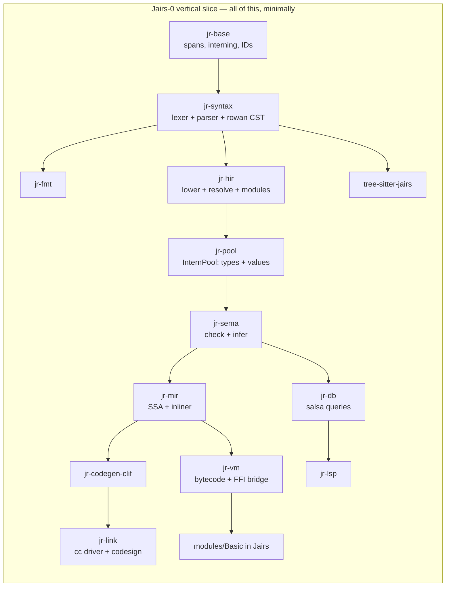
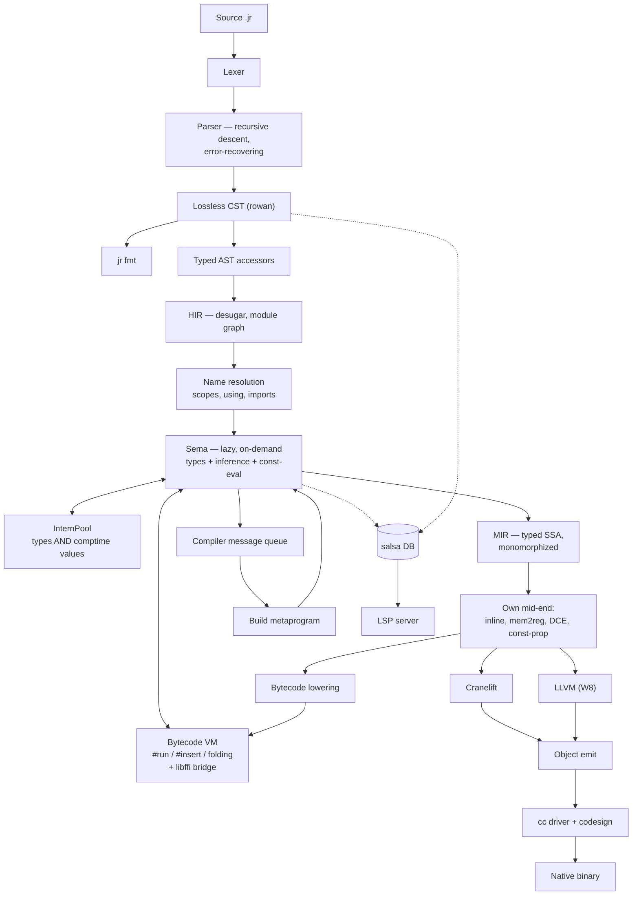

# Jairs — a Jai-like systems language in Rust

**Working name:** Jairs · **Source extension:** `.jr` · **Host language:** Rust (2024 edition)

> [!NOTE]
> **Strategy: tracer bullet, then thickening waves.**
> We do *not* build the compiler layer by layer. We first drive one absurdly small language subset all the
> way through **every** component — lexer, parser, CST, HIR, Sema, MIR, VM, Cranelift, linker, FFI, stdlib
> module, LSP, tree-sitter, formatter — until `hello.jr` is a native macOS binary and the LSP gives hover on
> it. Everything works, badly. *Then* we thicken it one feature-slice at a time.

---

## 0. Locked decisions

| # | Decision | Choice |
|---|---|---|
| 1 | Fidelity | **Jai-inspired, own language.** You own the spec. |
| 2 | Backend | **Cranelift first, LLVM later** behind a `Backend` trait. |
| 3 | Compile-time execution | **Bytecode VM over our own MIR.** Host-independent, trappable. |
| 4 | Parser | **One hand-written error-recovering parser** (rowan lossless CST), shared by compiler + LSP. tree-sitter is a *separate* editor grammar, CI-gated against drift. |
| 5 | Stdlib | **Written in Jairs itself**, like Jai. Core + OS + tooling first, graphics stack later. |
| 6 | Scope | **Solo, long-term serious, macOS arm64 first.** Linux x86-64 green in CI from the first native binary. |
| 7 | Build order | **Vertical slice first, then feature waves.** No component is "phase 2". |

### 0.1 Design questions — now resolved

| Question | Decision | Consequence |
|---|---|---|
| `context` ABI | **Hidden trailing parameter**; `#c_call` procedures opt out | Encoded in MIR's calling convention from day one. Function *types* carry a context flag. |
| Integer overflow | **Always trap** | Needs explicit wrapping operators (`+%`, `-%`, `*%`) or hash functions, PRNGs, and checksums become unwritable. **Added to Tier A.** Trap = a real runtime panic with a source location, and a *compile error* when detectable at comptime. |
| Bounds checks | **Like Jai: a build setting**, visible in the IR | MIR carries explicit `bounds_check` ops that a build-config pass strips. `#no_abc` opts out locally. |
| String representation | `{data: *u8, count: s64}`, **not** NUL-terminated | `to_c_string()` bridges to `#foreign` via temporary storage. |
| Polymorph identity | **Structural, on interned comptime arguments** — *my call* | An instantiation is keyed by the tuple of resolved comptime arg IDs in the InternPool, so `sort(Entity)` from two files dedupes to one function. Errors *display* nominally (`sort($T = Entity)`) so users see intent, not a key. Structural is required anyway once `Type` is a first-class comptime value. |
| Comptime FFI | **Yes**, gated behind `#foreign_at_comptime` | VM needs libffi-style dynamic calls. Non-negotiable given build scripts must read files. |
| Error handling | **Start exactly like Jai** — multiple returns + `#must` | But: reserve an **effect row slot in the function type representation** now, so an effects system can be added later without re-typing every signature. Costs nothing today; saves a rewrite. |

---

## 1. The vertical slice — "Jairs-0"

> [!IMPORTANT]
> **Definition of done for the slice:** `jr build examples/hello.jr` produces a signed native arm64 binary
> that prints when run; `jr run` executes the same file in the VM; opening it in a real editor gives
> diagnostics, hover and goto-definition; Neovim highlights it via tree-sitter; `jr fmt` round-trips it; and the
> printing itself comes from a stdlib module **written in Jairs** that calls libc via `#foreign`.

### 1.1 The Jairs-0 language subset

Deliberately tiny. Everything else is a later wave.

```jr
#import "Basic";                       // module system: one module, one file

Point :: struct { x: s64; y: s64; }    // structs, one level

add :: (a: s64, b: s64) -> s64 {       // procs, single return
    return a + b;
}

MESSAGE :: "hello from Jairs\n";       // constants
COMPUTED :: #run add(2, 3);            // one trivial comptime call

main :: () {
    p: Point;                          // decls: typed, and inferred below
    p.x = 4;
    sum := add(p.x, COMPUTED);         // := inference
    if sum > 5  print(MESSAGE);        // if
    i := 0;
    while i < 3 { i = i + 1; }         // while
    ptr := *sum;                       // pointer take + deref
    print(MESSAGE);
}
```

Included: `s64`, `u8`, `bool`, `string`, `*T`, `struct`, procs, `:=` / `: T` / `::`, `if`, `while`, `return`,
arithmetic (**trapping**), comparison, assignment, field access, pointer take/deref, `#import`, `#foreign`,
one `#run`.

> [!NOTE]
> `u8` is in the slice, not deferred to W1, because the string representation
> (`{data: *u8, count: s64}`, ADR-0004) and the libc `write` signature are both spelled in `*u8`. Choosing
> "stdlib in Jairs" forced this: you cannot express the bottom of the standard library without it. `u8`
> arithmetic and the rest of the numeric tower still wait for W1.

Excluded from the slice: arrays, `for`, `defer`, `using`, enums, unions, polymorphs, macros, `#insert`,
overloading, multiple returns, `context`, RTTI, floats, and the remaining numeric types. Each arrives as a
wave.

### 1.2 The slice's stdlib — `modules/Basic/`, in Jairs

This is the proof that decision #5 works. Roughly 40 lines of Jairs:

```jr
// modules/Basic/module.jr
libc :: #system_library "c";

write :: (fd: s64, buf: *u8, count: s64) -> s64 #foreign libc "write";

print :: (s: string) {
    write(1, s.data, s.count);
}
```

> [!CAUTION]
> **Correction found while building this: `print_int` is NOT implementable in Jairs-0.**
> Turning a digit into a byte for `write` needs an `s64` → `u8` conversion, and `cast` is reserved
> until W1. Every alternative needs something the slice also lacks — a `[N]u8` buffer (W1), pointer
> arithmetic (not in the subset, and no type checker yet to stop it being written by accident), or
> libc `printf` (variadic, and the arm64 variadic ABI passes variadic arguments on the stack, so a
> non-variadic `#foreign` declaration would silently produce garbage). Integer printing therefore
> lands with `cast` in **W1**, and the slice's exit criterion prints strings only.
>
> This is exactly the kind of constraint the tracer-bullet ordering exists to expose, and it cost
> minutes instead of being discovered during W7's stdlib push.

> [!WARNING]
> This forces `#foreign`, the string ABI, and the module loader into the **first** slice. That is the
> intended consequence of "stdlib in Jairs" — you cannot defer FFI to a later milestone if the bottom of
> your standard library is a syscall.

### 1.3 Slice work breakdown

Every crate gets created and does real work. Nothing is stubbed out with `todo!()` at the architectural level.



| Component | Slice scope | Why it can't wait |
|---|---|---|
| `jr-base` | Spans, `FileId`, `lasso` interner, `slotmap` arenas, newtype IDs | Everything depends on it |
| `jr-diag` | Diagnostic model + `annotate-snippets` rendering | Error quality is a design constraint, not a polish task |
| `jr-syntax` | Hand lexer (all tokens, trivia preserved), recursive-descent parser for the subset, **error recovery**, rowan CST, typed AST accessors | Recovery shape is hard to retrofit; LSP depends on it |
| `jr-fmt` | Formatter over the CST | Cheapest proof the CST is genuinely lossless |
| `jr-hir` | Lowering, module graph, `#import` resolution, scopes | Establishes the resolution model |
| `jr-pool` | InternPool for types **and** comptime values | Retrofitting interning is a rewrite. Steal Zig's design. |
| `jr-sema` | Lazy, on-demand checking; `:=` inference; one `#run` | Lazy-from-day-one is the whole reason M6-class comptime is possible later |
| `jr-mir` | Typed SSA, mem2reg, DCE, **a real inliner** | Cranelift has no inlining — it must exist before any backend |
| `jr-vm` | Register bytecode + interpreter + libffi bridge | It *is* the comptime engine; also gives `jr run` before any backend works |
| `jr-codegen` | `Backend` trait | Defining it now keeps LLVM from becoming a fork || **Done** | **`TrapKind` and `TRAP_HELPER` live here** (ADR-0143 §6), moved out of `jr-codegen-clif`: they are the *words* a trapping program prints, paired with `jr_base::trap_message`, and a second copy in the LLVM back end would be a second chance to drift from the bytes the differential compares. `Backend` gained **`libraries()`** for the same reason the move happened — the link line was an inherent method on `ClifBackend`, so a driver naming a concrete back end could only ever drive one. 
| `jr-codegen-clif` | Cranelift lowering, AArch64 AAPCS, Mach-O | The native path |
| `jr-link` | `.o` via `cranelift-object`, then shell out to `cc`; ad-hoc codesign | macOS binaries don't launch unsigned |
| `jr-db` | salsa 0.28 queries: file → tokens → CST → HIR → types | **The** reason the LSP won't be a fork of the compiler |
| `jr-lsp` | `lsp-server` loop: diagnostics, hover, goto-def | Proves the salsa boundary is real |
| `tree-sitter-jairs` | `grammar.js` + `highlights.scm` + corpus | Establishes the drift gate |
| `modules/Basic` | `print` / `print_line` via `#foreign` to libc `write` | Proves stdlib-in-Jairs |
| `tests/corpus` | ~20 `.jr` files: spec examples = parser tests = tree-sitter tests | One corpus, two parsers, CI-enforced |

### 1.4 Slice exit criteria

- [x] `jr fmt` byte-identically round-trips every corpus file — enforced by the
      `jairs-fmt` CI gate over `valid/`, `imports/valid/`, `tests/corpus/modules/`
      and `modules/`. `invalid/` is excluded on purpose: those files do not parse,
      and `jr fmt` correctly refuses to format input it could not parse.
- [x] `jr check broken.jr` recovers and reports multiple errors with rustc-grade
      rendering — `invalid/009-multiple-independent-errors.jr` asserts at least
      four independent errors from one file.
- [x] `jr run hello.jr` executes in the VM — `jr run tests/corpus/valid/024-hello.jr`
      prints both lines and exits 0. Asserted by `jr-cli`'s
      `run_executes_the_slice_exit_criterion`.
- [x] `jr build hello.jr && ./hello` — native arm64, launches, correct output.
      `jr build tests/corpus/valid/024-hello.jr` links through `cc` and the binary
      prints both lines and exits 0, byte-identically to the VM. Asserted by
      `jr-cli`'s `the_slice_exit_criterion_produces_output_in_both_engines`.
- [x] `COMPUTED :: #run add(2,3)` folds at compile time — folded by `jr-db`'s
      `file_consts` query (ADR-0018 §3) and interned, so it is indistinguishable
      from a literal: the MIR snapshot for `020-run-directive.jr` now reads
      `5_s64 + 1_s64`. VM and native now agree, by the differential harness below.
- [x] `print` comes from `modules/Basic` written in Jairs, via `#foreign` to libc
      `write` — executes, through libffi (ADR-0018 §4). ADR-0004's `{data, count}`
      is handed to `write` with no copy.
- [x] Integer overflow traps, in both the VM and native, with a source location —
      both engines trap and both name the line, byte-identically: `error: addition
      overflowed` then `  --> path:line:col`, exit status 4. ADR-0020 put the one
      formatter in `jr-base` so that a message chosen at *compile* time by the back
      end and one built at *run* time by the VM cannot drift, and
      `a_trap_names_its_source_location_identically_in_both_engines` compares the
      finished bytes. A trap on a compiler-invented value still reports without a
      location, which is `MirSpan::Synthetic` being honest rather than a gap.
- [x] An editor gives diagnostics, hover and goto-def over the real protocol — **by
      Neovim, and there will be no VS Code extension** (ADR-0036). This criterion named
      VS Code as its example and the example was wrong for this project: the decider does
      not use it, so a packaging target there is unverifiable in practice and would rot the
      way this box's Neovim half rotted before ADR-0025. The *intent* — a real editor, over
      LSP 3.17, against the real binary — is met twelve capabilities over, and
      `crates/jr-cli/tests/lsp_stdio.rs` asserts the protocol independently of any client.
      Closed rather than abandoned: five consecutive handoffs listed "a VS Code extension"
      as owed work nobody intended to do, which makes the whole list less trustworthy.
- [x] Neovim: tree-sitter highlighting — and diagnostics, hover and goto-definition
      besides. `editors/nvim/` is a runtimepath directory needing no plugin manager
      (ADR-0025); two lines in `init.lua` and one build script. Verified by
      `nvim --headless -u NONE -l editors/nvim/verify.lua`, 166 checks against the real
      editor and the real server. Verified rather than gated: Neovim is not a build
      dependency of this workspace.
- [ ] CI green on macOS arm64 **and** Linux x86-64 — **`main` was pushed for the first
      time on 2026-09-03**, so the matrix has been triggered and this criterion is no
      longer blocked on the push. It is **still open**, and the distinction matters:
      triggering a run is not reading one. Nobody has yet confirmed what it reported,
      and the GitHub API was unreachable from the machine that pushed, so the outcome
      was not observed even once.
      Two jobs are worth reading first. The **Linux leg of the `test` matrix** is the
      only thing that has ever executed this compiler on x86-64 — every gate before now
      was green on macOS arm64 alone — so a genuine endianness or layout assumption
      would surface there and nowhere else. And the **tree-sitter corpus job** is the
      only check that can see a *wrong parse tree* rather than an error count.
      Expect the graphics tests to fail there: five of the six need a real video driver,
      and a headless Linux runner has none. `create_window` falls back to a plain window
      (ADR-0187 §2), so the event-loop test should pass and the drawing ones should not.
      One of them needed more than a driver until 2026-09-03: the UI button test folded
      **every** queued event, so a real `MOUSE_MOTION` from a cursor sitting over the
      window overwrote the synthetic click's coordinates and it failed deterministically
      on a developer machine. It now folds only the event it pushed. A test that
      synthesises input into a real queue is not isolated from the real device.
- [x] CI drift gate: every corpus file parses cleanly in *both* the compiler and
      tree-sitter
- [x] Differential test harness exists: every corpus program's output must match
      under VM and native — `crates/jr-cli/tests/differential.rs`, which runs both
      engines as subprocesses and compares stdout, **stderr** and exit status. It
      enumerates the corpus itself rather than listing cases, so a new program is
      covered the day it is added. Because only two corpus programs print anything,
      it also carries cases that make a computation observable through `exit`, which
      is what gives it teeth: arithmetic, precedence, division truncation, loops,
      block parameters, `break`, pointers, short-circuit `&&`, struct field offsets,
      and both traps.

**Estimated: 10–14 weeks solo.** This is the milestone that decides whether the project is real.

### 1.5 Where the slice actually is

Status of each slice component, so this is answerable without reading the tree.
"Done" means implemented, tested, and green under every CI gate — not polished.

| Component | Status | Notes |
|---|---|---|
| `jr-base` | **Done** | `trap_message` takes a `frames: &[&str]` and emits one `  in <name>` line per frame, innermost first (ADR-0066 §2). It stays the **one** place that decides what a trap says, which is what keeps two engines rendering at different *times* — native at compile time, the VM at run time — from drifting in punctuation or order (ADR-0020 §2's argument, now applied to a chain). Spans, `FileId`, `lasso` interning, `newtype_index!`, source map, the one trap-message formatter (ADR-0020 §2) |
| `jr-diag` | **Done** | Diagnostic model + `annotate-snippets` renderer |
| `jr-syntax` | **Done** | **`X : u32 : 5` and `T.[a, b, c]`** (ADR-0190 §1, ADR-0194 §1). A typed constant's node kind is not known until the type is read — `X : u32 : 5` and `x : u32 = 5` differ only in a token *after* the annotation — so it is built behind a checkpoint and wrapped as `CONST_DECL` or `VAR_DECL` once the answer is in. An array literal is one token of lookahead past a `.`, since a field name can never be a `[`. **A qualified type name** — `Window.Event` — is two `IDENT`s in the *same* `NAME_TYPE` node (ADR-0179 §5), so no consumer meets a new node kind and `NameType::name_token` answers the **last** identifier; the type grammar rejected the spelling outright before (E0100, probed). **`VECTOR_TYPE`** is `#simd [N]T` — *one* node rather than an attribute node wrapping an `ARRAY_TYPE`, because unlike `#align`/`#place` the attribute and the array are inseparable: neither means anything without the other (ADR-0148 §1). Taken in **type** position rather than the declaration attribute loop, so it survives a parameter list and a return type. `DIRECTIVE` joined `TYPE_START`, the fourth recorded instance of that token-set trap — without it `v: #simd [4]s32` reported "expected a type after `:`" at the `#`. E0133 is a `#simd` with no array type, and the first parser code added in three waves. **`@note`** is `NOTE`, taken in the same attribute loop as the directives but its own kind, since a note is *data for a metaprogram* while a directive is an *instruction to the compiler* (ADR-0098 §1); `parse_note()` takes `@name` or `@name "payload"`, and `looks_like_proc_signature` took `AT` — the token-set trap for the **seventh** time. **`#modify { … }`** is `MODIFY_ATTR`, the one procedure attribute that carries a **block** (ADR-0093 §1); `looks_like_proc_signature` took it too — the token-set trap for the *sixth* time. **`looks_like_proc_signature` takes `#expand`** (ADR-0091 §4) — the token-set trap for the fifth time: a *void* macro `f :: (x: s64) #expand { … }` reaches neither `ARROW` nor `L_BRACE`, so it was read as a parenthesised-expression constant and produced fourteen cascading errors. **`#expand`** joins the procedure attribute loop as `EXPAND_ATTR` (ADR-0090 §1), so the three attributes take any order — its own kind beside `C_CALL_ATTR`/`NO_ABC_ATTR` so a consumer that forgets it is a missing arm, not a silent fall-through. **`$N: s64` — a comptime-value parameter** (ADR-0087 §1): `parse_param` accepts an optional leading `$` before the name (a `DOLLAR` child of `PARAM`, distinct from a `$T` `POLY_TYPE` in *type* position), the param-list continuation gate widens for it (the recurring token-set trap), and `Param::is_comptime` reads it. **`struct($T) { … }` and `Box(s64)`** (ADR-0085 §3): `STRUCT_TYPE_PARAMS` (a `($T)` list before the brace, `parse_struct_type_params`) and `TYPE_ARGUMENTS` (a `(s64)` list after a name in type position, `parse_type_arguments`), both optional so an ordinary struct and a bare name are unchanged; the `(` binds to the name in `parse_type_inner`, and a proc-pointer type's `(` is a different arm, so no ambiguity. AST accessors `StructType::params`, `NameType::arguments`, `TypeArguments::args`, `StructTypeParams::vars`. `$` lexes as `DOLLAR` and `$T` parses as a `POLY_TYPE` in type position, with `DOLLAR` in `TYPE_START` (ADR-0081). `CODE_STMT` and `parse_code_stmt` for `#code { … }` (ADR-0080 §1), checked **before** the `EXPR_START` arm because a `{` is neither a string nor an operand expression; braces required, E0131 reported at the directive rather than the token after it. `parse_stmts` parses a bare **statement list** rooted in a `BLOCK`, for `#insert` (ADR-0072 §1). `parse` cannot serve: it parses a *source file*, where `n := 1;` is a file-level `VAR_DECL` rather than a `DECL_STMT`. Wrapping the text in synthesized braces to reuse `parse` was rejected because every offset would shift by one, and §3 reports a fault's position *as an offset into the inserted text* — an offset one past the truth is worse than none, because the reader trusts it. Raises the parser's existing **E0114** for a token where a statement belongs, reused rather than duplicated because the fault is identical and only the indexed text differs; `jr-hir` re-words it as E0263 before a reader sees it. **No grammar, lexer or `SyntaxKind` change** — the lexer is already permissive about `#anything`, so `#insert "…"` was already a `DIRECTIVE_EXPR` with a `string_arg`. `switch e { case v; … else; … }` is a `SWITCH_STMT` of `SWITCH_ARM`s (ADR-0067 §1). An arm's body is "statements until the next `case`, `else` or `}`", which reuses the statement-list parsing every block has — so no new body shape enters the grammar, and braces per arm would be noise on the common one-statement arm. The `else` arm is the *same node with no value*: an absent value is the catch-all, so nothing needs a second kind — but `is_else` reads the **keyword**, because a malformed `case ;` also has no value and treating it as a catch-all would make a syntax error silently exhaustive. `push_context { … }` is a `PUSH_CONTEXT_STMT` wrapping a braced `BLOCK` (ADR-0063): the body must have braces — a braceless context swap that lasts one statement reads as a mistake — so unlike `defer` it takes a `Block`, not the two-shape `ControlBody`. `push_context` is a keyword from this wave, placed after `NULL_KW` like `context` and `operator` so it stays outside `is_reserved_keyword`'s range (it was never reserved). The `-> T` of a procedure-pointer type is **optional** (ADR-0062 §1), so `(*u8)` is a void-returning proc pointer — which was *unspellable* before: `-> void` is E0212 because `void` has no type name (ADR-0015 §3), `(*u8)` alone demanded an arrow, and `-> ` with nothing after it is a parse error. That blocked an allocator's `free` half. A present arrow with nothing usable after it is still an error, so `(s64) ->` and `(s64)` are not two spellings of one type. `null` is the **last reserved keyword to become real** (ADR-0060 §1): its refusal arm, which still read "arrives in wave W1", is gone and it parses as a `LITERAL_EXPR` beside `true`. `NULL_KW` joined the literal filter in `LiteralExpr::token` *and* `EXPR_START` — the token-set trap for the fifth keyword-shaped feature: without the first it lowered to `Bool(false)` ("found bool"), without the second `q := null` reported a parser error before sema's E0257. `is_reserved_keyword`'s range now holds no unimplemented keyword; kept as the mechanism for the next one. `PROC_TYPE`/`PROC_TYPE_PARAMS` for `(T, T) -> T` (ADR-0059 §3), with `L_PAREN` added to `TYPE_START` — the token-set trap for the fifth time, without which `fn: (s64) -> s64` reported "expected a type" at the `(`. In *return* position a proc-pointer type and a results list both begin `(`; `arrow_follows_matching_paren` scans to the matching `)` and checks for `->`, the same by-hand look-ahead `looks_like_proc_signature` uses, because only that token tells them apart (ADR-0059 §3). `NO_ABC_ATTR` for `#no_abc` (ADR-0058 §3), and the attribute position became a **loop** rather than one `if` per directive — two `if`s in a fixed order would have made `#no_abc #c_call` parse and `#c_call #no_abc` not, an ordering rule no reader could guess. The token gate that decides what a construct *is* needed the new directive too, the fourth time that list has had to widen (ADR-0045's `TYPE_START`, then `EXPR_START`, then `#c_call`). Also **restored `MEMBER`'s doc comment**, which ADR-0057's insertion of `C_CALL_ATTR` had stranded onto the new variant — harmless to the compiler and exactly the kind of thing that makes a registry stop being readable. `CONTEXT_KW` and `CONTEXT_EXPR` for the implicit context, and `C_CALL_ATTR` for the opt-out — `context` is its **own expression kind** rather than a `NAME_EXPR`, because a consumer reading names must not find it or `context.allocator` would look like a field access on a variable somebody declared. `CONTEXT_KW` sits outside `is_reserved_keyword`'s range, so nothing had to be removed from that refusal — the same position `enum_flags` and `operator` were in. The **token gate that decides what a construct is** needed `#c_call` beside `#foreign`: without it `raw :: () #c_call { }` was read as a parenthesised-expression constant and collapsed into four cascading errors starting at `()` — the `TYPE_START` shape of ADR-0045 for the third time (ADR-0057). Lexer, error-recovering parser, rowan CST, typed AST. `SCOPE_DECL` for `#scope_module`/`#scope_export` — a bare directive with no argument and no `;`, because it marks a *position* rather than declaring anything. `#scope_file` is deliberately absent: a Jairs module is one file (ADR-0014 §1), so it would be indistinguishable (ADR-0054 §1). `using` as a **prefix on a binding** in three positions — a field, a parameter and a *typed* local — with `USING_KW` out of the reserved-keyword refusal, the seventh and last keyword to make that trip. Only the typed local form takes it, because promotion needs the type's field list and `using q := f()` cannot mean anything (E0128). Three hand-written token gates had to widen — the struct field list, the union field list and the parameter list all tested `IDENT` alone — and `parse_field`'s unconditional `bump` became a **compiler crash on truncated input** until it was guarded, caught by the every-prefix robustness test (ADR-0050). `FOR_STMT`, `DEFER_STMT`, `LOOP_LABEL` and `RANGE_EXPR`, with `FOR_KW` and `DEFER_KW` **out** of the reserved-keyword refusal — the fifth and sixth keywords to make that trip. A range is reachable *only* as a `for`'s iterable, which is what keeps `0..n` from colliding with `[..]T`; `break`/`continue` take an optional label, and E0127 covers a malformed `for`. `parse_labelled_loop` builds a `NAME` node rather than bumping the token, because `LoopLabel::name()` looks for one and bumping left nothing to find — every labelled `break` then reported "outside a loop" (ADR-0049). `OPERATOR_KW` and `OPERATOR_DECL` for `operator + :: (…)`, with its own `parse_item` arm because that dispatch is on `IDENT`; E0126 covers a malformed declaration, and *which* operators may be overloaded is deliberately sema's question (ADR-0048). `AUTOCAST_EXPR` and `MEMBER_EXPR` for `xx expr` and `.RED`, with `XX_KW` and `DOT` added to `EXPR_START` — the token-set predicate trap, now checked in advance (ADR-0046). `UNION_TYPE` sharing `FIELD_LIST` with `STRUCT_TYPE`, and `union` **out** of the reserved-keyword refusal — the third keyword to make that trip after `cast` and `enum`. `TYPE_START` gained `UNION_KW`, `ENUM_KW` and `FLAGS_KW`, which were all missing (ADR-0045). `VIEW_TYPE` and `SLICE_EXPR` for `[]T` and `buf[]`, each a *separate kind* rather than a bracket form with an absent child, so a view cannot be confused with a malformed array; **E0124 keeps only its `[..]T` clause** (ADR-0044). `FLAGS_KW` — the first keyword added since the slice, and deliberately *outside* `is_reserved_keyword`'s range (ADR-0043). Bitwise operators with **non-C precedence** — bitwise above comparison, shifts between `+` and `*` — plus `~` and five compound assignments, and **E0122 is retired** (ADR-0042). `ENUM_TYPE`/`MEMBER_LIST`/`MEMBER` for `enum { … }` (ADR-0041); a float literal parses rather than being refused, and **E0120 is retired** (ADR-0040). `ARRAY_TYPE` and `INDEX_EXPR` for `[N]T` and `a[i]`, with `[]T` and `[..]T` refused by name (ADR-0039); `CAST_EXPR` is a real node, not a reserved-keyword refusal (ADR-0037 §3). `///` and `//!` are distinct trivia kinds (ADR-0027) |
| `jr-fmt` | **Done** | **Three constructs learned in one stretch** (ADR-0190 §4, ADR-0194 §5), and the array literal was the worst yet: `a := s64.[1, 2, 3];` formatted to `a := ;` — the *value* deleted, not an attribute. It needed **two** entries, the arm and `is_expr_kind`. The typed constant's first fix was wrong in an instructive way: it asked whether any child was a type kind, and `Array :: struct($T)` has one, so it emitted `Array : struct($T) {`. The discriminator is the token — one `::` versus two `:`. **A qualified type survives** (ADR-0179 §5) — it did not on the first attempt: `f :: (e: W.Event)` reformatted to `f :: (e: W)`, a file that no longer type-checks, and the **thirteenth consecutive wave** this file has had to learn a construct. The fix is the one it is every time: emit every token the node carries, not the first. **`#simd` and `#soa` both survive and are canonicalised** (ADR-0147, ADR-0148). `VECTOR_TYPE` also had to join `is_type_kind`, and the symptom of forgetting was that list's own comment one type over: `v: #simd [4]s32;` formatted to `v: ;`. Dropping either attribute changes the program's *layout* or its *type* rather than its formatting, so both tests assert survival **and** spacing — a formatter echoing `node.text()` passes round-trip and idempotence while silently losing them. Emits `@note` **with its payload** — it dropped every note on the first run (ADR-0098's consequences), and a build script collecting `@X` would then have silently found nothing. **`#modify`** is emitted **with its block** (ADR-0093 §1) — dropping it would delete a compile-time guard, so the program would accept instantiations the author rejected: the *unsound* direction, like `#c_call` and `#expand`. **`#expand`** is emitted in source order beside the other attributes (ADR-0090 §1) — it was **dropped on the first run**, turning every macro into an ordinary procedure, caught by gate 5 on this wave's own corpus file. **`$N: s64`** (ADR-0087 §1): `format_param` emits the leading `$` on a comptime parameter — dropping it would silently make a comptime parameter ordinary, the lossy-CST failure this file guards against, pinned by a round-trip corpus file. **`struct($T)` and `Box(s64)`** (ADR-0085 §3): `format_struct_type` emits the `STRUCT_TYPE_PARAMS` list between the keyword and the brace, and the `NAME_TYPE` arm emits a `TYPE_ARGUMENTS` list after the name — dropping either was silent data loss (a parameterised struct formatted to an ordinary one), caught by the round-trip gate, the recurring lossy-CST failure this file guards against. `$T` (`POLY_TYPE`) formats as `$` plus the name (ADR-0081). `CODE_STMT` formats as `#code` plus a block (ADR-0080); handled explicitly because a dropped body would silently delete spliced code — the lossy-CST failure ADR-0073 actually hit. `DIRECTIVE_EXPR` formats an operand **expression**, not only a bare string token — without which a computed `#insert CODE;` formatted to `#insert;`, silently dropping the operand (ADR-0073, the CST-preservation failure ADR-0072 §1 warned of). `format_struct_type`'s two-way `if` became a **match on the kind** (ADR-0068): the `else` branch meant "struct", so every `variant` was formatted into a `struct` — source destroyed, and exactly the mistake that function's own docs already warned about for `enum_flags`, made again one form later. Thirteenth wave in fifteen. `SWITCH_STMT` emits `switch <value> {`, one `case v;`/`else;` per arm and its statements indented under it. **The first attempt deleted the whole statement** — `SWITCH_STMT` was absent from `is_stmt_kind`, which silently drops a kind — so a formatted `054` lost its four switches entirely. Caught by formatting the file and reading it, which ADR-0067's consequences predicted. Twelfth wave in fourteen. `PUSH_CONTEXT_STMT` emits `push_context ` then `format_block` (ADR-0063). Added to `is_stmt_kind` as well: a kind absent from that predicate is *silently dropped*, and the first attempt did drop the whole block — the formatter-loses-a-statement failure the last waves keep hitting, caught here by `fmt --check` before it reached the corpus. The proc-type emitter wrote `") -> "` unconditionally, so a void-returning proc pointer came out as `(*u8) -> ` with nothing after it — **the formatter turning a legal program into an illegal one**, which `assert_parses` caught and a survival assertion alone would not have. Tenth wave in twelve it has damaged source (ADR-0062 §1). `null` joined the literal filter, and the formatter **deleted it** first — `p: *u8 = ;` — the ninth wave in eleven it has lost a construct, caught by a unit test that asserts survival (ADR-0060). **Eighth consecutive wave losing source**: `#no_abc` vanished with the procedure's attribute. This one is the *safe* direction to lose — dropping it restores a bounds check, so the program gets slower rather than unsound — which is why it needed a test more than the others, not less: nothing about the program's behaviour would have said it happened. The emitter walks the attribute children **in source order** rather than emitting the two kinds in a fixed order, because the fixed version silently rewrote `#no_abc #c_call` into `#c_call #no_abc` — not lost source, but `jr fmt` not idempotent on input it did not write. Both assertions verified by reverting (ADR-0058). **Seventh consecutive wave losing source**: `CONTEXT_EXPR` was not an expression kind, so every `context` was deleted, and `#c_call` vanished with the procedure's attribute. Both fixed with an emitter arm *and* a kind-predicate entry, pinned by a test asserting survival and canonicalisation, verified by reverting (ADR-0057). Formatter; corpus is canonical under it, CI-enforced. **Sixth consecutive wave losing source**, and again in two ways: every parameter default vanished, turning a callable `f(1)` into an arity error; and every named argument vanished, because `NAMED_ARG` is not an expression kind and the argument-list walk filtered on `is_expr_kind` (ADR-0053). Two tests pin it. `emit_using` is shared by the field, parameter and local emitters, because the formatter **deleted every `using`** — the fourth consecutive wave to lose source that way, and the worst of the four: dropping the keyword does not lose formatting, it changes what the program *means*, since every promoted bare name in the body stops resolving. Two tests pin it, one for survival and one for canonicalisation (ADR-0050). `FOR_STMT`, `DEFER_STMT`, `LOOP_LABEL` and `RANGE_EXPR` each needed an emitter arm **and** a kind-predicate entry — without the latter the formatter *deleted* every `for` and every `defer` outright, the third consecutive wave to lose source that way after `cast` and `xx`, and four tests now pin it (verified by reverting). `emit_jump_label` is shared by the block and braceless paths, because a dropped label silently retargets the jump to the innermost loop — a *behaviour* change from formatting (ADR-0049). `format_operator_decl` is its own function, because `format_const_decl` reads a `NAME` child an operator declaration does not have — sharing would have emitted `` :: `` with an empty name (ADR-0048). `AUTOCAST_EXPR` and `MEMBER_EXPR` each got an emitter arm *and* an `is_expr_kind` entry; without the latter every `xx` was deleted, leaving `small: u8 = ;` — verified by reverting (ADR-0046). `format_struct_type` reads its keyword from the *node kind*, because emitting a literal `"struct {"` rewrote `union` to `struct` — verified by reverting it (ADR-0045). `VIEW_TYPE` and `SLICE_EXPR` each got their own arm *and* an entry in the kind predicates — the fourth wave running where a missing predicate entry would have deleted a construct (ADR-0044). The enum keyword is read from the *token*, because emitting a literal `"enum"` rewrote `enum_flags` and changed the program's meaning (ADR-0043). `ENUM_TYPE` needed adding to the kind predicate **and** to the const-declaration dispatch — one alone left `Colour :: ;` (ADR-0041). `ARRAY_TYPE` and `INDEX_EXPR` are in both for the same reason (ADR-0039). Comments inside a struct body used to be deleted outright — fixed in the doc-comment wave |
| `jr-hir` | **Done** | **`#insert` at file scope** (ADR-0184 §1): `ItemKind::Insert`, reusing `RUN_DECL`'s node shape so tree-sitter needed no grammar rule. Generated items are allocated **straight into the file's arena**, so a generated declaration is an ordinary one — nothing downstream learned about them, and the alternative (a side table of "items from an insert") would have been a second definition of what a file's items are. `LowerCtx` gained the `span_override` and `insert_depth` that `BodyLowerCtx` already had. **E0294** refuses a *computed* operand generating anything but a library declaration, and three withholding sites had to learn "a file insert is pending" — name resolution, unknown types and the `#foreign` library lookup — mirroring `body_has_pending_insert`. **Qualified imports** (ADR-0179): `ItemKind::Import` gained `alias`, `Expr::Name` gained `module`, and `TypeRef::Qualified` is a new variant. A qualified *value* is lowered to a **name** rather than left an `Expr::Field` — the plan's design — because sema reads a callee as an `Expr::Name` at a dozen sites and MIR at seven more, and a construct half-represented on the lowering path is this project's first named failure mode; carried on the name, four construction sites became compile errors and no MIR logic changed. E0292 is a qualified name a module does not export; a second code was drafted and **refused** for having no reachable condition. `resolve_all` now skips an intrinsic call's argument subtrees, because the flat top-level walk visited `s64` as an expression in its own right and reported E0201 before ever reaching the call (ADR-0180 §4). **`TypeRef::Vector`** carries the same four fields `TypeRef::Array` does and shares its length helpers, which now take the length *expression* rather than the array node so a lane count reuses them instead of copying them (ADR-0148 §1). Its own variant rather than an `Array` with a flag, because resolution must intern one of two pool items from the shape it is looking at. A `using` on a vector promotes nothing: lanes are indexed, not named. **`Proc::notes: Vec<(Symbol, Option<String>)>`** carries `@note` metadata with the payload's quotes stripped at lowering (ADR-0098); a clone of a noted procedure keeps its notes, a synthetic `#modify` predicate carries none. **`#bake_arguments` specialisation** (ADR-0097 §1): `lower_bake_arguments` + `clone_with_baked` turn `add_five :: #bake_arguments add(a = 5)` into a real `ConstValue::Proc` — a clone with the baked parameters dropped, their literals substituted for each `Res::Param` use, and the kept ones remapped (ADR-0088 §3's three steps, during *lowering*, since a baked procedure is a declaration). Arguments read from the arg list's **children**, since a `NAMED_ARG` is not an `Expr` (ADR-0053 §1's trap). A baked value must be a **literal**: const-eval runs *after* lowering, so the value is not available where the clone is built — E0276, the narrowing ADR-0039 §3a took for an array length. **`Proc::modify`** carries a `#modify` predicate's *source text* (ADR-0093 §1), for the reason a macro body is text: it is evaluated per instantiation, and lowering it once against the template would resolve `T` where nothing binds it. **The `#expand` splice** (ADR-0091): `collect_macro_bodies` pre-scans every macro's `(params, body text, returns)` and threads it to each `BodyLowerCtx` like `InsertOperands`; `try_splice_expression_macro` and the statement-position arm generate a `name := arg;` prelude plus the rewritten body and hand it to `expand_insert_text`, so each argument is evaluated **once** and the body lands in the caller's scope. `rewrite_macro_returns` turns a tail `return <e>;` into an assignment to a generated result local; `macro_returns_early` refuses anything else (**E0273**, this crate's, since lowering builds the splice). A macro's own body is **not lowered** — doing so resolved its names against the macro's empty scope, so a macro reading the caller's locals reported them unresolved. **`Proc::expand`** marks a macro (ADR-0090 §1), lowered from the attribute and carried through the instantiation clone. **`FileHir::param_values`** carries each instantiation's baked `$N` values by `(ProcId, name, PoolId)` (ADR-0089 §1) — the value-side counterpart of `proc_bindings`, so sema can size a `[N]T` by reading an interned value rather than evaluating one. **`Instantiation::comptime_values`** for `$N` instantiation (ADR-0088 §3): a `Some(value)` per template parameter to bake or `None` to keep runtime; `expand_instantiations` takes a `&Pool` to decode each `PoolId` via `literal_from_value`, drops the `Some` params from the clone's parameter list, and rewrites the body's `Res::Param` name-uses either into an `Expr::Literal` (for a dropped comptime param) or a remapped `Res::Param` (for a kept runtime one). **`Param::comptime`** for `$N: s64` (ADR-0087 §1), lowered from the leading `$` and carried through the instantiation clone. **`TypeRef::Apply { name, args }`** for `Box(s64)` and **`Struct::poly_vars`** for `struct($T)` (ADR-0085 §3); both lowering paths turn a `NameType` with arguments into an `Apply` and a struct's parameter list into `poly_vars`, empty for an ordinary struct so nothing else changes. The dump prints an `Apply` by name and arity (`Box(1 args)`), like `Proc`/`Results`, because its argument ids index an arena the dump may not hold. `TypeRef::Poly` for `$T`; `instantiate.rs` appends a substituted procedure clone per instantiation to an expanded HIR, with a synthetic `$instN` name and a `proc_bindings` entry per type variable (ADR-0082, ADR-0083). `jr-hir` gained a `jr-pool` dependency for the `PoolId` a binding carries. `lower_code` splices a `#code` body's **inner** source text through `expand_insert_text` to the same `Stmt::Insert` a literal insert produces (ADR-0080 §2) — braces excluded, since a block is a nested name scope and an insert's statements must not be. E0201 is **withheld for `any_of`/`any_as`** as it is for `type_info` (ADR-0076), and for a builtin type name in an intrinsic's argument — the recogniser is one shared `is_intrinsic_name`. E0201 is **withheld for `type_info` and for its argument** (ADR-0075 §2): the intrinsic has no declaration to find, and a *builtin* type name resolves to nothing at all because the builtin names are ordinary identifiers rather than keywords — so `type_info(s64)` reported an unresolved name. Scoped to the argument via `in_type_info_argument`, so `x := s64;` elsewhere keeps its error; this pass has no pool to intern a type in, so sema decides. **A computed `#insert` operand** is held as `Stmt::Insert { operand: Option<ExprId> }` and lowered as an ordinary expression, so it resolves and type-checks — `#insert undefined;` is E0201, a non-`string` operand E0214 (ADR-0073). `lower_file_with_inserts` expands a pending insert from operand text keyed by directive **span**; an expanded insert clears `operand` to `None`, distinguishing an evaluated-empty insert from an unevaluated one. A depth bound, **E0264**, refuses expansion past 16 levels — the guard a literal insert did not need, since a generated string can be a quine. **`Stmt::Insert` — `#insert "…"`'s statements, lowered into the *enclosing* scope** (ADR-0072 §1). Deliberately not a `Stmt::Block`, and a block would have been wrong twice over: `jr-mir` treats a block as a **defer scope**, so a `defer` in inserted code would run at the insert's end rather than the enclosing body's; and lowering pushes a **name scope** for a block, so a local the insert declared would be invisible on the next line — the exact thing the feature promises works. Lowering calls `jr_syntax::parse_stmts` on the operand, so it is no longer a pure function of *one* parse tree (though still of its inputs). Every synthesized node takes the **directive's** span via a `span_override` on the two span helpers, rather than a fix-up afterwards: a `Span` lives in sixteen `Expr` fields, nineteen `Stmt` variants, `Local::name_span` and `Param::name_span`, and the first attempt rewrote the `expr_spans` arena and **missed `Expr::Name`'s own `span`** — the one the resolver reads — so an unresolved name in inserted code reported against lines 1–2 of the file. Found by running. Nesting needed no code: the recursion falls out of `lower_stmt` calling itself, and escaping *doubles* the text per level, so a literal insert is bounded by the file it is written in. `TypeRef::Array` gained `len_name`, the length's bare name when it was one (ADR-0070 §1), so sema has something to resolve. Lowering still only *reads* — whether the name denotes a usable constant is a semantic judgement, which is the same split ADR-0039 §3a drew for the literal. `Struct::is_union: bool` became `Struct::kind: AggregateKind` (ADR-0068 §2): three forms do not fit a bool, two bools would admit "union and variant", and a third *arena* is unrepresentable — a `DeclId` names an index but not an arena, so a separate one would collide with structs while both share `Pool::struct_fields`. Every reader became an exhaustive match, which is the point. `Stmt::PushContext(StmtId, Span)` holds the block; lowering, resolution and the dump treat it exactly like a block (ADR-0063) — the copy that isolates it is a `jr-mir` concern, invisible here. A separate variant rather than a flag on `Stmt::Block`, so every exhaustive match decides what a context scope means. `Literal::Null`, carrying no value — a null pointer is the bit pattern 0 and its type comes from context (ADR-0060 §1), so it lowers like an integer literal rather than as a keyword expression of its own. `TypeRef::Proc { params, ret }`, with `ret` an `Option` because `void` has no spelling — a missing return resolves to `PoolId::VOID` in sema, not to a `Name("void")` sema would reject (ADR-0059 §3). The dump prints it by *arity* (`(N params) -> _`), like `Results`, because its element ids index an arena the dump may not hold. `Proc::no_abc`, which is the **whole** representation of ADR-0058 §3's opt-out: no `Projection`, `Expr` or `Statement` carries it, because a per-index flag would have to reach `Projection::Index` through the eleven passes and back ends that match on a projection, and a flag some of them ignored is the first named failure mode. `Expr::Context` and `Proc::c_call`, the parsed shape of ADR-0057. `c_call` is a flag on the procedure rather than a derived question, and `#foreign` does *not* set it — sema derives the `ContextKind` from `foreign` independently, so writing both is redundant rather than contradictory. Lowering, name resolution, flat import merge (ADR-0014). `Item::exported`, computed by walking file-level children in source order — as *children*, because a `SCOPE_DECL` is not an `Item` kind and `source_file.items()` would skip every marker. `ItemScope` carries a `hidden` set so a use of a filtered name is E0253 "not exported" rather than E0201 "unresolved", and `FileHir::export_scope` **owns the filter** rather than returning the raw scope with a doc comment calling it a temporary over-share — two answers to "what does this module export" would let whichever a consumer called decide whether it saw encapsulation (ADR-0054). `Expr::Call` gained `arg_names`, a parallel `Vec<Option<Symbol>>` so every existing consumer walking `args` keeps working; `Param::default` holds a default's expression. `lower_args` exists **twice**, once per expression arena, because the file's and a body's both start at index 0 — and it walks the `ARG_LIST`'s children rather than `ArgList::args()`, since a `NAMED_ARG` is not an expression kind and that accessor would have dropped every named argument silently (ADR-0053 §1). `Stmt::LocalTuple`, `Stmt::AssignTuple` and `Stmt::ReturnTuple`, plus `TypeRef::Results` — separate variants rather than generalised existing ones, so every exhaustive match is forced to decide what several values mean. A `_` discard lowers to `None`: a **hole** recognised positionally, never a local and never in the resolve map, which is why `Res` needed no new variant (ADR-0052 §3). **`Res::Promoted { base, field }`** — a promoted name resolves to a *path*, which is the fact that made `using` hard, and adding the variant cost `Res` its `Copy` impl while making every exhaustive match over it a compile error. That is how the ten consumers needing to learn about it were *found* rather than remembered (ADR-0050 §2). Promotion sits between parameters and file items in ADR-0014 §3's order, so a real binding wins **silently**; two promotions of one name is E0250 at the *use* site, which is that ADR's ambiguity rule reused verbatim. A `using` local promotes only from its declaration onward and only within its block — a flat per-body set was simpler and rejected, because it would make a promoted name visible above the `using` introducing it. `using_fields` and `using_fields_in_body` are separate entry points because a local's annotation lives in the *body's* type arena and a parameter's in the file's, and both start at index 0 (ADR-0050). `Stmt::For`, `Stmt::Defer`, an optional label on `Stmt::Break`/`Continue`, and `ForIterable::{Sequence, Range}` — a label is deliberately **not** in the `ResolveMap`, because it names a loop rather than a value and putting it there would make `break outer` look like a name reference to anything reading that map (ADR-0049). `ConstValue::Operator(ProcId, BinOp)`, whose name interns as the synthetic `operator+` so it lands in the ordinary name map — and the duplicate-name scan **exempts** overloads, because one operator legitimately has many and they all share that name (ADR-0048 §1). `bin_op_of_token` is now shared by the declaration and `lower_bin_op`, so the two cannot disagree. `Expr::Autocast` and `Expr::Member`, both carrying **no type**: `xx` has no syntax for one and a bare member names no scope, so sema supplies both from the context (ADR-0046). `ConstValue::Union` and `TypeRef::Union` index the **same arena** a struct does, with `Struct::is_union` carrying the kind: a separate arena would give a struct and a union at the same index one `DeclId`, and they share `Pool::struct_fields` (ADR-0045 §4). `TypeRef::View` and `Expr::Slice`, both distinct variants because `TypeRef::Array`'s `len: None` already means "not a usable literal" (ADR-0044 §1). `ConstValue::Enum` beside `Struct`, because ADR-0012 makes both instances of one `name :: value` form. `TypeRef::Array` and `Expr::Index`; the array length is *read* here and judged by `jr-sema` (ADR-0039 §3a). A leading `-` on a literal is folded in during lowering, so `Literal::Int` carries a signed `i128` rather than a magnitude (ADR-0038) |
| `jr-pool` | **Done** | **`LinkKind` is interned into `ForeignLibraryValue`** (ADR-0183 §1), so `#system_library "X"` and `#framework "X"` are **different values** — a test pins it, because if they interned equal a program naming a framework could be linked with the flag that does not resolve. An enum rather than a `bool` for the house reason, and it earned its keep instantly: the new field turned **nine crates'** pattern sites into compile errors. `foreign_library_kind` answers `None` for a non-library id rather than defaulting to `Library`, which is exactly the wrong guess for a framework. **`TargetOs`** joins `TargetLayout` (ADR-0180 §2) — the compiler's notion of a target was two numbers, and now it has an OS. A `cfg!`-derived constant rather than a `BuildConfig` field, because invalidation for a value that cannot change within a process buys nothing and the cost was measured at ≈50 `file_signatures` call sites across six crates. **`Item::VectorType { elem, lanes }`** — `#simd [N]T`, whose layout is *identical* to `[N]T`'s and whose everything else differs (ADR-0148 §1). The one new `Item` in three waves, and it earns its five crates' matches by the test ADR-0147 §1 set: a new variant is warranted exactly when the arms differ, and here representation, operators and count-is-chosen all do. **`Field` carries `#align` and `#place`** (ADR-0144), and the layout fold applies them: a field goes at `max(natural, requested)` alignment or at exactly its placed offset, and the cursor advances to the **maximum end reached so far** — so placing one field cannot move another. A struct's size is the maximum of every field's `offset + size` rounded to its alignment, which with no attributes anywhere is byte-for-byte the fold it replaced. `#align` is a *minimum*, so a lower value is already satisfied rather than refused (§3, decided while building); a placed field may be unaligned. **This is the whole feature** — no engine changed — which is ADR-0018 §2's claim tested by a layout feature rather than a layout fix. **`Item::StructType`/`UnionType`/`VariantType` gained `args: Vec<PoolId>`** (ADR-0085 §1) — empty for an ordinary declaration, so no existing key moves and every snapshot stayed byte-identical when it landed; `Box(s64)` and `Box(bool)` share a `decl` and are two `Item`s the way `[2]s64` and `[3]s64` are. `Pool::struct_instance(decl, args)` interns one, and a second side table `instance_fields: PoolId → fields` holds a parameterised instance's substituted fields, dispatched by `Pool::fields_of(ty)` — an ordinary struct keeps its `DeclId`-keyed map untouched. `layout_of`/`field_offset` key the field read on the instance, which is the whole back-end change (ADR-0085 §2, §4). **`Item::AggregateValue { ty, elements }`** — a struct or array compile-time value as its **element values**, not a byte image (ADR-0074 §1). The pool is target-independent (`layout_of` takes a `TargetLayout`, the pool holds none), so bytes would put one target's padding and pointer width into a shared table and a cross-compile would read plausible wrong values rather than fail. The first **recursive** value variant, which is how all fourteen exhaustive-match sites were found. The `ty` is part of the key because `type_of` is total and two struct types with identically-typed fields have the same element list — an elements-only key would intern them to one id. `Item::VariantType`, and a variant's layout is the existing sequential rule over `[tag, union-of-cases]` — a leading `u8` tag (offset 0 regardless of what follows, ADR-0057 §4's argument) then the cases, so `field_offset` gains **the one line that makes a variant a variant**: every case sits at `variant_payload_offset`, not at 0. Two tests pin the arithmetic, and the second is the one an 8-aligned-only test would hide: two `u8` cases give size 2 with the cases at offset **1**. `Context` grows to **five** fields (ADR-0065): `temp_data` (`*u8`) and `temp_mark` (`s64`) join the allocator's three. Both are *already* well-known pool ids (`PTR_U8`, `S64`), so unlike the allocator's proc-pointer types they need no pre-interning — `WELL_KNOWN_COUNT` stays 14 and `Pool::new`'s `debug_assert` chain is unchanged. `temp_mark` is a byte count, so a reset is one integer store. `PoolId::ALLOC_FN` and `FREE_FN` join the well-known prefix (`WELL_KNOWN_COUNT` 12 → 14), pre-interned for the reason `PTR_U8` is: `CONTEXT_FIELD_TYPES` is a `const &[PoolId]`, so a context field's type must be a well-known id. `Context` is now **three** fields — `allocator`, `allocator_free`, `allocator_data` — flattened rather than nested in an `Allocator` struct, because a nested struct type needs a `DeclId` a compiler-declared type has not got (ADR-0062 §2). `Item::ProcValue { ty, decl }` finally has a *producer*: `jr-mir` interns one for a procedure name used as a value (ADR-0059 §1). The `decl` is a `DeclId` whose `index` is the `ProcId`'s, which is the whole `DeclId → ProcRef` bridge both engines named as the blocker — and both decode it the same way, packed `(file << 32) | proc` in the VM and rebuilt as a `ProcRef` natively. `Item::ContextType` — the **first compiler-declared type**, so it has no `DeclId` from any file and is keyed structurally, the answer ADR-0052 §1 already gave for a results aggregate. `CONTEXT_FIELD_TYPES`/`CONTEXT_FIELD_NAMES` are the single place the one field `allocator` is declared, and `context_field` is the single place a name becomes an index, so both engines read the same offsets. `find_context` and `context_type_id` take `&self` rather than locking, because the pool mutex is **not reentrant** and a fresh lock inside a caller already holding one hung the program rather than failing (ADR-0057). `Item::ResultsType { elems }` — **structural**, keyed on the element list because an anonymous type has no `DeclId` to key on, and normalised so `-> (T)` is `-> T` and `-> ()` is `void`. `sequential_layout` and `sequential_field_offset` are shared with a struct's rather than duplicated: **omitting the second returned `NotAType` for every result after the first**, which surfaced as a destructuring statement binding wrong values rather than as an error (ADR-0052 §1). `Field::using`, carried on the *layout* type purely so field **lookup** can follow an embedded base — it affects no offset, and `field_offset` never reads it, which is what lets `using` be a resolution feature and leaves ADR-0018 §2's one-layout rule untouched (ADR-0050 §4). `Item::UnionType` — nominal like a struct, sharing its field side table, with **every field at offset 0** and a size that is the largest field's; the two lines that make a union a union, both here because a layout disagreement between the engines would be *invisible* rather than a crash (ADR-0045 §3). `Item::ViewType`, structural and nesting like `PointerType`, whose layout is a **shared** `{data, count}` pair that `string` now computes through as well — one arithmetic, two identities (ADR-0044 §1). `Pool::find` looks a type up without interning, for the back ends that hold `&Pool` and need a view's `*T`. `Item::EnumType` carries `flags`, and `IntKind::of` answers `s64` for an enum so both evaluators treat a combination as the integer operation it is (ADR-0043). `IntOp` covers `& | ^ << >>` and `int_not`, with `IntTrap::ShiftOutOfRange` for a count outside the width (ADR-0042). `Item::EnumType` with members in a side table, nominal and keyed on `DeclId` like a struct (ADR-0041 §4). `FloatKind` beside `IntKind`, with IEEE-754 arithmetic that has no error path at all — the visible shape of ADR-0040 §1. `IntKind::from_name`/`NAMES` is the one list of integer type names (ADR-0037 §1) — Types + comptime values in one pool (ADR-0015, ADR-0016 §3); layout (ADR-0018 §2), now including `ArrayType`'s stride-times-length (ADR-0039 §3); ADR-0002's integer arithmetic, shared by both evaluators (ADR-0022 §2) |
| `jr-sema` | **Done** | **Five language utilities** (ADR-0190 to ADR-0194). A typed constant's annotation is the *expectation*, resolved through the same `resolve_type` a variable's is. `described_type` — the one function every intrinsic asks — gained a **pointer** arm (`any_as(a, *Point)`), a **`type_of`** arm, and is what an array literal's element type goes through, so `Point.[…]` and `type_of(x).[…]` cost nothing. `size_of` now tolerates a poisoned described type, which is what makes `size_of(type_of(v))` work inside a `$T` template. **Three `imports.is_empty()` guards sat above the lookup they guarded** (ADR-0189 §3), so `modules/Basic` could not use the `Type_Info`, `Type_Info_Kind` and `Any` it declares itself — the lookup below already fell back to `self.sigs`, so the guard only hid them. The silence rule now applies on a *miss*, not before the attempt. **A coerced argument describes its own type** (ADR-0189 §2), amending ADR-0076 §1, because otherwise no `Any` in the language has a pointer type and `print("%", p)` cannot say "pointer"; a bare value is recorded as `AnyOp::OfValue`, closing ADR-0076 §4. **`SigEntry` carries a `ProcId`** (ADR-0188 §2), which is the missing index from an imported *name* to that module's `ProcSig`. `callee_sig` returned `None` for `Res::Imported` under a comment claiming the other file's signatures were unavailable; they were passed in all along, and the cost was that a **default argument silently did not apply across a module boundary**. **`os()`** is folded here to a `Basic.Operating_System` member (ADR-0180 §2), the only zero-argument intrinsic, through `library_enum` — `library_struct`'s counterpart. `SignatureOutput` now carries `folded_calls`, which is the whole of the file-scope gap: a named item's initialiser is typed by *this* phase and the check phase does not revisit it, so the fold was computed and thrown away (ADR-0180 §3). `resolve_qualified_type_name` answers `Window.Event` against one module's signatures, deliberately not through `resolve_type_name` — none of its earlier steps apply — and both spellings intern to one `PoolId`. E0293 closes two silent `#system_library` holes. A `switch` now passes `Some` for a poisoned scrutinee, because `None` routed around `check_bare_member`'s own `ERROR` guard. **`#simd` is refused here or nowhere** (ADR-0148 §2, §3, §6): `check_vector_shape` enforces the exactly-16-byte width and the numeric element, and `check_vector_operator` enforces that an integer vector takes `+% -% *%` while a float one takes `+ - * /` — one code, E0285, because each is "this is not how a vector works". The width refusal names the six legal shapes rather than stating the rule, since the rule is the *reason* and the shapes are the answer. `vector_parts` is deliberately **not** folded into `array_parts`: callers asking "can I index this" want both, and the arithmetic callers must not see a vector. **`#soa(N)` wraps every field's type in `[N]T`** while resolving the body (ADR-0147 §1), *before* layout runs — so nothing downstream of resolution sees anything but an ordinary struct of arrays, which is why the feature needed no engine change. The count is read through `named_constant_int`, its fourth caller. `check_soa_field` types `e[i].x` as the field's element type and records the field position for `jr-mir`, keyed on the **index** expression (the field access does not receive its own id); the index expression is recorded with the *receiver's* type, because `scan` refuses an `ERROR`-typed reachable expression. E0284 refuses an unusable count, a `using` field, and an index that is not a field receiver. **`noted_insert` folds a template once per noted declaration** (ADR-0101) — the metaprogram loop, living *inside* the fold, which is the right place for generation since a run-time loop could not declare anything. **`noted_count` / `noted_name` query the file's noted declarations** (ADR-0100), in **declaration order** — the one order a reader can predict, since a name sort renumbers unrolled indices and a hash order is nondeterministic. Both fold like the reader, so both arguments must be literals: ADR-0100 §2 states the limit that follows — a `for` variable exists only at run time, so loop-driven iteration needs a compiler-emitted table rather than a better spelling. **`has_note` / `note_value` fold here** (ADR-0099 §2), unlike `type_info` which folds in `jr-db`: a note's answer is in the HIR's `Proc::notes`, which this checker is already holding, so no layout, no VM and no query are involved — the value is interned during checking and reaches `jr-mir` through the existing `set_run` channel. **E0278 refuses `==` on an aggregate** (ADR-0099 §4), a `string` included, by a *structural* predicate rather than a layout one: `Layout` records only size and alignment, so an `s64` and a two-field struct of `s32`s are indistinguishable by it and only one is comparable. That refusal was a leaked ICE (`expected a scalar, found an aggregate`) until W6 sub-wave 2 probed it. **A call to a `#modify` procedure is refused E0274** (ADR-0093 §3), *before* the instantiation is recorded — instantiating would mean the predicate was parsed and silently ignored, so a guard that should reject a call would accept it. **`type_info(T)` describes a bound type variable** (ADR-0092 §1): `described_type` consults `type_bindings` first (as `resolve_type_name` does), `check_file`'s body loop seeds them **per body** from `proc_bindings` and clears after — two instantiations share the name `T` with different bindings, so a leftover would describe the wrong type — and `Ctx::poly_var_names` withholds E0261 for a *template*'s own call, since a template has no binding. **A *cross-file* `#expand` macro call is refused E0272** (ADR-0091 §3) via `callee_is_imported_macro` — a same-file call never reaches sema, since lowering splices it away; a cross-file one was reaching the VM as "no routine for file 1 proc 0", the fifth leaked ICE. `FileSignatures::is_macro` carries the fact across the boundary, because an importer has signatures and not HIR. **An array length may name a `$N` comptime parameter** (ADR-0089): `constant_array_length` consults `Ctx::value_bindings` first — seeded from `FileHir::param_values` by the signature phase and re-seeded per body by `check_file` (so two instantiations sharing the name `N` cannot cross values). A *template*'s `[N]T` resolves to a placeholder `[0]T` recorded in `Ctx::placeholder_arrays`, and E0236's literal-index check withholds on it, because a template has no value for `N` and is never lowered. **`$N` comptime-value calls run** (ADR-0088): `check_comptime_call` (replacing 6a's E0271 refusal) records `(proc, [arg ExprId per comptime param])` in `comptime_calls`, for `jr-db`'s pre-pass to evaluate. `callee_comptime_template` and `callee_poly` now each require a **pure** template (no mixed `$T`+`$N`), so a mixed template falls through to the ordinary path with an honest mismatch. **`$N` comptime-value parameters** (ADR-0087): `ProcSig::comptime_params` (parallel to `params`) marks which parameters are `$N`, and `ProcSig::is_template` covers both the `$T` and `$N` template marks. Unlike a `$T` template, a `$N` procedure's **body is type-checked** — its parameter type is fully known (`s64`), only the value varies, so `N + true` is E0214 at template time. A **call is refused E0271** (`callee_comptime_template`) *before* the ordinary call path, which would otherwise succeed and lower a call with no value for `N` — a placeholder miscompile the by-design refusal prevents (teeth-checked). **Polymorphic structs** (ADR-0085): `resolve_type`'s `TypeRef::Apply` arm resolves `Box(s64)` — looks the constructor up to a `struct($T)` in this file (`parameterised_struct`), resolves the arguments, binds the variables, interns the instance via `Pool::struct_instance`, and resolves its fields *under the bindings* into the instance-keyed map (`resolve_instance_fields`), guarding recursion by reserving the field slot first. `Box(s64).value` is `s64` and `Box(bool).value` is `bool` from one declaration. The `struct($T)` template binds its variables to `PoolId::ERROR` (quiet, no diagnostic) so a bare `T` in the template body does not report E0212, and that template entry's fields are never read. **E0269** refuses a `Name(args)` that is not a parameterised struct (or is cross-file); **E0270** a wrong argument count. Deferred with no-op arms, not gaps: inferring through `Box($T)` (`infer_var_in`/`collect_poly_in_type` leave `Apply` unbound) and `using` on one (ADR-0085 §5). `$T` polymorphism (ADR-0081–0084): `Ctx::type_bindings` resolves a variable and a bound bare `T`; `ProcSig::poly_vars` marks a template (body unchecked, no MIR); `check_polymorphic_call` infers every variable — directly or through `*$T`/`[]$T` via `infer_var_in` (ADR-0084) — forms the structural key (tuple of bindings, ADR-0083), and records the instantiation; per-instantiation body checking rejects a body wrong for the bound type. E0268 refuses a call that cannot be instantiated. `Type_Info` gained `count` and `element` (ADR-0078), validated by `TYPE_INFO_FIELDS` like every field. **`any_of`/`any_as` are intrinsics** (ADR-0076): `any_of`'s pointer erases to `*u8` here and nowhere else, `any_as`'s second argument is a type and its read traps at run time on an `id` mismatch. `Type_Info` gained `id` (ADR-0077), validated by `TYPE_INFO_FIELDS` like every other field. `library_struct` and E0265 now serve `Type_Info` and `Any` both. E0267 refuses `any_of` of a non-pointer. **`type_info(T)` is an intrinsic**, recognised by name and only when the name resolves to nothing, so a program declaring its own `type_info` keeps it (ADR-0075 §2). Its argument is a *type*, so `check_type_info` marks it a type position — the E0261 allowlist gains one entry rather than the refusal gaining an exception. `TYPE_INFO_FIELDS` is the **contract with `modules/Basic`**: the lookup validates field names, types and order, and a mismatch is E0265 naming it, because a wrong offset would be a silent wrong value rather than a crash. Returns the struct **by value**, which the MIR verifier forced — a pointer's pointee has nowhere to live, since the folded value is a constant. `builtin_type_named` matches `s64` by text with **no diagnostic**, and only for a genuinely unresolved name: calling `resolve_type_name` reported E0212 "unknown type name `x`" for a local, which is wrong twice over. Silent when no imported signatures were supplied at all, because `Type_Info` lives in `Basic` and inventing a library error from a missing input is what `jr-sema`'s own module-free corpus test forbids. E0266 refuses a type with no runtime layout rather than reporting zero. **A type is a compile-time value, and using one at run time is E0261** (ADR-0071 §3). Before it, `t := Point;` type-checked cleanly and both engines exited 0, lowering to a `type`-typed slot holding `Rvalue::Undef` — a placeholder that is a *legitimate value*, in a type with no runtime layout at all (`LayoutError::ComptimeOnly`), so neither the verifier nor ADR-0017 §4's poison gate could object. PLAN §5's first named failure mode, found only by dumping the MIR. Refused **here rather than in lowering** for ADR-0039 §3a's reason: rejecting a construct is a semantic judgement, and a lowering refusal reports a compiler-internal message for a program that looks well-formed. Every position *with* an expectation was already caught by an ordinary mismatch — `takes(Point)` is E0214, `if Point` is E0222 — so what got through was the two with **none**: a `:=` binding and a bare expression statement. The two positions that *do* accept a type are an **allowlist** (`type_position`) populated by the code that creates each, not a shape test, because the failure directions are not symmetric: a missed legal position is a false error a reader reports, a missed illegal one is the placeholder above. A **type alias** (`T :: Point;`) carries the aliased type in `SigEntry::type_value`, which is what makes it usable in an annotation — read from the aliased name's own entry rather than re-resolved, and one level only (a chain needs a fixpoint and a cycle check, ADR-0071 §5). **`Type` is deliberately not spellable**: `T : Type : Point;` does not parse — the grammar has no annotated-`::` form — and no annotation can resolve to `PoolId::TYPE`, so the spelling would have had no position that wanted it. An array length may **name a literal-valued constant** (ADR-0070 §1): `constant_array_length` resolves the name against the file scope this crate already consults and reads the literal out of the HIR, so `[N]s64` works with **no evaluation** and therefore no dependency on `jr-db` or `jr-vm` — ADR-0039 §3a's constraint is honoured, not inverted, and this crate's `Cargo.toml` still names neither. A length that needs a *value* — arithmetic, a `#run`, a chain of constants, a cross-file constant — is still E0233, and the message now says **which** side of that line the reader is on rather than "must be an integer literal", which after this would be false. `check_switch` types the scrutinee, checks each arm's value **against that type** — which is what lets a bare `.RED` resolve, since `check_bare_member` wants exactly that expected type (ADR-0046) — then judges the arm set: **E0258** names the *missing* enum members rather than counting them (the name is the fix), **E0259** a duplicate `case` or second `else`, **E0260** an `else` on an already-exhaustive enum switch. E0260 is what makes E0258 worth having: without it every switch could end in `else` and the member check would never fire. Exhaustiveness is enum-only (§3) — an `s64` has no finite member set, so the check would be approximate rather than true. Pointer offset is typed in `check_pointer_arithmetic`, before the numeric path and only for `+`/`-` (ADR-0064): `*T + int`, `int + *T` and `*T - int` are `*T`; each operand is typed with **no** shared expectation, so a pointer is never unified with an integer. Skipped when a concrete numeric type is expected, so `sum: s64 = xx tiny + 1;` still pushes `s64` inward for the autocast (the regression that caught the need for the guard). `p - q`, `n - p`, and a non-integer offset are E0223, each with its own message; `p - q` is deferred (ADR-0064 §5). `push_context` in a `#c_call` procedure is E0254 — the same code as `context` there, reused because it means exactly "this needs a context and there isn't one" (ADR-0063 §4); no new code, so **E0258 is still the first free code**. The block is checked regardless, so a body error inside it is still reported. `is_foreign_proc` now answers for an **imported** procedure too, by asking its interned type for `ContextKind::CCall` rather than chasing the other file's HIR (ADR-0062 §3). Without it `context.allocator = malloc` on an imported `malloc` reported *"expected `(s64) -> *u8`, found `(s64) -> *u8`"* — identical text, because the types differ only in the invisible `ContextKind`. It is E0256 now, the code that says "wrap it". **E0257** for `null` in a non-pointer context or with none (ADR-0060 §1): `check_null_literal` requires a pointer context and has no default, unlike an integer literal — `p: *u8 = null` works, `n: s64 = null` and a bare `q := null` do not. `null` is an *untyped* literal for `is_untyped_literal`, so `p == null` types the `null` as `p`'s pointer type; and a `null` default argument interns to the zero pointer, checked against the parameter type the way every other default is. A `(T, T) -> T` resolves to the **same** `Item::ProcType` a declared procedure has, so passing `add` where a `fn: (s64, s64) -> s64` is expected is an ordinary type match (ADR-0059 §3). **E0256** refuses a `#foreign` procedure taken as a *value* — its `CCall` type reaches through libffi, not a `ProcRef` — while a direct `write(…)` call stays legal: the callee routes through a `call_position` set (the shape `operator_calls` uses) that suppresses the refusal, and the first attempt bypassed `check_expr` and left the callee's type unrecorded, surfacing as MIR's "an expression was never typed" — the silent-placeholder class, caught by the differential harness. **E0255** for `#no_abc` on a `#foreign` declaration — a procedure with no body has no index to leave unchecked, so the directive could only be a word that does nothing, and one silently ignored tells the writer their request was granted (ADR-0058 §3). Raised in `proc_signature` rather than the check phase because it needs no types, no body and no expression context. This wave also **fixed a latent ADR-0057 bug found while reading that function**: `ContextKind` was decided from `foreign.is_some()` alone, which was correct when written — `#c_call` was unparseable then — so an explicit `raw :: () #c_call { }` interned as `ContextKind::Jairs`, its *type* claiming a context its ABI does not take. Invisible because nothing reads the kind for the ABI yet; a wrong answer waiting for the first function-pointer type check. `context` is checked, not typed anew: `ContextKind` was already part of every `Item::ProcType` (ADR-0001) and every `#foreign` declaration already got `CCall`, so **the type side needed no change at all** — ADR-0001's reserved slot paying off as intended. What sema adds is the refusal: **E0254** for `context` in a `#c_call` procedure and for `context` at file scope, two messages under one code because both say "there is no context here" and the note is what differs (ADR-0057). Signatures + checking (ADR-0016). Named arguments: `ProcSig` gained `names` and `defaults` — on the per-**procedure** record rather than `Item::ProcType`, which is per-**type** and would have to lie about one of two procedures sharing a signature. `fill_arguments` resolves an argument list into one slot per parameter and is the only thing that decides argument order; the result goes in `CheckOutput::filled_calls` and `jr-mir` reads it, so MIR never learns what a name is. A default is interned from its **literal** with no const-eval, because a signature cannot depend on a constant whose type depends on signatures (ADR-0018 §3). E0252 covers six refusals, the unknown-name one with a near-name suggestion (ADR-0053). Multiple returns: `destructured_results` is the one place arity is decided, so both statement forms agree; **exact** arity, because letting a caller bind a prefix would make adding or reordering a result silently change every call site. E0251 covers four refusals — a count mismatch, a destructuring statement on a single-result call, binding a results aggregate as one value, and a results type where a value's type belongs. A multi-value `return` is checked **positionally**, so a swapped pair names the position rather than the whole tuple (ADR-0052). `using`: a promoted name types as its base's type then a field of it, recursing so an embedded chain resolves; `embedded_field_type` searches `using` bases breadth-first when a direct field misses, so a struct's own field shadows an embedded one. A promoted name **is a place**, and answering otherwise would have made every `using` parameter silently read-only (ADR-0050). Operator overloading: resolution is an **exact** match on `(operator, lhs, rhs)` looked up *before* `unify_operands` so a mixed-type overload is reachable, with ADR-0014 §3's order — local shadows imported, two imports are E0211. E0246 covers all four refusals (wrong arity, a reserved operator, the orphan rule, a genuine duplicate), each with its own note. `has_operators` is the early exit that makes builtin arithmetic pay nothing (ADR-0048). `xx` and bare `.RED` — one idea, both reading `expected` and both refusing rather than inventing a fallback: E0242/E0243 for `xx` with no context or on a literal, E0244 for a bare member with no context or a non-enum one, and E0238 shared with the qualified form so the two spellings cannot disagree about which members exist (ADR-0046). `xx` delegates to ADR-0037 §2's conversion rule unchanged, so it is legal exactly where `cast` is. `union` as a nominal type whose field access, `no_such_field` diagnostic and near-name suggestion are all a struct's unchanged — `SigKind::Union` exists only so a diagnostic does not call a union a struct (ADR-0045 §5). `[]T` views with **no implicit conversion** from an array: `buf[]` is an explicit operator, and E0240 is a *specific* diagnostic whose help names it rather than the generic mismatch. E0239 refuses slicing a non-array, a view, or an expression with no storage; E0241 refuses `==` on a view, because "same storage" and "same contents" are both plausible (ADR-0044). `enum_flags` numbers by powers of two, with `& | ^ ~` yielding the flags type and shifts refused (ADR-0043); three refusal messages that each name the right remedy. Bitwise operators are integers or `enum_flags`, and a shift's operands deliberately need not share a type (ADR-0042 §2, §5). `enum` with Jai's numbering rules — auto from 0, and an explicit value makes *later* members continue from it — plus E0237/E0238 and a member suggestion (ADR-0041). `float32`/`float64` with context-typed literals and **no** fit check — an out-of-range float saturates, where an out-of-range integer is E0204 (ADR-0040 §5); `%` and the wrapping operators are refused on floats with the reason (§7). `[N]T` and `a[i]`, with E0233 for a non-literal length, E0234 for indexing a non-array, E0235 for a non-integer index and E0236 for a literal index proven out of range (ADR-0039). The full integer tower and `cast(T, x)`, a fit check against each type's *range* rather than its maximum magnitude (ADR-0038), whose literal fit check *is* ADR-0016 §1's (E0232 for a non-integer). E0212 and E0218 suggest a near name (ADR-0031 §1), and `FileSignatures` records which import each *type* name came from — `ResolveMap` cannot see a `TypeRef::Name` (§2). No const-eval: that is `jr-vm` |
| `jr-db` | **Done** | **An enum's members and a view's stride reach reflection** (ADR-0193). Both are emitted as compiler-owned tables beside the field list, and a view's `element` arm was **missing entirely** — invisible for waves because nothing used it, surfaced only when the stride arrived beside it. `type_spelling` composes `*Point`, `[3]s64`, `[]u8` and terminates because a declared type answers by name without walking its members. Three identical `library_struct_type` lookups collapsed into one. **A constant's value is re-keyed after an expansion** (ADR-0188 §1), by *name*, because a computed `#insert` renumbers every later `ItemId` and the value map was keyed by one — the same staleness the `folded_calls` clearing three lines away already fixed for the other map. `Wanted::GlobalInit` evaluates a global's initialiser, in its own map so nothing mistakes a global for a constant. `optimized_file_mir` carries the globals across, which it silently dropped at first. **One helper builds the `#import` list for resolution** (ADR-0179 §3), walking the *items* rather than the path list because the alias lives on the item — three call sites, not the one the plan named. `file_consts` copies the signature phase's folds into the `run` channel, and its unenforced early-out feature list needed a **fourth** entry for a **third** distinct reason (ADR-0180 §3). **The pool is an `RwLock`, not a `Mutex`** (ADR-0149 §1): it is append-only and idempotent, so reads need no exclusion, and `lock_pool`/`read_pool` make which sites intern a fact the type carries rather than one the code merely stated with `let` versus `let mut`. It made **nothing** faster — check's pool use is dominated by interning, a write — and is kept because it turned eight hand-rolled `pool().lock().unwrap_or_else(…)` sites in `jr-lsp` into compile errors, now one `Db::read_pool`. The measurement that wave produced is the wave: 571 acquisitions hold the pool for ~30 ms of a 74 ms check, so **40% of a check is serial** and Amdahl caps driver-level parallelism at 2.5x. **`build_object` takes a `BackendChoice`** (ADR-0143 §2) and drives either back end through one `&mut dyn Backend` loop — duplicating the declare/define phases per back end would be two chances to declare a different set of procedures than the one whose bodies are defined. Not a `BuildConfig` field: the choice changes no query result, so an input would invalidate every MIR memo for nothing. The LLVM branch hands the *loop* to `jr_codegen_llvm::build`, which owns the `inkwell::Context` its values borrow — naming one here would put an `inkwell` type in this crate, which ADR-0009's confinement forbids. **`BuildConfig` has a second field, `opt_level`** (ADR-0142): `optimized_file_mir` reads it in one exhaustive match and runs the pipeline or nothing, so `-O0` hands the back end exactly what `file_mir` built — asserted byte-identical, which is what makes the level usable to attribute a miscompile to lowering rather than to a pass. A salsa input for ADR-0058 §2's reason, and an enum rather than a `u8` so a new level is a compile error at every site that must decide. **Expansion iterates to a fixed point, and the two expansions compose** (ADR-0120): redirects are built from the **final** check rather than the base one, so a template calling a template resolves — an instantiation's body is a *clone* with its own `BodyId`, so its call sites are ones no base-tree redirect could name. `instantiated_from` loops to `MAX_INSTANTIATION_ROUNDS`, rebuilding from the starting tree each round with the whole key list so `new_ids[i]` stays paired with `keys[i]` (a snapshot depends on it). Instantiation now runs on the `#insert`-expanded tree instead of being skipped whenever *any* insert expanded — the narrow exclusion that branch's comment always described. `ConstValues::copy_body_scope` carries a template body's `#run`, `typed`/`untyped` and `any_of` values to each clone, a scope substitution because `append_one` clones the body arena whole. **E0280** refuses non-convergence and **E0281** a `$N` call in a file whose `#insert` operand is computed. Also fixed: `expanded_diagnostics` used `or_else`, so with both expansions live one set would have been dropped. **Clears a stale `ExprId`-keyed fold before re-recording from the expanded check** (ADR-0101 §3): a computed `#insert` renumbers every id after its splice, so a value recorded against the unexpanded tree names a different expression in the expanded one — which put a `string` on an arithmetic operand and surfaced as a verifier panic rather than a diagnostic. **A `#modify` predicate runs in `file_mir`** (ADR-0095 §1) — the only host with the expanded tree, its MIR and the VM; a `false` refuses the guarded instantiation with **E0275**, riding out on `expanded_diagnostics` so it needed no new query. A predicate that fails to *run* is not a rejection (§2). It takes the hidden **context** parameter, whose layout is read before the VM borrows the pool (the non-reentrant-mutex order `run_main` uses). **An instantiation's `type_info(T)` folds in `file_mir`** against `inst.check` (ADR-0092 §2), using the *same* `type_info_value` `file_consts` uses — `file_consts` folds the base check, where a template's call was withheld, so without this the instantiation had no value and `scan` refused the body, surfacing as "no routine for file 0 proc 2" (the sixth leaked ICE). `imported_signatures` gives it the module signature set, since `Type_Info` lives in `Basic`. **`Wanted::ComptimeArg` and comptime-value instantiation** (ADR-0088): `wanted()` collects one target per `$N` argument, keyed by the call's `(scope, call ExprId)` and the argument's own `ExprId`; the round-robin evaluates each via the same `file_consts` thunk `#insert`'s operand uses (ADR-0073). `instantiated()` reads back the values, keys a `$N` instantiation on `(template, [value ids])`, appends a clone with the `$N` params dropped and their values baked, and records both a redirect and a per-call `comptime_arg_mask` so MIR passes only the runtime arguments. **E0271** owns the "not a compile-time constant" refusal — defined here beside E0230 for the same stage reason. `instantiated` (in `sema.rs`) builds the expanded HIR for a file's polymorphic calls, recomputes signatures/resolve/check over it — unlike the `#insert` branch, because instantiation adds procedures — and records the call redirects (ADR-0082). `MirResult` carries the expanded HIR and signatures so `add_file`, the native build and the dump pair MIR with the right procedures. `reduce_element` **refuses** a pointer or view element in a compile-time aggregate (ADR-0079) — it interned the evaluator's address as an integer, giving 48 in the VM and a segfault natively with no diagnostic. And a `#run` whose callee reads an imported constant now reports the *refusal* rather than the VM's "no routine" ICE. `type_info_value` fills the fixed-size per-kind facts `count` (a struct/union/variant field count or an array length) and `element` (an array's element or a pointer's pointee, as a type id) from the pool it already reads (ADR-0078); a procedure's parameter count is left 0, being the variable-length list. `type_info_value` builds `Any`'s `type` field's `Type_Info` and its `id` element (the described type's pool id, ADR-0077); `any_of`/`any_as` record an `AnyLowering` on `ConstValues`, a real-code channel beside the constant fold. `kind` is now read by name, since `id` shifted its position. `Raw::Aggregate` holds a **tree of reduced elements** rather than a flat byte image (ADR-0075 §1), so a `string` field is resolved through the VM's `read_string` *while the VM is alive* — its bytes are a `{data, count}` pair into memory that is gone by interning time, which is why the case was refused. `aggregate_placements` is the single answer to "which shapes have readable elements and where", shared by the walk and by interning, because two copies would be two chances to disagree about an offset. `type_info_value` builds the `Type_Info` constant with **no VM at all** — kind from the `Item`, name from the signatures, size and alignment from `layout_of` — keyed as a `run` value so `jr-mir` reads it through the mechanism it has. `file_consts`' early return now accounts for a `type_info`-only file, which was left unfolded and refused as "a name failed to resolve". **The computed-`#insert` operand pre-pass** (ADR-0073): `insert_operands` reuses `file_consts`' evaluator via a `Wanted::InsertOperand` target and keys results by span, and `file_mir` expands **inline** — `lower_file_with_inserts` then `checked_expanded` re-resolves and re-checks the expanded tree — needing no new salsa query because `resolve`/`check_file` take an explicit `&FileHir`. Acyclic: `frontend_diagnostics` is mir-free, so nothing loops back. `MirResult::expanded_diagnostics` carries the expanded tree's errors to `file_diagnostics`, since the unexpanded resolve withholds E0201 in a body holding a pending insert. `file_consts` gained a third target kind, `Wanted::TypeAlias` (ADR-0071 §2) — the one target the **VM never runs**. `T :: Point;` used to report "compile-time evaluation failed: a file-level item has no value yet", a const-eval internal on a correct declaration, because a struct is deliberately not an evaluation target (its "value is a declaration rather than something to compute"). Its value now comes from `SigEntry::type_value`, which the *signature* phase already computed and this query is downstream of (ADR-0018 §3) — so it reads a value that exists rather than inverting a phase, the move ADR-0070 §1 made for an array length. `Item::TypeValue` gets its **first producer** since the pool was written. The round-robin and the cycle detector needed no change: a type alias is a target like any other that simply succeeds in the first round. `file_consts` puts **every reachable file's** bytecode in the comptime program, so a `#run` may call an imported procedure (ADR-0069 §1) — which replaced `internal compiler error: no routine for file 1 proc 11`. The MIR for those files is **lowered here rather than taken from `file_mir`**: the obvious version produced a salsa cycle (`file_consts(A) → file_mir(B) → imported_values(B) → file_consts(A)`, because `file_mir` folds imported constants) and three corpus tests failed at once. It also collects a `#run` inside a **body** as a target (§2), keyed by `(ExprScope::Body, ExprId)` — one query, one round-robin, one cycle detector. `BuildConfig`, a salsa input beside `ModuleSearchPaths` and for the reason that input's own docs give: configuration from outside the source files must be an input, or salsa serves a memo computed under the old value (ADR-0058 §2). `optimized_file_mir` takes it, so every caller changed — and the LSP passes checks-on, because an editor is not a build. `snapshot` **shares** the config `Arc` rather than resetting it, or an LSP snapshot would silently read checks-on while its database had them off. The strip pass runs **once, before** the pipeline: a body never grows a new check, so a second scan could only find nothing, and running it after would deny const-prop and DCE the statements it removed. `main_receives_context` and the entry context: `run_main` allocates a **zeroed** one and passes its address, because `main` has no Jairs caller to have passed one (ADR-0057 §5). Built from the pool guard the function already holds — `lock_pool` a second time **deadlocked**, and the program hung rather than failing, which is the same self-deadlock `jr-lsp` records. `imported_procs` now carries each callee's `receives_context`, because a cross-file `#foreign` callee takes none and handing it one produced "`exit` takes 1 arguments, called with 2". `reduce` asks the result *type* whether a compile-time scalar is a float before interning it — a float **is** a scalar in the VM (ADR-0040 §3), so mapping every scalar to an integer interned a float constant as an `Item::IntValue` carrying a float type, and the native back end emitted `iconst` on an `F64`. The VM read it back correctly, which is why `jr run` was right and `jr build` panicked (ADR-0056). `imported_values` — the parallel of `imported_procs`, reading each imported module's `file_consts` so an imported constant's **value** crosses the boundary. It does not cycle because `file_consts` depends on signatures rather than on `checked` (ADR-0018 §3), so an edge from A's lowering to B's const-eval has no path back (ADR-0055 §3). `file_exports` now *caches* `FileHir::export_scope` rather than cloning the whole scope, so `#scope_module` filtering happens once in one place and the query still depends on `file_hir` alone — the invariant that keeps two modules importing each other from cycling (ADR-0054 §3). salsa queries: module loader, sema, MIR built *and* optimized, const-eval, run, doc comments, workspace discovery, unused imports (ADR-0007, ADR-0014, ADR-0018 §3, ADR-0021 §1, ADR-0027 §2, ADR-0029, ADR-0031 §3). E0231 is the project's first *warning*; **E0245 is its second and the first to report a compiler gap** rather than a program error — a refused body warns, and `run_main` fails hard when it is `main`, which replaced an ICE reaching the user (ADR-0047 §2) |
| `jr-cli` | **Done** | **`--opt-level 0` or `1`, short `-O`, on `jr run` and `jr build`** (ADR-0142), defaulting to 1 = the pipeline, so no existing invocation changes meaning. `OptLevelArg` is the crate's own clap `ValueEnum` with display names `0` and `1`, because `clap::ValueEnum` cannot be implemented for a `jr-db` type from here and `jr-db` must not depend on `clap`; one `From` bridges them. No `-O2` and no `--release`: a level with no pass behind it is a promise, and `--release` would re-couple the safety setting ADR-0058 unbundled. **A declared `BUILD_OUTPUT` is confined** (ADR-0122): `confined_output` refuses an absolute path, any `..`, a leading `-` (which `cc` reads as a flag, since the object path is its first positional argument), an empty or directory-only name, and an interior NUL. A relative subdirectory stays legal. Only a *declared* name is checked — an explicit `-o` is the operator's instruction rather than the artefact's, which is the same asymmetry that makes `-o` win. Before it, `BUILD_OUTPUT :: "../../.git/hooks/pre-commit"` made `jr build` write an executable git runs on the next commit. **`jr build` reads a declared `BUILD_OUTPUT`** (ADR-0102), so a program names its own artefact; `-o` wins, because a script that could silently defeat the flag would make it untrustworthy. `--no-bounds-check` on `jr run` and `jr build` (ADR-0058 §1). Deliberately **not** on `jr check`: checking reports diagnostics from *built* MIR, which the pass never touches, so a flag there would change nothing and be worse than its absence. `jr check` (with `--module-path`), `jr fmt`, `jr parse`, `jr run`, `jr build`, `jr lsp`, `jr bench` (ADR-0033 — reports latency, never judges; not a gate). Two of its rows are not client requests but the parse/resolve split that decided ADR-0034 |
| `tree-sitter-jairs` | **Done** | **`soa_attr` and `vector_type`** (ADR-0147, ADR-0148), each its own rule rather than an optional child of the struct or array rule, for the reason the view has its own: two shapes indistinguishable in a query would let a highlight show a reader the wrong type. Both directives are captured in `highlights.scm`, since a literal token inside its own node is coloured by nothing else. `modify_attr` joins `_proc_attr` with a `predicate` block field (ADR-0093 §1), verified by parsing this wave's corpus file (3 nodes). `expand_attr` joins `_proc_attr` for `#expand` (ADR-0090 §1), verified by parsing this wave's corpus file (4 nodes). `param` gained an optional leading `$` for a comptime-value parameter `$N: s64` (ADR-0087 §1), verified by parsing the corpus clean under gate 6. `struct_type` gained an optional `struct_type_params` (a `($T)` list of `poly_type`s), and `name_type` an optional `type_arguments` (`Box(s64)`) — both ADR-0085 §3, both verified by parsing the whole corpus clean under gate 6. The optional arrow widened the return-position ambiguity into a **genuine** one: `-> (s64)` is both a one-element results list (ADR-0052) and a void-returning proc pointer (ADR-0062 §1), and nothing after them distinguishes the two. Resolved with a declared `[$.result_list, $.proc_type_params]` conflict — a `prec` would silently pick one, the trap `loop_label` and `scope_decl` each walked into. All three shapes verified by parsing. `null` as a `(null)` literal node (ADR-0060 §1), and the dead reserved-identifier `#match?` rule that used to colour `null` as `keyword.reserved` replaced by `(null) @constant.builtin` — it lexes as `NULL_KW` now, not an identifier, so the old rule matched nothing. `proc_type`/`proc_type_params` for `(T, T) -> T` (ADR-0059 §3), the return-position ambiguity with a results list left to GLR (a declared conflict was reported unnecessary). **The grammar was also rebuilt after a `git checkout` reverted `grammar.js` to the W1 commit** — nine waves of rules (`scope_decl`, the proc attributes, `context_expr`, `for`/`defer`/`loop_label`, `using`, `result_list`, `named_arg`, `range_expr`) reconstructed and verified by parsing the whole corpus clean, the exact careless-checkout loss the project has hit before. `no_abc_attr`, and the attribute position became a `repeat` rather than two `optional`s — the fixed-order version made `#no_abc #c_call` an ERROR node while `#c_call #no_abc` parsed, which is the two parsers disagreeing about which of two legal spellings is legal. Caught by gate 6 *and* by three `verify.lua` checks, verified by reverting (ADR-0058). `c_call_attr` and `context_expr`, and the **two failures were of different kinds**: `#c_call` was an ERROR node the drift gate caught, while `context` was not — it is a legal identifier, so the corpus parsed and `context.allocator` was a field access on a name nobody declared. The two parsers disagreed about what the tree *meant* with every gate green, which is precisely what ADR-0025 §4 added the gate for and what it cannot see. Pinned in `verify.lua` on the node type rather than on the absence of an error (ADR-0057). Grammar + queries; drift gate green, and every query file is now compiled against the grammar (ADR-0025 §4) |
| `tests/corpus` | **Done** | `valid/138` runs a **file-scope global** (ADR-0186) and exits 63 over six bits, including a write observed by a *different* procedure, an aggregate global, and `---` reading as **zero** rather than undefined. `valid/139` pins a computed `#insert` followed by constants a body reads (ADR-0188 §1) — the program that would have caught that defect and did not exist. `imports/valid/020` pins **imported** default and named arguments, and computes rather than exits because that harness has no `Basic` on its module path. `valid/137` runs **all three** of `modules/GL`'s per-OS library declarations on one host and exits 15 — which is why that generator takes the OS as an argument instead of reading `os()`: written the obvious way it has one executable path per machine, so two of three branches would be text no test could look at. It asserts each string exactly (through `String.equal`, since `==` on a `string` is E0278 by design), that macOS differs in its **directive** and not merely its name, that the three are **pairwise different** — the mistake a reader would really make is aliasing two branches — and that the host's own choice agrees with the mapping. **Proved load-bearing**: aliasing Windows to Linux's text drops the exit code to 3. `valid/136` runs a **file-scope `#insert`** (ADR-0184) and exits 63 — seven independent bits so a failure names itself: a generated constant, struct and procedure, two inserts in one file (expanding the first renumbers every item after it), a declaration generated *after* its use, a nested insert, and an empty one that legally generates nothing. `imports/invalid/020` and `021` refuse the computed form for a procedure and a constant (E0294); they are **there** and not in `type-errors/` because E0294 comes out of the expanded *lowering* while that harness runs sema on the unexpanded tree — the seventh file to move for a stage reason rather than the harness being weakened. `valid/133` runs **qualified imports** (ADR-0179) and exits 31 — a qualified value, a qualified constant, a qualified type as a local's annotation, and one type reached by two spellings; `imports/valid/019` is the *checking* half and pins the collision, since `Colors` and `Palette` both export `blend` and the bare version is E0211. `imports/invalid/019` refuses an absent qualified name (E0292). `valid/134` reads the **target OS** at compile time (ADR-0180) and exits 249 on macOS, with its low bits naming the host so the file is true on all three; `valid/135` is `Time`'s per-OS clock id (ADR-0181), and it exits on a **zero reading** rather than only comparing two, because a wrong clock id makes `clock_gettime` fail and `monotonic` return 0 twice. `type-errors/082` and `083` each report E0293 — split into two files because that directory's harness asserts a file reports exactly the codes it declares, once. `valid/115` exercises **`#align` and `#place`** (ADR-0144) and exits **114**, a checksum of offsets and sizes: an `#align 16` field, three fields overlaid on eight bytes, and an `s64` deliberately placed at byte 3. `type-errors/075` refuses a non-power-of-two alignment (E0282) and `076` a negative offset (E0283). `valid/078` runs **`#bake_arguments`** (ADR-0097): named, positional, and second-parameter bakes plus repeat calls, exiting 131 in both engines — the two `sub` bakes reach the same answer by different routes, so a bad *remap* changes one and not the other; the MIR snapshot shows each baked procedure with **one** parameter and its literal inlined. `imports/invalid/016` refuses a non-literal baked value. `imports/invalid/015` pins a **`#modify` rejection** (E0275, ADR-0095) — a predicate comparing the bound type's identity refuses a `u8` instantiation; filed there because E0275 is `jr-db`'s, raised in `file_mir`. `valid/077` declares three **`#modify`-guarded** templates (ADR-0093) — an identity predicate, a reflected-field-count one, and `#modify` beside `#no_abc` — and `type-errors/068` pins the by-design call refusal (E0274). `valid/076` reflects a **bound type variable** (ADR-0092): `type_info(T).size` at two bound types (8 and 1), an `.id` comparison against `s64`, and a bound struct's field `count` — exiting 42, asserted as a value in `differential.rs`, and the MIR snapshot shows each instantiation storing its *own* folded `Type_Info`. `valid/075` **runs** the `#expand` splice (ADR-0091): a void macro modifying the caller's local, a value macro in expression position, an expression argument bound once, and two calls in one expression — exiting 96, asserted as a *value* in `differential.rs` because a body spliced twice, an argument re-evaluated, or a leaked result local would each give both engines the same wrong number. The MIR snapshot shows **no calls at all**. `imports/invalid/014` refuses an early `return` (E0273), filed there because lowering raises it. `valid/074` declares four **`#expand` macros** (ADR-0090) — including `#expand` beside `#no_abc` in *both* orders, since the attribute loop takes either — and `type-errors/068` pins the by-design call refusal (E0272). `valid/073` sizes a **`[N]s64` by a `$N` comptime parameter** (ADR-0089): two instantiations get genuinely different array types (`[4]s64` and `[3]s64` in the MIR snapshot), each summing 1..N, exiting 16 — asserted as a *value* in `differential.rs`, since a shared or leaked length would change the total. `valid/072` runs **`$N` comptime-value calls** (ADR-0088): `make(5)` twice dedupes to one instantiation, `make(7)` is a distinct one, and `scaled(3, 4)` mixes comptime and runtime parameters — five assertions summing to 31 and `exit(32)`, asserted as a *value* in `differential.rs` because a wrong baking or a missed argument drop would give both engines a consistent wrong number. `imports/invalid/013` refuses a non-constant argument (E0271) — filed there for the same stage reason ADR-0074 §4 gave for E0230, since jr-db's harness cannot see a sema-only file. `valid/071` declares **`$N` comptime-value** procedures (ADR-0087) — bodies type-check, no MIR emitted; `valid/070` covers **polymorphic structs** (ADR-0085): `Box(s64)`, a `Box(bool)` from the same declaration, a two-field `Pair(s64)`, and a nested `Box(Box(s64))` — four assertions summing to 15, asserted as a *value* in `differential.rs` because a wrong field type or offset would give both engines a consistent wrong number. `type-errors/066` refuses type arguments on an ordinary struct (E0269), `067` a wrong argument count (E0270). `valid/066`–`069` cover `$T`: a template declaration, instantiation, multiple type variables, and inference through a pointer/view (ADR-0081–0084). `valid/065` covers `#code` in six shapes (ADR-0080); `imports/invalid/012` pins the cross-file-constant diagnostic. `valid/063` asserts `type_info(Point).count == 2` and a scalar's `count == 0` (ADR-0078). 193 files, `valid/064` round-trips a struct and a builtin through **`Any`** and checks two same-shaped structs have distinct `id`s (ADR-0076); the mismatch trap and the value agreement are in `differential.rs`.  `valid/062` reads **strings inside constant aggregates** — a string beside an integer, two at two offsets, one nested two levels deep and an array of structs holding one — nine assertions summing to 511 (ADR-0075 §1); `valid/063` is **`type_info(T)`** over a struct, a builtin, an enum and a copy, eight assertions summing to 255, and `type-errors/065` refuses `type_info(x)` for a value with E0261. incl. `type-errors/` and `cfg-errors/` — one file per diagnostic. `valid/061` is an **aggregate compile-time value** (ADR-0074): a struct, an array, a nested aggregate and a local copy, exiting 45 in both engines — asserted as a *value*, since a layout disagreement would give both a consistent wrong number. A union constant's refusal is a CLI exit-code test rather than a corpus file, because E0230 is `jr-db`'s code and no corpus directory holds one. `valid/060` runs a **computed** `#insert` (named-constant, `#run`, empty and nested-computed operands) to exit 58, asserted as a value in the differential; `type-errors/064` refuses a non-string operand (E0214) — both ADR-0073. `valid/059` is `#insert` (ADR-0072) and it **exits 64 rather than 63 on purpose**: its `defer exit(n)` is written inside inserted text with an `n = n + 1` after it, so 64 says the inserted `defer` belongs to the *enclosing* body. The corpus differential cannot check that — it asserts the two engines *agree*, and giving an insert its own defer scope makes both exit 63 in perfect agreement with the whole suite green but for one MIR snapshot diff, which is why 64 has its own test. **E0262’s refusal file is in `imports/invalid/`, not `type-errors/`**: that directory’s harness requires its files to lower cleanly *before* checking the code they declare, and E0262 comes out of lowering — the same stage rule that put ADR-0050’s `using` refusals there. `valid/050` installs an allocator in the context, allocates from a callee that never saw the installation, swaps in a second allocator and watches the state word move — the protocol, in both engines. **`valid/046` was rewritten rather than extended**, a corpus first: `context.allocator` used to be an `s64` it set to 5, and that field is a procedure pointer now, so it tests the ABI through `allocator_data` instead. `imports/invalid/010` is E0256 for an *imported* `#foreign` allocator — filed there rather than under `type-errors/` because reaching the case needs the import resolved. `valid/049` allocates with `malloc`, writes a byte through `p.*` and reads it back, tests `null`-ness, and frees — the round-trip an allocator needs, in both engines (the VM from its own region, ADR-0061). `type-errors/056` is E0257, `null` in a non-pointer context. `valid/048` exercises indirect calls: a proc value called directly, one passed as a `(s64, s64) -> s64` parameter, and `pick` returning one of two procedures so the pointer's *identity* is observable — a representation that lost it would call the wrong one. `type-errors/055` is E0256, a `#foreign` procedure taken as a value. `valid/047` is the one corpus file that **cannot observe its own feature** and says so: a stripped bounds check is invisible in any program that stays in range, and every index in a corpus file must. So it proves the observable half — that `#no_abc` parses, formats, checks, lowers and runs, in three shapes including beside `#c_call` — while the direct evidence lives in a MIR snapshot and a four-way differential run (ADR-0058 §5). `type-errors/054` is E0255. `valid/046` observes what a *read-only* context program cannot: a callee reading what its caller **wrote**, which is the entire point of passing by pointer (ADR-0057 §2), plus a `#c_call` procedure running with no context at all and a declared argument landing correctly behind the leading hidden one. `type-errors/052` and `053` are the two E0254 refusals, each with its own note. `valid/043` encodes each argument's position into one number, so a call whose arguments reached the wrong parameters is a *different answer* rather than a plausible one — all-equal arguments would prove nothing. `valid/042` exercises multiple returns at two, three and mixed-alignment widths, with discards in both positions — two results of the *same* type holding different values is the only shape that makes a wrong offset visible. `valid/041` returns aggregates at **two sizes**, because a 16-byte struct's copy unrolls while a 64-byte one calls `memcpy` — and only the second exposed the libcall-naming bug. It also holds the `Vec2 + Vec2 -> Vec2` overload ADR-0048 recorded as impossible. `valid/040` exercises `using` in all three positions plus **two levels** of embedding, and its `shadowed` procedure is the only thing that reveals ADR-0050 §3's silent-shadowing rule — a program whose names differ cannot see it, and getting it backwards is a wrong answer rather than an error. The three `imports/invalid/00{4,5,6}` files hold the E0250 refusals, filed there rather than under `type-errors/` because that directory's contract is that its files resolve cleanly and E0250 is a *resolution* diagnostic. `valid/039` exercises all four `for` forms, labelled and unlabelled `break`/`continue`, and four `defer` behaviours including the **`break` path**, which is ADR-0049 §3's most easily-got-wrong claim: a `defer` that only ran at the closing brace would look correct in any program that never breaks. `imports/valid/008` is the first to use an enum across a module boundary; `valid/038` exercises a mixed-type overload in **both** operand orders, which is the only way ADR-0048 §4's no-ranking rule is visible |
| `modules/Basic` | **Done** | **`print(fmt, args: ..Any) -> s64`** (ADR-0189 §1) — Go's `%`, Go's `%!(MISSING)`/`%!(EXTRA …)`, a byte count returned, output buffered through a file-scope global and **not thread-safe**, stated. `print_int` delegates to it and so prints `S64_MIN` at last; `print_digits` and `put_byte` are **deleted**, because a second route to decimal digits is a second chance to disagree and those two got that value wrong. **`Operating_System`** joins `Type_Info` and `Any` as a type the compiler depends on and does not own (ADR-0180 §1), declared here for ADR-0075 §2's reason: a caller has to be able to *name* it to store the value. An enum rather than an integer, so a `switch` over it is exhaustiveness-checked and "this program does not handle Windows" is a compile error. `Type_Info` gained `count` and `element` (ADR-0078) — the fixed-size per-kind facts; the variable-length field list stays deferred. **`Any`** (ADR-0076) joins `Type_Info`, and `Type_Info` gained `id` (ADR-0077) — both compiler-known and validated on lookup, so an edit is E0265 not a wrong offset. **`Type_Info` and `Type_Info_Kind`** (ADR-0075 §2) — the first types the *compiler* depends on but does not own. Declared here rather than inside the compiler because a `Type_Info` must be **spellable**: a program that reflects has to write `info: Type_Info`, and no compiler-declared type can be named at all (`t: Type;` and `c: Context;` both report E0212, since such a type has no `DeclId`). The compiler validates the field names, types and order on lookup, so editing this struct is a diagnostic naming the mismatch rather than a read of whatever now sits at the old offset. `Type_Info_Kind` is an enum rather than an integer so a `switch` over it is exhaustiveness-checked. `talloc(n)` and `reset_temporary_storage()` (ADR-0065), the module's first *stateful* allocator and its first code to **read** the context rather than only take syscalls. A bump arena over a region lazily `malloc`'d on first use (`context.temp_data` is null until then), the cursor advanced with `*u8 + s64` pointer arithmetic (ADR-0064); overflow returns null like `malloc`. This is in Basic, not the language, because it is a *concrete* allocator — the opposite call from ADR-0062 §5, which kept the allocator *protocol* out of Basic. `malloc` and `free` bind libc beside `write`/`exit` (ADR-0060 §2) — the honest bottom of a standard library until W7. A `#foreign` pointer return needed no new ABI (ADR-0051), and their insertion shifted every later procedure's index, which is why the MIR snapshots renumber wholesale — a `procN` churn, not a `FileId` leak. **The first module with a private section**: `put_byte` and `print_digits` are behind `#scope_module`, which is the dogfooding ADR-0054 asked for — giving `print_digits` a buffer later cannot break a caller, because there are none outside the file. Written, resolving, type-checking and **executing**; MIR snapshotted. **`print_int` now exists** (ADR-0037 §4) — recursive, because `[N]u8` is still owed |
| `modules/Window` | **Done** | **`create_window(width, height, title)`** (ADR-0187 §2) — Jai's order, a `string` title, one return value. It asks for `SDL_WINDOW_OPENGL` and **falls back** to a plain window: the dummy video driver has no GL, so always setting the flag broke every headless test, and the fallback moves the failure to `Simp.is_ready()` where the requirement is. **Narrowed to Jai's `Window_Creation`** (ADR-0182 §2): window creation, `start`/`stop`, `delay`, `Rect`. The renderer went to `modules/Simp` and the events to `modules/Input`, and `set_color`, `clear`, `fill`, `outline`, `line` and `present` were **deleted** rather than deprecated — a second way to draw would be the opposite of a clean cutover. `open` became `create_window`, which removes the E0211 against `File.open` that made a program that both draws and reads a file unwritable. Every `#foreign` width is C's now, where all of them were `s64` in a file whose own `Rect` docs explain why that matters at a C boundary. Gained `#scope_module`, so seventeen raw symbols stop escaping (ADR-0179 §6). |
| `modules/Simp` | **Done** | **Rewritten onto Jai's real signatures, over OpenGL** (ADR-0187). No state argument on any call — the state is file-scope globals, where Jai keeps it. Origin **bottom-left, y up**, which is Jai's default and the opposite of what this module used to do, so every quad it drew was mirrored. GL 2.1 / GLSL 1.20 with two real shaders, `glDrawArrays` over a vertex buffer, six vertices per quad and no index list. `MAX_VERTICES` is 2400, Jai's number. **New** (ADR-0182 §3) — the immediate-mode renderer, on `SDL_RenderGeometry`: a batch opened by `immediate_begin`, quads carrying their own colour, closed by `immediate_flush`. Colours are floats in 0..1 as Simp's are. `Vertex` is `SDL_Vertex`'s 20 bytes as eight flat scalars, measured against a `cc`-compiled `offsetof`. Six vertices per quad and **no index list**, because a null index array means "in order". The state is a **caller-owned `Renderer`**, because Jairs has no module-level mutable state — a file-scope `var` is E0245, probed, which made the plan's design unbuildable (§1). `get_render_dimensions` is here and not in `Window`, because it needs the renderer the plan's version would not have had. |
| `modules/Input` | **Done** | **New** (ADR-0182 §1) — Jai's `Input`. The `SDL_Event` `#place` overlay and the event routines moved from `Window` unchanged, because the offsets are checked and correct. What is new is the per-frame API: `update_window_events` drains into a **caller-owned `Events`**, and `events_this_frame`/`event_count`/`frame_wants_to_close` ask several questions of one frame — which `wants_to_close` cannot, because it consumes what it reads. `wants_to_close` is kept beside it, for a program whose whole event handling is "should I stop". |
| `modules/Image` | **Done** | **Produces a `Simp.Texture`** (ADR-0182 §4), its own one-field `Texture` deleted: Simp's carries `width` and `height`, which every caller sizing a quad needs, and two texture types would mean converting at every boundary. The dimensions come from the *surface*, which already has them. It asks `Simp.current_renderer` instead of reading `renderer.handle`, so the dependency between the two modules is a **procedure** rather than a struct layout. Gained `#scope_module`. |
| `modules/UI` | **Done** | **Migrated onto `Simp`** (ADR-0182 §5), forced by `Window` losing its drawing calls. `draw_button` is one batch of **five quads in two colours** — a body and four thin edge quads, because `SDL_RenderGeometry` has no line primitive — bought back by the two colours being in one flush, which a renderer-global colour could not do. **Every assertion in its integration test is unchanged**, which is the only real check that a migration preserved behaviour rather than merely compiling. Converted to aliased imports (ADR-0179 §6), so its `NONE` sentinel no longer has to dodge a flat namespace. |
| `modules/GL` | **Done** | **Twenty-one constants are typed and twenty casts are gone** (ADR-0190 §3). The one that survives now *means* something: `internalformat` is a `GLint` where `format` is a `GLenum`, so the same constant genuinely crosses at two widths in one call. `clear` and `create_shader` take a `u32` because that is what a `GLbitfield` and a `GLenum` are. **New** (ADR-0184 §5) — and the module that *is* the proof, because its library declaration is **generated** rather than written: a `#run` reads `os()` and returns `#framework "OpenGL"` on macOS, `#system_library "GL"` on Linux, `#system_library "opengl32"` on Windows, and a file-scope `#insert` splices it. Three names and **two different linker argument forms**, in ordinary Jairs. **No test calls a GL entry point**: every one is undefined without a current context and `glGetString` with none *segfaults* on macOS rather than returning null — measured, not assumed — so the claim under test is that the symbols resolved, which is what linking means, and the integration test reads `otool -L` rather than trusting an exit code. Constants are the C values transcribed with the header line beside each, since a `#foreign` declaration cannot name a macro. The generator is **`gl_library_for(target)`** with `gl_library() = gl_library_for(os())`, splitting the *choice* from the *mapping* so a corpus program can execute all three branches on one host — it is the only name in the file above `#scope_module`, because a per-OS claim about three platforms that no test can reach is worth less than the flat namespace it costs (ADR-0179 §6). |
| `jr-mir` | **Done** | **A value coercion materialises into a per-coercion slot** (ADR-0189 §2) — shared storage would make `print("% %", a, b)` describe whichever was stored last. The coercion check no longer excludes `Expr::Call`: that exclusion was right for `any_of`/`any_as`, which *are* calls, and wrong for the implicit coercion, which has no call node, so `print("%", f())` refused the body (ADR-0189 §8). **`PlaceBase::Global`** (ADR-0186 §1) — a third memory root, program-lifetime, named by a `(FileId, ItemId)` pair like `ProcRef`. Nine sites in this crate had to decide what a global means; the tenth, `forward::participating_slot`, is a `let-else` and **compiled silently** — it skips globals, which is right, and forwarding a store to one across a call would have been a real miscompile. `FileMir` carries a globals table, and `fn name`'s early-return list grew a second entry because *reading* a global lowered to `Rvalue::Undef` while writing one worked (found by a sibling agent dumping MIR, not by a test). **A folded call is its value at file scope too** (ADR-0180 §3): this crate's body builder had consulted that channel since `type_info` needed it and the *thunk* never did — one line, and its whole visible effect was that an intrinsic worked in a body and was E0230 in a constant. **`#soa`'s access is a place-*order* rewrite read from sema** (ADR-0147 §2) — `Field(n)` then `Index(i)` for a tree that nests them the other way — because two crates recognising that pattern independently is the "two searches for the same thing" trap, and here a disagreement is a wrong *address*. **A vector needed no lowering at all**: `array_len`/`array_elem` answer for one, and the stride, the bounds check, the `for` bounds and the `.count` fold were already right, because the layouts are identical (ADR-0148 §1). Answering `None` there refused every body that read a lane — through `give_up`, not a placeholder, exactly as ADR-0017 §4 requires. A vector is deliberately **not** register-representable: that predicate gates SSA promotion and an SSA value is a `jr-vm` `Value`, one scalar. **The inliner takes a non-leaf callee** (ADR-0145): the leaf rule is replaced by a cycle check over the available bodies — which refuses recursion for the *backtrace* reason rather than the termination one, since an inlined callee has no frame — plus `MAX_INLINE_ROUNDS` bounding the nesting depth and `MAX_INLINED_STATEMENTS` bounding the caller. Store-to-load forwarding follows a **single-predecessor chain** up to `MAX_FORWARD_HOPS` blocks, which is sound because one predecessor both ran first and dominates the load; a join ends the chain. A `#modify` predicate **clone's** body *is* lowered (ADR-0095 §3) — the VM has to run it, and no MIR means no routine — while only `declarations()` keeps it out of the native back end; a *template's own* predicate stays skipped, since `T` is unbound there. **`$N` comptime calls redirect and drop their comptime arguments** (ADR-0088 §3): `call_rvalue` reads `ConstValues::comptime_arg_mask(scope, call)` and filters the source-order operands so the call's shape matches the instantiation's shorter parameter list — teeth-checked (disabling the mask makes the MIR verifier catch an arity mismatch). A `$N` **template's body produces no MIR** — `lower_file` skips it via `ProcSig::is_template`, the one predicate the call refusal and the native declare-skip also key on, so the three cannot disagree (ADR-0087 §2). **Field access reads through `Pool::fields_of(instance)`** (ADR-0085 §2), so `Box(s64).value` projects to its substituted `s64` field — `field_place`, `variant_switch`, `any_as` and `forward.rs`'s `step_type` all key on the instance type rather than extracting a bare `DeclId`; an ordinary struct is unchanged. `call_rvalue` redirects a polymorphic call to its instantiation via `ConstValues::instantiation`, and a polymorphic template's body produces no MIR (skipped as a `#foreign` body is) — both keyed on `poly_vars` (ADR-0082). The dump's `Type_Info` shape detector matches seven fields after ADR-0078's `count`/`element`. **`lower_any`** emits `any_of` (build `{type, data}`, erase the pointer through a slot) and `any_as` (load `a.type.id`, compare, trap on mismatch, read `a.data` as `*T` through a slot) — ADR-0076. `field_place` spills an aggregate-valued receiver with no place, so `type_info(s64).id` projects (ADR-0075 §2's move, generalised). The dump masks a `Type_Info`'s `id` as `#id`, since a pool index churns a snapshot. A call the const query gave a value **folds whole** (ADR-0075 §2), so `type_info(T)`'s callee — which names no procedure — is not refused: `scan` computes the folded-callee set from `Reach::callee_of`, the same reasoning `denotes_a_type` applies to `Colour.RED`'s receiver. The dump no longer prints an imported enum's `DeclId`: `Type_Info_Kind` lives in `Basic`, so it fell through to a fallback rendering a **`FileId`**, which load order renumbers — exactly the snapshot churn `AGENTS.md` forbids. The const thunk is **scope-parametric** (ADR-0069 §2): `ExprScope::TopLevel` was hardwired in six places, which was right until a `#run` could live in a body — a body's arena starts at index 0 exactly as the file's does, so reading the wrong one finds a *different expression* rather than failing. `callee_receives_context` now asks `ImportedProcs` for a cross-file callee, without which an imported `#run` target got no context and the interpreter said "taking 2 arguments with 1". And a short `#run` call is refused with a *reason* instead of leaking the interpreter's arity error. `Statement::TagCheck` and `Projection::VariantTag` (ADR-0068 §3, §4). The tag is its own projection rather than `Field(n)`, because it is *not a case* — a field index would make `Field(0)` ambiguous between the tag and the first case. A write stores the case index **before** the value, so a trap while evaluating the value cannot leave the tag claiming a case never written; a read checks it. A `switch` over a variant compares the **tag**, loaded once — the same chain ADR-0067 §6 builds, so neither back end learned anything. `switch_stmt` lowers to the branch chain an `if`/`else if` over the same comparisons already produces (ADR-0067 §6) — **no new MIR node, no back-end change**. The scrutinee is evaluated **once**, before the first test: not merely an optimisation, since evaluating per arm would run its side effects per comparison. `valid/054`'s snapshot shows one `call proc3` in `bb0` and both tests reusing its value. Each arm gets a test and a body block and every body jumps to one join; a `next` block exists even for the last arm, because targeting the join directly would make a critical edge `verify` rejects. `pointer_offset` lowers `p + n`/`n + p`/`p - n` (ADR-0064) to the address of a **slot holding the pointer**, indexed by `n` — the same load-then-scale a view's `data` word takes, so both back ends scale by the element stride and **no size appears in `jr-mir`** (ADR-0017 §5). `p - n` negates the offset first. No `BoundsCheck`: a raw pointer has no length (ADR-0064 §3). The pointer is spilled to a fresh slot because `Projection::Index` scales only when the place's type at that step is a pointer, and a raw pointer *value* is not in memory. `push_context` lowers to a **copy plus a compile-time pointer swap** and no new MIR node (ADR-0063 §2): a fresh `Context` slot, the current context aggregate `Load`ed through its pointer and `Store`d into it (the same pair that lowers `b := a`), then `Lower::context` pointed at the slot's address for the block and restored after. Because the restore is *which SSA operand* `context` reads, leaving the block on any path uses the outer pointer with nothing to run — and the block's own `defer`s run against the copy, since `Stmt::Block` emits them before the restore (§3). The snapshot of `valid/051` shows `s0: Context`, `load (v0).*`, `store s0`, `addr s0`. `Literal::Null` folds to `int_value(ty, 0)` — the zero pointer of its context's type — in both `build.rs` and the `thunk.rs` comptime path, which must agree because a `#run` folds through one and runtime through the other (ADR-0060 §1). Both engines already treat a pointer-typed integer as a scalar, so no new representation. `Callee::Indirect` is no longer refused: a call whose callee is a value lowers through `indirect_call`, prepending the context exactly as a direct call does (a proc-pointer type is always Jairs-convention, ADR-0059 §3). A procedure name used as a value interns to `proc_value_of` rather than falling to `Rvalue::Undef` — the placeholder trap — and `scan` learns a proc name *is* a value. The dump prints a `ProcValue` by the `proc{n}`/`extern proc{n}` convention `proc_ref` uses, never the raw `DeclId`, which would leak the load-order `FileId` into a snapshot (ADR-0018). `strip_bounds_checks` — ADR-0003's pass, twelve waves after the decision, and **four lines**, which is the bill for that foresight arriving: keeping the check an explicit statement is what makes stripping it a filter rather than a rewrite of the lowering path. Writes `Statement::Nop`, which finally has a producer after twelve waves of its doc comment saying "nothing produces it yet; the mid-end will" — and via `stmts_mut`, not `blocks_mut`, so the cached CFG survives an edit that cannot change it. `#no_abc` is a `Lower` field read once, guarding **both** emission sites — the array index and the `for` element — because two lookups of one fact is how they come to disagree, and the dangerous direction is an unchecked store. The context is a **leading** entry block parameter, recorded in `MirBody::params` too or `verify` reports "entry parameters disagree". `callee_receives_context` is the one predicate deciding whether a call prepends it, and it must answer for an *imported* callee as well — `ImportedProc` carries the flag for that reason. Operator overloads lower through a **separate path** and needed the same prepend, which surfaced as "edge arity disagrees" inside the inliner rather than at the call site. A `#c_call` procedure calling a Jairs one is **refused** via `give_up` rather than manufacturing a context, because a boundary that silently invented one would hide where it came from (ADR-0057). Typed SSA, Braun construction, CFG diagnostics (ADR-0017). An imported constant is a **constant operand**, read from `ImportedValues` where `scan` used to refuse — and teaching `scan` without teaching `name()` would have been the project's named first failure mode: a body passing the representability check and lowering to `Rvalue::Undef`, a *legitimate value* no verifier catches (ADR-0055 §1). `FilledArgs` is consulted by `call_rvalue` and **wins over the source order when present**: a named argument was written out of order and a default was never written at all, so lowering the source order would pass arguments to the wrong parameters and drop defaults — verified by disabling the lookup, which makes the corpus program exit 101 (ADR-0053 §1). Multiple returns need **no new node**: `return a, b;` stores each value into a slot's field and returns the slot's *value*, and a destructuring statement stores the call's result into a slot and reads fields out — `results_place` is shared by both forms so the call happens exactly once however many targets read it. `Rvalue::Address` was tried for the return and `verify` refused it, "taking an address must produce a pointer" (ADR-0052 §1). `using` lowers to the *place* machinery an ordinary `p.x` uses, with `project_field` shared between the two so no offset is computed twice — and three bugs found only by running: sema accepted `e.x` through its own embedded search while MIR returned `None`, which `give_up` turned into a **trap at run time** rather than a diagnostic; a *pointer* base has to be dereferenced through its register value, not projected out of its slot, which gave "Add on a non-integer operand"; and a `using` parameter of pointer type has no slot at all, so `param_tys` records declared types for it. `escape.rs` marks a promoted base escaped **unconditionally** — load-bearing, not defence in depth, because a register-held local has no place for a projection to reach (ADR-0050). `for` is the `while` shape with an induction variable and **needs no new MIR**: the length is an array's constant or a load of a view's `.count`, which is the operand-shaped `len` ADR-0039 §1 was built for. Four bugs, each found by running rather than reading: the counter must not *be* the element local (an infinite loop); `continue` must target a **step block** rather than the header, or it bypasses the increment (a hang); the step block must be left **unterminated when no path reaches it** — a body that always `break`s gave the header a predecessor reaching nothing, and resolving a phi through it walked into a block with no predecessors and reported a definite-assignment false positive on a variable assigned two lines above; and the loop body's defers must be popped, or a later loop runs an earlier one's. `defer` is the first construct whose statements appear **more than once** in the MIR — once per exit path, which is duplication of statements and not of evaluation (ADR-0049). An operator overload lowers to an **ordinary direct call** — no new node, no new callee kind, and inlinable on the same terms as any small procedure — reading `jr-sema`'s resolution rather than repeating it, and the dump names one `operator + #3` so four overloads of one operator stay distinguishable in a snapshot (ADR-0048 §5). An enum member is found through the expression's **type**, so an *imported* enum works and `enum_member_of` is deleted — and a name denoting a *type* no longer needs a runtime value to pass `scan` (ADR-0047 §1). **No new node for `xx` or `.RED`** — the first lowers through the existing `cast` path and the second through the enum-member constant fold, which is the payoff for ADR-0037 §2 having put the conversion in `Rvalue::Convert` (ADR-0046). Store-to-load forwarding now tracks the receiver *type* along a projection path, because two different fields of a **union** share storage and the "first difference means disjoint" rule was a live wrong answer — a narrow write read back through the wide field gave 0 where 7 was written (ADR-0045). `Projection::ViewData`/`ViewCount` — separate from `StringData`/`StringCount` because the *result types* differ, and both engines type a place from the projection alone — and `Projection::Index` now accepts a pointer place, so a view element and an array element share one stride computation. The bounds check gained its first **runtime** length, which is what ADR-0039 §1's operand-shaped `len` was built for (ADR-0044). `escape.rs` treats `Expr::Slice` as an escape, which is defence in depth rather than a live fix — an array was never register-representable — and a test pins it at the escape set rather than at promotability. A shift is the one binary form whose operands may differ in type, which the verifier now allows for exactly those two operators (ADR-0042 §2); `Rvalue::Convert` carries a `NumKind`, so one field still determines which of `cast`'s four directions applies and the verifier's source check keeps working (ADR-0040 §3); `Projection::Index`, `Statement::BoundsCheck` — the explicit op ADR-0003 asked for in the slice and never got — and `Statement::Zero`, whose absence was a live miscompile (ADR-0039 §1, §4a); `Rvalue::Convert` for `cast`, with the verifier checking its recorded source kind against the operand's (ADR-0037); a mid-end of four passes — inliner, store-to-load forwarding, const-prop, DCE — behind `optimize` (ADR-0021, ADR-0022, ADR-0023). Forwarding is block-local, refuses two unequal indices as possibly-aliasing; no SROA |
| `jr-vm` | **Done** | **A `GlobalRef` resolves against the *program's* table, not one file's** (ADR-0189 §7). The same-file check ADR-0186 §1 justified was refuting a real program: the **inliner** copies a `GlobalRef` across files, deliberately, because ADR-0186 §3 made it absolute — so an ordinary `print` reported "a cross-file global reference, which this engine does not yet support". `add_file_globals` is the phase-1 twin of `build_object`'s declare pass. **A globals region** (ADR-0186 §4), bump-allocated from the same linear memory a frame uses and the **first** thing allocated, so a frame mark can never rewind through it. `compile` keeps its old three-argument shape for `jr-db`'s const-eval bodies and `compile_in_file` takes the `FileMir` for ordinary ones, because a const-eval body cannot read a global: nothing runs before `main`. **A vector is an aggregate here and an elementwise loop** (ADR-0148 §4): the `Value` is one scalar, so sixteen bytes live in memory and `vector_binary` walks the lanes through `jr_pool::int_binary`/`float_binary` — the *same* functions the scalar path uses, which is what makes wrap-around and rounding bit-identical to the one native instruction rather than merely intended. The dispatch is before the float check, because `FloatKind::of` says `None` for a vector of floats. **A foreign call's pointer span is bounded by the VM's own check** (ADR-0126): `marshal` validates a pointer argument for one byte — all a C signature tells it — so the `write` capture path's `slice::from_raw_parts(buf, count)` over that pointer was unbounded. `write(1, s.data, 4_000_000)` on a two-byte string read ~3 MB past the end of the region's `Vec<u8>` and captured it as the program's output, and `2e9` killed the compiler with `SIGBUS`, while the native binary wrote 114,688 bytes — the **third engine divergence**. `capture_write` now runs in `call`, *before* marshalling, because only there does the Jairs address still exist; it reads through `Memory::read`, so the span is bounded by construction and the `unsafe` is **deleted** rather than corrected (nine blocks to eight). An over-long count is `Trap::BadAddress`, reusing the trap a bad index already gets, and refusing before the call keeps the bogus `(pointer, count)` away from the real `write(2)`. The bound is the **region, not the buffer** — `s.count + 100` still reads neighbouring VM bytes, which is the linear-memory model — and `marshal` still validates one byte for every *other* pointer argument, both stated in the module docs rather than implied. **A step budget on compile-time execution** (ADR-0121): `MAX_COMPTIME_STEPS = 10_000_000`, decremented per instruction in `run_instrs` and counted per *VM* rather than per frame, so a loop calling a procedure a billion times is bounded too. Exhaustion reuses `VmError::Exhausted` → E0230. `Mode::Runtime` starts at `u64::MAX` and is effectively unmetered, because there the interpreter runs the user's own program. Before it, a `#run while true {}` hung `jr check` and wedged the `jr lsp` worker on a merely-opened file — salsa's cancellation cannot reach a loop that never reads the database. A parameterised struct needed **no VM change** beyond reading fields through `Pool::fields_of` (ADR-0085): an instance is an ordinary aggregate whose fields came from a substitution, so `field_type` and layout follow the instance the same way an ordinary struct's do. `aggregate_value` turns an interned aggregate constant into bytes **per target** (ADR-0074 §1), writing each element at `field_offset` and copying a nested one in whole — the conversion the pool deliberately does not do. `reduce`'s E0230 refusal is gone for a struct or array and kept, reworded, for a union. A **shadow call stack** beside `depth` (ADR-0066 §1): `Vm::call` pushes the callee's `ProcRef` and pops it, and the innermost frame to see a `Trap` snapshots the whole live stack — because `frames` unwinds as the error propagates, so a caller reading it afterwards would see only its own prefix. `trap_frames()` reverses it, since innermost-first is a *rendering* order while a stack's natural order is outermost-first. Identities, not names: resolving one needs the HIR the VM has not got. **`malloc`/`free` are intercepted as VM builtins** (ADR-0061): a Jairs pointer is an offset into the VM's linear region, so a raw host `malloc` address fails its bounds check — the VM allocates from its own region instead and returns an offset it can dereference, while native calls libc. The bits differ per engine, which nothing observes; the byte round-trip agrees. This **corrects ADR-0060 §4**, which claimed the VM dereferences a host pointer via libffi — running it faulted. The comptime gate (ADR-0006) is upstream, so a `#run malloc` is still refused. Also: a `#foreign` **pointer return** now passes the raw word through (`malloc`'s `-> *u8`), where `IntKind::of` answered `None` and refused before. `resolve_callee` decodes an indirect callee: a proc pointer is a scalar handle encoding its `ProcRef` as `(file << 32) | proc`, the inverse of `constant`'s pack for an `Item::ProcValue` (ADR-0059 §4). The bits differ from the native back end's real code address, and that is allowed — nothing observes a proc pointer's bits, only calling through it, which the differential harness compares. A context is an ordinary aggregate address, so `Instr::Call`'s positional argument vector needed **no new instruction** — `new_context` allocates a zeroed block and returns its address. The crate's own test harness calls procedures directly, so it prepends a context exactly as `run_main` does and by the same `!(c_call || foreign)` predicate: two spellings of that rule is how a caller and a callee come to disagree about whether a hidden parameter exists (ADR-0057). Register bytecode, interpreter, libffi bridge (ADR-0018). A results aggregate classifies as `Shape::Aggregate` and its `field_type` reads the element list directly — the **second of three** field-type walks this wave had to teach, each of which refused a results type separately (ADR-0052); a view's two words reach the same offsets `string`'s do, through the same `jr-pool` helpers, so the two engines cannot drift about its layout (ADR-0044); floats need **no new `Value` variant** — a float is its bits and the interpretation comes from the type — but they *are* dispatched before the bit-compare fallback, which would answer `NaN == NaN` and `-0.0 == 0.0` backwards (ADR-0040); `PlaceStep::ScaledIndex`, `Instr::Zero` and `Instr::BoundsCheck` with an unsigned compare, so one test covers both ends of a range (ADR-0039); `Instr::Convert` wraps via the same `IntKind::wrap` const-prop uses, so folding and running cannot disagree; per-instruction spans, so a trap names its line (ADR-0020 §4); arithmetic via `jr-pool` (ADR-0022 §2). No JIT tier |
| `jr-codegen` | **Done** | **`TrapKind` and `TRAP_HELPER` live here** (ADR-0143 §6), moved out of `jr-codegen-clif`: they are the *words* a trapping program prints, paired with `jr_base::trap_message`, and a second copy in the LLVM back end would be a second chance to drift from the bytes the differential compares. `Backend` gained **`libraries()`** for the same reason the move happened — the link line was an inherent method on `ClifBackend`, so a driver naming a concrete back end could only ever drive one. **A `#expand` macro is not declared** (ADR-0091 §1) — its body is never lowered, so declaring it left the linker an undefined local symbol, caught by the corpus differential on this wave's own file. `ProcDecl` gained a `name: Option<String>` — the **source** name, distinct from the mangled `jr$<file>$<proc>` symbol a linker sees, because a backtrace reader wants `countdown` not `jr$0$3` (ADR-0066 §3). `FileInput` gained a parallel `names: &[Option<String>]` slice rather than a map, matching what `declarations` already iterates; the caller resolves the `Symbol`s because this crate has no database to ask, the same split ADR-0020 §3 uses for a trap's location. Three-phase `Backend` trait, no `cranelift-*` type in it (ADR-0009, ADR-0019 §1) |
| `jr-codegen-clif` | **Done** | **A writable data object per global** (ADR-0186 §4), `Linkage::Local`, address via `symbol_value` exactly as a string constant's is — so every projection downstream is unchanged. Initial bytes from `jr_pool::static_image`, the renderer ADR-0152 §2 already built for compiler-emitted tables; a one-element table is exactly a global's initial value. **`Repr::Vector { ty, signed }`** — one vector register, deliberately **not** an aggregate, so `returns_via_sret` says no and sixteen bytes travel in `v0` (ADR-0148 §1). `vector_binary` dispatches on the *lane* type: a float vector reaching the integer path emitted `iadd.f64x2` and Cranelift's verifier answered with `unreachable!()`, a panic rather than the hard failure the neighbouring comment promises. Lane access needed only the `index_elem` arm, because the layouts are identical. A parameterised struct needed **no native change** beyond reading fields through `Pool::fields_of` (ADR-0085 §4): `Repr`/`field_type` compute an instance's layout from its substituted fields exactly as for an ordinary aggregate, which is why the differential's exit-15 check passes with both engines computing the layout independently. `aggregate_constant` materialises an aggregate constant into a stack slot and yields its **address**, exactly as a string's `{data, count}` pair (ADR-0074). The native half of the same conversion `jr-vm` does — two materialisations from one shared value, which is ADR-0019's arrangement and what the differential's exit-45 assertion checks. The **first mutable data objects this back end emits** (ADR-0066 §1): a shadow call stack of `(name, len)` pairs and a depth counter, both zero-initialised. A caller writes its callee's entry and bumps the depth around each *direct* call — an indirect one's target is a runtime pointer while the name is a compile-time constant, so that frame is absent, as an inlined one is. The generated trap helper grew a loop walking the stack downward, writing `  in `, the name and a newline per frame — three `write`s rather than one buffer, because a trap handler has no allocator. **The entry shim pushes `main`'s own frame**: every other frame is pushed by its caller, and `main`'s caller is the shim, so without it native printed one frame fewer than the VM. An `Item::ProcValue` lowers to `func_addr` of the target's already-imported `FuncRef`; `Callee::Indirect` emits `call_indirect` against a signature `indirect_signature` builds from the callee's `ProcType` — the same `repr::signature` a direct call uses, so the two cannot disagree about the parameter count (ADR-0059 §4). The `sret` slot, argument reads and result placement are shared with the direct path; only the call instruction branches. The context pointer is a second hidden parameter, **after** `sret` and before the declared ones, so the two cannot be confused and one shared predicate computes the offset — 0, 1 or 2 (ADR-0057 §4). The entry shim allocates a zeroed stack slot and passes its address. `default_libcall_names` now delegates to Cranelift's own namer: `format!("{libcall}")` gave `Memcpy` rather than `memcpy` and every aggregate copy failed to link — latent since the back end was written. MIR → Cranelift IR, layout via `jr-pool`, traps through a generated helper (ADR-0019). Multiple returns cost this crate **two lines**: `Repr::of` answers `Aggregate` for a results type and `field_type` reads its elements, after which ADR-0051's `sret` path carries it unchanged — the payoff for having done the ABI wave first. **Returns an aggregate** through a caller-allocated `sret` pointer in the leading parameter position, uniform for every size — `repr::returns_via_sret` is the single predicate both the signature and the body consult, because deciding it twice would shift every argument by one position (ADR-0051). Uncovered a **latent bug in every libcall**: the namer derived its symbol from `Display`, giving Cranelift's internal `Memcpy` where C exports `memcpy`, so any emitted libcall failed to link — invisible until this wave's first struct copy exceeded `emit_small_memory_copy`'s unrolling threshold. Now delegates to `cranelift_module::default_libcall_names`. Aggregate *parameters* on a `#foreign` procedure and an aggregate *return* from one both stay refused, with distinct messages: that needs each platform's own struct classification and a wrong guess puts garbage in a register with no diagnostic (ADR-0051 §4); a view is an aggregate in `Repr`, and its element place is a load of the `data` word followed by the *same* stride arithmetic an array's index uses — one helper replaced the array-only one rather than sitting beside it (ADR-0044); `fadd`/`fcmp`/`fneg` and the **saturating** `fcvt_to_sint_sat`, because the trapping form would put a trap back on a path ADR-0040 §1 made trap-free and disagree with the VM; `emit_small_memset` for a zeroed aggregate and an unsigned `icmp` into the existing cold trap block for a bounds check (ADR-0039); `ireduce`/`sextend`/`uextend` for a cast, with equal widths a pass-through because Cranelift rejects both. Aggregate params only; aggregate returns and indirect calls refused |
| `jr-link` | **Done** | **A second argument form** (ADR-0183 §2): `-framework NAME`, as two arguments since `-frameworkOpenGL` is not a thing `ld` accepts. **No inference from the name and no fallback between the forms** — a `-l` retry after a failed `-framework` would make `#system_library "SDL2"` on macOS link for a reason the source never stated. The crate keeps **zero dependencies**: it declares its own `LinkKind`, and `jr-cli` converts exhaustively, so a third form is a compile error at the driver. A framework name that begins with `-` is **emptied** rather than `./`-prefixed, because the name is a separate argument and `#framework "-rpath"` would otherwise reach `cc` as a flag. `not_a_flag` prefixes `./` to any path handed to `cc` or `codesign` that begins with `-` (ADR-0122 §3), so a linker driver cannot be made to read its own arguments wrongly — `./-x` and `-x` name the same file, so it is behaviour-preserving. Deliberately redundant with the driver's confinement for a declared name, and load-bearing for an explicit `-o`, which is left unchecked on purpose. `cranelift-object` bytes, then `cc`; ad-hoc codesign is a fallback because `ld64` already signs |
| `jr-codegen-llvm` | **Done** | **An internal mutable global per file-scope variable** (ADR-0186 §4), typed as an opaque `i8` array of the layout's size so this crate still computes no layout of its own. The same `static_image` renderer as Cranelift, and the **same symbol convention** — agreed between the two directly, because a differential harness compares them byte for byte. **`Repr::Vector { ty, signed }`** is `<N x T>`, and `vector_binary` is the *same* builder call the scalar path makes with a different operand type (ADR-0148 §4). The lane-type dispatch sits **before** the scalar float check for the reason the Cranelift twin gives: `into_int_value()` panics on a `VectorValue`, so a float vector falling through was a panic rather than an error. LLVM would in fact split a wider vector for free — and that is exactly why ADR-0148 §2 refused wider ones, since Cranelift cannot and the differential would compare two different programs. **The LLVM back end** (ADR-0143), behind a default-off `llvm` cargo feature and covered by **gate 7** rather than by the six, because `llvm-sys` needs an LLVM 21 it can find. MIR → LLVM IR with three differences from the Cranelift translation, each forced by LLVM: a block parameter becomes a `phi` filled from the predecessor side (MIR forbids critical edges, so this is bookkeeping rather than an unphi pass); every address is an opaque `ptr` and every offset a byte GEP over `i8`, with **no Jairs aggregate acquiring an LLVM `StructType`** — building one would put LLVM's padding rules in charge of where a field sits, a second layout computation ADR-0018 §2 forbids; and poison must be avoided rather than tolerated, so overflow goes through `llvm.{s,u}{add,sub,mul}.with.overflow`, shifts and divisions are checked before the operation, and float→int uses `llvm.fpto{s,u}i.sat` to match ADR-0040 §4's clamping. A pointer is an *integer* of the target's pointer width, exactly as in Cranelift, so ADR-0064's pointer arithmetic is one code path; `ptr` appears only at a load, a store or a GEP. Every `alloca` lives in a leading block that falls through, because an LLVM `alloca` inside a loop grows the stack where a Cranelift stack slot does not. Its own trap helper and `main` shim, its own shadow call stack with the same stride and capacity, so a trapping program's stderr matches the other two engines byte for byte. The module is **verified** before it is emitted, so a malformed `phi` names its instruction instead of surfacing as a bad object. `OptimizationLevel::None`: asking LLVM for `-O2` would put one engine's arithmetic through an optimiser the others lack |
| `jr-lsp` | **Done** | Reads the pool through **`Db::read_pool`** rather than its own `pool().lock().unwrap_or_else(…)`, which four files had each re-implemented — a duplication `run.rs`'s docs already described as deliberately centralised, and which ADR-0149 §1's `RwLock` conversion turned into eight compile errors. Twelve capabilities over `jr-db` queries: diagnostics, hover, goto-definition, completion + resolve, references, documentHighlight, prepareRename + rename, documentSymbol, workspaceSymbol, **code actions**, **signatureHelp**, **inlay hints** (ADR-0024, ADR-0028, ADR-0030, ADR-0031). Rename is workspace-wide and refuses rather than half-renaming. No semantic tokens. The notification loop dispatches a job only after every write (ADR-0032): the old order let the no-watcher re-walk cancel `didOpen`'s diagnostics, publishing nothing |
| `jr-driver` | **Not started** | Still a one-line stub, but the workspace notion it was owed now exists in `jr-db::workspace` (ADR-0029) and it should consume that rather than invent a second |
| `editors/nvim` | **Done** | **The checked-in `parser/jairs.so` goes stale and only `verify.lua` can see it.** Gate 6's `query` run uses the *freshly generated* grammar, so a query naming a node the *installed* parser lacks passes gate 6 and fails the 166 editor checks — which is exactly what happened when `vector_type` landed. Run `./editors/nvim/build.sh` after touching `grammar.js`, then re-verify. Runtimepath directory: LSP, tree-sitter parser + symlinked queries, filetype, ftplugin (ADR-0025). Neovim 0.11+. **Verified, not gated** — `editors/nvim/verify.lua`, 166 checks, needs an editor CI does not have. Seven are new, and they exist because the *installed parser* is a separate artefact from the grammar: `build.sh` had to run before Neovim would load a query naming `c_call_attr`, and until it did the failure read "the highlights query loads" with no hint of why. The checks assert the `context_expr` count, that no `name_expr` has the text `context`, and that `#c_call` gets a colour at all — a literal token the general `(directive)` rule cannot reach. Eleven others: `for_stmt`/`loop_label`/`defer_stmt`/`range_expr` node kinds, `for` and `defer` colouring as keywords rather than reserved, and — the one that matters — that an ordinary `n: s64` declaration is **not** parsed as a loop label. Both begin `identifier ":"`, and resolving that with the `prec(1)` tree-sitter itself suggests made the label rule win everywhere and silently broke every declaration in the corpus; a declared GLR conflict is the fix (ADR-0049). Twenty-nine of them assert tree-sitter's *node kinds* — and, for bitwise, its *nesting* — because ADR-0010's drift gate counts errors and cannot see a wrong tree. The view checks assert that `[]T` and `[N]T` produce *different* kinds, which a shared rule would have hidden |
| VS Code extension | **Will not be built** | ADR-0036. `jr lsp` is editor-agnostic and any LSP client can use it; the repository packages for Neovim only. The facts a reversal would need — no builtin LSP host, no tree-sitter API, `vscode-languageclient` is plain CommonJS — are recorded in the ADR |

Accepted ADRs: 0001–**0194**. See [`docs/adr/README.md`](docs/adr/README.md). (This line
said 0001–0128 for thirteen ADRs and then 0001–0178 for eleven more, which is the argument
§7 makes for its own count being the one to trust — and the reason the ADR index row is
written in the same commit as the ADR.)
Spec chapters written: 00 (overview), 01 (lexical), 02 (declarations),
03 (scoping and resolution). A type-system chapter is owed: ADR-0015 and ADR-0016
plus `jr-sema`'s crate docs are the only record of the typing rules today.

`jr-mir`'s mid-end is **four passes** behind `jr_mir::optimize` (ADR-0022 §3): the
inliner (ADR-0021), store-to-load forwarding (ADR-0023), constant propagation, and
dead-code elimination, run to a bounded fixed point because they feed each other.
`jr run` and `jr build` both consume the result through `optimized_file_mir`, and both
can now skip all four with `-O0` (ADR-0142) — the level is read in that query and
nowhere else. There will never be a `mem2reg` (ADR-0017 §2 makes it unnecessary rather
than deferred).

**`024-hello.jr` now optimises.** Forwarding is what unlocked it: the `Point` slot
disappears entirely, `4 + 5` folds to `9`, `9 > 5` folds to `true`, the `if`
collapses, and DCE removes the arm that cannot run. The `ptr.* == 9` branch survives,
correctly — it reads through a real pointer, which forwarding refuses.

**Forwarding now crosses blocks along a single-predecessor chain** (ADR-0145 §2), so a
store and its load one block apart — an `if` with no `else`, a `&&`, a `for` step block —
are forwarded. A **join** still ends the chain, so a value written before a loop and read
inside it stays in memory: that needs a meet over the predecessors, which is a real
dataflow analysis and is deferred with its reason.

**SROA is still missing, and the reason is sharper than it was.** A whole-slot store never
feeds a field load because MIR cannot extract a field from a value — so SROA needs a new
`Rvalue`, a MIR change reaching three engines, rather than a pass. Inlining `print` now
leaves exactly that pattern three times in `024-hello.jr`'s optimized MIR, which is a
better argument for it than the prose one. The SSA value arena is also never compacted, so
a dead definition keeps its register (ADR-0022's follow-on work).

No pass touches a body compile-time evaluation can reach (ADR-0021 §2), and the
check is the query's rather than each pass's. That is what keeps §3.1's invariant
true rather than merely likely: comptime runs MIR lowered inside `file_consts`,
which is upstream of the optimized query, so freezing the `#run` closure makes the
two engines run bit-identical MIR for every body either of them could disagree
about.

ADR-0002's integer arithmetic now has **two** implementations rather than three:
`jr-pool` owns the one both *evaluators* use, and `jr-codegen-clif` keeps its own
because it emits code rather than evaluating. The remaining pair is held equal by
`differential.rs` and nothing else, which ADR-0022 §2 states rather than implies.

Layout exists once, in `jr-pool` (ADR-0018 §2), and `jr-codegen-clif` calls it
rather than computing its own — the obligation ADR-0018 §2 exists to create, which
no verifier can enforce. What now guards it is
`crates/jr-cli/tests/differential.rs`: a struct field at a different offset in the
two engines changes an observable answer, and that test compares observable answers.

The toolchain floor is **rustc 1.94**, because `cranelift-codegen 0.134.2`'s
dependency chain requires it. `rust-toolchain.toml` still floats on stable.

---

## 2. Thickening waves

> [!IMPORTANT]
> **The rule that makes this work: a wave is not done until it has been pushed through every layer.**
> Every wave's checklist is the same eight items. If a feature parses but the LSP doesn't understand it, or
> tree-sitter can't highlight it, or the VM and native backend disagree about it, the wave is not done.

### 2.0 Per-wave definition of done

- [ ] **Spec** chapter written in `docs/spec/`
- [ ] **Corpus** files added (they *are* the spec examples)
- [ ] **Parser** + error recovery + `fmt`
- [ ] **Sema** + diagnostics with good spans
- [ ] **MIR** lowering + **VM** + **Cranelift**, verified equal by differential test
- [ ] **LSP** understands it (hover, completion, goto where applicable)
- [ ] **tree-sitter** grammar + highlight queries updated; drift gate green
- [ ] **Stdlib** uses it where it should (dogfooding is the acceptance test)

### 2.1 Wave order

> [!IMPORTANT]
> **Six promises in this table were not kept by the wave that made them** (ADR-0127 §3), each probed
> rather than inferred. A wave marked complete elsewhere in this document did not deliver:
> **`[..]T` dynamic arrays** (W1 — E0124; the growable array that exists is the `List($T)` *library*
> type, ADR-0107), **`it`/`it_index`** (W2 — `for xs { it }` does not parse; only `for x: xs` works),
> **`$$T`** (W5 — E0107), **instantiation backtraces** (W5 — **now delivered** as a single frame by
> ADR-0128; a multi-level *chain* is still owed), and **`Math` vec/mat/quat** (W7, **DELIVERED**: ADR-0130 shipped the
> vectors, ADR-0131 shipped `Matrix4`, ADR-0132 shipped `Quaternion` — ADR-0115 declared `Math` *complete*, which
> this row contradicted). **Nested procedures and local constants** appear in no wave's scope at all, yet E0207
> blamed W2 for them for six waves. Marked inline below as **[NOT DELIVERED]**.
>
> **Three of those markers were themselves stale by the W10-close audit**, which is the same rot one
> level up: `it`/`it_index` (ADR-0133/0135), `[..]T` (ADR-0136/0140) and `$$T` (ADR-0137) had all
> shipped. Each was re-verified by *probe* rather than by trusting either this file or `AGENTS.md`,
> because the two disagreed — and probing `$$T` found a **leaked internal error** in return position
> that neither document knew about, now E0290 (ADR-0168). The remaining two markers are honest: W1's
> `[..]T` entry is struck through above, and W8's parallel codegen was *measured and refused*
> (ADR-0149), which is a result rather than an omission.
>
> Separately, ADR-0127 §2's sweep left one **generalisation owed** rather than a broken promise: an array
> length could name a literal-valued constant (ADR-0070) and an enum member could not. **ADR-0129
> delivered it**, and one `named_constant_int` now answers for both callers.

| Wave | Content | Notes | Est. |
|---|---|---|---|
| **W1 — Data** | Full numeric tower (`s8..s64`, `u8..u64`, `float32/64`), wrapping ops `+% -% *%`, `enum`, `enum_flags`, `union`, `[N]T`, `[]T` views, `[..]T` dynamic arrays ~~**[NOT DELIVERED — E0124; see ADR-0107's library `List($T)`]**~~ **delivered — ADR-0136 the syntax, ADR-0140 the operations, which *deleted* ADR-0107's hand-rolled `List($T)`; exercised by `valid/113`, verified by probe during the W10-close audit**, `cast()`, `xx` autocast, operator overloading | Dynamic arrays need allocators → pulls `context` forward | 8–10 wks |
| **W2 — Flow & scope** | `for` with `it`/`it_index` ~~**[`it`/`it_index` NOT DELIVERED — only `for x: xs`]**~~ **delivered — ADR-0133, and ADR-0135 for a range with an index; verified by probe during the W10-close audit**, `for <`, labeled `break`/`continue`, `defer`, `using` (namespace + field promotion), multiple return values, named/default args, `#scope_*` visibility | `using` is the first genuinely hard resolution problem. **Never included nested procedures or local constants**, which E0207 nonetheless attributed here | 6–8 wks |
| **W3 — Runtime core** | `context` (hidden param, `#c_call` opt-out), allocators, temporary storage, bounds-check build config, panics/traps with backtraces | Unlocks a real stdlib | 6–8 wks |
| **W4 — Comptime** | Full `#run` (arbitrary code), aggressive const folding, RTTI (`Type` values, `type_info()`, `Any`), `#insert`, `#code`, the `Code` type | **Hardest wave.** Sema ↔ VM become mutually recursive; cycle detection with readable errors is the deliverable. **Delivered in sub-waves** (ADR-0069 §0), because a wave five times the size of any other cannot be verified the way the others were: **all ten shipped**: (1) `#run` across files and in a body (ADR-0069); (2) an array length from a constant (ADR-0070), which *replaced* "aggressive const folding" after ADR-0070 §0 found ADR-0022's const-prop had already delivered it; (3) a type as a compile-time value (ADR-0071); (4) `#insert` of a literal operand (ADR-0072); (5) of a **computed** operand (ADR-0073) — the mutual recursion this row calls the hardest part, broken by an acyclic pre-pass rather than salsa's fixed-point recovery; (6) aggregate constants (ADR-0074); (7) `type_info()` and a constant holding a string (ADR-0075); (8) `Any` with a checked read, plus `Type_Info`'s stable `id` the check needed (ADR-0076, ADR-0077); (9) `Type_Info`'s fixed-size per-kind facts (ADR-0078); (10) `#code` (ADR-0080), with a shipped silent miscompile refused on the way (ADR-0079). **Out of scope, each with a recorded reason**: `Type_Info`'s variable-length field list (owed its own wave — it needs a declared static-data mechanism, ADR-0079 §1); a `Code` *value* (**declined** until something can inspect a tree, ADR-0080 §3); a `#run` reading another file's constant (ADR-0073 §4, now reporting itself rather than an ICE) | 10–14 wks |
| **W4.5 — Pattern matching** | `switch` with exhaustiveness checking, a bare `.RED` as a case (ADR-0041 §2 step 5), and a **tagged** variant type beside `union` (ADR-0045 §1) | **Was missing from this table entirely.** Two accepted ADRs deferred decisions to it while no wave scheduled it — found while closing W2 (ADR-0054's handoff). **Reordered before W4 by ADR-0067 §0.** This row used to say "placed after W4 because exhaustiveness diagnostics want comptime type info" — a *want*, not a need, and checking disproved it: `Pool::enum_members` is populated during checking (ADR-0041 §4), and `c == .GREEN` already worked, so `switch` and exhaustiveness needed nothing from W4. A wave order justified by a dependency that does not exist is §5's "plans that contradict themselves". Still before W5, because a polymorph over a variant type needs the variant | 4–6 wks |
| **W5 — Polymorphism** | `$T`, `$$T` ~~**[NOT DELIVERED — E0107]**~~ **delivered as a *parameter* — ADR-0137, exercised by `valid/110`; a `$$T` **return** is now E0290, ADR-0168, since `$$` marks an argument and a return has none**, `#modify`, `#bake_arguments`, `#expand` macros + hygiene, instantiation caching, **instantiation backtraces** in diagnostics **[single frame DELIVERED by ADR-0128; multi-level chain still owed]** | Depends on W4's InternPool value identity | 8–12 wks |
| **W6 — Metaprogram** | ~~Workspaces~~ **[DECLINED — ADR-0154 §4: a Jai workspace is the *poll* model, and the file-set half already exists as `reachable_files`]**, compiler message loop, ~~`#run build()` build scripts replacing makefiles~~ **[NOT DELIVERED — what shipped is two *settings*, `BUILD_OUTPUT` and `BUILD_OPT_LEVEL`. A script that replaces a makefile has to read files and shell out, and a `#run` can do neither: every `#foreign` call is refused at compile time and `#foreign_at_comptime` was never implemented. `docs/build-script-plan.md` researches it and proposes running the script as an ordinary program instead]**, ~~plugin hooks~~ **[DECLINED — ADR-0154 §3: a hook is a poll, and ADR-0153 §1 rejected the poll because its behaviour would depend on compilation order, which salsa makes unstable]**, `@note` attributes | **DONE** (ADR-0098 … ADR-0154). The headline claim is met: a metaprogram finds declarations by note and *iterates* them (ADR-0153), on the compiler-emitted table ADR-0152 built — which delivered `Type_Info.fields` at the same time, owed since ADR-0078. Build scripts name the artefact and choose the optimisation. Two items declined with reasons rather than left ambiguous | 6–8 wks |
| **W7 — Stdlib** ✔ **DONE — ADR-0158** | In Jairs: `Basic`, `String`, dynamic array / hash table / bucket array, `Sort`, `Math` (vec/mat/quat **DELIVERED — vectors by ADR-0130, `Matrix4` by ADR-0131, `Quaternion` by ADR-0132; ADR-0115 declared `Math` complete when none of the three existed**), `Random`, `File`, `File_Utilities`, `Process`, ~~`Thread` + atomics~~ **[MOVED OUT to W11 by §8.3 — there is no thread support anywhere in the runtime, and delivering one needs a per-thread VM stack, atomics as language operations, a memory model, and a rule for comptime; that is a wave comparable to W4, not one item in a list]**, `Time`, `Socket`, `JSON`, ~~`Compiler`~~ **[MOVED to W6 by §8.3 — that module *is* the message loop's surface]** | Runs partly in parallel with W5/W6; each module is a wave-acceptance test. **Nine modules shipped; §8.3 orders the remaining seven by what blocks what**, and five of them wait on the error model (§8.1.1) | 14–18 wks |
| **W8 — Performance** | LLVM backend via `inkwell` (`--release`), inliner maturity, `#soa`, SIMD vectors, `#align`/`#place`, parallel Sema + parallel codegen **[NOT DELIVERED — measured and refused; see ADR-0149]**, published compile-throughput number | Three-way differential testing: VM ≡ Cranelift ≡ LLVM. **DONE in eight sub-waves** (ADR-0142 the optimisation level, ADR-0143 the LLVM back end, ADR-0144 `#align`/`#place`, ADR-0145 inliner maturity, ADR-0146 the throughput number + `heap_sort`, ADR-0147 `#soa`, ADR-0148 `#simd`, ADR-0149 the parallelism measurement). Seven shipped a feature; the eighth shipped a number and a revert — 1.20x against a 2.5x ceiling, because 40% of a check runs inside the pool's exclusive critical sections | 10–14 wks |
| **W9 — Tooling depth** | Full LSP surface (completion, refs, rename, signature help, semantic tokens, **inlay type hints**, code actions), richer DWARF (locals, struct layouts) for lldb, Neovim packaging (VS Code descoped by ADR-0036; any LSP client works unpackaged) | Incremental all along; this is the "make it excellent" pass | 8–10 wks |
| **W10 — Graphics, in Jairs** | ~~`Window_Creation` (Cocoa via `#foreign`)~~ **`Window` over SDL2** — ADR-0163 replaced the foundation, since `objc_msgSend` is C-variadic and that blocker is *upstream* in Cranelift (ADR-0162). Delivered in four waves: `Window` + 2D renderer (ADR-0164), the event loop (ADR-0165), `UI` (ADR-0166), `Image` (ADR-0167). **DONE.** ~~All *library* work, no compiler changes~~ — that was wrong twice over: §8.1.2's aggregate boundary needed two compiler waves (ADR-0160/0161) and got them, and then the graphics waves themselves needed **none**, which is the prediction finally coming true one level down. A GPU layer (Metal, then Vulkan) and audio remain, both unblocked | 6+ months |
| **W11 — Concurrency** ✔ **DONE — ADR-0177** | `Thread`, atomics, and the memory model that says what they mean | **Delivered in three waves**: ADR-0175 the `#c_call` procedure type — the blocker this row did *not* name, since a thread body could not be *named*, only declared; ADR-0176 atomics as real MIR operations with the nine mid-end sites the exhaustive-match rule forced to reason about them; ADR-0177 `modules/Thread` plus the memory model, whose data-race clause is **measured** (a plain `+ 1` across three threads produced 1000 instead of 3000). Three threads, 3000 atomic increments, exactly 3000, in both native back ends. The **comptime decision** this row asked for is closed on evidence rather than taste: the VM cannot marshal a procedure to C, so refusing is *forced*, and "grow a scheduler" was found to be unreachable rather than merely expensive. ~~a per-thread stack in the VM~~ **still owed** and moved to its own wave (ADR-0177 §4): the shadow call stack is one module-wide object, so a trap in a spawned thread may name the wrong frames — thread-local storage needs a mechanism in both back ends | not estimated |
| **W12 — Debug info** | A DWARF writer: `.debug_line` from `MirSpan`, type and struct-layout DIEs from the pool, and locals through Cranelift's value labels | **New, split out of W9 by ADR-0159 §7.** §8.4 claimed "line tables exist" and there is **no DWARF at all** — probed, not argued. Needs a `gimli` unit in *both* back ends (they share no emission path), `ValueLabel`s attached during lowering for locals, and a decision about `__DWARF` versus a `dsymutil` bundle. Named rather than left as a mis-estimated line in a "small, mostly already done" wave | not estimated |

### 2.2 Wave dependency graph


The two unlabelled boxes are §8's blockers, drawn because they are what actually gates the two waves
they point at: five of W7's seven remaining modules wait on an error model, and W10 cannot start at all
until a struct can cross a `#foreign` boundary. Neither is a wave in §2.1's list, and both need to be.

---

## 3. Architecture

### 3.1 Pipeline



> [!IMPORTANT]
> **The load-bearing invariant:** comptime and runtime execute *the same* MIR. The VM consumes bytecode
> lowered from the identical MIR that Cranelift consumes. Any other arrangement guarantees `#run` and
> runtime silently disagree. This is Zig's model (ZIR → Sema → AIR) and it is correct.

### 3.2 Crate layout

```
jairs/
├── Cargo.toml                  # workspace
├── crates/
│   ├── jr-base/                # spans, FileId, interning, arenas, newtype IDs
│   ├── jr-diag/                # diagnostic model + annotate-snippets rendering
│   ├── jr-syntax/              # lexer, parser, SyntaxKind, rowan CST, typed AST
│   ├── jr-fmt/                 # formatter over the CST
│   ├── jr-hir/                 # desugared tree, module graph, scopes, resolution
│   ├── jr-pool/                # InternPool: types + comptime values
│   ├── jr-sema/                # checking, inference, polymorph instantiation
│   ├── jr-mir/                 # typed SSA IR + mid-end (incl. inliner)
│   ├── jr-vm/                  # bytecode, interpreter, comptime FFI bridge
│   ├── jr-codegen/             # Backend trait + shared lowering
│   ├── jr-codegen-clif/        # Cranelift
│   ├── jr-codegen-llvm/        # LLVM (feature = "llvm")
│   ├── jr-link/                # object emit + linker driver + codesign
│   ├── jr-db/                  # salsa database — shared by driver and LSP
│   ├── jr-driver/              # workspaces, message loop, build metaprograms
│   ├── jr-lsp/                 # language server
│   └── jr-cli/                 # the `jr` binary
├── modules/                    # standard library, written in Jairs
├── examples/
├── tests/corpus/               # shared syntax corpus (compiler + tree-sitter)
├── tree-sitter-jairs/          # separate editor grammar
└── docs/{spec,adr}/
```

### 3.3 Infrastructure choices

Versions verified 2026-07-25. **Pin exact versions for `cranelift-*` and `salsa`.**

| Concern | Choice | Version | Why |
|---|---|---|---|
| CST | `rowan` | 0.16.1 | rust-analyzer's red/green tree. `cstree` 0.14 only if `Send` trees are needed later. |
| Lexer | hand-written | — | `logos` is regex-per-token; nested comments + `#`-directive context are awkward. ~400 lines you own. |
| Parser | hand-written | — | Error-recovery quality *is* LSP quality. No generator delivers this. |
| Diagnostics | `annotate-snippets` | 0.12.16 | Literally rustc's renderer → rustc-identical output. |
| Incrementality | `salsa` | 0.28.1 | From the slice, not later. RA-proven. API churns — pin exactly. |
| Backend | `cranelift-*` | 0.134.2 | x86-64 + aarch64 with Apple Silicon CC. **APIs are not semver-stable.** |
| Objects / DWARF | `object`, `gimli` | 0.39.1 / 0.34.0 | Emit `.o`, shell out to `cc`. Never hand-roll Mach-O linking. |
| LSP transport | `lsp-server` | 0.10.0 | Sync, you own threading — correct pairing with salsa. `tower-lsp` is stale (2023). |
| LSP types | `lsp-types` | 0.97.0 | Stale but standard; LSP 3.17. |
| Golden tests | `insta` | 1.48.0 | Snapshot CST/HIR/MIR/diagnostics. |
| Fuzzing | `cargo-fuzz` + `arbitrary` | 0.13.2 / 1.4.2 | Parser fuzzing from the slice. |
| Interning | `lasso`, `slotmap`, `bumpalo` | 0.7.3 / 1.1.1 / 3.20 | rustc style: intern everything, index by `u32` newtypes. |
| tree-sitter | `tree-sitter` + CLI | 0.26.11 | Editor grammar only. |
| Comptime FFI | `libffi` (Rust bindings) | — | Required by `#foreign_at_comptime`. |

> [!WARNING]
> **Cranelift has no function inlining**, and only limited loop optimization (LICM/GVN/const-fold via its
> egraph mid-end). Codegen is ~14% slower than LLVM, but it compiles ~10× faster. The inliner must live in
> *your* MIR mid-end — which you need anyway for `#expand` macros and comptime.

---

## 4. Timeline

| Phase | Cumulative (solo, serious) |
|---|---|
| **Jairs-0 vertical slice** — everything works, badly | **~3 months** |
| W1–W3 — a real, usable procedural language | ~8–10 months |
| W4–W5 — comptime + polymorphism (the Jai soul) | **~16–20 months** |
| W6–W7 — build metaprograms + stdlib in Jairs | ~24–30 months |
| W8–W9 — performance parity + excellent tooling | ~32–40 months |
| W10 — graphics stack, game-dev viable | **~42–48 months** |

> [!NOTE]
> These are honest numbers. Zig took ~8 years with a funded team; Odin has had a decade. The slice-first
> structure exists precisely so you have **a real, native, LSP-supported language in ~3 months** rather than
> a half-built type checker in 12.

---

## 5. Top risks

| Risk | Why it bites | Mitigation |
|---|---|---|
| **Sema ↔ comptime recursion** | `#run` yields types; types need Sema; Sema may need `#run`. Pass-ordered checkers can't express this. | Lazy on-demand Sema over salsa **in the slice**. Explicit dependency graph + cycle diagnostics. Copy Zig's Sema/InternPool. |
| **No inlining in Cranelift** | Macro- and comptime-heavy code is slow; `#expand` assumes inlining. | Inliner in MIR during the slice, before any backend exists. |
| **Always-trap overflow with no wrapping ops** | Hash functions, PRNGs, checksums become unwritable — discovered while writing the stdlib. | `+% -% *%` promoted into **W1**. |
| **Stdlib-in-Jairs pulls FFI early** | The bottom of the stdlib is a syscall. | `#foreign` is in the **slice**, by design. |
| **Errors inside polymorph instantiations** | #1 reason generics feel bad. | Instantiation backtraces designed into `jr-diag` in the slice, not retrofitted in W5. |
| **LSP as a fork of the compiler** | Batch compilers assume "parse all then check"; IDEs need incremental + error-tolerant. | salsa in the slice; the LSP is a *consumer* of the same queries. Never two frontends. |
| **tree-sitter drift** | Two grammars always diverge. | Shared `tests/corpus/`; CI gates both parsers; grammar changes require a corpus file. |
| **Cranelift API churn** | Explicitly not semver-stable. | Pin exactly; confine all contact to `jr-codegen-clif` behind `Backend`. |
| **macOS arm64 specifics** | Codesigning, `ld-prime`, DWARF quirks. | Always link through `cc`; ad-hoc codesign in `jr-link`; keep Linux green as a sanity oracle. |
| **Scope creep into graphics** | Most tempting, most destabilizing. | Hard gate: W10 starts only after W7. It requires *zero* compiler changes — that's the test of readiness. **Held, in the end**: the gate was passed after W7, and the four graphics waves needed no compiler change at all. The FFI work they *depended* on (ADR-0160/0161) was its own wave, before them, which is the distinction this row was reaching for. |
| **Solo burnout** | The real killer of language projects. | Every wave ends in a runnable demo. `fmt` and LSP ship in month 3. |

---

## 6. Prior art to mine before W4

| Project | Impl | Backend | Comptime | Steal |
|---|---|---|---|---|
| **Zig** | Zig | LLVM + own x64/aarch64/wasm | **Sema interprets ZIR → AIR, global InternPool** | *The* reference. InternPool, lazy Sema, "interpret the same IR you compile". Read `Sema.zig` + `InternPool.zig`. |
| **roc** | **Rust** | Cranelift (dev) + LLVM (release) | — | Dual-backend split behind one trait; Rust codegen patterns; monomorphization. |
| **rust-analyzer** | Rust | — | — | rowan CST, salsa design, `lsp-server` loop, error-recovering parser structure. |
| **Odin** | C | LLVM | Limited | Clean multi-pass checker; package/scope model. |
| **starlark-rust** | Rust | Bytecode interp | — | Fast bytecode eval + freezing, for `jr-vm`. |
| **rune / koto** | Rust | Register/stack VM | — | VM value model + instruction encoding. |
| **gleam** | Rust | Erlang/JS | — | Best-in-class CLI ergonomics and diagnostics polish. |

> [!NOTE]
> No production-grade open-source Jai reimplementation exists — only toys. **Zig is the reference for
> comptime; roc is the reference for a Rust-hosted dual-backend compiler.**

---

## 7. Immediate next actions

> [!IMPORTANT]
> **Five language utilities the plan had owed, in five waves** — ADR-0190 to ADR-0194. Typed constants
> (`FLAG : u32 : 256`), a pointer type as an intrinsic's argument (`any_as(a, *Point)`), `type_of(x)`,
> reflection over an enum's member names and a view's elements, and **array literals** (`s64.[1, 2, 3]`) —
> which real Jai code uses 39 times and which was the single most used construct Jairs lacked.
>
> **Read this stretch for how much each wave paid the next.** ADR-0191 put a pointer arm in
> `described_type`; ADR-0192 put a `type_of` arm in the same function; ADR-0194 then routed an array
> literal's element type through it and got `Point.[…]`, `(*u8).[…]`, `Slot(s64, s64).[…]` and
> `type_of(x).[…]` for **no code at all**. Choosing where the first arm went is what made the last wave
> small.
>
> And each wave found something the plan had not: `type_of`'s obvious fix was unnecessary *and* worse
> (ADR-0192 §2); a view's `element` had never been populated and nobody could have noticed until something
> used it (ADR-0193 §2); and an array literal being a value rather than a place broke `for` over one —
> whose fix also repaired `for x: f()` over an array-returning call, which nothing had asked for
> (ADR-0194 §3).

### Historical: what the print wave found

> [!IMPORTANT]
> **A program can report what it computed** — ADR-0189. `print("x = %, ok = %\n", 42, true)`, written in
> Jairs, over the `..Any` variadic. Before it the library could print a `string` and one non-negative
> integer, and `print_int` **trapped on `S64_MIN`** — its own docs said so and named the fix.
>
> Every piece was already built and unused: ADR-0138/0139's variadic packing, ADR-0075's `Type_Info`,
> ADR-0076's `Any` erasure, ADR-0186's file-scope global for the buffer. **This is the first caller to
> compose all four, and composing them found four compiler defects** — three in code shipped and believed
> for several waves. That is the entry to read: the defects were invisible because nothing had ever asked.

**Read this before writing a guard that stands in for a condition, because that is now four for four.**
Three `imports.is_empty()` early-outs — in `library_struct`, `library_enum` and `any_struct_quiet` — sat
*above* the lookup they guarded, so `modules/Basic`, which imports nothing and **declares `Type_Info`,
`Type_Info_Kind` and `Any` itself**, could not use its own library types. The lookup three lines below
already fell back to `self.sigs`, which is exactly where a declaring file's types live, so the guard was
doing nothing but hiding them.

It went unnoticed because `type_info(` appears seventeen times in that file and **all seventeen were doc
comments**. The first code use reported `the compiler could not lower the body of format_field`, blaming
the body; `print("%", n)` inside `Basic` was "variadic argument expected `Any`, found `s64`" while the
identical call in an importer worked.

`imports.is_empty()` proxied for "module resolution did not run" and is also true of the one file that
needs none. After ADR-0178 §2's `TrapKind::ALL` length assertion (a proxy for exhaustiveness) and
ADR-0176 §6's `file_consts` feature list (a proxy for "this file uses comptime"), the rule is stated:
**a proxy is not wrong until something legitimate sits on the other side of it**, which is why these
survive review and surface as a defect in a program nobody suspected.

**And ADR-0186 §3's same-file contract was false, broken by a decision ADR-0186 itself made.**
`Compiler::global_data` refused a cross-file `GlobalRef` as an internal error. No program writes one —
**the inliner creates them**: `Basic.print` reads the output buffer, and inlining that body into a caller
in another file copies the `GlobalRef` unchanged, *because* ADR-0186 §3 deliberately made a `GlobalRef`
absolute. So an ordinary `print` reported "a cross-file global reference, which this engine does not yet
support": a message about a feature nobody had asked for. Fixed by the phase split `build_object` already
uses — every global declared before any body compiles.

**Read this before trusting the exhaustive-match rule, because it has a hole.** Adding
`PlaceBase::Global` made **nine** sites in `jr-mir` fail to compile, each having to decide what a global
means to it — the rule working exactly as this file describes. The **tenth** was
`forward::participating_slot`, a `let PlaceBase::Slot(slot) = place.base else { … }`, which compiled
silently and skipped globals **by luck**. It is the right answer, and the wrong one would have been a real
miscompile: forwarding a store to a global across a call drops the store the callee was meant to see.

**A `let-else` on an enum is a silent `_` arm.** So "adding a variant is a compile error at every site
that must change" holds only where a `match` is written, and this project has been stating it more broadly
than it is true.

### What shipped

**`print(fmt, args: ..Any) -> s64`** (ADR-0189 §1), with Go's `%` and Go's diagnostics. One placeholder
character taking the next argument whatever its type, matching Jai. `%%` is a literal percent. A wrong
count is **not** an error — too few renders `%!(MISSING)`, too many appends `%!(EXTRA a, b)` — because
`print` has nowhere to return an error to, and a `print` that refuses to print is worse than one that
tells you in the output. The return is the byte count, which `valid/140` uses as its exit-code checksum.

Reaches: every integer width signed and unsigned including `S64_MIN` and `U64_MAX`, `float32`/`float64`,
`bool`, `string`, pointers as hex, a struct/union/variant one level deep by field name, and a fixed
array's elements. Output is buffered through a file-scope global and reaches `write` once per call; the
old `print_int` cost one syscall **per digit**. It is **not thread-safe**, stated rather than hidden.

**An implicitly coerced argument now describes itself** (ADR-0189 §2), which **amends ADR-0076 §1**.
`f(*p)` yields an `Any` whose type is `*Point`; `any_of(*p)` still describes the `Point`. The old rule
made a pointer unprintable — there was no `Any` in the language whose type was a pointer type. ADR-0076
§4's deferred **bare value** coercion arrives with it, materialised into a per-coercion slot: one shared
slot would make `print("% %", a, b)` describe whichever was stored last.

**`print_int` delegates and both its helpers are deleted** (ADR-0189 §4). It prints `S64_MIN` because the
formatter renders through an unsigned magnitude with no negation to overflow. `print_digits` and
`put_byte` are gone rather than unused: a second route to decimal digits is a second chance to disagree,
which those two demonstrably did, on the one value a reader tests first.

**`print("%", f())` was refused** (ADR-0189 §8) — the coercion check excluded `Expr::Call`, true for
`any_of`/`any_as` and false for the implicit coercion, which has no call node of its own.

### Historical: what the graphics stretch shipped

**Jai's real graphics API** (ADR-0187). `create_window(width, height, title)` — that order, a `string`
title, one return value. `set_render_target(window)`, `clear_render_target(r,g,b,a)`,
`set_shader_for_color(enable_blend := false)`, `immediate_quad(x0,y0,x1,y1,color)`, `immediate_flush()`,
`swap_buffers(window)`. **No state argument anywhere**, and the coordinate origin is bottom-left with y
up, which is what Jai's `immediate_set_2d_projection` builds. Pixels go through **GL 2.1 with GLSL 1.20**
— measured, not assumed, and 3.3 was rejected because on macOS that is core profile only.

**File-scope mutable variables** (ADR-0186), the second item this plan has owed since ADR-0178.
`PlaceBase::Global` is a program-lifetime memory root: a region in the VM, a writable data object with
`symbol_value` in Cranelift, an internal mutable global in LLVM. One byte renderer for both native
engines (`jr_pool::static_image`, which ADR-0152 §2 already built), because two engines rendering one
global's initial bytes by two routes is a divergence that surfaces late.

**Two compiler defects, each costing a working program** (ADR-0188). A constant's value is keyed by
`ItemId` and a computed `#insert` renumbers those — so `modules/GL`'s last constants lost their values,
and **moving a constant earlier broke a different procedure**. And a **default argument silently did not
apply across a module boundary**, which is what blocked the Jai signatures: `set_shader_for_color()` and
`swap_buffers(*w)` both rely on one.

**`"literal".data` lowers** (ADR-0185). One missing arm in one guard, hit in the first SDL call of a GL
probe.

### Syntax validated against real Jai code, by probe

Three real repositories were read — `danieltan1517/chess-jai`, `SogoCZE/jai_parser`,
`SogoCZE/jai_wgpu_native`, 58 files and about 18,500 lines — and the constructs they use were **probed
against this compiler** rather than checked against a document. Five probes settled ~90 occurrences:

| Construct | Occurrences in real Jai | Jairs, probed |
|---|---|---|
| `s64.[1, 2, 4]` array literal | 39 | **absent** |
| `Code` + a `for`-expansion macro | 58 call sites | **absent** (declined, ADR-0080) |
| `type_of(x)` | 14 | **absent** |
| statement `#if` on a `$` parameter | ~14 | **absent** |
| `for *p: a`, by pointer | 11 | **absent** |
| `for v, i: a` | 14 | **works** |
| a reinterpreting cast, bitboard shifts | 65 `cast,no_check` sites | **works** — `+% -% *%` exist |

**[`docs/jai-parity.md`](docs/jai-parity.md) holds both inventories in full** — the syntax table above
with its sources, and a ranked eight of the *libraries* Jai has and this one lacks. Two things in it are
worth reading before planning anything in that direction. `SogoCZE/jai_wgpu_native` binds `wgpu-native`,
and **WebGPU is one library name on all three targets** — exactly the property ADR-0183 wanted and could
not get from OpenGL, which needs three names and two linker argument forms. And `jai_parser`'s `tests/`
directory is 40-odd files of real Jai syntax corner cases, which is a ready-made checklist for the next
audit rather than a library to port.

**One correction to this repository's own record, found by that research**: the brief for it listed
`push_context` as a known gap, and `docs/adr/README.md:86` records ADR-0063 as **Accepted**. The brief
was written from memory and the ADR index was right.

> [!IMPORTANT]
> **Per-OS support is now a *library* concern, not a compiler one** — ADR-0183 and ADR-0184, on top of the Simp
> restructure (ADR-0179 … ADR-0182). A module selects a library, a link form, a flag or a value per operating
> system in ordinary Jairs. `modules/GL` proves it: `#framework "OpenGL"` on macOS, `#system_library "GL"` on
> Linux, `#system_library "opengl32"` on Windows — three names and **two different linker argument forms**,
> chosen by a `#run` that reads `os()` and spliced by a file-scope `#insert`. Built, linked and run.
>
> **The compatibility plan's Wave A is delivered.** `docs/compatibility-plan.md` ordered five waves; the first
> lands three of them at once (Wave A, C1's typed-constant motivation is unchanged, A3's library hedging is
> closed), because the two compiler changes it needed turned out to be one missing match arm each.

**Read this before trusting the compatibility plan: its stated blocker was not the blocker, and the correction
came from two shell commands.** That document ruled OpenGL out because a per-OS *library name* needs a computed
`#system_library` operand, which is circular. The cycle is real. It is also second in line:

```
$ cc probe.c -o probe -lOpenGL           ld: library 'OpenGL' not found   (exit 1)
$ cc probe.c -o probe -framework OpenGL                                   (exit 0)
```

`jr-link`'s whole flag vocabulary was `-L` and `-l`. **A perfect per-OS name mechanism would have emitted
`-lOpenGL` and failed.** The first blocker was a missing *link form* — smaller and far more tractable than the
plan described. That habit is now **fifteen for fifteen**, and its last two catches were both against plans
written in the same session as the code that disproved them.

**And the second half was one match arm.** `#insert` has spliced statements since ADR-0072, and a *computed*
operand already chose per OS inside a body. The file-scope directive dispatcher had four arms —
`#import`, `#run`, `#scope_module`, `#scope_export` — and `#insert "X :: 7;";` at file scope was
`error[E0101]: unexpected token at top level`. That single gap is what made per-OS support look like a compiler
feature.

### What shipped on top of Simp

**`#framework`, and `LinkKind` in the pool** (ADR-0183). The form is interned *into* the library value, so
`#system_library "X"` and `#framework "X"` are **different values** — pinned by a test, because if they interned
equal a program naming the framework could be handed the library's `PoolId` and linked with the flag that does
not resolve. No inference from the name and no fallback between the forms: the source says which, and after
ADR-0184 the declaration is generated per OS so no file carries the wrong one. The house exhaustive-match rule
earned its keep on the spot — the new field turned **nine crates'** pattern sites into compile errors.

**`#insert` at file scope** (ADR-0184). `ItemKind::Insert`, and generated items go **straight into the file's
arena**, so a generated declaration is indistinguishable from a written one: it resolves in any order, exports,
appears in the LSP and is formatted. Nothing downstream learned about generated items.

**One expired comment, and it was load-bearing.** `checked_expanded` reused the *unexpanded* signatures under a
comment reading "because `#insert` adds no items" — true when an insert could only splice statements, false now.
A generated procedure had no signature, and it surfaced as *"internal compiler error: called a procedure taking
2 arguments with 1"*. Third instance in this project of a hand-maintained claim with nothing enforcing it, after
the E0290 collision and `file_consts`' feature list.

**The boundary is a phase order, and it is refused rather than left to leak.** A **literal** insert expands
during `file_hir` — before signatures, before const-eval — so it can generate anything, and `valid/136` generates
a constant, a struct, a procedure, a nested insert and an empty one (exit 63). A **computed** operand expands
*after* const-eval, so a generated procedure has no signature and a generated constant has no value; both leaked
internals before **E0294**. What a computed operand *may* generate is a library declaration, which needs
neither — which is exactly the case the wave exists for.

**Two hedges closed.** `modules/File`'s `CREATE`, `TRUNCATE` and `APPEND` were macOS numbers with a comment
saying they were wrong on Linux (ADR-0155 §1 owed this). They select per OS now, and the corpus program that
uses them exits 124 before and after — the mechanism changed and the behaviour did not.


**Read this first if you are about to plan anything: the plan for this programme was wrong in five places, and
every one was found by *writing the thing*.** Not one by review. The score for that habit is now **thirteen for
thirteen**, and this programme's five are the cheapest and the most expensive it has produced:

1. **`Res::Imported` on an `Expr::Field`** (ADR-0179 §4). The plan's design for a qualified value. Counting the
   integration surface killed it: sema reads a callee as an `Expr::Name` at a dozen sites and MIR at seven
   more, and a construct half-represented on the lowering path is this project's first named failure mode.
   Carried on the *name* instead, four construction sites became compile errors and **no MIR logic changed**.
2. **E0293 for "the alias is not an import"** (ADR-0179 §4). Drafted, then **refused**: no reachable condition,
   because a local of the alias's name makes the access an ordinary field and a colliding declaration is
   already E0200. A code with no condition reads as a promise that something is checked.
3. **A `BuildConfig` field for the OS** (ADR-0180 §2). The plan cited ADR-0058 §2's invalidation argument; it
   does not transfer to a value that **cannot change within a process**, and the cost was measured at ≈50
   `file_signatures` call sites across six crates. A `cfg!` constant beside `TargetLayout`, with the salsa
   input owed the day a `--target` flag exists.
4. **"One arm in `thunk.rs`"** (ADR-0180 §3). The plan named the wrong cause. Fixing that arm changed nothing,
   because **nothing had put a value in the channel**: a named item's initialiser is typed by the *signature*
   phase and `SignatureOutput` had no `folded_calls` field, so the fold was computed and thrown away.
5. **Module-level state for the renderer and the event buffer** (ADR-0182 §1). **Jairs has none** — a
   file-scope `var` is E0245, probed for a scalar and an array — which made two of the plan's five graphics
   items unbuildable as written. The answer was not a compiler feature but `modules/UI`'s own pattern.

A sixth, smaller: **`get_render_dimensions` in `Window`** (ADR-0182 §3) binds `SDL_GetRendererOutputSize`,
which needs the renderer `Window` no longer has. It could not have compiled.

### What shipped

**Qualified imports** (ADR-0179). `Simp :: #import "Simp";` then `Simp.name`, in value **and** type position.
The wall it removes is measured, not argued: `Window` and `File` both exported `open`, so a graphics program
that loads a file was E0211 and **unwritable**. Three modules already carried workarounds — `UI` renamed its own
sentinel to dodge flat names, `Image` is fully prefixed after four collisions in one wave. The aliased form
needs **no grammar rule**: a constant whose value is a directive expression already parses.

**The target OS as a compile-time value** (ADR-0180). `os()` folds in sema to a `Basic.Operating_System`
member. Before it the compiler had **no notion of an OS anywhere** — its whole notion of a target was
`TargetLayout`'s two numbers. Rejected item-level `#if` (it reshapes the item tree, and every case here needs
only a *number*) and a per-OS library **name**, which is not merely unimplemented but **circular**: library
resolution happens inside `file_signatures` and `file_consts` depends on it.

It also closed a gap **two library modules had documented and worked around**: `Window.LAYOUT_IS_SDL2` and
`Image.SURFACE_LAYOUT_IS_SDL2` are file-scope constants now, not procedures. And E0293 closed two silent
`#system_library` holes that type-checked clean and emitted no `-l`.

**A per-OS library value** (ADR-0181). `modules/Time`'s `CLOCK_MONOTONIC` no longer lies. The `#if` its old
comment asked for was not built and is not needed.

**The Simp-shaped renderer** (ADR-0182). Three modules become five, on `SDL_RenderGeometry`. Simp's own shape
was verified from primary sources — the Jai wiki says *"SIMP has a GL backend"*, single-backend with all the
per-OS code in `Window_Creation` — and `SDL_Vertex`'s 20 bytes and three offsets were **measured with a
`cc`-compiled `offsetof`**, then `SDL_RenderGeometry` was **called from Jairs before a line of the module
existed**.

### The numbers

Tests **hold at 1082**; the workspace corpus **270 → 279** `.jr` files under `tests/corpus/` outside
`tests/corpus/modules/`. ADRs 189 → **194**. **One** new diagnostic code — E0295, an empty array literal —
after four stretches with none, and `jr-cli`'s `codes.rs` caught the stale "first free code" claim the
moment it was declared, which is exactly what that test is for.

Nine corpus files for five waves, and the test count holding again: every one of these waves is
exercised by a program the differential and snapshot harnesses already iterate. The two that touched a
*refusal* added a `type-errors` fixture each.

### Historical: the print wave's numbers

Tests **hold at 1082**; corpus **269 → 270**. ADRs 188 → **189**. **No new diagnostic code** — E0295 is still the first free
one, for the fifth consecutive stretch, because every defect here was a *gap* to close rather than a
construct to refuse.

The test count holding is the honest shape and worth reading twice: this wave **fixed four compiler
defects** and added no test of its own. Three are covered by `modules/Basic` compiling at all, which
`mir_corpus` snapshots and every printing program depends on; the fourth is in the migrated
`a_pointer_coerces_to_any_at_a_call_in_both_engines`. The new coverage is `valid/140`, which the
differential and snapshot harnesses iterate rather than adding a case — the pattern every library wave
here has followed, and the reason the corpus count is tracked separately.

**Six existing tests changed, and telling apart the two reasons is the skill.** Two were snapshots.
Three were *stale expectations* a library change should invalidate — `print`'s signature in two LSP
cards, and the reference count inside `Basic`, which fell from three to one because `print_line` and
`print_int` no longer call `print` twice between them. One was a **stale premise**:
`print_line_loses_the_spill_slot_it_never_reads` asserted `slot_count() == 1`, an exact count standing in
for "lowering created a slot at all" while the property that matters — that none survives dead — is
asserted on the next line. The count became 2 and is now `> 0`.

### Historical: the graphics stretch's numbers

Tests **1076 → 1082**; corpus **266 → 269**. ADRs 184 → **188**. No new diagnostic code — four ADRs and
not one new refusal.

### Historical: the per-OS stretch's numbers

Tests **1073 → 1076** (**1080** under gate 7); the workspace corpus **262 → 266** `.jr` files under
`tests/corpus/` outside `tests/corpus/modules/` (276 counting those). ADRs 182 → **184**.

Only three new Rust tests for two compiler features, and the split says where the risk is: two are `jr-cli`
integration tests, because *linking* is what both features do and no corpus file can observe a link line — one
builds a program whose GL library was chosen by comptime code and reads `otool -L` to prove the framework is
really recorded, the other asserts the **negative** half, that `#system_library "CoreFoundation"` fails where
`#framework "CoreFoundation"` links. The third is `jr-pool`'s interning. Everything else is corpus.

### Historical: the Simp restructure's numbers

Tests **1069 → 1073**; the workspace corpus **255 → 262** `.jr` files under `tests/corpus/` outside
`tests/corpus/modules/` (272 counting those). Two of the four new tests are the graphics ones, which are
`jr-cli` integration tests rather than corpus files for ADR-0164's reason: the comptime VM reaches libc and
nothing else, so SDL2 is unreachable under `jr run` and `tests/corpus/valid/`'s premise is that the two engines
agree.

### The plan for the future — what to do next, and why in this order

Eleven of the twelve waves are closed and **W6 is not** — its own row claims build scripts "replacing
makefiles" and what shipped is two settings (see the row, now marked NOT DELIVERED). So there is no wave
order left to follow except W6's remainder. What remains is otherwise a *list*, and a
list needs an argument for its order. This one is by **what unblocks what**, checked against the code
this session rather than carried forward — three entries below moved because a probe contradicted the
record.

> [!IMPORTANT]
> **A build script written in Jairs is the largest thing owed, and it is researched but not started.**
> [`docs/build-script-plan.md`](docs/build-script-plan.md) is the research: how Jai's `build.jai` actually
> works, read from 23 real build scripts because Jai's own `modules/Compiler` is unpublished; what Jairs
> has; what blocks it; and a five-wave plan.
>
> Its finding is that **copying Jai's model would not work here.** Jai puts the script in a `#run`, and a
> Jairs `#run` can do *nothing* — every `#foreign` call is refused at compile time, so it cannot read a
> file, shell out, print, or allocate. Jai's build scripts get their power from the ordinary standard
> library, not from the `Compiler` module, so a plan that ports the module and leaves the script unable to
> open a file has copied the wrong half. The plan runs the script as an **ordinary program in the VM**
> instead — which needs no `#foreign_at_comptime`, has nothing for salsa to make unstable, and is what
> ADR-0154 §4 said a revisit would need.

**1. Make `jr-driver` real.** Small, and it is the prerequisite the build-script plan cannot skip: a
build script needs a driver callable more than once with different requests, and today the 22 ordered
steps of `jr build` are a `main`-shaped function reading `clap` structs. Moving them behind a
`BuildRequest` changes no behaviour, so it is verifiable on its own. `jr-driver` has been a one-line
doc comment promising exactly this since the slice.

**2. The build script itself**, waves 2–5 of that plan. The three items below are independent of it.

**3. A flat id → `Type_Info` table.** The last of ADR-0189 §6's four print gaps, and the shape is now
known to be *different from what that section prescribed* — see the owed list below.

**4. Deep pointer marshalling in the VM.** Ranked here rather than lower because it fails **silently**:
`Process.run` under `jr run` returns exit code 127 while reporting success, because `argv` is an array of
pointers and the VM translates one level deep (ADR-0158 §3). Measured this session. It is also what a
build script needs to shell out, so it pays twice.

**5. `#foreign_at_comptime`.** PLAN §0 calls it "non-negotiable given build scripts must read files" and
W6 closed without it — but the build-script plan sidesteps it, so it is no longer blocking anything. Its
own value is a `#run` that reads a file, and its real cost is **not** the mode flip: it is that a
memoised `#run` which touched the filesystem goes stale silently, because `file_consts` models no
external dependency. Whoever picks it up should read that as the wave's content.

Everything after that is the list below.

### Owed, in the order a reader should care

**Newly owed, from ADR-0190 to ADR-0194, ranked by reach:**

1. **A flat id → `Type_Info` table**, so a *field's* type can be recovered. This is what remains of
   ADR-0189 §6's four gaps after ADR-0193 closed three: a nested aggregate or enum field still prints
   `..`, because `format_field` compares a field's type id against each builtin's and has no answer for
   anything else. The shape is now known and is **not** what ADR-0189 §6 described: a nested emission
   *diverges* on `Node :: struct { next: *Node; }`, so it must be a flat table with each type emitted
   once and members holding pointers into it, where a second visit to `Node` finds the existing entry.
2. **A struct literal, `Point.{1, 2}`.** ADR-0039 §6's other half. ADR-0194 answered the array form's
   three questions by naming the element type; a struct's fields are *named and ordered*, so the same
   trick supplies nothing and the decisions are real: positional or named, whether every field must be
   given, and what an omitted one is.
3. **A compile-time array literal.** `A :: s64.[1, 2];` is refused with a message naming the gap
   (ADR-0194 §4). It needs a `ConstValue` that can hold an aggregate, which the pool can already build —
   `static_array` is what the field and member tables use — but which no caller has needed.
4. **A field width or precision for `%`.** `print` renders shortest-ish and takes no modifiers, so a
   caller cannot align a column. Go's `%6.2f` is the shape; it needs a modifier parser and nothing else.
5. **A typed constant naming a *type*.** `P : type : u8;` does not work, and neither does the plain
   `P :: u8;` — a builtin cannot be aliased at file scope (E0201), which is why `valid/141` asserts widths
   through parameter types rather than through `size_of`.

**Two entries that dissolved, checked rather than assumed** (`docs/build-script-plan.md` §2):

- ADR-0154 §2 recorded a `Build_Options` **struct** as blocked on struct literals (E0117). It is not: the
  **read-then-mutate** idiom needs no literal, and that is what every real Jai build script uses anyway —
  23 of 23 call `get_build_options` and mutate the copy. Verified by running a struct with `string`,
  `s64`, `[]string` and `bool` fields through a procedure and back.
- ADR-0102 recorded that a script adding a module path "wants a list-valued constant". **ADR-0194's array
  literals answered that**, one wave ago: `string.["modules", "vendor"]` assigned into a `[]string` field
  works in both engines. Both ADRs predate the feature.

**Newly owed, measured this session:**

- **`Process.run` under `jr run` fails silently** — exit code 127 with `ok = true`, because `argv` is an
  array of pointers and the VM marshals one level deep (ADR-0158 §3). Natively it works. A silent wrong
  answer ranks above a loud one, which is why the forward plan puts it fourth rather than last.
- **`modules/Compiler` has never existed** and W7 is eight of nine, not nine. ADR-0158's Consequences say
  otherwise; the correction is recorded there.

**Also owed, from ADR-0185/0188, ranked by what real Jai code actually uses:**

1. ~~**`T.[a, b, c]` array literals — 39 occurrences.**~~ **Done — ADR-0194.** Parser, HIR, sema and a
   MIR slot-plus-stores; the *constant* form is still owed and is item 3 above.
2. **A `Code` value and `for`-expansion macros — 58 call sites**, and they are **one gap with one fix**:
   a Jai for-expansion macro's second parameter is literally `body: Code`. ADR-0080 *declined* a `Code`
   value ("until something can inspect a tree"); real code inspects one 58 times, so that decision is
   now evidence-backed rather than speculative and should be revisited.
3. ~~**A typed constant.**~~ **Done — ADR-0190.** `X : u32 : 5` parses and types, and all twenty
   `cast(u32, X)` in `modules/GL` are gone.
4. ~~**`type_of(x)` — 14 occurrences.**~~ **Done — ADR-0192**, as one arm in `described_type`.
5. **Statement-level `#if` on a `$` parameter — ~14 occurrences**, and `for *p: a` by pointer — 11.
6. **`#add_context`.** Jai's `Simp` keeps its state in `#add_context simp: *Immediate_State`, and this
   library keeps it in a file-scope global instead. The difference is *thread-locality*: two threads
   drawing to two windows share `modules/Simp`'s state where Jai's would not. It needs the context's
   layout to become program-dependent, where `CONTEXT_FIELD_NAMES` is a Rust `const` today.
7. **Cross-file globals *in source*.** Reading an imported module's global directly is still E0245, and
   that is a front-end gap. The **back-end** half is done and was not optional: ADR-0189 §7 found that the
   inliner already copies a `GlobalRef` across files, so every engine resolves one program-wide now. A
   module's own procedures reading its own global is the whole `Simp` and `print` use case, so the source
   surface is not urgent — but this entry used to imply the engines could not do it, and they can.
8. **Text and fonts in `Simp`.** Jai has `draw_text` over a `Dynamic_Font`; that needs `stb_truetype` or
   a bitmap glyph table, which is a module rather than a routine.

**Closed by this stretch, recorded because all three were on this list:** `"literal".data` (ADR-0185),
the file-scope mutable variable (ADR-0186), and `modules/Simp`'s state being shaped around its absence.

**Historical: owed from ADR-0183/0184, each named where it bit:**

1. **A computed `#insert` generating a constant or a procedure.** E0294 today. It needs a second const-eval
   pass over generated items, which is a wave; the table in ADR-0184 §4 says exactly which cells are open. The
   *literal* form generates anything, so nothing is blocked — this is about generating a **procedure** per OS,
   which no case here has wanted yet.
2. **A full-path link form.** `jr-link` emits `-l` and `-framework`; a library outside every `-L` path is still
   unreachable. Two lines and one `LinkKind` variant, the same shape as ADR-0183.
3. **Per-OS struct layouts.** A layout is computed before comptime code runs, so `#insert` cannot reach it. No
   module needs one yet; `Window`'s SDL overlays are ABI-identical across targets and assert their sizes.

**Closed by this work, recorded because both were on this list:** `modules/File`'s hedged `O_*` flags (ADR-0184
§6), and the "per-OS library name is circular" entry — the cycle is real and is now routed around rather than
broken.

**Three language items the Simp programme *found* and did not build**, each named where it bit:

1. **A typed constant.** `QUIT : u32 : 256` does not parse, and `OUTLINE_THICKNESS : float32 : 1.0` does not
   either — so every constant crossing a C boundary is `cast` at the call site, at roughly a dozen sites in
   `Window`, `Image` and `UI`. ADR-0165 §5 already owed this; this programme added five more call sites to the
   count. **Still the highest-value small item.**
2. **A file-scope mutable variable.** ADR-0178 gave it an honest trapping stub; it still has no value.
   `modules/Simp` and `modules/Input` are shaped around its absence, and the shape they chose is *better* —
   two windows can have two renderers — so this is no longer urgent for graphics. It is a `.data` section,
   static initialisation and three engines: **its own wave**, and a language one.
3. **`"literal".data`.** A field of a string *literal* does not lower — *"a memory reference has no place"* —
   while binding the literal to a local first works. Every program here does the latter and so did the
   pre-existing tests, so nothing is blocked; it cost one confused build, and it is a one-line surprise for the
   next person who writes the obvious thing.

**Also owed from ADR-0179/0182, smaller:** `using p: Window.Point` promotes nothing (it returns `None` rather
than falling back to the member name, which would find a same-named local struct and promote the *wrong*
fields — asserted as a boundary rather than left implicit); and a bare alias is `unresolved name`, which is
indirect for `x := Simp;` and was accepted rather than given a code, because giving it one means keeping the
alias in scope, which is what ADR-0179 §1 rejected.

**Windows is source-portable and unrun.** `-lSDL2` is the link name there, every binding is a plain C function
of scalars and pointers, and the widths are C's now. Two things are untested and one is not merely untested:
whether `clang` on Windows resolves `-lSDL2` to `SDL2.lib`, and `jr-vm`'s `use libloading::os::unix::Library`,
which means **the compiler itself cannot be built for a Windows host**. The second is real work and is not
graphics work.

**W12 — Debug info has one item left**: a **register-resident** local, which *neither* engine shows, so it is a
property of the project rather than of one back end. Three pieces, each its own decision: a **name channel**
(`ValueData` needs `local: Option<LocalId>`, mirroring `SlotData.local` — a promoted local's writes go through
`ssa.write_variable` and the value's span is the *expression*, so nothing today links an SSA value to the local
it defines); a **`PReg` → DWARF register number** mapping, per-architecture for ADR-0174 §2's reason about the
frame pointer; and the **location list** itself, because a label holds its register for 4 to 40 bytes and a
single `DW_OP_regN` would print confident garbage outside that range. Plus the LLVM half — `llvm.dbg.value`
rather than `llvm.dbg.declare`, and none of the gimli work carries over.

**Also owed and separate:** **aggregate locals** in DWARF, pending a `LocalId` on their slot; a struct's
**declared name**, which the pool does not record; views, arrays, unions and variants, each wanting its own
naming decision; a **`dsymutil` step**, a *driver* decision since `ld` on macOS leaves DWARF in the object and
`jr build` deletes it after a successful link; and a **per-thread shadow call stack**, so a trap in a spawned
thread names the right frames (§8.3 put it *in* W11 and it needs thread-local storage in both back ends plus a
change to the trap path every existing program uses).

**Fonts and text** stay out of `Simp`, with the reason rather than a shrug: a font needs `SDL_ttf` — a second
library's version skew — or a bitmap glyph table carried as data. `UI` is still label-less, and `GetRect`'s
widening was deliberately not attempted: migrating `UI` was forced, growing it was not.

**A GL backend** is a later swap behind an unchanged API, which is the point of having the API.

---

**Historical, kept because the reasoning is still load-bearing:**

**Eleven of twelve waves are done.** W11 — Concurrency closed with ADR-0177 and was the last one *started*
— but W6 was closed on an overclaim and is reopened here: build scripts are researched
(`docs/build-script-plan.md`) and not built, and `modules/Compiler` never existed.

**W11 — Concurrency is DONE** (ADR-0175, ADR-0176, ADR-0177): three threads share a counter through
`atomic_add` and none of three thousand increments is lost, in both native back ends, five runs per test
invocation.

> [!IMPORTANT]
> **The blocker this plan named was not the blocker.** §8.3 said W11 needs a per-thread stack, atomics as
> language operations, and a comptime rule. It did not say a thread body could not be **named**: `#c_call` was
> a *declaration* attribute with no way to spell it in a **type**, so a `#c_call` procedure could be declared,
> called directly, and handed to nothing. `jr-pool` had modelled the distinction since ADR-0001 and `ctx.rs`
> interned it away with a comment explaining why that was safe.
>
> Found by three probes in four minutes, the third of which reported **`expected (s64) -> s64, found (s64) ->
> s64`** — two identical types, because `describe` did not render the convention either. ADR-0175 is that one
> piece of syntax and the three engines that had each hard-coded the convention at an indirect call.
>
> **And the comptime fork is closed on a fact rather than on taste.** The VM cannot marshal a *procedure* to C
> at all — C needs a machine address and an interpreter has no machine code — so refusing is **forced**, and
> the scheduler option is not expensive but **unreachable**: a scheduler still needs a body to run.

**The memory model is written down** (ADR-0177 §3), and its data-race clause is **measured** rather than
asserted: the same three-thread program with a plain `shared.* = shared.* + 1` produced **1000 instead of
3000** on one run of three. Two thousand increments lost, no diagnostic.

**W12's first three items are DONE in both back ends.** ADR-0169 delivered `.debug_line` for **Cranelift** —
written by hand with `gimli` — and ADR-0170 for **LLVM**, where none of that is reusable because LLVM writes
DWARF itself from `!dbg` metadata. ADR-0171 and ADR-0173 delivered type DIEs on each side, ADR-0172 and
ADR-0174 stack-resident locals. Both verified by *parsing* the section the way `lldb` does rather than by
grepping `dwarfdump`. §8.4 claimed "line tables exist" and there were **none**, so this started from zero.

**W8 — Performance is DONE**, eight sub-waves (ADR-0142 … ADR-0149). Seven shipped a feature and the eighth
shipped a number and a **revert**, which is the honest way to close a performance wave: §2.1's last item was a
hypothesis, it was tested, and it did not hold on this architecture.

**W6 — Metaprogram is DONE** (ADR-0152, ADR-0153, ADR-0154). **W7 — Stdlib is DONE** (ADR-0158 closed it: nine
of nine modules). **W9 — Tooling depth is DONE** (ADR-0159, re-scoped: semantic tokens shipped, DWARF moved to
W12). **W10 — Graphics is DONE** (ADR-0163 … ADR-0167, on SDL2 rather than Cocoa) — and this programme is the
restructure of what it built.

**§8 is the completion plan** — read it before picking anything up, because the thing that decides the order is
not the per-wave item lists but three cross-cutting blockers.

## 8. Finishing the programme: ~~W6~~, ~~W7~~, ~~W9~~, ~~W10~~ — **all four done**

W8 closed on 1 September 2026 and **W6 closed the same day** (ADR-0152 … ADR-0154), so what remains is
three waves: **W7 — Stdlib** (now **done**, ADR-0158), then **W9 — Tooling depth** and **W10 — Graphics**,
neither started. §8.2 below is kept as written because its prediction was tested and held — the
static-data table did discharge two owed things at once — and because §8.3's `Compiler` module still
belongs to the mechanism it describes. This section is the completion plan for those four. It exists
because the per-wave sections above list *items* while the thing that actually decides the order is a
small number of **cross-cutting blockers**, and three of them block more than one wave.

> [!IMPORTANT]
> **The rule this section is written under.** Every claim below about what a wave needs was *probed*,
> not assumed — the habit `AGENTS.md` names, which has now paid off eight times. Two probes while
> writing this changed the plan, and one of them found a live defect (§8.1.3). A completion plan whose
> prerequisites were guessed is the same self-contradicting artefact §5 warns about, one level up.

### 8.1 The three blockers that decide the order — **all three closed**

Nothing below is a new *feature request*. Each is a thing already deferred, which several remaining
items independently turn out to need.

#### 8.1.1 There is no error-handling model, and every I/O module wants one

ADR-0008 reserves the slot — an effect-row design — and nothing has filled it. `#must` is named there
six times and is still owed its own ADR. Today a failure is either a trap (which ends the program) or
a sentinel return the caller may ignore silently.

**What this blocks:** `File`, `File_Utilities`, `Process`, `Socket`, and the useful half of `JSON` —
five of W7's nine remaining modules. Every one of them has operations that fail *for reasons the caller
must handle*, and "return −1 and set nothing" is the C answer this language exists to improve on.

> [!IMPORTANT]
> **Closed — ADR-0151.** `#must` filled ADR-0008's reserved slot: a declaration marks that its result carries a
> success flag the caller must receive, and E0245 refuses a call that drops it. The five modules named above all
> shipped on it (ADR-0156 `JSON`, ADR-0157 `File`/`File_Utilities`, ADR-0158 `Process`/`Socket`), and the
> graphics modules use it too — every failable routine in `Window`, `UI` and `Image` carries the marker, and the
> ones that deliberately do not (`present`, `stop`) say why: the C function they wrap returns `void`, so there
> is no failure to report and inventing one would misdescribe the library.
>
> **Not** the full effect row ADR-0008 sketched. A single marker on a declaration turned out to carry the whole
> weight the five modules needed, which is the argument for filling a reserved slot with the smallest thing that
> discharges its callers rather than the design the slot was reserved for.

**Why it cannot be dodged.** The multiple-return half already exists, so `open` *can* return
`(fd: s64, ok: bool)`. What is missing is any way to make ignoring `ok` an error — which is exactly
what `#must` is for. Ship the modules first and the idiom they establish becomes the de facto model,
chosen by whichever module was written first rather than by a decision. That is the "a plan's stated
reason is checkable" failure in reverse: an unmade decision made by accident.

**Recommendation:** this is the next wave, before any more of W7. It is a **language** wave living in
W7's slot, and it should produce `#must` plus one ADR that either fills ADR-0008's slot or explicitly
narrows it to "checked multiple returns, effect rows declined". Either answer is fine; leaving it
implicit is not.

#### 8.1.2 An aggregate cannot cross a `#foreign` boundary

`jr-codegen-llvm`'s signature builder refuses one outright — `"an aggregate passed across a #foreign
boundary"` — and the Cranelift path never declares the procedure. Only scalars and pointers cross
today, which is why `modules/Basic` reaches libc with `write(fd, *u8, count)` and nothing else.

**What this blocks:** **W10 entirely.** Cocoa and Metal pass structs by value everywhere — `CGRect`,
`CGPoint`, `CGSize`, `MTLViewport` — and `objc_msgSend` is variadic on top of that. A graphics wave
that cannot pass a rectangle to a window call is not startable, however much library code is written
above it.

**Why it is bigger than it looks.** Passing a struct by value across a C boundary means implementing
the platform ABI's classification rules — which fields go in which register class, when a struct is
passed in memory, when a hidden pointer appears. ADR-0051's `sret` did the *return* half for Jairs's
own calls; this is the argument half, for the C ABI, on two architectures. `libffi` gives the VM its
half; both native back ends need theirs.

> [!IMPORTANT]
> **Part 1 is done — ADR-0160.** The half that was actually *undecided* is settled: `jr_pool::classify`
> answers where an aggregate's pieces go, in **one** place, because three engines cross this boundary and a
> struct in the wrong register is a silent wrong answer with no diagnostic. Two shapes are supported — at
> most two words in general registers, and a homogeneous float aggregate of at most four members in
> floating-point registers — and everything else stays refused.
>
> **The HFA has no size limit, and that is the point**: a `CGRect` is four `float64`s and thirty-two bytes,
> so the size test this section's own wording implies ("when a struct is passed in memory") would reject
> exactly the type W10 needs most. The limit is four *scalars*.
>
> **`Memory` is a refusal rather than an indirect pass**, and the reason is worth carrying: the case covers a
> *large* composite, where an indirect pass is correct, **and** a small *mixed* one, where System V
> classifies each eightbyte independently (a `double` in `xmm0`, a `long` in `rdi`) and AAPCS64 does not
> (both in `x0`/`x1`). Two correct answers in one case means refusing until it is split. Implementing System
> V's rules was rejected: it is a second ABI's worth of rules verified against a target this project has
> never run, and PLAN §1.5's owed Linux CI run comes first.
>
> **Part 2 is done too — ADR-0161, so this blocker is closed.** The VM describes the struct faithfully and
> lets libffi place it; Cranelift emits an `AbiParam` per register and moves whole words from the layout's
> start; LLVM emits separate scalars rather than `byval`, matching Cranelift so the differential harness
> compares like with like. E0286 now asks the same `classify` the engines act on, so the diagnostic and the
> capability cannot drift. **Verified against a C compiler rather than against itself**: `valid/130` calls
> libc's `ldiv` in all three engines, and a `cc`-compiled shim covers an aggregate argument and a nested
> four-`double` HFA. A `string` crosses now, as the two words it is.
>
> The original plan for part 2 read (ADR-0160 §6): the VM builds an
> `ffi_type` and lets libffi place the pieces — the least work of the three, since libffi implements the ABI
> itself; Cranelift turns a class into one or more `AbiParam`s and loads the pieces from the value's slot;
> LLVM does the same separately, because the two back ends share no emission path. It must land **atomically
> across all three**, since a half-wired ABI is exactly the silent divergence ADR-0157 §5 and ADR-0158 §3
> found the hard way — and it must be verified against a **real C compiler**, not against itself: `ldiv`
> returns a sixteen-byte integer struct from libc, and a `cc`-compiled shim covers the parameter direction
> and the HFA. A test checking Jairs against Jairs would pass with both sides wrong.

#### 8.1.3 A defect found while probing this: that refusal is an ICE, not a diagnostic

Calling a `#foreign` procedure with a struct by value produces, today:

```
error: procedure 0 in file 0 was defined without being declared      (Cranelift)
error: internal compiler error: no routine for file 0 proc 0         (VM)
```

A legal-looking program, no diagnostic, two different internal errors. This is the **ninth** occurrence
of the leaked-internal-error pattern this project tracks, and it is the cheapest item in this whole
section: the refusal already exists in one back end and needs to become a sema diagnostic (E0286) that
fires before lowering, with the note that a pointer is the workaround.

**Do this first, regardless of wave order.** It is one diagnostic, one corpus fixture, and it converts
§8.1.2 from a crash into a stated limitation — which is the difference between a language with a
missing feature and one that looks broken.

### 8.2 W6 — Metaprogram: **done** — one decision, then two small items

Four items remain, and they are not four waves — the middle one is the whole wave and the others fall
out of it.

| # | Item | Blocked on |
|---|---|---|
| 1 | **The message loop, for inspection** | the static-data decision below |
| 2 | `#run build()` build scripts (§2.1's headline) | the loop |
| 3 | Plugin hooks, workspaces | the loop |
| 4 | A `Build_Options` struct | nothing — deliberately waiting for a third option to justify it |

**The fork to settle before writing code**, unchanged from §7's standing description and still the
wave's real content: is the compiler's message table a **declared `[]Declaration` a script indexes**,
or a **genuine poll** (`compiler_wait_for_message()`)? And what is a "message" as a Jairs value — which
is ADR-0080 §3's declined `Code` value asked again in a place where it may not be declinable.

**Recommendation:** the declared-table form. A poll implies the metaprogram runs *concurrently with*
compilation, which needs an execution model this compiler does not have (§8.1 has no threads either),
while a table is a static-data mechanism `Type_Info`'s variable-length field list already owes
independently — so the two owed things become one, and ADR-0078's deferral is discharged by the same
work. Rejected: the poll, because it would make the metaprogram's observable behaviour depend on
compilation order, which is exactly what salsa's re-execution makes unstable.

### 8.3 W7 — Stdlib: **done** — nine modules, in dependency order

Present: `Basic`, `String`, `Sort`, `Array`, `List`, `Map`, `Math`, `Random`, `Generic_Types`. §2.1's
list still wants nine more. They are **not** equally reachable, and the order below is by what blocks
what rather than by the order §2.1 happens to list them.

| Order | Module | Needs | Note |
|---|---|---|---|
| ~~1~~ | ~~**`Time`**~~ | — | **done — ADR-0155 §1.** Nanoseconds as an `s64`, `monotonic` and `wall`, truncating conversions, and deliberately **no formatting** (a calendar needs leap seconds, zones and a locale, none of them decided) and no sleeping (a blocking comptime call is a decision about compile-time execution). `CLOCK_MONOTONIC`'s macOS value is carried with the portability gap named rather than hidden. |
| ~~2~~ | ~~**Bucket array**~~ | — | **done — ADR-0155 §2.** `modules/Bucket_Array`: fixed buckets appended to a movable spine, so an element's address never moves — the promise `List` cannot make since it copies on growth. `push` returns the stable pointer. No removal (compacting breaks the promise; a tombstone stops `get` being pointer arithmetic). Two language limits recorded: a `[..]T` cannot be indexed, so the spine is read through `view`; and a bucket is a named one-field struct because `size_of(*s64)` is E0261 (ADR-0071 §5). |
| ~~3~~ | ~~**A merge sort**~~ | — | **done — ADR-0155 §3.** `stable_sort` takes its scratch from the **arena** (ADR-0065's first real customer), falls back to insertion sort when it has no room — both paths stable, so the answer never depends on memory pressure — and merges bottom-up in one procedure. Rejected: `malloc` per call, a caller-supplied buffer (written, then removed), an in-place merge. **It did not compile**, and four instantiation defects came out of finding out why (ADR-0155 §4); `Sort` also gained its first `#import`. |
| ~~4~~ | ~~**`JSON`**~~ | — | **done — ADR-0156.** And this row's own guesses were wrong twice, which is worth keeping: a `variant` is *not* the right JSON value (a flat `[..]Json_Node` with index handles is — one free, copyable handles, no partial tree to unwind on failure), and `Map` cannot be an object (it is `Map(s64, s64)`, and a chain preserves source order anyway). What did hold is that the module proves the language: `#must`, multiple returns, `[..]T`, `view`, `enum`, both allocators, and a float across `#foreign` for `strtod`. Serialisation is **deferred with a reason** — it needs a correct `dtoa`. |
| ~~5~~ | ~~**`File`**~~ | — | **done — ADR-0157**, with `File_Utilities` on top as this row expected. Descriptors, not buffered streams; paths as text, not a `Path` type. Everything `#must` except `close`. Two **silent** defects found, neither in the modules: a fixed-arity `#foreign` declaration of a *variadic* C function passes the extra argument in the wrong place (`open`'s mode — creation now goes through `creat`), and freeing a string **literal** aborts natively while running clean in the VM. `size` seeks rather than `stat`s, and `readdir`/metadata are deferred, all three because an aggregate cannot cross the FFI boundary (§8.1.2). |
| ~~6~~ | ~~**`Process`**~~ | — | **done — ADR-0158.** This row was right that the FFI is scalars and the error model is the difficulty, and wrong about one thing: `execvp`'s **argv** is an array of pointers, which the VM's one-level pointer translation cannot carry — so `spawn` works natively and fails under `jr run`, and its test is a `jr-cli` integration test rather than a corpus program. The status is a struct because `waitpid`'s bits are macro-decoded and `exit(1)` produces 256. |
| ~~7~~ | ~~**`Socket`**~~ | — | **done — ADR-0158**, and it did inherit `File`'s shape as this row expected. A separate type from `File`, so a caller cannot seek a socket. Works in **all three engines**, unlike `Process`: a `sockaddr_in` passed by pointer holds only integers, so one level of translation is enough — the contrast is worth knowing, since "passes a struct by pointer" sounds like the harder case. `parse_ipv4` is hand-written so the refusals are ours. No `getaddrinfo` (pointers inside pointers), no IPv6, no `select` (that is W11). |
| 8 | **`Compiler`** | W6's message loop | **Still not delivered, and W7 is eight of nine.** This row is the only un-struck one in the table, and ADR-0158's Consequences read it as a delivery — see the correction recorded there. `docs/build-script-plan.md` §4 specifies the module for the first time: eight procedures whose implementation is the *driver* rather than Jairs or libc. |
| ~~9~~ | ~~**`Thread` + atomics**~~ | **moved to W11** | Split out as this section recommended, and W11 is now the last wave in §2.1's table. |

**`Thread` cannot be delivered as scoped, and the plan should stop implying it can.** There is no
thread support anywhere in the runtime — not in the VM, whose `Value` and linear memory region assume
one execution context, and not in the trap machinery, whose shadow call stack (ADR-0066 §1) is a single
mutable global in native code. Threads need: a per-thread stack in the VM, atomics as language
operations rather than library calls, a memory model to say what they mean, and a decision about
whether comptime execution may spawn one. That is a **wave of its own, comparable to W4**, and calling
it one item in a stdlib list is the sort of estimate §5 exists to catch.

**Recommendation:** deliver 1–7, move `Compiler` into W6 where it belongs, and split `Thread` +
atomics out of W7 into a named future wave (W11) rather than leaving it as an item that will be
quietly dropped or quietly become a quarter of work.

### 8.4 W9 — Tooling depth: **done as re-scoped** (ADR-0159)

| Item | State |
|---|---|
| Semantic tokens | **done — ADR-0159.** The fourteenth and last LSP capability, and the only one whose value is information the parser does not have: a grammar sees `IDENT` where a reader sees a parameter, a field, a type or a module. Context leads and resolution follows, so a file that does not parse still colours |
| Neovim packaging | **already done** — the runtime directory works unpackaged; VS Code declined by ADR-0036 |
| Richer DWARF (locals, struct layouts) for lldb | **moved to W12.** This row used to say "line tables exist; locals and layouts do not", and that was **false** |

> [!IMPORTANT]
> **This section's DWARF row was written from a wrong premise, and the correction is the wave's second
> deliverable.** Probed rather than argued: `jr build` produces a binary with **no DWARF whatsoever** — an
> empty `.debug_line`, no `__DWARF` segment, no crate consuming `gimli` (which the workspace declares and
> nothing uses), and no source location set on any instruction. The README's own capability table said
> "**Not started** — no DWARF at all; a native binary is not debuggable", which was right the whole time.
>
> So the item is not "locals and layouts on top of existing line tables"; it is a from-scratch writer, and
> ADR-0159 §7 lists its five parts. One of them *is* ready — the Cranelift back end already tracks a current
> `MirSpan` per statement for trap locations (ADR-0020), so a line program needs a second consumer of
> information that exists. **Locals are the real work**: a location is a frame offset or a register varying by
> code offset, reported through `CompiledCode::value_labels_ranges`, which is populated only for values the
> producer *labelled* — and this back end labels none.
>
> That is comparable to W9's whole original estimate, so it is **W12 — Debug info** in §2.1 rather than an
> item that would be quietly dropped or quietly become a quarter of work. Exactly what §8.3 did to `Thread`,
> and for the same reason. Delivering the line table alone and calling W9 done was **rejected**: it would
> leave this row half-true in the other direction, which is how it got wrong in the first place.

**W9 was deliberately last-but-one and could be done at any time.** It had no blocker in §8.1, which made it
the wave to reach for while a decision above was pending — and that is exactly how it was picked up.

### 8.5 W10 — Graphics: **DONE, on a different foundation than this section planned** (ADR-0163 … ADR-0167)

§2.1 describes it as **all library work written in Jairs, no compiler changes**. That was wrong, and this
section's own correction was wrong in turn — both are recorded, because the second error is the more
instructive.

**What this section said, and what happened to each claim:**

- **§8.1.2 blocks it outright** — no struct crosses the FFI boundary. **Closed** by ADR-0160 and ADR-0161: an
  aggregate crosses when the shared classification says where its pieces go, verified against a real C
  compiler.
- **Image decode wants `File`** — **closed** by ADR-0157.
- **`objc_msgSend` is variadic**, needing C-variadic FFI. **Not closed, and not closable here.** ADR-0162 built
  the `#c_variadic` marker so a declaration can say it, and a *call* is E0289 in all three engines — because
  **Cranelift's `Signature` has no notion of a variadic boundary at all** (probed). That blocker is upstream.

> [!IMPORTANT]
> **The third item does not delay this wave; it removes an option, and ADR-0163 chose another.** Every Cocoa
> call goes through `objc_msgSend`, so "Cocoa via `#foreign`" is not a plan this project can execute. W10 is
> built on **SDL2's C API** instead, and that is proven rather than proposed: a Jairs program opens a window,
> creates a renderer, sets a colour, clears the surface, fills a rectangle through a `*SDL_Rect`, presents it
> and tears it down — six calls, all six succeeding. Every one is a plain C function taking scalars and
> pointers, so it needs neither `objc_msgSend` nor an aggregate by value.
>
> The probe failed once first, and exactly: `ld: library 'SDL2' not found`. A `#system_library` names *what* to
> link and never *where*, and `-lc` had always resolved from the driver's defaults, so no program had needed a
> search path. `jr build -L`/`--library-path` and `JR_LIBRARY_PATH` now exist, with the `-L`s emitted before
> the `-l`s because `ld` requires that order — and **not** as a source directive, since a path is a property of
> the machine compiling and a file naming `/opt/homebrew/lib` is unbuildable anywhere else.
>
> **The cost is stated**: SDL2 is a third party where §2.1 imagined system frameworks, so a drawing program
> needs it installed and the graphics module binds somebody else's library. In exchange the wave starts now, on
> an API that also works on Linux — which §0's decision #6 makes a target and which Cocoa never was.
>
> Rejected: an Objective-C shim compiled during a Jairs build (worth revisiting for later items, and it makes
> the standard library carry compiled C, which is a decision about decision #5); and hand-rolling messages on
> the `objc_` runtime's fixed-arity C API, which needs a `#foreign` procedure *value* — E0256, two language
> features deep for a path SDL2 already covers.

**So W10's prerequisite list is empty**, and its remaining content is library work: window and renderer
bindings, image decode on `File`, an immediate-mode UI, audio. **A GPU layer is still open and is now a choice
rather than a block**: Metal is Objective-C and inherits the refusal, Vulkan is a C API and would work the way
SDL2 does. SDL2's own renderer covers the 2D items, so the question waits for whichever item needs a shader.

### 8.6 The recommended order, and why

1. **E0286** — a diagnostic for an aggregate at a `#foreign` boundary (§8.1.3). One code, one fixture;
   turns a crash into a stated limit. Do it first because it is cheap and because it makes the next two
   items describable.
2. **`#must` and the error model** (§8.1.1). A language wave that unblocks five modules.
3. **W6's static-data table and the message loop** (§8.2), which also discharges `Type_Info`'s
   variable-length field list — two owed things, one mechanism. W6 then closes with build scripts,
   plugin hooks, workspaces and `Compiler`.
4. **W7's modules 1–7** in the order given (§8.3), and `Thread` + atomics split out to W11.
5. **W9** (§8.4), which is small and unblocked.
6. **FFI aggregates and C-variadics** (§8.1.2) — the largest single piece left, and W10's gate.
7. **W10** (§8.5).

Steps 1, 2 and 3 are the ones that change what the language *is*; 4, 5 and 7 are then mostly library
and tooling work. That shape is the argument for this order: the decisions come first, and each one is
made because something concrete is waiting on it rather than in the abstract.

> [!IMPORTANT]
> **All seven steps are done, in this order, and the order held.** Step 1 ADR-0150, step 2 ADR-0151, step 3
> ADR-0152/0153/0154, step 4 ADR-0155 … ADR-0158, step 5 ADR-0159, step 6 ADR-0160/0161/0162, step 7
> ADR-0163 … ADR-0167.
>
> **Two of the seven were mis-described here and both were caught by writing rather than planning.** Step 6's
> C-variadic half turned out to be blocked *upstream* — Cranelift has no variadic signature — so it became a
> marker plus a refusal (ADR-0162) rather than a capability, which then invalidated step 7's stated foundation
> and forced ADR-0163's substitution of SDL2 for Cocoa. Step 5 was re-scoped for the opposite reason: §8.4
> claimed "line tables exist" and probing found **no DWARF at all**, so its debug-info half moved to W12
> (ADR-0159).
>
> That is the section's own thesis holding up: naming which wave each blocker gates made the order defensible,
> and the two places the *content* was wrong were both found the moment someone wrote the thing instead of
> planning around it.

> [!NOTE]
> **What this section deliberately does not do.** It does not estimate. §4's timeline is already the
> project's least reliable table, and adding week counts to four waves whose largest item was just
> discovered to be mis-scoped (§8.3's `Thread`, §8.5's W10) would be inventing precision. What it does
> instead is name every blocker and say which wave each one gates, so the *order* is defensible even
> though the duration is not.
