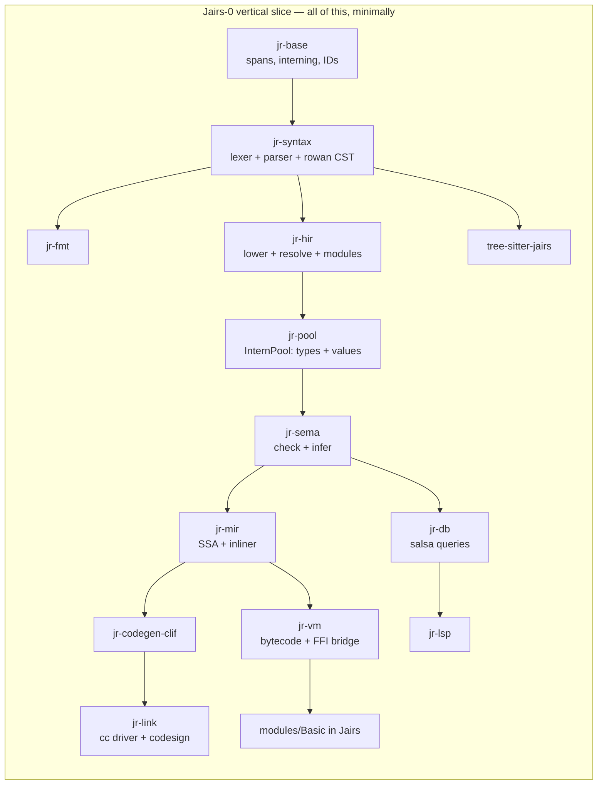
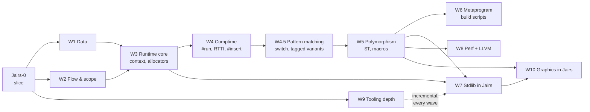
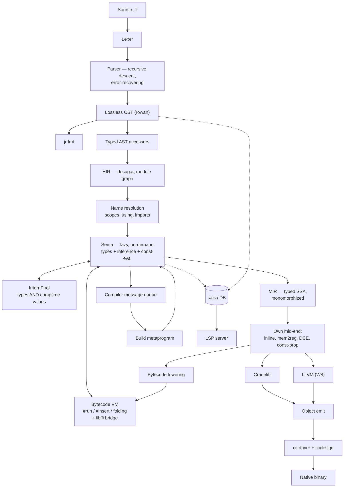

# Jairs — a Jai-like systems language in Rust

**Working name:** Jairs · **Source extension:** `.jr` · **Host language:** Rust (2024 edition)

> [!NOTE]
> **Strategy: tracer bullet, then thickening waves.**
> We do *not* build the compiler layer by layer. We first drive one absurdly small language subset all the
> way through **every** component — lexer, parser, CST, HIR, Sema, MIR, VM, Cranelift, linker, FFI, stdlib
> module, LSP, tree-sitter, formatter — until `hello.jr` is a native macOS binary and the LSP gives hover on
> it. Everything works, badly. *Then* we thicken it one feature-slice at a time.

---

## 0. Locked decisions

| # | Decision | Choice |
|---|---|---|
| 1 | Fidelity | **Jai-inspired, own language.** You own the spec. |
| 2 | Backend | **Cranelift first, LLVM later** behind a `Backend` trait. |
| 3 | Compile-time execution | **Bytecode VM over our own MIR.** Host-independent, trappable. |
| 4 | Parser | **One hand-written error-recovering parser** (rowan lossless CST), shared by compiler + LSP. tree-sitter is a *separate* editor grammar, CI-gated against drift. |
| 5 | Stdlib | **Written in Jairs itself**, like Jai. Core + OS + tooling first, graphics stack later. |
| 6 | Scope | **Solo, long-term serious, macOS arm64 first.** Linux x86-64 green in CI from the first native binary. |
| 7 | Build order | **Vertical slice first, then feature waves.** No component is "phase 2". |

### 0.1 Design questions — now resolved

| Question | Decision | Consequence |
|---|---|---|
| `context` ABI | **Hidden trailing parameter**; `#c_call` procedures opt out | Encoded in MIR's calling convention from day one. Function *types* carry a context flag. |
| Integer overflow | **Always trap** | Needs explicit wrapping operators (`+%`, `-%`, `*%`) or hash functions, PRNGs, and checksums become unwritable. **Added to Tier A.** Trap = a real runtime panic with a source location, and a *compile error* when detectable at comptime. |
| Bounds checks | **Like Jai: a build setting**, visible in the IR | MIR carries explicit `bounds_check` ops that a build-config pass strips. `#no_abc` opts out locally. |
| String representation | `{data: *u8, count: s64}`, **not** NUL-terminated | `to_c_string()` bridges to `#foreign` via temporary storage. |
| Polymorph identity | **Structural, on interned comptime arguments** — *my call* | An instantiation is keyed by the tuple of resolved comptime arg IDs in the InternPool, so `sort(Entity)` from two files dedupes to one function. Errors *display* nominally (`sort($T = Entity)`) so users see intent, not a key. Structural is required anyway once `Type` is a first-class comptime value. |
| Comptime FFI | **Yes**, gated behind `#foreign_at_comptime` | VM needs libffi-style dynamic calls. Non-negotiable given build scripts must read files. |
| Error handling | **Start exactly like Jai** — multiple returns + `#must` | But: reserve an **effect row slot in the function type representation** now, so an effects system can be added later without re-typing every signature. Costs nothing today; saves a rewrite. |

---

## 1. The vertical slice — "Jairs-0"

> [!IMPORTANT]
> **Definition of done for the slice:** `jr build examples/hello.jr` produces a signed native arm64 binary
> that prints when run; `jr run` executes the same file in the VM; opening it in a real editor gives
> diagnostics, hover and goto-definition; Neovim highlights it via tree-sitter; `jr fmt` round-trips it; and the
> printing itself comes from a stdlib module **written in Jairs** that calls libc via `#foreign`.

### 1.1 The Jairs-0 language subset

Deliberately tiny. Everything else is a later wave.

```jr
#import "Basic";                       // module system: one module, one file

Point :: struct { x: s64; y: s64; }    // structs, one level

add :: (a: s64, b: s64) -> s64 {       // procs, single return
    return a + b;
}

MESSAGE :: "hello from Jairs\n";       // constants
COMPUTED :: #run add(2, 3);            // one trivial comptime call

main :: () {
    p: Point;                          // decls: typed, and inferred below
    p.x = 4;
    sum := add(p.x, COMPUTED);         // := inference
    if sum > 5  print(MESSAGE);        // if
    i := 0;
    while i < 3 { i = i + 1; }         // while
    ptr := *sum;                       // pointer take + deref
    print(MESSAGE);
}
```

Included: `s64`, `u8`, `bool`, `string`, `*T`, `struct`, procs, `:=` / `: T` / `::`, `if`, `while`, `return`,
arithmetic (**trapping**), comparison, assignment, field access, pointer take/deref, `#import`, `#foreign`,
one `#run`.

> [!NOTE]
> `u8` is in the slice, not deferred to W1, because the string representation
> (`{data: *u8, count: s64}`, ADR-0004) and the libc `write` signature are both spelled in `*u8`. Choosing
> "stdlib in Jairs" forced this: you cannot express the bottom of the standard library without it. `u8`
> arithmetic and the rest of the numeric tower still wait for W1.

Excluded from the slice: arrays, `for`, `defer`, `using`, enums, unions, polymorphs, macros, `#insert`,
overloading, multiple returns, `context`, RTTI, floats, and the remaining numeric types. Each arrives as a
wave.

### 1.2 The slice's stdlib — `modules/Basic/`, in Jairs

This is the proof that decision #5 works. Roughly 40 lines of Jairs:

```jr
// modules/Basic/module.jr
libc :: #system_library "c";

write :: (fd: s64, buf: *u8, count: s64) -> s64 #foreign libc "write";

print :: (s: string) {
    write(1, s.data, s.count);
}
```

> [!CAUTION]
> **Correction found while building this: `print_int` is NOT implementable in Jairs-0.**
> Turning a digit into a byte for `write` needs an `s64` → `u8` conversion, and `cast` is reserved
> until W1. Every alternative needs something the slice also lacks — a `[N]u8` buffer (W1), pointer
> arithmetic (not in the subset, and no type checker yet to stop it being written by accident), or
> libc `printf` (variadic, and the arm64 variadic ABI passes variadic arguments on the stack, so a
> non-variadic `#foreign` declaration would silently produce garbage). Integer printing therefore
> lands with `cast` in **W1**, and the slice's exit criterion prints strings only.
>
> This is exactly the kind of constraint the tracer-bullet ordering exists to expose, and it cost
> minutes instead of being discovered during W7's stdlib push.

> [!WARNING]
> This forces `#foreign`, the string ABI, and the module loader into the **first** slice. That is the
> intended consequence of "stdlib in Jairs" — you cannot defer FFI to a later milestone if the bottom of
> your standard library is a syscall.

### 1.3 Slice work breakdown

Every crate gets created and does real work. Nothing is stubbed out with `todo!()` at the architectural level.



| Component | Slice scope | Why it can't wait |
|---|---|---|
| `jr-base` | Spans, `FileId`, `lasso` interner, `slotmap` arenas, newtype IDs | Everything depends on it |
| `jr-diag` | Diagnostic model + `annotate-snippets` rendering | Error quality is a design constraint, not a polish task |
| `jr-syntax` | Hand lexer (all tokens, trivia preserved), recursive-descent parser for the subset, **error recovery**, rowan CST, typed AST accessors | Recovery shape is hard to retrofit; LSP depends on it |
| `jr-fmt` | Formatter over the CST | Cheapest proof the CST is genuinely lossless |
| `jr-hir` | Lowering, module graph, `#import` resolution, scopes | Establishes the resolution model |
| `jr-pool` | InternPool for types **and** comptime values | Retrofitting interning is a rewrite. Steal Zig's design. |
| `jr-sema` | Lazy, on-demand checking; `:=` inference; one `#run` | Lazy-from-day-one is the whole reason M6-class comptime is possible later |
| `jr-mir` | Typed SSA, mem2reg, DCE, **a real inliner** | Cranelift has no inlining — it must exist before any backend |
| `jr-vm` | Register bytecode + interpreter + libffi bridge | It *is* the comptime engine; also gives `jr run` before any backend works |
| `jr-codegen` | `Backend` trait | Defining it now keeps LLVM from becoming a fork |
| `jr-codegen-clif` | Cranelift lowering, AArch64 AAPCS, Mach-O | The native path |
| `jr-link` | `.o` via `cranelift-object`, then shell out to `cc`; ad-hoc codesign | macOS binaries don't launch unsigned |
| `jr-db` | salsa 0.28 queries: file → tokens → CST → HIR → types | **The** reason the LSP won't be a fork of the compiler |
| `jr-lsp` | `lsp-server` loop: diagnostics, hover, goto-def | Proves the salsa boundary is real |
| `tree-sitter-jairs` | `grammar.js` + `highlights.scm` + corpus | Establishes the drift gate |
| `modules/Basic` | `print` / `print_line` via `#foreign` to libc `write` | Proves stdlib-in-Jairs |
| `tests/corpus` | ~20 `.jr` files: spec examples = parser tests = tree-sitter tests | One corpus, two parsers, CI-enforced |

### 1.4 Slice exit criteria

- [x] `jr fmt` byte-identically round-trips every corpus file — enforced by the
      `jairs-fmt` CI gate over `valid/`, `imports/valid/`, `tests/corpus/modules/`
      and `modules/`. `invalid/` is excluded on purpose: those files do not parse,
      and `jr fmt` correctly refuses to format input it could not parse.
- [x] `jr check broken.jr` recovers and reports multiple errors with rustc-grade
      rendering — `invalid/009-multiple-independent-errors.jr` asserts at least
      four independent errors from one file.
- [x] `jr run hello.jr` executes in the VM — `jr run tests/corpus/valid/024-hello.jr`
      prints both lines and exits 0. Asserted by `jr-cli`'s
      `run_executes_the_slice_exit_criterion`.
- [x] `jr build hello.jr && ./hello` — native arm64, launches, correct output.
      `jr build tests/corpus/valid/024-hello.jr` links through `cc` and the binary
      prints both lines and exits 0, byte-identically to the VM. Asserted by
      `jr-cli`'s `the_slice_exit_criterion_produces_output_in_both_engines`.
- [x] `COMPUTED :: #run add(2,3)` folds at compile time — folded by `jr-db`'s
      `file_consts` query (ADR-0018 §3) and interned, so it is indistinguishable
      from a literal: the MIR snapshot for `020-run-directive.jr` now reads
      `5_s64 + 1_s64`. VM and native now agree, by the differential harness below.
- [x] `print` comes from `modules/Basic` written in Jairs, via `#foreign` to libc
      `write` — executes, through libffi (ADR-0018 §4). ADR-0004's `{data, count}`
      is handed to `write` with no copy.
- [x] Integer overflow traps, in both the VM and native, with a source location —
      both engines trap and both name the line, byte-identically: `error: addition
      overflowed` then `  --> path:line:col`, exit status 4. ADR-0020 put the one
      formatter in `jr-base` so that a message chosen at *compile* time by the back
      end and one built at *run* time by the VM cannot drift, and
      `a_trap_names_its_source_location_identically_in_both_engines` compares the
      finished bytes. A trap on a compiler-invented value still reports without a
      location, which is `MirSpan::Synthetic` being honest rather than a gap.
- [x] An editor gives diagnostics, hover and goto-def over the real protocol — **by
      Neovim, and there will be no VS Code extension** (ADR-0036). This criterion named
      VS Code as its example and the example was wrong for this project: the decider does
      not use it, so a packaging target there is unverifiable in practice and would rot the
      way this box's Neovim half rotted before ADR-0025. The *intent* — a real editor, over
      LSP 3.17, against the real binary — is met twelve capabilities over, and
      `crates/jr-cli/tests/lsp_stdio.rs` asserts the protocol independently of any client.
      Closed rather than abandoned: five consecutive handoffs listed "a VS Code extension"
      as owed work nobody intended to do, which makes the whole list less trustworthy.
- [x] Neovim: tree-sitter highlighting — and diagnostics, hover and goto-definition
      besides. `editors/nvim/` is a runtimepath directory needing no plugin manager
      (ADR-0025); two lines in `init.lua` and one build script. Verified by
      `nvim --headless -u NONE -l editors/nvim/verify.lua`, 67 checks against the real
      editor and the real server. Verified rather than gated: Neovim is not a build
      dependency of this workspace.
- [ ] CI green on macOS arm64 **and** Linux x86-64 — the matrix is configured for
      both; only macOS arm64 has been verified locally.
- [x] CI drift gate: every corpus file parses cleanly in *both* the compiler and
      tree-sitter
- [x] Differential test harness exists: every corpus program's output must match
      under VM and native — `crates/jr-cli/tests/differential.rs`, which runs both
      engines as subprocesses and compares stdout, **stderr** and exit status. It
      enumerates the corpus itself rather than listing cases, so a new program is
      covered the day it is added. Because only two corpus programs print anything,
      it also carries cases that make a computation observable through `exit`, which
      is what gives it teeth: arithmetic, precedence, division truncation, loops,
      block parameters, `break`, pointers, short-circuit `&&`, struct field offsets,
      and both traps.

**Estimated: 10–14 weeks solo.** This is the milestone that decides whether the project is real.

### 1.5 Where the slice actually is

Status of each slice component, so this is answerable without reading the tree.
"Done" means implemented, tested, and green under every CI gate — not polished.

| Component | Status | Notes |
|---|---|---|
| `jr-base` | **Done** | `trap_message` takes a `frames: &[&str]` and emits one `  in <name>` line per frame, innermost first (ADR-0066 §2). It stays the **one** place that decides what a trap says, which is what keeps two engines rendering at different *times* — native at compile time, the VM at run time — from drifting in punctuation or order (ADR-0020 §2's argument, now applied to a chain). Spans, `FileId`, `lasso` interning, `newtype_index!`, source map, the one trap-message formatter (ADR-0020 §2) |
| `jr-diag` | **Done** | Diagnostic model + `annotate-snippets` renderer |
| `jr-syntax` | **Done** | **`#expand`** joins the procedure attribute loop as `EXPAND_ATTR` (ADR-0090 §1), so the three attributes take any order — its own kind beside `C_CALL_ATTR`/`NO_ABC_ATTR` so a consumer that forgets it is a missing arm, not a silent fall-through. **`$N: s64` — a comptime-value parameter** (ADR-0087 §1): `parse_param` accepts an optional leading `$` before the name (a `DOLLAR` child of `PARAM`, distinct from a `$T` `POLY_TYPE` in *type* position), the param-list continuation gate widens for it (the recurring token-set trap), and `Param::is_comptime` reads it. **`struct($T) { … }` and `Box(s64)`** (ADR-0085 §3): `STRUCT_TYPE_PARAMS` (a `($T)` list before the brace, `parse_struct_type_params`) and `TYPE_ARGUMENTS` (a `(s64)` list after a name in type position, `parse_type_arguments`), both optional so an ordinary struct and a bare name are unchanged; the `(` binds to the name in `parse_type_inner`, and a proc-pointer type's `(` is a different arm, so no ambiguity. AST accessors `StructType::params`, `NameType::arguments`, `TypeArguments::args`, `StructTypeParams::vars`. `$` lexes as `DOLLAR` and `$T` parses as a `POLY_TYPE` in type position, with `DOLLAR` in `TYPE_START` (ADR-0081). `CODE_STMT` and `parse_code_stmt` for `#code { … }` (ADR-0080 §1), checked **before** the `EXPR_START` arm because a `{` is neither a string nor an operand expression; braces required, E0131 reported at the directive rather than the token after it. `parse_stmts` parses a bare **statement list** rooted in a `BLOCK`, for `#insert` (ADR-0072 §1). `parse` cannot serve: it parses a *source file*, where `n := 1;` is a file-level `VAR_DECL` rather than a `DECL_STMT`. Wrapping the text in synthesized braces to reuse `parse` was rejected because every offset would shift by one, and §3 reports a fault's position *as an offset into the inserted text* — an offset one past the truth is worse than none, because the reader trusts it. Raises the parser's existing **E0114** for a token where a statement belongs, reused rather than duplicated because the fault is identical and only the indexed text differs; `jr-hir` re-words it as E0263 before a reader sees it. **No grammar, lexer or `SyntaxKind` change** — the lexer is already permissive about `#anything`, so `#insert "…"` was already a `DIRECTIVE_EXPR` with a `string_arg`. `switch e { case v; … else; … }` is a `SWITCH_STMT` of `SWITCH_ARM`s (ADR-0067 §1). An arm's body is "statements until the next `case`, `else` or `}`", which reuses the statement-list parsing every block has — so no new body shape enters the grammar, and braces per arm would be noise on the common one-statement arm. The `else` arm is the *same node with no value*: an absent value is the catch-all, so nothing needs a second kind — but `is_else` reads the **keyword**, because a malformed `case ;` also has no value and treating it as a catch-all would make a syntax error silently exhaustive. `push_context { … }` is a `PUSH_CONTEXT_STMT` wrapping a braced `BLOCK` (ADR-0063): the body must have braces — a braceless context swap that lasts one statement reads as a mistake — so unlike `defer` it takes a `Block`, not the two-shape `ControlBody`. `push_context` is a keyword from this wave, placed after `NULL_KW` like `context` and `operator` so it stays outside `is_reserved_keyword`'s range (it was never reserved). The `-> T` of a procedure-pointer type is **optional** (ADR-0062 §1), so `(*u8)` is a void-returning proc pointer — which was *unspellable* before: `-> void` is E0212 because `void` has no type name (ADR-0015 §3), `(*u8)` alone demanded an arrow, and `-> ` with nothing after it is a parse error. That blocked an allocator's `free` half. A present arrow with nothing usable after it is still an error, so `(s64) ->` and `(s64)` are not two spellings of one type. `null` is the **last reserved keyword to become real** (ADR-0060 §1): its refusal arm, which still read "arrives in wave W1", is gone and it parses as a `LITERAL_EXPR` beside `true`. `NULL_KW` joined the literal filter in `LiteralExpr::token` *and* `EXPR_START` — the token-set trap for the fifth keyword-shaped feature: without the first it lowered to `Bool(false)` ("found bool"), without the second `q := null` reported a parser error before sema's E0257. `is_reserved_keyword`'s range now holds no unimplemented keyword; kept as the mechanism for the next one. `PROC_TYPE`/`PROC_TYPE_PARAMS` for `(T, T) -> T` (ADR-0059 §3), with `L_PAREN` added to `TYPE_START` — the token-set trap for the fifth time, without which `fn: (s64) -> s64` reported "expected a type" at the `(`. In *return* position a proc-pointer type and a results list both begin `(`; `arrow_follows_matching_paren` scans to the matching `)` and checks for `->`, the same by-hand look-ahead `looks_like_proc_signature` uses, because only that token tells them apart (ADR-0059 §3). `NO_ABC_ATTR` for `#no_abc` (ADR-0058 §3), and the attribute position became a **loop** rather than one `if` per directive — two `if`s in a fixed order would have made `#no_abc #c_call` parse and `#c_call #no_abc` not, an ordering rule no reader could guess. The token gate that decides what a construct *is* needed the new directive too, the fourth time that list has had to widen (ADR-0045's `TYPE_START`, then `EXPR_START`, then `#c_call`). Also **restored `MEMBER`'s doc comment**, which ADR-0057's insertion of `C_CALL_ATTR` had stranded onto the new variant — harmless to the compiler and exactly the kind of thing that makes a registry stop being readable. `CONTEXT_KW` and `CONTEXT_EXPR` for the implicit context, and `C_CALL_ATTR` for the opt-out — `context` is its **own expression kind** rather than a `NAME_EXPR`, because a consumer reading names must not find it or `context.allocator` would look like a field access on a variable somebody declared. `CONTEXT_KW` sits outside `is_reserved_keyword`'s range, so nothing had to be removed from that refusal — the same position `enum_flags` and `operator` were in. The **token gate that decides what a construct is** needed `#c_call` beside `#foreign`: without it `raw :: () #c_call { }` was read as a parenthesised-expression constant and collapsed into four cascading errors starting at `()` — the `TYPE_START` shape of ADR-0045 for the third time (ADR-0057). Lexer, error-recovering parser, rowan CST, typed AST. `SCOPE_DECL` for `#scope_module`/`#scope_export` — a bare directive with no argument and no `;`, because it marks a *position* rather than declaring anything. `#scope_file` is deliberately absent: a Jairs module is one file (ADR-0014 §1), so it would be indistinguishable (ADR-0054 §1). `using` as a **prefix on a binding** in three positions — a field, a parameter and a *typed* local — with `USING_KW` out of the reserved-keyword refusal, the seventh and last keyword to make that trip. Only the typed local form takes it, because promotion needs the type's field list and `using q := f()` cannot mean anything (E0128). Three hand-written token gates had to widen — the struct field list, the union field list and the parameter list all tested `IDENT` alone — and `parse_field`'s unconditional `bump` became a **compiler crash on truncated input** until it was guarded, caught by the every-prefix robustness test (ADR-0050). `FOR_STMT`, `DEFER_STMT`, `LOOP_LABEL` and `RANGE_EXPR`, with `FOR_KW` and `DEFER_KW` **out** of the reserved-keyword refusal — the fifth and sixth keywords to make that trip. A range is reachable *only* as a `for`'s iterable, which is what keeps `0..n` from colliding with `[..]T`; `break`/`continue` take an optional label, and E0127 covers a malformed `for`. `parse_labelled_loop` builds a `NAME` node rather than bumping the token, because `LoopLabel::name()` looks for one and bumping left nothing to find — every labelled `break` then reported "outside a loop" (ADR-0049). `OPERATOR_KW` and `OPERATOR_DECL` for `operator + :: (…)`, with its own `parse_item` arm because that dispatch is on `IDENT`; E0126 covers a malformed declaration, and *which* operators may be overloaded is deliberately sema's question (ADR-0048). `AUTOCAST_EXPR` and `MEMBER_EXPR` for `xx expr` and `.RED`, with `XX_KW` and `DOT` added to `EXPR_START` — the token-set predicate trap, now checked in advance (ADR-0046). `UNION_TYPE` sharing `FIELD_LIST` with `STRUCT_TYPE`, and `union` **out** of the reserved-keyword refusal — the third keyword to make that trip after `cast` and `enum`. `TYPE_START` gained `UNION_KW`, `ENUM_KW` and `FLAGS_KW`, which were all missing (ADR-0045). `VIEW_TYPE` and `SLICE_EXPR` for `[]T` and `buf[]`, each a *separate kind* rather than a bracket form with an absent child, so a view cannot be confused with a malformed array; **E0124 keeps only its `[..]T` clause** (ADR-0044). `FLAGS_KW` — the first keyword added since the slice, and deliberately *outside* `is_reserved_keyword`'s range (ADR-0043). Bitwise operators with **non-C precedence** — bitwise above comparison, shifts between `+` and `*` — plus `~` and five compound assignments, and **E0122 is retired** (ADR-0042). `ENUM_TYPE`/`MEMBER_LIST`/`MEMBER` for `enum { … }` (ADR-0041); a float literal parses rather than being refused, and **E0120 is retired** (ADR-0040). `ARRAY_TYPE` and `INDEX_EXPR` for `[N]T` and `a[i]`, with `[]T` and `[..]T` refused by name (ADR-0039); `CAST_EXPR` is a real node, not a reserved-keyword refusal (ADR-0037 §3). `///` and `//!` are distinct trivia kinds (ADR-0027) |
| `jr-fmt` | **Done** | **`#expand`** is emitted in source order beside the other attributes (ADR-0090 §1) — it was **dropped on the first run**, turning every macro into an ordinary procedure, caught by gate 5 on this wave's own corpus file. **`$N: s64`** (ADR-0087 §1): `format_param` emits the leading `$` on a comptime parameter — dropping it would silently make a comptime parameter ordinary, the lossy-CST failure this file guards against, pinned by a round-trip corpus file. **`struct($T)` and `Box(s64)`** (ADR-0085 §3): `format_struct_type` emits the `STRUCT_TYPE_PARAMS` list between the keyword and the brace, and the `NAME_TYPE` arm emits a `TYPE_ARGUMENTS` list after the name — dropping either was silent data loss (a parameterised struct formatted to an ordinary one), caught by the round-trip gate, the recurring lossy-CST failure this file guards against. `$T` (`POLY_TYPE`) formats as `$` plus the name (ADR-0081). `CODE_STMT` formats as `#code` plus a block (ADR-0080); handled explicitly because a dropped body would silently delete spliced code — the lossy-CST failure ADR-0073 actually hit. `DIRECTIVE_EXPR` formats an operand **expression**, not only a bare string token — without which a computed `#insert CODE;` formatted to `#insert;`, silently dropping the operand (ADR-0073, the CST-preservation failure ADR-0072 §1 warned of). `format_struct_type`'s two-way `if` became a **match on the kind** (ADR-0068): the `else` branch meant "struct", so every `variant` was formatted into a `struct` — source destroyed, and exactly the mistake that function's own docs already warned about for `enum_flags`, made again one form later. Thirteenth wave in fifteen. `SWITCH_STMT` emits `switch <value> {`, one `case v;`/`else;` per arm and its statements indented under it. **The first attempt deleted the whole statement** — `SWITCH_STMT` was absent from `is_stmt_kind`, which silently drops a kind — so a formatted `054` lost its four switches entirely. Caught by formatting the file and reading it, which ADR-0067's consequences predicted. Twelfth wave in fourteen. `PUSH_CONTEXT_STMT` emits `push_context ` then `format_block` (ADR-0063). Added to `is_stmt_kind` as well: a kind absent from that predicate is *silently dropped*, and the first attempt did drop the whole block — the formatter-loses-a-statement failure the last waves keep hitting, caught here by `fmt --check` before it reached the corpus. The proc-type emitter wrote `") -> "` unconditionally, so a void-returning proc pointer came out as `(*u8) -> ` with nothing after it — **the formatter turning a legal program into an illegal one**, which `assert_parses` caught and a survival assertion alone would not have. Tenth wave in twelve it has damaged source (ADR-0062 §1). `null` joined the literal filter, and the formatter **deleted it** first — `p: *u8 = ;` — the ninth wave in eleven it has lost a construct, caught by a unit test that asserts survival (ADR-0060). **Eighth consecutive wave losing source**: `#no_abc` vanished with the procedure's attribute. This one is the *safe* direction to lose — dropping it restores a bounds check, so the program gets slower rather than unsound — which is why it needed a test more than the others, not less: nothing about the program's behaviour would have said it happened. The emitter walks the attribute children **in source order** rather than emitting the two kinds in a fixed order, because the fixed version silently rewrote `#no_abc #c_call` into `#c_call #no_abc` — not lost source, but `jr fmt` not idempotent on input it did not write. Both assertions verified by reverting (ADR-0058). **Seventh consecutive wave losing source**: `CONTEXT_EXPR` was not an expression kind, so every `context` was deleted, and `#c_call` vanished with the procedure's attribute. Both fixed with an emitter arm *and* a kind-predicate entry, pinned by a test asserting survival and canonicalisation, verified by reverting (ADR-0057). Formatter; corpus is canonical under it, CI-enforced. **Sixth consecutive wave losing source**, and again in two ways: every parameter default vanished, turning a callable `f(1)` into an arity error; and every named argument vanished, because `NAMED_ARG` is not an expression kind and the argument-list walk filtered on `is_expr_kind` (ADR-0053). Two tests pin it. `emit_using` is shared by the field, parameter and local emitters, because the formatter **deleted every `using`** — the fourth consecutive wave to lose source that way, and the worst of the four: dropping the keyword does not lose formatting, it changes what the program *means*, since every promoted bare name in the body stops resolving. Two tests pin it, one for survival and one for canonicalisation (ADR-0050). `FOR_STMT`, `DEFER_STMT`, `LOOP_LABEL` and `RANGE_EXPR` each needed an emitter arm **and** a kind-predicate entry — without the latter the formatter *deleted* every `for` and every `defer` outright, the third consecutive wave to lose source that way after `cast` and `xx`, and four tests now pin it (verified by reverting). `emit_jump_label` is shared by the block and braceless paths, because a dropped label silently retargets the jump to the innermost loop — a *behaviour* change from formatting (ADR-0049). `format_operator_decl` is its own function, because `format_const_decl` reads a `NAME` child an operator declaration does not have — sharing would have emitted `` :: `` with an empty name (ADR-0048). `AUTOCAST_EXPR` and `MEMBER_EXPR` each got an emitter arm *and* an `is_expr_kind` entry; without the latter every `xx` was deleted, leaving `small: u8 = ;` — verified by reverting (ADR-0046). `format_struct_type` reads its keyword from the *node kind*, because emitting a literal `"struct {"` rewrote `union` to `struct` — verified by reverting it (ADR-0045). `VIEW_TYPE` and `SLICE_EXPR` each got their own arm *and* an entry in the kind predicates — the fourth wave running where a missing predicate entry would have deleted a construct (ADR-0044). The enum keyword is read from the *token*, because emitting a literal `"enum"` rewrote `enum_flags` and changed the program's meaning (ADR-0043). `ENUM_TYPE` needed adding to the kind predicate **and** to the const-declaration dispatch — one alone left `Colour :: ;` (ADR-0041). `ARRAY_TYPE` and `INDEX_EXPR` are in both for the same reason (ADR-0039). Comments inside a struct body used to be deleted outright — fixed in the doc-comment wave |
| `jr-hir` | **Done** | **`Proc::expand`** marks a macro (ADR-0090 §1), lowered from the attribute and carried through the instantiation clone. **`FileHir::param_values`** carries each instantiation's baked `$N` values by `(ProcId, name, PoolId)` (ADR-0089 §1) — the value-side counterpart of `proc_bindings`, so sema can size a `[N]T` by reading an interned value rather than evaluating one. **`Instantiation::comptime_values`** for `$N` instantiation (ADR-0088 §3): a `Some(value)` per template parameter to bake or `None` to keep runtime; `expand_instantiations` takes a `&Pool` to decode each `PoolId` via `literal_from_value`, drops the `Some` params from the clone's parameter list, and rewrites the body's `Res::Param` name-uses either into an `Expr::Literal` (for a dropped comptime param) or a remapped `Res::Param` (for a kept runtime one). **`Param::comptime`** for `$N: s64` (ADR-0087 §1), lowered from the leading `$` and carried through the instantiation clone. **`TypeRef::Apply { name, args }`** for `Box(s64)` and **`Struct::poly_vars`** for `struct($T)` (ADR-0085 §3); both lowering paths turn a `NameType` with arguments into an `Apply` and a struct's parameter list into `poly_vars`, empty for an ordinary struct so nothing else changes. The dump prints an `Apply` by name and arity (`Box(1 args)`), like `Proc`/`Results`, because its argument ids index an arena the dump may not hold. `TypeRef::Poly` for `$T`; `instantiate.rs` appends a substituted procedure clone per instantiation to an expanded HIR, with a synthetic `$instN` name and a `proc_bindings` entry per type variable (ADR-0082, ADR-0083). `jr-hir` gained a `jr-pool` dependency for the `PoolId` a binding carries. `lower_code` splices a `#code` body's **inner** source text through `expand_insert_text` to the same `Stmt::Insert` a literal insert produces (ADR-0080 §2) — braces excluded, since a block is a nested name scope and an insert's statements must not be. E0201 is **withheld for `any_of`/`any_as`** as it is for `type_info` (ADR-0076), and for a builtin type name in an intrinsic's argument — the recogniser is one shared `is_intrinsic_name`. E0201 is **withheld for `type_info` and for its argument** (ADR-0075 §2): the intrinsic has no declaration to find, and a *builtin* type name resolves to nothing at all because the builtin names are ordinary identifiers rather than keywords — so `type_info(s64)` reported an unresolved name. Scoped to the argument via `in_type_info_argument`, so `x := s64;` elsewhere keeps its error; this pass has no pool to intern a type in, so sema decides. **A computed `#insert` operand** is held as `Stmt::Insert { operand: Option<ExprId> }` and lowered as an ordinary expression, so it resolves and type-checks — `#insert undefined;` is E0201, a non-`string` operand E0214 (ADR-0073). `lower_file_with_inserts` expands a pending insert from operand text keyed by directive **span**; an expanded insert clears `operand` to `None`, distinguishing an evaluated-empty insert from an unevaluated one. A depth bound, **E0264**, refuses expansion past 16 levels — the guard a literal insert did not need, since a generated string can be a quine. **`Stmt::Insert` — `#insert "…"`'s statements, lowered into the *enclosing* scope** (ADR-0072 §1). Deliberately not a `Stmt::Block`, and a block would have been wrong twice over: `jr-mir` treats a block as a **defer scope**, so a `defer` in inserted code would run at the insert's end rather than the enclosing body's; and lowering pushes a **name scope** for a block, so a local the insert declared would be invisible on the next line — the exact thing the feature promises works. Lowering calls `jr_syntax::parse_stmts` on the operand, so it is no longer a pure function of *one* parse tree (though still of its inputs). Every synthesized node takes the **directive's** span via a `span_override` on the two span helpers, rather than a fix-up afterwards: a `Span` lives in sixteen `Expr` fields, nineteen `Stmt` variants, `Local::name_span` and `Param::name_span`, and the first attempt rewrote the `expr_spans` arena and **missed `Expr::Name`'s own `span`** — the one the resolver reads — so an unresolved name in inserted code reported against lines 1–2 of the file. Found by running. Nesting needed no code: the recursion falls out of `lower_stmt` calling itself, and escaping *doubles* the text per level, so a literal insert is bounded by the file it is written in. `TypeRef::Array` gained `len_name`, the length's bare name when it was one (ADR-0070 §1), so sema has something to resolve. Lowering still only *reads* — whether the name denotes a usable constant is a semantic judgement, which is the same split ADR-0039 §3a drew for the literal. `Struct::is_union: bool` became `Struct::kind: AggregateKind` (ADR-0068 §2): three forms do not fit a bool, two bools would admit "union and variant", and a third *arena* is unrepresentable — a `DeclId` names an index but not an arena, so a separate one would collide with structs while both share `Pool::struct_fields`. Every reader became an exhaustive match, which is the point. `Stmt::PushContext(StmtId, Span)` holds the block; lowering, resolution and the dump treat it exactly like a block (ADR-0063) — the copy that isolates it is a `jr-mir` concern, invisible here. A separate variant rather than a flag on `Stmt::Block`, so every exhaustive match decides what a context scope means. `Literal::Null`, carrying no value — a null pointer is the bit pattern 0 and its type comes from context (ADR-0060 §1), so it lowers like an integer literal rather than as a keyword expression of its own. `TypeRef::Proc { params, ret }`, with `ret` an `Option` because `void` has no spelling — a missing return resolves to `PoolId::VOID` in sema, not to a `Name("void")` sema would reject (ADR-0059 §3). The dump prints it by *arity* (`(N params) -> _`), like `Results`, because its element ids index an arena the dump may not hold. `Proc::no_abc`, which is the **whole** representation of ADR-0058 §3's opt-out: no `Projection`, `Expr` or `Statement` carries it, because a per-index flag would have to reach `Projection::Index` through the eleven passes and back ends that match on a projection, and a flag some of them ignored is the first named failure mode. `Expr::Context` and `Proc::c_call`, the parsed shape of ADR-0057. `c_call` is a flag on the procedure rather than a derived question, and `#foreign` does *not* set it — sema derives the `ContextKind` from `foreign` independently, so writing both is redundant rather than contradictory. Lowering, name resolution, flat import merge (ADR-0014). `Item::exported`, computed by walking file-level children in source order — as *children*, because a `SCOPE_DECL` is not an `Item` kind and `source_file.items()` would skip every marker. `ItemScope` carries a `hidden` set so a use of a filtered name is E0253 "not exported" rather than E0201 "unresolved", and `FileHir::export_scope` **owns the filter** rather than returning the raw scope with a doc comment calling it a temporary over-share — two answers to "what does this module export" would let whichever a consumer called decide whether it saw encapsulation (ADR-0054). `Expr::Call` gained `arg_names`, a parallel `Vec<Option<Symbol>>` so every existing consumer walking `args` keeps working; `Param::default` holds a default's expression. `lower_args` exists **twice**, once per expression arena, because the file's and a body's both start at index 0 — and it walks the `ARG_LIST`'s children rather than `ArgList::args()`, since a `NAMED_ARG` is not an expression kind and that accessor would have dropped every named argument silently (ADR-0053 §1). `Stmt::LocalTuple`, `Stmt::AssignTuple` and `Stmt::ReturnTuple`, plus `TypeRef::Results` — separate variants rather than generalised existing ones, so every exhaustive match is forced to decide what several values mean. A `_` discard lowers to `None`: a **hole** recognised positionally, never a local and never in the resolve map, which is why `Res` needed no new variant (ADR-0052 §3). **`Res::Promoted { base, field }`** — a promoted name resolves to a *path*, which is the fact that made `using` hard, and adding the variant cost `Res` its `Copy` impl while making every exhaustive match over it a compile error. That is how the ten consumers needing to learn about it were *found* rather than remembered (ADR-0050 §2). Promotion sits between parameters and file items in ADR-0014 §3's order, so a real binding wins **silently**; two promotions of one name is E0250 at the *use* site, which is that ADR's ambiguity rule reused verbatim. A `using` local promotes only from its declaration onward and only within its block — a flat per-body set was simpler and rejected, because it would make a promoted name visible above the `using` introducing it. `using_fields` and `using_fields_in_body` are separate entry points because a local's annotation lives in the *body's* type arena and a parameter's in the file's, and both start at index 0 (ADR-0050). `Stmt::For`, `Stmt::Defer`, an optional label on `Stmt::Break`/`Continue`, and `ForIterable::{Sequence, Range}` — a label is deliberately **not** in the `ResolveMap`, because it names a loop rather than a value and putting it there would make `break outer` look like a name reference to anything reading that map (ADR-0049). `ConstValue::Operator(ProcId, BinOp)`, whose name interns as the synthetic `operator+` so it lands in the ordinary name map — and the duplicate-name scan **exempts** overloads, because one operator legitimately has many and they all share that name (ADR-0048 §1). `bin_op_of_token` is now shared by the declaration and `lower_bin_op`, so the two cannot disagree. `Expr::Autocast` and `Expr::Member`, both carrying **no type**: `xx` has no syntax for one and a bare member names no scope, so sema supplies both from the context (ADR-0046). `ConstValue::Union` and `TypeRef::Union` index the **same arena** a struct does, with `Struct::is_union` carrying the kind: a separate arena would give a struct and a union at the same index one `DeclId`, and they share `Pool::struct_fields` (ADR-0045 §4). `TypeRef::View` and `Expr::Slice`, both distinct variants because `TypeRef::Array`'s `len: None` already means "not a usable literal" (ADR-0044 §1). `ConstValue::Enum` beside `Struct`, because ADR-0012 makes both instances of one `name :: value` form. `TypeRef::Array` and `Expr::Index`; the array length is *read* here and judged by `jr-sema` (ADR-0039 §3a). A leading `-` on a literal is folded in during lowering, so `Literal::Int` carries a signed `i128` rather than a magnitude (ADR-0038) |
| `jr-pool` | **Done** | **`Item::StructType`/`UnionType`/`VariantType` gained `args: Vec<PoolId>`** (ADR-0085 §1) — empty for an ordinary declaration, so no existing key moves and every snapshot stayed byte-identical when it landed; `Box(s64)` and `Box(bool)` share a `decl` and are two `Item`s the way `[2]s64` and `[3]s64` are. `Pool::struct_instance(decl, args)` interns one, and a second side table `instance_fields: PoolId → fields` holds a parameterised instance's substituted fields, dispatched by `Pool::fields_of(ty)` — an ordinary struct keeps its `DeclId`-keyed map untouched. `layout_of`/`field_offset` key the field read on the instance, which is the whole back-end change (ADR-0085 §2, §4). **`Item::AggregateValue { ty, elements }`** — a struct or array compile-time value as its **element values**, not a byte image (ADR-0074 §1). The pool is target-independent (`layout_of` takes a `TargetLayout`, the pool holds none), so bytes would put one target's padding and pointer width into a shared table and a cross-compile would read plausible wrong values rather than fail. The first **recursive** value variant, which is how all fourteen exhaustive-match sites were found. The `ty` is part of the key because `type_of` is total and two struct types with identically-typed fields have the same element list — an elements-only key would intern them to one id. `Item::VariantType`, and a variant's layout is the existing sequential rule over `[tag, union-of-cases]` — a leading `u8` tag (offset 0 regardless of what follows, ADR-0057 §4's argument) then the cases, so `field_offset` gains **the one line that makes a variant a variant**: every case sits at `variant_payload_offset`, not at 0. Two tests pin the arithmetic, and the second is the one an 8-aligned-only test would hide: two `u8` cases give size 2 with the cases at offset **1**. `Context` grows to **five** fields (ADR-0065): `temp_data` (`*u8`) and `temp_mark` (`s64`) join the allocator's three. Both are *already* well-known pool ids (`PTR_U8`, `S64`), so unlike the allocator's proc-pointer types they need no pre-interning — `WELL_KNOWN_COUNT` stays 14 and `Pool::new`'s `debug_assert` chain is unchanged. `temp_mark` is a byte count, so a reset is one integer store. `PoolId::ALLOC_FN` and `FREE_FN` join the well-known prefix (`WELL_KNOWN_COUNT` 12 → 14), pre-interned for the reason `PTR_U8` is: `CONTEXT_FIELD_TYPES` is a `const &[PoolId]`, so a context field's type must be a well-known id. `Context` is now **three** fields — `allocator`, `allocator_free`, `allocator_data` — flattened rather than nested in an `Allocator` struct, because a nested struct type needs a `DeclId` a compiler-declared type has not got (ADR-0062 §2). `Item::ProcValue { ty, decl }` finally has a *producer*: `jr-mir` interns one for a procedure name used as a value (ADR-0059 §1). The `decl` is a `DeclId` whose `index` is the `ProcId`'s, which is the whole `DeclId → ProcRef` bridge both engines named as the blocker — and both decode it the same way, packed `(file << 32) | proc` in the VM and rebuilt as a `ProcRef` natively. `Item::ContextType` — the **first compiler-declared type**, so it has no `DeclId` from any file and is keyed structurally, the answer ADR-0052 §1 already gave for a results aggregate. `CONTEXT_FIELD_TYPES`/`CONTEXT_FIELD_NAMES` are the single place the one field `allocator` is declared, and `context_field` is the single place a name becomes an index, so both engines read the same offsets. `find_context` and `context_type_id` take `&self` rather than locking, because the pool mutex is **not reentrant** and a fresh lock inside a caller already holding one hung the program rather than failing (ADR-0057). `Item::ResultsType { elems }` — **structural**, keyed on the element list because an anonymous type has no `DeclId` to key on, and normalised so `-> (T)` is `-> T` and `-> ()` is `void`. `sequential_layout` and `sequential_field_offset` are shared with a struct's rather than duplicated: **omitting the second returned `NotAType` for every result after the first**, which surfaced as a destructuring statement binding wrong values rather than as an error (ADR-0052 §1). `Field::using`, carried on the *layout* type purely so field **lookup** can follow an embedded base — it affects no offset, and `field_offset` never reads it, which is what lets `using` be a resolution feature and leaves ADR-0018 §2's one-layout rule untouched (ADR-0050 §4). `Item::UnionType` — nominal like a struct, sharing its field side table, with **every field at offset 0** and a size that is the largest field's; the two lines that make a union a union, both here because a layout disagreement between the engines would be *invisible* rather than a crash (ADR-0045 §3). `Item::ViewType`, structural and nesting like `PointerType`, whose layout is a **shared** `{data, count}` pair that `string` now computes through as well — one arithmetic, two identities (ADR-0044 §1). `Pool::find` looks a type up without interning, for the back ends that hold `&Pool` and need a view's `*T`. `Item::EnumType` carries `flags`, and `IntKind::of` answers `s64` for an enum so both evaluators treat a combination as the integer operation it is (ADR-0043). `IntOp` covers `& | ^ << >>` and `int_not`, with `IntTrap::ShiftOutOfRange` for a count outside the width (ADR-0042). `Item::EnumType` with members in a side table, nominal and keyed on `DeclId` like a struct (ADR-0041 §4). `FloatKind` beside `IntKind`, with IEEE-754 arithmetic that has no error path at all — the visible shape of ADR-0040 §1. `IntKind::from_name`/`NAMES` is the one list of integer type names (ADR-0037 §1) — Types + comptime values in one pool (ADR-0015, ADR-0016 §3); layout (ADR-0018 §2), now including `ArrayType`'s stride-times-length (ADR-0039 §3); ADR-0002's integer arithmetic, shared by both evaluators (ADR-0022 §2) |
| `jr-sema` | **Done** | **A call to a `#expand` macro is refused E0272** (ADR-0090 §3) via `callee_is_macro`, and the refusal ships with the surface because without it `#expand` was accepted and silently ignored. **An array length may name a `$N` comptime parameter** (ADR-0089): `constant_array_length` consults `Ctx::value_bindings` first — seeded from `FileHir::param_values` by the signature phase and re-seeded per body by `check_file` (so two instantiations sharing the name `N` cannot cross values). A *template*'s `[N]T` resolves to a placeholder `[0]T` recorded in `Ctx::placeholder_arrays`, and E0236's literal-index check withholds on it, because a template has no value for `N` and is never lowered. **`$N` comptime-value calls run** (ADR-0088): `check_comptime_call` (replacing 6a's E0271 refusal) records `(proc, [arg ExprId per comptime param])` in `comptime_calls`, for `jr-db`'s pre-pass to evaluate. `callee_comptime_template` and `callee_poly` now each require a **pure** template (no mixed `$T`+`$N`), so a mixed template falls through to the ordinary path with an honest mismatch. **`$N` comptime-value parameters** (ADR-0087): `ProcSig::comptime_params` (parallel to `params`) marks which parameters are `$N`, and `ProcSig::is_template` covers both the `$T` and `$N` template marks. Unlike a `$T` template, a `$N` procedure's **body is type-checked** — its parameter type is fully known (`s64`), only the value varies, so `N + true` is E0214 at template time. A **call is refused E0271** (`callee_comptime_template`) *before* the ordinary call path, which would otherwise succeed and lower a call with no value for `N` — a placeholder miscompile the by-design refusal prevents (teeth-checked). **Polymorphic structs** (ADR-0085): `resolve_type`'s `TypeRef::Apply` arm resolves `Box(s64)` — looks the constructor up to a `struct($T)` in this file (`parameterised_struct`), resolves the arguments, binds the variables, interns the instance via `Pool::struct_instance`, and resolves its fields *under the bindings* into the instance-keyed map (`resolve_instance_fields`), guarding recursion by reserving the field slot first. `Box(s64).value` is `s64` and `Box(bool).value` is `bool` from one declaration. The `struct($T)` template binds its variables to `PoolId::ERROR` (quiet, no diagnostic) so a bare `T` in the template body does not report E0212, and that template entry's fields are never read. **E0269** refuses a `Name(args)` that is not a parameterised struct (or is cross-file); **E0270** a wrong argument count. Deferred with no-op arms, not gaps: inferring through `Box($T)` (`infer_var_in`/`collect_poly_in_type` leave `Apply` unbound) and `using` on one (ADR-0085 §5). `$T` polymorphism (ADR-0081–0084): `Ctx::type_bindings` resolves a variable and a bound bare `T`; `ProcSig::poly_vars` marks a template (body unchecked, no MIR); `check_polymorphic_call` infers every variable — directly or through `*$T`/`[]$T` via `infer_var_in` (ADR-0084) — forms the structural key (tuple of bindings, ADR-0083), and records the instantiation; per-instantiation body checking rejects a body wrong for the bound type. E0268 refuses a call that cannot be instantiated. `Type_Info` gained `count` and `element` (ADR-0078), validated by `TYPE_INFO_FIELDS` like every field. **`any_of`/`any_as` are intrinsics** (ADR-0076): `any_of`'s pointer erases to `*u8` here and nowhere else, `any_as`'s second argument is a type and its read traps at run time on an `id` mismatch. `Type_Info` gained `id` (ADR-0077), validated by `TYPE_INFO_FIELDS` like every other field. `library_struct` and E0265 now serve `Type_Info` and `Any` both. E0267 refuses `any_of` of a non-pointer. **`type_info(T)` is an intrinsic**, recognised by name and only when the name resolves to nothing, so a program declaring its own `type_info` keeps it (ADR-0075 §2). Its argument is a *type*, so `check_type_info` marks it a type position — the E0261 allowlist gains one entry rather than the refusal gaining an exception. `TYPE_INFO_FIELDS` is the **contract with `modules/Basic`**: the lookup validates field names, types and order, and a mismatch is E0265 naming it, because a wrong offset would be a silent wrong value rather than a crash. Returns the struct **by value**, which the MIR verifier forced — a pointer's pointee has nowhere to live, since the folded value is a constant. `builtin_type_named` matches `s64` by text with **no diagnostic**, and only for a genuinely unresolved name: calling `resolve_type_name` reported E0212 "unknown type name `x`" for a local, which is wrong twice over. Silent when no imported signatures were supplied at all, because `Type_Info` lives in `Basic` and inventing a library error from a missing input is what `jr-sema`'s own module-free corpus test forbids. E0266 refuses a type with no runtime layout rather than reporting zero. **A type is a compile-time value, and using one at run time is E0261** (ADR-0071 §3). Before it, `t := Point;` type-checked cleanly and both engines exited 0, lowering to a `type`-typed slot holding `Rvalue::Undef` — a placeholder that is a *legitimate value*, in a type with no runtime layout at all (`LayoutError::ComptimeOnly`), so neither the verifier nor ADR-0017 §4's poison gate could object. PLAN §5's first named failure mode, found only by dumping the MIR. Refused **here rather than in lowering** for ADR-0039 §3a's reason: rejecting a construct is a semantic judgement, and a lowering refusal reports a compiler-internal message for a program that looks well-formed. Every position *with* an expectation was already caught by an ordinary mismatch — `takes(Point)` is E0214, `if Point` is E0222 — so what got through was the two with **none**: a `:=` binding and a bare expression statement. The two positions that *do* accept a type are an **allowlist** (`type_position`) populated by the code that creates each, not a shape test, because the failure directions are not symmetric: a missed legal position is a false error a reader reports, a missed illegal one is the placeholder above. A **type alias** (`T :: Point;`) carries the aliased type in `SigEntry::type_value`, which is what makes it usable in an annotation — read from the aliased name's own entry rather than re-resolved, and one level only (a chain needs a fixpoint and a cycle check, ADR-0071 §5). **`Type` is deliberately not spellable**: `T : Type : Point;` does not parse — the grammar has no annotated-`::` form — and no annotation can resolve to `PoolId::TYPE`, so the spelling would have had no position that wanted it. An array length may **name a literal-valued constant** (ADR-0070 §1): `constant_array_length` resolves the name against the file scope this crate already consults and reads the literal out of the HIR, so `[N]s64` works with **no evaluation** and therefore no dependency on `jr-db` or `jr-vm` — ADR-0039 §3a's constraint is honoured, not inverted, and this crate's `Cargo.toml` still names neither. A length that needs a *value* — arithmetic, a `#run`, a chain of constants, a cross-file constant — is still E0233, and the message now says **which** side of that line the reader is on rather than "must be an integer literal", which after this would be false. `check_switch` types the scrutinee, checks each arm's value **against that type** — which is what lets a bare `.RED` resolve, since `check_bare_member` wants exactly that expected type (ADR-0046) — then judges the arm set: **E0258** names the *missing* enum members rather than counting them (the name is the fix), **E0259** a duplicate `case` or second `else`, **E0260** an `else` on an already-exhaustive enum switch. E0260 is what makes E0258 worth having: without it every switch could end in `else` and the member check would never fire. Exhaustiveness is enum-only (§3) — an `s64` has no finite member set, so the check would be approximate rather than true. Pointer offset is typed in `check_pointer_arithmetic`, before the numeric path and only for `+`/`-` (ADR-0064): `*T + int`, `int + *T` and `*T - int` are `*T`; each operand is typed with **no** shared expectation, so a pointer is never unified with an integer. Skipped when a concrete numeric type is expected, so `sum: s64 = xx tiny + 1;` still pushes `s64` inward for the autocast (the regression that caught the need for the guard). `p - q`, `n - p`, and a non-integer offset are E0223, each with its own message; `p - q` is deferred (ADR-0064 §5). `push_context` in a `#c_call` procedure is E0254 — the same code as `context` there, reused because it means exactly "this needs a context and there isn't one" (ADR-0063 §4); no new code, so **E0258 is still the first free code**. The block is checked regardless, so a body error inside it is still reported. `is_foreign_proc` now answers for an **imported** procedure too, by asking its interned type for `ContextKind::CCall` rather than chasing the other file's HIR (ADR-0062 §3). Without it `context.allocator = malloc` on an imported `malloc` reported *"expected `(s64) -> *u8`, found `(s64) -> *u8`"* — identical text, because the types differ only in the invisible `ContextKind`. It is E0256 now, the code that says "wrap it". **E0257** for `null` in a non-pointer context or with none (ADR-0060 §1): `check_null_literal` requires a pointer context and has no default, unlike an integer literal — `p: *u8 = null` works, `n: s64 = null` and a bare `q := null` do not. `null` is an *untyped* literal for `is_untyped_literal`, so `p == null` types the `null` as `p`'s pointer type; and a `null` default argument interns to the zero pointer, checked against the parameter type the way every other default is. A `(T, T) -> T` resolves to the **same** `Item::ProcType` a declared procedure has, so passing `add` where a `fn: (s64, s64) -> s64` is expected is an ordinary type match (ADR-0059 §3). **E0256** refuses a `#foreign` procedure taken as a *value* — its `CCall` type reaches through libffi, not a `ProcRef` — while a direct `write(…)` call stays legal: the callee routes through a `call_position` set (the shape `operator_calls` uses) that suppresses the refusal, and the first attempt bypassed `check_expr` and left the callee's type unrecorded, surfacing as MIR's "an expression was never typed" — the silent-placeholder class, caught by the differential harness. **E0255** for `#no_abc` on a `#foreign` declaration — a procedure with no body has no index to leave unchecked, so the directive could only be a word that does nothing, and one silently ignored tells the writer their request was granted (ADR-0058 §3). Raised in `proc_signature` rather than the check phase because it needs no types, no body and no expression context. This wave also **fixed a latent ADR-0057 bug found while reading that function**: `ContextKind` was decided from `foreign.is_some()` alone, which was correct when written — `#c_call` was unparseable then — so an explicit `raw :: () #c_call { }` interned as `ContextKind::Jairs`, its *type* claiming a context its ABI does not take. Invisible because nothing reads the kind for the ABI yet; a wrong answer waiting for the first function-pointer type check. `context` is checked, not typed anew: `ContextKind` was already part of every `Item::ProcType` (ADR-0001) and every `#foreign` declaration already got `CCall`, so **the type side needed no change at all** — ADR-0001's reserved slot paying off as intended. What sema adds is the refusal: **E0254** for `context` in a `#c_call` procedure and for `context` at file scope, two messages under one code because both say "there is no context here" and the note is what differs (ADR-0057). Signatures + checking (ADR-0016). Named arguments: `ProcSig` gained `names` and `defaults` — on the per-**procedure** record rather than `Item::ProcType`, which is per-**type** and would have to lie about one of two procedures sharing a signature. `fill_arguments` resolves an argument list into one slot per parameter and is the only thing that decides argument order; the result goes in `CheckOutput::filled_calls` and `jr-mir` reads it, so MIR never learns what a name is. A default is interned from its **literal** with no const-eval, because a signature cannot depend on a constant whose type depends on signatures (ADR-0018 §3). E0252 covers six refusals, the unknown-name one with a near-name suggestion (ADR-0053). Multiple returns: `destructured_results` is the one place arity is decided, so both statement forms agree; **exact** arity, because letting a caller bind a prefix would make adding or reordering a result silently change every call site. E0251 covers four refusals — a count mismatch, a destructuring statement on a single-result call, binding a results aggregate as one value, and a results type where a value's type belongs. A multi-value `return` is checked **positionally**, so a swapped pair names the position rather than the whole tuple (ADR-0052). `using`: a promoted name types as its base's type then a field of it, recursing so an embedded chain resolves; `embedded_field_type` searches `using` bases breadth-first when a direct field misses, so a struct's own field shadows an embedded one. A promoted name **is a place**, and answering otherwise would have made every `using` parameter silently read-only (ADR-0050). Operator overloading: resolution is an **exact** match on `(operator, lhs, rhs)` looked up *before* `unify_operands` so a mixed-type overload is reachable, with ADR-0014 §3's order — local shadows imported, two imports are E0211. E0246 covers all four refusals (wrong arity, a reserved operator, the orphan rule, a genuine duplicate), each with its own note. `has_operators` is the early exit that makes builtin arithmetic pay nothing (ADR-0048). `xx` and bare `.RED` — one idea, both reading `expected` and both refusing rather than inventing a fallback: E0242/E0243 for `xx` with no context or on a literal, E0244 for a bare member with no context or a non-enum one, and E0238 shared with the qualified form so the two spellings cannot disagree about which members exist (ADR-0046). `xx` delegates to ADR-0037 §2's conversion rule unchanged, so it is legal exactly where `cast` is. `union` as a nominal type whose field access, `no_such_field` diagnostic and near-name suggestion are all a struct's unchanged — `SigKind::Union` exists only so a diagnostic does not call a union a struct (ADR-0045 §5). `[]T` views with **no implicit conversion** from an array: `buf[]` is an explicit operator, and E0240 is a *specific* diagnostic whose help names it rather than the generic mismatch. E0239 refuses slicing a non-array, a view, or an expression with no storage; E0241 refuses `==` on a view, because "same storage" and "same contents" are both plausible (ADR-0044). `enum_flags` numbers by powers of two, with `& | ^ ~` yielding the flags type and shifts refused (ADR-0043); three refusal messages that each name the right remedy. Bitwise operators are integers or `enum_flags`, and a shift's operands deliberately need not share a type (ADR-0042 §2, §5). `enum` with Jai's numbering rules — auto from 0, and an explicit value makes *later* members continue from it — plus E0237/E0238 and a member suggestion (ADR-0041). `float32`/`float64` with context-typed literals and **no** fit check — an out-of-range float saturates, where an out-of-range integer is E0204 (ADR-0040 §5); `%` and the wrapping operators are refused on floats with the reason (§7). `[N]T` and `a[i]`, with E0233 for a non-literal length, E0234 for indexing a non-array, E0235 for a non-integer index and E0236 for a literal index proven out of range (ADR-0039). The full integer tower and `cast(T, x)`, a fit check against each type's *range* rather than its maximum magnitude (ADR-0038), whose literal fit check *is* ADR-0016 §1's (E0232 for a non-integer). E0212 and E0218 suggest a near name (ADR-0031 §1), and `FileSignatures` records which import each *type* name came from — `ResolveMap` cannot see a `TypeRef::Name` (§2). No const-eval: that is `jr-vm` |
| `jr-db` | **Done** | **`Wanted::ComptimeArg` and comptime-value instantiation** (ADR-0088): `wanted()` collects one target per `$N` argument, keyed by the call's `(scope, call ExprId)` and the argument's own `ExprId`; the round-robin evaluates each via the same `file_consts` thunk `#insert`'s operand uses (ADR-0073). `instantiated()` reads back the values, keys a `$N` instantiation on `(template, [value ids])`, appends a clone with the `$N` params dropped and their values baked, and records both a redirect and a per-call `comptime_arg_mask` so MIR passes only the runtime arguments. **E0271** owns the "not a compile-time constant" refusal — defined here beside E0230 for the same stage reason. `instantiated` (in `sema.rs`) builds the expanded HIR for a file's polymorphic calls, recomputes signatures/resolve/check over it — unlike the `#insert` branch, because instantiation adds procedures — and records the call redirects (ADR-0082). `MirResult` carries the expanded HIR and signatures so `add_file`, the native build and the dump pair MIR with the right procedures. `reduce_element` **refuses** a pointer or view element in a compile-time aggregate (ADR-0079) — it interned the evaluator's address as an integer, giving 48 in the VM and a segfault natively with no diagnostic. And a `#run` whose callee reads an imported constant now reports the *refusal* rather than the VM's "no routine" ICE. `type_info_value` fills the fixed-size per-kind facts `count` (a struct/union/variant field count or an array length) and `element` (an array's element or a pointer's pointee, as a type id) from the pool it already reads (ADR-0078); a procedure's parameter count is left 0, being the variable-length list. `type_info_value` builds `Any`'s `type` field's `Type_Info` and its `id` element (the described type's pool id, ADR-0077); `any_of`/`any_as` record an `AnyLowering` on `ConstValues`, a real-code channel beside the constant fold. `kind` is now read by name, since `id` shifted its position. `Raw::Aggregate` holds a **tree of reduced elements** rather than a flat byte image (ADR-0075 §1), so a `string` field is resolved through the VM's `read_string` *while the VM is alive* — its bytes are a `{data, count}` pair into memory that is gone by interning time, which is why the case was refused. `aggregate_placements` is the single answer to "which shapes have readable elements and where", shared by the walk and by interning, because two copies would be two chances to disagree about an offset. `type_info_value` builds the `Type_Info` constant with **no VM at all** — kind from the `Item`, name from the signatures, size and alignment from `layout_of` — keyed as a `run` value so `jr-mir` reads it through the mechanism it has. `file_consts`' early return now accounts for a `type_info`-only file, which was left unfolded and refused as "a name failed to resolve". **The computed-`#insert` operand pre-pass** (ADR-0073): `insert_operands` reuses `file_consts`' evaluator via a `Wanted::InsertOperand` target and keys results by span, and `file_mir` expands **inline** — `lower_file_with_inserts` then `checked_expanded` re-resolves and re-checks the expanded tree — needing no new salsa query because `resolve`/`check_file` take an explicit `&FileHir`. Acyclic: `frontend_diagnostics` is mir-free, so nothing loops back. `MirResult::expanded_diagnostics` carries the expanded tree's errors to `file_diagnostics`, since the unexpanded resolve withholds E0201 in a body holding a pending insert. `file_consts` gained a third target kind, `Wanted::TypeAlias` (ADR-0071 §2) — the one target the **VM never runs**. `T :: Point;` used to report "compile-time evaluation failed: a file-level item has no value yet", a const-eval internal on a correct declaration, because a struct is deliberately not an evaluation target (its "value is a declaration rather than something to compute"). Its value now comes from `SigEntry::type_value`, which the *signature* phase already computed and this query is downstream of (ADR-0018 §3) — so it reads a value that exists rather than inverting a phase, the move ADR-0070 §1 made for an array length. `Item::TypeValue` gets its **first producer** since the pool was written. The round-robin and the cycle detector needed no change: a type alias is a target like any other that simply succeeds in the first round. `file_consts` puts **every reachable file's** bytecode in the comptime program, so a `#run` may call an imported procedure (ADR-0069 §1) — which replaced `internal compiler error: no routine for file 1 proc 11`. The MIR for those files is **lowered here rather than taken from `file_mir`**: the obvious version produced a salsa cycle (`file_consts(A) → file_mir(B) → imported_values(B) → file_consts(A)`, because `file_mir` folds imported constants) and three corpus tests failed at once. It also collects a `#run` inside a **body** as a target (§2), keyed by `(ExprScope::Body, ExprId)` — one query, one round-robin, one cycle detector. `BuildConfig`, a salsa input beside `ModuleSearchPaths` and for the reason that input's own docs give: configuration from outside the source files must be an input, or salsa serves a memo computed under the old value (ADR-0058 §2). `optimized_file_mir` takes it, so every caller changed — and the LSP passes checks-on, because an editor is not a build. `snapshot` **shares** the config `Arc` rather than resetting it, or an LSP snapshot would silently read checks-on while its database had them off. The strip pass runs **once, before** the pipeline: a body never grows a new check, so a second scan could only find nothing, and running it after would deny const-prop and DCE the statements it removed. `main_receives_context` and the entry context: `run_main` allocates a **zeroed** one and passes its address, because `main` has no Jairs caller to have passed one (ADR-0057 §5). Built from the pool guard the function already holds — `lock_pool` a second time **deadlocked**, and the program hung rather than failing, which is the same self-deadlock `jr-lsp` records. `imported_procs` now carries each callee's `receives_context`, because a cross-file `#foreign` callee takes none and handing it one produced "`exit` takes 1 arguments, called with 2". `reduce` asks the result *type* whether a compile-time scalar is a float before interning it — a float **is** a scalar in the VM (ADR-0040 §3), so mapping every scalar to an integer interned a float constant as an `Item::IntValue` carrying a float type, and the native back end emitted `iconst` on an `F64`. The VM read it back correctly, which is why `jr run` was right and `jr build` panicked (ADR-0056). `imported_values` — the parallel of `imported_procs`, reading each imported module's `file_consts` so an imported constant's **value** crosses the boundary. It does not cycle because `file_consts` depends on signatures rather than on `checked` (ADR-0018 §3), so an edge from A's lowering to B's const-eval has no path back (ADR-0055 §3). `file_exports` now *caches* `FileHir::export_scope` rather than cloning the whole scope, so `#scope_module` filtering happens once in one place and the query still depends on `file_hir` alone — the invariant that keeps two modules importing each other from cycling (ADR-0054 §3). salsa queries: module loader, sema, MIR built *and* optimized, const-eval, run, doc comments, workspace discovery, unused imports (ADR-0007, ADR-0014, ADR-0018 §3, ADR-0021 §1, ADR-0027 §2, ADR-0029, ADR-0031 §3). E0231 is the project's first *warning*; **E0245 is its second and the first to report a compiler gap** rather than a program error — a refused body warns, and `run_main` fails hard when it is `main`, which replaced an ICE reaching the user (ADR-0047 §2) |
| `jr-cli` | **Done** | `--no-bounds-check` on `jr run` and `jr build` (ADR-0058 §1). Deliberately **not** on `jr check`: checking reports diagnostics from *built* MIR, which the pass never touches, so a flag there would change nothing and be worse than its absence. `jr check` (with `--module-path`), `jr fmt`, `jr parse`, `jr run`, `jr build`, `jr lsp`, `jr bench` (ADR-0033 — reports latency, never judges; not a gate). Two of its rows are not client requests but the parse/resolve split that decided ADR-0034 |
| `tree-sitter-jairs` | **Done** | `expand_attr` joins `_proc_attr` for `#expand` (ADR-0090 §1), verified by parsing this wave's corpus file (4 nodes). `param` gained an optional leading `$` for a comptime-value parameter `$N: s64` (ADR-0087 §1), verified by parsing the corpus clean under gate 6. `struct_type` gained an optional `struct_type_params` (a `($T)` list of `poly_type`s), and `name_type` an optional `type_arguments` (`Box(s64)`) — both ADR-0085 §3, both verified by parsing the whole corpus clean under gate 6. The optional arrow widened the return-position ambiguity into a **genuine** one: `-> (s64)` is both a one-element results list (ADR-0052) and a void-returning proc pointer (ADR-0062 §1), and nothing after them distinguishes the two. Resolved with a declared `[$.result_list, $.proc_type_params]` conflict — a `prec` would silently pick one, the trap `loop_label` and `scope_decl` each walked into. All three shapes verified by parsing. `null` as a `(null)` literal node (ADR-0060 §1), and the dead reserved-identifier `#match?` rule that used to colour `null` as `keyword.reserved` replaced by `(null) @constant.builtin` — it lexes as `NULL_KW` now, not an identifier, so the old rule matched nothing. `proc_type`/`proc_type_params` for `(T, T) -> T` (ADR-0059 §3), the return-position ambiguity with a results list left to GLR (a declared conflict was reported unnecessary). **The grammar was also rebuilt after a `git checkout` reverted `grammar.js` to the W1 commit** — nine waves of rules (`scope_decl`, the proc attributes, `context_expr`, `for`/`defer`/`loop_label`, `using`, `result_list`, `named_arg`, `range_expr`) reconstructed and verified by parsing the whole corpus clean, the exact careless-checkout loss the project has hit before. `no_abc_attr`, and the attribute position became a `repeat` rather than two `optional`s — the fixed-order version made `#no_abc #c_call` an ERROR node while `#c_call #no_abc` parsed, which is the two parsers disagreeing about which of two legal spellings is legal. Caught by gate 6 *and* by three `verify.lua` checks, verified by reverting (ADR-0058). `c_call_attr` and `context_expr`, and the **two failures were of different kinds**: `#c_call` was an ERROR node the drift gate caught, while `context` was not — it is a legal identifier, so the corpus parsed and `context.allocator` was a field access on a name nobody declared. The two parsers disagreed about what the tree *meant* with every gate green, which is precisely what ADR-0025 §4 added the gate for and what it cannot see. Pinned in `verify.lua` on the node type rather than on the absence of an error (ADR-0057). Grammar + queries; drift gate green, and every query file is now compiled against the grammar (ADR-0025 §4) |
| `tests/corpus` | **Done** | `valid/074` declares four **`#expand` macros** (ADR-0090) — including `#expand` beside `#no_abc` in *both* orders, since the attribute loop takes either — and `type-errors/068` pins the by-design call refusal (E0272). `valid/073` sizes a **`[N]s64` by a `$N` comptime parameter** (ADR-0089): two instantiations get genuinely different array types (`[4]s64` and `[3]s64` in the MIR snapshot), each summing 1..N, exiting 16 — asserted as a *value* in `differential.rs`, since a shared or leaked length would change the total. `valid/072` runs **`$N` comptime-value calls** (ADR-0088): `make(5)` twice dedupes to one instantiation, `make(7)` is a distinct one, and `scaled(3, 4)` mixes comptime and runtime parameters — five assertions summing to 31 and `exit(32)`, asserted as a *value* in `differential.rs` because a wrong baking or a missed argument drop would give both engines a consistent wrong number. `imports/invalid/013` refuses a non-constant argument (E0271) — filed there for the same stage reason ADR-0074 §4 gave for E0230, since jr-db's harness cannot see a sema-only file. `valid/071` declares **`$N` comptime-value** procedures (ADR-0087) — bodies type-check, no MIR emitted; `valid/070` covers **polymorphic structs** (ADR-0085): `Box(s64)`, a `Box(bool)` from the same declaration, a two-field `Pair(s64)`, and a nested `Box(Box(s64))` — four assertions summing to 15, asserted as a *value* in `differential.rs` because a wrong field type or offset would give both engines a consistent wrong number. `type-errors/066` refuses type arguments on an ordinary struct (E0269), `067` a wrong argument count (E0270). `valid/066`–`069` cover `$T`: a template declaration, instantiation, multiple type variables, and inference through a pointer/view (ADR-0081–0084). `valid/065` covers `#code` in six shapes (ADR-0080); `imports/invalid/012` pins the cross-file-constant diagnostic. `valid/063` asserts `type_info(Point).count == 2` and a scalar's `count == 0` (ADR-0078). 184 files, `valid/064` round-trips a struct and a builtin through **`Any`** and checks two same-shaped structs have distinct `id`s (ADR-0076); the mismatch trap and the value agreement are in `differential.rs`.  `valid/062` reads **strings inside constant aggregates** — a string beside an integer, two at two offsets, one nested two levels deep and an array of structs holding one — nine assertions summing to 511 (ADR-0075 §1); `valid/063` is **`type_info(T)`** over a struct, a builtin, an enum and a copy, eight assertions summing to 255, and `type-errors/065` refuses `type_info(x)` for a value with E0261. incl. `type-errors/` and `cfg-errors/` — one file per diagnostic. `valid/061` is an **aggregate compile-time value** (ADR-0074): a struct, an array, a nested aggregate and a local copy, exiting 45 in both engines — asserted as a *value*, since a layout disagreement would give both a consistent wrong number. A union constant's refusal is a CLI exit-code test rather than a corpus file, because E0230 is `jr-db`'s code and no corpus directory holds one. `valid/060` runs a **computed** `#insert` (named-constant, `#run`, empty and nested-computed operands) to exit 58, asserted as a value in the differential; `type-errors/064` refuses a non-string operand (E0214) — both ADR-0073. `valid/059` is `#insert` (ADR-0072) and it **exits 64 rather than 63 on purpose**: its `defer exit(n)` is written inside inserted text with an `n = n + 1` after it, so 64 says the inserted `defer` belongs to the *enclosing* body. The corpus differential cannot check that — it asserts the two engines *agree*, and giving an insert its own defer scope makes both exit 63 in perfect agreement with the whole suite green but for one MIR snapshot diff, which is why 64 has its own test. **E0262’s refusal file is in `imports/invalid/`, not `type-errors/`**: that directory’s harness requires its files to lower cleanly *before* checking the code they declare, and E0262 comes out of lowering — the same stage rule that put ADR-0050’s `using` refusals there. `valid/050` installs an allocator in the context, allocates from a callee that never saw the installation, swaps in a second allocator and watches the state word move — the protocol, in both engines. **`valid/046` was rewritten rather than extended**, a corpus first: `context.allocator` used to be an `s64` it set to 5, and that field is a procedure pointer now, so it tests the ABI through `allocator_data` instead. `imports/invalid/010` is E0256 for an *imported* `#foreign` allocator — filed there rather than under `type-errors/` because reaching the case needs the import resolved. `valid/049` allocates with `malloc`, writes a byte through `p.*` and reads it back, tests `null`-ness, and frees — the round-trip an allocator needs, in both engines (the VM from its own region, ADR-0061). `type-errors/056` is E0257, `null` in a non-pointer context. `valid/048` exercises indirect calls: a proc value called directly, one passed as a `(s64, s64) -> s64` parameter, and `pick` returning one of two procedures so the pointer's *identity* is observable — a representation that lost it would call the wrong one. `type-errors/055` is E0256, a `#foreign` procedure taken as a value. `valid/047` is the one corpus file that **cannot observe its own feature** and says so: a stripped bounds check is invisible in any program that stays in range, and every index in a corpus file must. So it proves the observable half — that `#no_abc` parses, formats, checks, lowers and runs, in three shapes including beside `#c_call` — while the direct evidence lives in a MIR snapshot and a four-way differential run (ADR-0058 §5). `type-errors/054` is E0255. `valid/046` observes what a *read-only* context program cannot: a callee reading what its caller **wrote**, which is the entire point of passing by pointer (ADR-0057 §2), plus a `#c_call` procedure running with no context at all and a declared argument landing correctly behind the leading hidden one. `type-errors/052` and `053` are the two E0254 refusals, each with its own note. `valid/043` encodes each argument's position into one number, so a call whose arguments reached the wrong parameters is a *different answer* rather than a plausible one — all-equal arguments would prove nothing. `valid/042` exercises multiple returns at two, three and mixed-alignment widths, with discards in both positions — two results of the *same* type holding different values is the only shape that makes a wrong offset visible. `valid/041` returns aggregates at **two sizes**, because a 16-byte struct's copy unrolls while a 64-byte one calls `memcpy` — and only the second exposed the libcall-naming bug. It also holds the `Vec2 + Vec2 -> Vec2` overload ADR-0048 recorded as impossible. `valid/040` exercises `using` in all three positions plus **two levels** of embedding, and its `shadowed` procedure is the only thing that reveals ADR-0050 §3's silent-shadowing rule — a program whose names differ cannot see it, and getting it backwards is a wrong answer rather than an error. The three `imports/invalid/00{4,5,6}` files hold the E0250 refusals, filed there rather than under `type-errors/` because that directory's contract is that its files resolve cleanly and E0250 is a *resolution* diagnostic. `valid/039` exercises all four `for` forms, labelled and unlabelled `break`/`continue`, and four `defer` behaviours including the **`break` path**, which is ADR-0049 §3's most easily-got-wrong claim: a `defer` that only ran at the closing brace would look correct in any program that never breaks. `imports/valid/008` is the first to use an enum across a module boundary; `valid/038` exercises a mixed-type overload in **both** operand orders, which is the only way ADR-0048 §4's no-ranking rule is visible |
| `modules/Basic` | **Done** | `Type_Info` gained `count` and `element` (ADR-0078) — the fixed-size per-kind facts; the variable-length field list stays deferred. **`Any`** (ADR-0076) joins `Type_Info`, and `Type_Info` gained `id` (ADR-0077) — both compiler-known and validated on lookup, so an edit is E0265 not a wrong offset. **`Type_Info` and `Type_Info_Kind`** (ADR-0075 §2) — the first types the *compiler* depends on but does not own. Declared here rather than inside the compiler because a `Type_Info` must be **spellable**: a program that reflects has to write `info: Type_Info`, and no compiler-declared type can be named at all (`t: Type;` and `c: Context;` both report E0212, since such a type has no `DeclId`). The compiler validates the field names, types and order on lookup, so editing this struct is a diagnostic naming the mismatch rather than a read of whatever now sits at the old offset. `Type_Info_Kind` is an enum rather than an integer so a `switch` over it is exhaustiveness-checked. `talloc(n)` and `reset_temporary_storage()` (ADR-0065), the module's first *stateful* allocator and its first code to **read** the context rather than only take syscalls. A bump arena over a region lazily `malloc`'d on first use (`context.temp_data` is null until then), the cursor advanced with `*u8 + s64` pointer arithmetic (ADR-0064); overflow returns null like `malloc`. This is in Basic, not the language, because it is a *concrete* allocator — the opposite call from ADR-0062 §5, which kept the allocator *protocol* out of Basic. `malloc` and `free` bind libc beside `write`/`exit` (ADR-0060 §2) — the honest bottom of a standard library until W7. A `#foreign` pointer return needed no new ABI (ADR-0051), and their insertion shifted every later procedure's index, which is why the MIR snapshots renumber wholesale — a `procN` churn, not a `FileId` leak. **The first module with a private section**: `put_byte` and `print_digits` are behind `#scope_module`, which is the dogfooding ADR-0054 asked for — giving `print_digits` a buffer later cannot break a caller, because there are none outside the file. Written, resolving, type-checking and **executing**; MIR snapshotted. **`print_int` now exists** (ADR-0037 §4) — recursive, because `[N]u8` is still owed |
| `jr-mir` | **Done** | **`$N` comptime calls redirect and drop their comptime arguments** (ADR-0088 §3): `call_rvalue` reads `ConstValues::comptime_arg_mask(scope, call)` and filters the source-order operands so the call's shape matches the instantiation's shorter parameter list — teeth-checked (disabling the mask makes the MIR verifier catch an arity mismatch). A `$N` **template's body produces no MIR** — `lower_file` skips it via `ProcSig::is_template`, the one predicate the call refusal and the native declare-skip also key on, so the three cannot disagree (ADR-0087 §2). **Field access reads through `Pool::fields_of(instance)`** (ADR-0085 §2), so `Box(s64).value` projects to its substituted `s64` field — `field_place`, `variant_switch`, `any_as` and `forward.rs`'s `step_type` all key on the instance type rather than extracting a bare `DeclId`; an ordinary struct is unchanged. `call_rvalue` redirects a polymorphic call to its instantiation via `ConstValues::instantiation`, and a polymorphic template's body produces no MIR (skipped as a `#foreign` body is) — both keyed on `poly_vars` (ADR-0082). The dump's `Type_Info` shape detector matches seven fields after ADR-0078's `count`/`element`. **`lower_any`** emits `any_of` (build `{type, data}`, erase the pointer through a slot) and `any_as` (load `a.type.id`, compare, trap on mismatch, read `a.data` as `*T` through a slot) — ADR-0076. `field_place` spills an aggregate-valued receiver with no place, so `type_info(s64).id` projects (ADR-0075 §2's move, generalised). The dump masks a `Type_Info`'s `id` as `#id`, since a pool index churns a snapshot. A call the const query gave a value **folds whole** (ADR-0075 §2), so `type_info(T)`'s callee — which names no procedure — is not refused: `scan` computes the folded-callee set from `Reach::callee_of`, the same reasoning `denotes_a_type` applies to `Colour.RED`'s receiver. The dump no longer prints an imported enum's `DeclId`: `Type_Info_Kind` lives in `Basic`, so it fell through to a fallback rendering a **`FileId`**, which load order renumbers — exactly the snapshot churn `AGENTS.md` forbids. The const thunk is **scope-parametric** (ADR-0069 §2): `ExprScope::TopLevel` was hardwired in six places, which was right until a `#run` could live in a body — a body's arena starts at index 0 exactly as the file's does, so reading the wrong one finds a *different expression* rather than failing. `callee_receives_context` now asks `ImportedProcs` for a cross-file callee, without which an imported `#run` target got no context and the interpreter said "taking 2 arguments with 1". And a short `#run` call is refused with a *reason* instead of leaking the interpreter's arity error. `Statement::TagCheck` and `Projection::VariantTag` (ADR-0068 §3, §4). The tag is its own projection rather than `Field(n)`, because it is *not a case* — a field index would make `Field(0)` ambiguous between the tag and the first case. A write stores the case index **before** the value, so a trap while evaluating the value cannot leave the tag claiming a case never written; a read checks it. A `switch` over a variant compares the **tag**, loaded once — the same chain ADR-0067 §6 builds, so neither back end learned anything. `switch_stmt` lowers to the branch chain an `if`/`else if` over the same comparisons already produces (ADR-0067 §6) — **no new MIR node, no back-end change**. The scrutinee is evaluated **once**, before the first test: not merely an optimisation, since evaluating per arm would run its side effects per comparison. `valid/054`'s snapshot shows one `call proc3` in `bb0` and both tests reusing its value. Each arm gets a test and a body block and every body jumps to one join; a `next` block exists even for the last arm, because targeting the join directly would make a critical edge `verify` rejects. `pointer_offset` lowers `p + n`/`n + p`/`p - n` (ADR-0064) to the address of a **slot holding the pointer**, indexed by `n` — the same load-then-scale a view's `data` word takes, so both back ends scale by the element stride and **no size appears in `jr-mir`** (ADR-0017 §5). `p - n` negates the offset first. No `BoundsCheck`: a raw pointer has no length (ADR-0064 §3). The pointer is spilled to a fresh slot because `Projection::Index` scales only when the place's type at that step is a pointer, and a raw pointer *value* is not in memory. `push_context` lowers to a **copy plus a compile-time pointer swap** and no new MIR node (ADR-0063 §2): a fresh `Context` slot, the current context aggregate `Load`ed through its pointer and `Store`d into it (the same pair that lowers `b := a`), then `Lower::context` pointed at the slot's address for the block and restored after. Because the restore is *which SSA operand* `context` reads, leaving the block on any path uses the outer pointer with nothing to run — and the block's own `defer`s run against the copy, since `Stmt::Block` emits them before the restore (§3). The snapshot of `valid/051` shows `s0: Context`, `load (v0).*`, `store s0`, `addr s0`. `Literal::Null` folds to `int_value(ty, 0)` — the zero pointer of its context's type — in both `build.rs` and the `thunk.rs` comptime path, which must agree because a `#run` folds through one and runtime through the other (ADR-0060 §1). Both engines already treat a pointer-typed integer as a scalar, so no new representation. `Callee::Indirect` is no longer refused: a call whose callee is a value lowers through `indirect_call`, prepending the context exactly as a direct call does (a proc-pointer type is always Jairs-convention, ADR-0059 §3). A procedure name used as a value interns to `proc_value_of` rather than falling to `Rvalue::Undef` — the placeholder trap — and `scan` learns a proc name *is* a value. The dump prints a `ProcValue` by the `proc{n}`/`extern proc{n}` convention `proc_ref` uses, never the raw `DeclId`, which would leak the load-order `FileId` into a snapshot (ADR-0018). `strip_bounds_checks` — ADR-0003's pass, twelve waves after the decision, and **four lines**, which is the bill for that foresight arriving: keeping the check an explicit statement is what makes stripping it a filter rather than a rewrite of the lowering path. Writes `Statement::Nop`, which finally has a producer after twelve waves of its doc comment saying "nothing produces it yet; the mid-end will" — and via `stmts_mut`, not `blocks_mut`, so the cached CFG survives an edit that cannot change it. `#no_abc` is a `Lower` field read once, guarding **both** emission sites — the array index and the `for` element — because two lookups of one fact is how they come to disagree, and the dangerous direction is an unchecked store. The context is a **leading** entry block parameter, recorded in `MirBody::params` too or `verify` reports "entry parameters disagree". `callee_receives_context` is the one predicate deciding whether a call prepends it, and it must answer for an *imported* callee as well — `ImportedProc` carries the flag for that reason. Operator overloads lower through a **separate path** and needed the same prepend, which surfaced as "edge arity disagrees" inside the inliner rather than at the call site. A `#c_call` procedure calling a Jairs one is **refused** via `give_up` rather than manufacturing a context, because a boundary that silently invented one would hide where it came from (ADR-0057). Typed SSA, Braun construction, CFG diagnostics (ADR-0017). An imported constant is a **constant operand**, read from `ImportedValues` where `scan` used to refuse — and teaching `scan` without teaching `name()` would have been the project's named first failure mode: a body passing the representability check and lowering to `Rvalue::Undef`, a *legitimate value* no verifier catches (ADR-0055 §1). `FilledArgs` is consulted by `call_rvalue` and **wins over the source order when present**: a named argument was written out of order and a default was never written at all, so lowering the source order would pass arguments to the wrong parameters and drop defaults — verified by disabling the lookup, which makes the corpus program exit 101 (ADR-0053 §1). Multiple returns need **no new node**: `return a, b;` stores each value into a slot's field and returns the slot's *value*, and a destructuring statement stores the call's result into a slot and reads fields out — `results_place` is shared by both forms so the call happens exactly once however many targets read it. `Rvalue::Address` was tried for the return and `verify` refused it, "taking an address must produce a pointer" (ADR-0052 §1). `using` lowers to the *place* machinery an ordinary `p.x` uses, with `project_field` shared between the two so no offset is computed twice — and three bugs found only by running: sema accepted `e.x` through its own embedded search while MIR returned `None`, which `give_up` turned into a **trap at run time** rather than a diagnostic; a *pointer* base has to be dereferenced through its register value, not projected out of its slot, which gave "Add on a non-integer operand"; and a `using` parameter of pointer type has no slot at all, so `param_tys` records declared types for it. `escape.rs` marks a promoted base escaped **unconditionally** — load-bearing, not defence in depth, because a register-held local has no place for a projection to reach (ADR-0050). `for` is the `while` shape with an induction variable and **needs no new MIR**: the length is an array's constant or a load of a view's `.count`, which is the operand-shaped `len` ADR-0039 §1 was built for. Four bugs, each found by running rather than reading: the counter must not *be* the element local (an infinite loop); `continue` must target a **step block** rather than the header, or it bypasses the increment (a hang); the step block must be left **unterminated when no path reaches it** — a body that always `break`s gave the header a predecessor reaching nothing, and resolving a phi through it walked into a block with no predecessors and reported a definite-assignment false positive on a variable assigned two lines above; and the loop body's defers must be popped, or a later loop runs an earlier one's. `defer` is the first construct whose statements appear **more than once** in the MIR — once per exit path, which is duplication of statements and not of evaluation (ADR-0049). An operator overload lowers to an **ordinary direct call** — no new node, no new callee kind, and inlinable on the same terms as any small procedure — reading `jr-sema`'s resolution rather than repeating it, and the dump names one `operator + #3` so four overloads of one operator stay distinguishable in a snapshot (ADR-0048 §5). An enum member is found through the expression's **type**, so an *imported* enum works and `enum_member_of` is deleted — and a name denoting a *type* no longer needs a runtime value to pass `scan` (ADR-0047 §1). **No new node for `xx` or `.RED`** — the first lowers through the existing `cast` path and the second through the enum-member constant fold, which is the payoff for ADR-0037 §2 having put the conversion in `Rvalue::Convert` (ADR-0046). Store-to-load forwarding now tracks the receiver *type* along a projection path, because two different fields of a **union** share storage and the "first difference means disjoint" rule was a live wrong answer — a narrow write read back through the wide field gave 0 where 7 was written (ADR-0045). `Projection::ViewData`/`ViewCount` — separate from `StringData`/`StringCount` because the *result types* differ, and both engines type a place from the projection alone — and `Projection::Index` now accepts a pointer place, so a view element and an array element share one stride computation. The bounds check gained its first **runtime** length, which is what ADR-0039 §1's operand-shaped `len` was built for (ADR-0044). `escape.rs` treats `Expr::Slice` as an escape, which is defence in depth rather than a live fix — an array was never register-representable — and a test pins it at the escape set rather than at promotability. A shift is the one binary form whose operands may differ in type, which the verifier now allows for exactly those two operators (ADR-0042 §2); `Rvalue::Convert` carries a `NumKind`, so one field still determines which of `cast`'s four directions applies and the verifier's source check keeps working (ADR-0040 §3); `Projection::Index`, `Statement::BoundsCheck` — the explicit op ADR-0003 asked for in the slice and never got — and `Statement::Zero`, whose absence was a live miscompile (ADR-0039 §1, §4a); `Rvalue::Convert` for `cast`, with the verifier checking its recorded source kind against the operand's (ADR-0037); a mid-end of four passes — inliner, store-to-load forwarding, const-prop, DCE — behind `optimize` (ADR-0021, ADR-0022, ADR-0023). Forwarding is block-local, refuses two unequal indices as possibly-aliasing; no SROA |
| `jr-vm` | **Done** | A parameterised struct needed **no VM change** beyond reading fields through `Pool::fields_of` (ADR-0085): an instance is an ordinary aggregate whose fields came from a substitution, so `field_type` and layout follow the instance the same way an ordinary struct's do. `aggregate_value` turns an interned aggregate constant into bytes **per target** (ADR-0074 §1), writing each element at `field_offset` and copying a nested one in whole — the conversion the pool deliberately does not do. `reduce`'s E0230 refusal is gone for a struct or array and kept, reworded, for a union. A **shadow call stack** beside `depth` (ADR-0066 §1): `Vm::call` pushes the callee's `ProcRef` and pops it, and the innermost frame to see a `Trap` snapshots the whole live stack — because `frames` unwinds as the error propagates, so a caller reading it afterwards would see only its own prefix. `trap_frames()` reverses it, since innermost-first is a *rendering* order while a stack's natural order is outermost-first. Identities, not names: resolving one needs the HIR the VM has not got. **`malloc`/`free` are intercepted as VM builtins** (ADR-0061): a Jairs pointer is an offset into the VM's linear region, so a raw host `malloc` address fails its bounds check — the VM allocates from its own region instead and returns an offset it can dereference, while native calls libc. The bits differ per engine, which nothing observes; the byte round-trip agrees. This **corrects ADR-0060 §4**, which claimed the VM dereferences a host pointer via libffi — running it faulted. The comptime gate (ADR-0006) is upstream, so a `#run malloc` is still refused. Also: a `#foreign` **pointer return** now passes the raw word through (`malloc`'s `-> *u8`), where `IntKind::of` answered `None` and refused before. `resolve_callee` decodes an indirect callee: a proc pointer is a scalar handle encoding its `ProcRef` as `(file << 32) | proc`, the inverse of `constant`'s pack for an `Item::ProcValue` (ADR-0059 §4). The bits differ from the native back end's real code address, and that is allowed — nothing observes a proc pointer's bits, only calling through it, which the differential harness compares. A context is an ordinary aggregate address, so `Instr::Call`'s positional argument vector needed **no new instruction** — `new_context` allocates a zeroed block and returns its address. The crate's own test harness calls procedures directly, so it prepends a context exactly as `run_main` does and by the same `!(c_call || foreign)` predicate: two spellings of that rule is how a caller and a callee come to disagree about whether a hidden parameter exists (ADR-0057). Register bytecode, interpreter, libffi bridge (ADR-0018). A results aggregate classifies as `Shape::Aggregate` and its `field_type` reads the element list directly — the **second of three** field-type walks this wave had to teach, each of which refused a results type separately (ADR-0052); a view's two words reach the same offsets `string`'s do, through the same `jr-pool` helpers, so the two engines cannot drift about its layout (ADR-0044); floats need **no new `Value` variant** — a float is its bits and the interpretation comes from the type — but they *are* dispatched before the bit-compare fallback, which would answer `NaN == NaN` and `-0.0 == 0.0` backwards (ADR-0040); `PlaceStep::ScaledIndex`, `Instr::Zero` and `Instr::BoundsCheck` with an unsigned compare, so one test covers both ends of a range (ADR-0039); `Instr::Convert` wraps via the same `IntKind::wrap` const-prop uses, so folding and running cannot disagree; per-instruction spans, so a trap names its line (ADR-0020 §4); arithmetic via `jr-pool` (ADR-0022 §2). No JIT tier |
| `jr-codegen` | **Done** | `ProcDecl` gained a `name: Option<String>` — the **source** name, distinct from the mangled `jr$<file>$<proc>` symbol a linker sees, because a backtrace reader wants `countdown` not `jr$0$3` (ADR-0066 §3). `FileInput` gained a parallel `names: &[Option<String>]` slice rather than a map, matching what `declarations` already iterates; the caller resolves the `Symbol`s because this crate has no database to ask, the same split ADR-0020 §3 uses for a trap's location. Three-phase `Backend` trait, no `cranelift-*` type in it (ADR-0009, ADR-0019 §1) |
| `jr-codegen-clif` | **Done** | A parameterised struct needed **no native change** beyond reading fields through `Pool::fields_of` (ADR-0085 §4): `Repr`/`field_type` compute an instance's layout from its substituted fields exactly as for an ordinary aggregate, which is why the differential's exit-15 check passes with both engines computing the layout independently. `aggregate_constant` materialises an aggregate constant into a stack slot and yields its **address**, exactly as a string's `{data, count}` pair (ADR-0074). The native half of the same conversion `jr-vm` does — two materialisations from one shared value, which is ADR-0019's arrangement and what the differential's exit-45 assertion checks. The **first mutable data objects this back end emits** (ADR-0066 §1): a shadow call stack of `(name, len)` pairs and a depth counter, both zero-initialised. A caller writes its callee's entry and bumps the depth around each *direct* call — an indirect one's target is a runtime pointer while the name is a compile-time constant, so that frame is absent, as an inlined one is. The generated trap helper grew a loop walking the stack downward, writing `  in `, the name and a newline per frame — three `write`s rather than one buffer, because a trap handler has no allocator. **The entry shim pushes `main`'s own frame**: every other frame is pushed by its caller, and `main`'s caller is the shim, so without it native printed one frame fewer than the VM. An `Item::ProcValue` lowers to `func_addr` of the target's already-imported `FuncRef`; `Callee::Indirect` emits `call_indirect` against a signature `indirect_signature` builds from the callee's `ProcType` — the same `repr::signature` a direct call uses, so the two cannot disagree about the parameter count (ADR-0059 §4). The `sret` slot, argument reads and result placement are shared with the direct path; only the call instruction branches. The context pointer is a second hidden parameter, **after** `sret` and before the declared ones, so the two cannot be confused and one shared predicate computes the offset — 0, 1 or 2 (ADR-0057 §4). The entry shim allocates a zeroed stack slot and passes its address. `default_libcall_names` now delegates to Cranelift's own namer: `format!("{libcall}")` gave `Memcpy` rather than `memcpy` and every aggregate copy failed to link — latent since the back end was written. MIR → Cranelift IR, layout via `jr-pool`, traps through a generated helper (ADR-0019). Multiple returns cost this crate **two lines**: `Repr::of` answers `Aggregate` for a results type and `field_type` reads its elements, after which ADR-0051's `sret` path carries it unchanged — the payoff for having done the ABI wave first. **Returns an aggregate** through a caller-allocated `sret` pointer in the leading parameter position, uniform for every size — `repr::returns_via_sret` is the single predicate both the signature and the body consult, because deciding it twice would shift every argument by one position (ADR-0051). Uncovered a **latent bug in every libcall**: the namer derived its symbol from `Display`, giving Cranelift's internal `Memcpy` where C exports `memcpy`, so any emitted libcall failed to link — invisible until this wave's first struct copy exceeded `emit_small_memory_copy`'s unrolling threshold. Now delegates to `cranelift_module::default_libcall_names`. Aggregate *parameters* on a `#foreign` procedure and an aggregate *return* from one both stay refused, with distinct messages: that needs each platform's own struct classification and a wrong guess puts garbage in a register with no diagnostic (ADR-0051 §4); a view is an aggregate in `Repr`, and its element place is a load of the `data` word followed by the *same* stride arithmetic an array's index uses — one helper replaced the array-only one rather than sitting beside it (ADR-0044); `fadd`/`fcmp`/`fneg` and the **saturating** `fcvt_to_sint_sat`, because the trapping form would put a trap back on a path ADR-0040 §1 made trap-free and disagree with the VM; `emit_small_memset` for a zeroed aggregate and an unsigned `icmp` into the existing cold trap block for a bounds check (ADR-0039); `ireduce`/`sextend`/`uextend` for a cast, with equal widths a pass-through because Cranelift rejects both. Aggregate params only; aggregate returns and indirect calls refused |
| `jr-link` | **Done** | `cranelift-object` bytes, then `cc`; ad-hoc codesign is a fallback because `ld64` already signs |
| `jr-codegen-llvm` | **Not started** | Wave W8 owns it (ADR-0019 §5) |
| `jr-lsp` | **Done** | Twelve capabilities over `jr-db` queries: diagnostics, hover, goto-definition, completion + resolve, references, documentHighlight, prepareRename + rename, documentSymbol, workspaceSymbol, **code actions**, **signatureHelp**, **inlay hints** (ADR-0024, ADR-0028, ADR-0030, ADR-0031). Rename is workspace-wide and refuses rather than half-renaming. No semantic tokens. The notification loop dispatches a job only after every write (ADR-0032): the old order let the no-watcher re-walk cancel `didOpen`'s diagnostics, publishing nothing |
| `jr-driver` | **Not started** | Still a one-line stub, but the workspace notion it was owed now exists in `jr-db::workspace` (ADR-0029) and it should consume that rather than invent a second |
| `editors/nvim` | **Done** | Runtimepath directory: LSP, tree-sitter parser + symlinked queries, filetype, ftplugin (ADR-0025). Neovim 0.11+. **Verified, not gated** — `editors/nvim/verify.lua`, 166 checks, needs an editor CI does not have. Seven are new, and they exist because the *installed parser* is a separate artefact from the grammar: `build.sh` had to run before Neovim would load a query naming `c_call_attr`, and until it did the failure read "the highlights query loads" with no hint of why. The checks assert the `context_expr` count, that no `name_expr` has the text `context`, and that `#c_call` gets a colour at all — a literal token the general `(directive)` rule cannot reach. Eleven others: `for_stmt`/`loop_label`/`defer_stmt`/`range_expr` node kinds, `for` and `defer` colouring as keywords rather than reserved, and — the one that matters — that an ordinary `n: s64` declaration is **not** parsed as a loop label. Both begin `identifier ":"`, and resolving that with the `prec(1)` tree-sitter itself suggests made the label rule win everywhere and silently broke every declaration in the corpus; a declared GLR conflict is the fix (ADR-0049). Twenty-nine of them assert tree-sitter's *node kinds* — and, for bitwise, its *nesting* — because ADR-0010's drift gate counts errors and cannot see a wrong tree. The view checks assert that `[]T` and `[N]T` produce *different* kinds, which a shared rule would have hidden |
| VS Code extension | **Will not be built** | ADR-0036. `jr lsp` is editor-agnostic and any LSP client can use it; the repository packages for Neovim only. The facts a reversal would need — no builtin LSP host, no tree-sitter API, `vscode-languageclient` is plain CommonJS — are recorded in the ADR |

Accepted ADRs: 0001–0056. See [`docs/adr/README.md`](docs/adr/README.md).
Spec chapters written: 00 (overview), 01 (lexical), 02 (declarations),
03 (scoping and resolution). A type-system chapter is owed: ADR-0015 and ADR-0016
plus `jr-sema`'s crate docs are the only record of the typing rules today.

`jr-mir`'s mid-end is **four passes** behind `jr_mir::optimize` (ADR-0022 §3): the
inliner (ADR-0021), store-to-load forwarding (ADR-0023), constant propagation, and
dead-code elimination, run to a bounded fixed point because they feed each other.
`jr run` and `jr build` both consume the result through `optimized_file_mir`. There
will never be a `mem2reg` (ADR-0017 §2 makes it unnecessary rather than deferred).

**`024-hello.jr` now optimises.** Forwarding is what unlocked it: the `Point` slot
disappears entirely, `4 + 5` folds to `9`, `9 > 5` folds to `true`, the `if`
collapses, and DCE removes the arm that cannot run. The `ptr.* == 9` branch survives,
correctly — it reads through a real pointer, which forwarding refuses.

What is still missing is **cross-block forwarding** and **SROA**. Forwarding is one
walk per block, so a value written before a loop and read inside it stays in memory;
and a whole-slot store never feeds a field load, because MIR cannot extract a field
from a value — which is why `modules/Basic`'s `print` keeps its slot. The SSA value
arena is also never compacted, so a dead definition keeps its register (ADR-0022's
follow-on work).

No pass touches a body compile-time evaluation can reach (ADR-0021 §2), and the
check is the query's rather than each pass's. That is what keeps §3.1's invariant
true rather than merely likely: comptime runs MIR lowered inside `file_consts`,
which is upstream of the optimized query, so freezing the `#run` closure makes the
two engines run bit-identical MIR for every body either of them could disagree
about.

ADR-0002's integer arithmetic now has **two** implementations rather than three:
`jr-pool` owns the one both *evaluators* use, and `jr-codegen-clif` keeps its own
because it emits code rather than evaluating. The remaining pair is held equal by
`differential.rs` and nothing else, which ADR-0022 §2 states rather than implies.

Layout exists once, in `jr-pool` (ADR-0018 §2), and `jr-codegen-clif` calls it
rather than computing its own — the obligation ADR-0018 §2 exists to create, which
no verifier can enforce. What now guards it is
`crates/jr-cli/tests/differential.rs`: a struct field at a different offset in the
two engines changes an observable answer, and that test compares observable answers.

The toolchain floor is **rustc 1.94**, because `cranelift-codegen 0.134.2`'s
dependency chain requires it. `rust-toolchain.toml` still floats on stable.

---

## 2. Thickening waves

> [!IMPORTANT]
> **The rule that makes this work: a wave is not done until it has been pushed through every layer.**
> Every wave's checklist is the same eight items. If a feature parses but the LSP doesn't understand it, or
> tree-sitter can't highlight it, or the VM and native backend disagree about it, the wave is not done.

### 2.0 Per-wave definition of done

- [ ] **Spec** chapter written in `docs/spec/`
- [ ] **Corpus** files added (they *are* the spec examples)
- [ ] **Parser** + error recovery + `fmt`
- [ ] **Sema** + diagnostics with good spans
- [ ] **MIR** lowering + **VM** + **Cranelift**, verified equal by differential test
- [ ] **LSP** understands it (hover, completion, goto where applicable)
- [ ] **tree-sitter** grammar + highlight queries updated; drift gate green
- [ ] **Stdlib** uses it where it should (dogfooding is the acceptance test)

### 2.1 Wave order

| Wave | Content | Notes | Est. |
|---|---|---|---|
| **W1 — Data** | Full numeric tower (`s8..s64`, `u8..u64`, `float32/64`), wrapping ops `+% -% *%`, `enum`, `enum_flags`, `union`, `[N]T`, `[]T` views, `[..]T` dynamic arrays, `cast()`, `xx` autocast, operator overloading | Dynamic arrays need allocators → pulls `context` forward | 8–10 wks |
| **W2 — Flow & scope** | `for` with `it`/`it_index`, `for <`, labeled `break`/`continue`, `defer`, `using` (namespace + field promotion), multiple return values, named/default args, `#scope_*` visibility | `using` is the first genuinely hard resolution problem | 6–8 wks |
| **W3 — Runtime core** | `context` (hidden param, `#c_call` opt-out), allocators, temporary storage, bounds-check build config, panics/traps with backtraces | Unlocks a real stdlib | 6–8 wks |
| **W4 — Comptime** | Full `#run` (arbitrary code), aggressive const folding, RTTI (`Type` values, `type_info()`, `Any`), `#insert`, `#code`, the `Code` type | **Hardest wave.** Sema ↔ VM become mutually recursive; cycle detection with readable errors is the deliverable. **Delivered in sub-waves** (ADR-0069 §0), because a wave five times the size of any other cannot be verified the way the others were: **all ten shipped**: (1) `#run` across files and in a body (ADR-0069); (2) an array length from a constant (ADR-0070), which *replaced* "aggressive const folding" after ADR-0070 §0 found ADR-0022's const-prop had already delivered it; (3) a type as a compile-time value (ADR-0071); (4) `#insert` of a literal operand (ADR-0072); (5) of a **computed** operand (ADR-0073) — the mutual recursion this row calls the hardest part, broken by an acyclic pre-pass rather than salsa's fixed-point recovery; (6) aggregate constants (ADR-0074); (7) `type_info()` and a constant holding a string (ADR-0075); (8) `Any` with a checked read, plus `Type_Info`'s stable `id` the check needed (ADR-0076, ADR-0077); (9) `Type_Info`'s fixed-size per-kind facts (ADR-0078); (10) `#code` (ADR-0080), with a shipped silent miscompile refused on the way (ADR-0079). **Out of scope, each with a recorded reason**: `Type_Info`'s variable-length field list (owed its own wave — it needs a declared static-data mechanism, ADR-0079 §1); a `Code` *value* (**declined** until something can inspect a tree, ADR-0080 §3); a `#run` reading another file's constant (ADR-0073 §4, now reporting itself rather than an ICE) | 10–14 wks |
| **W4.5 — Pattern matching** | `switch` with exhaustiveness checking, a bare `.RED` as a case (ADR-0041 §2 step 5), and a **tagged** variant type beside `union` (ADR-0045 §1) | **Was missing from this table entirely.** Two accepted ADRs deferred decisions to it while no wave scheduled it — found while closing W2 (ADR-0054's handoff). **Reordered before W4 by ADR-0067 §0.** This row used to say "placed after W4 because exhaustiveness diagnostics want comptime type info" — a *want*, not a need, and checking disproved it: `Pool::enum_members` is populated during checking (ADR-0041 §4), and `c == .GREEN` already worked, so `switch` and exhaustiveness needed nothing from W4. A wave order justified by a dependency that does not exist is §5's "plans that contradict themselves". Still before W5, because a polymorph over a variant type needs the variant | 4–6 wks |
| **W5 — Polymorphism** | `$T`, `$$T`, `#modify`, `#bake_arguments`, `#expand` macros + hygiene, instantiation caching, **instantiation backtraces** in diagnostics | Depends on W4's InternPool value identity | 8–12 wks |
| **W6 — Metaprogram** | Workspaces, compiler message loop, `#run build()` build scripts replacing makefiles, plugin hooks, `@note` attributes | The Jai superpower. Build scripts become the build system. | 6–8 wks |
| **W7 — Stdlib** | In Jairs: `Basic`, `String`, dynamic array / hash table / bucket array, `Sort`, `Math` (vec/mat/quat), `Random`, `File`, `File_Utilities`, `Process`, `Thread` + atomics, `Time`, `Socket`, `JSON`, `Compiler` | Runs partly in parallel with W5/W6; each module is a wave-acceptance test | 14–18 wks |
| **W8 — Performance** | LLVM backend via `inkwell` (`--release`), inliner maturity, `#soa`, SIMD vectors, `#align`/`#place`, parallel Sema + parallel codegen, published compile-throughput number | Three-way differential testing: VM ≡ Cranelift ≡ LLVM | 10–14 wks |
| **W9 — Tooling depth** | Full LSP surface (completion, refs, rename, signature help, semantic tokens, **inlay type hints**, code actions), richer DWARF (locals, struct layouts) for lldb, Neovim packaging (VS Code descoped by ADR-0036; any LSP client works unpackaged) | Incremental all along; this is the "make it excellent" pass | 8–10 wks |
| **W10 — Graphics, in Jairs** | `Window_Creation` (Cocoa via `#foreign`), GPU layer (Metal, then Vulkan), immediate-mode 2D renderer, image decode, immediate-mode UI, audio (CoreAudio/ALSA) | All *library* work, written in Jairs — no compiler changes. Gated on W5+W7. | 6+ months |

### 2.2 Wave dependency graph



---

## 3. Architecture

### 3.1 Pipeline



> [!IMPORTANT]
> **The load-bearing invariant:** comptime and runtime execute *the same* MIR. The VM consumes bytecode
> lowered from the identical MIR that Cranelift consumes. Any other arrangement guarantees `#run` and
> runtime silently disagree. This is Zig's model (ZIR → Sema → AIR) and it is correct.

### 3.2 Crate layout

```
jairs/
├── Cargo.toml                  # workspace
├── crates/
│   ├── jr-base/                # spans, FileId, interning, arenas, newtype IDs
│   ├── jr-diag/                # diagnostic model + annotate-snippets rendering
│   ├── jr-syntax/              # lexer, parser, SyntaxKind, rowan CST, typed AST
│   ├── jr-fmt/                 # formatter over the CST
│   ├── jr-hir/                 # desugared tree, module graph, scopes, resolution
│   ├── jr-pool/                # InternPool: types + comptime values
│   ├── jr-sema/                # checking, inference, polymorph instantiation
│   ├── jr-mir/                 # typed SSA IR + mid-end (incl. inliner)
│   ├── jr-vm/                  # bytecode, interpreter, comptime FFI bridge
│   ├── jr-codegen/             # Backend trait + shared lowering
│   ├── jr-codegen-clif/        # Cranelift
│   ├── jr-codegen-llvm/        # LLVM (feature = "llvm")
│   ├── jr-link/                # object emit + linker driver + codesign
│   ├── jr-db/                  # salsa database — shared by driver and LSP
│   ├── jr-driver/              # workspaces, message loop, build metaprograms
│   ├── jr-lsp/                 # language server
│   └── jr-cli/                 # the `jr` binary
├── modules/                    # standard library, written in Jairs
├── examples/
├── tests/corpus/               # shared syntax corpus (compiler + tree-sitter)
├── tree-sitter-jairs/          # separate editor grammar
└── docs/{spec,adr}/
```

### 3.3 Infrastructure choices

Versions verified 2026-07-25. **Pin exact versions for `cranelift-*` and `salsa`.**

| Concern | Choice | Version | Why |
|---|---|---|---|
| CST | `rowan` | 0.16.1 | rust-analyzer's red/green tree. `cstree` 0.14 only if `Send` trees are needed later. |
| Lexer | hand-written | — | `logos` is regex-per-token; nested comments + `#`-directive context are awkward. ~400 lines you own. |
| Parser | hand-written | — | Error-recovery quality *is* LSP quality. No generator delivers this. |
| Diagnostics | `annotate-snippets` | 0.12.16 | Literally rustc's renderer → rustc-identical output. |
| Incrementality | `salsa` | 0.28.1 | From the slice, not later. RA-proven. API churns — pin exactly. |
| Backend | `cranelift-*` | 0.134.2 | x86-64 + aarch64 with Apple Silicon CC. **APIs are not semver-stable.** |
| Objects / DWARF | `object`, `gimli` | 0.39.1 / 0.34.0 | Emit `.o`, shell out to `cc`. Never hand-roll Mach-O linking. |
| LSP transport | `lsp-server` | 0.10.0 | Sync, you own threading — correct pairing with salsa. `tower-lsp` is stale (2023). |
| LSP types | `lsp-types` | 0.97.0 | Stale but standard; LSP 3.17. |
| Golden tests | `insta` | 1.48.0 | Snapshot CST/HIR/MIR/diagnostics. |
| Fuzzing | `cargo-fuzz` + `arbitrary` | 0.13.2 / 1.4.2 | Parser fuzzing from the slice. |
| Interning | `lasso`, `slotmap`, `bumpalo` | 0.7.3 / 1.1.1 / 3.20 | rustc style: intern everything, index by `u32` newtypes. |
| tree-sitter | `tree-sitter` + CLI | 0.26.11 | Editor grammar only. |
| Comptime FFI | `libffi` (Rust bindings) | — | Required by `#foreign_at_comptime`. |

> [!WARNING]
> **Cranelift has no function inlining**, and only limited loop optimization (LICM/GVN/const-fold via its
> egraph mid-end). Codegen is ~14% slower than LLVM, but it compiles ~10× faster. The inliner must live in
> *your* MIR mid-end — which you need anyway for `#expand` macros and comptime.

---

## 4. Timeline

| Phase | Cumulative (solo, serious) |
|---|---|
| **Jairs-0 vertical slice** — everything works, badly | **~3 months** |
| W1–W3 — a real, usable procedural language | ~8–10 months |
| W4–W5 — comptime + polymorphism (the Jai soul) | **~16–20 months** |
| W6–W7 — build metaprograms + stdlib in Jairs | ~24–30 months |
| W8–W9 — performance parity + excellent tooling | ~32–40 months |
| W10 — graphics stack, game-dev viable | **~42–48 months** |

> [!NOTE]
> These are honest numbers. Zig took ~8 years with a funded team; Odin has had a decade. The slice-first
> structure exists precisely so you have **a real, native, LSP-supported language in ~3 months** rather than
> a half-built type checker in 12.

---

## 5. Top risks

| Risk | Why it bites | Mitigation |
|---|---|---|
| **Sema ↔ comptime recursion** | `#run` yields types; types need Sema; Sema may need `#run`. Pass-ordered checkers can't express this. | Lazy on-demand Sema over salsa **in the slice**. Explicit dependency graph + cycle diagnostics. Copy Zig's Sema/InternPool. |
| **No inlining in Cranelift** | Macro- and comptime-heavy code is slow; `#expand` assumes inlining. | Inliner in MIR during the slice, before any backend exists. |
| **Always-trap overflow with no wrapping ops** | Hash functions, PRNGs, checksums become unwritable — discovered while writing the stdlib. | `+% -% *%` promoted into **W1**. |
| **Stdlib-in-Jairs pulls FFI early** | The bottom of the stdlib is a syscall. | `#foreign` is in the **slice**, by design. |
| **Errors inside polymorph instantiations** | #1 reason generics feel bad. | Instantiation backtraces designed into `jr-diag` in the slice, not retrofitted in W5. |
| **LSP as a fork of the compiler** | Batch compilers assume "parse all then check"; IDEs need incremental + error-tolerant. | salsa in the slice; the LSP is a *consumer* of the same queries. Never two frontends. |
| **tree-sitter drift** | Two grammars always diverge. | Shared `tests/corpus/`; CI gates both parsers; grammar changes require a corpus file. |
| **Cranelift API churn** | Explicitly not semver-stable. | Pin exactly; confine all contact to `jr-codegen-clif` behind `Backend`. |
| **macOS arm64 specifics** | Codesigning, `ld-prime`, DWARF quirks. | Always link through `cc`; ad-hoc codesign in `jr-link`; keep Linux green as a sanity oracle. |
| **Scope creep into graphics** | Most tempting, most destabilizing. | Hard gate: W10 starts only after W7. It requires *zero* compiler changes — that's the test of readiness. |
| **Solo burnout** | The real killer of language projects. | Every wave ends in a runnable demo. `fmt` and LSP ship in month 3. |

---

## 6. Prior art to mine before W4

| Project | Impl | Backend | Comptime | Steal |
|---|---|---|---|---|
| **Zig** | Zig | LLVM + own x64/aarch64/wasm | **Sema interprets ZIR → AIR, global InternPool** | *The* reference. InternPool, lazy Sema, "interpret the same IR you compile". Read `Sema.zig` + `InternPool.zig`. |
| **roc** | **Rust** | Cranelift (dev) + LLVM (release) | — | Dual-backend split behind one trait; Rust codegen patterns; monomorphization. |
| **rust-analyzer** | Rust | — | — | rowan CST, salsa design, `lsp-server` loop, error-recovering parser structure. |
| **Odin** | C | LLVM | Limited | Clean multi-pass checker; package/scope model. |
| **starlark-rust** | Rust | Bytecode interp | — | Fast bytecode eval + freezing, for `jr-vm`. |
| **rune / koto** | Rust | Register/stack VM | — | VM value model + instruction encoding. |
| **gleam** | Rust | Erlang/JS | — | Best-in-class CLI ergonomics and diagnostics polish. |

> [!NOTE]
> No production-grade open-source Jai reimplementation exists — only toys. **Zig is the reference for
> comptime; roc is the reference for a Rust-hosted dual-backend compiler.**

---

## 7. Immediate next actions

**W5 — Polymorphism is OPEN, eight sub-waves done.** `$T` procedures, polymorphic structs and `$N`
comptime-value parameters are **complete**; `#expand` macros have their *surface*, with a call refused
(E0272) pending the splice. **978 workspace tests**, all six gates green, **166 Neovim checks**. See §1.5.

**What W5 has delivered, in five sub-waves:**
- [x] **`$T` surface** (ADR-0081): `$T` lexes, parses, formats, lowers as a template; a polymorphic
      signature is recognised and a call was refused pending instantiation.
- [x] **Instantiation** (ADR-0082): a call runs. `check_call` infers `$T` and records the instantiation;
      `file_mir` appends a substituted procedure per distinct structural key (ADR-0005) to an expanded HIR,
      re-checks and lowers it, and redirects the call — both engines see ordinary concrete procedures.
      Per-instantiation checking is load-bearing: a body wrong for the instantiated type is rejected.
- [x] **Multiple type variables** (ADR-0083): `pair :: (a: $A, b: $B)`; the key is the tuple of bindings.
- [x] **Nested inference** (ADR-0084): `deref :: (p: *$T)`, `sort :: (items: []$T)` — a one-layer
      structural match, not a unifier.
- [x] **Polymorphic structs** (ADR-0085, built per ADR-0086): `Box :: struct($T) { value: T; }` used as
      `Box(s64)`. `Item::StructType`/`UnionType`/`VariantType` grew `args: Vec<PoolId>` (empty for an
      ordinary struct, so no key moved); a parameterised instance's substituted fields live in a second
      instance-keyed side table reached through `Pool::fields_of(ty)`. Landed in **two commits** — a
      zero-behaviour-change representation refactor (proven by an unchanged snapshot and test count), then
      the parameterised behaviour — so a half-built type-identity change could not hide a miscompile.
      `Box(s64)` and `Box(bool)` are distinct types with substituted fields and layouts, both engines
      computing the layout independently. Deferred with by-design refusals (ADR-0085 §5): inferring a
      struct's argument through `Box($T)`, `using` on one, a cross-file one (E0269), and recursive
      `List($T)`.
- [x] **`$N` comptime-value parameter — surface** (ADR-0087, sub-wave 6a): `$N: s64` parses, lowers,
      formats, and — unlike a `$T` template — its **body type-checks** (the parameter's type is known,
      only its value varies, so `N + true` is E0214 at template time). `ProcSig::is_template` covers both
      the `$T` and `$N` marks, keying the body-skip, the native declare-skip and the call refusal on one
      predicate.
- [x] **`$N` instantiation — the second half** (ADR-0088, sub-wave 6b): a call to a `$N` procedure runs.
      Each comptime argument is evaluated to a constant by a `jr-db` pre-pass (`Wanted::ComptimeArg`,
      reusing `insert_operands`/`file_consts` — ADR-0073's acyclic mechanism); `instantiated()` keys on
      the tuple of argument *values* (ADR-0005 extended to values), and `expand_instantiations` appends a
      clone that **drops the `$N` parameters** and rewrites their body references into `Expr::Literal`
      via a Pool-taking decoder. MIR's `call_rvalue` consults a per-call `comptime_arg_mask` to pass only
      the runtime arguments, so the instantiation's shorter parameter list matches the call. E0271 is
      raised only for a non-constant argument, at the call's span (moved from `jr-sema` to `jr-db`,
      matching E0230's precedent). Teeth-checked (disabling the mask makes MIR verify catch an arity
      mismatch, so the mask is load-bearing).

- [x] **`[N]T` over a `$N` parameter** (ADR-0089, sub-wave 6c): `buf: [N]s64` inside a `$N` procedure is
      sized by the instantiation's baked value, carried to sema on `FileHir::param_values` (the value-side
      counterpart of `proc_bindings`) so sema *reads* an interned value rather than evaluating one —
      ADR-0039 §3a still holds. A **template**'s own `[N]T` resolves to a placeholder `[0]T` whose
      length-dependent checks are withheld, safe because a template is never lowered. Two instantiations
      get genuinely different array types (`[4]s64` and `[3]s64` in the MIR snapshot).

- [x] **`#expand` macros — surface** (ADR-0090, sub-wave 7a): a macro parses, lowers, formats and its
      declaration checks like any procedure; `EXPAND_ATTR` joins the existing attribute loop so the three
      attributes take any order. A **call is refused (E0272)**, and that refusal ships *with* the surface
      because without it `#expand` was accepted and silently ignored — a macro behaved as an ordinary
      procedure, ADR-0058 §3's rule again. jr-fmt dropped `#expand` on the first run and gate 5 caught it.

**What W5 has left, largest last:**
- [ ] **The `#expand` splice** — lower a call by splicing the macro's body into the *caller's* scope,
      reusing `Stmt::Insert` (ADR-0090 §2 settles the mechanism and the unhygienic choice), and lift E0272.
      **Recommended next.** Then `#modify` and `#bake_arguments`, each owed its own decision;
      `#expand` in particular composes with `#insert`/`#code`, and reading a macro's argument is what
      finally supersedes ADR-0080's declined `Code` value with a real representation.
- [ ] **Two-way unification** (ADR-0084 §3) and **explicit type arguments** (`id(s64, x)`), neither of which
      any W5 example needs yet.
- [ ] **The deferred pieces of polymorphic structs** (ADR-0085 §5): inference through `Box($T)`, `using` on
      a parameterised struct, cross-file parameterised structs, `Map($K, $V)` with a corpus file, and
      recursive `List($T)`. Each is a refusal today, not a gap.

---

### Prior wave — W4 Comptime, complete (ADR-0069–0080)

Ten sub-waves: `#run` across files/in a body (0069); array length from a constant (0070); a type as a
value (0071); `#insert` literal (0072) then computed (0073); aggregate constants (0074); `type_info` +
string-in-aggregate (0075); `Type_Info.id` (0077); `Any` + `*T` coercion (0076); per-kind `Type_Info` facts
(0078); `#code` (0080). Plus two refusals: a pointer/view in a compile-time aggregate (0079, a shipped
silent miscompile) and a clear cross-file-`#run`-constant diagnostic.

**Deliberately not in W4, each reason recorded:**

- [ ] **`Type_Info`'s variable-length field list** — what a struct *printer* needs, and **owed its own
      wave**. Probing sharpened the constraint so the next attempt starts from it: a **view cannot be a
      compile-time constant at all** (ADR-0079 — it was a silent miscompile until refused); a **fixed array
      of contents-identified structs does intern** in both engines, so the elements are representable and
      only the *varying length* is not; a **fixed max-N array plus a count is rejected**, because every
      `Type_Info` would carry N empty slots and N would be a cap a struct can exceed. What remains is the
      **relocation mechanism** ADR-0079 §1 refused to do implicitly (quietly copying a pointee changes what
      a program points at): a declared way to emit per-type static data. That is a back-end contract.
- [ ] **A `Code` *value***, and it is **declined rather than deferred** (ADR-0080 §3). A quoted syntax tree
      is worth representing only once something can **inspect or transform** it; a value that can only be
      spliced is what a `string` already is. When a macro needs to read its argument, that supersedes
      ADR-0080 with the real representation — and it will be a better decision for having a working splice
      to compare against.
- [ ] **A `#run` reading another file's constant**, still refused (ADR-0073 §4) and now *reporting itself*
      rather than an ICE. Lifting it needs a general cross-file value dependency, which the narrow acyclic
      pre-pass deliberately does not deliver. Its own decision.

Also standing, unchanged: **a bare value coercing to `Any`** (`a: Any = 3;`, ADR-0076 §4 — a literal has no
address, so it needs a materialised temporary; the *pointer* form is done); **a structural type argument**
(`type_info([4]s64)` does not parse, and a structural alias is ADR-0071 §5's deferred fixpoint); **`#insert`
at file scope** (ADR-0072 §5 — it would change the item tree); and **spans into a `#code`/`#insert` body's
real source** (ADR-0080 §4 — a diagnostic inside one points at the directive; the fix is a span-offset
mechanism owed to both).

Diagnostic codes: **E0273 is the first free code**, **E0132 the first free *parser* code**. W5 added E0268
(a polymorphic call that cannot be instantiated — reworded across sub-waves), E0269/E0270 for polymorphic
structs (a `Name(args)` that is not a parameterised struct or is cross-file; a wrong type-argument count),
and E0271 for a `$N` comptime-value argument that is not a compile-time constant (owned by `jr-db`,
because constancy is a const-eval judgement). W5 also added E0272 (a call to a `#expand`
macro, refused pending the splice). The project defines **104** codes.

### The next wave

**Macros next — the last W5 family.** `$T`, polymorphic structs and `$N` (surface, instantiation, `[N]T`)
are all done, so what remains in W5 is `#modify`, `#bake_arguments` and `#expand` (PLAN §2.1). Before
starting, confirm each one's premise by *writing it* — that habit has caught a false schedule five times
(ADR-0067 §0, ADR-0070 §0, ADR-0072 §5, ADR-0073 §0, and ADR-0075's own closing claim). In particular:
`#expand` composes with `#insert`/`#code`, so check what the existing splice already gives before designing
a new mechanism, and **the `Code` value ADR-0080 declined is finally revisited when `#expand` reads a
macro's argument** — that is the thing which supersedes "splice-only" with a real representation, and it
should be a new ADR that says so rather than an amendment.

---

### Prior handoff — `Any` and its `*T` coercion (ADR-0076, ADR-0077, sub-wave 8)

**`any_of(*x)` erases a value to `{type: *Type_Info, data: *u8}` and `any_as(a, T)` reads it back, trapping
unless the type matches** (ADR-0068's tagged-read rule, one up). The erasing `*T`→`*u8` conversion is
allowed **only at an `Any` boundary** — a bare `cast(*u8, p)` stays E0232, because a general pointer cast
makes a wrong pointee a silent wrong read (ADR-0045 §1). Nothing is reinterpreted (a pointer's bits are
pointee-independent), so it goes through a slot and **neither engine crate changed**. **ADR-0077 amended
ADR-0075 §3**: `Type_Info` gained a stable `id` (the pool id) because `any_as` needs a runtime identity the
four fields had none sound for — pointers differ per call, size/align collide, `name` is unsound (a local
vs imported `Point` share a spelling). The `*T`→`Any` **implicit coercion** `takes(*x)` (ADR-0076 §1) was
found half-implemented after the merge and completed as a follow-up: `check_arg` erases a pointer where a
param wants `Any`, and `jr-mir`'s `expr` checks `any_op` for any expression. New code E0267.

### Prior handoff — `type_info(T)` and a constant holding a string (ADR-0075, sub-wave 7)

**`type_info(Point)` returns a `Type_Info` giving a type's kind, name, size and alignment.** The struct is
declared in `modules/Basic`, in Jairs, because it must be *spellable* and no compiler-declared type is
(`t: Type;`, `c: Context;` both E0212). The dependency on that declaration is validated on lookup (E0265),
so editing it is a diagnostic rather than a wrong offset. It returns **by value**, which the MIR verifier
forced — the folded value is an `Item::AggregateValue`, a constant with no address, so a `*Type_Info` had
nowhere for its pointee to live. Getting there first needed **a constant holding a string**, which
ADR-0074's own closing claim said was done and was not: a flat byte image could not carry a `string`
field's `{data, count}` into VM memory that is gone by interning time, so `Raw::Aggregate` became a tree
reduced while the VM is alive. New codes E0265, E0266.

---

### Prior handoff — an aggregate compile-time value (ADR-0074, sub-wave 6)

**`V :: #run mk();` where `mk` returns a struct or an array works.** An aggregate constant interns as its
**element values**, not as the byte image the VM already had — because `layout_of` takes a `TargetLayout`
and the pool holds none, so bytes would put one target's padding into a shared table. Each engine converts
values to bytes itself, at the point that knows which target is meant. `valid/061` reads a struct, an array,
a nested aggregate and a local copy, and exits **45** in both engines.

`Item::AggregateValue { ty, elements }` is the pool's first *recursive* value variant, so a nested aggregate
needed no special case. The `ty` field was omitted from the ADR draft and the compiler caught it in minutes:
`type_of` is total, and two struct types with identically-typed fields produce the same element list, so an
elements-only key would intern them to one id. `Res::Item` gained a place for an aggregate constant by
spilling it into a slot, because a projection needs an address and a constant is an operand — which means a
field read materialises the whole constant, once per read. That cost is recorded in ADR-0074's consequences
rather than left to be discovered; caching the slot per `(item, body)` is the obvious fix and was
deliberately left out, because a cache keyed on the wrong thing is a wrong *address* rather than a slow
program. A **union** constant is refused: untagged storage makes "which field is valid" unanswerable.

---

### Prior handoff — `#insert` of a literal string (ADR-0072, sub-wave 4)

**`#insert "…"` works: a string literal of Jairs source, parsed and lowered where the directive is
written.** Scoped deliberately to a *literal* operand.

**The model is one sentence:** an insert is textual substitution that happens *after* parsing rather than
before. Its statements go into the **enclosing** scope, so a local an insert declares is visible on the
next line and a name from the enclosing body is visible inside it.

**The design problem was entirely about spans.** Inserted code has no position in any file, and a `Span` is
`(FileId, TextRange)` into a real one. `jr-diag`'s renderer **clamps** an out-of-range offset rather than
rejecting it — `.min(primary_len)`, so it "never panics" — which means a span into synthesized text is
caught by *nothing*: it silently underlines real source the user did not write and says the error is there.
Every synthesized node therefore takes the **directive's own** span, which is honest (the `#insert` is
where that code entered the program) and always in range.

**The span fix-up cannot be done afterwards, and finding that out cost a run.** A `Span` lives in sixteen
`Expr` fields, nineteen `Stmt` variants, `Local::name_span` and `Param::name_span`. The first attempt
rewrote the `expr_spans` arena and **missed `Expr::Name`'s own `span` field** — the one the *resolver*
reads — so an unresolved name in inserted code reported against lines 1–2 of the file: exactly the clamping
failure the design was written to prevent. Overriding the two span helpers at the source is the only
version that cannot be incomplete.

### What the `#insert` wave landed

- [x] **ADR-0072 §1**: `Stmt::Insert`, holding statements lowered into the enclosing scope. **Not a
      `Stmt::Block`**, and a block would have been wrong *twice*: `jr-mir` treats a block as a **defer
      scope**, so a `defer` in inserted code would run at the insert's end rather than the enclosing body's;
      and lowering pushes a **name scope**, so a local the insert declared would be invisible on the next
      line — the exact thing the feature promises works.
- [x] **`jr_syntax::parse_stmts`**, a bare statement list rooted in a `BLOCK`. `parse` cannot serve: it
      parses a *source file*, where `n := 1;` is a file-level `VAR_DECL` rather than a `DECL_STMT`.
      Wrapping the text in synthesized braces to reuse `parse` was rejected because every offset would
      shift by one, and §3 reports a fault's position *as an offset into the inserted text* — an offset one
      past the truth is worse than none, because the reader trusts it.
- [x] **No grammar change, no lexer change, no new `SyntaxKind`.** The lexer is already permissive about
      `#anything`, so `#insert "…"` was already a `DIRECTIVE_EXPR` with a `string_arg`. `grammar.js` is
      untouched — which matters, since gate 6 checks drift by regeneration and cannot see a reversion.
- [x] **The formatter and the LSP needed no change**, the payoff for lowering in `jr-hir` rather than
      splicing pre-parse: the CST still has an ordinary node where the `#insert` was written. Checked
      rather than assumed — `valid/059` round-trips **byte-identically** through `jr fmt`. A pre-parse
      splice would have left no node, and the formatter would have deleted the directive: the
      `is_stmt_kind` failure that destroyed source four times in one wave.
- [x] **Nesting works and needed no code** — the recursion falls out of `lower_stmt` calling itself. The
      ADR draft deferred it claiming an unbounded nest is a compiler hang; that was **wrong**, and running
      it is what showed why. **Escaping doubles the text at every level**, so 12 levels is 8 KB, 18 is
      512 KB, and 40 would be ~10¹² bytes. A literal insert is bounded by the file it is written in. A
      depth bound *will* be owed when the computed operand arrives, since a generated string can reproduce
      itself without growing.
- [x] **E0262's refusal file belongs in `imports/invalid/`, and the rule is the *stage*.** `type-errors/`'
      harness requires its files to "parse, lower and resolve cleanly" **before** checking the code they
      declare, and E0262 comes out of *lowering* — so as first written the file failed two `jr-sema` corpus
      tests, one saying it did not lower cleanly and one saying it reported nothing. ADR-0050's `using`
      refusals (E0250) are in `imports/invalid/` for precisely this reason, so the fix used a precedent
      rather than weakening a contract.
- [x] **E0263 re-words the parser's E0114 rather than adding a parser code.** Same fault — a token where a
      statement belongs — differing only in which text the offset indexes.
- [x] **Eight tests (936 → 944), each teeth-checked by disabling the mechanism it pins.** Neutering the
      span override fails exactly the two span tests; pushing a scope for the insert fails exactly the
      enclosing-scope test; giving it a defer scope fails exactly the exit-status test. Different flips,
      different failures.

**The number that separates the two designs was asserted nowhere, and that is this wave's lesson.**
`valid/059`'s `defer exit(n)` is written inside inserted text with an `n = n + 1` *after* it, so the
program must exit **64**: the deferred `exit` reads `n` as it is when `main` is left. Give `Stmt::Insert` a
defer scope of its own and both engines exit **63** — in perfect agreement, with the entire suite green
except one MIR snapshot diff a reviewer can accept without noticing. Verified by making exactly that
change. The corpus differential asserts only that the two engines *agree*, which is blind to a wrong
answer both give. 64 now has its own test.

That generalises the last three waves' lesson one step. ADR-0071 §7 said: when a claim is about a
representation, **dump** the representation. This wave adds: when a claim is about *behaviour*, **assert
the behaviour** — a snapshot is a record of what happened, not a statement of what should.

Three things worth carrying forward.

- **Two engines agreeing is not two engines being right.** The corpus differential is the project's
  strongest gate and it compares the engines to *each other*; a wrong answer both give passes it. Every
  wave that adds a construct with an observable result owes one assertion of the **value**, not only of the
  agreement. `an_inserted_defer_runs_when_the_enclosing_body_is_left` is this wave's.
- **A snapshot records behaviour; it does not require it.** The only thing that failed when an insert was
  given its own defer scope was a MIR snapshot diff — and accepting a `.snap.new` is a routine, low-attention
  act. A snapshot is the right tool for *noticing* change and the wrong one for *pinning* a decision.
- **A new diagnostic's corpus file is filed by the stage that raises it**, not by what the program looks
  like. Lowering → `imports/invalid/`; sema → `type-errors/`; MIR control flow → `cfg-errors/`. Getting this
  wrong is not a style matter: `type-errors/`' harness fails a lowering diagnostic twice over, and the
  temptation is to weaken the contract rather than move the file.

Diagnostic codes: **E0264 is the first free code**, **E0131 the first free *parser* code**. This wave
added **two** (E0262, E0263) and *reused* one (the parser's E0114, re-worded as E0263 — same fault,
different text indexed). The project defines **94** codes.

### Open, and honest about it

- [ ] **`type_info()` and `Any` are what remains of RTTI**, and they are the next thing (ADR-0071 §4).
      `Type` values shipped; these two are a different size of problem, because both make a type into
      **runtime data** — which is exactly what `LayoutError::ComptimeOnly` currently forbids for
      `Item::TypeType`. `type_info()` needs a describing struct declared in `modules/Basic`, populated by
      the compiler and given a layout; `Any` needs that *plus* a `{type, pointer}` pair and rules for what
      may go in one and how it is read back out. This is the sub-wave §5 means by "sema and the VM become
      mutually recursive", and the named deliverable is **cycle detection with readable errors** rather
      than the features. Three refusals wait on it and come free: an array length needing evaluation
      (ADR-0070 §2), an operator overload or default argument in a `#run`, and a `#run` reading another
      file's constant.
- [ ] **Comparing two types (`T == U`) is deliberately absent** (ADR-0071 §5), though it is decidable and
      cheap — a `PoolId` comparison. Its *meaning* is ADR-0015's type-identity question, and answering it
      in passing would settle a design question no ADR has argued. A **chain** of aliases (`B :: A` where
      `A :: Point`) is refused for the reason ADR-0070 §4 refused a length chain: one level is a lookup, a
      chain needs a fixpoint and a cycle check. A **`Type` parameter** is a second route to W5's `$T`.
- [ ] **A `#insert` with a *computed* operand is the sub-wave that breaks the cycle** (ADR-0072 §4), and it
      is the same problem `type_info()` has, reached from the other side. `#insert build_it()` needs
      `file_hir` to depend on `file_consts`, closing
      `file_hir → file_consts → checked → resolved → file_hir` — a salsa cycle, the shape ADR-0069 §1 had to
      restructure around, resting on the `file_consts`-is-downstream fact ADR-0018 §3 established and
      ADR-0070 §1, ADR-0071 §2 and ADR-0072 §4 have each relied on since. **It also owes the depth bound a
      literal insert does not need**: escaping bounds a written nest exponentially, but a *generated* string
      can reproduce itself without growing. A **named** operand (`#insert CODE;`) is refused with it, even
      where the signature phase may already know the string, so the refusal does not depend on how the
      string was written.
- [ ] **`#code` and the `Code` type** (ADR-0072 §4) need a representation for a quoted syntax tree, and the
      first question is ADR-0071 §4's: does it exist at run time? If not — the likely answer — it is
      comptime-only like `Item::TypeType` and wants the treatment `Type` just got. Either way it is only
      useful once something can splice it, so it follows the computed `#insert` rather than preceding it.
      **`#insert` at file scope** is separately absent (§5): an insert that declares a *procedure* changes
      the item tree, so the signature phase would see declarations no `#import` and no file walk produced.
- [ ] **W4 as a whole remains what §2.1 calls the hardest wave**: full `#run` over arbitrary code,
      aggressive const folding, RTTI (`Type` values shipped; `type_info()` and `Any` open), `#insert` (the
      literal form shipped), `#code` and the `Code` type. Sema and the VM become **mutually recursive**, and
      the deliverable §2.1 names is cycle detection with readable errors — not the features themselves.
      Estimated 10–14 weeks, and four sub-waves in, splitting it is doing what it was meant to.
- [ ] **`switch` is a statement, not an expression** (ADR-0067 §1), cases are *values* or variant case
      *names* rather than patterns (§2, ADR-0068 §5) — no destructuring, ranges or guards, and a `case .i`
      binds nothing — there is **no fallthrough** and no multi-value `case`, and no jump table (§6): the
      chain is correct, and a table is an optimisation over the same meaning.
- [ ] **A variant's tag check is not elided inside a matching arm** (ADR-0068 §6). Sound and worth doing
      — the arm proves the tag — but doing it in the same wave as the feature would mean the corpus could
      not distinguish "the check works" from "the check was removed". A **recursive** variant, a variant
      in a `#foreign` signature, and asking the tag directly (`v.tag`) are all deliberately absent (§6).
- [ ] **A source-level backtrace, with inlined frames, is deferred** (ADR-0066 §4): it needs an
      inline-provenance chain on every `MirSpan`, which replaces ADR-0021 §3's structural guarantee with
      a discipline no verifier can check. A per-frame *line number* wants a return-address-to-span table
      in the binary (§5). Both are their own decisions.
- [ ] **`p - q`, the pointer difference, is deferred** (ADR-0064 §5): it needs the element stride to
      divide by, which is layout `jr-mir` does not carry, so it wants a new MIR node or a layout query —
      its own decision. `p[n]` indexing sugar and pointer ordering (`<`, `>`) are likewise separate.
- [ ] **`talloc` hands out byte buffers only** (ADR-0065 §5): its `*u8` return cannot store a wider type
      without a pointer cast the language does not have (ADR-0046 §2). Aligned `talloc` and a
      configurable region size are later refinements, not slice needs.
- [ ] **`push_context <expr>` (the value-taking form) is absent** (ADR-0063 §5), because `Context` is
      unspellable; a compatible extension when it is not. `push_context` as an *expression* is
      deliberately not a thing.
- [ ] **A `#c_call` proc-pointer type** is the general answer to ADR-0062 §3's refusal, and needs a
      syntax for an attribute inside a type. Deferred (ADR-0062 §5).
- [ ] **`modules/Basic` deliberately has no `alloc`/`free` wrappers** that read the context
      (ADR-0062 §5): a program calls `context.allocator(n)` directly, so the protocol belongs to the
      language rather than to a library.
- [ ] **Cross-file and `#foreign` procedure values** stay refused (ADR-0059 §1, §5); **comparing or
      printing a proc pointer** is absent.
- [ ] **`grammar.js` has no gate against loss** — gate 6 checks drift by regenerating, not reversion.
      Committing it between waves is the only guard, which the per-wave-commit rule (AGENTS.md §5) now
      enforces; each wave is committed on its own `feat/` branch as it greens.
- [ ] **No `--release` / `opt_level`** (ADR-0058); **W4.5 pattern matching** scheduled; **a typed
      float constant** unwritable (ADR-0056 §2); **`#must`** owed an ADR (ADR-0052 §5).
- [ ] **Three cross-file gaps**, three fixes (ADR-0055 §4); **field-type walks should be one**
      (ADR-0052, four kinds now); **a multi-result call through a `return`** (ADR-0052 §4);
      **`#foreign` aggregate params/returns** (ADR-0051 §4); **`workspaceSymbol` sees `#scope_module`
      names** (ADR-0054 §3).
- [ ] **A verified Linux x86-64 CI run.** Configured, never run. Needs a push, unauthorised.
- [ ] **Iterate-by-reference, a range as a first-class type, `for` over a user type** (ADR-0049
      §1/§4).

#### Also open, and smaller

- **No unary operator overloading** (ADR-0048 §6): `operator -` with one parameter collides with
  the binary form's name, and that ambiguity deserves its own decision.
- **No `[]` or `()` overloading**, and **no compound-assignment overloading**. `v += w` could
  desugar to `v = v + w` and reuse the `+` overload, which is probably right — recorded as owed
  because it interacts with whether an overload may take its left operand by pointer.
- **An overload cannot be used in a `#run` or a `::` constant**, because const-eval runs before the
  check phase that resolves one. A refusal rather than a wrong answer.
- **`xx` cannot convert a pointer**, matching `cast` (ADR-0046 §2).
- **A union is untagged** (ADR-0045 §1), so reading a field other than the one last written
  reinterprets bits. Stated in three places a reader will meet.
- **No `using` on a union** and **no anonymous unions inside structs** (ADR-0045 §6).
- **No sub-slicing** (`buf[1..3]`), **no `==` on a view** — though ADR-0048 now lets a *user* type
  define one — and **no `.data` on a view or an array**.
- **No way to build a flags value from a computed integer** (ADR-0043 §5), and **no `has`
  operator** — `(f & X) == X` is the idiom and it composes.
- **No explicit enum backing type** (`enum u8 { … }`).
- **`%` on floats, `is_nan`, and math intrinsics**, all W7's `Math` module.
- **`print_digits` still recurses**, with no missing language feature behind it any more.
- **No array literals** (ADR-0039 §6), and **no float printing**.
- **`AstIdMap` is not the bottleneck** (ADR-0013's trigger fired without firing).
- **`jr_hir::TypeRef` has no span**, so hover and rename cannot work on a type annotation.
- **Semantic tokens**, the last capability of W9's list that is not here.
- **Block-accurate completion scope**; **renaming a module**; **a `#foreign` quick fix**.
- **Cross-block store-to-load forwarding, or SROA**; **compact the SSA value arena**; **a finer
  optimized-MIR key**; **an inline stack per span**; **a cross-file `#run`**.
- **`jr doc`**, or the decision that Jairs has no documentation generator.

#### Traps

- **A `rowan` checkpoint captures trivia the builder has not wrapped yet.** Flush it first, or the
  node starts at the previous token and every diagnostic on the statement points at the wrong line
  (ADR-0052). Only visible in multi-line input.
- **"What type is field N" is answered in three crates**, and a new aggregate kind must teach all
  three. Two refuse loudly; `jr-pool`'s makes every field after the first unreachable, which reads
  as wrong values rather than as an error (ADR-0052).
- **A new `Res` variant is the cheapest way to find every consumer.** It cost `Res` its `Copy`
  impl and located ten sites that had to learn about promotion, four of them in the LSP (ADR-0050
  §2). Prefer it to a side map, which fails silently, or an HIR rewrite, which makes the LSP report
  a construct the user did not write.
- **Widening a token gate can turn a safe `bump` into a crash.** `parse_field` bumped its name
  unconditionally because every caller guaranteed an `IDENT`; admitting `using` broke that and
  `struct { using` panicked on truncated input (ADR-0050). When admitting a token somewhere new,
  check what the old gate was *guaranteeing*, and check the neighbours — three loops tested `IDENT`
  alone.
- **Two searches for the same thing are two chances to disagree, and sema-accepts-while-MIR-refuses
  is a run-time trap.** Embedded field lookup exists in `jr-sema` and `jr-mir`; both read the same
  `using` flag on the same field list so no offset is computed twice (ADR-0050 §4).
- **A pointer binding has no slot, and projecting its slot reads the pointer's own bytes.** Deref
  through the register value instead. Both halves of this were silent wrong answers rather than
  refusals (ADR-0050).
- **Seal a block only after every edge into it exists.** A block sealed early reads a stale
  predecessor set from `MirBody::predecessors`' `OnceLock`, and resolving a phi through it can walk
  into a no-predecessor block and raise a definite-assignment **false positive** — not a crash,
  which is why it survived eight trial-and-error seal permutations before the cause was read out of
  the CFG. `for`'s step block must be left unterminated when no path reaches it (ADR-0049 §4); the
  reachability test is the one `goto` already gives `while_stmt` for free.
- **A GLR ambiguity is not a precedence question.** `loop_label` vs a typed declaration both begin
  `identifier ":"`; `tree-sitter generate`'s suggested `prec(1)` made the label win everywhere and
  broke every declaration. A declared conflict is the fix — the third token disambiguates (ADR-0049).
- **A synthetic name buys the name map's machinery but not all of it.** Imports and shadowing come
  free; duplicate detection does not, because the synthetic name is shared on purpose (ADR-0048).
  When exempting a check, verify the hole *before* writing what closes it.
- **A new declaration form needs its own `jr-fmt` function if it lacks a `NAME` child.** Sharing
  `format_const_decl` would have emitted `` :: `` with an empty name — sixth consecutive wave for
  the formatter trap, and the first where the *fallback* hid it: raw-text output round-trips but
  stops normalising, so `operator   +   ::` survived unchanged.
- **A hardcoded count of files in a directory needs a hand edit every wave, so make it a floor.**
  Two waves running, `imports_valid_all_resolve_cleanly` failed only because the corpus grew
  (ADR-0055).
- **A test naming a specific gap dies when the gap is fixed.** One chose imported constants "so this
  test survives that fix" and ADR-0055 was that fix a wave later. Name the *shape* being tested — a
  refused body — and pick whichever construct is currently refused.
- **Assume a "registered the new file" edit did not apply until a test fails without it.** Three
  refusal files sat unexercised for two waves, so a whole feature's filter could be disabled with the
  suite green (ADR-0054). Where a test hard-codes a list of files in a directory, add the check that
  the list *is* the directory.
- **A grammar precedence high enough to win is high enough to win everywhere.** Every directive lexes
  as one `DIRECTIVE` token, so `prec(3)` on a bare-directive rule captured `#run` too (ADR-0054).
  Match the texts instead.
- **Verify a handoff's *reasoning*, not only its scope.** §7 explained one wave's difficulty with an
  interaction that did not exist, and the claim survived several rewrites (ADR-0053 §5). The estimate
  was right and the explanation was invented, which is the harder rot to see.
- **A test harness that passes an empty map proves nothing.** `jr-mir`'s harness passed
  `OperatorCalls::new()`; copying that for `FilledArgs` would have made the tests and the compiler
  disagree in whichever direction was worse (ADR-0053).
- **A node that is not a *type* node will not be found by `is_type_kind`**, however type-shaped it
  looks. `RESULT_LIST` sits where a type sits and the formatter deleted it (ADR-0052) — fifth
  consecutive wave, and check the *emitters* as well as the predicates: `return a, b;` was truncated
  by a `find(..)` that should have been a `filter(..)`.
- **A new *keyword on an existing node* must join its emitter too, not just a kind predicate.**
  `using` needed no new node kind at all — it is a token inside `FIELD`, `PARAM` and `VAR_DECL` —
  and the formatter dropped it from all three, changing what the program means (ADR-0050). Fourth
  consecutive wave for the formatter trap, and the first where no *kind* was missing.
- **A new statement or expression kind must join `is_stmt_kind`/`is_expr_kind`, or the formatter
  *deletes* it.** `for` and `defer` both vanished, the third wave to lose source this way. The
  round-trip and idempotence assertions do not catch it — a formatter that emits `node.text()`
  verbatim passes both — so a test must assert the construct is *canonicalised*, not merely present
  (ADR-0049).
- **A new prefix form must lose every ambiguity with its postfix cousin.** `member_expr` at
  precedence 10 split `dots[1].x` into two expressions; it belongs at 1 (ADR-0046).
- **`compare_paths`'s default is the unsafe direction.** Two different projection steps are assumed
  disjoint, which is a claim about *structs*. A union falsified it (ADR-0045); an unequal index pair
  falsified it before (ADR-0044).
- **A test that passes without the code it tests is worse than no test.** The view-escape assertion
  had to move from promotability to the escape set (ADR-0044 §2).
- **An emitter that writes a literal keyword will eventually rewrite one form as another.**
  `enum_flags`→`enum` (ADR-0043), `union`→`struct` (ADR-0045). Read the keyword from the node.
- **A new syntax form needs adding to the token-set predicate**, and check the neighbours while
  there: `TYPE_START` was missing three keywords when one was being added (ADR-0045).
- **A keyword becoming real must leave the tree-sitter *reserved* match.** `cast`, `enum`, `union`,
  `xx`, `for`, `defer`, `using` — seven for seven, and `using` was the last one Jairs had reserved,
  so `null` is now all that block holds. `operator` and `enum_flags` were never reserved, which is why
  both sit outside `is_reserved_keyword`'s range.
- **Two projections with the same offset still need separate variants** when their *result types*
  differ, because both engines type a place from the projection alone (ADR-0044).
- **A `DeclId` does not say which *kind* of declaration it is** (ADR-0041 §4a), so two declaration
  kinds sharing a pool side table must share an *arena* too (ADR-0045 §4).
- **`op_token` filters by *kind*, and a missing kind is a silent miscompile.** ADR-0048 added a
  fifth such matcher and made it share one token→`BinOp` function with `lower_bin_op`, so the two
  cannot drift.
- **Teach the *shared* layer, not each consumer.** An enum's backing kind belongs in `IntKind::of`
  (ADR-0022 §2); a `{data, count}` layout in one `jr-pool` helper (ADR-0044 §1); a union's offsets
  in `field_offset` (ADR-0045 §3); a conversion's rule in one predicate both `cast` and `xx` call
  (ADR-0046 §2).
- **A context-consuming expression must answer `false` to `is_untyped_literal`** (ADR-0046 §1).
- **A shift's operands need not share a type** — the one exception to ADR-0015's no-coercion rule.
- **Cranelift masks a shift count**, so the out-of-range check must be explicit.
- **A pseudo-field that is a constant needs a fold on the *value* path.** `.count` (ADR-0039 §5),
  `Colour.RED` (ADR-0041 §5), and a view's `.count` to a *load* (ADR-0044 §4).
- **An aggregate-producing expression needs a slot, not an rvalue.**
- **When a body is refused, instrument `give_up` rather than guessing.**
- **Do not let a float reach a raw bit compare** (ADR-0040).
- **A `_ =>` or `ref other =>` arm is how a new variant goes missing at run time.**
- **`f64` is not `Eq` and not `Hash`.** Store bits in anything derived or interned.
- **ADR-0002 is about integers.** Floats saturate; a shift's *count* is checked and its *result*
  is not.
- **A projection can name a body-local value** (`Projection::Index`).
